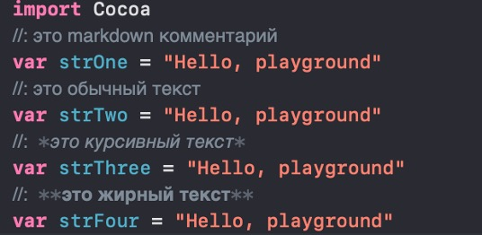
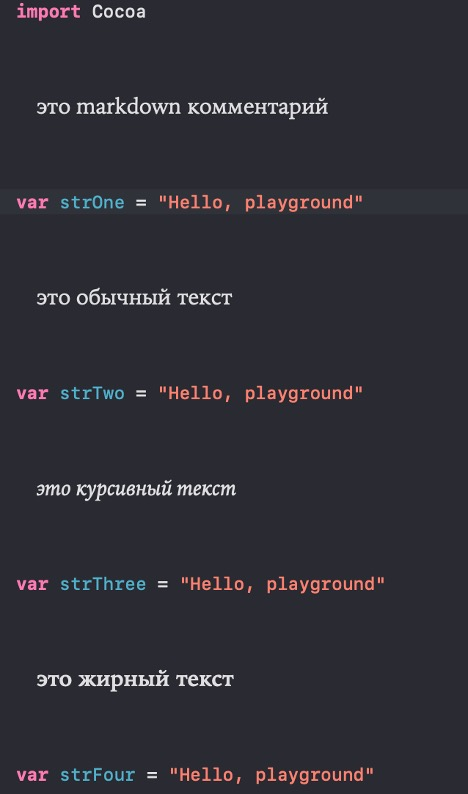

### Swift Manual

### [UIKit notes](https://github.com/artemiosdev/Swift-Manual-my-notes/blob/main/UIKit%20notes.md) - краткий коспект по фреймворку.

***Конспект из разных источников***

<a id="contents" />Оглавление

### Часть I БАЗОВЫЕ ВОЗМОЖНОСТИ SWIFT 

- [Глава №1. Основные понятия. Начало работы с Xcode.](#chapter1)
- [Глава  №2. Фундаментальные типы данных.](#chapter2)

### Часть II КОНТЕЙНЕРНЫЕ ТИПЫ ДАННЫХ 

- [Глава  №3. Кортежи – Tuple.](#chapter3)
- [Глава  №4. Последовательности и Коллекции. ](#chapter4)
- [Глава  №5. Диапазоны Range. ](#chapter5)
- [Глава  №6. Массивы - Array. ](#chapter6)
- [Глава  №7. Множества Set. ](#chapter7)
- [Глава  №8. Словари (Dictionary). ](#chapter8)
- [Глава  №9. Строка — коллекция символов (String). ](#chapter9)

### Часть III. ОСНОВНЫЕ ВОЗМОЖНОСТИ SWIFT 

- [Глава  №10. Операторы управления Basic Control Flow. ](#chapter10)

Из-за ограничений Github, вторая часть конспекта содержится в отдельном файле [READMEpart2.md](https://github.com/artemiosdev/Swift-Manual-my-notes/blob/main/READMEpart2.md) начиная с этой главы

- [Глава  №11. Опциональные типы данных. ](https://github.com/artemiosdev/Swift-Manual-my-notes/blob/main/READMEpart2.md#chapter11)
- [Глава  №12. Функции. ](https://github.com/artemiosdev/Swift-Manual-my-notes/blob/main/READMEpart2.md#chapter12)
- [Глава  №13. Замыкания (closure). ](https://github.com/artemiosdev/Swift-Manual-my-notes/blob/main/READMEpart2.md#chapter13)
- [Глава  №14. Дополнительные возможности. Методы. ](https://github.com/artemiosdev/Swift-Manual-my-notes/blob/main/READMEpart2.md#chapter14)
- [Глава  №15. Ленивые вычисления. ](https://github.com/artemiosdev/Swift-Manual-my-notes/blob/main/READMEpart2.md#chapter15)

### Часть IV ВВЕДЕНИЕ В РАЗРАБОТКУ ПРИЛОЖЕНИЙ

- [Глава  №16. Консольные приложения. ](https://github.com/artemiosdev/Swift-Manual-my-notes/blob/main/READMEpart2.md#chapter16)
- [Глава  №17. Консольные приложение "Угадай число". ](https://github.com/artemiosdev/Swift-Manual-my-notes/blob/main/READMEpart2.md#chapter17)
- [Глава  №18. Введение в объектно-ориентированное и протокол-ориентированное программирование. ](https://github.com/artemiosdev/Swift-Manual-my-notes/blob/main/READMEpart2.md#chapter18)
- [Глава  №19. Перечисления. Синтаксис перечислений. ](https://github.com/artemiosdev/Swift-Manual-my-notes/blob/main/READMEpart2.md#chapter19)
- [Глава  №20. Структуры. Struct. ](https://github.com/artemiosdev/Swift-Manual-my-notes/blob/main/READMEpart2.md#chapter20)
- [Глава  №21. Классы. Class. ](https://github.com/artemiosdev/Swift-Manual-my-notes/blob/main/READMEpart2.md#chapter21)
- [Глава  №22. Свойства. ](https://github.com/artemiosdev/Swift-Manual-my-notes/blob/main/READMEpart2.md#chapter22)
- [Глава  №23. Сабскрипты. ](https://github.com/artemiosdev/Swift-Manual-my-notes/blob/main/READMEpart2.md#chapter23)
- [Глава  №24. Inheritance in classes. ](https://github.com/artemiosdev/Swift-Manual-my-notes/blob/main/READMEpart2.md#chapter24)
- [Глава  №25. Контроль доступа. ](https://github.com/artemiosdev/Swift-Manual-my-notes/blob/main/READMEpart2.md#chapter25)
- [Глава  №26. Псевдонимы Any и AnyObject. ](https://github.com/artemiosdev/Swift-Manual-my-notes/blob/main/READMEpart2.md#chapter26)
- [Глава  №27. Инициализаторы и деинициализаторы. ](https://github.com/artemiosdev/Swift-Manual-my-notes/blob/main/READMEpart2.md#chapter27)
- [Глава  №28. Управление памятью в Swift. Stack and heap. ](https://github.com/artemiosdev/Swift-Manual-my-notes/blob/main/READMEpart2.md#chapter28)

Из-за ограничений Github, третья часть конспекта содержится в отдельном файле [READMEpart3.md](https://github.com/artemiosdev/Swift-Manual-my-notes/blob/main/READMEpart3.md) начиная с этой главы

### ЧАСТЬ V Фреймворки

- [Глава  №29. UIKit. ](https://github.com/artemiosdev/Swift-Manual-my-notes/blob/main/UIKit%20notes.md)
- [Глава  №30. Core Data. ](https://github.com/artemiosdev/Swift-Manual-my-notes/blob/main/READMEpart3.md#coredata)

### ЧАСТЬ VI 

- [Глава №31. Grand Central Dispatch](https://github.com/artemiosdev/Swift-Manual-my-notes/blob/main/READMEpart3.md#gcd)
- [Глава №32. API – Application Programming Interface]()


---

---

[К оглавлению](#contents)
###  <a id="chapter1" /> Глава №1. Основные понятия. Начало работы с Xcode

***[Help > Xcode Help](https://help.apple.com/xcode/mac/11.0/index.html)***

2 июня 2014 года компания представила язык программирования Swift. 

http://online.swiftplayground.run/ онлайн-редактор со встроенным компилятором Swift-кода 

Swift – это тип безопасный язык type-safe, означает, что язык помогает вам четко понимать, с какими типами значений может работать ваш код.

`Control-Command-F` – full-screen 
`Control-Left Arrow` and `Control-Right Arrow` перемещаться между приложениями

In December 2015, Apple released the Swift language
Консоль – это инструмент для ввода текста и отображения для администрирования системы


You can turn on line numbers on the left side of the source editor by clicking Xcode ▸ Preferences... ▸ Text Editing ▸ Line Numbers. 
View ▸ Debug Area ▸ Show Debug Area

IDE (integrated development environment) интегрированная среда разработки

Push notification – это сообщение, отправленное службой Push-уведомлений Apple (APNs) приложению, которое не работает на переднем плане. Уведомление может отображаться как уведомление пользователя или доставляться в автоматическом режиме, позволяя получающему приложению временно проснуться для обработки новых данных.


***Playground*** — это интерактивная среда разработки, своеобразная «песочница», или «игровая площадка», где вы можете тестировать создаваемый вами код и видеть результат его исполнения в режиме реального времени. 

Для создания нового playground-проекта выберите пункт главного меню `File > New > Playground`. Далее вам необходимо выбрать тип Blank, который содержит минимальное количество кода. 

`Option (Alt)` и щелкнуть на любом объекте в области кода, то появится вспомогательное окно, в котором можно узнать тип объекта, а также имя файла, где он расположен 
`.xcodeproj` file, which includes all the settings for your project and its targets. 

Проект, с которым вы работаете, имеет только одну цель: приложение iOS. В файле проекта вы можете изменить все детали конкретной цели. Например, в разделе «Deployment Info» вы можете указать, какая версия iOS ваш код должен поддерживать, изменять, какие устройства ваше приложение поддерживает для запуска или показать / скрыть строку состояния.

При выборе Signing & Capabilities (подписания и возможностей) в верхней части панели вы можете настроить подпись кода, что является требованием для развертывания устройств или в App Store. С этого экрана вы также можете включить различные функции в выбранной цели. Например, если ваша заявка должна принимать push-уведомления, вы можете добавить возможности Push-уведомления (Push Notifications capability), и Xсode настраивает все необходимое для вашего приложения для получения уведомлений из службы Apple Push Notifications. Вы можете добавить конфигурации возможностей, нажав кнопку Capability button +.

Некоторые возможности имеют параметры конфигурации, которые вы можете раскрывать, нажав треугольник рядом с ними

`.storyboard` files уникальны для интерфейса построителя. Они содержат информацию о дизайне каждой сцены в вашем приложении, а также как один экран переходит в другой. 

`.xcassets` file represents an asset catalog. In an asset catalog, you can manage many different kinds of assets. This includes your app's icon, images, color definitions, and другие формы данных, которые должны быть в комплекте с вашим приложением. Каталог активов (asset catalog) также позволяет указывать варианты своих активов на основе настроек и возможностей устройств, таких как светлый и темный внешний вид, настроек доступности для высоких и низких контрастных и аппаратных различий от экрана.

`info.plist` содержит список свойств и настроек для вашего приложения. Xcode предоставляет спец. интерфейс для редактирования этого файла

```bash
Command-B - построить проект.
Command-R - построить и запустить проект.
Command -. - Остановить сборку или запуск
Command - / - Переключить комментарии к выбранным строкам кода
Command - [- Сдвинуть выделенный код влево
Command -] - сдвинуть выделенный код вправо
Control-I - изменить выделение выбранного кода (выравнивает код)
Command-0 - показать и скрыть навигатор.
Option-Command-0 - показать и скрыть инспектор.
```

Чтобы узнать о сочетаниях клавиш, `Xcode> Preferences> Key Bindings`

---

### Какими должны быть размеры изображений в 1x, 2x и 3x в Xcode?
Вам нужно 3 вида изображений в ресурсах изображений, потому что с точки зрения масштабирования или пикселей cуществует 3 вида устройств Apple (iPhone и iPad), которые

-Обычное устройство, которое соответствует 1 pixel = 1 point #1x (более старые устройства iPhone и iPad)

-Устройство Retina, которое соответствует 4 pixels(2 x 2) = 1 point #2x (iPhone 4+)

-Retina iPhone 6 и iPad, которые соответствуют 9 pixels (3 x 3) = 1 point #3x (iPhone 6+)

Таким образом, для предоставления одного и того же изображения в 3 масштабах iOS решает, какое изображение показывать для каких устройств. 


Важно при добавлении изображений в xcode верное именование, чтобы он сразу расставил их по нужным местам, например `Icon-20@2x.png` 

Вот размеры под iphone https://www.paintcodeapp.com/news 

App Icon Generator	https://appicon.co/#image-sets 


Копирование в xcode, зажимаем option и перетаскиваем копию объекта


Exception тоже самое, что и Error.
Deprecated code – неподдверживаемый код.
- Warnings. Writing code that never gets executed (никогда не выполняется)
- Creating a variable that never changes (никогда не меняется)
- Using code that’s out of date (который устарел) or also known as deprecated code (устаревший код)

***Breakpoint***. In the debug area, show the variables view to inspect the current values. Вы увидите паузу программы в точке останова. Это хорошо. В области отладки отобразите представление переменных для проверки текущих значений (кнопка находится в правом нижнем углу). Поскольку строка с точкой останова еще не была выполнена, имена не содержат значений.

Отсюда вы можете использовать кнопки управления шагом в верхней части области отладки, чтобы медленно продолжить выполнение кода:

***Continue*** – возобновляет выполнение кода до тех пор, пока не будет достигнута следующая breakpoint. Если вы нажмете эту кнопку сейчас, код выйдет из строя, так как нет других breakpoint перед третьим name.removeFirst ().

***Step over*** – Перешагнуть – выполняет выбранную строку и приостанавливает выполнение на следующей строке.

***Step into***  –  Шаг внутрь – если щелкнуть строку с вызовом функции, переход к первой строке функции, затем снова останавливает выполнение.

***Step out*** – Выйти – выполняет все оставшиеся строки в вызове функции и приостанавливает выполнение на строке после функции


При исправлении кода, также в этой панели будет положительный результат и все отображения операций. Благодаря breakpoint можно исправлять баги и решать проблемы в app при вылетах или ошибках.

***Действие или IBAction*** соединяет метод в исходном коде и элемент управления в Interface Builder, позволяющий запускать определенный код при взаимодействии пользователя с элементами управления приложения. Например, определенный метод может быть связан с действием, таким как нажатие кнопки или изменение переключателя, taps.

***Холст or Canvas*** относится к фону раскадровки, где вы добавляете и упорядочиваете сцены и элементы пользовательского интерфейса (UI)

***Выход или IBOutlet*** соединяет переменную в исходном коде с объектом в раскадровке, позволяя коду получать информацию от объекта и вносить изменения по мере запуска приложения.

***Файл XIB*** представляет собой одну сцену или представление в iOS и может быть открыт и изменен в Interface Builder. Файлы XIB были более популярны до появления раскадровки в iOS 5.

Контроллер вида (view controller) управляет набором представлений и координирует поток информации между моделью данных приложения и представлениями, отображающими данные.

Контроллер начального вида – это первая сцена, которая будет просмотрена пользователем при запуске приложения. В раскадровках контроллер начального вида отмечен серой ***стрелкой***, но вы также можете установить контроллер начального вида в Attributes inspector для отдельной сцены.
Вы можете изменить view controller, переместив точку входа (стрелка в правой стороне) слева от нужного контроллера просмотра. В настоящее время в этом проекте Main.Storyboard имеет только один контроллер просмотра, поэтому вы не сможете его изменить.

***Identity inspector*** – позволяет редактировать свойства, связанные с идентичностью объекта, например, к какому классу он принадлежит. В этом примере кнопка принадлежит к классу UIButton. Если вы определили пользовательский класс кнопки в другом месте, вы можете использовать инспектор идентификатора, чтобы изменить класс кнопки, которую вы только что добавили. 

***Attributes inspector*** предоставляет список регулируемых визуальных свойств для выбранного элемента. В случае UIButton вы можете изменить такие атрибуты, как текст кнопки, цвет текста, фона и выравнивание. 

***Size inspector*** – позволяет настроить размер и положение выбранного элемента внутри сцены. Вы будете использовать поля x и y - где вверху слева экрана соответствует (0,0) - изменять положение. Значение x становится больше, когда вы перемещаете элемент дальше вправо, а y становится больше, когда вы двигаетесь вниз по экрану. Для UIButton инспектор размера включает в себя дополнительные поля для настройки прокладки вокруг заголовка или изображения кнопки.

***Connections inspector*** перечисляет все функции и имена переменных, относящиеся к объекту, и как они связаны

Если xcode тормозит или выполнение кода зависло, то:

- Завершите процесс зависшего симулятора. Для этого откройте `Программы > Утилиты > Мониторинг системы`, после чего найдите и завершите процесс `com.apple.CoreSimulator. CoreSimulatorService.` 

- Измените платформу playground-проекта с iOS на macOS. Для этого нажмите кнопку Hide or Show the Inspector, расположенную в правом верхнем углу, и в поле Platform выберите необходимый пункт. В этом случае вам надо внести правки в первую строку в редакторе кода: заменить import UIKit на import Foundation, так как библиотека UIKit доступна исключительно в мобильных операционных системах iOS и iPadOS. 

---

### Outlets and Actions
Нужен способ связки ваших визуальных элементов с кодом, чтобы их можно было отрегулировать во время выполнения или когда приложение уже запущено. Эта ссылка из Interface Builder к коду называется ***outlet***. Когда у вас есть объект, c которым вы хотите, чтобы пользователь мог взаимодействовать, вы создаете ***action***– ссылку на кусок кода, который будет выполнен при взаимодействия с ним пользователя (нажатие, переключение) 

***Creating an #Outlet or #Action***.
Control-click the button in the storyboard, and start dragging toward the assistant editor pane that contains the ViewController class definition. As you drag the pointer into the code, you see a blue line.


Имя которое мы даем выше в появляющимся окне, сохраняется внутри кода и связывается с объектом, все это под капотом, поэтому нельзя просто так изменять имя в коде, будет ошибка. Необходимо удалить привязку, для этого нажимаем правую клавишу (тап с 2 пальцами) и удаляем привязку.


Или безопасно переименовать из меню


Все свойства из Interface Builder можно применить программно, явно прописав их в коде, есть свойства которых нет в Interface Builder и они указываются только программно. Например:

`UIScrollView` has a contentSize property that does not have a matching option in the Attributes inspector.
`scrollView.contentSize = CGSize(width: 100, height: 100)`

### Основные понятия работы компьютера
Все элементы компьютера в общем случае можно разделить на три основных функциональных уровня аппаратный, операционной системы и программный. 

Аппаратный уровень представлен физическим оборудованием компьютера. Это та основа, на которой базируются остальные уровни. Самые важные элементы аппаратного уровня — это центральный процессор (CPU, Central Processing Unit) и оперативная память. 

Данные, с которыми работает процессор, хранятся во временном хранилище — оперативной памяти.

Оперативная память — это основное средство хранения данных, используемое программами в ходе их функционирования. Память компьютера состоит из миллионов отдельных ячеек, каждая из которых может хранить небольшой объем информацию. Каждая ячейка имеет уникальный адрес, по которому ее можно найти в памяти. Но размер ячейки не позволяет хранить в ней большое количество данных, по этой причине ячейки логически объединяются в хранилища данных.

Хранилище может объединять произвольное количество ячеек, его размер определяется количеством записанной информации и при необходимости может изменяться. Как и ячейка памяти, хранилище имеет уникальный адрес, по которому может быть получено хранящееся в нем значение (обычно он соответствует адресу первой входящей в него ячейки) 


Оперативная память хранит нужные данные так долго, как этого требует ваше приложение (ограничиваясь лишь временем, пока оно запущено). Для постоянного (долговременного) хранения информации используются др. элементы аппаратного уровня, например HDD или SSD. 

Операционная система (ОС) — это посредник между вашей программой и аппаратной частью. 

Программный уровень — это все программы, которые работают на вашем компьютере в среде операционной системы. 


Хранилище данных это виртуальный объект со свойствами: 
- записанное значение; 
- идентификатор (имя); 
- тип информации, для хранения которой предназначено хранилище (числовой, строковый и др.). 

Практически весь процесс программирования заключается в том, чтобы создавать (объявлять) объекты, задавать (инициализировать или рисваивать) им значения, получать эти значения из памяти и производить с ними операции. 

Объявление — это создание нового объекта (хранилища данных). 

Инициализация — это присвоение значения объекту. 

```bash
СоздатьХранилище с именем value1 и значением 23
СоздатьХранилище с именем value2 и значением 145
СоздатьХранилище с именем result и значением value1 * value2 // 3335
```


Хранилища данных могут содержать в себе не только цифры, но и другие виды информации (текстовую, графическую, логическую и др.). Виды информации в программировании называются типами данных. При объявлении хранилища ему всегда назначается тип данных, определяющий, какие именно данные будут храниться в нем. 

***Выражение*** — команда, выполняющая одну или несколько операций. Выражение может состоять из множества операторов и операндов. 

***Оператор*** — это минимальная независимая функциональная единица (символ, слово или группа слов), выполняющая определенную операцию. 

***Операнд*** — это значение, с которым оператор производит операцию.

```swift
import UIKit
var str = "Hello, playground"
```

С помощью ключевого слова (оператора) var объявляется новое хранилище данных с именем str. Этому хранилищу инициализируется (присваивается) текстовое значение Hello, playground. Этот процесс и называется инициализацией значения с помощью оператора `= (присваивания)`. 

---

### Классификация операторов operators
The values that #operators affect are operands. In the expression 1 + 2, the + symbol is a binary operator and its two operands are the values 1 and 2.

Простые операторы, выполняющие операции со значениями (операндами). В их состав входят унарные и бинарные операторы. 

-Unary operators operate on a single target (`-a`). Unary prefix operators (`!b`), and unary postfix operators (`c!`).

```swift
let three = 3 
let minusThree = -three // minusThree equals -3 
let plusThree = -minusThree // plusThree equals 3, or "minus minus three"
```
***Унарные операторы*** выполняют операцию с одним операндом. Они могут находиться перед операндом (префиксные) или после него (постфиксные). 

Оператор `var`, с помощью которого объявляется хранилище данных, или оператор минус (`-a`), с помощью которого создаются отрицательные числа, являются унарными префиксными. 

***Постфиксные операторы***, например, многоточие (`...`) в выражении `1...` указывает на все целые числа после единицы. ***Префиксные операторы*** `…5`

***Бинарные операторы*** выполняют операцию с двумя операндами. Оператор, который располагается между операндами, называется ***инфиксным***. Binary operators operate on two targets (`2 + 3`)

***Оператор инициализации*** (`=`) и ***оператор сложения*** (`+`) являются бинарными инфиксными, так как использует в работе два операнда и находятся между ними (`value1 = 12 или 34+12`). 

***Структурные операторы*** влияют на ход выполнения программы. Например, останавливают выполнение программы при определенных условиях или указывают программе, какой блок кода должен быть выполнен при определенных условиях. -***Ternary operators operate*** on three targets. the ternary conditional operator (`a ? b : c`).

***Оператор инициализации (присваивания)*** (`=`) — это бинарный оператор. Он используется в типовом выражении `a = b`, присваивая хранилищу данных с именем `a` значение хранилища данных с именем `b`. В листинге объекту `str` инициализируется текстовое значение Hello, playground 

Assignment operator – оператор присваивания = 
initializes or updates the value of a with the value

```swift
let b = 10 
var a = 5 
a = b     // a is now equal to 10 
```
Если правая часть присваивания представляет собой кортеж с несколькими значениями, его элементы можно разложить на несколько констант или переменных одновременно:

```swift
let (x, y) = (1, 2)       // x is equal to 1, and y is equal to 2
```

***переменные***, объявляемые с помощью ключевого слова `var`;

***константы***, объявляемые с помощью ключевого слова `let`. 

---

### Naming data. Variables
When you know you’ll need to change some data, you should use a variable

```swift
var variableNumber: Int = 42
variableNumber = 0
variableNumber = 1_000_000
```

Переменные для хранения значений, которые могут изменяться в ходе выполнения кода. 

***Переменная*** — это хранилище данных, значение которого может быть многократно изменено разработчиком в процессе работы программы. 

   `var имяПеременной = значениеПеременной`

Имя несет в себе type annotation, которая указывает, к какому типу данных относится это имя, например, текст, числа или дата

---

### Constants
```swift
let number: Int = 10
var anotherNumber = number
anotherNumber = 30 + number
```

This declares a constant called number which is of type Int. Then it sets the value of the constant to the number 10.

Константа присвоить значение можно только один раз. Все последующие попытки изменить его вызовут ошибку. 

Константы объявляются с помощью оператора let. 
   `let имяКонстанты = значениеКонстанты`

**Константы** – базовое средство оптимизации используемых мощностей. Поэтому если инициализированное значение не планируется изменять, программисты всегда должны использовать константы. Константы для хранения значений, которые не должны и не будут изменяться в ходе выполнения кода. 

Имя пользователя. 
  `let username = "Artem"`

Устройство, на котором запущено приложение. 
  `let phoneModel = "iPhone 15"`

Объявление нескольких параметров в одном выражении 
При объявлении нескольких параметров вы можете использовать один оператор – `var` или `let` и через запятую попарно указать их имена и инициализируемые значения.

```swift
let friend1 = "John", friend2 = "Helga"
var age1 = 54, age2 = 25
var x = 0.0, y = 0.0, z = 0.0
```

---
### Type inference – Вывод типа
Вывод типа. Swift использует вывод типов для определения типа объекта на основе доступной информации, даже если имя типа явно не выражено словами в коде. Например, если объявлена функция, возвращающая `String`, например `func answer() -> String`, и константа инициализируется результатом `func answer`, например `let nextIdea = answer()`, тип `nextIdea` будет выведен как `String`.

Вывод типа – когда swift сам понимает какой тип данных вы назначили в `var` or `let`, т.е без явного указания. Неявное объявление. Вам не нужно объявлять константы или переменные как Bool/Int/Double и тп, если вы устанавливаете для них значение сразу после их создания. Вывод типа помогает сделать код Swift более кратким и читаемым, когда он инициализирует константы или переменные другими значениями, тип которых уже известен.

Как только вы назначаете значение `let` или `var`, тип устанавливается и не может быть изменен. Значение `var` может измениться, но не его **тип**.

***Нельзя поменять тип присвоенного значения, можно переконвертировать в другое, но не изменить, так как он уже назначен.***

Три примера для использования type annotation:

1. When you create a constant or variable but не назначаете it a value.
```swift
let firstName: String
//... 
firstName = “Layne”
```

2. When you create a constant or variable that could be предполагать as more than one type.
```swift
let middleInitial: Character = “J”
// “J” would be inferred as a `String`, but we want a `Character` 
 
var remainingDistance: Double = 30
// `30` would be inferred as an `Int`, but the variable should support decimal numbers for accuracy as the number decreases. 
```

3. When you write your own type definition.
```swift
struct Car {
  var make: String
  var model: String
  var year: Int
}
```

Чтобы узнать тип нажимаем `Option` и кликаем на имя.

This uses a new keyword you haven’t seen before, `as`. It also performs a type conversion. Это также выполняет преобразование типа явно в `Double`

```swift
let actuallyDouble = 3 as Double // тип Double
```

---
### Инициализация копированием 
Инициализацию значения любых параметров (переменных и констант) можно проводить, указывая в правой части выражения не только конкретное значение, но и имя другого параметра

```swift
let myAge = 40
var yourAge = myAge
yourAge
```

Таким образом вы создаете ***копию*** исходного значения, то есть в результате операции будет объявлена константа и переменная с двумя независимыми значениями. Изменение одного из них не повлияет на другое. 

Тип данных параметра, который обеспечивает передачу значения **копированием, называется #value type** (значимый тип, или тип-значение). 

Помимо передачи значения копированием, существует **передача ссылки на значение**, когда несколько параметров содержат в себе **ссылку на одно и то же значение, хранящееся в памяти**. Тип данных, который обеспечивает передачу значения **ссылкой, называется #reference type (ссылочный тип, или тип-ссылка)**. При этом изменение значения через любой из параметров отразится и на всех копиях-ссылках. Другими словами, параметры ссылочного типа устанавливают для ячейки памяти несколько имен.

**Кодовые сниппеты** – это шаблоны, позволяющие быстро создавать типовые конструкции. 

Библиотеку кодовых сниппетов можно открыть с помощью кнопки с изображением символа `+`, расположенной в верхней части `Xcode Playground`.

---

### Область видимости (scope) 

У каждого объекта есть область его применения, или, другими словами, область видимости #scope, которая определяет, где именно данный объект может быть использован. Например, область видимости объекта может быть ограничена файлом или отдельным блоком кода. 

По области видимости объекты можно разделить на два вида: 

**Глобальные** — это объекты, доступные в любой точке программы. 

**Локальные** — это объекты, доступные в пределах родительского объекта. 


Объекты `User` и `Friend` объявлены непосредственно в корне программы. Такие объекты называются глобальными, они доступны в любой точке программного кода. 

Каждый из глобальных объектов из примера выше содержит внутренние, локальные по отношению к нему, объекты: 
- В составе `User` есть объект `login`; 
- В составе `Friend` есть два объекта: `name` и `surname`. 
Локальные объекты доступны только в пределах своего контекста, то есть родительского объекта. 

---
### Комментарии и Markdown
#Markdown-комментарии должны начинаться с двойной косой черты и двоеточия (`//:`), после которых следует текст комментария. 

Включить форматирование комментариев, при котором все markdown-комментарии отобразятся в красивом и удобном для чтения стиле, можно, выбрав в меню Xcode пункт `Editor > Show Rendered Markup`. 

Вернуть markdown-комментарии к прежнему неформатированному виду можно, выбрав в меню пункт `Editor > Show Raw Markup`.

```swift 
// This is also a comment.
// Over multiple lines

/* This is also a comment.
   Over many..
   many...
   many lines. */
```





Переданное в функцию значение используется внутри нее и в ее пределах называется входным параметром. 

Не стоит путать понятия аргумент функции и входной параметр.

***Аргумент функции*** – то, что передается в функцию в скобках при ее вызове

***Входной параметр*** – то, что используется внутри функции. 

По сути, это может быть одно и то же значение, но во время вызова функции — это аргумент, а в теле функции — это параметр. 

Каждая функция имеет сигнатуру, то есть краткое описание. Сигнатура содержит информацию об имени функции, ее аргументах и возвращаемом функцией значении. Она может быть в одной из трех форм: 

1. Полная, с указанием типов данных:  
     `someFunction(a:String, b: String) -> String`
2. Стандартная, без указания типов данных:  
     `someFunction(a: b:)`
3. Краткая, с указанием только имени функции:  
     `someFunction`

Если функция принимает входные аргументы, то это отражается в сигнатуре. 

`print(_:)` описывает функцию с именем print, которая принимает один входной безымянный аргумент. 

`anotherFunction(name:)` описывает функцию с именем anotherFunction, которая принимает один аргумент с именем name. 

`someFunction(a:b:)` описывает функцию с именем someFunction, которая имеет два вход- ных аргумента с именами a и b. 

`myFunction()` описывает функцию с именем myFunction, которая не имеет аргументов. может служить функция print(_:)). 

Таким образом сигнатура кратко описывает не только название функции, но и ее аргументы. 
Если аргумент не имеет имени, то вместо его имени ставится нижнее подчеркивание ` _ `

Таким образом, сигнатура `goodFunction(_: text:)` указывает на функцию с именем goodFunction, которой нужны два аргумента: первый не имеет имени, а второй должен быть передан с именем text. 

Пример вызова функции `goodFunction (_: text:)`

`goodFunction(21, text: "Hello!")`

Cуществует возможность объединить вывод текстовой информации со значением некоторого параметра (или параметров). Для этого используется символ обратной косой черты (слеша) ` \(…)`, после которого в круглых скобках нужно указать имя выводимого параметра

```python
let bar = "Swift"
print("Я изучаю \(bar)") // Я изучаю Swift
```

---
[К оглавлению](#contents)
###  <a id="chapter2" /> Глава №2. Фундаментальные типы данных 

Тип данных определяет вид информации, которая может храниться в параметре. Например, параметр со строковым типом данных сможет хранить только строковые значения. 

Если точнее, то ***тип данных*** — это множество всех возможных значений, а также операций над ними. Например, если у параметра числовой тип данных, то ему может быть присвоено числовое значение, с которым можно проводить математические операции (сложение, вычитание, деление, умножение и т. д.). Воспринимайте типы данных как абстракции, шаблоны, на основе которых создаются конкретные значения. Например, на основе типа данных «целое число» можно создать значения 2, 17, 36. Сам по себе тип «целое число» лишь выделяет диапазон возможных значений, но не несет никакой конкретики, никакой точной величины. 
Если мы говорим о какой-то типовой фигуре (о квадрате или о шаре в широком смысле), то говорим о типе данных; если мы говорим о конкретной фигуре (этот большой зеленый куб), расположенной перед нами, то говорим о конкретном значении этого типа. 

Тип данных определяет не только характеристики объекта, но и то, что с ними можно делать. Так, круг можно катить, а квадрат и прямоугольник устойчиво устанавливать друг на друга. 

Тип данных — это множество возможных значений и операций с этими значениями. В Swift типы данных определяют: 
- значения, которые хранятся в параметрах: целые числа, дробные числа, строки и отдельные символы, логические значения или другой вид информации; 
- операции, которые с этими значениями можно произвести: числа складывать или вычитать, строки объединять между собой и т. д. 

### Предназначение типов данных
Операция, в которой Swift самостоятельно определяет тип объявляемого параметра, основываясь на переданном значении, называется неявным определением типа. 

В противовес неявному определению существует явное, когда разработчик сам указывает тип данных объявляемого параметра. 

При явном (непосредственном) определении типа переменной или константы после имени ставится двоеточие и с помощью ключевого слова указывается тип данных. 

```swift
// создаем переменную orksName с неявным определением типа String
var orksName = "Artem"
// создаем переменную elfsName с явным определением типа String
var elfsName: String = "Tema"
```

Swift — язык со строгой типизацией. Однажды определив тип данных переменной или константы, вы уже не сможете его изменить. В каждый момент времени вы должны четко представлять, с каким типом значения работает ваш код. 
Все фундаментальные типы данных (строковые, числовые, логические и т. д.) являются значимыми (value type), то есть их значения передаются копированием. При передаче значения переменной или константы значимого типа в другую переменную или константу происходит копирование этого значения, в результате чего мы получаем два независимых параметра. 

```swift
// неявно определим параметр целочисленного типа данных
var variableOne = 23
// явно определим параметр целочисленного типа данных
// после чего передадим ему значение другого параметра в качестве первоначального
let variableOneCopy: Int = variableOne
print(variableOneCopy)       // 23
// изменим значение в первой переменной
variableOne = 25
print(variableOneCopy)      // 23
print(variableOne)              // 25
```

В данном примере хранилище `variableOne` — значимого типа. При передаче значения, хранящегося в variableOne, в новую переменную `variableOneCopy` создается полная независимая копия. Никакие изменения, вносимые в variableOne, не повлияют на значение, хранящееся в variableOneCopy. 

### Числовые типы данных 
Для объявления переменной или константы целочисленного типа используются ключевые слова `UInt` (для хранения только положительных значений) и `Int` (для хранения как положительных, так и отрицательных значений). 

```swift
// объявим переменную знакового целочисленного типа и присвоим ей значение
var signedNum: Int = -32
// объявим константу беззнакового целочисленного типа
// и проинициализируем ей значение
let unsignedNum: UInt = 128
```

В результате выполнения кода вы получите переменную signedNum целочисленного знакового типа Int со значением –32, а также константу unsignedNum целочисленного беззнакового типа UInt со значением 128. 

Разница между знаковыми и беззнаковыми целочисленными типами в том, что значение знакового типа данных может находиться в интервале от –2^n–2 до +2^n–2, а беззнакового — от 0 до +2^n–1, где n — разрядность типа данных (8, 16, 32 или 64). 

В Swift существуют дополнительные целочисленные типы данных: `#Int8, UInt8, Int16, UInt16, Int32, UInt32, Int64 и UInt64`. Они определяют диапазон возможных значений, хранимых в параметрах: 8, 16, 32 и 64-битные числа. 
***Все операции в Swift должны происходить между значениями одного и того же типа данных!*** 

A whole lot of number types. Множество числовых типов
For whole numbers, you can use the явно подписаные types Int8, Int16, Int32, Int64. These types потребляют 1, 2, 4, and 8 bytes для хранения. Each of these types use 1 bit to represent the sign.
Если вы имеете дело только с неотрицательными значениями, существует набор явных типов без знака, которые вы можете использовать. К ним относятся `#UInt8, UInt16, UInt32 and UInt64`.


***Float*** без веских причин лучше не использовать, лучше ***Double***. Float занимает вдвое меньше места чем Double, он имеет меньший диапозон и точность. Double имеет точность не менее 15 десятичных цифр, тогда как точность Float может составлять всего 6 десятичных цифр.В Swift всегда выбирай Double (а не Float).

Double represents a 64-bit floating-point number.
Float represents a 32-bit floating-point number.


```swift
let a: Int16 = 12
let b: UInt8 = 255
let c: Int32 = -100000
let answer = Int(a) + Int(b) + Int(c)   // answer is an Int

let anotherPi = 3 + 0.14159   // anotherPi is also inferred to be of type Double

let minValue = UInt8.min // minValue is equal to 0, and is of type UInt8 
let maxValue = UInt8.max // maxValue is equal to 255, and is of type UInt8
```

Cвойства `#min` и `#max`. Для примера получим максимально и минимально возможные значения для типов Int8 и UInt8 

```swift
// минимальное значение параметра типа Int8
let minInt8 = Int8.min // -128
// максимальное значение параметра типа Int8
let maxInt8 = Int8.max // 127
// минимальное значение параметра типа UInt8
let minUInt8 = UInt8.min // 0
// максимальное значение параметра типа UInt8
let maxUInt8 = UInt8.max // 255
```

так как тип данных UInt8 является беззнаковым и не предназначен для хранения отрицательных чисел, то и максимально возможное значение будет 255 вместо 127 у знакового Int8. 

### Объектные возможности Swift 
Swift обладает одной особенностью: всё в этом языке программирования является ***объектами***. 

Объект — это сущность, описанная кодом, объединяющая данные и действия, которые с этими данными можно совершить.

Например, объектом является цифра 2 или продуктовый автомат, если, конечно, он описан языком программирования. Каждая сущность обладает набором характеристик (называемых свойствами) и запрограммированных действий (называемых методами). Каждое свойство и каждый метод имеют имя, позволяющее использовать их. Так, например, у объекта продуктовый автомат могло бы существовать свойство вместимость и метод выдать товар, а у целого числа 2 свойство максимально возможное хранимое число и метод преобразовать в строку. 

Доступ к свойствам и методам объекта в Swift осуществляется с помощью их имен, написанных через точку после имени объекта, к примеру: 

`ПродуктовыйАвтомат.максимальнаяВместимость`

`ПродуктовыйАвтомат.выдатьТовар("шоколадка")`

***Метод*** — это та же функция, но описанная и используемая только в контексте определенного объекта. 

### Числа с плавающей точкой 

Помимо целых чисел, при разработке приложений вы можете использовать дробные числа. Например, 3.14 и -192.884022. 

Дробные числа в программировании также называются числами с плавающей точкой

Для хранения дробных чисел в большинстве случаев используются всего два типа данных: Float и Double, оба являются знаковыми (позволяют хранить положительные и отрицательные значения). 

`#Float` — позволяет хранить 32-битное число с плавающей точкой, содержащее до 6 знаков в дробной части. Float, сокращенно от слова с плавающей запятой, который хранит десятичные дроби с меньшей точностью, чем Double.

`#Double` — позволяет хранить 64-битное число с плавающей точкой, содержащее до 15 знаков в дробной части. Тип Double, хранит десятичные дроби (Decimal point ) с высокой точностью.

```swift
// дробное число типа Float с явным указанием типа
let numFloat: Float = 104.3
// дробное число типа Double с явным указанием типа
let numDouble: Double = 8.36
// дробное число типа Double с неявным указанием типа
let someNumber = 8.36
```

Обратите внимание, что тип константы someNumber задается неявно (с помощью переданного дробного числового значения). При передаче дробного значения без явного указания типа Swift **всегда самостоятельно определяет для параметра тип данных Double**. 

Фактически, точность Double примерно вдвое выше, чем у Float, поэтому она и называется Double. Float занимает меньше памяти, чем Double, но, как правило, использование памяти для чисел не является большой проблемой, и вы увидите, что Double используется в большинстве случаев.
После того, как вы объявили константу, вы не сможете изменить ее данные. 

```swift
let pi: Double = 3.14159
// варианты объявления
let actuallyDouble = Double(3)
let actuallyDouble: Double = 3
let actuallyDouble = 3 as Double
let wantADouble = 3.0
```

### Операторы
`%` бинарный оператор вычисления остатка от деления двух целочисленных значений. Тип результирующего значения соответствует типу операндов. 

Add: +
Subtract: -
Multiply: *
Divide: /

Integer – целое число, signed знаковые (positive, zero, or negative) or unsigned беззнаковые (positive or zero).
Когда вы используете оператор деления (/) для значений Int, результатом будет значение Int, округленное в меньшую сторону до ближайшего целого числа, поскольку тип Int поддерживает только целые числа, при использовании Double результат будет естественно дробный

```swift
let x = 51
let y = 4
let z = x / y // z has a value of 12
= assign a value, назначение значения
let name = “Artem”
```

The remainder operation or modulo operation. Оператор остатка %

В Swift есть специальный оператор #remainder #остатка в виде %, который используется для возврата остатка после полного деления одного числа на другое. Например, 14 % 3 равно 2, потому что вы можете уместить четыре тройки в 14, а затем у вас останется остаток 2. 14 - (4*3) = 14 - 12 = 2

```swift
let res = 19 % 4   // 3
let dividend = 10
let divisor = 3
let quotient = dividend / divisor // quotient has a value of 3
let remainder = dividend % divisor // remainder has a value of 1
```

You can calculate the remainder as dividend - (quotient * divisor)

Также в Swift существует функция вычисления остатка от деления, при которой первый операнд делится на второй и возвращается остаток от этого деления. Другими словами, программа определяет, как много значений второго операнда поместится в первом, и возвращает значение, которое осталось, — оно называется остатком от деления; остаток от деления всегда меньше делителя 

При использовании оператора вычисления остатка от деления (%) есть одно ограничение: он используется только для целочисленных значений. 

```swift
-9 % 4 // equals -1
```
`a % b` and `a % -b` всегда дают одинаковый ответ, `b` игнорирует минус

**Оператор остатка выше приоритетом** над * и /, он также полезен для вычисления таких вещей, как нечетные и четные числа – если вы хотите, чтобы альтернативные строки вашей таблицы были немного другого цвета:

```swift
for i in 1...10 {
    if i % 2 == 0 {
        print("Number is even")
    } else {
        print("Number is odd")
    }
}
let testNumber: Int = 46
let evenOdd: Int = testNumber % 3 // 1
```

Операция вычисления остатка от деления очень удобна в тех случаях, когда нужно проверить, является ли число четным или кратным какому-либо другому числу. Как определить четность? Очень просто: делите число на 2, и если остаток равен 0, то оно четное. 

Для определения #четности можно использовать специальный метод  
`#isMultiple(of: )`, применяемый к анализируемому числу. 

`(28.0).truncatingRemainder(dividingBy: 10.0)      // 8`

`.#truncatingRemainder(dividingBy: )` возвращает остаток от этого значения, деленный на заданное значение с использованием усекающего деления.

Для вычисления остатка от деления дробных чисел используется метод который применяется к делимому (то есть пишется через точку после числа, которое требуется разделить)

```swift
// дробные константы
let firstFloat: Float = 3.14
let secondFloat: Float = 1.01

// операция получения остатка от деления
let result1 = firstFloat.truncatingRemainder(dividingBy: secondFloat)  // 0.1100001

let result2 = -firstFloat.truncatingRemainder(dividingBy: secondFloat)  // -0.1100001

let result3 = firstFloat.truncatingRemainder(dividingBy: -secondFloat)  // 0.1100001
```

Type describes a set of values and the operations that can be performed on them. Тип описывает набор значений и операции, которые могут быть выполнены на них

### Operators with mixed types
What if you have an integer that you want to multiply by a double?
Вы не можете применять операторы к смешанным типам, нужно приведение к одному типу

`let hourlyRate: Double = 19.5`

`let hoursWorked: Int = 10`

Do you want the result to be an Int, converting the Double to an Int before performing the multiplication? Or do you want the result to be a Double, converting the Int to a Double before performing the multiplication? You need to tell Swift you want it to consider the hoursWorked constant to be a Double, so:
```swift
let totalCost: Double = hourlyRate * Double(hoursWorked) // 195
let totalCost: Int = Int(hourlyRate) * hoursWorked // 190 
```

### Increment and decrement or compound Assignment

```swift
var counter: Int = 0
counter += 1 // counter = 1
// тоже что и counter = counter + 1
counter -= 1 // counter = 0

var counter: Int = 0
counter = counter + 1
counter = counter - 1
```

Similarly, the `*=` and `/=` operators do the equivalent for multiplication and division :
```swift
counter = 10
counter *= 3  // same as counter = counter * 3
counter /= 2 // same as counter = counter / 2
```

### Процент от числа
Imagine that partway through the day a user has taken 3,467 steps out of the 10,000 step goal. Create constants steps and goal. Both will need to be of type Double so that you can perform accurate calculations. steps should be assigned the value 3,467, and goal should be assigned 10,000. Create a constant percentOfGoal that equals an expression that evaluates to the percent of the goal that has been achieved so far.
```swift
let steps1:Double = 3467
let goal1: Double = 10_000
let percentOfGoal1 = steps / goal * 100 //34.67

let steps2: Int = 4550
let goal2: Int = 6000
let percentOfGoal3 = Double(steps) / Double(goal) * 100 // 75.83
```

В Swift отсутствуют довольно популярные в других языках операторы `инкремента (++)` и `декремента (--)`, увеличивающие и уменьшающие значение на единицу соответственно. Использование составного оператора является заменой операторам инкремента и декремента, которую предлагает нам Apple. 
Составной оператор присваивания 

```swift
// переменная типа Int
var count = 19
// прибавим к ней произвольное число
count += 5 // 24
/* эта операция аналогична выражению
count = count + 5 */
// умножим его на число 3
count *= 3 // 72
/* эта операция аналогична выражению
count = count * 3 */
// вычтем из него число 3
count -= 3 // 69
/* эта операция аналогична выражению
count = count - 3 */
// найдем остаток от деления на 8
count %= 8 // 5
/* эта операция аналогична выражению
count = count % 8 */
```

Есть также крайне редкий оператор принадлежности числа к какому-либо диапазону. Сначала идет диапозон затем оператор и проверяемая переменная.
```swift
// ~= 
let x: Int = 10
if 1...11 ~= x {
    print(x)
}
```

Важно помнить, что типы значений при этом должны быть одинаковыми. 

```swift
// целочисленные константы
let numOne = 19
let numTwo = 4
// константы, имеющие тип числа с плавающей точкой тип Double
let numThree = 3.13
let numFour = 1.1

// операция сложения
let sum = numOne + numTwo // 23
// операция вычитания
let diff = numOne - numTwo // 15
// операция умножения
let mult = numOne * numTwo // 76
// операция деления
let qo = numOne / numTwo   // 4
```

Каким образом при делении константы равной 19, на константу равную 4, могло получиться 4? По логике результат деления должен был получиться равным 4,75! 
Ответ кроется в типе данных. Обе переменные имеют целочисленный тип данных Int, а значит, результат любой операции также будет иметь тип данных Int. При этом у результата деления просто ***отбрасывается дробная часть и никакого округления не происходит***. 

```swift
// операция сложения
let sumD = numThree + numFour  // 4,23
// операция вычитания
let diffD = numThree - numFour // 2,03
// операция умножения
let multD = numThree * numFour // 3,443
// операция деления
let qoD = numThree / numFour   // 2,84545454545455
```

### Shift operations. The shift left and shift right operations.Оператор сдвига
#Shift operations. Операции #сдвига влево и вправо принимают двоичную форму десятичного числа и сдвигают цифры влево или вправо, соответственно. Затем они возвращают новое двоичное число в десятичной форме. Например, десятичное число 14 в двоичном формате, дополненное до 8 цифр, будет равно 00001110. Сдвиг его влево на два разряда дает 00111000, что в десятичном формате составляет 56. Вот иллюстрация этого: 


Цифры, которые заполняют пустые места справа, становятся 0. Цифры, которые выпадают с конца слева, теряются.
Сдвиг вправо такой же, но цифры сдвигаются вправо.
Операторы для этих двух операций следующие:

```swift
Shift left: <<
1 << 3     // 8
Shift right: >>
32 >> 2   // 8 
```

Одна из причин использования сдвигов состоит в том, чтобы сделать умножение или деление более мощнее для двух простых чисел. Обратите внимание, `shifting left` на одного тоже, что и умножение на два, `shifting left` на два такое же, как умножение на четыре, и так далее.

Аналогичным образом, `Shift right` на одного тоже, что разделить на два, `Shift right` вправо на два, так же, как разделяться на четыре, и так далее.

В старые времена код часто использовал этот трюк, потому что переключение битов намного проще для процессора, чем сложное умножение и арифметики. Поэтому код был быстрее, если он использовал переключение.

These compute the #maximum and #minimum of two numbers 
respectively.
```swift
max(5, 10)     // 10
min(-5, -10)   // -10
```

### Приведение числовых типов данных 
Type #conversion. Стоит отметить, что на самом деле приведенные далее глобальные функции являются специальными методами-инициализаторами типов данных. Ранее мы говорили, что любые значения — это объекты и у них существуют запрограммированные действия — методы. У каждого типа данных есть специальный метод, называемый инициализатором. Он автоматически вызывается при создании нового объекта, а так как в результате вызова объекта «числовой тип данных» создается новый объект — «число», то и метод-инициализатор срабатывает. 

Инициализатор имеет собственное фиксированное обозначение — init, и для создания нового объекта определенного типа данных он вызывается так: 
`ИмяТипаДанных.init(_:)` 
например:  
`let numObj = Int.init(2) // 2`

В результате создается константа `numObj` целочисленного знакового типа Int со значением 2. 

С помощью вызова метода `#init(_:)` создается новый объект, описывающий некую сущность, которая соответствует используемому типу данных (число, строка и т. д.). Swift упрощает разработку, позволяя не писать имя метода-инициализатора:  
`ИмяТипаДанных(_:)`
например:  
`let numObj = Int(2) // 2`

В результате выполнения данного кода также будет объявлена константа типа Int со значением 2.
`Int(_:)` — преобразовывает переданное значение к типу данных Int. 

`Double(_:)` — преобразовывает переданное значение к типу данных Double. 

`Float(_:)` — преобразовывает переданное значение к типу данных Float. И для преобразования чисел в другие типы данных также используйте функции, совпадающие по названиям с типами. 

### Type conversion – превращение, конвертация

Вы не можете применять #конвертацию, к смешанным типам, необходимо приведение к одному типу
You need to say that you want to convert the type explicitly, явно

```swift
var integer: Int = 100
var decimal: Double = 12.5
integer = Int(decimal)          // 12 
```
Значения с плавающей запятой всегда усекаются, когда они используются для инициализации нового целочисленного значения таким образом. Это означает, что 4,75 превращается в 4, а -3,9 становится -3.

```swift
// переменная типа Int
let numberInt = 19
// переменная типа Double
let numberDouble = 3.13
// операция перемножения чисел
let resD = Double(numberInt) * numberDouble // 59,47
let resI = numberInt * Int(numberDouble)    // 57
```

### Способы записи числовых значений 
```swift
let decimalInteger = 17 
let binaryInteger = 0b10001      // 17 in binary notation 
let octalInteger = 0o21              // 17 in octal notation 
let hexadecimalInteger = 0x11  // 17 in hexadecimal notation 
```
-For decimal numbers

1.25e2 means 1.25 x 102, or 125.0.
2.
1.25e-2 means 1.25 x 10-2, or 0.0125.

-For hexadecimal numbers 

0xFp2 means 15 x 22, or 60.0.

0xFp-2 means 15 x 2-2, or 3.75.

Для удобства чтения можно делать так:
```swift
let paddedDouble = 000123.456 
let oneMillion = 1_000_000 
let justOverOneMillion = 1_000_000.000_000_1
```

Двоичная. Записываются с использованием префикса 0b перед числом. 

Восьмеричная. Числа записываются с использованием префикса 0o перед числом. 

Шестнадцатеричная. Числа записываются с использованием префикса 0х перед числом. 

Десятичная. Числа записываются без использования префикса в привычном и понятном для нас виде. 

```swift
// 17 в десятичном виде
let decimalInteger = 17
// 17 в двоичном виде
let binaryInteger = 0b10001
// 17 в восьмеричном виде
let octalInteger = 0o21
// 17 в шестнадцатеричном виде
let hexadecimalInteger = 0x11
```

Помимо этого, Swift позволяет использовать экспоненту. Для этого применяется символ `e` для десятичных чисел и символ `p` для шестнадцатеричных. 

Для десятичных чисел экспонента указывает на степень десятки: 1.25e2 соответствует 1,25 × 10^2, или 125,0. 
Для шестнадцатеричных чисел экспонента указывает на степень двойки: 0xFp-2 соответствует 15 × 2^–2, или 3,75. 

```swift
// десятичное число
let deciamlDouble = 12.1875 // 12,1875
// десятичное число с экспонентой
// соответствует выражению
// exponentDouble = 1.21875*101
let exponentDouble = 1.21875e1 // 12,1875 // шестнадцатеричное число с экспонентой // соответствует
// выражению hexadecimalDouble = 0xC.3*20 let hexadecimalDouble = 0xC.3p0 // 12,1875 
```

Для визуального отделения порядков числа можно использовать символ нижнего подчеркивания (underscore) 
```swift
let number = 1_000_000 // 1000000
let nextNumber = 1000000 // 1000000
```

### Тип данных Decimal numbers и точность операций. Дробные числа
22 / 7 #Дробные числа
This, you may be surprised to know, results in the number 3. This is because if you only use integers in your expression, Swift makes the result an integer also. In this case, the result is rounded down to the next integer, т.е округляется вниз в сторону целого числа.
You can tell Swift to use decimal numbers by changing it to the following:

22.0 / 7.0 - This time, the result is 3.142857142857143 as expected.

```swift
var myWallet: Double = 0
let incomeAfterOperation: Double = 0.1
```

Переменная myWallet описывает кошелек, а константа incomeAfterOperation — доход, который получает пользователь после совершения операции. Подразумевается, что в результате каждой операции общая сумма денег в кошельке увеличивается на 10 копеек. Предположим, что пользователь провел три операции, значит, значение кошелька нужно увеличить трижды 

```swift
myWallet += incomeAfterOperation
print(myWallet) //0.1

myWallet += incomeAfterOperation
print(myWallet) // 0.2

myWallet += incomeAfterOperation
print(myWallet) // 0.30000000000000004
```

Неожиданно, но по неизвестной пока причине третий вывод вместо 0.3 показал очень приближенное к нему, но все же отличающееся значение 0.30000000000000004. 

Ошибки в точности вычислений могут возникнуть, когда вы работаете с числами с плавающей точкой. В некоторых случаях компьютер не может точно представить число в двоичной форме и использует максимально близкое по значению. Мы видим это и в случае с incomeAfterOperation. При попытке перевести 0.1 в двоичный вид мы получим бесконечное число с повторяющимся набором символов 0011. Из-за ограничений на длину значения при проведении расчетов потребуется отбросить часть «бесконечного хвоста», что в результате и может привести к неожиданным ошибкам. 


Самое интересное, что примеров подобных чисел — бесконечное множество. И для любого из них с увеличением количества проведенных операций будет накапливаться ошибка, которая в конечном счете всплывет в расчетах. 
Когда ваша программа оперирует числовыми значениями, имеющими базу 10 (к примеру, денежные суммы), а вам критически важна точность вычислений, используйте тип данных `Decimal`. 

Если число записано с использованием только 0 и 1 (в двоичном виде) говорят, что оно имеет базу 2, то есть две цифры, с помощью которых представляется. У чисел в разных системах счисления разная база: у шестнадцатеричной — база 16, у десятичной — база 10 и т. д. 

Тип #Decimal отличается от Float и Double тем, что с его помощью можно с высокой точностью проводить операции с числами с плавающей точкой имеющими базу 10.

```swift
import Foundation
var decimalWallet: Decimal = 0
let income: Decimal = 0.1
decimalWallet += income
print(decimalWallet) // 0.1
decimalWallet += income
print(decimalWallet) // 0.2
decimalWallet += income
print(decimalWallet) // 0.3
```
Проблема решена, кол-во денег в кошельке ровно то, какое и ожидалось. 

Использование Decimal имеет свои недостатки. К примеру, этот тип данных работает значительно медленнее, чем Float или Double, а также потребляет больше памяти. Нет необходимости использовать Decimal постоянно. В случаях, когда значения могут быть измерены (физические величины), применяйте Float и Double. В случаях, когда значения могут быть сосчитаны (деньги), используйте `Decimal` 

### Строковые типы данных – String 
https://developer.apple.com/documentation/swift/string все про strings

Тип #String в Swift – это тип значения. Если вы создаете новое значение String, это значение String копируется, когда оно передается функции или методу или когда оно присваивается константе или переменной. В каждом случае создается новая копия существующего значения String, и передается или назначается новая копия, а не исходная версия.
Strings состоят из characters, и каждое слово состоит из отдельных символов.  Unicode http://unicode.org/ #графемы (grapheme) составные

```swift
let regionalIndicatorForUS: Character = "\u{1F1FA}\u{1F1F8}" 
// regionalIndicatorForUS is 🇺🇸
 
let characterA: Character = "a"
let characterDog: Character = "🐶"
let stringDog: String = "Dog"
// A character is simply a string of length one
```

Главная особенность Юникода в том, для любого существующего символа (практически всех естественных языков) есть однозначно определяющая последовательность чисел. То есть для любого символа существует уникальная кодовая последовательность, называемая кодовой точкой (code point). Так, к примеру, маленькая латинская a имеет кодовую точку 97 (в десятичной системе счисления) или 0х61 (в шестнадцатеричной системе счисления). 

Для работы с текстом предназначены два основных типа данных:
- тип `Character` предназначен для хранения отдельных символов;
- тип `String` предназначен для хранения произвольной текстовой информации. 
- 
Строковый литерал — это фиксированная последовательность текстовых символов, окруженная с обеих сторон двойными кавычками (""). 

Тип данных #Character позволяет хранить строковый литерал длиной в один символ. 
```swift
let char: Character = "a"
print(char) // а
Тип данных String 
// константа типа String
// тип данных задается явно
let stringOne: String = "Dragon"
```
Запомните, литерал, состоящий даже из одного символа, всегда неявно определяется как `String`. Для `Character` нужно явно указать тип данных 

#### Working with Characters

You can access the individual Character values for a String by iterating over the string with a for-in loop:
```swift
for character in "Dog!🐶" { 
print(character) 
} 
// D 
// o 
// g 
// ! 
// 🐶

let catCharacters: [Character] = ["C", "a", "t", "!", "🐱"] 
let catString = String(catCharacters) 
print(catString)   // Cat!🐱
```

#### Counting Characters. 
To retrieve a count of the Character values in a string, use the count property of the string, но не всегда это точный подсчет, так как символы могут быть из составных графем или одиночных, и еще от кодировки зависит.
```swift
let unusualMenagerie = "Koala 🐨, Snail 🐌, Penguin 🐧, Dromedary 🐪" 
print("unusualMenagerie has \(unusualMenagerie.count) characters") 
// Prints "unusualMenagerie has 40 characters"
```

Literal (Буквенный) – литеральное значение вводится или вставляется непосредственно в код без инициализаторов. Литеральная строка будет "hello", а литеральный массив будет [1, 2, 3]. Не литеральная строка может быть инициализирована с помощью String( ), а не литеральное целое число может быть инициализировано с homeTeamPoints + awayTeamPoints

Если не задать ясно Character, то автоматически будет тип String

#Инициализатор — это специальный метод, встроенный в тип данных, в данном случае в String, который позволяет создать хранилище нужного нам типа. 

Пустой строковый литерал — это строковый литерал, не содержащий символов. Другими словами, это пустая строка (кавычки без содержимого). Она также может быть проинициализирована в качестве значения. 

Пустая строка (кавычки без содержимого) также является строковым литералом. Вы можете передать ее в качестве значения параметру типа данных String 

```swift
// с помощью пустого строкового литерала
var emptyString = ""
// с помощью инициализатора типа String
var anotherEmptyString = String()
```

### Многострочные строковые литералы. Multi-line strings
В Swift можно писать строковые литералы в несколько строк, разделяя их символом переноса (нажатием клавиши Enter). В этом случае текст нужно обрамить с обеих сторон тремя двойными кавычками. При этом: открывающие и закрывающие тройки кавычек должны находиться на строке, не содержащей текст литерала: 

```swift
let bigString = """
  You can have a string
  that contains multiple
  lines
  by
  doing this.
  """
print(bigString)
```
Пробелы в таких строках сохраняются и можно делать свои отступы
```swift
let greeting = """
  It is traditional in programming to print "Hello, world!"
  """
```
Or escape character (\)

```swift
let greeting = "It is traditional in programming to print \"Hello, world!\ ""
```

You can use the escape character with other letters and symbols to produce specific results:

Double quote: `\"`

Single quote: `\’`

Backslash: `\\`

Tab: `\t`

Newline (go to the next line как Return): `\n`


#`lowercased()` приводит к строчному виду
#`uppercased()` приводит к заглавному виду

```swift
let name = “Johnny Appleseed”
if name.lowercased() == “joHnnY aPPleseeD”.lowercased() {
  print(”The two names are equal.”)
}
```
Console Output: `The two names are equal.`

Чтобы проверить, имеет ли строка конкретный префикс или суффикс строки, оба из которых принимают один аргумент типа String и возвращают логическое значение.

#`hasPrefix(_:)` проверяет начало строки 
#`hasSuffix(_:)` проверяет конец строки 

```swift
let greeting = “Hello, world!”
print(greeting.hasPrefix(”Hello”))
print(greeting.hasSuffix(”world!”))
print(greeting.hasSuffix(”World!”))
Console Output: true true false
```

```swift
let romeoAndJuliet = [ 
"Act 1 Scene 1: Verona, A public place", 
"Act 1 Scene 2: Capulet's mansion", 
"Act 1 Scene 3: A room in Capulet's mansion", 
"Act 1 Scene 4: A street outside Capulet's mansion", 
"Act 1 Scene 5: The Great Hall in Capulet's mansion", 
"Act 2 Scene 1: Outside Capulet's mansion", 
"Act 2 Scene 2: Capulet's orchard", 
"Act 2 Scene 3: Outside Friar Lawrence's cell", 
"Act 2 Scene 4: A street in Verona", 
"Act 2 Scene 5: Capulet's mansion", 
"Act 2 Scene 6: Friar Lawrence's cell" 
] 
```

You can use the `hasPrefix(_:)`

```swift
var act1SceneCount = 0 
   for scene in romeoAndJuliet { 
      if scene.hasPrefix("Act 1 ") { 
        act1SceneCount += 1 
      } 
   } 
print("There are \(act1SceneCount) scenes in Act 1") 
// Prints "There are 5 scenes in Act 1" 
```

Similarly, use the `hasSuffix(_:)`

```swift
var mansionCount = 0 
var cellCount = 0 
   for scene in romeoAndJuliet { 
       if scene.hasSuffix("Capulet's mansion") { 
          mansionCount += 1 
       } else if scene.hasSuffix("Friar Lawrence's cell") { 
          cellCount += 1 
       } 
   } 
print("\(mansionCount) mansion scenes; \(cellCount) cell scenes") 
// Prints "6 mansion scenes; 2 cell scenes"
```

***String and Character Equality***, “equal to” operator `== and the “not equal to” operator `!=`

```swift
let quotation = "We're a lot alike." 
let sameQuotation = "We're a lot alike." 
if quotation == sameQuotation { 
print("These two strings are considered equal") 
}
```

### Приведение к строковому типу данных
Как уже неоднократно говорилось, помимо непосредственной передачи литерала вы можете использовать специальную функцию, в данном случае `String(_:)`, для инициализации значения строкового типа 

```swift
// инициализация строкового значения
let notEmptyString = String("Hello, Troll!")

// константа типа Double
let someDoubleNumber = 74.22
// строка, созданная на основе константы типа Double
let someStringNumber = String(someDoubleNumber)  // "74.22"
```

### Объединение строк 
При необходимости вы можете объединять несколько строк в одну более длинную. Для этого существует два механизма: интерполяция и конкатенация. 

При #`интерполяции` происходит объединение строковых литералов, переменных, констант и выражений в едином строковом литерале `\(   )`

#Interpolation – вставка `\(…)`

Backslash  \ – обратная косая черта

```swift
var message = "Hello" + " my name is "
let name = "Matt
message = "Hello my name is \(name)!"    // "Hello my name is Matt!

let oneThird = 1.0 / 3.0
let oneThirdLongString = "One third is \(oneThird) as a decimal"

let a = 4
let b = 5
print(”If a is \(a) and b is \(b), then a + b equals \(a+b)”)

let listName = "Shopping"
var items = 14
myLabel.text = "There are \(items) items on your \(listName) list"
// The label displays "There are 14 items on your Shopping list"
 
func setLabel(_ label: UILabel, to text: String) {
  label.text = text
}
 
setLabel(myLabel, to: "There are \(items) items on your \(listName) list")

let multiplier = 3 
let message = "\(multiplier) times 2.5 is \(Double(multiplier) * 2.5)" 
// message is "3 times 2.5 is 7.5"

print(#"Write an interpolated string in Swift using \(multiplier)."#) 
// Prints "Write an interpolated string in Swift using \(multiplier)."

// переменная типа String
let name = "Дракон"
// константа типа String c использованием интерполяции
let hello = "Привет, меня зовут \(name)!"
// интерполяция с использованием выражения
let meters: Double = 10
let text = "Моя длина \(meters * 3.28) фута"
// выведем значения на консоль
print(hello) // Привет, меня зовут Дракон!
print(text) // Моя длина 32.8 фута
```

При #`конкатенации` происходит объединение нескольких строковых значений в одно с помощью оператора сложения `+`  

#Concatenation – Сцепление, склеивание, сложение строк

```swift
var message = "Hello" + " my name is "
let name = "Matt"
message += name  // "Hello my name is Matt 
```

you convert the Character to a String before you add it to message

```swift
let exclamationMark: Character = "!"
message += String(exclamationMark) // "Hello my name is Matt!
```
Or 
#`append(_:)` Adds a new element at the end of the array.
```swift
message.append(exclamationMark)
```

```swift
// константа типа String
let firstText = "Мой вес "
// переменная типа Double
let weight = 12.4
// константа типа String
let secondText = " тонны"
// конкатенация строк при инициализации значения новой переменной
let resultText = firstText + String(weight) + secondText
print(resultText) // Мой вес 12.4 тонны
```

В данном примере используется оператор сложения для объединения строковых значений. Тип данных константы weight не строковый, поэтому ее значение приводится к String с помощью соответствующей функции. 
Значения типа Character при конкатенации также должны преобразовываться к типу String. 

### Initializing an Empty String

```swift
var emptyString = ""                              // empty string literal 
var anotherEmptyString = String()        // initializer syntax 
// these two strings are both empty, and are equivalent to each other 
```

String value is empty by checking its Boolean #`isEmpty` property:

```swift
if emptyString.isEmpty { 
print("Nothing to see here") 
} 
// Prints "Nothing to see here"
```

Используйте свойство #`startIndex` для доступа к позиции первого `Character` строки. Свойство #`endIndex` – это позиция после последнего символа в строке. В результате свойство `endIndex` не является допустимым аргументом для нижнего индекса строки. Если строка пуста, `startIndex` и `endIndex` равны. Вы получаете доступ к индексам до и после данного индекса, используя методы #`index(before :)` и #`index(after :)` класса String. Чтобы получить доступ к индексу, находящемуся дальше от данного индекса, вы можете использовать метод `index(_: offsetBy :)`

```swift
let greeting = "Guten Tag!" 
greeting[greeting.startIndex]   // G 
greeting[greeting.index(before: greeting.endIndex)]   // ! 
greeting[greeting.index(after: greeting.startIndex)]  // u 
let index = greeting.index(greeting.startIndex, offsetBy: 7) 
greeting[index]  // a
```

Attempting to access an index outside of a string’s range or a Character at an index outside of a string’s range will trigger a runtime error.
```swift
greeting[greeting.endIndex] // Error 
greeting.index(after: greeting.endIndex) // Error 
```

Используйте свойство #`indices`, чтобы получить доступ ко всем индексам отдельных символов в строке.

```swift
for index in greeting.indices { 
print("\(greeting[index]) ", terminator: "") 
}  // Prints "G u t e n T a g ! "
```

### Inserting and Removing – Вставка и удаление
Чтобы вставить один символ в строку по указанному индексу, используйте метод #`insert(_: at :)`, а для вставки содержимого другой строки по указанному индексу используйте метод `insert (contentsOf: at :)`

```swift
var welcome = "hello" 
welcome.insert("!", at: welcome.endIndex) 
// welcome now equals "hello!" 

welcome.insert(contentsOf: " there", at: welcome.index(before: welcome.endIndex)) 
// welcome now equals "hello there!" 
```

Чтобы удалить один символ из строки по указанному индексу, используйте метод #`remove(at :)`, а для удаления подстроки в указанном диапазоне используйте метод `removeSubrange (_ :)`:
```swift
welcome.remove(at: welcome.index(before: welcome.endIndex)) 
// welcome now equals "hello there" 
let range = welcome.index(welcome.endIndex, offsetBy: -6)..<welcome.endIndex 
welcome.removeSubrange(range) 
// welcome now equals "hello"
```

### Юникод в строковых типах данных 

В строковых литералах для определения символов можно использовать так называемые юникод-скаляры — специальные конструкции, состоящие из набора символов \u{} и заключенной между фигурными скобками кодовой точки символа в шестнадцатеричной форме, приведен пример использования юникод-скаляра для инициализации кириллического символа К в качестве значения параметра типа Character. 
```swift
let myCharOverUnicode: Character = "\u{041A}"
myCharOverUnicode // К
```
Но не только тип Character совместим с Юникод, вы также можете использовать скаляры и для значений типа String 
```swift
let stringOverUnicode = "\u{41C}\u{438}\u{440}\u{20}\u{412}\u{430}\u{43C}\u{21}"
stringOverUnicode // "Мир Вам!"
```

### Логический тип данных и операторы
Существует специальный логический тип данных, называемый #Bool, способный хранить одно из двух значений: «истина» или «ложь». Значение «истина» обозначается как true, а «ложь» — как false
```swift
// константа с неявно заданным логическим типом
let isDragon = true
// константа с явно заданным логическим типом
let isKnight: Bool = false
```

Строгая типизация Swift препятствует замене других типов данных на Bool, как в других языках, где, например, строки i = 1 и i = true обозначали одно и то же. В Xcode подобный подход вызовет ошибку. 

Логические операторы 
- логическое НЕ (!a)
- логическое И (a && b)
- логическое ИЛИ (a || b) 

Унарный оператор логического НЕ является префиксным и записывается символом «восклицания». Он возвращает инвертированное логическое значение операнда, то есть если операнд имел значение true, то вернется false, и наоборот. 
```swift
let someBool = true
// инвертируем значение
!someBool // false
someBool // true
```

Бинарный оператор логического И записывается в виде удвоенного символа амперсанда и является инфиксным. Он возвращает true, когда оба операнда имеют значение true. Если значение хотя бы одного из операндов равно false, то возвращается значение false 

```swift
let firstBool = true, secondBool = true, thirdBool = false
// группируем различные условия
let one = firstBool && secondBool // true
let two = firstBool && thirdBool // false
let three = firstBool && secondBool && thirdBool // false
```

Оператор логического И определяет, есть ли среди переданных ему операндов ложные значения. 

Бинарный оператор логического ИЛИ — это удвоенный символ прямой черты и является инфиксным. Он возвращает true, когда хотя бы один из операндов имеет значение true. Если значения обоих операндов равны false, то возвращается значение false 

```swift
let firstBool = true, secondBool = false, thirdBool = false
// группируем различные условия
let one = firstBool || secondBool   // true
let two = firstBool || thirdBool    // true
let three = secondBool || thirdBool // false
```

Оператор логического ИЛИ определяет, есть ли среди значений переданных ему операндов хотя бы одно истинное. 

### Операторы сравнения 
`==` бинарный оператор эквивалентности (a == b) возвращает true, когда значения обоих операндов эквивалентны. 
`!=` бинарный оператор неэквивалентности (a != b) возвращает true, когда значения операндов различны. 

### Псевдонимы типов Type aliases
Псевдонимом типа называется дополнительное имя, по которому будет происходить обращение к этому типу. Для создания псевдонима используется оператор #typealias (type #alias). Псевдоним нужен тогда, когда существующ имя типа неудобно использовать в контексте программы 

Возможность создать свой собственный тип, который на самом деле является псевдонимом другого типа. Это означает, что вы можете дать вашему типу более полезное имя, описывающее, что это такое, но на самом деле это просто другой тип. Это называется псевдонимом типа.

Создадим новый тип под названием Animal. Когда компилятор видит этот тип, он просто рассматривает его как строку.
`typealias Animal = String`

Сейчас это может показаться не слишком полезным, но иногда типы могут становиться сложными, и создание для них псевдонима может дать им более простое и явное имя.

```swift
let myPet: Animal = "Dog"

typealias Coordinates = (Int, Int)
let xy: Coordinates = (2, 4)

typealias AudioSample = UInt16 
var maxAmplitudeFound = AudioSample.min  // maxAmplitudeFound is now 0

// определяем псевдоним для типа UInt8
typealias AgeType = UInt8
/* создаем переменную типа UInt8,
используя псевдоним */
var myAge: AgeType = 29

// будет создана переменная myAge, имеющая значения типа UInt8. 
// определяем псевдоним для типа String
typealias TextType = String
typealias WordType = String
typealias CharType = String
// создаем константы каждого типа
let someText: TextType = "Это текст"
let someWord: WordType = "Слово"
let someChar: CharType = "Б"
let someString: String = "Строка типа String"

// объявляем псевдоним
typealias AgeType = UInt8
/* используем свойство типа
UInt8 через его псевдоним */
let maxAge = AgeType.max // 255
```

Для Swift обращение к псевдониму равносильно обращению к самому типу данных. **#Псевдоним** — это ссылка на тип. В данном примере используется псевдоним AgeType для доступа к типу данных UInt8 и свойству max. 

Существует способ узнать тип данных — функция `#type(of:)`. В качестве аргумента необходимо передать имя параметра, тип которого нужно определить. Функция вернет значение, указывающее на тип данных. Пример использования `type(of:)` 
```swift
let myVar = 3.54
print(type(of: myVar)) // Double 
```

### Хешируемые и сопоставимые типы данных 

**Сопоставимым #Comparable** называется тип данных, значения которого могут быть сопоставлены между собой с помощью операторов логического сравнения `<, <=, >= и >`. Другими словами, значения этого типа можно сравнить между собой, чтобы узнать, какое из них больше, а какое меньше. Если в результате выражения будет возвращено true или false, то такой тип называется сопоставимым. Все строковые и числовые типы являются сопоставимыми, а вот Bool не позволяет сравнивать свои значения (логично, что true не может быть больше или меньше false). 


`true < false` - error: Binary operator '<' cannot be applied to two 'Bool' operands

Операторы эквивалентности `==` и неэквивалентности `!=` не могут быть использованы для сравнения. Если тип данных позволяет использовать == и != для сравнения значений, то он относится к категории **эквивалентных #Equatable**

С помощью разделения типов по категориям можно задать требования к обрабатываемым данным. К примеру, вы можете создать специальную функцию, рассчитывающую квадрат переданного числа, а в качестве требования к входному аргументу жестко определить возможность передачи значений только числового типа (категория Numeric). 

**Хешируемым #Hashable** называется тип данных, для значения которого может быть рассчитан специальный цифровой код — хеш. 

Если тип данных является хешируемым, то значение его типа имеет свойство #hashValue, к которому вы можете обратиться 

```swift
let stringForHash = "Строка текста"
let intForHash = 23
let boolForHash = false
stringForHash.hashValue // 109231433150392402
intForHash.hashValue // 5900170382727681744
boolForHash.hashValue // 820153108557431465
```

Значения, возвращаемые свойством `hashValue`, в вашем случае будут отличаться (а также будут изменяться при каждом новом исполнении кода). Это связано с тем, что для высчитывания хеша используются переменные параметры вроде текущего времени. 

### Краткое содержание главы 
Тип #Int 

Используется для хранения отрицательных и положительных цело- численных значений. 

Текущая температура. 
   `var temperature: Int = 32`
Рейтинг пользователя. 
   `var userRating: Int = -182`

Тип #UInt 

Используется для хранения неотрицательных целочисленных значений. 

Количество оставшихся противников. 
   `var enemyCount: UInt = 5`

Типы Int8, Int16, Int32, Int64, UInt8, UInt16, UInt32, UInt64 

Указанными типами очень удобно моделировать предметную область, где значения натуральным образом ограничены количеством битов, соответствующим типу данных. Например, интенсивность цветового канала удобно хранить в UInt8 или UInt16, отсчет аудиосигнала — в UInt16.

Тип Float 

Используется при необходимости компактного хранения и эффективной работы с дробными числами, имеющими до 6 знаков в дробной части. 

Скорость ветра. 
   `var windSpeed: Float = 5.2   // 5.2 метра в секунду`

Тип Double 

Используется для хранения и эффективной работы с дробными числами, имеющими до 15 знаков в дробной части. 

   `let pi: Double = 3.1415926535 // Число Pi`

Тип Decimal

Используется для хранения дробных чисел, имеющих до 38 знаков в дробной части в случаях, когда требуется повышенная точность расчетов чисел. 
Баланс счета пользователя. 
   `var criptoMoney = Decimal(string: "0.100000000000000000000000000000000000001")`

Тип String

Используется для хранения строковых данных. 
Логин пользователя. 
   `let userLogin = "dexter"`

Название организации. 
   `let organizationName = "Рога и копыта"`

Тип Character

Используется для хранения строковых данных длиной в один символ. 

Тип Bool

Используется для хранения логических значений (true и false). Пример:
   `var isSwitcherOn = true`

Пользователь «в сети». 
   `var userOnline = false`

Псевдонимы типов

Используется, когда это может улучшить читабельность программного кода. В особенности для сложных типов данных. 
Для соответствия контексту. 
```swift   
   typealias Group = Array<Student>`
   // Тип Student — это структура, описывающая студента
```

Для упрощения типа при его частом использовании. 

   `typealias MapObjectProperties = [String: Any]`

Для упрощения сложного типа данных. 
   `typealias UserInfo = (firstname: String, lastname: String)`

При указании соответствия нескольким типам. 
```swift
typealias TransitionDelegate = UIViewController & UIViewControllerTransitionDelegate
```

При передаче замыкания. 
```swift
   typealias Completion = (Int) -> String
   func someMethod(completion: Completion) {
        // ... } 
   // Идентификатор Completion несет для читателя кода больше информации о предназначении, чем (Int) -> String
```

---
[К оглавлению](#contents)
### Часть II КОНТЕЙНЕРНЫЕ ТИПЫ ДАННЫХ 
Контейнерные типы данных, специальные функциональные элементы позволяющие объединять различные значения в единое. В примере: для вас «корзина» — это один объект, но в нем содержится множество отдельных фигур. 

###  <a id="chapter3" /> Глава №3. Кортежи – Tuple
Кортежи, например, могут использоваться для работы с координатами. Удобнее использовать конструкцию (x, y, z), записанную в одну переменную, чем создавать по отдельной переменной для каждой оси координат. 

#Кортеж or ***#Tuple*** – это тип, группирующий несколько значений в одно составное значение. Кортежи позволяют создавать и передавать группировки значений. Вы можете использовать кортеж для возврата нескольких значений из функции как одного составного значения. Значения в кортеже могут быть любого типа и не обязательно должны быть одного типа друг с другом. Кортежи полезны для простых групп связанных значений

```swift
let http404Error = (404, "Not Found") 
// http404Error is of type (Int, String), and equals (404, "Not Found")

print("The status code is \(http404Error.0)") // Prints "The status code is 404" 
print("The status message is \(http404Error.1)") 
// Prints "The status message is Not Found"

let coordinates: (Int, Int) = (2, 3)
let coordinates = (2, 3)
let coordinatesDoubles = (2.1, 3.5) // Включает type (Double, Double)
let coordinatesMixed = (2.1, 3)     // Включает to be of type (Double, Int)
```

Access – доступ
Доступ к данным внутри кортежа по индексу:

```swift
let x1 = coordinates.0      // 2   
let y1 = coordinates.1      // 3 
```

Swift позволяет именовать отдельные части кортежа

```swift
let coordinatesNamed = (x: 2, y: 3)      // Inferred to be of type (x: Int, y: Int)
// Доступ к части кортежа
let x2 = coordinatesNamed.x
let y2 = coordinatesNamed.y

let http200Status = (statusCode: 200, description: "OK") 
print("The status code is \(http200Status.statusCode)") 
// Prints "The status code is 200" 
print("The status message is \(http200Status.description)") 
// Prints "The status message is OK"
```

Вы можете сравнить два кортежа, если они имеют один и тот же тип и одинаковое количество значений. Кортежи сравниваются слева направо, по одному значению за раз, пока сравнение не обнаружит два значения, которые не равны. Эти два значения сравниваются, и результат этого сравнения определяет общий результат сравнения кортежей. Если все элементы равны, то равны и сами кортежи.

```swift
(1, "zebra") < (2, "apple")  // true because 1 is less than 2; "zebra" and "apple" aren't compared

(3, "apple") < (3, "bird")  // true because 3 is equal to 3, and "apple" is less than "bird"

(4, "dog") == (4, "dog")    // true because 4 is equal to 4, and "dog" is equal to "dog"
```

Кортежи можно сравнивать с заданным оператором, только если оператор может применяться к каждому значению в соответствующих кортежах. Например, как показано в приведенном ниже коде, вы можете сравнить два кортежа типа `(String, Int)`, поскольку значения String и Int можно сравнивать с помощью оператора `<`. Напротив, два кортежа типа `(String, Bool)` нельзя сравнивать с оператором `<`, потому что оператор `<` не может применяться к значениям Bool.

```swift
("blue", -1) < ("purple", 1) // OK, evaluates to true 
("blue", false) < ("purple", true) // Error because < can't compare Boolean values
```

***Кортеж (tuple)*** — это объект, который группирует значения различных типов в пределах одного составного значения. При этом у вас есть возможность обратиться к каждому элементу кортежа напрямую, по его идентификатору (индексу). 

Если вернуться, к примеру с корзиной геометрических фигур, то кортеж — это маленькая корзина, которая может содержать объекты любой формы (значения любых типов данных) в строго упорядоченном порядке. В любой момент вы можете получить доступ к требуемому элементу в корзине. 

```bash
Литерала кортежа. СИНТАКСИС 
   (значение_1, значение_2, ..., значение_N)
```

После имени условного элемента может быть указан его тип данных. При этом если в качестве элемента должно быть использовано конкретное значение определенного типа (к примеру, строковое, числовое, логическое и т. д.), то тип отделяется двоеточием `( : )`:

`описываемыйЭлемент: String` — этот элемент должен иметь тип данных String.

Если же в качестве элемента может быть использовано выражение (например, `a+b` или `r>100`), 
то тип будет указан после тире и правой угловой скобки, изображающих стрелку (`->`): 

`описываемыйЭлемент -> Int` — в качестве этого элемента может быть использовано выражение, возвращающее целочисленное значение типа Int

Может быть определен как один 

`описываемыйЭлемент: Int

так и множество типов данных: 

`описываемыйЭлемент: Int, UInt`

В синтаксисе выше используется `#Any` в качестве указателя на тип данных. `Any` обозначает любой тип данных. 

```swift
let имяКонстанты = (значение_1, значение_2, ..., значение_N)
var имяПеременной = (значение_1, значение_2, ..., значение_N)

let myProgramStatus = (200, "In Work", true)
myProgramStatus // (.0 200, .1 "In Work", .2 true)
```

Но если кортеж группирует значения различных типов данных в одно, то какой же тогда тип данных у самого кортежа и параметра, хранящего его значение? 

Тип данных кортежа — это фиксированная упорядоченная последовательность имен типов данных элементов кортежа

```swift
СИНТАКСИС 
   (имя_типа_данных_элемента_1, имя_типа_данных_элемента_2, ..., имя_типа_данных_  элемента_N)
```

```swift
let tuple1 = (200, "In Work", true)
let tuple2 = (true, "On Work", 200)
print(type(of:tuple1) == type(of:tuple2)) // false

// объявляем кортеж с явно заданным типом
let floatStatus: (Float, String, Bool) = (200.2, "In Work", true)
floatStatus // (.0 200.2, .1 "In Work", .2 true)
```

Ниже приведен пример создания кортежа из 4 элементов одного типа. При этом используется псевдоним типа данных Int, что не запрещается. 

```swift
// объявляем псевдоним для типа Int
typealias numberType = Int
// объявляем кортеж и инициализируем его значение
let numbersTuple: (Int, Int, numberType, numberType) = (0, 1, 2, 3)
numbersTuple // (.0 0, .1 1, .2 2, .3 3)
```

### Взаимодействие с элементами кортежа 
Кортеж предназначен не только для установки и хранения некоторого набора значений, но и для взаимодействия с этими значениями. 

#### Инициализация значений в параметры 
Вы можете одним выражением объявить новые параметры и проинициализировать в них значения всех элементов кортежа. Для этого после ключевого слова `var` (или `let`, если объявляете константы) в скобках и через запятую необходимо указать имена новых параметров, а после оператора инициализации передать кортеж. Обратите внимание, что количество объявляемых параметров должно соответствовать количеству элементов кортежа.

```swift
// записываем значения кортежа в переменные
let myProgramStatus = (200, "In Work", true)
let (statusCode, statusText, statusConnect) = myProgramStatus
// выводим информацию 
print("Код ответа — \(statusCode)") //   Код ответа — 200
print("Текст ответа — \(statusText)") //    Текст ответа — In Work
print("Связь с сервером — \(statusConnect)") //    Связь с сервером — true
```

С помощью данного синтаксиса можно с легкостью инициализировать произвольные значения сразу нескольким параметрам. Для этого в правой части выражения, после оператора инициализации, необходимо передать не параметр, содержащий кортеж, а литерал кортежа.

```swift
/* объявляем две переменные с одновременной
инициализацией им значений */
var (myName, myAge) = ("Тролль", 140) // выводим их значения
print("Мое имя \(myName), и мне \(myAge) лет") // Мое имя Тролль, и мне 140 лет
```

Переменные `myName` и `myAge` инициализированы соответствующими значениями 
элементов кортежа `("Тролль", 140)`. 

При использовании данного синтаксиса вы можете игнорировать произвольные элементы кортежа. Для этого в качестве имени переменной, соответствующей элементу, который будет игнорироваться, необходимо указать символ нижнего подчеркивания.

`// получаем только необходимые значения кортежа`

`let (statusCode, _, _) = myProgramStatus`

В результате в константу `statusCode` запишется значение первого элемента кортежа — `myProgramStatus`. Остальные значения будут проигнорированы. 

Символ нижнего подчеркивания `_` в Swift интерпретируется как ***игнорирование параметра***. 
shorthand syntax

```swift
let coordinates3D = (x: 2, y: 3, z: 1)
let (x3, y3, z3) = coordinates3D
// This declares three new constants, x3, y3 and z3, and assigns each part of the tuple to them in turn. The code is equivalent to the following:
let coordinates3D = (x: 2, y: 3, z: 1)
let x3 = coordinates3D.x
let y3 = coordinates3D.y
let z3 = coordinates3D.z
// If you want to ignore a certain element of the tuple, you can replace the corresponding part of the declaration with an underscore (_):
let (x4, y4, _) = coordinates3D
```

Вы можете использовать подчеркивание `underscore _` (также называемое оператором подстановочного знака / wildcard operator) во всем Swift, чтобы игнорировать значение. 

```swift
var dayOnHistory = (month: 6, day: 8, year: 2020, averageTemperature: 40.0)
let (_, myDay, _, myAverageTemperature) = dayOnHistory
dayOnHistory.averageTemperature = 35.0
print(myDay) //8
print(myAverageTemperature) // 40
print(dayOnHistory.averageTemperature) // 35
```

### Доступ к элементам кортежа через индексы 
Каждый элемент кортежа, помимо значения, содержит целочисленный индекс, который может быть использован для доступа к данному элементу. Индексы всегда расположены по порядку, начиная с нуля. Таким образом, в кортеже из N элементов индекс первого элемента будет 0, а к последнему можно обратиться с помощью индекса N-1. 
При доступе к отдельному элементу индекс указывается через точку после имени параметра, в котором хранится кортеж. 

```swift
// выводим информацию с использованием индексов
print(" Код ответа — \(myProgramStatus.0)") // Код ответа — 200
print(" Текст ответа — \(myProgramStatus.1)") // Текст ответа — In Work
print(" Связь с сервером — \(myProgramStatus.2)")  // Связь с сервером — true
```

### Доступ к элементам кортежа через имена 
Помимо индекса, каждому элементу кортежа может быть присвоено уникальное имя. Имя элемента не является обязательным параметром и используется только для удобства использования кортежей. Имена могут быть даны как всем, так и части элементов. Имя элемента может быть определено как в литерале кортежа, так и при явном определении его типа. 

`let statusTuple = (statusCode: 200, statusText: "In Work", statusConnect: true)`

Указанные имена элементов могут быть использованы при получении значений этих элементов. При этом применяется тот же синтаксис, что и при доступе через индексы, когда индекс указывался через точку после имени параметра. Определение имен не лишает вас возможности использовать индексы. Индексы в кортеже можно задействовать всегда. 

```swift
// выводим информацию с использованием индексов
print("Код ответа — \(statusTuple.statusCode)") // Код ответа  — 200
print("Текст ответа — \(statusTuple.statusText)") // Текст ответа  — In Work
print("Связь с сервером — \(statusTuple.2)")  // Связь с сервером  — true
```

Как говорилось ранее, имена элементов могут быть заданы не только в литерале кортежа, но и при явном определении типа данных. 

```swift
//объявляем кортеж с указанием имен элементов в описании типа
let anotherStatusTuple: (statusCode: Int, statusText: String, statusConnect: Bool) = (200, "In Work", true)
// выводим значение элемента
anotherStatusTuple.statusCode // 200
```

### Редактирование кортежа 
Для однотипных кортежей можно производить операцию инициализации значения одного кортежа в другой. 

```swift
var myFirstTuple: (Int, String) = (0, "0")
let mySecondTuple = (100, "Код")
// копируем значение одного кортежа в другой
myFirstTuple = mySecondTuple
myFirstTuple // (.0 100, .1 "Код")
```

Индексы и имена могут использоваться для изменения значений отдельных элементов кортежа
```swift
// объявляем кортеж
var someTuple = (200, true)
// изменяем значение отдельного элемента
someTuple.0 = 404
someTuple.1 = false
someTuple // (.0 404, .1 false)
```
***Кортежи не позволяют создавать сложные структуры данных, их единственное назначение — сгруппировать небольшое множество разнотипных или однотипных параметров и передать в требуемое место***. Для создания сложных структур необходимо использовать средства объектно-ориентированного программирования (ООП), а точнее, классы или структуры. 

### Сравнение кортежей 
```swift
(1, "alpha") < (2, "beta") // true
// истина, так как 1 меньше 2

// вторая пара элементов не учитывается
(4, "beta") < (4, "gamma") // true
// истина, так как "beta" меньше "gamma"

(3.14, "pi") == (3.14, "pi") // true
// истина, так как все соответствующие элементы идентичны
```

Встроенные механизмы Swift позволяют сравнивать кортежи с количеством элементов менее 7. При необходимости сравнения кортежей с бóльшим количеством элементов вам необходимо реализовать собственные механизмы. Данное ограничение в Apple ввели не от лени: если ваш кортеж имеет большое количество элементов, то есть повод задуматься о том, чтобы заменить его структурой или классом. 

### Где используются кортежи 
Используются для группировки нескольких значений «на лету»,
то есть оперативно, без создания более сложных сущностей. В ином случае задумайтесь об использовании коллекции (Collection), структуры (struct) или класса (class) вместо кортежа. 

1.При возвращении нескольких значений из функции: 

```swift
func someFunction(id: Int) -> (firstname: String, lastname: String) {
      // ... 
} 
   // могут быть удобно разобраны на отдельные параметры
   // на приемной стороне
let (firstname, lastname) = someFunction(id: 12)
```

2.При необходимости передать несколько разнотипных элементов, так как в коллекциях хранятся только однотипные элементы; 

3.При необходимости передать конкретное количество значений, так как в коллекциях количество элементов может меняться. 

---
[К оглавлению](#contents)
###  <a id="chapter4" /> Глава 4. Последовательности и коллекции 
#Протокол, как и категория — это набор требований. Например, протокол `Comparable` требует, чтобы тип данных позволял сравнить два значения этого типа между собой. Как именно будет происходить сравнение, не вопрос протокола, а вопрос конкретной реализации этого требования в типе данных. Именно реализация (внутренняя структура) типа данных определяет, как будут выполнены требования того или иного протокола. При этом, как и физические объекты, типы данных могут выполнять требования множества протоколов, а могут и не выполнять их.


На основании типа данных создается объект (или экземпляр, это синонимы).  К примеру, на основании Int создается объект «цифра 5».

`Протокол > Тип данных > Объект (экземпляр)` — это типовой вариант реализации функционала в Swift, это относится к методологиям объектно-ориентированного и протокол-ориентированного программирования. 

### Последовательности Sequence
Вернемся к рассмотренному ранее примеру с корзиной, но внесем два изменения

- все объекты имеют единую форму (одного типа данных), но различные характеристики (цвет и размер); 
- объекты располагаются один над другим. 


Последовательность в виде корзины с объектами одной формы и Поиск элемента последовательности. 
Говоря языком программирования, некий указатель в исходном состоянии направлен на верхний объект. Проведя его анализ (определив цвет), вы достаете его и получаете доступ к следующему, лежащему ниже. И так далее. 
Такой порядок группировки элементов в Swift называется последовательностью. 

***#Последовательность #Sequence*** — набор элементов, выстроенных в очередь, в котором есть возможность осуществлять последовательный (поочередный) доступ к ним. При этом не предусмотрен механизм, позволяющий обратиться к какому-либо определенному элементу напрямую. Вы, как было сказано выше, можете лишь последовательно перебирать элементы. 

`Sequence` — это протокол, определяющий требования, при которых значение типа данных может называться последовательностью. Протокол Sequence требует, чтобы тип обеспечивал хранение множества однотипных значений и организовывал доступ к ним с помощью последовательного перебора. 

***#Коллекция #Collection*** — это последовательность (Sequence), в которой можно обращаться к отдельному элементу напрямую. Другими словами, Collection — это протокол, основанный на протоколе Sequence, который при этом имеет дополнительное требование по обеспечению прямого доступа к элементам. Также коллекция не может быть бесконечной (в отличие от Sequence). Если вернуться, к примеру с шариками и корзиной, то коллекция — это корзина с дырками, в которой можно получить доступ к любому объекту напрямую. 

Для доступа к элементам коллекции используются индексы. Они могут быть представлены как в виде обычного числового значения (порядковый номер элемента), так и в виде более сложных структур (как, например, в словарях или строках). То есть обращаясь к коллекции и сообщая ей индекс интересующего вас элемента, вы получите значение именно того элемента, индекс которого передали. Но при этом элементы коллекции точно так же могут последовательно перебираться.

Перед вами стоит строй солдат. У вас есть две возможности: 
Назвать фамилию солдата и в ответ услышать громкое и четкое «Я!». 

Дать команду «Рассчитайсь» и последовательно услышать отклик от каждого из солдат.  Строй в данном примере — это коллекция элементов. 


Утверждение: «Все фундаментальные типы являются `Hashable` (хешируемыми)». Хешируемым называется такой тип данных, для значений которого может быть рассчитан специальный числовой хеш. Доступ к нему может быть получен через свойство `hashValue`. Если тип называется хешируемым, значит, он реализует требования протокола `Hashable`.

Если перейти в самый конец страницы описания типа Int, то там вы найдете раздел Conforms To, где описаны протоколы, которым соответствует данный тип. Среди них вы найдете и упомянутый выше Hashable. 


В разделе `Adopted By` перечислены все типы данных, которые соответствуют данному протоколу. 
В `Inherits From` указаны все родительские, по отношению к данному, протоколы. Там вы можете найти, например, Equatable. Таким образом, если какой-то тип данных соответствует требованиям протокола Hashable, то это значит, что он автоматически соответствует требованиям протокола Equatable. Так происходит и с типом Int (выше у данного типа в разделе Comforts To отсутствовала ссылка на Equatable). 


---
[К оглавлению](#contents)
###  <a id="chapter5" /> Глава №5. Диапазоны Range 

***#Диапазоны #range*** – специальные типы, позволяющие создавать множества последовательных значений. Диапазоны могут быть конечными и бесконечными, ограниченными слева, справа или с двух сторон. Примером диапазона может служить интервал, включающий целочисленные значения от 1 до 100, следующие по порядку (1, 2, 3 ... 99, 100). 
Для создания диапазонов используются два вида операторов:
- #полуоткрытый (`..<`)
- #закрытый (`...`)

Countable ranges – Исчисляемые диапазоны

### Оператор полуоткрытого диапазона - half-open range
Оператор #полуоткрытого диапазона #half-open range обозначается в виде двух точек и знака меньше (`..<`)
- бинарную (оператор размещен между операндами);
- префиксную (оператор размещен перед операндом). 

`let halfOpenRange = 0..<5`

Here, two dots and a less-than sign (..<).goes from 0 up to, but not включая, 5. That’s the numbers (0, 1, 2, 3, 4).
Countable ranges are commonly used in both for loops and switch statements

Half-open range полезны при работе со списками с отсчетом от нуля, как массивы, где нужно подсчитывать до (но не включая) длину списка

```swift
let names = ["Anna", "Alex", "Brian", "Jack"] 
let count = names.count 
for i in 0..<count { 
	print("Person \(i + 1) is called \(names[i])") 
} 
// Person 1 is called Anna 
// Person 2 is called Alex 
// Person 3 is called Brian 
// Person 4 is called Jack
```

### Бинарная форма оператора 
Данная форма оператора используется между двумя операндами, определяющими границы создаваемого диапазона. 

`левая_граница..<правая_граница`

Диапазон элементов от левой границы до предшествующего правой границе элемента. В диапазоне `1..<N` первый элемент будет 1, а последний — N-1. Начальное значение должно быть меньше или равно конечному. Попытка создать диапазон, например, от 5 до 2 приведет к ошибке. 

`let myRange = 1..<500`

Обратите внимание, что при описании условных элементов синтаксиса могут быть использованы указатели не только на конкретные типы данных, но и на целые группы типов с помощью имен протоколов. Так, Comparable говорит о том, что использованное значение должно быть сопоставимого типа данных, а Collection — о том, что значение должно быть коллекцией. 

`let rangeInt = 1..<5`

В данном примере создается диапазон целочисленных значений, включающий 1, 2, 3 и 4 (указанное конечное значение 5 исключается), после чего он инициализируется в качестве значения константы rangeInt. 

При использовании бинарного оператора полуоткрытого диапазона создается значение типа `#Range<Int>`, где Int определяет целочисленный характер элементов диапазона. Так, по аналогии значение типа `Range<Float>` будет описывать диапазон из чисел с плавающей точкой, а `Range<Character>` — из символов.

Ранее мы не встречались с типами данных, содержащими в своих названиях угловые скобки `< >`. Данный способ описания типа говорит о том, что он является универсальным шаблоном (`Generic`). 
В общем случае благодаря универсальным шаблонам при создании типа (его реализации на Swift) есть возможность определить требования к типу, указываемому в скобках. Так, для типа `#Range<T>` некий тип `T` должен быть Comparable, то есть сопоставимым. 

Как и для значений других типов данных при объявлении параметра вы можете явно и неявно задавать его тип. 

```swift
// задаем тип данных явно
let someRangeInt: Range<Int> = 1..<10
type(of:someRangeInt) // Range<Int>.Type
// тип данных определен автоматически
// на основании переданного значения (неявно)
```

Как говорилось ранее, диапазон может содержать не только целочисленные значения, но и элементы других типов. Показаны примеры создания диапазонов с элементами типа String, Character и Double. 

```swift
// диапазон с элементами типа String
let rangeString = "a"..<"z"
type(of:rangeString) // Range<String>.Type
// диапазон с элементами типа Character
let rangeChar: Range<Character> = "a"..<"z"
type(of:rangeChar) // Range<Character>.Type
// диапазон с элементами типа Double
let rangeDouble = 1.0..<5.0
type(of:rangeDouble) // Range<Double>.Type
```

Возможно, вы спросите, с чем связано то, что при передаче `"a"..<"z"` устанавливается тип элементов String, хотя в них содержится всего один символ. Логично было бы предположить, что тип данных будет определен как Character. Но при неявном определении типа Swift отдает предпочтение определенным типам (`String` вместо `Character`, `Double` вместо `Float`, `Int` вместо `Int8`). В данном случае происходит точно такая же ситуация: встречая операнд со значением "a", Swift автоматически относит его к строкам, а не к символам. 

В качестве начального и конечного значения в любых диапазонах можно использовать не только конкретные значения, но и параметры (переменные и константы), которым эти значения инициализированы

```swift
let firstElement = 10
var lastElement = 18
let myBestRange = firstElement..<lastElement
```

### Префиксная форма оператора 
Данная форма оператора используется перед операндом, позволяющим определить правую границу диапазона. 

`..<правая_граница`

правая_граница: Comparable — элемент, следующий за последним элементом диапазона, заданный с помощью сопоставимого типа данных.

Это диапазон элементов, определяющий только последний элемент диапазона (предшествует указанной правой границе). Левая граница диапазона заранее неизвестна. Так, в диапазоне `..<N` первый элемент будет не определен, а последний — `N-1`. Данный оператор используется в тех случаях, когда заранее неизвестен первый элемент, но необходимо ограничить диапазон справа. 

```swift
let oneSideRange = ..<5
type(of: oneSideRange) // PartialRangeUpTo<Int>.Type
```

Тип данных созданного диапазона —`#PartialRangeUpTo<Int>`, где Int указывает на тип значений элементов интервала. Как и в случае с Range, данный диапазон может содержать значения и других типов данных. В общем случае тип данных диапазона, создаваемого с помощью префиксной формы — `PartialRangeUpTo<T>`, где `T` — это сопоставимый (Comparable) тип данных. 

### Оператор закрытого диапазона - closed range
Оператор #закрытого диапазона #closed range обозначается (`...`)

Есть три формы: бинарная, постфиксная и префиксная. 
`let closedRange = 0...5`
The three dots (...) indicate that this range is closed, which means the range goes from 0 to 5 включительно. That’s the numbers (0, 1, 2, 3, 4, 5).
Оператор замкнутого диапазона полезен при итерации по диапазону, в котором вы хотите использовать все значения

```swift
for index in 1...3 { 
print("\(index) times 5 is \(index * 5)") 
} 
// 1 times 5 is 5 
// 2 times 5 is 10 
// 3 times 5 is 15 
```

### Бинарная форма оператора 

`левая_граница...правая_граница`

левая_граница: Comparable — первый элемент диапазона, заданный с помощью сопо- ставимого типа данных. 
правая_граница: Comparable — последний элемент диапазона, заданный с помощью со- поставимого типа данных. 
Диапазон элементов от левой границы до правой границы, включая концы. В диапазоне `1...N` первый элемент будет 1, а последний — N. Начальное значение должно быть меньше или равно конечному. Попытка создать диапазон, например, от 5 до 2 приведет к ошибке. 

```swift
let myRange = 1...100
let fullRange = 1...10
type(of: fullRange) // ClosedRange<Int>.Type
```

Тип данных диапазона, созданный бинарной формой оператора, — `#ClosedRange<Int>`. Помимо Int, в качестве значений могут использоваться и другие типы данных. В общем случае тип данных диапазона, создаваемого с помощью бинарной формы, — `ClosedRange<T>`, где `T` — это сопоставимый (Comparable) тип данных. 

### Постфиксная форма оператора 
Данная форма позволяет создать, по сути, бесконечный диапазон. Для этого необходимо указать только левую границу, опустив правую. 

`левая_граница...`

левая_граница: Comparable — элемент, следующий за последним элементом диапазона, заданный с помощью сопоставимого типа данных. 

Диапазон элементов, определяющий только первый элемент диапазона. Правая граница диапазона заранее неизвестна. Таким образом, в диапазоне 1... первый элемент будет 1, а последний заранее не определен. 

`let myRange = 10...`

Данный тип диапазона может быть использован, например, при работе с коллекциями, когда вы хотите получить все элементы, начиная с N, но размер коллекции при этом неизвестен. Приведен пример использования постфиксной формы оператора для создания диапазона и получения элементов. 

```swift
let infRange = 2...
type(of: infRange) // PartialRangeFrom<Int>.Type
let collection = [1, 6, 76, 12, 51]
print( collection[infRange] ) //  [76, 12, 51] 
```

Тип данных данного диапазона — `#PartialRangeFrom<Int>`, где, как и в случае с предыдущими типами диапазона, вместо Int могут быть значения и других типов данных. В общем случае тип данных диапазона, создаваемого с помощью бинарной формы, — `PartialRangeFrom<T>`, где `T` — это сопоставимый (Comparable) тип данных. 

### Префиксная форма оператора 
Данная форма, подобно префиксному полуоткрытому оператору, определяет только правую границу, но при этом включает ее в диапазон. 

`...правая_граница`

правая_граница: Comparable — последний элемент, заданный с помощью сопоставимого типа данных. 
Диапазон элементов, определяющий только последний элемент диапазона. Левая граница диапазона заранее неизвестна. Таким образом, в диапазоне ...N первый элемент будет не определен, а последний — N. Данный оператор используется в тех случаях, когда заранее неизвестен первый элемент, но необходимо ограничить диапазон справа. 

`let myRange = ...0`

Тип данных диапазона, созданного с помощью префиксного оператора, — `#PartialRangeThrough<T>`, где `T` — это сопоставимый (Comparable) тип данных. 

### One-Sided Ranges односторонний диапазон
The closed range operator has an alternative

```swift
for name in names[2...] { 
	print(name) 
} 
for name in names[...2] { 
	print(name) 
} 
```

The half-open range operator also has a one-sided form 

```swift
for name in names[..<2] { 
	print(name) 
} 
```

Вы также можете проверить, содержит ли односторонний диапазон определенное значение, как показано ниже 

```swift
let range = ...5 
range.contains(7) // false 
range.contains(4) // true 
range.contains(-1) // true

// A random interlude
while Int.random(in: 1...6) != 6 {
  print("Not a six")
}
```

`#random(in: )` – отдельная, самостоятельная функция

```swift
func magicEightBall() {
    let randomNum = Int.random(in: 0...4)
    switch randomNum {
    case 0:
        print("I don't think so")
    case 1:
        print("Sorry, ask again")
    case 2:
        print("Absolutely")
    case 3:
        print("In your case? Not a chance")
    default:
        print("It's looking good")
    }
}
```

### Базовые свойства и методы 
свойство `#count` для определения количества элементов 

```swift
let intR = 1...10
intR.count // 10
```

Для определения наличия элемента в диапазоне служит метод `#contains(_:)`

```swift
let floatR: ClosedRange<Float> = 1.0...2.0
floatR.contains(1.4) // true
```

The size of any collection count property. You can use this property to compare strings or to evaluate whether strings meet a certain requirement.

Для определения наличия элементов в диапазоне служит свойство `isEmpty`, возвращающее значение типа `Bool` (true – пустой, false – полный).

При этом обратите внимание, что создать пустой диапазон можно только в случае использования оператора полуоткрытого диапазона (`..<`) с указанием одинаковых операндов 

```swift
// диапазон без элементов
let emptyR = 0..<0
emptyR.count // 0
emptyR.isEmpty // true потому что элементов внутри нет
// диапазон с единственным элементом - 0
let notEmptyR = 0...0
notEmptyR.count // 1
notEmptyR.isEmpty // false потому что есть что-то в этом диапозоне
```

Свойства `#lowerBound` и `#upperBound` позволяют определить значения левой и правой границы, 
а методы `#min()` и `#max()` — минимальное и максимальное значение, правда, доступны они только при работе с целочисленными значениями 

```swift
let anotherIntR = 20..<34 
anotherIntR.lowerBound // 20 
anotherIntR.upperBound // 34 (граница)
anotherIntR.min() // 20 
anotherIntR.max() // 33 (доступный элемент)
```

### Классификация диапазонов 
Диапазоны в Swift представлены следующими типами данных: 
- `#Range<T>`, например `1..<5`; 
- `#ClosedRange<T>`, например `1...10`; 
- `#PartialRangeUpTo<T>`, например `..<10`; 
- `#PartialRangeFrom<T>`, например `1...`; 
- `#PartialRangeThrough<T>`, например ...10, 

```swift
let rangeOne = ...10
type(of: rangeOne) // PartialRangeThrough<Int>
let rangeTwo = ..<10
type(of: rangeTwo) // PartialRangeUpTo<Int>
```

Диапазоны `rangeOne` и `rangeTwo` не имеют начального элемента, определена лишь их верхняя граница (10 и 9 соответственно). По этой причине типы `PartialRangeThrough<T>` и `PartialRangeUpTo<T>` не относятся к последовательностям, а соответственно, и к коллекциям. Нам просто не с чего начать перебор элементов.

Теперь перейдите к описанию типа данных Range. На этот раз в разделе Conforms to указаны и Sequence, и Collection. Это говорит о том, что тип Range является и последовательностью, и коллекцией. Но есть некоторые оговорки. 

Обратите внимание на примечания, указанные под Sequence и Collection: Conforms when Bound conforms to Strideable and Bound.Stride conforms to SignedInteger

или иначе 
Тип Range является последовательностью и коллекцией когда
1) тип данных, которым представлены границы диапазона, выполняет требования протокола Strideable;
2) шаг между элементами диапазона может быть выражен в виде целого числа.

Первое условие предъявляет требования к границам диапазона: их значения должны соответствовать протоколу #Strideable, с которым вы еще не встречались. Его название можно перевести как «Шаговый» или «Шагающий», а в его описании сказано, что реализующий его тип данных должен представлять собой непрерывное множество значений, между которыми можно перемещаться. 

К примеру, тип Int реализует требования Strideable, — это непрерывное множество целых чисел, между которыми можно перемещаться с шагом 1. А вот String не выполняет требования Strideable, так как нет какого-то конкретного шага, чтобы перейти от символа a к символу b. Прибавить один? Думаю, нет. Прибавить букву? Звучит довольно странно. 
Таким образом, значение типа `Range<Int>` является и последовательностью, и коллекцией, а вот `Range<String>` — нет. 

Теперь откройте справку к типу данных `PartialRangeFrom`. В разделе Conforms To можно найти запись о Sequence (с уже знакомым примечанием), но Collection, в свою очередь, отсутствует. И это вполне объяснимо. Значение типа PartialRangeFrom имеет только начальную границу, а значит, оно бесконечно. Коллекции же не могут быть бесконечными. 
Объявим диапазон типа `PartialRangeFrom<UInt8>`  
`let range = UInt8(1)...`

Так как данный диапазон — последовательность, то вы можете последовательно перебирать его элементы с помощью конструкции for-in (будет рассмотрена далее)

```swift
// данный код выводит значения всех элементов переданной
// последовательности на консоль
for i in range {
	print(i) 
} 
```

Максимальное значение, которое позволяет принять тип `UInt8`, — 255. По этой причине, как только цикл (конструкция for-in) дойдет до 255 и попытается перейти к 256, произойдет критическая ошибка, и приложение аварийно завершит работу. Таким образом, вы столкнулись не с ограничением самой последовательности, а с ограничением типа данных элементов этой коллекции. 

### Хешируемые диапазоны Hashable 
Диапазоны, ограниченные с обеих сторон, являются #хешируемыми #Hashable, то есть для них возможно получить значение свойства `#hashValue`

```swift
let range = 1...10
range.hashValue // 1819967165199576418
let range2 = 1..<10
range2.hashValue // 1819967165199576418
```

Интересным является тот факт, что хеш высчитывается на основании значений границ диапазона. Как видно, у обоих диапазонов, созданных с помощью различных операторов, но имеющих одни и те же пределы, идентичное значение хеша. 

### Эквивалентные диапазоны Equatable 
Диапазоны, ограниченные с двух сторон, соответствуют протоколу `#Equatable` #Эквивалентные диапазоны, а значит, могут быть проверены на эквивалентность 

```swift
let range = 1...10
let range2 = 1...10
range == range2 // true
```

### Сопоставимые диапазоны Comparable
Все типы диапазонов не являются #сопоставимыми, то есть не соответствуют требованиям протокола `#Comparable`. Их нельзя сравнивать с помощью операторов `<=`, `<`, `>` и `>=`, это приведет к ошибке 

```swift
let range = 1...10
let range2 = 1...10
range < range2 // Ошибка
```

### Диапазоны и их использование
Используются при необходимости указать на множество последовательных значений или элементов. 
Пример: 

- При переборе в циклах. 
   `for iteratorItem in 1...100 { ... }`
   
- При указании на числовой диапазон. 
```swift
   let successValuesRange = 0.0..<5.0
   // проверим, входит ли некоторое значение в данный диапазон
   successValuesRange.contains(7.2) // false
```

- При создании массива. 
   `Array(1...4) // [1, 2, 3, 4]`
   
- При получении требуемых элементов массива. 
```swift
  let array: [Int] = [0, 1, 2, 3, 4, 5, 6, 7, 8]
   array[..<5] // [0, 1, 2, 3, 4]
```

---

### Collection Types
Swift предоставляет три основных типа к	оллекций, known as arrays, sets, and dictionaries, для хранения коллекций значений. `Arrays` упорядоченные наборы значений. `Sets` (множества, наборы) неупорядоченные коллекции уникальных значений. `Dictionaries` это неупорядоченные коллекции ассоциаций "ключ-значение".

---

[К оглавлению](#contents)
###  <a id="chapter6"/> Глава №6. Массивы - Array
#Array Массив хранит значения одного типа в упорядоченном списке. Одно и то же значение может появляться в массиве несколько раз в разных местах.

***#Массив (Array)*** — это упорядоченная коллекция однотипных элементов, для доступа к которым используются целочисленные индексы. Упорядоченной называется коллекция, в которой элементы располагаются в порядке, определенном разработчиком. 

Каждый элемент массива — это пара «индекс — значение». 
***Индекс*** элемента массива — это целочисленное значение, используемое для доступа к значениям элемента. Индексы генерируются автоматически при добавлении новых элементов. Индексы в массивах начинаются с нуля 0. К примеру, у массива, содержащего 5 элементов, индекс первого равен 0, а последнего — 4. Индексы всегда последовательны и неразрывны. Удаляя некоторый элемент, индексы всех последующих уменьшатся на единицу, чтобы обеспечить неразрывность. 

Значение элемента массива – это произвольное значение опред типа данных. Значения доступны по соответствующим им индексам. Значения всех элементов массива должны быть одного и того же типа данных. 

Но почему так происходит? Чтобы ответить на этот вопрос, нужно понять, а что же вообще означает индекс элемента массива. «Порядковый номер элемента» — скажете вы, и будете правы, но лишь частично. ***Индекс массива — это смещение элемента в массиве относительно его начала***

   `[значение_1, значение_2, ..., значение_N]`

значение: Any — значение очередного элемента массива, может быть произвольного типа данных. 

Литерал массива возвращает массив, состоящий из N элементов, значения которых имеют один и тот же тип данных. Литерал обрамляется квадратными скобками, а значения элементов в нем отделяются друг от друга запятыми. Массив может содержать любое количество элементов одного типа. 

Тип данных значений — произвольный, определяется вами в соответствии с контекстом задачи. Индексы элементов определяются автоматически в зависимости от порядка следования элементов. 

Массивы, как и любые другие значения, могут быть записаны в параметры. При использовании константы инициализированный в нее массив является неизменяемым.

```swift
// неизменяемый массив с элементами типа String
let alphabetArray = ["a", "b", "c"]
// изменяемый массив с элементами типа Int
var mutableArray = [2, 4, 8]
```

### Создание массива с помощью Array(arrayLiteral:) 
Для создания массива помимо передачи литерала массива можно использовать специальные глобальные функции, одной из которых является `Array(arrayLiteral:)`

   `Array(arrayLiteral: значение_1, значение_2, ...,значение_N)`

значение: Any — значение очередного элемента массива, может быть произвольного типа данных. 

Функция возвращает массив, состоящий из N элементов, значения которых имеют один и тот же тип данных. Значения произвольного типа передаются в виде списка в качестве входного параметра `arrayLiteral`. Каждое значение отделяется от последующего запятой. 

```swift
// создание массива с помощью передачи списка значений
let newAlphabetArray = Array(arrayLiteral: "a", "b", "c")
newAlphabetArray // ["a", "b", "c"]
```

### Создание массива с помощью Array(_:) 
Также для создания массива можно использовать глобальную функцию `Array(_:)`, которой в качестве входного аргумента необходимо передать произвольную последовательность (Sequence). 

   `Array(последовательность_значений)`

последовательность_значений: Sequence  - последовательность элементов, которая будет преобразована в массив. 

Функция возвращает массив, состоящий из элементов, входящих в переданную последовательность. Каждому ее элементу будет присвоен уникальный целочисленный индекс. 
`Array(0...10)`

Диапазон 0...10 является последовательностью значений, а значит, может быть передан в `Array(_:)` для формирования массива. В результате выполнения функции будет возвращен массив, состоящий из 11 целочисленных элементов, входящих в диапазон 0...10. 

Collection — это расширенный Sequence. Рассмотрим пример использования диапазона для создания массива с помощью функции `Array(_:)`. Создадим массив, состоящий из 10 значений от 0 до 9.

```swift
// создание массива с помощью оператора диапазона
let lineArray = Array(0...9)
lineArray // [0, 1, 2, 3, 4, 5, 6, 7, 8, 9]
```

Обратите внимание, что `Array(_:)` в качестве входного аргумента может принимать любую последовательность. Но будьте осторожны с бесконечными диапазонами (тип PartialRangeFrom), так как в этом случае операция создания массива не завершится никогда, программа займет всю свободную память, после чего зависнет. 

### Создание массива с помощью Array(repeating: count: ) 
C помощью функции `Array(repeating: count: )`, возвращающей массив, который состоит из указанного количества одинаковых (с одним и тем же значением) элементов. 

   `Array(repeating: значение, count: количество)`

значение: Any — значение произвольного типа, которое будет повторяться в каждом элементе массива. 
количество: Int — целое число, определяющее количество повторения произвольного значения. 

Функция возвращает массив, состоящий из одинаковых значений, повторяющихся `count` раз. Аргумент `repeating` определяет значение, которое будет присутствовать в массиве столько раз, сколько указано в качестве значения аргумента` count`. 

`Array(repeating: "Ура", count: 3)`

В результате выполнения функции будет возвращен массив, состоящий из трех строковых элементов с одинаковым значением "Ура". Индекс первого элемента будет равен 0, а последнего — 2. 

```swift
// создание массива с повторяющимися значениями
let repeatArray = Array(repeating:  "Swift", count: 5)
repeatArray // ["Swift", "Swift", "Swift", "Swift", "Swift"]
```

### Доступ к элементам массива 
```swift
// неизменяемый массив
let alphabetArray = ["a", "b", "c"]
// изменяемый массив
var mutableArray = [2, 4, 8]
// доступ к элементам массивов
alphabetArray[1] // "b"
mutableArray[2] // 8

// изменяемый массив
var mutableArray = [2, 4, 8]
// изменение элемента массива
mutableArray[1] = 16
// вывод нового массива
mutableArray // [2, 16, 8]

// изменяемый массив
var stringsArray = ["one", "two", "three", "four"]
// заменим несколько элементов
stringsArray[1...2] = ["five"]
stringsArray // ["one", "five", "four"]
stringsArray[2] // "four"
```

### Тип данных массива 
Oснован на типе данных значений его элементов. Существует полная и краткая формы записи типа данных массива. 
Полная форма записи: 
`Array<T>`
Краткая форма записи: 
`[T]` 
T: Any — наименование произвольного типа данных значений элементов массива. 

Массив с типом данных `Array<T>` должен состоять из элементов, значения которых имеют тип данных `T`. Обе представленные формы определяют один и тот же тип массива, указывая, что его элементы будут иметь значение типа `T`. 

```swift
// Массив с типом данных [String] или Array<String>
let firstAr = Array(arrayLiteral: "a", "b", "c")
// ["a", "b", "c"]
type(of: firstAr) // Array<String>.Type
// Массив с типом данных [Int] или Array<Int>
let secondAr = Array(1..<5) // [1, 2, 3, 4]
type(of: secondAr) // Array<Int>.Type
```

Также тип массива может быть задан явно. В этом случае необходимо указать тип массива через двоеточие после имени параметра. 

Полная форма записи: 
   `let имяМассива: Array<T> = литерал_массива`

Краткая форма записи: 
   `let имяМассива: [T] = литерал_массива`

В обоих случаях объявляется массив, элементы которого должны иметь указанный тип данных. Тип массива в этом случае будет равен `[T]` (с квадратными скобками) или `Array<T>`. Oба обозначения эквивалентны. Типом каждого отдельного элемента таких массивов является `T` (без квадратных скобок). 

```swift
let arrayOne: Array<Character> = ["a", "b", "c"]
let arrayTwo: [Int] = [1, 2, 5, 8, 11]
```

***Массив — это value type***

Массив является ***значимым типом (value type)***, а не ссылочным (reference type). Это означает, что при передаче значения массива из одного параметра в другой создается его ***копия***, редактирование которой не влияет на исходную коллекцию. 

```swift
// исходный массив
let parentArray = ["one", "two", "three"]
// создаем копию массива
var copyParentArray = parentArray
copyParentArray // ["one", "two", "three"]
// изменяем значение в копии массива
copyParentArray[1] = "four"
// выводим значение массивов
parentArray // ["one", "two", "three"]
copyParentArray // // ["one", "four", "three"]
```

При передаче исходного массива в новый параметр создается его полная копия. При изменении данной копии значение исходного массива остается прежним. 

### Пустой массив 
Массив может иметь пустое значение, то есть не иметь элементов (это словно строка без символов). Для создания пустого массива можно использовать один из следующих способов: 

явно указать тип создаваемого массива и передать ему значение `[ ]`; использовать специальную функцию `[типДанных]( )`, где типДанных определяет тип значений элементов массива.

```swift
// объявляем массив с пустым значением с помощью переданного значения
let emptyArray: [String] = [] // []
// объявляем массив с пустым значением с помощью специальной функции 
let anotherEmptyArray = [String]() // []
```

В результате создаются два пустых массива  с инициализированными значениями (без элементов)

### Операции с массивами, cравнение массивов 
Массивы, как и значения фундаментальных типов данных, можно сравнивать друг с другом. Два массива являются эквивалентными: 
- если количество элементов в сравниваемых массивах одинаково; 
- каждая соответствующая пара элементов эквивалентна (имеют одни и те же типы данных и значения). 

```swift
// три константы, которые cтанут элементами массива
let a1 = 1
let a2 = 2
let a3 = 3
var someArray = [1, 2, 3]
someArray == [a1, a2, a3] // true
```

Несмотря на то что в массиве [a1, a2, a3] указаны не значения, а константы, содержащие эти значения, условия эквивалентности массивов все равно выполняются. 

### Слияние массивов 
При которой значения двух массивов сливаются в одно, образуя новый массив.
- результирующий массив будет содержать значения из обоих массивов, но индексы этих значений могут не совпадать с родительскими; 
- значения элементов подлежащих слиянию массивов должны иметь один и тот же тип данных. 

Операция слияния производится с помощью уже известного оператора сложения (+) 

```swift
// создаем три массива
let charsOne = ["a", "b", "c"]
let charsTwo = ["d", "e", "f"]
let charsThree = ["g", "h", "i"]
// создаем новый слиянием двух
var alphabet = charsOne + charsTwo
// сливаем новый массив с третьим
alphabet += charsThree
alphabet // ["a", "b", "c", "d", "e", "f", "g", "h", "i"]
```

Полученное в результате значение массива `alphabet` собрано из трех других массивов, причем порядок элементов соответствует порядку элементов в исходных массивах. 

### Многомерные массивы 
Элементами массива могут быть значения не только фундаментальных типов, но и любых других типов данных, включая сами массивы. Массивы, элементами которых также являются массивы, называются многомерными. Необходимо обеспечить единство типа всех вложенных массивов. 

`var arrayOfArrays = [[1,2,3], [4,5,6], [7,8,9]]`

В данном примере создается коллекция, содержащая множество массивов типа `[Int]` в качестве своих элементов. Типом основного массива `arrayOfArrays` является `[[Int]]` (с удвоенными квадратными скобками с каждой стороны), говоря о том, что это массив массивов. 
Для доступа к элементу многомерного массива необходимо указывать несколько индексов

```swift
arrayOfArrays = [[1,2,3], [4,5,6], [7,8,9]]
// получаем вложенный массив
arrayOfArrays[2] // [7, 8, 9]
// получаем элемент вложенного массива
arrayOfArrays[2][1] // 8
```

### Базовые свойства и методы массивов 
Свойство #count возвращает количество элементов в массиве 

```swift
let someArray = [1, 2, 3, 4, 5]
// количество элементов в массиве
someArray.count // 5
```

Если значение свойства `count` равно нулю, то и свойство #isEmpty (пустой ли массив) возвращает true 

```swift
let emptyArray: [Int] = []
emptyArray.count // 0
emptyArray.isEmpty // true
```

Вы можете использовать свойство count, чтобы получить требуемые элементы массива 

```swift
var numArray = [1, 2, 3, 4, 5]
// количество элементов в массиве
let sliceOfArray = numArray[numArray.count-3...numArray.count-1] 
// [3, 4, 5]
```

Другим средством получить множество элементов массива является метод `#suffix(_:)` — в качестве входного параметра ему передается количество элементов, которые необходимо получить. Элементы отсчитываются с последнего элемента массива 

`let subArray = numArray.suffix(3) // [3, 4, 5]`

Свойства `#first` и `#last` возвращают первый и последний элементы массив

```swift
// возвращает первый элемент массива
numArray.first // 1
// возвращает последний элемент массива
numArray.last  // 5
```

С помощью метода `#append(_:)` можно добавить новый элемент в конец массива 

```swift
numArray // [1, 2, 3, 4, 5]
numArray.append(6) // [1, 2, 3, 4, 5, 6]
```

Если массив хранится в переменной (то есть является изменяемым), то метод `#insert(_: at: )` вставляет в массив новый одиночный элемент с указанным индексом 

```swift
numArray // [1, 2, 3, 4, 5, 6]
// вставляем новый элемент в середину массива
numArray.insert(100, at: 2) // [1, 2, 100, 3, 4, 5, 6]
```

При этом индексы массива пересчитываются, чтобы обеспечить их последовательность. 

Так же как в случае изменения массива, методы `#remove(at:)`, `#removeFirst()` и `#removeLast()` позволяют удалять требуемые элементы. При этом они возвращают значение удаляемого элемента 

```swift
numArray // [1, 2, 100, 3, 4, 5, 6]
// удаляем третий элемент массива (с индексом 2)
numArray.remove(at: 2) // 100
// удаляем первый элемент массива
numArray.removeFirst() // 1
// удаляем последний элемент массива
numArray.removeLast() // 6
// итоговый массив содержит всего четыре элемента
numArray // [2, 3, 4, 5]
```
После удаления индексы оставшихся элементов массива перестраиваются. В данном случае в итоговом массиве numArray остается всего четыре элемента с индексами 0, 1, 2, 3. 

Для редактирования массива также можно использовать методы `#dropFirst(_:)` и `#dropLast(_:)`, возвращающие новый массив, в котором отсутствует несколько первых или последних элементов, но при этом не изменяющие исходную коллекцию. Если в качестве входного аргумента ничего не передавать, то из результата удаляется один элемент, в противном случае — столько элементов, сколько передано 

```swift
numArray // [2, 3, 4, 5]
// удаляем последний элемент
numArray.dropLast() // [2, 3, 4]
// удаляем три первых элемента
let anotherNumArray = numArray.dropFirst(3) //удаляет первые 3 элемента
anotherNumArray // [5]
numArray // [2, 3, 4, 5]
```

При использовании данных методов основной массив numArray, с которым выполняются операции, не меняется. Они лишь возвращают получившееся значение, которое при необходимости может быть записано в новый параметр. 

Метод `#contains(_:)` определяет факт наличия некоторого элемента в массиве и возвращает Bool в зависимости от результата 

```swift
numArray // [2, 3, 4, 5]
 // проверка существования элемента
let resultTrue = numArray.contains(4)    // true
let resultFalse = numArray.contains(10)  // false
```

Для поиска минимального или максимального элемента в массиве применяются методы `#min()` и `#max()`. Данные методы работают только в том случае, если элементы массива можно сравнить между собой 

```swift
let randomArray = [3, 2, 4, 5, 6, 4, 7, 5, 6]
// поиск минимального элемента
randomArray.min() // 2
// поиск максимального элемента
randomArray.max() // 7
```

Чтобы изменить порядок следования всех элементов массива на противоположный, используйте метод `#reverse()`

```swift
var myAlphaArray = ["a", "bb", "ccc"]
myAlphaArray.reverse()
myAlphaArray // ["ccc", "bb", "a"]
```

Методы `#sort()` и `#sorted()` позволяют отсортировать массив по возрастанию. Разница между ними состоит в том, что `sort()` сортирует саму последовательность, для которой он вызван, а `sorted()`, заменяя оригинальный массив, возвращает отсортированную коллекцию 

```swift
// исходная неотсортированная коллекция
let unsortedArray = [3, 2, 5, 22, 8, 1, 29]
// метод sorted() возвращает отсортированную последовательность
// при этом исходный массив не изменяется
let sortedArray = unsortedArray.sorted()
unsortedArray // [3, 2, 5, 22, 8, 1, 29]
sortedArray // [1, 2, 3, 5, 8, 22, 29]
// метод sort() изменяет исходный массив
unsortedArray.sort()
unsortedArray // [1, 2, 3, 5, 8, 22, 29]
```

В большинстве случаев если какой-либо метод заканчивается на `-ed`, то он, не трогая исходное значение, возвращает его измененную копию. 

Аналогичный метод без `-ed` на конце модифицирует саму последовательность. 

Вам необходимо придерживаться этого правила в том числе и при создании собственных конструкций при разработке на Swift. 

Метод `#randomElement()` позволяет получить случайный элемент массива 

```swift
let moneyArray = [50, 100, 500, 1000, 5000]
let randomMoneyElement =moneyArray.randomElement()
```

### Random Number Functions Swift 
https://learnappmaking.com/random-numbers-swift/ 
`#arc4random()` returns a #random number between zero and 232–1

`#arc4random_uniform(_:)` returns a random number between zero and the first parameter, minus one.

`#drand48()` returns a random Double between 0.0 and 1.0
Существует множество самых различных математических func.

### Срезы массивов ArraySlice
При использовании некоторых из описанных ранее свойств и методов возвращается не массив, а значение некого типа данных `#ArraySlice` #срезы массивов. Это происходит, например, при получении части массива с помощью оператора диапазона или при использовании методов `#dropFirst()` и `#dropLast()` 

```swift
// исходный массив
let arrayOfNumbers = Array(1...10)
// его тип данных - Array<Int>
type(of: arrayOfNumbers) // Array<Int>.Type
arrayOfNumbers // [1, 2, 3, 4, 5, 6, 7, 8, 9, 10]
// получим часть массива (подмассив)
let slice = arrayOfNumbers[4...6]
slice // [5, 6, 7]
// его тип данных отличается от типа исходного массива
type(of: slice) // ArraySlice<Int>.Type
```

Переменная `slice` имеет незнакомый вам тип данных `#ArraySlice<Int>`. Если Array — это упорядоченное множество элементов, то ArraySlice — это его подмножество. 

Но в чем необходимость создавать новый тип данных? Почему просто не возвращать значение типа Array? 
Дело в том, что ArraySlice не копирует исходный массив, а ссылается на его подмножество (если быть точным, то ссылается на ту же самую область памяти). Это сделано для экономии ресурсов компьютера, так как не создаются лишние копии одних и тех же данных. 
Тип ArraySlice требует от вас максимальной внимательности, и по этой причине Apple рекомендует максимально ограничить его использование. Дело в том, что если имеется ArraySlice, а вы удаляете параметр, хранящий исходный массив, то на самом деле незаметно для вас он будет продолжать храниться в памяти, так как ссылка на его элементы все еще существует в параметре типа ArraySlice. 

### Операции с ArraySlice 
При работе с ArraySlice вам доступны те же возможности, что и при работе с массивом, но в большинстве случаев все же потребуется преобразовать ArraySlice в Array. Для этого можно использовать уже знакомую вам функцию `Array(_:)`, где в качестве входного аргумента передается коллекция типа `ArraySlice`

```swift
type(of: slice) // ArraySlice<Int>.Type
let arrayFromSlice = Array(slice)
type(of: arrayFromSlice) // Array<Int>.Type
```

Так же тип данных возвращаемого методами `dropFirst()` и `dropLast()` значения можно изменить, если явно указать тип данных параметра, которому инициализируется результат 

```swift
let newArray: Array<UInt> = arrayOfNumbers.dropLast()
type(of: newArray) // Array<UInt>.Type
```

Стоит обратить внимание на то, что индексы ArraySlice соответствуют индексам исходной коллекции, то есть они не обязательно начинаются с 0 

```swift
// исходный массив
arrayOfNumbers // [1, 2, 3, 4, 5, 6, 7, 8, 9, 10]
// его срез
slice // [5, 6, 7]
// отдельный элемент
arrayOfNumbers[5] // 6
slice[5] // 6
```

### Массивы (кратко)
Используются для хранения переменного множества однотипных значений с сохранением порядка их добавления. Позволяют хранить элементы с идентичными значениями. 
Хранение полученных пользователем очков во время прохождения уровня для получения в конце итогового результата. 
  `var scores: [Int] = [1, 6, 10, 2, 55, 100]`

### Challenges
Dr. Angela Yu. Array
https://replit.com/@appbrewery/arrays-exercise#main.swift 
Инструкция. Учитывая массив чисел в main.swift. Создайте еще один массив под названием computedNumbers. В нем числа должны умножать каждый элемент в массиве чисел на следующий элемент. Последний элемент должен быть умножен на первый.
например, если числа были равны: 3, 1, 4, 2
computedNumbers should equal 3 x 1, 1 x 4, 4 x 2, 2 x 3 which is: 3, 4, 8, 6
```swift
func exercise() {
    let numbers = [45, 73, 195, 53]
    //Create a new array called computedNumbers
    let computedNumbers = [
      numbers[0] * numbers[1], 
      numbers[1] * numbers[2], 
      numbers[2] * numbers[3], 
      numbers[3] * numbers[0]
    ]
    print(computedNumbers) // [28, 105, 75, 35]
}
```
or 
```swift
var numbers = [45, 73, 195, 53]
let first = numbers[0]
for i in 0..<numbers.count {
    if (i == numbers.count - 1) {
        numbers[i] = Int(first * numbers[i])
    } else {
        numbers[i] = Int(numbers[i] * numbers[i + 1])
    }
}
let computedNumbers = numbers
print(computedNumbers) // [3285, 14235, 10335, 2385]
```

Задача, сгенерировать рандомно пароль из массива букв
```swift
func exercise() {
    let alphabet = ["a","b","c","d","e","f","g","h","i","j","k","l","m","n","o","p","q","r","s","t","u","v","w","x","y","z"]
    let password = alphabet[Int.random(in: 0...25)] + alphabet[Int.random(in: 0...25)] + alphabet[Int.random(in: 0...25)] + alphabet[Int.random(in: 0...25)] + alphabet[Int.random(in: 0...25)] + alphabet[Int.random(in: 0...25)]  
    print(password)
}
exercise()
```
or
```swift
func exercise() {
    let alphabet = ["a","b","c","d","e","f","g","h","i","j","k","l","m","n","o","p","q","r","s","t","u","v","w","x","y","z"]
    let password = alphabet.randomElement()! + alphabet.randomElement()! + alphabet.randomElement()! + alphabet.randomElement()! + alphabet.randomElement()! + alphabet.randomElement()!
    print(password)
}
exercise()
```

or

```swift
func exercise() {
    let alphabet = ["a","b","c","d","e","f","g","h","i","j","k","l","m","n","o","p","q","r","s","t","u","v","w","x","y","z"]
var temp:[String] = []
 for _ in 1...6 { temp.append(alphabet.randomElement()!) }
let password = temp.joined()
print(password)
}
exercise()
```

`#joined()` Returns the elements of this sequence of sequences, concatenated (объединенными)


```swift
func exercise() {
    let alphabet = ["a","b","c","d","e","f","g","h","i","j","k","l","m","n","o","p","q","r","s","t","u","v","w","x","y","z"]
    let password = alphabet.shuffled()[..<6].joined()
    print(password)
}
```

#shuffled() Returns the elements of the sequence, shuffled (перемешанными)
```swift
let numbers = 0...9
let shuffledNumbers = numbers.shuffled()
// shuffledNumbers == [1, 7, 6, 2, 8, 9, 4, 3, 5, 0]
```

---
[К оглавлению](#contents)
###  <a id="chapter7" /> Глава №7. Множества Set
#Множество #Set — это неупорядоченная коллекция уникальных элементов. В отличие от массивов, у элементов множества нет четкого порядка следования, важен лишь факт наличия некоторого значения в множестве. Определенное значение элемента может существовать в нем лишь единожды, то есть каждое значение в пределах одного множества должно быть уникальным. 
Исходя из определения множества ясно, что оно позволяет собрать множество уникальных значений в пределах одного. 

В области вывода порядок значений может не совпадать с определенным в литерале. Это связано с тем, что множества — неупорядоченные коллекции элементов. 

Множество создается с помощью литерала множества. В плане синтаксиса он идентичен литералу массива, но при этом не должен содержать дублирующихся значений. 

   `[значение_1, значение_2, ..., значение_N]`

значение: Hashable — значение очередного элемента множества, должно иметь хешируемый тип данных. 
Литерал множества возвращает множество, состоящее из N элементов, значения которых имеют один и тот же тип данных. Литерал указывается в квадратных скобках, а значения отдельных элементов в нем разделяются запятыми. Литерал может содержать произвольное количество уникальных элементов одного типа. 

При создании множества необходимо явно указать, что создается именно множество. Если переменной передать литерал множества, то Swift распознает в нем литерал массива и вместо множества будет создан массив. По этой причине для создания множества необходимо использовать один из следующих способов: 

- явно указать тип данных множества с использованием конструкции `#Set<Т>`, где Т указывает на тип значений элементов создаваемого множества, и передать литерал множества в качестве инициализируемого значения. 

`let mySet: Set<Int> = [1,5,0]`

- неявно задать тип данных с помощью конструкции `Set` и передать литерал множества с элементами в качестве инициализируемого значения. 

`let mySet: Set = [1,5,0]`

- использовать функцию `Set<Т>(arrayLiteral: )`, явно указывающую на тип данных элементов массива, где `Т` указывает на тип значений элементов создаваемого множества, а аргумент `arrayLiteral` содержит список элементов. 

`let mySet = Set<Int>(arrayLiteral: 5,66,12)`

- использовать функцию `Set(arrayLiteral:)`, где аргумент `arrayLiteral` содержит список элементов. 

`let mySet = Set(arrayLiteral: 5,66,12)` 

Тип данных множества — `Set<Т>`, где Т определяет тип данных элементов множества и должен быть хешируемым типом (Hashable).

Для создания неизменяемого множества используйте оператор let, в ином случае — оператор var. 

```swift
var dishes: Set<String> = ["хлеб", "овощи", "тушенка", "вода"]
var dishesTwo: Set = ["хлеб", "овощи", "тушенка", "вода"]
var members = Set<String>(arrayLiteral: "Энакин", "Оби Ван", "Йода")
var membersTwo = Set(arrayLiteral: "Энакин", "Оби Ван", "Йода")
```

### Пустое множество 
Это множество, значение которого не имеет элементов (по аналогии с пустым массивом), создается с помощью пустого литерала множества `[]` либо вызова функции `Set<T>()` без входных параметров, где T определяет тип данных элементов множества. Вы также можете передать данный литерал с целью уничтожения всех элементов изменяемого множества (то есть в качестве хранилища используется переменная, а не константа). 

```swift
// создание пустого множества
let emptySet = Set<String>()
// множество со значениями
var setWithValues: Set<String> = ["хлеб", "овощи"]
// удаление всех элементов множества
setWithValues = []
setWithValues // Set([])
```

### Базовые свойства и методы множеств 
***Множество — это неупорядоченная коллекция, элементы которой не имеют индексов***. Для взаимодействия с его элементами используются специальные методы. 

Так, для создания нового элемента множества применяется метод `#insert(_:)`, которому передается создаваемое значение. Обратите внимание, что оно должно соответствовать типу множества 

```swift
// создаем пустое множество
var musicStyleSet: Set<String> = []
// добавляем к нему новый элемент
musicStyleSet.insert(“Jazz”) // (inserted true, memberAfterInsert “Jazz”)
musicStyleSet  // {«Jazz»}
```

В результате выполнения метода `insert(_:)` возвращается кортеж, первый элемент которого содержит значение типа Bool, характеризующее успешность проведенной операции. Если возвращен true — элемент успешно добавлен, если false — он уже существует во множестве. 

Для удаления элемента из множества используется метод `#remove(_:)`, который уничтожает элемент с указанным значением и возвращает его значение или ключевое слово `nil`, если такого элемента не существует. Также вы можете задействовать метод `#removeAll()` для удаления всех элементов множества 

```swift
// создание множества со значениями
musicStyleSet = ["Jazz", "Hip-Hop", "Rock"]
// удаляем один из элементов
var removeStyleResult = musicStyleSet.remove("Hip-Hop")
removeStyleResult // "Hip-Hop"
musicStyleSet // {"Jazz", "Rock"}
// удаляем несуществующий элемент
musicStyleSet.remove("Classic") // nil
// удаляем все элементы множества
musicStyleSet.removeAll()
musicStyleSet // Set([])
```

С его помощью `nil` определяется полное отсутствие какого-либо значения. 
У вас мог возникнуть вопрос, почему в случае, если элемент не был удален, возвращается nil, а не false. Дело в том, что false само по себе является значением хешируемого типа Bool. Это значит, что множество вполне может иметь тип `Set<Bool>`. Если бы данный метод вернул false, то было бы логично утверждать, что из множества был удален элемент с именно таким значением. 

В свою очередь, получив `nil`, можно однозначно сказать, что искомый элемент отсутствует во множестве. 

Проверка факта наличия значения во множестве осуществляется методом `contains(_:)`, который возвращает значение типа Bool в зависимости от результата проверки

```swift
musicStyleSet = ["Jazz", "Hip-Hop", "Rock", "Funk"]
// проверка существования значения во множестве
musicStyleSet.contains("Funk") // true
musicStyleSet.contains("Pop") // false
```

Для определения количества элементов во множестве вы можете использовать свойство `count`, возвращающее целое число  
`musicStyleSet.count //4`

### Операции со множествами 
Множества в Swift подобны множествам в математике. Два или более множества могут содержать пересекающиеся и непересекающиеся между собой значения. Можно получить эти группы значений. 

```swift
// множество с нечетными цифрами
let oddDigits: Set = [1, 3, 5, 7, 9]
// множество с четными цифрами
let evenDigits: Set = [0, 2, 4, 6, 8]
// множество со смешанными цифрами
let differentDigits: Set = [3, 4, 7, 8]
```

Три множества целочисленных значений 
Во множествах oddDigits, evenDigits и differentDigits существуют как уникальные для каждого из них, так и общие элементы. 

При использовании метода `#intersection(_:)` возвращается множество, содержащее значения, общие для двух множеств, все общие элементы

```swift
let inter = differentDigits.intersection(oddDigits)
inter // {3, 7}
```

получить все непересекающиеся (не общие) элементы `#symmetricDifference(_:)`

```swift
let exclusive = differentDigits.symmetricDifference(oddDigits) 
exclusive // {4, 8, 1, 5, 9}
```

Для получения всех элементов из обоих множеств (их объединения) получить все элементы обоих множеств `#union(_:)`

```swift
let union = evenDigits.union(oddDigits)
union //{8, 4, 2, 7, 3, 0, 6, 5, 9, 1}
```

Получить разницу элементов, то есть элементы, которые входят в первое множество, но не входят во второе `#subtracting(_:)`

```swift
let subtract = differentDigits.subtracting(evenDigits)
subtract // {3, 7}
```

Операции, проводимые со множествами


### Отношения множеств 
Созданы три множества: aSet, bSet и cSet. В них присутствуют как уникальные, так и общие элементы. 

```swift
let aSet: Set = [1, 2, 3, 4, 5]
let bSet: Set = [1, 3]
let cSet: Set = [5, 6, 7, 8]
```

Множество aSet — это надмножество для bSet, так как включает в себя все элементы из bSet. В то же время множество bSet — это подмножество для aSet, так как все элементы bSet существуют и в aSet. Множества cSet и bSet являются непересекающимися, так как у них нет общих элементов, а множества aSet и cSet — пересекающиеся, так как имеют общие элементы. 

Два множества считаются эквивалентными, если у них один и тот же комплект элементов. Эквивалентность множеств проверяется с помощью оператора эквивалентности `==`

```swift
// создаем копию множества
let copyOfBSet = bSet
/* во множествах bSet и copyOfBSet одинаковый состав
 элементов. Проверим их на эквивалентность */
bSet == copyOfBSet // true
```

Метод `#isSubset(of: )` определяет, является ли одно множество подмножеством другого, как bSet для aSet. При этом он возвращает true, даже если множества равны 

```swift
let aSet: Set = [1, 2, 3, 4, 5]
let bSet: Set = [1, 3]
bSet.isSubset(of: aSet) // true
```

Метод `#isSuperset(of: )` вычисляет, является ли множество надмножеством для другого, как aSet для bSet. При этом он возвращает true, даже если множества равны 

```swift
let aSet: Set = [1, 2, 3, 4, 5]
let bSet: Set = [1, 3]
aSet.isSuperset(of: bSet)  // true
```

Метод `#isDisjoint(with: )` определяет, существуют ли в двух множествах общие элементы, и в случае их отсутствия возвращает true  
`bSet.isDisjoint(with: cSet) // true`

Методы `#isStrictSubset(of:)` и `#isStrictSuperset(of:)` определяют, является множество подмножеством или надмножеством, не равным указанному множеству 

```swift
bSet.isStrictSubset(of: aSet) // true
aSet.isStrictSuperset(of: bSet) // true 
var aSet: Set = [1, 2, 3, 4, 5]
```

С помощью уже знакомого метода `#sorted()` вы можете отсортировать множество. При этом будет возвращен массив, в котором все элементы расположены по возрастанию 

```swift
let setOfNums: Set = [1,10,2,5,12,23]
let sortedArray = setOfNums.sorted()
sortedArray // [1, 2, 5, 10, 12, 23]
type(of: sortedArray) // Array<Int>.Type
```

Множества используются для хранения переменного множества уникальных однотипных значений. Порядок добавления элементов не сохраняется, важен лишь сам факт наличия элемента в множестве. 

Идентификаторы забаненных пользователей. 

```swift
   var banedUsers: Set<Int> = [132, 345, 12, 45]
   // проверка того, забанен ли пользователь
   banedUsers.contains(132) // true
```

---
[К оглавлению](#contents)
###  <a id="chapter8" /> Глава №8. Словари (Dictionary) 
***#Словарь #Dictionary*** — это ***неупорядоченная*** коллекция элементов, для доступа к значениям которых используются специальные индексы, называемые ключами. Каждый элемент словаря состоит из уникального ключа, указывающего на данный элемент, и значения. В качестве ключа выступает не автоматически генерируемый целочисленный индекс (как в массивах), а уникальное для словаря значение произвольного типа, определяемое программистом. Чаще всего в качестве ключей используются строковые или целочисленные значения. Все ключи словаря должны быть единого типа данных. То же относится и к значениям. 

Как и множества, словари — это неупорядоченная коллекция. Это значит, что вы не можете повлиять на то, в каком порядке Swift расположит элементы. 
Каждый элемент словаря — это пара «ключ — значение». Идея словарей в том, чтобы использовать уникальные произвольные ключи для доступа к значениям. При этом, как и во множествах, порядок следования элементов не важен. 

   `[ключ_1:значение_1, ключ_2:значение_2, ..., ключ_N:значение_N]`

ключ: Hashable — ключ очередного элемента словаря, должен иметь хешируемый тип данных. 

```swift
let dictionary: [String:String] = ["one":"один", "two": "два", "three":"три"]
dictionary // ["one": "один", "two": "два", "three": "три"]
dictionary["one"] // один
```

Как получить доступ к значению в словаре? Мы используем `key`

### Создание словаря с помощью Dictionary(dictionaryLiteral: ) 
Другим вариантом создания словаря служит функция 
`#Dictionary(dictionaryLiteral:)`, принимающая список кортежей, каждый из которых определяет пару «ключ — значение». 

   `Dictionary(dictionaryLiteral: (ключ_1, значение_1), (ключ_2, значение_2), ...,  (ключ_N, значение_N))`

`Dictionary(dictionaryLiteral: (100, "Сто"), (200, "Двести"), (300, "Триста"))`

#### Создание словаря с помощью Dictionary(uniqueKeysWithValues: ) 
Еще одним способом создания словаря, который мы рассмотрим, будет использование функции `#Dictionary(uniqueKeysWithValues:)`,
позволяющей создать словарь на основе коллекции однотипных кортежей. 

```swift
// базовая коллекция кортежей (пар значений)
let baseCollection = [(2, 5), (3, 6), (1, 4)]
// создание словаря на основе базовой коллекции
let newDictionary = Dictionary(uniqueKeysWithValues: baseCollection)
newDictionary // [3: 6, 2: 5, 1: 4]
```

Вся полезность данного способа проявляется тогда, когда вам необходимо сформировать словарь на основе двух произвольных последовательностей. В этом случае вы можете сформировать из них одну последовательность пар «ключ — значение» с помощью функции `#zip(_:_:)` и передать ее в функцию `Dictionary(uniqueKeysWithValues:)`

```swift
// массив звезд
let nearestStarNames = ["Proxima Centauri", "Alpha Centauri A", "Alpha Centauri B"]
// массив расстояний до звезд
let nearestStarDistances = [4.24, 4.37, 4.37]
// получение словаря, содержащего пары значений
let starDistanceDict = Dictionary(uniqueKeysWithValues: zip(nearestStarNames, nearestStarDistances))
starDistanceDict // ["Proxima Centauri": 4.24, "Alpha Centauri B": 4.37, "Alpha Centauri A": 4.37]
```

Функция `zip(_:_:)` суть ее работы состоит в том, что она ***возвращает последовательность пар значений, основанную на двух базовых последовательностях*** (в данном случае это nearestStarNames и nearestStarDistances). То есть она берет очередное значение каждой последовательности, объединяет их в кортеж и добавляет в результирующую последовательность в качестве элемента. 
После этого сформированная последовательность передается аргументу uniqueKeysWithValues. В качестве ключей результирующий словарь будет содержать значения первой базовой коллекции (nearestStarNames), а в качестве значения элементы второй баз коллекции(nearestStarDistances)

### Тип данных словаря 
Полная форма записи: `Dictionary<Т1,Т2>`
Краткая форма записи:  `[Т1:Т2]`

T1: Hashable – наименование хешируемого типа данных ключей элементов словаря. 

T2: Any – наименование произвольного типа данных значений элементов словаря. 

Словарь с типом данных `Dictionary<T1,T2>` или `[T1:T2]` должен состоять из элементов, ключи которых имеют тип данных T1, а значения T2. Обе представленные формы определяют один и тот же тип словаря. 

```swift
// Словарь с типом данных [Int:String]
let codeDesc = [200: "success", 300: "warning", 400: "error"]
type(of: codeDesc) // Dictionary<Int, String>.Type
```

Полная форма записи: 

   `let имяСловаря: Dictionary<T1,T2> = литерал_словаря`

Краткая форма записи: 

   `let имяСловаря: [T1:T2] = литерал_словаря`

В обоих случаях объявляется словарь, ключи элементов которого должны иметь тип T1, а значения — T2. 

```swift
let dictOne: Dictionary<Int,Bool> = [100: false, 200: true, 400: true]
let dictTwo: [String:String] = ["Jonh":"Dave", "Eleonor":"Green"]
```

### Взаимодействие с элементами словаря 

```swift
var countryDict = ["RUS": "Россия", "BEL": "Белоруссия", "UKR": "Украина"]
// получаем значение элемента
var countryName = countryDict["BEL"]
countryName // "Белоруссия"
// изменяем значение элемента
countryDict["RUS"] = "Российская Федерация"
countryDict // ["RUS": "Российская Федерация", "BEL": "Белоруссия", "UKR": "Украина"]
```

Изменение значения элемента словаря также может быть произведено с помощью метода `#updateValue(_: forKey: )`. В случае, если изменяемый элемент отсутствует, будет возвращен nil. В случае успешного изменения будет возвращено старое значение элемента. 

```swift
var oldValueOne = countryDict.updateValue("Республика Беларусь", forKey: "BEL")
// в переменной записано старое измененное значение элемента
oldValueOne // "Белоруссия"
var oldValueTwo = countryDict.updateValue("Эстония", forKey: "EST")
// в переменной записан nil, так как элемента с таким ключом не существует
oldValueTwo // nil
```

Для того чтобы ***создать новый элемент в словаре***, достаточно обратиться к несуществующему элементу и передать ему значение 

```swift
countryDict["TUR"] = "Турция"
countryDict // ["BEL": "Республика Беларусь", "TUR": "Турция", "UKR": "Украина", "EST": "Эстония", "RUS": "Российская Федерация"]
```

Для удаления элемента (пары «ключ — значение») достаточно присвоить удаляемому элементу `nil` или использовать метод `#removeValue(forKey: )`, указав ключ элемента 

```swift
countryDict["TUR"] = nil
countryDict.removeValue(forKey: "BEL")
countryDict  // ["RUS": "Российская Федерация", "UKR": "Украина", "EST": "Эстония"]
```

При использовании метода `removeValue(forKey:)` возвращается значение удаляемого элемента. 

Oдин секрет. Если вы попытаетесь получить доступ к несуществующему элементу словаря, это не приведет к ошибке. Swift просто вернет nil. 
А это значит, что любое возвращаемое словарем значение — опционал. 

```swift
   let someDict = [1: "one", 3: "three"]
   someDict[2] // nil
   type(of: someDict[2]) // Optional<String>.Type
```

### Пустой словарь 
Hе содержит элементов (как и пустое множество, и пустой массив). Чтобы создать пустой словарь, необходимо использовать литерал без элементов. Для этого служит конструкция `[:]` или функция `Dictionary<типКлючей: типЗначений>()` без аргументов

```swift
let emptyDictionary: [String:Int] = [:] 
let anotherEmptyDictionary = Dictionary<String,Int>()
```

С помощью конструкции `[:]` также можно уничтожить все элементы словаря, если проинициализировать ее словарю в качестве значения 

```swift
var birthYears = [1991: ["John", "Ann", "Vasiliy"], 1993: ["Alex", "Boris"] ]
birthYears = [:]
birthYears  // [:]
```

Обратите внимание, что в качестве значения каждого элемента словаря в данном примере используется массив с типом `[String]`. В результате тип самого словаря birthYears будет `[Int:[String]]`. 

### Базовые свойства и методы словарей 
Свойство `count` возвращает количество элементов в словаре 

```swift
var someDictionary = ["One": 1, "Two": 2, "Three": 3]
// количество элементов в словаре
someDictionary.count // 3
```

Если свойство `count` равно нулю, то свойство `isEmpty` (пустой ли?) возвращает `true`

```swift
var emptyDict: [String:Int] = [:]
emptyDict.count // 0
emptyDict.isEmpty // true
```

При необходимости вы можете получить все ключи или все значения словаря с помощью свойств `#keys` и `#values` 

```swift
// все ключи словаря countryDict
let keys = countryDict.keys
type(of: keys) // Dictionary<String, String>.Keys.Type
keys // Dictionary.Keys(["UKR", "RUS", "EST"])

// все значения словаря countryDict
let values = countryDict.values
type(of: values) // Dictionary<String, String>.Values.Type
values // Dictionary.Values(["Украина", "Эстония", "Российская Федерация"])
```

При обращении к свойствам `keys` и `values` Swift возвращает не массив или множество, а значение специального типа данных `Dictionary<ТипКлюча,ТипЗначения>.Keys` 
и `Dictionary<ТипКлюча,ТипЗначения>.Values`. 

В данном случае указанные типы служат для доступа к ключам и значениям исходного словаря. При этом они являются полноценными коллекциями (соответствуют требованиям протокола Collection), а значит, могут быть преобразованы в массив или множество 

```swift
let keysSet = Set(keys)
keysSet // {"UKR", "RUS", "EST"}
let valuesArray = Array(values)
valuesArray // ["Эстония", "Украина", "Российская Федерация"]
```

### Вложенные типы 
Вернемся еще раз к новому для вас обозначению типов данных `Dictionary<T1,T2>.Keys` и `Dictionary<T1,T2>.Values`. Обратите внимание, что Keys и Values пишутся через точку после типа словаря. Это говорит о том, что типы данных Keys и Values реализованы внутри типа `Dictionary<T1,T2>`, то есть они не существуют отдельно от словаря и могут быть использованы только в его контексте. Таким образом, вы не можете создать параметр типа Values (например, var a: Values = ...), так как глобально такого типа нет. Он существует только в контексте типа Dictionary. 
Свойства `keys` и `values` возвращают коллекции элементов, которые могут быть преобразованы в массив или множество. 

### Словари 
***Используются для хранения переменного множества однотипных значений с кастомными индексами***. Порядок добавления элементов не сохраняется. 

Хранение столиц стран. 
   `let capitals = ["Russia": "Moscow", "USA": "Washington", "Belarus": "Minsk"]`

Хранение соответствия цифры и слова. 
   `let numbers = ["one": 1, "two": 2, "three": 3]`

Хранение соответствия символов при шифровании. 
   `let symbolsCrypt = ["a": "z", "b": "x", "c": "w"]`

---
[К оглавлению](#contents)
###  <a id="chapter9" /> Глава №9. Строка — коллекция символов (String) 

Кодовые точки могут быть использованы для инициализации текстовых данных в составе юникод-скаляров (служебных конструкций `\u{}`). 

### Character в составе String 

На концептуальном уровне строка в Swift — это сохраненная в памяти последовательность символов, представленная как ***коллекция***. Да, коллекция! String соответствует требованиям протокола Collection и является коллекцией, подобной массивам, множествам и словарям, но со своими особенностями. 

Во-первых, так как String — коллекция, то вам доступно большинство возможностей, характерных для коллекций. К примеру, можно получить количество всех элементов с помощью свойства `count` или осуществить их перебор с помощью оператора `for-in` 

```swift
let str = "Hello!"
str.count // 6
```

Во-вторых, раз значение типа String — это коллекция, то возникает вопрос: «Чем являются элементы этой коллекции?»
Каждый элемент строкового значения типа `String` представляет собой значение типа `Character`, то есть отдельный символ, который может быть представлен с помощью юникод-скаляра (конструкции `\u{}`, включающей кодовую точку).

В-третьих, значение типа String — это упорядоченная коллекция. Элементы в ней находятся именно в том порядке, какой определил разработчик при инициализации значения. 
На данный момент можно сказать, что String — это упорядоченная коллекция, каждый элемент которой представляет собой значение типа Character. 

Так как String является упорядоченной коллекцией, было бы правильно предположить, что ее элементы имеют индексы, по которым они сортируются и выстраиваются в последовательность, а также по которым к этим элементам можно обратиться (для чтения, изменения или удаления). И правда, довольно часто возникает задача получить определенный символ в строке. Если у вас есть опыт разработки на других языках программирования, то, возможно, вам в голову пришла идея попробовать использовать целочисленные индексы для доступа к элементам строки (точно как в массивах). Но в Swift такой подход приведет к ошибке.

`str[2] // error: 'subscript' is unavailable: cannot subscript String with an Int`

### Графем-кластеры 
Значение типа String — это коллекция, каждый элемент которой представлен индексом (являющимся значением пока еще не рассмотренного типа данных) и значением типа Character.

```swift
let char: Character = "\u{E9}"
char // "é"
```

Символ `é` (латинская e со знаком ударения) представлен в данном примере с использованием кодовой точки E9 (или 233 в десятичной системе счисления). Но удивительным становится тот факт, что существует и другой способ написания данного символа: с использованием двух юникод-скаляров (а соответственно, и двух кодовых точек). Первый будет описывать латинскую букву e `(\u{65})`, а второй — символ ударения `(\u{301})`

```swift
let anotherChar: Character = "\u{65}\u{301}"
anotherChar // "é"
char == anotherChar // true
```

В связи с этим при работе со строковыми значениями не всегда корректным будет говорить именно о символах, так как мы видели ранее, что символ по своей сути сам может состоять из нескольких символов. В этом случае лучше обратиться к понятию графем-кластера. 

***#Графем-кластер*** — это совокупность юникод-скаляров (или кодовых точек), при визуальном представлении выглядящих как один символ. Графем-кластер может состоять из одного или двух юникод-скаляров. Таким образом, в будущем, говоря о значении типа Character, мы будем подразумевать не просто отдельный символ, а графем-кластер. 

Графем-кластеры могут определять не только буквы алфавита, но и эмодзи. Приведен пример комбинирования символов «Thumbs up sign» (кодовая точка — 1f44d) и «Emoji Modifier Fitzpatrick Type-4» (кодовая точка — 1f3fd) в единый графем-кластер для вывода нового эмодзи. 

```swift
let thumbsUp = "\u{1f44d}" // "  " 
let blackSkin = "\u{1f3fd}" // " 
let combine = "\u{1f44d}\u{1f3fd}" // "  " 
```

Графем-кластеры являются одновременно огромным плюсом стандарта Юникод, а также причиной отсутствия в Swift доступа к отдельным символам через целочисленный индекс. Вы не можете просто взять третий или десятый символ, так как нет никакой гарантии, что он окажется полноценным графем-кластером, а не отдельным символом в его составе. Для доступа к любому элементу коллекции типа String необходимо пройти через все предыдущие элементы. Только в этом случае можно однозначно получить корректный графем-кластер. 
Тем не менее строки — это упорядоченные коллекции, а значит, в составе каждого элемента присутствует не только значение типа Character, но и индекс, позволяющий однозначно определить положение этого элемента в коллекции и получить к нему доступ.

### Строковые индексы
Значение типа String имеет несколько свойств, позволяющих получить индекс определенных элементов. Первым из них является `#startIndex`, возвращающий индекс первого элемента строки 

```swift
let name = "e\u{301}lastic" // "élastic"
let index = name.startIndex
```

Обратите внимание, что первый графем-кластер в константе name состоит из двух символов. Свойство startIndex возвращает индекс, по которому можно получить именно графем-кластер, а не первый символ в составе графем-кластера. Теперь в константе index хранится индекс первой буквы, и его можно использовать точно так же, как индексы других коллекций 

```swift
let firstChar = name[index]
firstChar // "é"
type(of: firstChar) // Character.Type
type(of: index) // String.Index.Type
```

Тип строкового индекса — String.Index: это тип данных Index, вложенный в String (определенный в данном пространстве имен). С вложенными типами мы встречались ранее во время изучения словарей (Dictionary). Значение типа String. Index определяет положение графем-кластера внутри строкового значения, то есть содержит ссылки на область памяти, где он начинается и заканчивается. И это, конечно же, вовсе не значение типа Int. 

Помимо `startIndex`, вам доступно свойство `#endIndex`, позволяющее получить индекс, который следует за последним символом в строке. Таким образом, он указывает не на последний символ, а за него, туда, куда будет добавлен новый графем-кластер (то есть добавлена новая буква, если она, конечно, будет добалена). Если вы попытаетесь использовать значение свойства `endIndex` напрямую, то Swift сообщит о критической ошибке 

```swift
let indexLastChar = name.endIndex
name[indexLastChar] // Fatal error: String index is out of bounds
```

Метод `#index(before: )` позволяет получить индекс символа, предшествующего тому, индекс которого передан в качестве аргумента `before`. Другими словами, передавая в `before` индекс символа, на выходе вы получите индекс предшествующего ему символа. Вызывая данный метод, в него можно, к примеру, передать значение свойства `endIndex` для получения последнего символа в строке 

```swift
let lastCharIndex = name.index(before: indexLastChar)
name[lastCharIndex] // "c"
```

Метод `#index(after: )` получить индекс последующего символа 

```swift
let secondCharIndex = name.index(after: name.startIndex)
name[secondCharIndex] // "l"
```

Метод `#index(_: offsetBy: )` позволяет получить требуемый символ с учетом отступа. В качестве значения первого аргумента передается индекс графем-кластера, от которого будет происходить отсчет, а в качестве значения входного параметра offsetBy передается целое число, указывающее на отступ вправо 

```swift
let fourCharIndex = name.index(name.startIndex, offsetBy:3)
name[fourCharIndex] // "s"
```

Отмечу еще одно свойство, которое, возможно, понадобится вам в будущем. С помощью `unicodeScalars` можно получить доступ к коллекции юникод-скаляров, из которых состоит строка. Данная коллекция содержит не графем-кластеры, а именно юникод-скаляры с обозначением кодовых точек каждого символа строки. Ниже показано, что количество элементов строки и значение, возвращаемое свойством `unicodeScalars`, отличаются, так как в составе строки есть сложный графем-кластер (состоящий из двух символов). 

```swift
name.count // 7
name.unicodeScalars.count // 8
```

***Цепочка вызовов*** – c ее помощью можно не записывать возвращаемое значение в параметр для последующего вызова очередного свойства или метода

### Подстроки (Substring) 
В Swift присутствует тип данных `#Substring`, описывающий подстроку некоторой строки. Substring для String — это как ArraySlice для Array. При получении подстроки возвращается значение типа Substring, ссылающееся на ту же область памяти, что и оригинальная строка, а это позволяет экономить ресурсы компьютера. 

Другими словами, основной целью создания типа Substring была оптимизация. Значение типа Substring делит одну область памяти с родительской строкой, то есть для нее не выделяется дополнительная память.  Для получения необходимой подстроки можно воспользоваться операторами диапазона 

```swift
let abc = "abcdefghijklmnopqrstuvwxyz"
// индекс первого символа
let firstCharIndex = abc.startIndex

// индекс четвертого символа
let fourthCharIndex = abc.index(firstCharIndex, offsetBy:3)
// получим подстроку
let subAbc = abc[firstCharIndex...fourthCharIndex]
subAbc // "abcd"
type(of: subAbc) // Substring.Type
```

В результате выполнения кода в константе subAbc будет находиться значение типа `Substring`, включающее первые четыре символа строки abc

Подстроки обладают той же функциональностью, что и строки. Но при необходимости вы всегда можете использовать функцию `String(_:)` для преобразования подстроки в строку 

`type( of: String(subAbc) ) // String.Type`

Пример использования полуоткрытого оператора диапазона для получения подстроки, состоящей из всех символов, начиная с четвертого и до конца строки. При этом совершенно неважно, какого размера строка, вы всегда получите все символы до ее конца.

```swift
let subStr = abc[fourthCharIndex...]
subStr // "defghijklmnopqrstuvwxyz"
```

Когда вы получаете подстроку из строки, например, используя подстрочный индекс или метод `#prefix(_:)`, результатом является экземпляр `Substring`, а не другая строка.
https://developer.apple.com/documentation/swift/substring

Подстроки в Swift имеют почти те же методы, что и строки, что означает, что вы можете работать с подстроками так же, как со строками. Однако, в отличие от строк, вы используете подстроки только в течение короткого промежутка времени при выполнении действий со строкой. Когда вы готовы хранить результат в течение более длительного времени, вы конвертируете подстроку в экземпляр String

```swift
let greeting = "Hello, world!" 
let index = greeting.firstIndex(of: ",") ?? greeting.endIndex 
let beginning = greeting[..<index] 
// beginning is "Hello" 

// Convert the result to a String for long-term storage. 
let newString = String(beginning) 
```

Как и строки, каждая подстрока имеет область памяти, в которой хранятся символы, составляющие подстроку. Разница между строками и подстроками заключается в том, что для оптимизации производительности подстрока может повторно использовать часть памяти, которая использовалась для хранения исходной строки, или часть памяти, которая использовалась для хранения другой подстроки. (Строки имеют аналогичную оптимизацию, но если две строки совместно используют память, они равны.) Эта оптимизация производительности означает, что вам не нужно платить за производительность копирования памяти, пока вы не измените строку или подстроку. Как упоминалось выше, подстроки не подходят для длительного хранения - поскольку они повторно используют хранилище исходной строки, вся исходная строка должна храниться в памяти, пока используется любая из ее подстрок. 

В приведенном выше примере greeting представляет собой строку, что означает, что у него есть область памяти, в которой хранятся символы, составляющие строку. Поскольку beginning – это подстрока greeting, оно повторно использует память, которую использует greeting. Напротив, newString – это строка – когда она создается из подстроки, у нее есть собственное хранилище. 

`contains(_:)` method to return a Boolean value есть ли в составе одной строки другая/строка/слово/фраза 

```swift
let greeting = “Hi Rick, my name is Amy.”
if greeting.contains(”my name is”) {
  print(”Making an introduction”)
}
```

---
[К оглавлению](#contents)
### Часть III. ОСНОВНЫЕ ВОЗМОЖНОСТИ SWIFT 
###  <a id="chapter10" /> Глава №10. Операторы управления Basic Control Flow

В программировании для этого используются **операторы управления ходом выполнения программы**. 

- Операторы ветвления, определяющие порядок и необходимость выполнения блоков кода. 

- Операторы повторения, многократно выполнять блоки кода

В качестве входных данных операторам передается выражение, вычисляя значение которого они принимают решение о порядке выполнения блоков кода (игнорировать, однократно или многократно выполнять). 

Выделяют следующие конструкции языка, позволяющие управлять ходом выполнения программы: 

- Утверждение (глобальная функция `assert(_:_:)`).

- Оператор условия `if`.

- Оператор ветвления `switch`.

- Операторы повторения `while` и `repeat while`. 

- Оператор повторения `for`. 

- Оператор раннего выхода `guard`. 

### Утверждения
Swift позволяет прервать выполнение программы в случае, когда некоторое условие не выполняется: к примеру, если значение переменной отличается от требуемого. Для этого предназначен специальный механизм #**утверждений** #**assertions** 

**Утверждения** — это простейший механизм управления ходом работы программы. В частности, с его помощью невозможно выполнять различные блоки кода в зависимости от результата переданного выражения, возможно лишь аварийно завершить программу. 

!!! Старайтесь не использовать утверждения в релизных версиях проектов. В основном **они предназначены для отладки разрабатываемых программ или тестирования кода в Playground**. 

Утверждения в Swift реализованы в виде глобальной функции #**assert(_: _:)**

  `assert(проверяемое_выражение, отладочное_сообщение)`

`проверяемое_выражение -> Bool` — вычисляемое выражение, на основании значения которого принимается решение об экстренной остановке программы. 

`отладочное_сообщение -> String` — выражение, текстовое значение которого будет выведено на отладочную консоль при остановке программы. Необязательный параметр. 

Функция «утверждает», что переданное ей выражение возвращает логическое значение `true`. В этом случае выполнение программы продолжается, в ином (если возвращено `false`) — выполнение программы завершается и в отладочную консоль выводится сообщение. 

```swift
// утверждение с двумя аргументами
assert(someVar > 100, "Данные неверны")
// утверждение с одним аргументом
assert(anotherVar <= 10)
```

В синтаксисе выше впервые применена стрелка **(->)** для указания на тип данных условного элемента синтаксиса. Как говорилось ранее, **она используется в том случае, когда можно передать не конкретное значение определенного типа, а целое выражение.** 

```swift
let strName = "Дракон"
let strYoung = "молод"
let strOld = "стар"
let strEmpty = " "
var dragonAge = 230
assert(dragonAge <= 235, strName+strEmpty+strOld)
assert(dragonAge >= 225, strName+strEmpty+strYoung)
print("Программа успешно завершила свою работу") // Программа успешно завершила свою работу
```

Обратите внимание, что в качестве второго входного аргумента функции `assert(_:_:)` **передана не текстовая строка, а выражение**, которое возвращает значение типа String (происходит конкатенация строк). 

```swift
var dragonAge = 220
assert(dragonAge <= 235, strName+strEmpty+strOld)
assert(dragonAge >= 225, strName+strEmpty+strYoung)
print("Программа успешно завершила свою работу") // Assertion failed: Дракон молод
```

Первое утверждение все так же возвращает true при проверке выражения, но второе утверждение экстренно завершает работу программы, так как значение dragonAge меньше 225. В результате на консоль выведено сообщение, переданное в данную функцию. 

**Данный механизм следует использовать, когда значение переданного условия однозначно должно быть равно true, но есть вероятность, что оно вернет false.** 

---

Поток управления – **control flow**, названный так потому, что поток программы управляется различными методами. 

**Comparison operators** – операторы сравнения

`let yes: Bool = true`

`let no: Bool = false`


**equality operator – оператор сравнения** `==`

`let doesOneEqualTwo = (1 == 2) // false`

Два оператора идентификации (`===` и `!==`), которые вы используете, чтобы проверить, ссылаются ли две ссылки на объекты на один и тот же экземпляр объекта.

not equal не равны using the `!=` operator:

`let doesOneNotEqualTwo = (1 != 2) // true `

The prefix `!` operator, also called the `NOT`-operator

`let alsoTrue = !(1 == 2) // true`

Because 1 does not equal 2, (1 == 2) is false, and then ! flips it to true.

```swift
var isSnowing = false
if !isSnowing {
 print(”It is not snowing.”)
}
```

if a value is greater than (**>**) or less than (**<**) another value

`let isOneGreaterThanTwo = (1 > 2) // false`

`let isOneLessThanTwo = (1 < 2)    // true`

And it’s not rocket science to work out that isOneGreaterThanTwo will equal false and isOneLessThanTwo will equal true.

if a value is less than or equal to another value: **<=**
if a value is greater than or equal to another **>=**

`4 <= 4 // true`


**AND &&** true только если оба true, иначе false

```swift
let and = true && true

let temperature = 70
if temperature >= 65 && temperature <= 75 {
    print(”The temperature is just right.”)
} else if temperature < 65 {
    print(”It is too cold.”)
} else {
    print(”It is too hot.”)
}
```

**OR ||**, true если хотя бы один из них true, false только если оба false

```swift
let or = true || false

var isPluggedIn = false
var hasBatteryPower = true
if isPluggedIn || hasBatteryPower {
    print(”You can use your laptop.”)
} else {
    print(”😱”)
}
```

Логические операторы Swift `&&` и `||` являются **левоассоциативными**, что означает, что составные выражения с несколькими логическими операторами сначала оценивают крайнее левое подвыражение.

```swift
if enteredDoorCode && passedRetinaScan || hasDoorKey || knowsOverridePassword {
    print("Welcome!")
} else { 
    print("ACCESS DENIED") 
}
let andTrue = 1 < 2 && 4 > 3  // true
let andFalse = 1 < 2 && 3 > 4  // false
let orTrue = 1 < 2 || 3 > 4     // true 
let orFalse = 1 == 2 || 3 == 4   // false
let andOr = (1 < 2 && 3 > 4) || 1 < 4 // true
```

determine – определять 

allows – разрешать, позволять

execute – выполнять 

### String equality
you can compare strings using the standard equality operator, `==`

```swift
let guess = "dog"
let dogEqualsCat = guess == "cat"
```

Все зависит от положения букф в алфавите и unicode, также заглавные буквы не равны строяным, из-за чувствительности к регистру

```swift
let order = "cat" < "dog" // true 
let reader = "Joe Bloggs"
let author = "Matt Galloway"
let authorIsReader = reader == author  // false
```

**[Toggling a Bool](https://developer.apple.com/documentation/swift/bool/2994863-toggle)** – переключение состояния bool

Use this method to `#toggle()` a Boolean value from true to false or from false to true.

```swift
var switchState = true
switchState**.toggle()**   // switchState = false
switchState**.toggle()**   // switchState = true
```

### Encapsulating variables. Инкапсуляция значения
You earn $25 for every hour up to 40 hours, and $50 for every hour after that.

```swift
var hoursWorked = 45
var price = 0
if hoursWorked > 40 {
    let hoursOver40 = hoursWorked - 40
    price += hoursOver40 * 50
    hoursWorked -= hoursOver40
}
price += hoursWorked * 25
print(price) // 1250
```

`let hoursOver40` является локальной и может быть вызвана и использоваться только внутри своей области видимости т.е в рамках конструкции `if`. 

houseWorked and price созданы в родительской/глобальной для if области поэтому могут использоваться где угодно. 

### Оператор условия if. The if statement

```swift
if  2 > 1 {
    print("Yes, 2 is greater than 1.")
}


let animal = "Fox"
if animal == "Cat" || animal == "Dog" {
    print("Animal is a house pet.")
} else {
    print("Animal is not a house pet.")
}


let hourOfDay = 12
var timeOfDay = ""
if hourOfDay < 6 {
    timeOfDay = "Early morning"
} else if hourOfDay < 12 {
    timeOfDay = "Morning"
} else if hourOfDay < 17 {
    timeOfDay = "Afternoon"
} else if hourOfDay < 20 {
    timeOfDay = "Evening"
} else if hourOfDay < 24 {
    timeOfDay = "Late evening"
} else {
    timeOfDay = "INVALID HOUR!"
}
print(timeOfDay)


if 1 > 2 **&&** name == "Matt Galloway" {
    // ...
}
if 1 < 2 **||** name == "Matt Galloway" {
    // ...
}
```

Утверждения, с которыми вы только что познакомились, являются упрощенной формой оператора условия. Они анализируют переданное выражение и позволяют либо продолжить выполнение программы, либо завершить его (возможно, с выводом отладочного сообщения). 

**Оператор if** позволяет определить логику вызова блоков кода (**исполнять или не исполнять) в зависимости от значения переданного выражения.**

Оператор условия if имеет четыре формы записи, различающиеся по синтаксису и функциональным возможностям: 

**сокращенная; стандартная; расширенная; тернарная.** 

### Сокращенный синтаксис оператора if 
```swift
if проверяемое_выражение {
    // тело оператора
}
```

`проверяемое_выражение -> Bool` — вычисляемое выражение, на основании значения которого принимается решение об исполнении кода, находящегося в теле оператора. 

Оператор условия начинается с **ключевого слова if**, за которым следует проверяемое выражение. Если оно возвращает `true`, то выполняется код из тела оператора. В противном случае код в теле игнорируется и выполнение программы продолжается кодом, следующим за оператором условия. 

Как и в утверждениях, проверяемое выражение должно возвращать значение типа `Bool` 

```swift
if userName == "Alex" {
    print("Привет, администратор")
}
```

В зависимости от значения параметра userName проверяемое выражение вернет true или false, после чего будет принято решение о вызове функции `print(_:)`, находящейся в теле оператора. 

```swift
// переменная типа Bool
var logicVar = true
// проверка значения переменной
if logicVar == true {
    print("Переменная logicVar истинна")
}
// Переменная logicVar истинна
```

Левая часть выражения `logicVar == true` сама по себе возвращает значение типа Bool, после чего сравнивается с true, выражение является избыточным, а значит, его правая часть может быть опущена 

```swift
if logicVar { 
    print("Переменная logicVar истинна")
}
// Переменная logicVar истинна
```

 Если изменить значение logicVar на false, то проверка не пройдет и функция print(_:) не будет вызвана 

```swift
logicVar = false
if logicVar {
    print("Переменная logicVar истинна")
}
// вывод на консоли пуст
```

**Swift — это язык со строгой типизацией**. Любое проверяемое выражение обязательно должно возвращать либо true, либо false, и никак иначе. По этой причине если оно возвращает значение другого типа, то Xcode сообщит об ошибке 

```swift
var intVar = 1
if intVar { 
    // Error
}
```

Если требуется проверить выражение не на истинность, а **на ложность**, то для этого достаточно сравнить его с false или добавить знак логического отрицания перед выражением

```swift
logicVar = false
// полная форма проверки на отрицание
if logicVar == false {
    print("Переменная logicVar ложна")
}

// сокращенная форма проверки на отрицание
if !logicVar {
    // 	условие if будет true и выполнится код в скобках
    print("Переменная logicVar вновь ложна")
}
```

### Стандартный синтаксис оператора if 
Сокращенный синтаксис оператора if позволяет выполнить блок кода только в случае истинности переданного выражения. С помощью стандартного синтаксиса оператора условия if вы можете включить в рамки одного оператора блоки кода как для истинного, так и для ложного результата проверки выражения. 

```swift
if проверяемое_выражение {
    // первый блок исполняемого кода (при истинности проверяемого условия)
} else { 
    // второй блок исполняемого кода (при ложности проверяемого условия)
   }
```

`проверяемое_выражение -> Bool` — вычисляемое выражение, на основании значения которого принимается решение об исполнении кода, находящегося в соответствующем блоке. Если проверяемое выражение возвращает true, то выполняется код из первого блока. В ином случае выполняется блок кода, который следует после ключевого слова else 

```swift
if userName == "Alex" {
    print("Привет, администратор")
} else { 
    print("Привет, пользователь")
}

// переменная типа Bool
var logicVar = false
// проверка значения переменной
if logicVar {
    print("Переменная logicVar истинна")
} else {
    print("Переменная logicVar ложна")
}
// Переменная logicVar ложна

let a = 1054
let b = 952
if a+b > 1000 {
    print( "Сумма больше 1000" )
} else {
    print( "Сумма меньше или равна 1000" )
}

// переменные типа Bool
var firstLogicVar = true
var secondLogicVar = false
// проверка значения переменных
if firstLogicVar || secondLogicVar {
    print("Одна или две переменные истинны")
} else {
    print("Обе переменные ложны")
}
// Одна или две переменные истинны
```

Так как проверяемое выражение возвращает true, если хотя бы один из операндов равен true, то в данном примере будет выполнен первый блок кода. 
В приведенном выше примере есть один недостаток: невозможно отличить, когда одна, а когда две переменные имеют значение true. Для решения этой проблемы можно вкладывать операторы условия друг в друга 

```swift
if firstLogicVar || secondLogicVar {
    if firstLogicVar && secondLogicVar {
        print("Обе переменные истинны")
    } else {
        print("Только одна из переменных истинна")
    }
} else { 
    print("Обе переменные ложны")
}
```

Внутри тела первого оператора условия используется дополнительная конструкция if-else. 
Стоит отметить, что наиболее однозначные результаты лучше проверять в первую очередь. По этой причине выражение firstLogicVar && secondLogicVar стоит вынести в первый оператор, так как оно вернет true, только если обе переменные имеют значение true. При этом вложенный оператор с выражением firstLogicVar || secondLogicVar потребуется перенести в блок else

```swift
if firstLogicVar && secondLogicVar {
    print("Обе переменные истинны")
} else {
    if firstLogicVar || secondLogicVar {
        print("Только одна из переменных истинна")
    } else {
        print("Обе переменные ложны")
    }
} 
```

Расширенный синтаксис оператора if 
```swift
if проверяемое_выражение_1 {
    // первый блок кода
} else if проверяемое_выражение_2 {
    // второй блок кода
} else { 
    // последний блок кода
}
```

`проверяемое_выражение -> Bool` — вычисляемое выражение, на основании значения которого принимается решение об исполнении кода, находящегося в блоке. 

Количество блоков else if в рамках одного оператора условия может быть произвольным, а наличие оператора else не является обязательным. 

После нахождения первого выражения, которое вернет true, дальнейшие проверки не проводятся. 

```swift
if userName == "Alex" {
    print("Привет, администратор")
} else if userName == "Bazil" {
    print("Привет, модератор")
} else if userName == "Helga"{
    print("Привет, редактор")
} else {
    print("Привет, пользователь")
}
```

Изменим код проверки значения переменных firstLogicVar и secondLogicVar с учетом возможностей расширенного синтаксиса оператора if

```swift
// проверка значения переменных
if firstLogicVar && secondLogicVar {
    print("Обе переменные истинны")
} else if firstLogicVar || secondLogicVar {
    print("Одна из переменных истинна")
} else {
    print("Обе переменные ложны")
}
// Обе переменные истинны
```

Запомните, что, найдя первое совпадение, оператор выполняет соответствующий блок кода и прекращает свою работу. Проверки последующих условий не проводятся. 

При использовании данного оператора будьте внимательны. Помните, я говорил о том, что наиболее однозначные выражения необходимо располагать первыми? Если отойти от этого правила и установить значения переменных firstLogicVar и secondLogicVar в true, но выражение из else if блока (с логическим ИЛИ) расположить первым, то вывод на консоль окажется ошибочным 

```swift
firstLogicVar = true
secondLogicVar = true
if firstLogicVar || secondLogicVar {
    print("Одна из переменных истинна")
} else if firstLogicVar && secondLogicVar {
    print("Обе переменные истинны")
} else {
    print("Обе переменные ложны")
}
// Одна из переменных истинна
```

Предположим, что вы сдаете в аренду квартиры в жилом доме. Стоимость аренды, которую платит каждый жилец, зависит от общего количества жильцов: 
Если жильцов менее 5 аренды жилья равна 1000 рублей с человека в день. 
Если жильцов от 5 до 7 аренды равна 800 рублям с человека в день. 
Если жильцов более 7 аренды равна 500 рублям с человека в день. 
Тарифы, странные, но стоит задача подсчитать общий дневной доход. 

```swift
// количество жильцов в доме
var tenantCount = 6
// стоимость аренды на человека
var rentPrice = 0
// определение цены на одного человека в соответствии с условием 
if tenantCount < 5 {
    rentPrice = 1000
} else if tenantCount >= 5 && tenantCount <= 7 {
   rentPrice = 800
} else {
   rentPrice = 500
}
// вычисление общей суммы средств
var allPrice = rentPrice * tenantCount // 4800
```

Кстати, данный алгоритм может быть реализован с использованием операторов диапазона и метода `contains(_:)`, позволяющего определить, попадает ли значение в требуемый диапазон 

```swift
if (..<5).contains(tenantCount) {
    rentPrice = 1000
} else if (5...7).contains(tenantCount) {
    rentPrice = 800
} else if (8...).contains(tenantCount) {
    rentPrice = 500
}
```

Последний else if блок можно заменить на else без указания проверяемого выражения, но показанный пример нагляднее. 

### Тернарный оператор условия. The ternary conditional operator.
Тройной условный оператор
`#ternary conditional operator (? :)`

Swift упростить стандартную форму записи оператора if всего до нескольких символов – называется #тернарным оператором условия. Его отличительной особенностью является то, что он не просто выполняет соответствующее выражение, но и возвращает результат его работы. 

`(<CONDITION>) ? <TRUE VALUE> : <FALSE VALUE>`

`проверяемое_выражение ? выражение_1 : выражение_2`

`проверяемое_выражение -> Bool` — вычисляемое выражение, на основании значения которого принимается решение об исполнении кода, находящегося в блоке. 

`выражение_1 -> Any` — выражение, значение которого будет возвращено, если проверяемое выражение вернет `true`. 

`выражение_2 -> Any` — выражение, значение которого будет возвращено, если проверяемое выражение вернет `false`. 

При истинности проверяемого выражения выполняется первый блок кода. В ином случае выполняется второй блок. При этом тернарный оператор не просто выполняет код в блоке, но возвращает значение из него. 

`let y = ( x > 100 ? 100 : 50 )`

В данном примере в переменной y будет инициализировано значение одного из выражений (100 или 50). 

```swift
let a = 1
let b = 2
// сравнение значений констант
a <= b ? print("A меньше или равно B") : print("A больше B")
// A меньше или равно В
```

Обратите внимание, что в данном примере тернарный оператор ничего не возвращает, а просто выполняет соответствующее выражение, так как возвращать, собственно, и нечего.

```swift
// переменная типа Int
var height = 180
// переменная типа Bool
var isHeader = true
// вычисление значения константы
let rowHeight = height + (isHeader ? 20 : 10 )
// вывод значения переменной
rowHeight // 200
```

Отдельные выражения внутри проверяемого выражения могут быть отделены не только логическими операторами || и &&, но и с помощью запятой (,).  Она с логической точки зрения работает как &&, то есть если одно из условий false, то общий результат проверки также будет false. 

```swift
let a = Int.random(in: 1...100)
let b = Int.random(in: 1...100)

// вариант 1 (с И)
if a > 50 && b > 50 {
    print("a and b > 50")
}

// вариант 2 (c запятой)
if a > 50, b > 50 {
    print("a and b > 50")
}
```

При этом использование запятой имеет несколько особенностей: 
- Вычисление значения выражений происходит по порядку, и если одно из выражений не истинно (false), то последующие подвыражения вычисляться не будут. 
- Результаты вычисления каждого подвыражения могут быть использованы в последующих подвыражениях. 

В следующем примере используются опционалы, изучению которых будет посвящена следующая глава. В нем результаты вычислений первого и второго подвыражений используются в третьем. 

```swift
if let a = Int("43"), let b = Int("45"), a < b {
    print("a < b")
}

var largest: Int
let a = 15
let b = 4
if a > b {
    largest = a
} else {
    largest = b
}
```

If you wanted to определить the minimum and maximum of two variables, you could use if statements, like so:
```swift
let a = 5
let b = 10
let min: Int
if a < b {
    min = a
} else {
    min = b
}

let max: Int
if a > b {
    max = a
} else {
    max = b
}
```

Здесь слишком много кода, поэтому используем `ternary operator`

`(<CONDITION>) ? <TRUE VALUE> : <FALSE VALUE>`

```swift
var largest: Int
let a = 15
let b = 4
largest = a > b ? a : b
```

You can use this operator to rewrite your long code block above, like so:

```swift
let a = 5
let b = 10
let min = a < b ? a : b
let max = a > b ? a : b
```

Однако в языке уже есть func `min` и `max`, для таких случаев

```swift
var largest: Int
let a = 15
let b = 21
largest = min(a, b)
largest = max(a, b)
```

Код ниже можно сделать красивее

```swift
let contentHeight = 40 
let hasHeader = true 
let rowHeight: Int 
if hasHeader { 
    rowHeight = contentHeight + 50 
} else { 
    rowHeight = contentHeight + 20 
} 
// rowHeight is equal to 90
```
  ---->

```swift
let contentHeight = 40 
let hasHeader = true 
let rowHeight = contentHeight + (hasHeader ? 50 : 20) 
// rowHeight is equal to 90
```

Another example
```swift
let myReallyAge = 26
if myReallyAge > 13 && myReallyAge < 19 {
    print("You`re teenager")
}
else {
    print("You aren`t teenager")
}
let answer = myReallyAge >= 13 && myReallyAge <= 19 ? "Teenager" : "Not a teenager"
print(answer)
```

### Оператор ветвления switch statements
#Switch выбирает между различными способами действия на основе характеристик значения. Параметры для значений записываются в операторах `case`. Как только оператор `switch` находит первое совпадение между значением и регистром, выполняется блок кода рядом с оператором `case`. После выполнения одного из блоков программа продолжает выполнение следующего кода после завершения всего оператора `switch`.

You use switch statements to decide which code to run depending on the value of a variable or constant.
It executes different code depending on the value of a variable or constant. 

```swift
let number = 10
switch number {
case 0:
    print("Zero")
default:
    print("Non-zero")
}
// Non-zero
```

Для обработки конкретного случая вы используете case, за которым следует значение, которое вы хотите проверить, которое в данном случае равно 0. Затем вы используете `default`, чтобы указать, что должно произойти для всех других значений/по умолчанию

```swift
switch number {
case 10:
  print("It’s ten!")
default:
  break
}
```

На этот раз вы проверяете 10, и в этом случае вы печатаете сообщение. Для других значений ничего не должно происходить. Если вы хотите, чтобы для кейса ничего не происходило, вы используете оператор #`break`. Это говорит Swift, что вы намеревались не писать здесь никакого кода и что ничего не должно произойти. Кейсы никогда не могут быть пустыми, поэтому вы должны написать код, даже если это просто `break`

```swift
let string = "Dog"
switch string {
case "Cat", "Dog":
    print("Animal is a house pet.")
default:
    print("Animal is not a house pet.")
}

// оценка
let userMark = 4
if userMark == 1 {
    print("Единица на экзамене! Это ужасно!")
} else if userMark == 2 {
    print("С двойкой ты останешься на второй год!")
} else if userMark == 3 {
    print("Ты плохо учил материал в этом году!")
} else if userMark == 4 {
    print("Неплохо, но могло быть и лучше")
} else if userMark == 5 {
    print("Бесплатное место в университете тебе обеспечено!")
} else {
    print("Переданы некорректные данные об оценке")
}
// Неплохо, но могло бы быть и лучше

switch проверяемое_выражение {
case значение_1:
    // первый блок кода
case значение_2, значение_3:
    // второй блок кода
    ...
case значение_N:
    // N-й блок кода
default:
    // блок кода по умолчанию
} 
```

`проверяемое_выражение -> Any` — вычисляемое выражение, значение которого Swift будет искать среди case-блоков. Может возвращать значение любого типа.

`значение: Any` — значение, которое может вернуть проверяемое выражение. Должно иметь тот же тип данных. 
После ключевого слова `switch` указывается выражение, значение которого вычисляется. После получения значения выражения производится поиск совпадающего значения среди указанных в case-блоках (после ключевых слов `case`). 

Если совпадение найдено, то выполняется код тела соответствующего `case`-блока.

Если совпадение не найдено, то выполняется код из `default`-блока, который должен всегда располагаться последним в конструкции switch-case. 

Количество блоков `case` может быть произвольным и определяется программистом в соответствии с контекстом задачи. После каждого ключевого слова case может быть указано любое количество значений, которые отделяются друг от друга запятыми. 

Конструкция `switch-case` должна быть исчерпывающей, то есть содержать информацию обо всех возможных значениях проверяемого выражения. Это обеспечивается в том числе наличием блока `default`. 

Код, выполненный в любом блоке `case`, приводит к завершению работы оператора `switch`. 

```swift
switch userMark {
    case 1,2:
        print("Экзамен не сдан")
    case 3:
        print("Необходимо выполнить дополнительное задание")
    case 4,5:
        print("Экзамен сдан")
    default: 
        print("Указана некорректная оценка")
}
```

В зависимости от значения в переменной `userMark` будет выполнен соответствующий блок кода. Если ни одно из значений, указанных после case, не подошло, то выполняется код в default-блоке. 

Перепишем программу проверки оценки, с использованием конструкции `switch-case`. При этом вынесем вызов функции `print(_:)` за предел оператора. Таким образом, если вам в дальнейшем потребуется изменить принцип вывода сообщения (например, вы станете использовать другую функцию), то достаточно будет внести правку в одном месте кода вместо шести 

```swift
let userMark = 4
// переменная для хранения сообщения
let message: String
switch userMark {
case 1:
    message = "Единица на экзамене! Это ужасно!"
case 2:
    message = "С двойкой ты останешься на второй год!"
case 3:
    message = "Ты плохо учил материал в этом году!"
case 4:
    message = "Неплохо, но могло быть и лучше"
case 5:
    message = "Бесплатное место в университете тебе обеспечено!"
default:
    message = "Переданы некорректные данные об оценке"
}
// вывод сообщения на консоль
print(message)
// Неплохо, но могло быть и лучше
```

Оператор `switch` вычисляет значение переданного в него выражения (состоящего всего лишь из одной переменной userMark) и последовательно проверяет каждый блок case в поисках совпадения. 

Если `userMark` будет иметь значение менее 1 или более 5, то будет выполнен код в блоке default. 

Самое важное отличие конструкции switch-case от if-else заключается в том, что проверяемое выражение может возвращать значение совершенно любого типа, включая строки, числа, диапазоны и даже кортежи. 
Обратите внимание, что переменная message объявляется вне конструкции switch-case. Это связано с тем, что если бы это делалось в каждом case-блоке, то ее область видимости была бы ограничена оператором ветвления и выражение print(message) вызвало бы ошибку. 

В версии Swift 5 добавили новую функциональность, `@unknown` #@unknown, который сообщит нам ввиде предупреждения **«Switch must be exhaustive»**, что наш switch не исчерпывающий, т.е где-то выше добавились новые элементы, которых раньше не было, и он нас предупреждает об этом, мол пора бы обновить\переписать switch.

```swift
func readPost(_ post: BlogPost) -> String {
  switch post {
    case .tutorial:
      return "You are reading a tutorial."
    case .article:
      return "You are reading an article."
    @unknown default:
      return "You are reading a blog post."
  }
}

readPost(screencast) // "You are reading a blog post."
readPost(course) // "You are reading a blog post."
readPost(podcast) // "You are reading a blog post."
```

Подробнее https://stackoverflow.com/questions/55411382/difference-between-switch-cases-unknown-default-and-default-in-swift-5 

### Диапазоны в операторе switch 
При этом используются операторы диапазона без использования метода `contains(_:)`, как было у оператора if. 

```swift
let userMark = 4
switch userMark {
case 1..<3:
    print("Экзамен не сдан")
case 3:
    print("Требуется решение дополнительного задания")
case 4...5:
    print("Экзамен сдан")
default: 
    assert(false, "Указана некорректная оценка")
}
// Экзамен сдан!
```

Если значение userMark не попадает в диапазон 1...5, то управление переходит default-блоку, в котором используется утверждение, прерывающее программу. С помощью передачи логического false функция `#assert(_: _:)` прекратит работу приложения в любом случае, если она была вызвана. 

```swift
let someCharacter: Character = “e”
switch someCharacter {
  case “a”, “e”, “i”, “o”, “u”:
    print(”\(someCharacter) is a vowel.”)
  default:
    print(”\(someCharacter) is not a vowel.”)
}

let hourOfDay = 12
var timeOfDay = ""
switch hourOfDay {
case 0, 1, 2, 3, 4, 5:
  timeOfDay = "Early morning"
case 6, 7, 8, 9, 10, 11:
  timeOfDay = "Morning"
case 12, 13, 14, 15, 16:
  timeOfDay = "Afternoon"
case 17, 18, 19:
  timeOfDay = "Evening"
case 20, 21, 22, 23:
  timeOfDay = "Late evening"
default:
  timeOfDay = "INVALID HOUR!"
}
print(timeOfDay)

// or with countable ranges

switch hourOfDay {
case 0...5:
  timeOfDay = "Early morning"
case 6...11:
  timeOfDay = "Morning"
case 12...16:
  timeOfDay = "Afternoon"
case 17...19:
  timeOfDay = "Evening"
case 20..<24:
  timeOfDay = "Late evening"
default:
  timeOfDay = "INVALID HOUR!"
}
```

### Кортежи в операторе switch 
Пример. Происходит взаимодействие с удаленным сервером. После каждого запроса вы получаете ответ, состоящий из цифрового кода и текстового сообщения, после чего записываете эти данные в кортеж 

```let answer: (code: Int, message: String) = (code: 404, message: "Page not found")```

По коду сообщения можно определить результат взаимодействия с сервером. 
Если код находится в интервале от 100 до 399, то сообщение необходимо вывести на консоль. 
Если код — от 400 до 499, то ошибка, работа приложения должна быть аварийно завершена с выводом сообщения на отладочную консоль. 
Во всех остальных сообщениях необходимо отобразить сообщение о некорректном ответе сервера. 

```swift
switch answer {
case (100..<400, _):
    print( answer.message )
case (400..<500, _):
    assert( false, answer.message )
default:
    print( "Получен некорректный ответ" )
}
```

Для первого элемента кортежа в заголовках case-блоков используются диапазоны. С их помощью значения первых элементов будут отнесены к определенному множеству. При этом второй элемент кортежа игнорируется с помощью уже известного вам нижнего подчеркивания. Таким образом, получается, что в конструкции switch-case используется значение только первого элемента. 
Вольер 1 — для зеленых драконов с массой менее двух тонн.
Вольер 2 — для красных драконов с массой менее двух тонн.
Вольер   3   —   для зеленых и красных драконов с массой более двух тонн. 

```swift
let dragonCharacteristics: (color: String, weight: Float) = ("красный", 1.4)
switch dragonCharacteristics {
    case ("зеленый", 0..<2 ):
        print("Вольер No 1")
    case ("красный", 0..<2 ):
        print("Вольер No 2")
    case ("зеленый", 2...), ("красный", 2...):
        print("Вольер No 3")
    default:
        print("Дракон не может быть принят")
} 
// Вольер No 2 
```

### Ключевое слово where в операторе switch 
В задаче про вольеры для драконов появилось дополнительное условие: поместить дракона в вольер No 3 можно только при условии, что в нем находится менее пяти особей. Для хранения количества драконов будет использоваться дополнительная переменная. 
Включать в кортеж третий элемент и проверять его значение было бы неправильно с точки зрения логики, так как количество драконов не имеет ничего общего с характеристиками конкретного дракона. 
С одной стороны, данный функционал можно реализовать с помощью конструкции if-else внутри последнего case-блока, но наиболее правильным вариантом станет использование ключевого слова `#where`, позволяющего указать дополнительные требования, в том числе к значениям внешних параметров 

```swift
var dragonsCount = 3
switch dragonCharacteristics {
case ("зеленый", 0..<2 ):
    print("Вольер No 1")
case ("красный", 0..<2 ):
    print("Вольер No 2")
case ("зеленый", 2...) where dragonsCount < 5,
     ("красный", 2...) where dragonsCount < 5:
    print("Вольер No 3")
default: 
    print("Дракон не может быть принят в стаю")
}
// Вольер No 3 
```

Ключевое слово `#where` и дополнительные условия указываются в case-блоке для каждого значения отдельно. После `where` следует выражение, которое должно вернуть `true` или `false`. Тело блока будет выполнено, когда одновременно совпадает значение, указанное после `case`, и условие после `where` вернет `true`. 

### Связывание значений let-where
Новое условие: вольер No 3 может принять только тех драконов, чей вес без остатка делится на единицу. 
Подумайте, как бы вы решили эту задачу? Есть два подхода: используя оператор условия if внутри тела case-блока или используя where с дополнительным условием. Второй подход наиболее верный, так как не имеет смысла переходить к выполнению кода, если условия не выполняются 

```swift
switch dragonCharacteristics {
case ("зеленый", 0..<2 ):
    print("Вольер No 1")
case ("красный", 0..<2 ):
    print("Вольер No 2")
case ("зеленый", 2...) where dragonCharacteristics.weight.truncatingRemainder(dividingBy: 1) == 0
        && dragonsCount < 5,
     ("красный", 2...) where dragonCharacteristics.weight.truncatingRemainder(dividingBy: 1) == 0
        && dragonsCount < 5:
    print("Вольер No 3")
default: 
    print("Дракон не может быть принят в стаю")
}
```

Выражение `dragonCharacteristics.weight.truncatingRemainder(dividingBy: 1) == 0` позволяет определить, делится ли вес дракона, указанный в кортеже, без остатка на единицу. 

Хотя данный подход и является полностью рабочим, он содержит недостаток. Данное выражение привязывается к имени кортежа вне конструкции switch-case. Таким образом, если вы решите поменять имя с dragonCharacteristics, предположим, на dragonValues, то необходимо не только соответствующим образом изменить входное выражение, но и внести правки внутри case. 

Для решения данной проблемы можно использовать прием, называемый `#связыванием значений`. При связывании в заголовке case-блока используется ключевое слово `let` или `var` для объявления локального параметра, с которым будет связано значение. После этого данный параметр можно использовать после `where` и в теле `case-блока`. 

```swift
switch dragonCharacteristics {
case ("зеленый", 0..<2 ):
    print("Вольер No 1")
case ("красный", 0..<2 ):
    print("Вольер No 2")
case ("зеленый", let weight) where
        weight > 2
        && dragonsCount < 5,
     ("красный", let weight) where
        weight > 2
        && dragonsCount < 5:
    print("Вольер No 3")
default: 
    print("Дракон не может быть принят в стаю")
}
```

В заголовке case-блока для второго элемента кортежа вместо указания диапазона используется связывание его значения с локальной константой weight. Данная константа называется связанным параметром, она содержит связанное значение. Обратите внимание, что проверка веса дракона (более двух тонн) перенесена в where-условие. 

После связывания значения данный параметр можно использовать не только в where-условии, но и внутри тела case-блока 

```swift
switch dragonCharacteristics {
case ("зеленый", 0..<2 ):
    print("Вольер No 1")
case ("красный", 0..<2 ):
    print("Вольер No 2")
case ("зеленый", let weight) where
        weight > 2
        && weight.truncatingRemainder(dividingBy: 1) == 0
        && dragonsCount < 5,
     ("красный", let weight) where
        weight > 2
        && weight.truncatingRemainder(dividingBy: 1) == 0
        && dragonsCount < 5:
    print("Вольер No 3. Вес дракона \(weight) тонны")
default: 
    print("Дракон не может быть принят в стаю")
}
```

Можно сократить и упростить код, если объявить сразу два связанных параметра, по одному для каждого элемента кортежа 

```swift
switch dragonCharacteristics {
case ("зеленый", 0..<2 ):
    print("Вольер No 1")
case ("красный", 0..<2 ):
    print("Вольер No 2")
case let (color, weight) where
    (color == "зеленый" || color == "красный")
    && weight.truncatingRemainder(dividingBy: 1) == 0
    && dragonsCount < 5:
        print("Вольер No 3. Вес дракона \(weight) тонны")
default:
    print("Дракон не может быть принят в стаю")
}
```

It’s also possible to match a case to a condition based on a property of the value. even – четное, odd – нечетное 

```swift
let number = 11
switch number {
case let x where x % 2 == 0:
    print("Even")
default:
    print("Odd")
}
```

This switch statement uses the #let-where syntax, что означает, что случай будет соответствовать только тогда, когда определенное условие верно. The let part binds a value to a name, while the where part provides a Boolean condition that must be true for the case to match.

Метод посредством которого вы можете соответствовать значениям на основе условий, известен как шаблон #сопоставления – pattern matching

В предыдущем примере связывание ввело ненужную постоянную `x`; Это просто другое имя для number. Вы можете использовать number в пункте where, и замените привязку с **подчеркиванием**, чтобы игнорировать его.

```swift
let number = 11
switch number {
case let number where number % 2 == 0:
    print("Even")
default:
    print("Odd")
}

// Or
let number = 11
switch number {
case _ where number % 2 == 0:
    print("Even")
default:
    print("Odd")
}
```

Partial matching – частичное сопоставление

```swift
let coordinates = (x: 3, y: 2, z: 5)
switch coordinates {
case (0, 0, 0): // 1
  print("Origin")
case (_, 0, 0): // 2
  print("On the x-axis.")
case (0, _, 0): // 3
  print("On the y-axis.")
case (0, 0, _): // 4
  print("On the z-axis.")
default:        // 5
  print("Somewhere in space")
}
```

Вот что делает каждый случай, по порядку:
- Matches precisely the case where the value is (0, 0, 0). This is the origin
- Matches y=0, z=0 and any value of x. Это означает, что координата на оси х
- Matches x=0, z=0 and any value of y. Это означает, что координата на оси у
- Matches x=0, y=0 and any value of z. Это означает, что координата на оси z
- Matches the remainder of coordinates.

You’re using the to mean that you don’t care about the value. If you don’t want to ignore the value, you can bind it and use it in.
Here’s an example of how to do this:

Вы используете underscore, что означать, что вы не заботитесь о value. Если вы не хотите игнорировать значение, вы можете связать его и использовать его в своем switch statement. Вот пример, как это сделать: 

```swift
switch coordinates {
case (0, 0, 0):
  print("Origin")
case (let x, 0, 0):
  print("On the x-axis at x = \(x)")
case (0, let y, 0):
  print("On the y-axis at y = \(y)")
case (0, 0, let z):
  print("On the z-axis at z = \(z)")
case let (x, y, z):
  print("Somewhere in space at x = \(x), y = \(y), z = \(z)")
}
```

Notice how you don’t need a. This is because the final case is essentially the; it matches anything because there are no constraints on any part of the tuple. If the exhausts all possible with its, no is necessary.

Здесь случаи оси используют let синтаксис, чтобы вытащить соответствующие значения. Затем код печатает значения, используя строку интерполяции interpolation для создания строки.

Обратите внимание, как вам не нужен `default` in this switch statement. Это потому, что последний случай, по существу, и есть default. Это потому, что нет никаких ограничений на любую часть кортежа. Если switch statement выпускает все возможные values с его cases, то default не требуется.

Также обратите внимание, как вы можете использовать единственный let для связывания всех значений кортежа: `let (x, y, z)` такой же, как `(let x, let y, let z)` . You can use the let-where syntax. 

```swift
switch coordinates {
case let (x, y, _) where y == x:
  print("Along the y = x line.")
case let (x, y, _) where y == x * x:
  print("Along the y = x^2 line.")
default:
  break
}
```

### Оператор break в конструкции switch-case 
Если требуется, чтобы case-блок не имел исполняемого кода, то необходимо указать ключевое слово `#break`, с помощью которого работа оператора `switch` будет принудительно завершена. 

Одним из типовых вариантов использования break является его определение в блоке default, когда в нем не должно быть другого кода. Таким образом достигается избыточность, даже если в case не будет найдено необходимое значение, конструкция завершит свою работу без ошибок, просто передав управление в default-блок, где находится break. 
Пример, в котором на консоль выводятся сообщения в зависимости от того, является целое число положительным или отрицательным. При этом в случае, когда оно равняется нулю, оператор switch просто завершает работу

```swift
let someInt = 12
switch someInt {
case 1...:
    print( "Больше 0" )
case ..<0:
    print( "Меньше 0" )
default:
    break 
} 
```

### Ключевое слово fallthrough 
С помощью ключевого слова `#fallthrough` можно изменить логику функционирования оператора switch и не прерывать его работу после выполнения кода в case-блоке. Данное ключевое слово позволяет **перейти к телу последующего case-блока**. 

Рассмотрим следующий пример: представьте, что существует три уровня готовности к чрезвычайным ситуациям: А, Б и В. Каждая степень предусматривает выполнение ряда мероприятий, причем каждый последующий уровень включает в себя мероприятия предыдущих уровней. Мин уровень — это В, макс — А (включает в себя мероприятия уровней В и Б). 

```swift
let level: Character = "Б"
// определение уровня готовности
switch level {
case "А":
    print("Выключить все электрические приборы ")
    fallthrough
case "Б":
    print("Закрыть входные двери и окна ")
    fallthrough
case "В":
    print("Соблюдать спокойствие")
default:
    break
} 
// Закрыть входные двери и окна
// Соблюдать спокойствие
```

При значении "Б" переменной level на консоль выводятся строки, соответствующие значениям "Б" и "В". Когда программа встречает ключевое слово `fallthrough`, она переходит к выполнению кода следующего case-блока. 

Challenges
```swift
let myAge = 30
switch myAge {
case 0...2:
    print("Infant")
case 3...12:
    print("Child")
case 13...19:
    print("Teenager")
case 20...39:
    print("Adult")
case 40...60:
    print("Middle aged")
// case 61...: or this code
case _ where myAge >= 61:
    print("Elderly")
default:
    print("Invalid age")
}

let tuple = ("Matt", 80)
switch tuple {
case (let name, 0...2):
    print("\(name) is a infant")
case (let name, 3...12):
    print("\(name) is a child")
case (let name, 13...19):
    print("\(name) is a teenager")
case (let name, 20...39):
    print("\(name) is an adult")
case (let name, 40...60):
    print("\(name) is a middle aged")
//case let (name, age) where age >= 61:      or this line 
case (let name, 61...):
    print("\(name) is a elderly")
default:
    print("Invalid age")
}
```

1. 
```swift
var sum = 0
for i in 0...5 {
    sum += i
}
sum // sum = 15, 6 iterations (0, 1, 2, 3, 4, 5)
```

2.
```swift
var aLotOfAs = ""
while aLotOfAs.count < 10 {
    aLotOfAs += "a"
}
aLotOfAs        //aaaaaaaaaa
aLotOfAs.count  // aLotOfAs contains 10 instances of "a"
```

3. 
```swift
//let coordinates = (1, 5, 0)
// "On the x/y plane"

//let coordinates = (2, 2, 2)
// "x = y = z"

//let coordinates = (3, 0, 1)
// "On the x/z plane"

//let coordinates = (3, 2, 5)
// "Nothing special"

//let coordinates = (0, 2, 4)
// "On the y/z plane"

switch coordinates {
case let (x, y, z) where x == y && y == z:
    print("x = y = z")
case (_, _, 0):
    print("On the x/y plane")
case (_, 0, _):
    print("On the x/z plane")
case (0, _, _):
    print("On the y/z plane")
default:
    print("Nothing special")
}
```

4. Closed range size
```swift
// A closed range can never be empty. Why
// Ranges must always be increasing.  With a closed range the second number is always included in the range.
let halfOpenRange = 100..<100 // empty
let closedRange = 100...100   // contains the number 100

halfOpenRange.isEmpty      // true
closedRange.isEmpty        // false
```

### Loops – Петли/Циклы
#### Операторы повторения `while` и `repeat while`

Их основная идея состоит в том, чтобы программа многократно выполняла одни и те же выражения, но с различными входными данными. 
Конструкции, позволяющие в зависимости от условий многократно выполнять код, называются **циклами**. 
Операторы `while` и `repeat while` позволяют выполнять блок кода до тех пор, пока проверяемое выражение возвращает true. 

### Оператор while 
```swift
   while проверяемое_выражение {
      // тело оператора
   }
```

`проверяемое_выражение -> Bool` — выражение, при истинности которого выполняется код из тела оператора. 
Одно выполнение кода тела оператора называется **итерацией**. Итерации повторяются, пока выражение возвращает true. Его значение проверяется перед каждой итерацией. 

```swift
// начальное значение
var i = 1
// хранилище результата сложения
var resultSum = 0
// цикл для подсчета суммы
while i <= 10 {
    resultSum += i
    i += 1 
} 
resultSum // 55
```

Переменная `i` является счетчиком в данном цикле. Основываясь на ее значении, оператором определяется необходимость выполнения кода в теле цикла. На каждой итерации значение `i` увеличивается на единицу, и как только оно достигает 10, то условие, проверяемое оператором, возвращает false, после чего происходит выход из цикла. 

Оператор `#while` — это цикл с предварительной проверкой условия, то есть вначале проверяется условие, а уже потом выполняется или не выполняется код тела оператора. Если условие вернет false уже при первой проверке, то код внутри оператора будет проигнорирован и не выполнен ни одного раза. 

Будьте осторожны при задании условия, поскольку по невнимательности можно создать такую ситуацию, при которой проверяемое условие всегда будет возвращать true. В этом случае цикл будет выполняться бесконечно. 
A while loop repeats a block of code while a condition is true

```swift
while <CONDITION> {
  <LOOP CODE>
}
```

The loop checks the condition for every iteration. If the condition is true, then the loop executes and moves on to another iteration. If the condition is false, then the loop stops. 

```swift
while true {  }
// This while loop never ends because the condition is always true. This is an infinite loop

var sum = 1
while sum < 1000 {
  sum = sum + (sum + 1)
}
```

sequence – последовательность 

### Оператор Repeat-while loops
В отличие от while, оператор `#repeat while` является циклом с постпроверкой условия. В таком цикле проверка значения выражения происходит в конце итерации. 

```swift
   repeat {
        // тело оператора
   } while проверяемое_выражение
```

`проверяемое_выражение -> Bool` — выражение, при истинности которого выполняется код из тела оператора. 
Одно выполнение кода тела оператора называется итерацией. Итерации повторяются, пока выражение возвращает true. Его значение проверяется после каждой итерации; таким образом, **тело оператора будет выполнено не менее одного раза**

```swift
// начальное значение
var y = 1
// хранилище результата сложения
var result = 0
// цикл для подсчета суммы
repeat {
result += y 
    y += 1
} while y <= 10
result // 55 
```

Разница между операторами `while` и `repeat while` заключается в том, что код тела оператора `repeat while` выполняется **не менее одного раза**. То есть даже если условие при первой итерации вернет false, код тела цикла к этому моменту уже будет выполнен. 

Он отличается от цикла `while` тем, что условие оценивается в конце цикла, а не в начале. Т.е даже если условие будет false, он все равно **выполнится хотя бы 1 раз, до проверки этого условия**

```swift
repeat {
    <LOOP CODE>
} while <CONDITION>

sum = 1
repeat {
    sum = sum + (sum + 1)
} while sum < 1000

sum = 1
while sum < 1 {
    sum = sum + (sum + 1)
}
// loop won’t be and sum = 1 

sum = 1
repeat {
    sum = sum + (sum + 1)
} while sum < 1
// sum = 3
```

### Использование оператора continue. Continue and labeled statements
Оператор `#continue` предназначен для перехода к очередной итерации, игнорируя следующий за ним код. Если программа встречает `continue`, то она незамедлительно переходит к новой итерации. 

Код ниже производит сложение всех четных чисел в интервале от 1 до 10. Для этого в каждой итерации производится проверка на четность (по значению остатка от деления на 2). 

```swift
var x = 0
var sum = 0
while x <= 10 {
    x += 1
    if x % 2 == 1 {
    continue
    } 
    sum += x 
} 
sum // 30 
```

The continue statement, который немедленно завершает текущую итерацию цикла и запускает следующую итерацию.
Примечание. Во многих случаях вы можете использовать более простое where, о котором вы только что узнали. Оператор continue дает вам более высокий уровень контроля, позволяя вам решать, где и когда вы хотите пропустить итерацию.
Возьмем пример сетки восемь на восемь, где каждая ячейка содержит значение строки, умноженное на столбец. Это очень похоже на таблицу умножения? Let’s say you wanted to calculate the sum of all cells but exclude all even rows, as shown below:

Using a for loop, you can achieve this as follows:


Using a for loop, you can achieve this as follows:


```swift
sum = 0
for row in 0..<8 {
  if row % 2 == 0 {
    continue
  }
  for column in 0..<8 {
    sum += row * column
  }
}
```

Когда строка по модулю 2 равна 0, строка четная. В этом случае continue заставляет цикл for переходить к следующей строке. Как и `break`, `continue` работает как с циклами `for`, так и с циклами `while`.

Во втором примере кода будет вычислена сумма всех ячеек, за исключением тех, в которых столбец больше или равен строке.


```swift
sum = 0
rowLoop: for row in 0..<8 {
  columnLoop: for column in 0..<8 {
    if row == column {
      continue rowLoop
    }
    sum += row * column
  }
}
```

Сode block use of `#labeled statements` отмеченные заявления или помеченные операторы, labeling the two loops as `#rowLoop` and the `#columnLoop`

`#Помеченные операторы Swift` позволяют нам давать имена определенным частям нашего кода, и они чаще всего используются **для выхода из вложенных циклов**.

The continue statement lets you finish the current iteration of a loop and begin the next iteration

Labeled statements let you use break and continue on an outer loop

Чтобы продемонстрировать их, давайте рассмотрим пример, в котором мы пытаемся выяснить правильную комбинацию движений, чтобы открыть сейф. Мы могли бы начать с определения массива всех возможных движений:

`let options = ["up", "down", "left", "right"]`

В целях тестирования вот комбинация, которую мы пытаемся угадать:

`let secretCombination = ["up", "up", "right"]`

Чтобы найти эту комбинацию, нам нужно создать массивы, содержащие все возможные трехцветные переменные:
- вверх вверх вверх
- вверх, вверх, вниз
- вверх, вверх, влево
- вверх, вверх, вправо
- вверх, вниз, влево
- вверх, вниз, вправо

… Ну вы поняли.

Мы напишем три цикла, один вложенный в другой, например:

```swift
for option1 in options {
    for option2 in options {
        for option3 in options {
            print("In loop")
            let attempt = [option1, option2, option3]
            if attempt == secretCombination {
                print("The combination is \(attempt)!")
            }
        }
    }
}
```

Это повторяет одни и те же элементы несколько раз для создания `attempt` массива и распечатывает сообщение, если его попытка совпадает с секретной комбинацией.

Но у этого кода есть проблема: как только мы находим комбинацию, мы закончили с циклами, так почему они продолжают работать? Что мы действительно хотим сказать, так это «как только комбинация будет найдена, сразу выйдите из всех циклов» - и вот тут пригодятся помеченные операторы:

```swift
outerLoop: for option1 in options {
    for option2 in options {
        for option3 in options {
            print("In loop")
            let attempt = [option1, option2, option3]

            if attempt == secretCombination {
                print("The combination is \(attempt)!")
                break outerLoop
            }
        }
    }
}
```

После этого небольшого изменения эти три цикла перестают работать, как только будет найдена комбинация.

### Использование оператора break, Breaking out of a loop
Оператор `#break` предназначен для досрочного завершения работы цикла. При этом весь последующий код в теле цикла игнорируется. Ниже показано, как производится подсчет суммы всех чисел от 1 до 54. При этом если сумма достигает 450, то происходит выход из оператора и выводится соответствующее сообщение. 

```swift
let lastNum = 54
var currentNum = 1
var sumOfInts = 0
while currentNum <= lastNum {
    sumOfInts += currentNum
    if sumOfInts > 450 {
        print("Хранилище заполнено. Последнее обработанное число - \(currentNum)")
        break
} 
    currentNum += 1
}
// Хранилище заполнено. Последнее обработанное число — 30
```

Sometimes you want to break out of a loop early. `break statement` – оператор разрыва, который немедленно останавливает выполнение цикла и продолжает выполнение кода который идет после цикла.

```swift
sum = 1
while true {
  sum = sum + (sum + 1)
  if sum >= 1000 {
    break
  }
}
```

Here, the loop condition is true, so the loop would normally iterate forever. However, the break means the while loop will exit once the sum is greater than or equal to 1000.

Challenges:
```swift
var counter = 0
while counter < 10 {
  print("counter is \(counter)")
  counter += 1
}
```

Create a variable named counter and set it equal to 0. Create another variable named roll and set it equal to 0. Create a repeat-while loop. Inside the loop, set roll equal to Int.random(in: 0...5) which means to pick a random number between 0 and 5. Then increment counter by 1. Finally, print After X rolls, roll is Y where X is the value of counter and Y is the value of roll. Set the loop condition such that the loop finishes when the first 0 is rolled.
Итерации будут до тех пор, пока рандомно не выпадет 0 в roll

```swift
var counter = 0
var roll = 0
repeat {
  roll = Int.random(in: 0...5)
  counter += 1
  print("After \(counter) roll(s), roll is \(roll)")
} while roll != 0
```

```
After 1 roll(s), roll is 5
After 2 roll(s), roll is 4
After 3 roll(s), roll is 2
After 4 roll(s), roll is 4
After 5 roll(s), roll is 5
After 6 roll(s), roll is 2
After 7 roll(s), roll is 0
```

1.
```swift
let firstName = "Matt"
var lastName = ""

if firstName == "Matt" {
  lastName = "Galloway"
} else if firstName == "Ray" {
  lastName = "Wenderlich"
}

let fullName = firstName + " " + lastName
```

3. Snakes and ladders
Imagine you're playing a game of snakes & ladders that goes from position 1 to position 20. On it, there are ladders at position 3 and 7 which take you to 15 and 12 respectively. Then there are snakes at positions 11 and 17 which take you to 2 and 9 respectively.
Create a constant called currentPosition which you can set to whatever position between 1 and 20 which you like. Then create a constant called diceRoll which you can set to whatever roll of the dice you want. Finally, calculate the final position taking into account the ladders and snakes, calling it nextPosition.

```swift
let currentPosition = 2
let diceRoll = 5

var nextPosition = currentPosition + diceRoll
if nextPosition == 3 {
  nextPosition = 15
} else if nextPosition == 7 {
  nextPosition = 12
} else if nextPosition == 11 {
  nextPosition = 2
} else if nextPosition == 17 {
  nextPosition = 9
}
print("Board position after \(currentPosition) is \(nextPosition)")
```

4. Number of days in a month
Given a month (represented with a String in all lowercase) and the current year (represented with an Int), calculate the number of days in the month. Remember that because of leap (високосный год) years, "february" has 29 days when the year is a multiple of 4 but not a multiple of 100. February also has 29 days when the year is a multiple of 400.
Given a year reprsented by an Int and a month represented by a String in all lowercase and using the first three letters, calculate the number of days in the month. You need to account for leap years remembering that February ("feb") has 29 days in a leap year and 28 otherwise. A leap year occurs every 4 years, unless the year is divisible by 100, but then if it's divisible by 400 then it is actually a leap year.

```swift
let month = "feb"
let year = 2016

var days = 0
if month == "jan" || month == "mar" || month == "may" || month == "jul" || month == "aug" || month == "oct" || month == "dec" {
  days = 31
} 

else if month == "apr" || month == "jun" || month == "sep" || month == "nov" {
  days = 30
} 

else if month == "feb" {
if (year % 4 == 0 && year % 100 != 0 || year % 400 == 0) {
    days = 29
  } else {
    days = 28
  }
}

if days > 0 {
  print("\(month) has \(days) days")
} else {
  print("Invalid month!")
}
```

6. https://ru.wikipedia.org/wiki/Треугольное_число
Triangular number (Треугольное число) – фигурное многоугольное число, определяемое как число точек, которые могут быть расставлены в форме правильного треугольника. 

```swift
var depth = 5
var count = 1
var triangularNumber = 0
while count <= depth {
  triangularNumber += count
  count += 1
}
print("Triangular number with depth \(depth) is \(triangularNumber)")
```


7. Fibonacci 
https://ru.wikipedia.org/wiki/%20%D0%A7%D0%B8%D1%81%D0%BB%D0%B0_%D0%A4%D0%B8%D0%B1%D0%BE%D0%BD%D0%B0%D1%87%D1%87%D0%B8

Элементы числовой последовательности 0, 1, 1, 2, 3, 5, 8, 13, 21, 34, 55, 89, 144, 233, 377, 610, 987, 1597, 2584, 4181, 6765, 10946, 17711, …, в которой первые два числа равны 0 и 1, а каждое последующее число равно сумме двух предыдущих чисел.

Помните, что номера Фибоначчи начинают его последовательность с 1 и 1

```swift
let n = 10
var current = 1
var previous = 1
var done = 2 // уже имеются 2 первых числа последовательности т.е 1 и 1
while done < n {
  let next = current + previous
  previous = current
  current = next
  done += 1
}
print("Fibonacci number \(n) is \(current)")
```

Более сложный рекурсивный вариант

```swift
func fibonacci(_ i: Int) -> Int {
if i <= 2 { 
    return 1 
} else { 
    return fibonacci(i - 1) + fibonacci(i - 2)}
}
// fibonacci(6) = 8
```
В репозитории [2017-2018 Алгоритмы и структуры данных на Python 3, all playlist](https://github.com/artemiosdev/Algorithms-and-Data-Structures-in-Python) есть примеры на Python с рекурсией и динамическим программированием

Заходит число 6 в функцию.
6 больше, чем 2 -> переходим в else, там будем находиться пока не будет fib(2) или fib(1), что будет единицей.

1 итерация: return fib(6-1) + fib(6-2) -> fib(5) + fib(4), пошла рекурсия и снова заходим в функцию

2 итерация: return fib(5-1) + fib(5-2) + fib(4-1) + fib(4-2) -> fib(4) + fib(3) + fib(3) + fib(2) -> fib(4) + fib(3) + fib(3) + 1, так как если i <= 2 будет 1

3 итерация: return fib(4-1) + fib(4-2) + fib(3-1) + fib(3-2) + fib(3-1) + fib(3-2) + 1 -> fib(3) + fib(2) + fib(2) + fib(1) + fib(2) + fib(1) + 1 -> fib(3) + 1 + 1 + 1 + 1 + 1 + 1

4 итерация: return fib(2) + fib(1) + 6 -> 1 + 1 + 6 -> 8


8. Make a loop
Use a loop to print out the times table up to 5 of a given factor

```swift
let factor = 7
var i = 0
var accumulator = 0
while i <= 5 {
  print("\(factor) x \(i) = \(accumulator)")
  accumulator += 7
  i += 1
}
```

7 x 0 = 0
7 x 1 = 7
7 x 2 = 14
7 x 3 = 21
7 x 4 = 28
7 x 5 = 35

9. Стол для игры в кости
Распечатайте таблицу, показывающую количество комбинаций для создания каждого числа от 2 до 12 при 2 бросках шестигранных игральных костей. Вам не следует использовать формулу, а лучше исчерпывающе вычислять количество комбинаций, рассматривая каждый возможный бросок кубиков.

```swift
var target = 2
while target <= 12 {
  var combinationsFound = 0
  var valueOnFirstDice = 1
  while valueOnFirstDice <= 6 {
    var valueOnSecondDice = 1
    while valueOnSecondDice <= 6 {
      if valueOnFirstDice + valueOnSecondDice == target {
        combinationsFound += 1
      }
      valueOnSecondDice += 1
    }
    valueOnFirstDice += 1
  }

  print("\(target):\t\(combinationsFound)")

  target += 1
}
```

### Оператор повторения for loop
```swift
for <CONSTANT> in <COUNTABLE RANGE> {
  <LOOP CODE>
}
```

```swift
let count = 10
var sum = 0
for i in 1...count {
    sum += i
}
```

If you used a half-open range, the last iteration would see i equal to count - 1.

Inside the loop, you add i to the sum variable; it runs 10 times to calculate the sequence 1 + 2 + 3 + 4 + 5 + ... all the way up to 10.
Here are the values of the constant i and variable sum for each iteration:

Start of iteration 1: i = 1, sum = 0
Start of iteration 2: i = 2, sum = 1
Start of iteration 3: i = 3, sum = 3
Start of iteration 4: i = 4, sum = 6
Start of iteration 5: i = 5, sum = 10
Start of iteration 6: i = 6, sum = 15
Start of iteration 7: i = 7, sum = 21
Start of iteration 8: i = 8, sum = 28
Start of iteration 9: i = 9, sum = 36
Start of iteration 10: i = 10, sum = 45
After iteration 10: sum = 55

Можно не использовать constant i и заменить ее `_` (underscore)

```swift
sum = 1
var lastSum = 0
let count = 10

for _ in 0..<count {
    let temp = sum
    sum = sum + lastSum
    lastSum = temp
}
Sum  // 89
```

Ниже в коде, цикл будет выполняться, только когда  `#where i % 2 == 1`
Найдем сумму, похожую на количество triangle numbers треугольных чисел, но только для нечетных чисел:

```swift
sum = 0
let count = 10
for i in 1...count where i % 2 == 1 {
    sum += i
}
sum // 25
```

Оператор `for` предназначен для цикличного выполнения блока кода для каждого элемента некоторой последовательности (Sequence). Другими словами, для каждого элемента будет выполнен один и тот же блок кода. Данный оператор принимает на вход любую последовательность (включая коллекции). К примеру, с его помощью можно вывести все символы строки (String — это Collection) по одному на консоль, вызывая функцию print(_:) для каждого символа. И для реализации этой задачи потребуется всего несколько строк кода.

```swift
for связанный_параметр in последовательность {
    // тело оператора
}
```

`связанный_параметр` — это локальный для тела оператора параметр, которому будет инициализироваться значение очередного элемента последовательности. 

`последовательность: Sequence` — итерируемая последовательность, элементы которой по одному будут доступны в теле оператора через связанный параметр. 

Цикл `for-in` выполняет код, расположенный в теле оператора, для каждого элемента в переданной последовательности. При этом перебор элементов происходит последовательно и по порядку (от первого к последнему). 

Перед каждой итерацией происходит связывание значения очередного элемента последовательности с параметром, объявленным после ключевого слова for. После этого в коде тела оператора это значение доступно через имя связанного параметра. Данный (связанный) параметр является локальным для конструкции for-in и недоступен за ее пределами. 

После всех итераций (перебора всех элементов последовательности) цикл завершает свою работу, а связанный параметр уничтожается. 
В качестве входной последовательности может быть передана любая Sequence (в том числе Collection): массив (Array), словарь (Dictionary), множество (Set), диапазон (Range) и т. д. 

```swift
for oneElementOfArray in [1,3,5,7,9] {
    // тело оператора
}
```

Ниже показан пример использования оператора `for`, в котором про- изводится подсчет суммы всех элементов массива, состоящего из целочисленных значений. 

```swift
// массив целых чисел
let numArray: Array<Int> = [1, 2, 3, 4, 5]
// в данной переменной будет храниться
// сумма элементов массива numArray
var result: Int = 0
// цикл подсчета суммы
for number in numArray {
    result += number
}
result // 15 
```

В ходе первой итерации переменной number присваивается значение первого элемента массива, то есть 1, после чего выполняется код тела цикла. В следующей итерации переменной number присваивается значение второго элемента (2) и повторно выполняется код тела цикла. И так далее, пока не будет выполнена последняя итерация тела оператора со значением 5 в переменной number. 

```swift
for number in 1...5 {
    print(number)
}
// 1
// 2
// 3
// 4 
// 5 

for number in "Swift" {
    print(number)
}
// S 
// w
// i
// f
// t 
```

Связанный параметр и все объявленные в теле цикла переменные и константы — локальные, то есть недоступны вне оператора for. Если существуют внешние (относительно тела оператора) одноименные переменные или константы, то их значение не будет пересекаться с локальными 

```swift
// внешняя переменная
var myChar = "a"
// внешняя константа
let myString = "Swift"
// цикл использует связанный параметр с именем,
// уже используемым глобальной переменной
for myChar in myString {
    // локальная константа
    // вне цикла уже существует константа с таким именем
    let myString = "Char is"
    print("\(myString) \(myChar)")
}
myChar // "a"
myString // Swift
```

Запускаем цикл

```
// Char is S
// Char is w
// Char is i
// Char is f
// Char is t
```

Вне оператора for объявлены два параметра: переменная myChar и константа myString. В теле оператора объявляются параметры с теми же именами (myChar — связанный параметр, а myString — локальная константа). Несмотря на то, что внутри цикла локальным параметрам инициализируются значения, глобальные myChar и myString не изменились. 

Порой может возникнуть задача, когда нет необходимости использовать значения элементов коллекции, к примеру, нужно просто трижды вывести некоторое сообщение на консоль. В этом случае для экономии памяти имя связанного параметра можно заменить на нижнее подчеркивание

```swift
for _ in 1...3 {
    print("Повторяющаяся строка")
}
// Повторяющаяся строка
// Повторяющаяся строка
// Повторяющаяся строка
```

При итерации по элементам словаря `Dictionary` можно создать отдельные связанные параметры для ключей и значений элементов 

```swift
var countriesAndBlocks = ["Россия": "СНГ", "Франция": "ЕС"]
for (countryName, orgName) in countriesAndBlocks {
    print("\(countryName) вступила в \(orgName)")
}
// Франция вступила в ЕС
// Россия вступила в СНГ
```

Как говорилось ранее, `Dictionary` — это неупорядоченная коллекция. Поэтому порядок следования элементов при инициализации значения отличается от того, как выводятся данные на консоль. 

Если требуется получать только ключи или только значения элементов, то можно вновь воспользоваться нижним подчеркиванием (игнорирование)

```swift
var countriesAndBlocks = ["Россия": "СНГ", "Франция": "ЕС"]
for (countryName, _) in countriesAndBlocks {
    print("страна — \(countryName)")
}
for (_, orgName) in countriesAndBlocks{
    print("организация — \(orgName)")
}
```

Помимо этого, в случае, если требуется получить последовательность, состоящую только из ключей или значений словаря, можно воспользоваться свойствами `#keys` и `#values` и передать результат их работы в оператор

```swift
var countriesAndBlocks = ["Россия": "ЕАЭС", "Франция": "ЕС"]
for countryName in countriesAndBlocks.keys {
    print("страна — \(countryName)")
}
for orgName in countriesAndBlocks.values {
    print("организация — \(orgName)")
}
```

Если при работе с массивом для каждого элемента помимо значения требуется получить индекс, то можно воспользоваться методом #enumerated(), возвращающим последовательность кортежей, где первый элемент — индекс, а второй — значение.

```swift
let myMusicStyles = ["Rock", "Jazz", "Pop"]
for (index, musicName) in myMusicStyles.enumerated() {
    print("\(index+1). Я люблю \(musicName)")
}
// Несколько фактов обо мне:
// 1. Я люблю Rock
// 2. Я люблю Jazz
// 3. Я люблю Pop
```

Вновь вернемся к работе с последовательностями, состоящими из чисел. 

Предположим, что перед вами стоит задача обработать все числа от 1 до 10, идущие с шагом 3 (массив значений 1, 4, 7, 10). В этом случае вы можете «руками» создать коллекцию с необходимыми элементами и передать ее в конструкцию for-in 

```swift
// коллекция элементов от 1 до 10 с шагом 3
let intNumbers = [1, 4, 7, 10]
for element in intNumbers {
    // код, обрабатывающий очередной элемент
}
```

Если диапазон чисел будет не таким маленьким, а значительно шире (например, от 1 до 1000 с шагом 5), то самостоятельно описать его будет затруднительно. Также возможна ситуация, когда характеристики множества (начальное и конечное значение, а также шаг) заранее могут быть неизвестны. В этом случае удобнее всего воспользоваться специальными функциями `#stride(from: through: by: )` 
или `stride(from: to: by: )`, формирующими последовательность (Sequence) элементов на основе указанных правил. 

Функция `stride(from: through: by: )` возвращает последовательность числовых элементов, начиная с `from` до `through` с шагом `by`

```swift
for i in stride( from: 1, through: 10, by: 3 ) {
    // тело оператора
}
```

Параметр `i` будет последовательно принимать значения 1, 4, 7, 10. 

Функция `stride(from: to: by: )` имеет лишь одно отличие — вместо входного параметра `through` используется `to`, который исключает указанное в нем значение из последовательности 

```swift
for i in stride( from: 1, to: 10, by:3 ) {
    // тело оператора
}
```
Параметр i будет получать значения 1, 4 и 7

Ниже пример вычисления суммы всех нечетных чисел от 1 до 1000 с помощью функции `stride(from: through: by: )`.

```swift
var result = 0
for i in stride( from: 1, through: 1000, by:2 ) {
    result += i 
} 
result // 250000
```

Коллекции элементов, возвращаемые функциями `stride(from: through: by: )` и `stride(from: to: by: )`, представлены в виде значений специальных типов данных `StrideTo<T>` и `StrideThrough<T>`, где `T` — это тип данных элементов коллекции. 

### Использование where в конструкции for-in 
Одной из замечательных возможностей оператора `for` является использование ключевого слова `#where` для указания дополнительных условий итерации элементов последовательности. 

Вернемся к примеру подсчета суммы всех четных чисел от 1 до 10. Для этой цели можно использовать оператор for совместно с where-условием 

```swift
var result = 0
for i in 1...10 where i % 2 == 0 {
    result += i 
} 
result // 30 
```

После `where` указано условие, в котором определено, что код в теле оператора будет исполняться только в случае, когда остаток от деления связанного параметра i на 2 равен 0 (то есть число четное). 

Также с помощью where можно уйти от использования вложенных друг в друга операторов (например, for в if). Ниже показаны два блока: первый с использованием двух операторов, а второй с использованием for и where. 

```swift
var isRun = true
// вариант 1
if isRun {
    for i in 1...10 {
        // тело оператора
    }
}
// вариант 2
for i in 1...10 where isRun {
    // тело оператора
}
```

В данном примере вариант 2 пусть и является более читабельным, но потенциально создает большую нагрузку на компьютер. Если значение isRun будет ложным (false), то вариант 1 единожды проверит его и пропустит вложенный оператор for, в то время как вариант 2 предусматривает выполнение проверки 10 раз (при каждой итерации). 

### Многомерные коллекции в конструкции for-in 
Задача обработки многомерных коллекций, то вы можете вкладывать конструкции `for-in` друг в друга. 
Ниже объявляется словарь, содержащий результаты игр одной хок- кейной команды в чемпионате. Ключ каждого элемента — это название команды соперника, а значение каждого элемента — массив результатов ее игр. На консоль выводятся результаты всех игр с указанием команд и итогового счета. 

```swift
// словарь с результатами игр
let resultsOfGames = ["Red Wings": ["2:1","2:3"], "Capitals": ["3:6","5:5"],"Penguins": ["3:3","1:2"]]
// обработка словаря
for (teamName, results) in resultsOfGames {
    // обработка массива результатов игр
    for oneResult in results {
        print("Игра с \(teamName)  — \(oneResult)")
    }
} 
```
```
Консоль 
Игра с Capitals — 3:6
Игра с Capitals — 5:5
Игра с Red Wings — 2:1
Игра с Red Wings — 2:3
Игра с Penguins — 3:3
Игра с Penguins — 1:2
```

Константа resultsOfGames — «словарь массивов» с типом `[String: [String]]`. Параметр `teamName` — локальный для родительского оператора `for`, но в ее область видимости попадает вложенный `for-in`, поэтому она может быть использована при выводе значения на консоль. 

### Использование continue в конструкции for-in 
Оператор `#continue` предназначен для перехода к очередной итерации и игнорирует следующий за ним код тела оператора. 

Ниже представлена программа, в которой переменная поочередно принимает значения от 1 до 10, причем когда значение нечетное, оно выводится на консоль. 

```swift
for i in 1...10 {
    if i % 2 == 0 {
        continue
    } else {
print(i) } 
} 
// 1 
// 3 
// 5 
// 7 
// 9 
```

Проверка четности значения вновь происходит с помощью операции вычисления остатка от деления на два. Если остаток от деления равен нулю, значит, число четное и происходит переход к следующей итерации. Для этого используется оператор continue. 

### Использование break в конструкции for-in 
Оператор `#break` предназначен для досрочного завершения работы цикла. При этом весь последующий код в теле цикла игнорируется. 

Ниже многократно (потенциально бесконечно) случайным образом вычисляется число в пределах от 1 до 10. Если это число равно 5, то на консоль выводится сообщение с номером итерации и выполнение цикла завершается. 

```swift
import Foundation
for I in 1... {
    let randNum = Int(arc4random_uniform(100))
    if randNum == 5 { 
        print(“Итерация номер \(i)”)
        break 
   } 
} 
// Итерация номер 140
```

Функция `#arc4random_uniform()` принимает на вход параметр типа `Uint32` и возвращает случайное число в диапазоне от 0 до переданного значения типа `UInt32`. Возвращаемое случайное число также имеет тип данных `UInt32`, поэтому его необходимо привести к `Int`. 

В данном примере подгружается библиотека `Foundation` для обеспечения доступа к функции `arc4random_uniform()`, которая предназначена для генерации случайного числа. Если убрать строку `import Foundation`, то Xcode сообщит о том, что функции `arc4random_uniform()` не существует. 
Также вы можете пойти по другому пути и выбрать случайное число, используя диапазоны. В этом случае в подгрузке библиотеки Foundation нет необходимости. 

```swift
for i in 1... {
    let randNum = Array<Int>(0...100).randomElement()
    if randNum == 5 {
        print("Итерация номер \(i)")
        break 
    } 
} 
```

В этом примере одним выражением создается массив всех целочисленных элементов от 0 до 100, после чего с помощью метода `randomElement()` возвращается случайный из них. 
Также вы можете использовать оператор `break`, чтобы прервать выполнение внешнего цикла. Для этого в Swift используются метки

```swift
mainLoop: for i in 1...5 {
    for y in i...5 {
        if y == 4 && i == 2 {
            break mainLoop
        }
        print("\(i) — \(y)")
    }
} 
// 1— 1 
// 1— 2 
// 1— 3
// 1— 4
// 1— 5
// 2— 2
// 2— 3 
```

**Метка** представляет собой произвольный набор символов, который ставится перед оператором повторения и отделяется от него двоеточием `:`. 
Чтобы изменить ход работы внешнего цикла, после оператора `break` или `continue` необходимо указать имя метки. 

**Challenges**

Создайте константу с именем range и установите ее равной диапазону, начиная с 1 и заканчивая 10 включительно. Напишите цикл for, который выполняет итерацию по этому диапазону и печатает квадрат каждого числа.

```swift
import Foundation
let range = 1...10
for i in range {
    let square = i * i
    print("\(square)")
}
```

Напишите цикл for для перебора того же диапазона, что и в упражнении выше, и выведите квадратный корень из каждого числа. Вам нужно будет ввести преобразование константы цикла.

```swift
for i in range {
  let squareRoot = sqrt(Double(i))
  print("\(squareRoot)")
}
```

Выше вы видели цикл for, который перебирает только четные строки: 

```swift
sum = 0
for row in 0..<8 {
    if row % 2 == 0 {
        continue
    }
    for column in 0..<8 {
        sum += row * column
    }
}
```

Измените, чтобы использовать предложение WHERE в первом for, чтобы пропустить четные строки вместо continue. Убедитесь, что сумма 448, как в начальном примере.

```swift
var sum = 0
for row in 0..<8 where row % 2 == 1 {
  for column in 0..<8 {
    sum += row * column
  }
} 
Sum // 448
```

5. Обратный отсчет

`#reversed()` – возврат совершенно новой коллекции с 
обратным порядком оригинала

`#reverse()` – обратная коллекция сама по себе.

```swift
let word = "Backwards"
for char in word.reversed() {
    print(char, terminator: "")
}
//sdrawkcaB

var characters: [Character] = ["C", "a", "f", "é"]
characters.reverse()
print(characters)
// ["é", "f", "a", "C"]
```

6. Print 0.0, 0.1, 0.2, 0.3, 0.4, 0.5, 0.6, 0.7, 0.8, 0.9, 1.0.

```swift
var value = 0.0
for _ in 0...10 {
  print(value)
  value += 0.1
}

// Alternate solution
for counter in 0...10 {
  print(Double(counter) * 0.1)
}
```

Однако есть уже готовая func для этого
`#stride(from:to:by:)` – возвращает последовательность от начального значения до конечного значения, но не включая его, с шагом на указанную величину.

```swift
// count by 3
for i in stride(from: 3, to: 30, by: 3) {
    print(i)
}
// 3
// 6
// 9
// 12

// Backwards 
for i in stride(from: 20, to: 0, by: -4) {
    print(i)
}
// 18
// 14
// 10
// 6
// 2

// works with Double
for i in stride(from: 3.14, to: 234.14234, by: 5.6345) {
    print(i)
}
// 3.14
// 8.7745
// 14.409
// 20.0435
```

### Оператор досрочного выхода guard 
Оператор `#guard` называется оператором досрочного выхода. Подобно оператору if, он **проверяет истинность переданного ему условия**. Отличие его в том, что он выполняет код в теле оператора только в том случае, если условие вернуло значение `false`. 

```swift
   guard проверяемое_условие else {
       // тело оператора
   }
```

После ключевого слова `guard` следует некоторое проверяемое утверждение. Если утверждение возвращает `true`, то тело оператора игнорируется и управление переходит следующему за `guard` коду. 
Если утверждение возвращает `false`, то выполняется код внутри тела оператора.
Для данного оператора существует ограничение: его тело должно содержать один из следующих операторов — `return, break, continue, throw`. 

Swift's guard keyword lets us check an optional exists and exit the current scope if it doesn't, which makes it perfect for early returns in methods.

```swift
guard name.characters.count > 0 else {
    throw InputError.NameIsEmpty
}

guard age > 18 else {
    return false
}

guard #available(iOS 9, *) else {
    return
}

func printName() {
    guard let unwrappedName = name else {
        print("You need to provide a name.")
        return
    }
    print(unwrappedName)
}
```

### Краткое содержание главы
Утверждения. Используются в процессе отладки и тестирования приложений.

`Оператор if`. Используется для выбора исполняемого блока кода в зависимости от значения тестируемого выражения, в котором могут присутствовать любые логические операторы сравнения (`<, >, <=, >=`), а также оператор проверки на эквивалентность (`==`).  
Проверка статуса пользователя и текущего времени. 

```swift
if user.isOnline == true && 9...18.contains(currentHour) {
   // пользователь онлайн в рабочее время — уволить
}
```

`Оператор switch`. Используется для выбора исполняемого блока кода в зависимости от значения тестируемого выражения. Вы должны иметь конкретный список значений, которое может принять выражение. Определение месяца. 

```swift
switch currentMonths {
    case .january:
    // ...
    case .february:
    // ...
    case .march:
    // ...
    default:
    // ...
} 
```

`Операторы while и repeat while`. Используются для многократного выполнения блока кода, когда количество итераций заранее неизвестно и зависит от определенного условия. 

Разница между операторами while и repeat while заключается в том, что код тела оператора repeat while выполняется не менее одного раза(цикл с постпроверкой). То есть даже если условие при первой итерации вернет false, код тела цикла к этому моменту уже будет выполнен. 
Проведение необходимого количества уровней в игре. 

```swift
   var currentLevel = 1
   let finalLevel = 5

   // с использованием while
   while currentLevel <= finalLevel {
       // начало нового уровня тут может находиться код,
       // обеспечивающий прохождение уровня
       currentLevel += 1
   }
   // игра окончена

   // с использованием repeat-while
   currentLevel = 1
   repeat {
       // начало нового уровня тут может находиться код,
       // обеспечивающий прохождение уровня
       currentLevel += 1
   } while currentLevel <= finalLevel
   // игра окончена
```

`Оператор for`. Используется для многократного выполнения блока кода, когда количество итераций заранее известно. 
Перебор элементов последовательности. 

```swift
   for element in [1, 2, 3, 4] {
       // при каждой новой итерации
       // element содержит очередной элемент из диапазона
   }

   for char in "строка с текстом" {
       // при каждой новой итерации
       // char содержит очередной символ строки
   }
```

Выполнение блока кода необходимое количество раз. 

```swift
   for _ in 1...10 {
       // код в теле конструкции будет выполнен 10 раз
   }
```

`Оператор guard`. Используется, когда необходимо гарантировать, что тестируемое выражение будет выполнено (вернет true), в противном случае код после оператора выполнен не будет и произойдет выход из текущей области видимости (завершится функция, прервется выполнение цикла и др.). В большинстве случаев позволяет избежать многоуровневых вложенностей и сделать код более читабельным и простым в обслуживании. 

Наиболее часто используется для извлечения опционального значения, так как последующий код может использовать извлеченное значение. Если использовать оператор if, то значение будет доступно только в соответствующем блоке оператора. 

```swift
  func shapeAnalizator(shape: Shape) {
       // вариант с использованием if
       if let sides = shape.sides, sides > 2 {
            // sides доступна
       }
       // sides недоступна

      // вариант с использованием guard
      guard let sides = shape.sides, sides > 2 else {
        return 
       } 
       // sides доступна
  }
```

Проверка условия, обязательного для работы функции. 
```swift
func getTitleBy(id idIntDataBase: UInt) -> String? {
    // проверим существование записи по данному id
    guard let dataBase.getRowBy(id: idIntDataBase) else {
    return nil
    } 
    // ... 
} 
```

### Выбор между if и switch 
Отдавайте предпочтение `switch`, если: 
Вы проверяете эквивалентность тестируемого выражения значению из конкретного набора, то есть вы знаете частично или полностью весь список возможных значений. 
У вас есть две или более ветки с программным кодом, по которым программа может продолжить свою работу. 
Нет смысла использовать switch, если у вас есть всего один конкретный вариант значения тестируемого выражения 

```swift
// неверный подход
switch userStatus {
    case .online:
    // ...
    default:
    // ...
}

// лучше провести проверку с помощью if
if userStatus == .online {
    // ... 
} else { 
   // ... 
} 
```

### Отдавайте предпочтение if, если: 
Вы проверяете тестируемое выражение не просто на эквивалентность некоторым значениям, а решаете логическое выражение с одним или с множеством условий. Не забывайте, что оператор `switch` с помощью ключевого слова `where` позволяет указать дополнительное логическое выражение 

```swift
// неверный подход
switch userStatus {
    case _ where a > b:
    // ... 
} 

// лучше провести проверку с помощью if
if a > b {
    // ... 
} 
```

Стоит также упомянуть о некоторых дополнительных положительных сторонах использования `switch-case` перед `if-else`. 

Во-первых, используя `switch`, вы уменьшаете вероятность ошибки, так как тестируемое выражение должно быть написано лишь единожды. В то же время `if` требует, чтобы вы писали его в каждом блоке. 

Во-вторых, оператор `switch` выполняется быстрее. Компьютер строит специальную таблицу переходов и заранее знает, при каком условии выражения какая ветка кода должна быть выполнена. В то же время оператор `if` рассчитывает условия постепенно, одно за другим. Так, последнее условие всегда требует наибольшей работы, так как перед ним вычисляются все предыдущие.

В-третьих, оператор `switch` проще в сопровождении и изменении. Вы никогда не пропустите `default-блок`, в то время как можете с легкостью забыть `else-блок`. Также проще добавить очередной `case-блок` и не допустить ошибок, чем писать новое условие в составе существующего оператора `if`. 

---
[К оглавлению](#contents)
