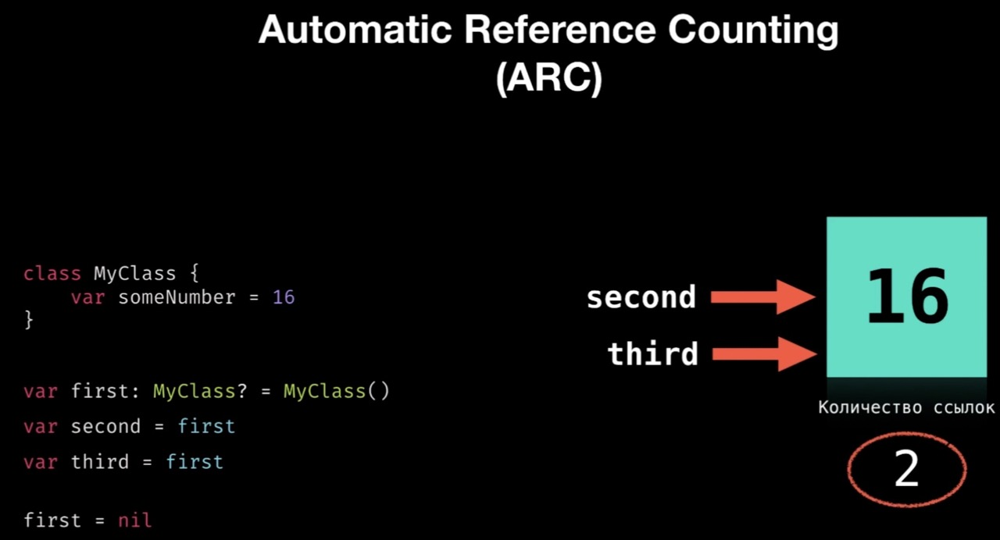

Вторая часть коспекта, из-за ограничей Github был разделен единый файл коспекта на части.
[Вернуться к первой части коспекта](https://github.com/artemiosdev/Swift-Manual-my-notes)

<a id="contents" />Оглавление

- [Глава  №11. Опциональные типы данных. ](#chapter11)
- [Глава  №12. Функции. ](#chapter12)
- [Глава  №13. Замыкания (closure). ](#chapter13)
- [Глава  №14. Дополнительные возможности. Методы. ](#chapter14)
- [Глава  №15. Ленивые вычисления. ](#chapter15)

Часть IV ВВЕДЕНИЕ В РАЗРАБОТКУ ПРИЛОЖЕНИЙ

- [Глава  №16. Консольные приложения. ](#chapter16)
- [Глава  №17. Консольные приложение "Угадай число". ](#chapter17)
- [Глава  №18. Введение в объектно-ориентированное и протокол-ориентированное программирование. ](#chapter18)
- [Глава  №19. Перечисления. Синтаксис перечислений . ](#chapter19)
- [Глава  №20. Структуры. Struct . ](#chapter20)
- [Глава  №21. Классы. Class. ](#chapter21)
- [Глава  №22. Свойства. ](#chapter22)
- [Глава  №23. Сабскрипты. ](#chapter23)
- [Глава  №24. Inheritance in classes. ](#chapter24)
- [Глава  №25. Контроль доступа. ](#chapter25)
- [Глава  №26. Псевдонимы Any и AnyObject. ](#chapter26)
- [Глава  №27. Инициализаторы и деинициализаторы. ](#chapter27)

[К оглавлению](#contents)

###  <a id="chapter11" /> Глава №11. Опциональные типы данных 

Когда вы объявляете какой-либо параметр, например `var name: String`, то с ним ассоциируется определенное значение, например Artem, которое всегда возвращается по имени данного параметра. Значение всегда имеет определенный тип, даже если это пустая строка, пустой массив и т. д. Это одна из функций безопасного программирования в Swift: если объявлен параметр определенного типа, то при обращении к нему вы **гарантированно** получите значение этого типа 

Опциональные типы данных, или `#опционалы` `#optional`, — это особый тип, который говорит о том, что **параметр либо имеет значение определенного типа, либо вообще не имеет никакого значения**. Иногда очень полезно оперировать отсутствием значения.

Think of an optional as a box: it either contains exactly one value, or is empty. When it doesn’t contain a value, it’s said to contain nil. The box itself always exists; it’s always there for you to open and look inside.

Optional variables and constants are like boxes that can contain a value or be empty (nil).

**Пример 1** 

Представьте, что перед вами бесконечная двумерная плоскость (с двумя осями координат). В ходе эксперимента на ней устанавливают точку с координатами `x=0` и `y=0`, которые в коде могут быть представлены либо как два целочисленных параметра `(x:Int и y:Int)`, либо как кортеж типа `(Int, Int)`. В зависимости от ваших потребностей вы можете передвигать точку, изменяя ее координаты. В любой момент времени вы можете говорить об этой точке и получать конкретные значения x и y. 

Что произойдет, если убрать точку с плоскости? Она все еще будет существовать в вашей программе, но при этом не будет иметь координат. Совершенно никаких координат. В данном случае x и y не могут быть установлены в том числе и в 0, так как 0 — это точно такая же координата, как и любая другая. 

Данная проблема может быть решена с помощью введения дополнительного параметра (например, `isSet: Bool`), определяющего, установлена ли точка на плоскости. Если `isSet = true`, то можно производить операции с координатами точки, в ином случае считается, что точка не установлена на плоскости. При таком подходе велика вероятность ошибки, так как необходимо контролировать значение `isSet` и проверять его перед каждой операцией с точкой. 

В такой ситуации наиболее верным решением станет использование опционального типа данных в качестве типа значения, определяющего координаты точки. В случае, когда точка находится на плоскости, будут возвращаться конкретные целочисленные значения, а когда она убрана — специальное ключевое слово, определяющее отсутствие координат (а значит, и точки на плоскости). 

**Пример 2**

Ваша программа запрашивает у пользователя его имя, возраст и место работы. Если первые два параметра могут быть определены для любого пользователя, то конкретное рабочее место может отсутствовать. Конечно же, чтобы указать на то, что работы нет, можно использовать пустую строку, но опционалы, позволяющие определить отсутствие значения, являются наиболее правильным решением. Таким образом, обращаясь к переменной, содержащей место работы, вы будете получать либо конкретное строковое значение, либо специальное ключевое слово, сигнализирующее об отсутствии работы. 

Самое важное, чего позволяют достичь опционалы, — это исключение неоднозначности. **Если значение есть, то оно есть, если его нет, то оно не сравнивается с нулем или пустой строкой, его просто нет**. 

Важно не путать отсутствие какого-либо значения в опциональном типе данных с пустой строкой или нулем. Пустая строка — это обычный строковый литерал, то есть вполне конкретное значение переменной типа String, а ноль — вполне конкретное значение числового типа данных. То же относится и к пустым коллекциям. 

У вас мог возникнуть вопрос: как Swift показывает, что в параметре опционального типа отсутствует значение? Для этого используется ключевое слово `nil`. 

Ранее мы использовали функцию `Int(_:)` для создания и приведения целочисленных значений. Но не каждый переданный в нее литерал может быть преобразован к целочисленному типу данных: к примеру, строку 1945 можно конвертировать в число, а “Одна тысяча сто десять” вернуть в виде числа не получится 

```swift
let possibleString = "1945"
let convertPossibleString = Int(possibleString) // 1945
let unpossibleString = "Одна тысяча сто десять"
let convertUnpossibleString = Int(unpossibleString) // nil
```

При конвертации строкового значения 1945, состоящего только из цифр, возвращается число. А во втором случае возвращается ключевое слово `nil`, сообщающее о том, что в результате конвертации не получено никакого целочисленного значения. То есть это не ноль, это не пустая строка, а именно **отсутствие значения как такового**. 

Самое интересное, что в обоих случаях (и при числовом, и при строковом значении переданного аргумента) возвращается значение **опционального типа данных**. То есть 1945 — это значение не целочисленного, а опционального целочисленного типа данных. Также и `nil` — в данном примере это указатель на отсутствие значения в хранилище опционального целочисленного типа. 

В этом примере функция `Int(_:)` возвращает опционал, то есть значение такого типа данных, который может либо содержать конкретное значение (целое число), либо не содержать совершенно ничего (nil). 

Опционалы — это отдельная самостоятельная группа типов данных. Целочисленный тип и опциональный целочисленный тип — это два совершенно разных типа данных. По этой причине опционалы должны иметь собственное обозначение типа. И они его имеют. Убедимся в этом, определив тип данных констант из предыдущего листинга.

```swift
type(of: convertPossibleString)   // Optional<Int>.Type
type(of: convertUnpossibleString) // Optional<Int>.Type
```

`Optional<Int>` — это идентификатор опционального целочисленного типа данных, то есть значение такого типа может либо быть целым числом, либо отсутствовать полностью. Тип Int является базовым для этого опционала, то есть основан на типе Int. 

Более того, опциональные типы данных всегда строятся на основе базовых неопциональных. Они могут брать за основу совершенно любой тип данных, включая Bool, String, Float и Double, а также типы данных кортежей, ваши собственные типы, типы коллекций и т. д. 

Напомню, что опционалы являются самостоятельными типами, отличными от базовых, то есть тип `Int` и тип `Optional<Int>` — это два разных типа данных. 

Функция `Int(_:)` не всегда возвращает опционал, а лишь в том случае, если в нее передано нечисловое значение. Так, если в `Int(_:)` передается значение типа Double, то нет никакой необходимости возвращать опционал, так как при любом значении Double оно может быть преобразовано в Int (чего нельзя сказать про преобразование String в Int). 

Далее показано, что приведение String и Double к Int дает значения различных типов данных (Optional<Int> и Int). 

```swift
     let x1 = Int("12")
     type(of: x1) // Optional<Int>.Type
     let x2 = Int(43.2)
     type(of: x2) // Int.Type
```

В общем случае тип данных опционала имеет две формы записи. 

Полная форма записи: 
`Optional<T> `

Краткая форма записи: 
`T?`

`T: Any` — наименование типа данных, на котором основан опционал. 

При объявлении параметра, имеющего опциональный тип, необходимо явно указать его тип данных. Для этого можно использовать полную форму записи. Приведен пример объявления переменной опционального типа, основанного на Character. 

`let optionalChar: Optional<Character> = "a"`

При объявлении опционала Swift также позволяет использовать сокращенный синтаксис. Для этого в конце базового типа необходимо добавить знак вопроса ? , никаких других элементов не требуется. Таким образом, тип `Optional<Int>` может быть переписан в `Int?`, `Optional<String>` в `String?` и в любой другой тип. 

`var xCoordinate: Int? = 12`

В любой момент значение опционала может быть изменено на `nil`. Это можно сделать как и при объявлении параметра, так и потом 

```swift
xCoordinate // 12
xCoordinate = nil
xCoordinate // nil
```

Переменная `xCoordinate` является переменной опционального целочисленного типа данных `Int?`. Изначально ей было присвоено значение, соответствующее базовому для опционала типу данных, которое позже было заменено на `nil` (то есть значение переменной было уничтожено). 

Если объявить переменную опционального типа, но не проинициализировать ее значение, Swift по умолчан сочтет ее равной nil 

`var someOptional: Bool? // nil`

Для создания опционала помимо явного указания типа также можно использовать функцию `Optional(_:)`, в которую необходимо передать инициализируемое значение требуемого базового типа 

```swift
// опциональная переменная с установленным значением
var optionalVar = Optional("stringValue")       // "stringValue"
// уничтожаем значение опциональной переменной
optionalVar = nil // nil
type(of: optionalVar) // Optional<String>.Type
```

Так как в функцию `Optional(_:)` в качестве аргумента передано значение типа String, то возвращаемое ею значение имеет опциональный строковый тип данных `String?` (или `Optional<String>`, что является синонимами). 

Вы используете optional в ситуациях, когда значение может отсутствовать. Optionals параметр представляет две возможности: либо есть значение, и вы можете развернуть optionals элемент, чтобы получить доступ к этому значению, либо значение отсутствует вообще.
The example below uses the initializer to try to convert a String into an Int:

```swift
let possibleNumber = "123" 
let convertedNumber = Int(possibleNumber) 
// convertedNumber is inferred to be of type "Int?", or "optional Int" 
```

Поскольку инициализатор может выйти из строя, он возвращает optional  Int, а не  обычный Int. Optional  Int записывается как Int?, а не как Int. Знак вопроса указывает на то, что содержащееся в нем значение является optional , что означает, что оно может содержать некоторое значение типа Int или может вообще не содержать значения. Это либо Int, либо вообще ничего.

### nil 

```swift
var serverResponseCode: Int? = 404 // serverResponseCode contains an actual Int value of 404 
serverResponseCode = nil // serverResponseCode now contains no value 
```

Вы не можете использовать #nil с non-optional constants and variables. If a constant or variable in your code needs работать с отсутствием значения при определенных условиях, всегда объявляйте ее как optional значение соответствующего типа.
Если вы определяете optional var без указания значения по умолчанию, для этой переменной автоматически устанавливается значение `nil`

```swift
var surveyAnswer: String?  // surveyAnswer is automatically set to nil 
```

Значение nil в Swift – это не то же самое, что nil в Objective-C. В Objective-C nil – это указатель на несуществующий объект. В Swift `nil` не является указателем – это **отсутствие значения определенного типа**. Optional параметры любого типа могут иметь значение nil, а не только типы объектов

### Опционалы в кортежах 

```swift
var tuple: (code: Int, message: String)? = nil
tuple = (404, "Page not found") // (code 404, message "Page not found")
```

В этом примере опциональный тип основан на типе кортежа (Int, String).
При необходимости вы можете использовать опционал для отдельных элементов кортежей 

```swift
let tupleWithoptelements: (Int?, Int) = (nil, 100)
tupleWithoptelements.0 // nil
tupleWithoptelements.1 // 100
```

### Извлечение опционального значения 

Важно отметить, что нельзя производить прямые операции между значениями опционального и базового типов данных, будет ошибка.

```swift
let a: Int = 4
let b: Int? = 5
a + b // ОШИБКА. Несоответствие типов
```

В переменной `a` хранится значение неопционального типа Int, в то время как значение `b` является опциональным (Int?). 

It doesn’t work because you’re trying to add an integer to a box — not to the value inside the box, but to the box itself. That doesn’t make sense.

The error message indicates the solution: It tells you that the optional must be unwrapped (развернуть коробку, открыть и достать содержимое, извлечь его). You need to unwrap the value from its box. It’s like Christmas!

Типы Int? и Int, String? и String, Bool? и Bool – разные типы данных. Для решения проблемы их взаимодействия можно применить прием, называемый извлечением опционального значения, или, другими словами, преобразовать опционал в соответствующий ему базовый тип. 

Выделяют три способа извлечения опционального значения:

- принудительное извлечение;
- косвенное извлечение;
- операция объединения с nil (рассматривается в конце главы). 
- После извлечения значение опционального типа приводится к базовому, а значит, может взаимодействовать с другими значениями базового типа. 

### Принудительное извлечение значения – forced unwrapping

```swift
var result: Int? = 30
print(result) // будет предупреждение 
// Консоль: Options(30) 
```

wrap – заворачивать, unwrap – разворачивать

Преобразует значение опционального типа в значение базового (например, Int? в Int) с помощью знака восклицания ` ! `, указываемого после имени параметра с опциональным значением. 

```swift
var optVar: Int? = 12
var intVar = 34
let result = optVar! + 34     // 46
// проверяем тип данных извлеченного значения
type(of: optVar!) // Int.Type
```

Константа optVar — это опционал. Для проведения арифметической операции с целочисленным значением используется принудительное извлечение ` ! `. `#exclamation mark` после имени переменной сообщает компилятору, что вы хотите заглянуть внутрь box и извлечь значение. Таким образом, операция сложения производится между двумя неопциональными целочисленными значениями. 

Такой же подход используется и при работе с типами, отличными от Int 

```swift
let optString: String? = "Vasiliy Usov"
let unwrapperString = optString!
print("My name is \(unwrapperString)")  // My name is Vasiliy Usov
```

Отсутствие значения в опционале приведет к ошибке

Вы можете использовать оператор `if`, чтобы узнать, содержит ли optional параметр значение, сравнив optional параметр с `nil`.

```swift
if convertedNumber != nil { 
    print("convertedNumber contains some integer value.") 
} 
```

Убедившись, что `optional` параметр действительно содержит значение, вы можете получить доступ к его базовому значению, добавив восклицательный знак ( `!` ) В конце имени optional элемента.

Восклицательный знак говорит: «Я знаю, что этот optional параметр определенно имеет значение; пожалуйста, используйте это." Это называется принудительным разворачиванием (forced #unwrapping) значения optional  параметра:

```swift
if convertedNumber != nil { 
    print("convertedNumber has an integer value of \(convertedNumber!).") 
} else { print("no number") }
// Prints "convertedNumber has an integer value of 123."
```

### Косвенное извлечение значения – implicitly unwrapping. Implicitly Unwrapped Optionals – Неявно развернутые опционалы

`#Implicitly Unwrapped Optionals`. Если вы уверены, что в момент проведения операции с опционалом в нем всегда будет значение (**не nil**), то **при явном указании типа данных знак вопроса может быть заменен на знак восклицания.** При этом все последующие обращения к параметру необходимо производить без принудительного извлечения, так как оно будет происходить автоматически 

```swift
var wrapInt: Double! = 3.14
// сложение со значением базового типа не вызовет ошибок
// при этом не требуется использовать принудительное извлечение
wrapInt + 0.12 // 3.26
```

Как описано выше, optionals параметры указывают, что constant or variable разрешено «не иметь значения». Optionals параметры можно проверить с помощью оператора if, чтобы узнать, существует ли значение, и можно условно unwrapped размернуть с помощью optionals привязки для доступа к значению optionals элемента, если оно существует.

Иногда из структуры программы ясно, что optionals параметр всегда будет иметь значение после того, как это значение будет установлено впервые. В этих случаях полезно избавиться от необходимости проверять и разворачивать значение optionals элемента каждый раз, когда к нему обращаются, поскольку можно с уверенностью предположить, что оно все время имеет значение. 

Эти виды опций определяются как неявно развернутые опциональные опции – **implicitly unwrapped optionals**. Вы пишете implicitly unwrapped optionals, помещая восклицательный знак `(String!)`, а не вопросительный знак `(String?)`. После типа, который вы хотите сделать optionals. Вместо того, чтобы помещать восклицательный знак после имени optionals элемента, когда вы его используете, вы помещаете восклицательный знак после типа optionals при его объявлении.

An implicitly unwrapped неявно развернутые optional параметры полезны, когда подтверждается существование значения optional параметра сразу после того, как оно было впервые определено, и можно определенно предположить, что оно существует в любой момент после этого. 

Неявно развернутый optional параметр – это обычный optional параметр за кулисами, но его также можно использовать как optional значение, без необходимости развертывать optional значение при каждом обращении к нему. В следующем примере показано различие в поведении optional строки и неявно развернутой optional строки при доступе к их обернутому wrapped значению как явной строке:

```swift
let possibleString: String? = "An optional string." 
let forcedString: String = possibleString! // нужен ! 
let assumedString: String! = "An implicitly unwrapped optional string." 
let implicitString: String = assumedString // не нужен !
```

Вы можете думать о неявно развернутом optional (implicitly unwrapped optional) элементе как о разрешении для optional элемента принудительно развернуть его, если это необходимо. Когда вы используете неявно развернутое optional значение, Swift сначала пытается использовать его как обычное optional значение; если его нельзя использовать как optional, Swift принудительно разворачивает значение. В приведенном выше коде optional значение assumedString принудительно разворачивается перед присвоением его значения implicitString, поскольку implicitString имеет явный, optional тип String. В приведенном ниже коде optionalString не указан явный тип, поэтому он является обычным optional.

```swift
let optionalString = assumedString 
// The type of optionalString is "String?" and assumedString isn't force-unwrapped. 
```

Если implicitly unwrapped optional равен `nil` и вы пытаетесь получить доступ к его обернутому (wrapped) значению, вы вызовете ошибку выполнения. Результат будет таким же, как если бы вы поместили восклицательный знак после обычного optional параметра, не содержащего значения. Вы можете проверить, является ли implicitly unwrapped optional параметр `nil` так же, как вы проверяете обычный optional параметр:

```swift
if assumedString != nil { 
    print(assumedString!)
}
// Prints "An implicitly unwrapped optional string."
```

You can also use an implicitly unwrapped optional with `optional #binding` (доп. привязка), to check and unwrap its value:

```swift
if let definiteString = assumedString { 
    print(definiteString)
}
// Prints "An implicitly unwrapped optional string." 
```

Не используйте implicitly unwrapped optional (неявно развернутый optional параметр), если есть вероятность того, что переменная позже станет нулем. Всегда используйте обычный optional тип, если вам нужно проверить нулевое значение в течение времени существования переменной.

### Проверка наличия значения в опционале 

Для осуществления проверки наличия значения в опционале его можно сравнить с nil. При этом будет возвращено логическое true или false в зависимости от наличия значения 

```swift
let optOne: UInt? = nil
let optTwo: UInt? = 32
optOne != nil // false
optTwo != nil // true
// or
optOne == nil // true
optTwo == nil // false
```

Подобное выражение можно использовать совместно с оператором условия if. Если в опционале имеется значение, то в теле оператора оно может быть извлечено без ошибок. 

Пример, в котором определяется количество положительных оценок, а точнее пятерок. Если пятерки есть, то вычисляется количество пирожных, которые необходимо приобрести в награду за старания. 

```swift
var fiveMarkCount: Int? = 8
var allCakesCount = 0;
// определение наличия значения
if fiveMarkCount != nil {
    // количество пирожных за каждую пятерку
    let cakeForEachFiveMark = 2
    // общее количество пирожных
    allCakesCount = cakeForEachFiveMark * fiveMarkCount!
}
allCakesCount // 16
```

Обратите внимание на то, что при вычислении значения `allCakesCount` в теле конструкции if используется принудительное извлечение опционального значения переменной fiveMarkCount. 

Данный способ проверки существования значения опционала работает исключительно при принудительном извлечении опционального значения, так как косвенно извлекаемое значение не может быть равно `nil`, а значит, и сравнивать его с `nil` не имеет смысла. 

### Опциональное связывание `if let связываемый_параметр = опционал{ }` Optional Binding (привязка, связка)

В ходе проверки наличия значения в опционале существует возможность одновременного извлечения значения (если оно не nil) и инициализации его во временный параметр. Этот способ носит название **опционального связывания (optional binding)** и является наиболее корректным способом работы с опционалами. 

```swift
  if let связываемый_параметр = опционал {
    // тело оператора
  }
```

В результате опционального связывания создается связанный параметр, в который при возможности извлекается значение опционала. Если опционал не равен `nil`, то будет выполнен код в теле оператора, в котором значение опционала будет доступно через связанный параметр. 

```swift
if let userName = userLogin {
  print("Имя: \(userName)")
} else { 
  print("Имя не введено")
}
// userLogin - опционал
type(of: userLogin) // Optional<String>.Type
```

Swift includes a feature known as optional binding, which lets you safely access the value inside an optional. Optional #Binding #привязка #связывание безопасная альтернатива вышеописанному принудительному извлечению (**If Statements and Forced Unwrapping** )

Вы используете optional привязку, чтобы узнать, содержит ли optional параметр значение, и если да, то сделать это значение доступным как временную константу или переменную. Optional привязка может использоваться с операторами `if` и `while` для проверки значения внутри `optional` и для извлечения этого значения в constant or variable как часть одного действия.

```swift
if let constantName = someOptional { 
    // statements 
}
```

Если possibleNumber может быть приведено в Int, то выполнится if, если нет, будет содержать string, к примеру, то выполнится else

```swift
let possibleNumber = "123"
if let actualNumber = Int(possibleNumber) {
    print("The string \"\(possibleNumber)\" has an integer value of \(actualNumber)")
} else {
    print("The string \"\(possibleNumber)\" couldn't be converted to an integer")
}
```

Этот код можно прочитать как: «Если optional Int, возвращаемый Int (possibleNumber), содержит значение, установите новую константу с именем actualNumber равной значению, содержащемуся в optional». Если преобразование прошло успешно, константа actualNumber становится доступной для использования в первой ветви оператора if. Он уже инициализирован значением, содержащимся в необязательном поле, поэтому вы не используете **!** суффикс для доступа к его значению. В этом примере actualNumber просто используется для печати результата преобразования. Вы можете использовать как let, так и var с optional привязкой. Если вы хотите манипулировать значением actualNumber в первой ветви оператора if, вы можете вместо этого написать if var actualNumber, и значение, содержащееся в optional элементе, будет доступно как переменная, а не как константа.

Вы можете включить столько optional привязок и логических условий в один оператор if, сколько вам нужно, **разделив их запятыми**. Если какое-либо из значений в optional привязках равно нулю или какое-либо логическое условие оценивается как ложное, все условие оператора if считается ложным. Следующие операторы if эквивалентны:

```swift
if let firstNumber = Int("4"), **let** secondNumber = Int("42"), firstNumber < secondNumber && secondNumber < 100 {
    print("\(firstNumber) < \(secondNumber) < 100")
}
// Prints "4 < 42 < 100"

if let firstNumber = Int("4") {
    if let secondNumber = Int("42") {
        if firstNumber < secondNumber && secondNumber < 100 {
        print("\(firstNumber) < \(secondNumber) < 100")
        }
    }
}
// Prints "4 < 42 < 100"
```

**Константы и переменные, созданные с optional привязкой в операторе if, доступны только в теле оператора if**. Напротив, константы и переменные, созданные с помощью оператора `guard`, доступны в строках кода, следующих за оператором защиты, как описано в разделе «Early exit».


Напомню, что область видимости определяет, где в коде доступен некоторый объект. Если этот объект является глобальным, то он доступен в любой точке программы (его область видимости не ограничена). Если объект является локальным, то он доступен только в том блоке кода (и во всех вложенных в него блоках), для которого является локальным. Вне этого блока объект просто не виден. 

```swift
let markCount: Int? = 8
// определение наличия значения
if let marks = markCount {
    print("Всего \(marks) оценок")
}
// Консоль: Всего 8 оценок
```

Так как опционал markCount не nil, в ходе опционального связывания происходит автоматическое извлечение его значения с последующей инициализацией в локальную константу marks. 

Переменная, создаваемая при опциональном связывании, локальна для оператора условия, поэтому использовать ее можно только внутри данного оператора. Если бы в переменной markCount не существовало значения, то тело оператора условия было бы проигнорировано. Вы можете не ограничиваться одним опциональным связыванием в рамках одного оператора if 

```swift
var pointX: Int? = 10
var pointY: Int? = 3
if let x = pointX, let y = pointY 
    print("Точка установлена на плоскости")
}
// Консоль: Точка установлена на плоскости
```

В этом примере проверяется наличие значений в обеих переменных. Если бы хоть одна из переменных соответствовала nil, то вывод на консоль оказался бы пуст. 

Xcode уведомляет о том, что объявленные в ходе опционального связывания **константы не используются в теле оператора, вследствие чего они могут быть заменены нижним подчеркиванием  `_`** 

Ранее мы уже неоднократно встречались с **нижним подчеркиванием**, позволяющим игнорировать определенные элементы или значения. Напомню, **что оно может заменять имена параметров в тех случаях, когда в их объявлении нет необходимости**. В данном примере опциональное связывание требуется лишь с целью определения наличия значений в опционалах, при этом внутри блока кода оператора условия созданные параметры не используются. Поэтому можно последовать совету среды разработки и заменить имена констант на нижнее подчеркивание. 


```swift
if let _ = pointX, let _ = pointY {
    print("Точка установлена на плоскости")
}
if let x = pointX, x > 5 {
    print("Точка очень далеко от вас ")
}
// Консоль: Точка очень далеко от вас
```

Или же, можно использовать в качестве привязки **тоже самое имя** опционала, чтобы  не мучаться с придумыванием имени локальной переменной

```swift
if let authorName = authorName {
    print("Author is \(authorName)")
} else {
    print("No author.")
}

// or with two
if let authorName = authorName, let authorAge = authorAge {
    print("The author is \(authorName) who is \(authorAge) years old.")
} else {
    print("No author or no age.")
}
```

You can combine unwrapping multiple optionals with additional Boolean checks

The expression in the if statement will only be true if name is non-nil, and age is non-nil, and age is greater than or equal to 40.

```swift
if let authorName = authorName,
    let authorAge = authorAge, authorAge >= 40 {
    print("The author is \(authorName) who is \(authorAge) years old.")
} else {
    print("No author or no age or age less than 40.")
}
```

Another example
```swift
var fuel: Int?
fuel = 20
//fuel = nil

// Опциональное связывание -  Optional Binding
if let availableFuel = fuel {
    print("\(availableFuel) liters left")
} else {
    print("no fuel data available")
}

func checkFuel() {
    guard let availableFuel = fuel else {
        print("no fuel data available")
        return
    }
    print("\(availableFuel) liters left")
}
```

### Опциональное связывание как часть оптимизации кода

Представьте, что у вас есть группа драконов, у большинства из которых есть свой сундук с золотом, а количество золотых монет в каждом из этих сундуков разное. В любой момент времени может потребоваться знать общее количество монет во всех сундуках. Внезапно к вам поступает новый дракон, его золото тоже должно быть учтено. 

Напишем код, в котором определяется количество монет в сундуке нового дракона (если, у него есть сундук), после чего оно суммируется с общим количеством золота 

```swift
/* переменная типа String, содержащая количество золотых монет в сундуке нового дракона */
var coinsInNewChest = "140"

/* переменная типа Int, в которой будет храниться общее количество монет у всех драконов */
var allCoinsCount = 1301

// проверяем существование значения
if Int(coinsInNewChest) != nil {
    allCoinsCount += Int(coinsInNewChest)!
} else {
    print("У нового дракона отсутствует золото")
}
```

У вас мог возникнуть вопрос, почему в качестве количества монет в сундуке не используется значение целочисленного типа.

- в интерфейсе мнимой программы, вполне вероятно, будет находиться текстовое поле, в котором будет вводиться строковое значение, содержащее количество монет; 

- монеты могут отсутствовать по причине отсутствия сундука, а 0 в качестве значения говорит о том, что сундук есть, но монет в нем нет. 

На первый взгляд все очень просто и логично, и в результате значение переменной allCoinsCount станет равно 1441. Но обратите внимание, что Int(coinsInNewChest) используется дважды: 

- при сравнении с nil; 

- при сложении с переменной allCoinsCount. 

В результате происходит бесцельная трата процессорного времени, так как одна и та же функция выполняется дважды. Можно избежать такой ситуации, заранее создав переменную `coins`, в которую будет извлечено значение опционала. Данную переменную необходимо использовать в обоих случаях `вместо` вызова функции `Int(_:)` 

```swift
let coinsInNewChest = "140"
var allCoinsCount = 1301
/* извлекаем значение опционала в новую переменную */
var coins = Int(coinsInNewChest)
//проверяем существов значения с использованием созданной переменной
if coins != nil {
    allCoinsCount += coins!
} else {
    print("У нового дракона отсутствует золото")
}
```

Код решает поставленную задачу, но у него есть один недостаток: созданная переменная `coins` будет существовать (и занимать оперативную память) даже после завершения работы условного оператора, хотя в ней нет необходимости. Необходимо всеми способами избегать бесполезного расходования ресурсов компьютера, к которым относится и процессорное время, и оперативная память. 

Чтобы избежать расходования памяти, **можно использовать опциональное связывание**, так как после выполнения оператора условия созданная при связывании переменная автоматически удалится 

```swift
let coinsInNewChest = "140"
var allCoinsCount = 1301
// проверяем существов значения с использованием опциональн связывания
if let coins = Int(coinsInNewChest) {
    allCoinsCount += coins
} else { 
    print("У нового дракона отсутствует золото")
}
```

### Оператор объединения с nil (nil coalescing)

Nil Coalescing Operator – Оператор нулевого слияния

С помощью оператора `??` (называемого оператором объединения с nil) возвращается либо значение опционала, либо значение по умолчанию (если опционал равен nil). 

`let имя_параметра = имя_опционала ?? значение_по_умолчанию`

`имя_параметра: T` — имя нового параметра, в который будет извлекаться значение опционала. 

`имя_опционала: Optional<T>` — имя параметра опционального типа, из которого извлекается значение. 

`значение_по-умолчанию: T` — значение, инициализируемое новому параметру в случае, если опционал равен `nil`. 

Если опционал не равен nil, то опциональное значение извлекается и инициализируется в объявленный параметр. 
Если опционал равен nil, то в параметре инициализируется значение, расположенное справа от оператора `??`. Для навигации( #?? ) #nil #coalescing.

Базовый тип опционала и тип значения по умолчанию должны быть одним и тем же типом данных. 
Вместо оператора let может быть использован оператор var.

`let optionalInt: Int? = 20`

`var mustHaveResult = optionalInt ?? 0  // 20`

Таким образом, константе mustHaveResult будет проинициализировано целочисленное значение. Так как в optionalInt есть значение, оно будет извлечено и присвоено константе mustHaveResult. Если бы optionalInt был равен nil, то mustHaveResult принял бы значение 0. 

```swift
let optionalInt: Int? = 20
var mustHaveResult: Int
if let unwrapped = optionalInt {
    mustHaveResult = unwrapped
} else {
    mustHaveResult = 0
}
```

**Наиболее безопасными способами извлечения значений из опционалов являются опциональное связывание и nil coalescing**. Старайтесь использовать именно их в своих приложениях. 

The nil-coalescing operator (a ?? b) unwraps разворачивает an optional если он содержит значение, или возвращает значение по умолчанию b, если a равно nil. Выражение a всегда of an optional type. Выражение b должно соответствовать типу, хранящемуся внутри a. Оператор nil-coalescing является сокращением для приведенного ниже кода:

`a != nil ? a! : b`

В приведенном выше коде используется тернарный условный оператор и принудительное развертывание (forced unwrapping) (`a!`) Для доступа к значению, заключенному внутри `a`, когда `a` не равно nil, и для возврата `b` в противном случае. Оператор nil-coalescing предоставляет более элегантный способ инкапсулировать эту условную проверку и разворачивание в сжатой и удобочитаемой форме. 

ПРИМЕЧАНИЕ. Если значение `a` не равно нулю, значение `b` не оценивается. Это известно как оценка короткого замыкания. В примере ниже оператор nil-coalescing используется для выбора между именем цвета по умолчанию и optional пользовательским именем цвета:

```swift
let defaultColorName = "red" 
var userDefinedColorName: String? // defaults to nil 
var colorNameToUse = userDefinedColorName ?? defaultColorName 
// userDefinedColorName is nil, so colorNameToUse is set to the default of "red"
```

Переменная userDefinedColorName определяется как необязательная строка со значением по умолчанию `nil`. Поскольку userDefinedColorName имеет необязательный тип, вы можете использовать оператор nil-coalescing, чтобы рассмотреть его значение. В приведенном выше примере оператор используется для определения начального значения для строковой переменной с именем colorNameToUse. Поскольку userDefinedColorName имеет значение nil, выражение userDefinedColorName ?? defaultColorName возвращает значение defaultColorName или «красный». Если вы присваиваете userDefinedColorName значение, отличное от nil, и снова выполняете проверку оператора nil-coalescing, вместо значения по умолчанию используется значение, заключенное внутри userDefinedColorName:

```swift
userDefinedColorName = "green" 
colorNameToUse = userDefinedColorName ?? defaultColorName // userDefinedColorName isn't nil, so colorNameToUse is set to "green"
```

### Краткое содержание главы Опционалы 

Используется, когда параметр может иметь некоторое значение или не иметь его вовсе. 

Загрузка записи из базы данных по его ID может либо вернуть эту запись, либо вернуть `nil`, указывающий на то, что такой записи нет в базе.

```swift
   func getObjectBy(id: UInt) -> Object? {
       // код загрузки данных из базы
   }
```

Получение файла по его имени. При отсутствии файла с таким именем возвращается nil. 

```swift
   func getFileBy(name: UInt) -> File? {
       // код загрузки файла
   }
```

Ресурс большого объема, который в будущем заменится на nil, чтобы освободить память. 

Указатель на наличие/отсутствие ошибки в результате запроса на сервер. 

```swift
   let error: Error? = getErrorFromServerQuery()
   guard let error = error else {
       print("Ошибок нет")
   }
   print("Ошибка \(error.code)")
```

Оператор `guard` - если условие true, то код выполняется дальше, если условие false то переходим к else

Свойства класса, которые будут установлены уже после его инициализации. К примеру, свойства класса ViewController будут связаны с элементами на сцене (IBOutlet) уже после того, как произойдет инициализация. 

```swift
class ViewController: UIViewController {
    var textArea: UITextArea!
    var button: UIButton!
    // ...
} 
```

**Challenges**

**Challenge 2: Divide and conquer**

First, create a function that returns the number of times an integer can be divided by another integer without a remainder. The function should return nil if the division doesn’t produce a whole number. Name the function divideIfWhole.
Then, write code that tries to unwrap the optional result of the function. There should be two cases: upon success, print "Yep, it divides \(answer) times", and upon failure, print "Not divisible :[".

Finally, test your function:
Divide 10 by 2. This should print "Yep, it divides 5 times."
Divide 10 by 3. This should print "Not divisible :[."

Hint 1: Use the following as the start of the function signature:
You’ll need to add the return type, which will be an optional!

Hint 2: You can use the modulo operator (%) to determine if a value is divisible by another; recall that this operation returns the remainder from the division of two numbers. 10 % 2 = 0 means that 10 is divisible by 2 with no remainder, whereas 10 % 3 = 1 means that 10 is divisible by 3 with a remainder of 1.

```swift
func divideIfWhole(_ value: Int, by divisor: Int) -> Int? {
    if value % divisor == 0 {
        return value / divisor
    } else {
        return nil
    }
}

if let answer = divideIfWhole(10, by: 2) {
    print("Yep, it divides \(answer) times.")
} else {
    print("Not divisible :[.")
}
// Yep, it divides 5 times.

if let answer = divideIfWhole(10, by: 3) {
    print("Yep, it divides \(answer) times.")
} else {
    print("Not divisible :[.")
}
// Not divisible :[.
```

**Challenge 3: Refactor and reduce**

The code you wrote in the last challenge used if statements. In this challenge, refactor that code to use nil coalescing instead. This time, make it print "It divides X times" in all cases, but if the division doesn’t result in a whole number, then X should be 0.

```swift
let answer1 = divideIfWhole(10, by: 2) ?? 0
print("It divides \(answer1) times.")

let answer2 = divideIfWhole(10, by: 3) ?? 0
print("It divides \(answer2) times.")
```

**Challenge 4: Nested optionals**

Consider the following #nested optional. It corresponds to a number inside a box inside a box inside a box.

```swift
let number: Int??? = 10
If you print number you get the following:
print(number)
// Optional(Optional(Optional(10)))
print(number!)
// Optional(Optional(10))
```

1. Fully force unwrap and print number.
2. Optionally bind and print number with if let.
3. Write a function printNumber(_ number: Int???) that uses guard to print the number only if it is bound.

```swift
let number: Int??? = 10
// 1
print(number!!!)

// 2
if let number = number {
  if let number = number {
    if let number = number {
      print(number)
    }
  }
}

// Better way of optionally binding without all the {}
if let n1 = number,
   let n2 = n1,
   let n3 = n2 {
  print(n3)
}

// 3
func printNumber(_ number: Int???) {
  guard let n1 = number, let n2 = n1, let n3 = n2 else {
    return
  }
  print(n3)
}
printNumber(number)
```

---

[К оглавлению](#contents)

###  <a id="chapter12" /> Глава №12. Функции

Функция объединяет строки кода в один блок, который можно использовать снова. Некоторые функции имеют входные данные и изменяют свое поведение на основе аргументов вызывающего объекта, некоторые функции имеют выходные данные и дают результат, а некоторые функции не имеют ни того, ни другого.

**Свойство** – это часть данных, хранящихся в структуре, классе или перечислении. Например, каждый экземпляр массива имеет свойство `count`, которое отличается в зависимости от характеристик массива.

Parameters – If the function has parameters (inputs), если функция имеет параметры (входы), они перечислены с именем, используемым для доступа к параметру, и краткое описание параметра

Функция:

- группирует программный код в единый контейнер; 
- имеет собственное имя, с помощью которого может быть многократно вызвана с возможностью передачи аргументов;
- создает отдельную область видимости внутри себя, в результате чего все созданные в теле функции параметры недоступны извне; 
- может принимать входные параметры; 
- может возвращать значение как результат исполнения сгруппированного в ней кода; 
- имеет собственный функциональный тип данных; 
- может быть записана в параметр (переменную или константу) и в таком виде передана. 

«Функцию стоит объявлять тогда, когда некоторый программный код может быть многократно использован. С ее помощью исключается дублирование кода, так как она позволяет не писать его дважды». 

Готовая функция — это черный ящик, у которого скрыта внутренняя реализация. Вам важно лишь то, для чего она предназначена, что принимает на вход и что возвращает. 

Рассмотрим пример. В качестве функции может выступать соковыжималка. Вы, ничего не знаете о ее внутреннем устройстве, но обладаете информацией о ее предназначении (выжимать сок), входных аргументах (свежие фрукты и овощи) и возвращаемом значении (свежевыжатый сок). 

```swift
func имяФункции (входные_параметры) -> ТипВозвращаемогоЗначения {
       // тело функции
   }
```

`имяФункции` — имя объявляемой функции, по которому она сможет быть вызвана. К функциям применимы те же правила именования, что и к параметрам. 

`входные_параметры` — список входных параметров функции с указанием их имен и типов. 

`ТипВозвращаемогоЗначения` — тип данных значения, возвращаемого функцией. Если функция ничего не возвращает, то данный элемент может быть опущен. 

Объявление функции начинается с ключевого слова `func`. Далее имя создаваемой функции. Оно используетс при каждом ее вызове в вашем коде

     `func myFirstFunc`

Далее в скобках указываются входные параметры функции. Список параметров заключается в круглые скобки и состоит из разделенных запятыми элементов. Каждый отдельный элемент описывает один параметр и состоит из имени и типа этого параметра, разделенных двоеточием. Параметры позволяют передать в функцию значения, которые ей требуются для корректного выполнения возложенных на нее задач. Количество параметров может быть произвольным (также они могут вовсе отсутствовать). 

```swift
func myFirstFunc(
     a: Int,
     b: String)
```

Указанные параметры являются локальными для функции, таким образом, `a` и `b` будут существовать только в пределах ее тела. По окончании ее работы данные параметры будут уничтожены и станут недоступными. 

```swift
func triple(value: Int) {
    let result = value * 3
    print(”If you multiply \(value) by 3, you’ll get \(result).”)
}
```

Внимание!!! При объявлении функции в скобках указываются **входные параметры**, а при вызове функции передаются **аргументы**.

```swift
     // входные параметры a и b
     func myFirstFunc(a: Int, b: String) { ... }
     // аргументы a и b
     myFirstFunc(a: 54, b: "слово")
```

**Вам необходимо запомнить, что при вызове функции указываются аргументы, а внутри функции используются параметры**

Далее, после списка параметров, может быть указан тип возвращаемого значения. Для этого используется стрелка `->`, после которой следует имя конкретного типа данных. В качестве типа можно задать любой фундаментальный тип, тип массива или кортежа, или любой другой. 

```swift
     func myFirstFunc(
            a: Int,
            b: String
     ) -> String
```

или 

```swift
func myFirstFunc(
       a: Int,
       b: String
) -> [(String,Int)?]
```

Если функция **не должна возвращать никакого значения**, то на это можно указать тремя способами: 
с помощью ключевого слова `#Void` (это Good Practice), например: 

```swift
     func myFirstFunc(
     a: Int,
     b: String
     ) -> Void
```

с помощью пустых скобок `( )`, например: 

```swift
     func myFirstFunc(
     a: Int,
     b: String
     ) -> ()
```

не указывать тип вовсе   , например: 

```swift
     func myFirstFunc(
     a: Int,
     b: String)
```

Если функция возвращает какое-либо значение, то в ее теле должен присутствовать оператор `#return`, за которым следует возвращаемое значение. После выполнения программой оператора `return` работа функции завершается и происходит выход из нее.

```swift
     func myFirstFunc(
         a: Int,
         b: String
     ) -> String {
         let word = "Swift"
         return String(a) + b + word
     }
```

В данном случае тело функции состоит всего из одного выражения, в котором содержится оператор return. После его выполнения функция вернет сформированное значение и завершит свою работу. 
При этом если тело функции состоит из одного выражения single statement, значение которого должно быть возвращено, то оператор `return` может быть опущен. 

```swift
     func myFirstFunc(
         a: Int,
         b: String
     ) -> String {
         String(a) + b
     }
```

Процесс обращения к объявленной функции по ее имени называется вызовом функции.
Функция может содержать произвольное количество операторов `return`. При достижении первого из них будет произведено завершение ее работы. 

Предположим, что вам требуется многократно выводить на консоль один и тот же текст. Для реализации этого можно объявить новую функцию, которая при обращении к ней будет производить необходимую операцию 

```swift
func printMessage() {
    print("Сообщение принято")
}
// вызываем функцию по ее имени
printMessage()
printMessage()
```

Вывод информации на консоль с помощью `print(_:)` не является возвращаемым функцией значением. **Возвращаемое значение может быть проинициализировано параметру.**

### Входные параметры и возвращаемое значение 

Функция может принимать входные параметры в качестве входных значений и возвращать результат своей работы (возвращаемое значение). И для входных, и для возвращаемого значений должны быть определены типы данных. 

```swift
func sumTwoInt(a: Int, b: Int) {
    print("Результат операции - \(a+b)")
}
sumTwoInt(a: 10, b: 12) // Результат операции – 22
```

Функция `sumTwoInt(a:b:)` имеет два входных параметра типа Int — `a` и `b`. 

Внешние External и внутренние internal имена входных параметров. Argument labels 

Swift позволяет указать **внешние имена** ( `#argument label` ) параметров, которые будут использоваться при вызове функции. Они добавляют читаемости и ясности.

```swift
func sayHello(to person: String, and anotherPerson: String) {
    print(”Hello \(person) and \(anotherPerson)”)
}
sayHello(to: “Miles”, and: “Riley”)
```

`#External` внешние and `#internal` внутренние names come from in the function declaration

```swift
func printMultipleOf(multiplier: Int, and value: Int) {
  print("\(multiplier) * \(value) = \(multiplier * value)")
}
printMultipleOf(multiplier: 4, and: 2)


func sumTwoInt(num1 a: Int, num2 b: Int) {
    print("Результат операции - \(a+b)")
}
sumTwoInt(num1: 10, num2: 12)
```

Если внешнее имя заменить на символ нижнего подчеркивания ( ` _ ` ), то при вызове функции имя параметра вообще не потребуется указывать. Это вариант не использовать внешнее имя или argument label. 

```swift
func sumTwoInt(_ a: Int, _ b: Int) {
    print("Результат операции - \(a+b)")
}
sumTwoInt(10, 12)
```

### Возвращаемое значение 

Доработаем функцию `sumTwoInt(_: _: )` таким образом, чтобы она не только выводила сообщение на консоль, но и возвращала результат сложения. Для этого необходимо выполнить два требования: 

- должен быть указан тип возвращаемого значения; 
- должен быть использован оператор return в теле функции с возвращаемым значением в качестве операнда. 

```swift
func sumTwoInt(_ a: Int, _ b: Int) -> Int {
    let result = a + b
    print("Результат операции - \(result)")
    return result
}
```

or 

```swift
func sumTwoInt(_ a: Int, _ b: Int) -> Int {         return a + b 
}
```

or

```swift
func sumTwoInt(_ a: Int, _ b: Int) -> Int { 
    a + b 
}

var result = sumTwoInt(10, 12) // 22
// Консоль: Результат операции – 22
// or
print("Результат операции - \(result)")
print("Результат операции - \( sumTwoInt(10, 12))")
```

Обратите особое внимание на то, что в теле функции объявляется константа result, а после функции — переменная с таким же именем. Это два различных и независимых параметра! Все, что объявляется в теле функции, является локальным для нее и уничтожается после завершения ее работы. Таким образом, в теле константа используется для вывода информации на консоль и совместно с оператором return, а вне функции в новую и другую переменную result записывается возвращенное функцией значение. 

### Изменяемые копии входных параметров 

Все входные параметры функции — константы. При попытке изменения их значения внутри тела функции происходит ошибка. 
Важно отметить, что Swift копирует значение перед передачей его в функцию – поведение, известное как передача по значению `pass-by-value`. При необходимости изменения переданного входного значения внутри функции потребуется создать новую переменную и присвоить переданное значение ей 

```swift
func returnMessage(code: Int, message: String) -> String {
    var mutableMessage = message
// преобразование code: Int в String
    mutableMessage += String(code) 
    return mutableMessage
}
let myMessage = returnMessage(code: 200, message: "Код сообщения - ")
```

Функция `returnMessage(code:message:)` получает на вход два аргумента: code и message. В ее теле создается изменяемая копия message, которая без каких-либо ошибок модифицируется, после чего возвращается. 

### Сквозные параметры 

Приведенный способ модификации значений параметров позволяет получать доступ к изменяемому значению только в пределах тела самой функции. Для того чтобы была возможность модификации параметров с сохранением измененных значений после окончания работы функции, необходимо использовать #сквозные параметры. 

Иногда вы хотите, чтобы функция изменяла параметр напрямую, поведение, известное как `copy-in` `copy-out` or `call by value result`.
Чтобы преобразовать входной параметр в сквозной, перед описанием его типа необходимо указать модификатор `#inout`. 

Inout до того, как тип параметра будет указан, что этот параметр должен быть скопирован, и эта локальная копия используется в функции, и должна быть скопировала обратно, когда функция return

Сквозной параметр передается в функцию, изменяется в ней и сохраняет свое значение при завершении работы функции, заменяя собой исходное значение. При вызове функции перед передаваемым значением аргумента необходимо ставить символ `#амперсанд #ampersand  (&)`, указывающий на то, что параметр передается по ссылке. 
В примере, функция осуществляет обмен значениями двух внешних параметров (меняет их местами)

```swift
func changeValues(_ a: inout Int, _ b: inout Int) -> Void {
    let tmp = a
    a = b 
    b = tmp 
} 
var x = 150, y = 45
print(x) // 150
print(y) // 45
changeValues(&x, &y)
print(x) // 45
print(y) // 150
```

Функция принимает на входе две переменные, a и b. Эти переменные передаются в функцию как сквозные параметры, что позволяет изменить их значения внутри функции и сохранить эти изменения после завершения ее работы. 
В качестве сквозного параметра может выступать только переменная. Константы или литералы нельзя передавать, так как они являются неизменяемыми. 

### Функция в качестве входного параметра 

Вы можете использовать возвращаемое некоторой функцией значение в качестве значения входного параметра другой функции. Самое важное, чтобы тип возвращаемого значения функции совпадал с типом входного параметра. 
Ниже объявленная ранее функция `returnMessage (code: message: )`, возвращающая значение типа String. 

```swift
// используем функцию в качестве значения
print( returnMessage(code: 400, message: "Сервер недоступен. Код сообщения - ") ) 
// Консоль: Сервер недоступен. Код сообщения – 400
```

Уже известная нам функция `print(_:)` принимает на входе строковый литерал типа String. Так как функция `returnMessage(code: message: )` возвращает значение этого типа, она может быть указана в качестве входного параметра для `print(_:)`. 

### Входной параметр с переменным числом значений. Вариативный тип 

В некоторых ситуациях необходимо, чтобы функция получала неизвестное заранее число однотипных значений. Мы уже встречались с таким подходом при использовании `Array(arrayLiteral: )`, когда заранее неизвестно, сколько элементов будет содержать параметр arrayLiteral. Такой тип входного параметра называется вариативным. 

#Вариативный параметр обозначается в списке входящих параметров с указанием оператора диапазона `...` сразу после типа. Значения аргумента при вызове функции задаются через запятую. 

Представьте, что удаленный сервер на каждый запрос отправляет вам несколько ответов. Каждый ответ — это целое число, но их количество может быть различным. Вам необходимо написать функцию, которая принимает на входе все полученные ответы и выводит их на консоль. 

```swift
func printRequestString(codes: Int...) -> Void {
    var codesString = ""
    for oneCode in codes {
        codesString += String(oneCode) + " "
    }
    print("Получены ответы — \(codesString)")
}
printRequestString(codes: 600, 800, 301) // Получены ответы — 600 800 301
printRequestString(codes: 101, 200) // Получены ответы — 101 200
```

Параметр codes может содержать произвольное количество значений указанного типа. Внутри функции он трактуется как последовательность (Sequence), поэтому его можно обработать с помощью конструкции `for-in`. 
У одной функции может быть только один вариативный параметр, и он должен находиться в самом конце списка входных параметров. 

### Кортеж tuple в качестве возвращаемого значения 

Функция может возвращать значения любого типа данных. Отдельно отмечу, что и кортежи могут быть использованы для этого, так как с их помощью можно с легкостью вернуть сразу несколько значений (возможно, именно этого вам не хватало в других языках программирования). 
Представленная ниже функция принимает на вход код ответа сервера и в зависимости от того, к какому диапазону относится переданный код, возвращает кортеж `#tuplefunc` с его описанием. 

```swift
func getCodeDescription(code: Int) -> (Int, String) {
    let description: String
    switch code {
    case 1...100:
        description = "Error"
    case 101...200:
        description = "Correct"
    default:
        description = "Unknown"
    }
    return (code, description)
}
getCodeDescription(code: 150) // (150, "Correct")
```

В качестве типа возвращаемого значения функции `getCodeDescription(code: )` указан тип кортежа, содержащего два значения: код и его описание. 

Функцию `getCodeDescription(code:)` можно улучшить, если указать не просто тип возвращаемого кортежа, а названия его элементов (прямо в типе возвращаемого функцией значения) 

```swift
func getCodeDescription(code: Int) -> (code: Int, description: String) {
    let description: String
    switch code {
    case 1...100:
        description = "Error"
    case 101...200:
        description = "Correct"
    default:
        description = "Unknown"
    }
    return (code, description)
}
let request = getCodeDescription(code: 45)
request.description  // "Error"
request.code  // 45
```

Полученное в ходе работы `getCodeDescription(code:)` значение записывается в константу `request`, у которой появляются свойства `description` и `code`, что соответствует именам элементов возвращаемого кортежа. 

```swift
func multiplyAndDivide(_ number: Int, by factor: Int) -> (product: Int, quotient: Int) {
  return (number * factor, number / factor)
}
let results = multiplyAndDivide(4, by: 2)
let product = results.product     //8
let quotient = results.quotient   //2
```

### Значение по умолчанию для входного параметра 

Напомню, что все входные параметры должны обязательно иметь значения. Ранее для этого мы указывали их при вызове функции. Но существует возможность определить значения по умолчанию, которые позволяют не указывать значения при вызове. 

Другими словами, если вы передали значение входного параметра, то оно будет использовано в теле функции; если вы не передали значение параметра, для него будет использовано значение по умолчанию. Значение по умолчанию указывается при объявлении функции в списке входных параметров для каждого параметра отдельно. 
Доработаем объявленную ранее функцию `returnMessage(code: message: )` таким образом, чтобы была возможность не передавать значение параметра `message`. Для этого укажем значение по умолчанию 

```swift
func returnMessage(code: Int, message: String = "Код - ") -> String {
    var mutableMessage = message
    mutableMessage += String(code)
    return mutableMessage
}
returnMessage(code: 300) //"Код - 300"
```

Как вы можете видеть, при вызове `returnMessage(code: message: )` не передается значение для параметра message. Это стало возможным благодаря установке значения по умолчанию "Код - " в списке входных параметров. 
Тело функции `returnMessage(code: message: )` может состоять из одного выражения, и следовательно лишиться оператора return. 

```swift
func returnMessage(code: Int, message: String = "Код - ") -> String {
    message + String(code)
}
returnMessage(code: 300) // "Код - 300"
```

**Функция, которая принимает не более одного параметра, — это замечательно. 
Функции с двумя или тремя параметрами — у вас должны быть серьезные причины для того, чтобы реализовать ее. 
Функция с четырьмя и более параметрами — отличный повод пересмотреть структуру вашего кода. 
Каждая функция, которую вы реализуете, должна выполнять четкую и конкретную задачу. Не стоит создавать функции-комбайны, которые выполняют несколько задач сразу.**

### Функциональный тип 

Одно из свойств функции заключается в том, что она может быть записана в параметр и с его помощью передана. Но как такое возможно, если у любого параметра, как мы знаем, должен быть определенный тип данных? Любая **функция имеет свой функциональный тип данных**, который указывает на типы входных и выходного значений. 

### Простой функциональный тип 

Если функция ничего не принимает и не возвращает, то ее тип указывается круглой скобкой и ключевым словом `#Void` после стрелки: 

`() -> Void`

Также возможен вариант с двумя парами круглых скобок, разделенных стрелкой `() -> ()`, но он не является хорошей практикой программирования. 
Ниже приведен пример функции с типом `() -> Void`, то есть не имеющей ни входных, ни выходных параметров. 

```swift
func printErrorMessage() {
    print("Произошла ошибка")
}
```

В первых скобках функционального типа всегда описываются типы данных входных параметров, а после стрелки указывается тип данных выходного значения (если, конечно, оно существует). Если функция принимает на вход массив целочисленных значений, а возвращает опциональное строковое значение, то ее тип данных будет выглядеть следующим образом: 

`([Int]) -> String?`

Обратите внимание, что при наличии возвращаемого значения оно указывается вместо круглых скобок, а не в них. 
В левой части функционального типа указываются типы входных параметров, в правой — тип выходного значения.

```swift
var steps = 0
func incrementSteps() {
    steps += 1
    print(steps)
}
incrementSteps()
```

### Сложный функциональный тип 

В некоторых случаях выходное значение функции также является функцией, которая, в свою очередь, может возвращать значение. В результате этого функциональный тип становится сложным, то есть содержащим несколько указателей на возвращаемое значение (несколько стрелок ` -> `). 

В самом простом варианте функция, возвращающая другую функцию, которая ничего не возвращает, будет иметь такой функциональный тип: 

`() -> () -> Void`

Представим, что некоторая функция принимает на вход значение типа `Int` и возвращает функцию, которая принимает на вход значение типа String и возвращает значение типа Bool. Ее функциональный тип будет выглядеть следующим образом: 

`(Int) -> (String) -> Bool`

Каждый блок, описывающий типы данных входных параметров, заключается в круглые скобки. Так можно определить, где начинается функциональный тип очередной функции. 

Но функция может не только возвращаться другой функцией, но и передаваться в качестве входного параметра. Далее функция принимает на вход целое число и другую функцию, а возвращает логическое значение. 

`(Int, (Int) -> Void) -> Bool`

Функция, которая передается в качестве входного параметра, имеет тип `(Int) -> Void`, то есть она сама принимает целочисленное значение, но не возвращает ничего. 

### Function is known to never return

Некоторые функции никогда не ничего не возвращают. Например, подумайте о функции, которая предназначена для сбоя приложения. Что если приложение собирается работать с неизвестными/подозрительными данными. Функция `fatalError("reason to terminate")` является примером такой функции. Он печатает причину фатальной ошибки, а затем останавливает выполнение для предотвращения дальнейшего повреждения приложения. После изучения `UIApplicationMain or NSApplicationMain` вернуться к этой теме.

```swift
func noReturn() -> Never {

}
```

Notice the special return type `#Never`, indicating that this function will never return.
If you wrote this code you would get the following error:
Function with uninhabited return type 'Never' is missing call to another never-returning function on all paths

```swift
func infiniteLoop() -> Never {
    while true {
    }
}
```

Вы можете задаться вопросом, зачем этот специальный тип возврата. Это полезно из-за компилятора, зная, что функция никогда не вернется, она может сделать определенные оптимизации при создании кода для вызова функции. По сути, код, который вызывает функцию, не должен выполнять что-либо после вызова функции, потому что он знает, что эта функция никогда не закончится до того, как приложение будет прекращено.

### Commenting your functions

В Swift есть очень простой способ документирования функций. Стандарт комментариев `#Doxygen`, используемый многими другими языками за пределами Swift. 

```swift
func calculateAverage(of a: Double, and b: Double, and c: Double) -> Double {
    let total = a + b + c
    let average = total / 3
    return average
}
calculateAverage(of: 1, and: 3, and: 5)
```

Вы используете тройной `///`. 

Первая строка – это описание того, что делает функция. 

Далее следует список параметров 

Описание возвращаемого значения

Вызвать шаблон `Option-Command-/`


При вызове функции xcode, будет подсказывать


### Функция в качестве входного и возвращаемого значений 

### Возвращаемое значение функционального типа

Так как функция имеет определенный функциональный тип, его можно использовать для того, чтобы указать возвращаемое функцией значение. Так, функция может вернуть другую функцию. 

Ниже объявлена функция `returnPrintTextFunction()`, которая возвращает значение функционального типа `() -> Void`, то есть другую функцию. 

```swift
// функция вывода текста на консоль
func printText() {
    print("Функция вызвана")
}
// функция, которая возвращает функцию
func returnPrintTextFunction() -> () -> Void {
    return printText
}
print("шаг 1")
let newFunctionInLet = returnPrintTextFunction()
print("шаг 2")  
newFunctionInLet() 
print("шаг 3") 
```

Для возвращения функции другой функцией достаточно **указать ее имя (без скобок)** после оператора `return`. Тип возвращаемого значения `returnPrintTextFunction()` соответствует собственному типу `printText()`. 
В результате инициализации значения константе newFunctionInLet ее тип данных неявно определяется как `() -> Void`, а сама она хранит в себе функцию, которую можно вызывать, указав имя хранилища с круглыми скобками после него. 

Так как строка Функция вызвана находится между шагами 2 и 3, а не между 1 и 2, можно сделать вывод о том, что функция вызывается не в ходе инициализации значения константе `newFunctionInLet`, а именно в результате выражения `newFunctionInLet()`. 

### Входное значение функционального типа 

Функции в SWIFT – это просто другой тип данных. Вы можете назначить их переменным или константам так же, как любой другой тип значения

```swift
func add(_ a: Int, _ b: Int) -> Int {
    a + b
}
var function = add // function type (Int, Int) -> Int
function(4, 2) //6
```

Вы можете установить переменную функции из предыдущего значения в новую функцию вычитания, потому что список параметров и тип возвращаемого значения вычитания совместимы с типом переменной функции.

```swift
func subtract(_ a: Int, _ b: Int) -> Int {
  a - b
}
function = subtract
function(4, 2) //2
```

Как уже говорилось, функции могут выступать в качестве входных параметров. Переданную таким образом функцию можно будет использовать в теле той функции, в которую она была передана. Для этого необходимо указать корректный функциональный тип входного параметра и в качестве его значения указать имя передаваемой функции. 

```swift
func printResult(_ function: (Int, Int) -> Int, _ a: Int, _ b: Int) {
    let result = function(a, b)
    print(result)
}
printResult(add, 4, 2) // 6
printResult(subtract, 4, 2) //2
```

`printResult` takes three parameters:

1. function is of a function type that takes two Int parameters and returns an Int, declared like so: (Int, Int) -> Int.
2. a is of type Int.
3. b is of type Int.

Напишем функцию `generateWallet(walletLength: )`, случайным образом генерирующую массив банкнот, каждая из которых представлена целым числом разрешенного номинала. Функция должна принимать на вход требуемое количество банкнот в кошельке. 

Также реализуем функцию с именем `sumWallet`, которая может принять на вход `generateWallet(walletLength: )`, после чего вычисляет и возвращает сумму всех банкнот в кошельке 

```swift
// функция генерации случайного массива банкнот
func generateWallet(walletLength: Int) -> [Int] {
    // существующие типы банкнот
    let typesOfBanknotes = [50, 100, 500, 1000, 5000]
    // массив банкнот
    var wallet: [Int] = []
    // цикл генерации массива случайных банкнот
    for _ in 1...walletLength {
    wallet.append(typesOfBanknotes.randomElement()! )
    }
    return wallet
}

// функция подсчета денег в кошельке
func sumWallet(
    banknotesFunction wallet: (Int) -> [Int],
    walletLength: Int
) -> Int? {
    // вызов переданной функции
    let myWalletArray = wallet(walletLength)
    var sum: Int = 0
        for oneBanknote in myWalletArray {
            sum += oneBanknote
    }
    return sum 
} 
// передача функции в функцию
sumWallet(banknotesFunction: generateWallet, walletLength: 20) // 6900
```

Значение в области результатов, будет отличаться, это связано с использованием метода `#randomElement()`, который возвращает случайный элемент коллекции `typesOfBanknotes`. 

Функция `generateWallet(walletLength: )` создает массив банкнот такой длины, которая передана ей в качестве входного параметра. В массиве `typesOfBanknotes` содержатся все доступные (разрешенные) номиналы банкнот. Суть работы функции такова: банкнота случайным образом изымается из массива `typesOfBanknotes`, после чего помещается в массив-кошелек `wallet`, который является возвращаемым значением. Обратите внимание, что в цикле `for` вместо переменной используется символ нижнего подчеркивания. В данном случае он заменяет собой создаваемый в цикле параметр, так как внутри цикла он не используется. 

В качестве типа входного параметра `banknotesFunction` функции `sumWallet(banknotesFunction: walletLength: )` указан функциональный тип `(Int) -> [Int]`. Он соответствует типу функции `generateWallet(walletLength: )`
. 
При вызове `sumWallet(banknotesFunction: walletLength: )` необходимо указать лишь имя передаваемой функции без фигурных скобок. 

Чего мы добились таким образом? Того, что функция `sumWallet(banknotesFunction: walletLength: )` может принять на вход не только `generateWallet(walletLength:)`, но и любую другую функцию с соответствующим типом. К примеру, можно реализовать функцию `get1000wallet(walletLength: )`, возвращающую массив указанной длины из тысячных банкнот, после чего передать ее в качестве аргумента в 
`sumWallet(banknotesFunction: walletLength: )`

### Параметры функционального типа для ленивых вычислений 

**Ленивые вычисления позволяют получить некоторое значение не в момент передачи параметра, а при попытке доступа к хранящемуся в нем значению.** 

У вас есть две функции, каждая из которых предназначена для вычисления некоторой математической величины. Обе функции являются ресурсозатратными, то есть при работе занимают продолжительное процессорное время и значительный объем памяти. Первая из них высчитывает указанный знак после запятой в числе `π`, а вторая — первую цифру числа с указанным порядковым номером в последовательности Фибоначчи. Помимо этого, существует третья функция, которая принимает на вход оба числа и в зависимости от внутренней логики использует только одно из переданных значений. 

В самом общем виде вы могли бы использовать функции примерно следующим образом: 

```swift
// порядковый номер числа, которое нужно получить
let n = 1000000
// передаем значения в главную функцию
returnSomeNum(getPiNum(n),getFibNum(n))
```

Функция `returnSomeNum(_: _: )` имеет функциональный тип `(Int, Int) -> Int`. В ней два входных целочисленных параметра, но внутри своей реализации она использует только один из них (об этом сказано в условии выше); получается, что ресурсы, использованные на получение второго числа, потрачены впустую. Но мы вынуждены делать это, так как невозможно заранее сказать, какое из чисел будет использовано. 
Выходом из этой ситуации может стать применение входных параметров с функциональным типом. То есть если преобразовать функцию `returnSomeNum(_: _: )` к типу `((Int) -> Int, (Int) -> Int) -> Int`, то в нее можно передать не результаты работы функций `getPiNum(_: )` и `getFibNum(_: )`, а сами функции. Далее в ее теле будет применена именно та функция, которая требуется, а ресурсы на подсчет второй использоваться не будут. То есть необходимое значение будет получено именно в тот момент, когда к нему произойдет обращение, а не в тот момент, когда функции переданы в виде аргумента.

### Возможности функций. Вложенные функции 

Функции могут входить в состав друг друга, то есть они могут быть вложенными. **Вложенные функции обладают ограниченной областью видимости, то есть напрямую доступны только в теле родительской функции.** 
Представьте бесконечную плоскость и точку на этой плоскости. Точка имеет некоторые координаты. Она может перемещаться по плоскости. Создадим функцию, которая принимает на входе координаты точки и направление перемещения, после чего передвигает точку и фиксирует ее новые координаты

```swift
func oneStep(
    coordinates: inout (Int, Int),
    stepType: String
) -> Void {
    func up( coords: inout (Int, Int)) {
        coords = (coords.0+1, coords.1)
    }
    func right( coords: inout (Int, Int)) {
        coords = (coords.0, coords.1+1)
    }
    func down( coords: inout (Int, Int)) {
        coords = (coords.0-1, coords.1)
    }
    func left( coords: inout (Int, Int)) {
        coords = (coords.0, coords.1-1)
    }
    switch stepType {
    case "up":
        up(coords: &coordinates)
    case "right":
        right(coords: &coordinates)
    case "down":
        down(coords: &coordinates)
    case "left":
        left(coords: &coordinates)
    default: break 
    } 
}
var coordinates = (10, -5)
oneStep(coordinates: &coordinates, stepType: "up")
oneStep(coordinates: &coordinates, stepType: "right")
coordinates // (.0 11, .1 -4)
```

Функция `oneStep(coordinates: stepType: )` осуществляет перемещение точки по плоскости. В ней определено несколько вложенных функций, которые вызываются в зависимости от значения параметра `stepType`. Данный набор функций доступен только внутри родительской функции `oneStep(coordinates: stepType: )`

Входной параметр `coordinates` является сквозным, поэтому все изменения, производимые в нем, сохраняются и после окончания работы функции. 

### Перегрузка функций - Overloading

#Overloading. То есть в одной и той же области видимости создавать функции с одинаковыми именами. Различия функций должны заключаться в их функциональных типах (входных и выходных параметрах), внешних именах, типы и число параметров, возвращаемое значение. 
Пример разных функций с одним именем

```swift
func printMultipleOf(multiplier: Int, andValue: Int)
func printMultipleOf(multiplier: Int, and value: Int)
func printMultipleOf(_ multiplier: Int, and value: Int)
func printMultipleOf(_ multiplier: Int, _ value: Int)
```

Ниже представлены функции, которые могут сосуществовать одновременно в одной области видимости. 

```swift
func say(what: String) -> Void { }
func say(what: Int) -> Void { }
```

У данных функций одно и то же имя `say(what: )`, один и тот же тип возвращаемого значения, но различные типы входных параметров. В результате Swift определяет обе функции как различные и позволяет им сосуществовать одновременно. Это связано с тем, что функциональный тип первой функции `(String) -> Void`, а второй `(Int) -> Void`. 

Представленные ниже функции могут сосуществовать одновременно. Влияет также возвращаемое значение

```swift
func cry() -> String {
    return "one"
}
func cry() -> Int {
    return 1 
} 
```

В данном случае можно сделать важное замечание: возвращаемое значение функции не может быть передано переменной или константе без явного указания типа объявляемого параметра 

`let resultOfFunc = say() // ошибка`

В данном случае Swift просто не знает, какой тип данных у константы, поэтому не может определить, какую функцию вызвать. В результате Xcode сообщит об ошибке. 
Если каким-либо образом указать тип данных параметра, согласуемый с типом возвращаемого значения одной из функций, то код отработает корректно 

```swift
let resultString: String = cry() // "one"
let resultInt = cry() + 100 // 101
```

### Рекурсивный вызов функций 

Функция может вызывать саму себя. Этот механизм называется `#рекурсией`. Очень многие алгоритмы могут быть реализованы с помощью данной техники. Однако, по невнимательности можно создать «бесконечную петлю», в которой функция будет постоянно вызывать саму себя. При корректном использовании рекурсий функция всегда будет завершать свою работу. 

```swift
func countdown(firstNum num: Int) -> Void {
    print(num)
    if num > 0 {
        // рекурсивный вызов функции
        countdown(firstNum:num-1)
    }
}
countdown(firstNum: 20)
```

Функция `countdown(firstNum:)` делает обратный отчет, начиная от переданного параметра `firstNum` и заканчивая нулем. Этот алгоритм реализуется рекурсивным вызовом функции. 
**Функции – используются, когда необходимо сгруппировать блок кода для его многократного использования.**

**Challenges**

2.It’s prime time
Determine – дитёйман, определять, устанавливать
Divisible – делить, разделить 
Divisor – делитель 

func `isNumberDivisible` определяет делится ли число без остатка на делитель. func `isPrime` определяет простое ли число или нет

Hint 1: Numbers less than 0 should not be considered prime. Check for this case at the start of the function and return early if the number is less than 0.
Hint 2: Use a for loop to find divisors. Если вы начнете с двух и заканчите самим числом, то как только вы найдете делитель, вы можете false.
Hint 3: you can simply loop from 2 until you reach the square root of number, rather than going all the way up to number itself.

```swift
func isNumberDivisible(_ number: Int, by divisor: Int) -> Bool {
  number % divisor == 0
}

func isPrime(_ number: Int) -> Bool {
  if number < 0 {
    return false
  }
  /* We handle these cases up front because we want to make sure the range 2...root (used below) is valid, which is the case only when root >= 2, so for numbers >= 4  */
  if number <= 3 {
    return true
  }

  let doubleNumber = Double(number)
  let root = Int(doubleNumber.squareRoot())
  for divisor in 2...root {
    if isNumberDivisible(number, by: divisor) {
      return false
    }
  }
  return true
}
isPrime(6)
isPrime(13)
isPrime(8893)

// Корень вычисляет только с типом числа Double
let name: Double = 64
let root = name.squareRoot() // 8
```

3. Recursive functions
    Функция, которая вычисляет значение из последовательности Фибоначчи. Любое значение в последовательности – это сумма двух предыдущих значений. Последовательность определена так, что первые два значения равны 1. То есть `fibonacci(1) = 1 и fibonacci(2) = 1`.

- для значений числа меньше 0 вы должны вернуть 0.
- чтобы начать последовательность, жестко запрограммируйте возвращаемое значение 1, когда число равно 1 или 2. Для любого другого значения вам нужно будет вернуть сумму вызовов фибоначчи с числом 1 и числом 2

```swift
func fibonacci(_ number: Int) -> Int {
    if number <= 0 { return 0 }
    if number == 1 || number == 2 { return 1 }
    return fibonacci(number - 1) + fibonacci(number - 2)
}
fibonacci(1)      // 1
fibonacci(2)      // 1
fibonacci(3)      // 2
fibonacci(4)      // 3
fibonacci(5)      // 5
fibonacci(10)    // 55
```

**Apple. Challenges**

1. 

```swift
let goal = 10000
var steps = 1000
func progressUpdate() {
    let percent = Double(steps)/Double(goal)
    if percent < 0.1 {
        print("You're off to a good start.")
    } else if percent < 0.5 {
        print("You're almost halfway there!")
    } else if percent < 0.9 {
        print("You're over halfway there!")
    } else if steps < goal {
        print("You're almost there!")
    } else {
        print("You beat your goal!")
    }
}
progressUpdate()

// or
func progressUpdate(steps: Int, goal: Int) {
    let percent = Double(steps)/Double(goal)
    if percent < 0.1 {
        print("You're off to a good start.")
    } else if percent < 0.5 {
        print("You're almost halfway there!")
    } else if percent < 0.9 {
        print("You're over halfway there!")
    } else if steps < goal {
        print("You're almost there!")
    } else {
        print("You beat your goal!")
    }
}
progressUpdate(steps: 5013, goal: 10000) // You're over halfway there!
```

2. Your fitness tracking app is going to help runners stay on pace to reach their goals. Write a function called pacing that takes four Double parameters called currentDistance, totalDistance, currentTime, and goalTime. Your function should calculate whether or not the user is on pace to hit or beat goalTime. If yes, print "Keep it up!", otherwise print "You've got to push it just a bit harder!"

```swift
func pacing(currentDistance: Double, totalDistance: Double, currentTime: Double, goalTime: Double) {
    let pace = currentTime/(currentDistance/totalDistance)
    if pace < goalTime {
        print("Keep it up!")
    } else {
        print("You've got to push it just a bit harder!")
    }
}
pacing(currentDistance: 100, totalDistance: 200, currentTime: 6.0, goalTime: 10.0)
```

3. Разделим функцию выше (2), которая выполняет 2 действия на две функции и тем самым оптимизируем ее на будущее. Функция всегда должна выполнять одну задачу
    As an example, write a function that only does a portion of what your previous pacing function did. This function will be called calculatePace. It should take three Double arguments called currentDistance, totalDistance, and currentTime, and should return a Double that will represent the time at which the user will finish the run based on the user's current distance and time. call the function and print the return value.

```swift
func calculatePace(currentDistance: Double, totalDistance: Double, currentTime: Double) -> Double {
    return currentTime/(currentDistance/totalDistance)
}

let pace = calculatePace(currentDistance: 50, totalDistance: 100, currentTime: 4.8)
print(pace)
```

Later. Now write a function called pacing that takes four Double arguments called currentDistance, totalDistance, currentTime, and goalTime. The function should also return a String, which will be the message to show the user. The function should call calculatePace, passing in the appropriate values, and capture the return value. The function should then compare the returned value to goalTime and if the user is on pace return "Keep it up!", and return "You've got to push it just a bit harder!" otherwise. Call the function and print the return value.

```swift
func pacing(currentDistance: Double, totalDistance: Double, currentTime: Double, goalTime: Double) -> String {
    let pace = calculatePace(currentDistance: currentDistance, totalDistance: totalDistance, currentTime: currentTime)
    if pace <= goalTime {
        return "Keep it up!"
    } else {
        return "You've got to push it just a bit harder!"
    }
}
let motivation = pacing(currentDistance: 50, totalDistance: 100, currentTime: 4.8, goalTime: 10)
print(motivation)
```

---

[К оглавлению](#contents)

### <a id="chapter13" />  Глава №13. Замыкания (closure) 

#Замыкания (closures) — это организованные блоки с определенной функциональностью, которые могут быть переданы и использованы в коде. 

Замыкания #closure, или замыкающие выражения, — это сгруппированный программный код, который может быть передан в виде параметра и многократно использован. Ничего не напоминает? Если вы скажете, что в этом определении узнали функции, то будете полностью правы. 

### Виды замыканий 

Как вы знаете, параметры предназначены для хранения информации, а функции могут выполнять определенные задачи. Говоря простым языком, **с помощью замыканий вы можете поместить блок исполняемого кода в переменную или константу, свободно передавать ее и при необходимости вызывать хранящийся в ней код**. Вы уже видели подобный подход при изучении функций. Дело в том, что **функции — это частный случай замыканий**. 

В общем случае замыкание (closure) может принять две формы: 

- именованная функция;
- безымянная функция, определенная с помощью облегченного синтаксиса. 

Далее **#безымянные функции будут именоваться замыканиями**, или замыкающими выражениями. Говоря о функции, мы будем иметь в виду именно функции, а говоря о **замыканиях — безымянные функции**. 

### Введение в безымянные функции (замыкания) 

Как вы уже знаете, переменная и константа может хранить в себе ссылку на функцию. Но для того, чтобы организовать это, не обязательно возвращать одну функцию из другой. Вы можете использовать специальный облегченный синтаксис, создав безымянную функцию, после чего передать ее в качестве значения в требуемый параметр. Безымянные функции не имеют имен. Они состоят только из тела, заключенного в фигурные скобки. 

```swift
   { (входные_параметры) -> ТипВозвращаемогоЗначения in
       // тело замыкающего выражения
   }
```

`входные_параметры` — список аргументов замыкания с указанием их имен и типов. 

`ТипВозвращаемогоЗначения` — тип данных значения, возвращаемого замыканием.

Замыкающее выражение пишется в фигурных скобках. После указания перечня входных аргументов и типа возвращаемого значения ставится ключевое слово `in`, после которого следует тело замыкания. 

В самом простом случае можно опустить указание входных параметров и тип выходного значения, оставив лишь тело замыкания. 

```swift
// безымянная функция в качестве значения константы
let functionInLet = { return true }
// вызываем безымянную функцию
functionInLet() // true
```

Константа `functionInLet` имеет функциональный тип `() -> Bool` (ничего не принимает на вход, но возвращает логическое значение) и хранит в себе тело функции. 
Обратите внимание, что при инициализации безымянной функции в параметр для ее вызова используется имя параметра с круглыми скобками. 

В нашей программе объявлена переменная `wallet`, хранящая в себе программный аналог кошелька с купюрами (в пред. главе мы уже использовали массив-кошелек). Каждый элемент этой коллекции представляет собой одну банкноту опред. номинала. Перед нами стоит задача отбора банкнот в кошельке по различным условиям. Для каждого условия может быть создана отдельная функция, принимающая на вход массив wallet и возвращающая отфильтрованную коллекцию. 

```swift
func repeatThreeTimes(closure: () -> ()) {
    for _ in 0...2 {
    closure()
    }
} 
repeatThreeTimes {
    () -> () in
    print("Hello, World!")
}
```

```bash
Hello, World!
Hello, World!
Hello, World!
```

```swift
let unsortedArray = [123, 2, 32, 67, 8797, 432]
let sortedArray = unsortedArray.sorted {
    (number1: Int, number2: Int) -> Bool in
    return number1 < number2
}
print(sortedArray)
```

```bash
[2, 32, 67, 123, 432, 8797]
```

Another example
```swift
// массив с купюрами
var wallet = [10,50,100,100,5000,100,50,50,500,100]
// функция отбора купюр
func handle100(wallet: [Int]) -> [Int] {
    var returnWallet = [Int]()
    for banknote in wallet {
        if banknote == 100 {
            returnWallet.append(banknote)
        }
    } 
    return returnWallet
}
// вызов функции отбора купюр с достоинством 100
handle100(wallet: wallet) // [100, 100, 100, 100]
```

При каждом вызове функция `handle100(wallet: )` будет возвращать массив сторублевых купюр переданного массива-кошелька. 
Но условия отбора не ограничиваются данной функцией. Расширим функционал нашей программы, написав дополнительную функцию для отбора купюр достоинством 1000 рублей и более 

```swift
func handleMore1000(wallet: [Int]) -> [Int] {
    var returnWallet = [Int]()
    for banknote in wallet {
        if banknote >= 1000 {
            returnWallet.append(banknote)
        }
} 
    return returnWallet
}
// вызов функции отбора купюр с достоинством более или равно 1000
handleMore1000(wallet: wallet) // [5000]
```

В результате для отбора купюр по требуемым условиям реализовано уже две функции: `handle100(wallet: )` и `handleMore1000(wallet: )`. При этом тела обеих функций очень похожи, разница лишь в проверяемом условии, остальной код в функциях один и тот же. 
Для решения проблемы дублирования можно пойти двумя путями: 

- реализовать всю функциональность отбора купюр в пределах одной функции, а в качестве аргумента передавать условие; 
- реализовать всю функциональность в виде трех функций. Первая будет группировать повторяющийся код и принимать в виде аргумента одну из двух других функций. Переданная функция будет производить проверку условия в теле главной функции.

Если выбрать первый путь, то при увеличении количества условий отбора единая функция будет разрастаться и в конце концов станет нечитабельной и слишком сложной. Плюс к этому необходимо придумать, каким образом передавать указатель на проверяемое условие, а значит, потребуется вести документацию к данной функции. 

По этой причине воспользуемся вторым вариантом, реализуем функционал в виде трех функций: 

- Функция с именем `handle`, принимающая массив-кошелек и условие отбора (в виде имени функции) в качестве аргументов и возвращающая массив отобранных купюр. В теле функции будут поочередно проверяться элементы входного массива на соответствие переданному условию. 

- Функция с именем `compare100`, принимающая на вход значение очередного элемента массива-кошелька, производящая сравнение с целым числом 100 и возвращающая логический результат этой проверки. 

- Функция с именем `compareMore1000`, аналогичная `compare100`, но производящая проверку на соответствие целому числу 1000. 

```swift
// единая функция формирования результирующего массива
func handle(wallet: [Int], closure: (Int) -> Bool) -> [Int] {
    var returnWallet = [Int]()
    for banknote in wallet {
        if closure(banknote) {
            returnWallet.append(banknote)
        }
    } 
    return returnWallet
}
// функция сравнения с числом 100
func compare100(banknote: Int) -> Bool {
    return banknote == 100
}
// функция сравнения с числом 1000
func compareMore1000(banknote:Int) -> Bool {
    return banknote >= 1000
}
// отбор
let resultWalletOne = handle(wallet: wallet, closure: compare100)
let resultWalletTwo = handle(wallet: wallet, closure: compareMore1000)
```

Функция `handle(wallet:closure: )` получает в качестве входного параметра `closure` одну из функций проверки условия и в операторе `if` вызывает переданную функцию. Функции проверки принимают на вход анализируемую купюру и возвращают `Bool` в зависимости от результата сравнения. Чтобы получить купюры определенного достоинства, необходимо вызвать функцию `handle(wallet: closure: )` и передать в нее имя одной из функций проверки. 

Представим, что возникла необходимость написать функции для отбора купюр по многим и многим условиям, найти все полтинники; все купюры достоинством менее 1000 рублей; все купюры, которые без остатка делятся на 200, и т. д. В определенный момент писать отдельную функцию проверки для каждого из них станет довольно тяжелой задачей, так как для того, чтобы использовать единую функцию проверки, необходимо знать имя проверяющей функции, а их могут быть десятки. 
В подобной ситуации можно отказаться от создания отдельных функций и передавать в `handle(wallet: closure: )` условие отбора в виде безымянной функции. 

```swift
// отбор купюр достоинством выше 1000 рублей
// аналог передачи compareMore1000
handle(wallet: wallet, closure: { (banknote: Int) -> Bool in
    return banknote >= 1000
})
// отбор купюр достоинством 100 рублей
// аналог передачи compare100
handle(wallet: wallet, closure: { (banknote: Int) -> Bool in
    return banknote == 100
})
```

Входной параметр `closure` имеет функциональный тип `(Int)->Bool`, а значит, передаваемая безымянная функция должна иметь тот же тип данных, что мы видим в коде. 

Для переданного замыкания указан входной параметр типа `Int` и определен тип возвращаемого значения `(Bool)`. После ключевого слова `in` следует тело функции, в котором с помощью оператора `return` возвращается логическое значение – результат проверки очередного элемента кошелька. Таким образом, в теле функции `handle(wallet: closure: )` будет вызываться не какая-то внешняя функция, имя которой передано, а безымянная функция, переданная в виде входного параметра. 

В результате такого подхода необходимость в существовании функций `compare100(banknote: )` и `compareMore1000(banknote: )` отпадает, так как код условия передается напрямую в качестве замыкания в аргумент `closure`. 

### Возможности замыканий. Пропуск указания типов 

При объявлении входного параметра `closure` в функции `handle(wallet: closure: )` указывается его функциональный тип `(Int)->Bool`, поэтому при передаче замыкающего выражения можно опустить данную информацию, оставив лишь имя аргумента 

```swift
// отбор купюр достоинством выше 1000 рублей
handle(wallet: wallet, closure: { banknote in
    return banknote >= 1000
})
```

В замыкающем выражении перед ключевым словом `in` необходимо указать только имя параметра без входных и выходных типов. 

### Неявное возвращение значения 

Если тело замыкающего выражения содержит всего одно выражение, которое возвращает некоторое значение (с использованием оператора `return`), то такие замыкания могут неявно возвращать выходное значение. «Неявно» — значит, без использования оператора `return`

`handle(wallet: wallet, closure: { banknote in banknote >= 1000})`

### Сокращенные имена параметров `$номер_параметра`

В случае, когда замыкание состоит из одного выражения, можно опустить указание входных параметров (все до ключевого слова `in`, включая само слово). При этом доступ к входным параметрам внутри тела замыкания необходимо осуществлять через сокращенные имена в форме `$номер_параметра`. Номера входных параметров начинаются с нуля. (Знак `#$`)

В сокращенной форме записи имен входных параметров обозначение `$0` указывает на первый передаваемый аргумент. 

Для доступа ко второму аргументу необходимо использовать обозначение `$1`, к третьему — `$2` и т. д. 
Перепишем вызов функции `handle(wallet: closure: )` с использованием сокращенных имен 

`handle(wallet: wallet, closure: {$0>=1000})`

Здесь `$0` — это входной параметр `banknote` аргумента closure в функции `handle(wallet: closure: )`. 
Было изначально так :

```swift
handle(wallet: wallet, closure: { (banknote: Int) -> Bool in
    return banknote >= 1000
})
```

### Вынос замыкания за скобки 

Если входной параметр функции расположен последним в списке входных параметров функции (как в данном случае в функции `handle(wallet: closure: )`, где параметр closure является последним), Swift позволяет вынести его значение (тело замыкающего выражения) за круглые скобки 

`handle(wallet: wallet){ $0 >= 1000 }`

Эта возможность особенно полезна, когда замыкание, передаваемое в качестве аргумента функции, является многострочным. Пример выноса замыкания, состоящего из нескольких выражений. С его помощью производится сравнение элементов с массивом «разрешенных» купюр. В результирующей коллекции будут находиться только те купюры, которые являются «разрешенными». 

```swift
handle(wallet: wallet) { banknote in
    for number in Array(arrayLiteral: 100,500) {
        if number == banknote {
            return true 
       } 
  } 
      return false
  }
```

Существует и другой способ реализовать проверку из предыдущего листинга. Для этого можно использовать метод `contains(_: )`, передавая в него очередную купюру: 

```swift
var wallet = [10,50,100,100,5000,100,50,50,500,100]
let successBanknotes = handle(wallet: wallet) { [100,500].contains($0) }
successBanknotes // [100, 100, 100, 500, 100]
```

### Вынос нескольких замыканий за скобки

Начиная с версии 5.3, в Swift появилась возможность вынести за скобки не одно, а все замыкания, находящиеся в конце списка аргументов. Предположим, что вы написали функцию, осуществляющую запрос на сервер.

```swift
func networkQuery(url: String, success: (String) -> (), error: (Int) -> ()) {
    // код запроса на сервер
}
```

В качестве аргументов в функцию передаются URL-адрес и два замыкания: первое будет вызвано в случае успешного окончания запроса, а второе — в случае ошибки. При вызове функции `networkQuery` вы можете использовать как стандартный синтаксис, указывая замыкания прямо в списке аргументов, так и упрощенный, вынеся оба замыкания за скобки 

```swift
// классический вариант
networkQuery(url: "https://weather.com", success: { data in }, error: {errorCode in })

// новый вариант
networkQuery(url: "https://weather.com") { data in
    // ...
} error: { errorCode in
// ... } 
```

Данная возможность будет использоваться вами очень часто при работе с фреймворком `SwiftUI`. 

### Безымянные функции в параметрах () -> Void 

Пример инициализации замыкания в параметр `closure`. При этом у параметра явно указан функциональный тип (ранее в примерах он определялся неявно). 

```swift
let closure: () -> Void = {
    print("Замыкающее выражение")
}
closure() 
// Консоль: Замыкающее выражение
```

Так как данное замыкающее выражение не имеет входных параметров и возвращаемого значения, то его тип равен `() -> Void`. Для вызова, записанного в константу замыкающего выражения, необходимо написать имя константы с круглыми скобками, точно так же, как мы делали это ранее. 

Явное указание функционального типа позволяет определить входные параметры и тип выходного значения 

```swift
// передача в функцию строкового значения
let closurePrint: (String) -> Void = { text in
    print(text)
}
closurePrint("Text")
// Консоль: Text 

// передача в функцию целочисленных значений
// с осуществлением доступа через краткий синтаксис $0 и $1
var sum: (_ numOne: Int, _ numTwo: Int) -> Int = { $0 + $1 } 
sum(10, 34) // 44
```

Ключевое слово `return` не используется в замыкании sum, так как его тело состоит из одного выражения. 

### Пример использования замыканий при сортировке массива 

Одним из таких методов является `#sorted(by: )`, предназначенный для сортировки массивов, как строковых, так и числовых. Он принимает на входе массив, который необходимо отсортировать, и условие сортировки. 

Принимаемое условие сортировки — это обыкновенное замыкающее выражение, которое вызывается внутри метода `sorted(by: )`, принимает на входе два очередных элемента сортируемого массива и возвращает значение Bool в зависимости от результата их сравнения. 
Ниже массив `array` сортируется таким образом, чтобы элементы были расположены по возрастанию. Для этого в метод `sorted(by: )` передается замыкающее выражение, которое возвращает true, когда второе из сравниваемых чисел больше. 

```swift
let array = [1,44,81,4,277,50,101,51,8]
var sortedArray = array.sorted(by: { (first: Int, second: Int) -> Bool in
    return first < second
})
sortedArray // [1, 4, 8, 44, 50, 51, 81, 101, 277]
```

Теперь применим все рассмотренные ранее способы оптимизации замыкающих выражений:

- уберем функциональный тип замыкания;
- уберем оператор return;
- заменим имена переменных именами сокращенной формой. 

В результате получится выражение ниже. Как и в предыдущем примере, здесь тоже необходимо отсортировать массив `array` таким образом, чтобы элементы были расположены по возрастанию. Для этого в метод `sorted(by:)` передается такое замыкающее выражение, которое возвращает true, когда второе из сравниваемых чисел больше. Сокращенный вариант

```swift
let array = [1,44,81,4,277,50,101,51,8]
var sortedArray = array.sorted(by: { $0 < $1 })
sortedArray // [1, 4, 8, 44, 50, 51, 81, 101, 277]
```

В результате код получается более читабельным и красивым. 
Супер сокращенный вариант. Но и это еще не все. Так как выражение в замыкании состоит всего из одного бинарного оператора, то можно убрать даже имена параметров, оставив лишь оператор сравнения 

```swift
let array = [1,44,81,4,277,50,101,51,8]
var sortedArray = array.sorted(by: <)
sortedArray // [1, 4, 8, 44, 50, 51, 81, 101, 277]
```

### Захват переменных. Синтаксис захвата переменных 

Существуют два параметра, `a` и `b`, которые не передаются в качестве аргументов в замыкание, но используются им в вычислениях. При каждом вызове такого замыкания оно будет определять значения данных параметров, прежде чем приступить к выполнению операции с их участием. 

```swift
var a = 1
var b = 2
let closureSum: () -> Int = { a + b }
closureSum() // 3 
a = 3
b = 4 
closureSum() // 7 
```

Замыкание, хранящееся в константе `closureSum`, складывает значения переменных `a` и `b`. При изменении их значений возвращаемое замыканием значение меняется. 
Существует способ **«захватить»** значения параметров, то есть зафиксировать те значения, которые имеют эти параметры на момент объявления замыкающего выражения. Для этого в начале замыкания в квадратных скобках необходимо перечислить захватываемые переменные, разделив их запятой, после чего указать ключевое слово `in`. 
Перепишем инициализированное переменной `closureSum` замыкание таким образом, чтобы оно захватывало первоначальные значения переменных `a` и `b`

```swift
var a = 1
var b = 2
let closureSum : () -> Int = { [a, b] in
a + b 
} 
closureSum() // 3 
a = 3 
b = 4 
closureSum() // 3 
```

Замыкание, хранящееся в константе `closureSum`, складывает значения переменных `a` и `b`. При изменении этих значений возвращаемое замыканием значение не меняется. 

### Захват вложенной функцией 

Другим способом захвата значения внешнего параметра является вложенная функция, написанная в теле другой функции. Вложенная функция может захватывать произвольные переменные, константы и даже входные параметры родительской функции. 

```swift
func makeIncrement(forIncrement amount: Int) -> () -> Int {
    var runningTotal = 0
    func increment() -> Int {
        runningTotal += amount
        return runningTotal
    }
    return increment
}
```

Функция `makeIncrement(forIncrement: )` возвращает значение с функциональным типом `() -> Int`. Это значит, что вернется замыкание, не имеющее входных параметров и возвращающее целочисленное значение. 
Функция `makeIncrement(forIncrement:)` использует два параметра: `runningTotal` — переменную типа `Int`, объявленную в теле функции. Именно ее значение является результатом работы всей конструкции;
`amount` — входной параметр, имеющий тип `Int`. Он определяет, насколько увеличится значение `runningTotal` при очередном обращении. 
Вложенная функция `increment()` не имеет входных или объявляемых параметров, но при этом обращается к runningTotal и amount внутри своей реализации. Она делает это в автоматическом режиме путем захвата значений обоих параметров по ссылке. Захват значений по ссылке гарантирует, что измененные значения параметров не исчезнут после окончания работы функции `makeIncrement(forIncrement: )` и будут доступны при повторном вызове функции `increment()`. 

```swift
var incrementByTen = makeIncrement(forIncrement: 10)
var incrementBySeven = makeIncrement(forIncrement: 7)
incrementByTen()      // 10
incrementByTen()      // 20
incrementByTen()      // 30
incrementBySeven()  // 7
incrementBySeven()  // 14
incrementBySeven()  // 21
```

В переменных `incrementByTen` и `incrementBySeven` хранятся возвращаемые функцией `makeIncrement(forIncrement:)` замыкания. В первом случае значение `runningTotal` увеличивается на 10, а во втором — на 7. Каждая из переменных хранит свою копию захваченного значения `runningTotal`, именно поэтому при их использовании увеличиваемые значения не пересекаются и увеличиваются независимо друг от друга. 

Так как в переменных `incrementByTen` и `incrementBySeven` хранятся замыкания, то при доступе к ним после их имени необходимо использовать скобки (по аналогии с доступом к функциям). 

### Замыкания передаются по ссылке (reference type) 

Функциональный тип данных — это **ссылочный тип (reference type)**. Это значит, что замыкания передаются не копированием, а с помощью ссылки на область памяти, где хранится это замыкание. 

```swift
var incrementByFive = makeIncrement(forIncrement: 5)
var copyIncrementByFive = incrementByFive
```

В данном примере используется функция `makeIncrement(forIncrement: )`, объявленная ранее. Напомню, она возвращает замыкание типа `( )->Int`, которое в данном случае предназначено для увеличения значения на 5. Возвращаемое замыкание записывается в переменную `incrementByFive`, после чего копируется в переменную `copyIncrementByFive`. В результате можно обратиться к одному и тому же замыканию, используя как `copyIncrementByFive`, так и `incrementByFive`

```swift
incrementByFive() // 5
copyIncrementByFive() // 10
incrementByFive() // 15
```

Как видите, какую бы функцию мы ни использовали, происходит модификация одного и того же значения (каждое последующее значение больше предыдущего на 5). Это обусловлено тем, что замыкания передаются по ссылке. 

`#Автозамыкания #autoclosure` – это замыкания, которые автоматически создаются из переданного выражения. Иными словами, может существовать функция, имеющая один или несколько входных параметров, которые при ее вызове передаются как значения, но во внутренней реализации функции используются как самостоятельные замыкания. 

```swift
var arrayOfNames = ["Helga", "Bazil", "Alex"]
func printName(nextName: String ) {
    print(nextName)
}
printName(nextName: arrayOfNames.remove(at: 0))  //Helga
```

При вызове функции `printName(nextName: )` в качестве входного значения ей передается результат вызова метода `remove(at: )` массива arrayOfNames. 
Независимо от того, в какой части функции будет использоваться переданный параметр (или не будет использоваться вовсе), значение, возвращаемое методом `remove(at: )`, будет вычислено в момент вызова функции `printName(nextName: )`. Получается, что передаваемое значение вычисляется независимо от того, нужно ли оно в ходе выполнения функции. 

Отличным решением данной проблемы станет использование ленивых вычислений, то есть таких вычислений, которые будут выполняться лишь в тот момент, когда это понадобится. Для того чтобы реализовать этот подход, можно передавать в функцию `printName(nextName:)` замыкание, которое будет вычисляться в тот момент, когда к нему обратятся 

```swift
func printName(nextName: () -> String) {
    // какой-либо код
    print(nextName())
}
printName(nextName: { arrayOfNames.remove(at: 0) }) // Helga 
```

Для решения этой задачи потребовалось изменить тип входного параметра `nextName` на `()->String` и заключить передаваемый метод `remove(at: )` в фигурные скобки. Теперь внутри реализации функции `printName(nextName: )` к входному параметру `nextName` необходимо обращаться как к самостоятельной функции (с использованием круглых скобок после имени параметра). Таким образом, значение метода `remove(at:)` будет вычислено именно в тот момент, когда оно понадобится, а не в тот момент, когда оно будет передано. Единственным недостатком данного подхода является то, что входной параметр должен быть заключен в фигурные скобки, а это несколько усложняет использование функции и чтение кода. 

С помощью автозамыканий можно использовать положительные стороны обоих рассмотренных примеров: отложить вычисление переданного значения и передавать значение в виде значения (без фигурных скобок). 

Для того чтобы реализовать автозамыкание, требуется, чтобы выполнялись следующие требования: 

- Входной параметр должен иметь функциональный тип. В примере, приведенном ранее, параметр `nextName` уже имеет функциональный тип `() -> String`. 
- Функциональный тип не должен определять типы входных параметров. 

В примере типы входных параметров не определены (пустые скобки). 

- Функциональный тип должен определять тип возвращаемого значения. 

В примере тип возвращаемого значения определен как String. 

- Переданное выражение должно возвращать значение того же типа, которое определено в функциональном типе замыкания. 

В примере передаваемая в качестве аргумента функция возвращает значение типа String точно так же, как определено функциональным типом входного параметра 

- Перед функциональным типом необходимо использовать атрибут `@autoclosure, #@autoclosure`
- Передаваемое значение должно указываться без фигурных скобок. 


Перепишем код в соответствии с указанными требованиями

```swift
func printName(nextName: @autoclosure() -> String) {
    print(nextName())
}
printName(nextName: arrayOfNames.remove(at: 0)) // Helga 
```

Теперь метод `remove(at:)` передается в функцию `printName(nextName:)` как обычный аргумент, без использования фигурных скобок, но внутри тела используется как самостоятельная функция. 

### Выходящие (сбегающие) замыкания 
По умолчанию все переданные в функцию замыкания имеют ограниченную этой функцией область видимости, то есть если вы решите сохранить замыкание для дальнейшего использования, то встретитесь с определенными трудностями. Другими словами, все переданные в функцию замыкания являются не выходящими за пределы ее тела. 

Если Swift видит, что область, где замыкание доступно, ограничена, он при первой же возможности удалит его, чтобы освободить и не расходовать оперативную память. 
Для того чтобы позволить замыканию выйти за пределы области видимости функции, необходимо указать атрибут `@escaping` перед функциональным типом при описании входных параметров функции. Для навигации #@escaping

Предположим, что в программе есть специальная переменная, предназначенная для хранения замыканий типа `() -> Int`, то есть являющаяся коллекцией замыканий 

`var arrayOfClosures: [()->Int] = []`

Пока еще пустой массив `arrayOfClosures` может хранить в себе замыкания с функциональным типом `() -> Int`. Реализуем функцию, добавляющую в этот массив переданные ей в качестве аргументов замыкания 

```swift
func addNewClosureInArray(_ newClosure: ()->Int) {
    arrayOfClosures.append(newClosure) // ошибка
}
```

Xcode сообщит вам об ошибке. И на то есть две причины: 
Замыкание — это тип-ссылка `(reference type)`, то есть оно передается по ссылке, но не копированием. 

Замыкание, которое будет храниться в параметре `newClosure`, будет иметь ограниченную телом функции область видимости, а значит, не может быть добавлено в глобальную (по отношению к телу функции) переменную `arrayOfClosures`. 

Для решения этой проблемы необходимо указать, что замыкание, хранящееся в переменной newClosure, является **выходящим (сбегающим) escaping**. Для этого перед описанием функционального типа данного параметра укажите атрибут `@escaping`, после чего вы сможете передать в функцию `addNewClosureInArray(_:) произвольное замыкание`

```swift
func addNewClosureInArray(_ newClosure: @escaping ()->Int){
    arrayOfClosures.append(newClosure)
}
addNewClosureInArray({return 100})
addNewClosureInArray{return 1000}
arrayOfClosures[0]() // 100
arrayOfClosures[1]() // 1000
```

Обратите внимание на то, что в одном случае замыкание передается с круглыми скобками, а в другом — без них. Так как функция `addNewClosureInArray(_:)` имеет один входной параметр, то допускаются оба варианта. 
Если вы передаете замыкание в виде параметра, то можете использовать модификатор `inout` вместо `@escaping`. 

### Замыкания 
Используются, когда необходимо сгруппировать блок кода для его передачи или многократного использования. В отличие от функций, замыкания не имеют имени. 
Наиболее часто замыкания используются в качестве обработчика завершения (completion handler). При таком подходе они передаются для обработки результатов выполнения другого действия после его завершения. 
К примеру, вам необходимо организовать функцию для осуществления запросов к серверу в Сети. При этом в зависимости от того, какую информацию вы загружаете, вам потребуется по-разному ее обработать. 

```swift
// загрузка новостей с сервера
webServer.request(url: "https://swiftme.ru/news", completion: {answerData in
    for item in answerData.items {
        // сохранение новостей в базе данных
        saveToDataBase(item)
    }
})

// загрузка лого с сервера
webServer.request(url: " https://swiftme.ru/logoImage", completion: {answerData in
    // отображение лого на экране устройства
    showLogo.image(answerData)
})
```

Метод `webServer.request` совершает запрос к серверу, при этом в качестве аргументов ему передается адрес, а также замыкание, которое обрабатывает полученный ответ. 
Таким образом, для любого запроса можно использовать один и тот же метод (request), именно он будет нести ответственность за корректность выполнения данной операции. Но обработка ответа будет осуществляться в соответствии с логикой, переданной в замыкании. 
Еще один пример использования замыкания в качестве completion handler — создание `UIAlertAction` (кнопка на всплывающем уведомлении в iOS). 

```swift
   // создание UIAlertController
   let alert = UIAlertController(
       title: "Alert",
       message: "Volume is \(volume)",
       preferredStyle: .alert
   )

   // создание "кнопки" для UIAlertController, при этом передается замыкание, которое, будет выполнено при нажатии на эту кнопку
   let okAction = UIAlertAction(
       title: "Cancel",
       style: .cancel,
       handler:{ (action) in
           resultLabel.text = "Действие выполнено"
       })
       
   // размещение кнопки на UIAlertController
   alert.addAction(okAction)
```

Другим популярным примером использования замыканий являются функции высшего порядка. Это такие функции, которые в качестве аргументов принимают другие функции (или замыкания). 

```swift
// передача замыкания в метод filter
let array = [1, 2, 3, 4, 5]
let smallerThanThree = array.filter { $0 < 3 } // [1, 2]


// передача замыкания в метод sorted()
[1,5,1,6,12].sorted() { $0 < $1 } // [1, 1, 5, 6, 12]
```
---

[К оглавлению](#contents)

###  <a id="chapter14" /> Глава №14. Дополнительные возможности. Методы

Метод `#map(_:)` позволяет **применить переданное в него замыкание для каждого элемента коллекции**. В результате его выполнения возвращается новая последовательность, тип элементов которой может отличаться от типа исходных элементов 

```swift
let myArray = [2, 4, 5, 7]
var newArray = myArray.map{$0}
newArray // [2, 4, 5, 7]
```

Метод `map(_:)` принимает замыкание и применяет его к каждому элементу массива `myArray`. Переданное замыкание `{$0}` не производит каких-либо действий над элементами, поэтому результат, содержащийся в переменной `newArray`, не отличается от исходного. 

В данном примере используется сокращенное имя параметра, а именно `$0`. Давайте повторим, каким образом функция `map(_:)` лишилась круглых скобок и приобрела вид `map{$0}`. 

Метод `map(_:)` позволяет передать в него замыкание, которое имеет один входной параметр того же типа, что и элементы обрабатываемой коллекции, а также один выходной параметр. Если не использовать сокращенный синтаксис, то вызов метода будет выглядеть следующим образом:

```swift
    let array = [2, 4, 5, 7]
    var newArray = array.map({
        (value: Int) -> Int in
        return value
    })
```

Замыкание никак не изменяет входной параметр, просто возвращает его. 

Оптимизируем замыкание: 
- сократим код перед ключевым словом `in`, так как передаваемое замыкание имеет всего один входной параметр; 
- уберем круглые скобки, так как метод `map(_:)` имеет один входной параметр; 
- уберем оператор `return`, так как тело замыкания помещается в одно выражение. Получим следующий код:

`var newArray = array.map{value in value}`

Теперь можно убрать ключевое слово `in` и заменить `value` на сокр. имя `$0`:

`var newArray = array.map{$0}`

Изменим так, чтобы `map(_:)` возводил каждый элемент в квадрат 

```swift
let myArray = [2, 4, 5, 7]
var newArray = myArray.map{$0 * $0}
newArray // [4, 16, 25, 49]
```

Как говорилось ранее, тип значений результирующей последовательности может отличаться от типа элементов исходной последовательности. Так, например, количество элементов массивов `intArray` и `boolArray` одинаково, но тип элементов различается (Int и Bool соответственно). 

```swift
let intArray = [1, 2, 3, 4]
let boolArray = intArray.map{$0 > 2}
boolArray // [false, false, true, true]
```

Каждый элемент последовательности сравнивается с двойкой, в результате чего возвращается логическое значение. 
Вы можете обрабатывать элементы коллекции с помощью метода `map(_:)` произвольным образом. Пример создания многомерного массива на основе базового. 

```swift
let numbers = [1, 2, 3, 4]
let mapped = numbers.map{Array(repeating: $0, count: $0)}
mapped // [[1], [2, 2], [3, 3, 3], [4, 4, 4, 4]]
```

Метод `map(_:)` позволяет обрабатывать элементы любой коллекции, в том числе и словаря. Перевод расстояния, указанного в милях, в километры. 

```swift
let milesToDest = ["Moscow":120.0,"Dubai":50.0,"Paris":70.0]
let kmToDest = milesToDest.map{name,miles in [name:miles * 1.6093]}
kmToDest // [["Dubai": 80.465], ["Paris": 112.651], ["Moscow": 193.116]]
```

### Метод mapValues(_:)
Метод `#mapValues(_:)` позволяет обработать ***значения каждого элемента словаря***, при этом ключи элементов останутся в исходном состоянии 

```swift
let mappedCloseStars = ["Proxima Centauri": 4.24, "Alpha Centauri A": 4.37]
let newCollection = mappedCloseStars.mapValues{ $0+1 }
newCollection  // ["Proxima Centauri": "5.24", "Alpha Centauri A": "5.37]
```

В итоге вы получаете все тот же словарь, но с обработанными значениями

### Метод flatMap(_:)
Метод `#flatMap(_:)` отличается от `map(_:)` тем, что всегда возвращает ***плоский одномерный массив***. Так, пример, но с использованием `flatMap(_:)`, вернет одномерный массив 

```swift
let numbersArray = [1, 2, 3, 4]
let flatMapped = numbersArray.flatMap {Array(repeating: $0, count: $0)}
flatMapped // [1, 2, 2, 3, 3, 3, 4, 4, 4, 4]
```

Вся мощь `flatMap(_:)` проявляется тогда, когда в многомерном массиве требуется найти все попадающие под некоторое условие значения 

```swift
let someArray = [[1, 2, 3, 4, 5], [11, 44, 1, 6], [16, 403, 321, 10]]
let filterSomeArray = someArray.flatMap{$0.filter{$0 % 2 == 0}}
filterSomeArray // [2, 4, 44, 6, 16, 10]
```

### Метод compactMap(_:)
Метод `#compactMap(_:)` позволяет произвести те же действия, что и `map(_:)`, разница лишь в реакции на ситуацию, когда преобразование не может быть произведено. Пример преобразования массива строковых значений в массив значений типа Int. 

```swift
let stringArray = ["1", "2", "3", "four", "5"]
let intFromStringArray = stringArray.map(){Int($0)}
intFromStringArray // [1, 2, 3, nil, 5]
```

Как видно из значения константы `intFromStringArray`, при неудачной попытке преобразования String в Int в результирующий массив помещается специальное ключевое слово `nil`. 

Если воспользоваться методом `compactMap(_:)`, то все неуспешные преобразования будут проигнорированы и исключены из результата 

```swift
let arrayWitoutNil = stringArray.compactMap(){ Int($0)}
arrayWitoutNil // [1, 2, 3, 5]
```


### Метод filter(_:)
Метод `#filter(_:)` используется, когда требуется ***отфильтровать элементы коллекции по определенному правилу*** 

Показана фильтрация всех целочисленных элементов исходного массива, которые делятся на 2 без остатка, то есть всех четных чисел. 

```swift
let numArray = [1, 4, 10, 15]
let even = numArray.filter{$0 % 2 == 0}
even // [4, 10]

let starDistanceDict = ["Wolf 359": 7.78, "Alpha Centauri B": 4.37, "Barnard's Star": 5.96]
let closeStars = starDistanceDict.filter {$0.value < 5.0}
closeStars // ["Alpha Centauri B": 4.37]
```

### Метод reduce(_: _: )
Метод `#reduce(_: _: )` позволяет ***#объединить все элементы коллекции в одно значение*** в соответствии с переданным замыканием. Помимо самих элементов метод принимает первоначальное значение, которое служит для выполнения операции с первым элементом коллекции. 

Предположим, необходимо определить общее количество имеющихся у вас денег. На вашей карте 210 рублей, а в кошельке 4 купюры разного достоинства. Эта задача легко решается с помощью метода `reduce(_: _: )`

```swift
let cash = [10, 50, 100, 500]
let total = cash.reduce(210, +) // 870
```

Первый аргумент — это начальное значение, второй — замыкание, обрабатывающее каждую пару элементов. Первая операция сложения производится между начальным значением и первым элементом массива `cash`. Результат этой операции складывается со вторым элементом массива и т. д. Замыкание, производящее операцию, может быть произвольным — главное, чтобы оно обрабатывало операцию для двух входящих параметров 

```swift
let multiTotal = cash.reduce(210,{$0 * $1})
multiTotal // 5250000000
let totalThree = cash.reduce(210,{a,b in a-b})
totalThree // -450
```

Чтобы было легче запомнить: 
если в `reduce` в качестве второго аргумента передан оператор, то он просто расставляется между элементами коллекции: 

`cash.reduce(210, +) = 210 + 10 + 50 + 100 + 500`

### Функция zip(_: _: )
Функция `#zip(_: _: )` предназначена для формирования последовательности пар значений, каждая из которых составлена из элементов двух базовых по- следовательностей. Другими словами, она нужна если у вас есть две последовательности и вам нужно попарно брать их элементы, группировать и складывать в новую последовательность. Сначала вы берете первые элементы каждой последовательности, группируете их, потом берете вторые элементы, и т. д. Пример использования функции `zip(_: _: )`

```swift
let collectionOne = [1, 2, 3]
let collectionTwo = [4, 5, 6]
let zipSequence = zip(collectionOne, collectionTwo)
type(of: zipSequence) // Zip2Sequence<Array<Int>, Array<Int>>.Type
// генерация массива из сформированной последовательности
Array(zipSequence) // [(.0 1, .1 4), (.0 2, .1 5), (.0 3, .1 6)]
// генерация словаря на основе последовательности пар значений
let newDictionary = Dictionary(uniqueKeysWithValues: zipSequence)
newDictionary // [1: 4, 3: 6, 2: 5]
```

Еще один новый тип данных `Zip2Sequence<Array<Int>, Array<Int>>`. 

### Оператор guard для опционалов 
Использование оператора `#guard` при работе с опционалами. 
Иногда вы хотите проверить условие и продолжать выполнение функции, если условие true. Представьте себе функцию, которая извлекает данные из сети. Эта выборка может потерпеть неудачу, если сеть упадет. Обычный способ инкапсулировать это поведение использует `optional`, который имеет значение, или не имеет его `(nil)`.
Предположим, что название некоторой геометрической фигуры хранится в константе. Вам потребовалось реализовать механизм вывода на консоль сообщения, содержащего информацию о количестве сторон в данной фигуре. Для реализации задуманного напишем две функции: 
Первая — `countSidesOfShape` возвращает количество сторон фигуры по ее названию. 
Вторая — `maybePrintCountSides` выводит необходимое сообщение на консоль. 

Почему лучше написать две функции вместо одной? Так как ваша программа предназначена для работы с геометрическими фигурами, то функция `countSidesOfShape` может потребоваться вам и для других целей. По этой причине имеет смысл разбить функционал. 

Так как вы не можете заранее предусмотреть все варианты геометрических фигур, то в случае обработки неизвестной фигуры программа должна выводить сообщение о том, что количество сторон неизвестно. Реализуем функцию с именем `countSidesOfShape` 

```swift
func countSidesOfShape(shape: String) -> Int? {
    switch shape {
    case "треугольник":
        return 3;
    case "квадрат":
        return 4;
    case "прямоугольник":
        return 4;
   default: 
   return nil; 
   } 
 } 
```

Далее реализуем функцию `maybePrintCountSides(shape: )`, принимающую на вход название фигуры 

```swift
func maybePrintSides(shape: String) {
  let sides = calculateNumberOfSides(shape: shape)

  if let sides = sides {
    print("A \(shape) has \(sides) sides.")
  } else {
    print("I don’t know the number of sides for \(shape).")
  }
}
```

or

```swift
func maybePrintCountSides(shape: String) {
    if let sides = countSidesOfShape(shape: shape) {
        print("A \(shape) has \(sides) sides.ны")
    } else {
        print("I don’t know the number of sides for \(shape).")
    }
} 
```

Для получения количества сторон используется оператор условия `if`, осуществляющий проверку операции опционального связывания. Логика работы функции состоит в том, что если фигура отсутствует в базе, не имеет смысла выполнять функцию: можно вывести информационное сообщение и досрочно завершить ее работу. Для этого можно использовать оператор раннего выхода `guard`

```swift
func maybePrintSides(shape: String) {
  guard let sides = calculateNumberOfSides(shape: shape) else {
    print("I don’t know the number of sides for \(shape).")
    return
  }

  print("A \(shape) has \(sides) sides.")
}
```

Оператор `guard` проверяет, возможно ли провести операцию опционального связывания, и в случае отрицательного результата выполняет код тела оператора, т.е **код в теле оператора `guard` выполняется только когда `false`**, где с помощью return досрочно завершается работа функции. 

Если опциональное связывание успешно завершается, то тело `guard` игнорируется и выполняет следующий за ним код. 

С помощью `guard` код функции стал значительно более читабельным. Особенно это заметно, если код, следующий за оператором, будет занимать больше одной строки. С его помощью вы проверяете возможность получения всех необходимых параметров до того, как перейдете к выполнению кода функции. 

### Оператор отложенных действий defer 
Оператор `#defer` откладывает выполнение определенного в его теле кода до момента выхода из области видимости, в которой он был использован (например, после окончания выполнения функции). 

```swift
func someFunction() {
    defer {
        print("action in defer")
    }
    defer { 
        print("another action in defer")
    }
    print("action in function")
}
someFunction()
```

```bash
Консоль: 
action in function
another action in defer
action in defer
```

Как видно из примера, отложенные действия были выполнены после того, как функция завершила свою работу, и что важно, они выполнялись в обратном порядке: **сперва блок последнего оператора defer, затем предпоследнего и т. д.** 
Вы можете использовать `defer` для выполнения любых отложенных действий, очистки и удаления использованных ресурсов, закрытия файлов, логирования и т. д. 

---

[К оглавлению](#contents)

###  <a id="chapter15" /> Глава №15. Ленивые вычисления

В программировании #ленивыми #lazy называются такие элементы, **вычисление значений которых откладывается до момента обращения к ним**. Таким образом, пока значение не потребуется и не будет использовано, оно будет храниться в виде сырых исходных данных. С помощью ленивых вычислений достигается экономия процессорного времени, то есть компьютер не занимается ненужными в данный момент вычислениями. 

Существует два типа ленивых элементов:

- `#lazy-by-name` — значение элемента вычисляется при каждом обращении к нему; 
- `#lazy-by-need` — элемент вычисляется один раз при первом обращении к нему, после чего фиксируется и больше не изменяется. 

### Замыкания в ленивых вычислениях 
С помощью замыканий мы можем создавать ленивые конструкции типа `lazy-by-name`, значение которых высчитывается при каждом обращении к ним

```swift
var arrayOfNames = ["Helga", "Bazil", "Alex"]
print(arrayOfNames.count)
let nextName = { arrayOfNames.remove(at: 0) }
arrayOfNames.count //3
nextName()
arrayOfNames.count //2
```

В константе nextName хранится замыкание, удаляющее первый элемент массива arrayOfNames. Несмотря на то что константа объявлена, а ее значение проинициализировано, количество элементов массива не уменьшается до тех пор, пока не произойдет обращение к хранящемуся в ней замыканию. 
**Если пойти дальше, то можно сказать, что любая функция или метод являются `lazy-by-name`, так как их значение высчитывается при каждом обращении.** 

### Свойство lazy 
Некоторые конструкции языка Swift (например, массивы и словари) имеют свойство `#lazy`, позволяющее преобразовать их в ленивые. Наиболее часто это происходит, когда существуют цепочки вызова свойств или методов и выделение памяти, и вычисление промежуточных значений является бесполезной тратой ресурсов, так как эти значения никогда не будут использованы. 

Рассмотрим следующий пример: существует массив целых чисел, значения которого непосредственно не используются в работе программы. Вам требуется лишь результат его обработки методом `map(_:)`, и то не в данный момент, а позже 

```swift
let baseCollection = [1,2,3,4,5,6]
let myLazyCollection = baseCollection.lazy
type(of:myLazyCollection) // LazySequence<Array<Int>>.Type
let collection = myLazyCollection.map{$0 + 1}
type(of:collection) // LazyMapSequence<Array<Int>, Int>.Type
```

В результате выполнения возвращается ленивая коллекция. При этом память под отдельный массив целочисленных значений не выделяется, а вычисления метода `map(_:)` не производятся до тех пор, пока не произойдет обращение к константе `collection`. 
Вся прелесть такого подхода в том, что вы можете увеличивать цепочки вызовов, но при этом лишнего расхода ресурсов не будет 

```swift
let resultCollection = [1,2,3,4,5,6].lazy.map{$0 + 1}.filter{$0 % 2 == 0}
Array(resultCollection) // [2, 4, 6]
```

---

[К оглавлению](#contents)

### Часть IV ВВЕДЕНИЕ В РАЗРАБОТКУ ПРИЛОЖЕНИЙ 

###  <a id="chapter16" /> Глава №16. Консольные приложения

### «Сумма двух чисел» 

Выберите пункт macOS. 
Выберите шаблон Command Line Tool.
Шаблон Command Line Tool используется при создании приложений, функционирующих в среде командной строки. 
Product Name — название будущего проекта. Введите Swiftme-FirstApp. 
Team — так как мы не планируем размещать программу в магазине приложений, данный пункт оставим без изменений. 
`Organization Identifier` — идентификатор вашего разработчика. Обычно в качестве идентификатора используют перевернутое доменное имя вашей организации, например com.myorganization. При этом Xcode не связывается с каким-либо доменом в сети, его цель состоит лишь в том, чтобы однозначно идентифицировать разработчика. Должен быть уникальным среди всех разработчиков, размещающих свои приложения в AppStore. 

`Bundle Identifier` — данная строка генерируется автоматически на основе Organization Identifier и Product Name. Это уникальный идентификатор вашего приложения. Он чувствителен к регистру. 

Language — язык программирования, на котором будет написано ваше приложение. 

Toolbar — панель инструментов. 

Navigator — панель навигации, позволяющая производить навигацию по различным элементам проекта. 

Inspectors — панель настроек, отображающая свойства активного элемента. 

Project editor — редактор и основная рабочая площадка проекта.

Debug area — панель отладки


Для отображения области отладки (Debug Area) нажать `CMD+SHIFT+C` или `View > Debug Area > Activate Console` 

Консольные приложения в macOS запускаются и работают в среде программы Терминал, в папке Программы > Утилиты

У любой программы, написанной на Swift, есть так называемая точка входа, то есть файл с исходным кодом, который будет первым загружен и проанализирован компилятором. Это касается как консольных приложений, так и приложений под iOS. В данном случае точкой входа является файл main.swift, и если вы переименуете его, то при запуске проекта получите сообщение об ошибке. Файлы с расширением .swift содержат исходный код

Разрабатываемая программа должна запрашивать у пользователя два значения, производить их сложение и выводить результат на консоль. Для получения значений, вводимых с клавиатуры, в консольных приложениях служит функция #readLine(). Она ожидает ввода данных с клавиатуры с последующим нажатием кнопки Enter, после чего возвращает значение типа String? (опциональный строковый тип данных). 

```swift
print("Введите первое значение")
// получение первого значения
var a = readLine()
print("Введите второе значение")
// получение второго значения
var b = readLine()
```

С помощью данного кода у пользователя будут запрашивать значения параметров a и b 

Следующей задачей станет подсчет суммы введенных значений. Для этого требуется создать специальную функцию `sum(_: _: )`, принимающую на вход два значения типа String? в качестве операндов операции сложения. Немного оптимизируем структуру, написав `sum(_: _: )` в отдельном файле. 
Добавим в проект новый файл: 

- Правой кнопкой мыши щелкните на папке SwiftmeFirstApp в Navigator. 
- В появившемся меню выберите пункт New File. 
- В появившемся окне выберите Swift File 

В данном файле мы реализуем функцию sum(_: _: ), предназначенную для сложения двух чисел. Входные параметры функции будут иметь тип String? (соответствует типу возвращаемого функцией readLine() значения), а внутри ее реализации перед операцией сложения — преобразовываться к Int. 
На панели Toolbar нажмите кнопку Library  
В появившемся окне нажмите кнопку Show the Snippets Library   
C помощью поля поиска отфильтруйте сниппеты по слову func. 
Среди элементов щелкните на Function Statement. 

Выделив поле name в шаблоне, вы сможете ввести имя функции, а с помощью клавиши Tab на клавиатуре — перескакивать к следующему требуемому полю. Используя созданный шаблон, напишите функцию `sum(_:  _:  )`

```swift
func sum(_ a: String?, _ b: String?) -> Int {
    return Int(a!)! + Int(b!)!
}
```

Значение, переданное на вход функции `Int(_:)`, не должно быть опциональным. С этим связан знак принудительного извлечения опционального значения внутри Int(_:), то есть первый знак восклицания. 

Оператор сложения внутри функции sum(_:_:) может производить операцию сложения только с неопциональными значениями, в то время как функция Int(_:) в качестве результата своей работы возвращает значение типа Int?. 

Именно по этой причине ставится второй восклицательный знак. 
Несмотря на то что функция sum(_: _: ) описана в файле func.swift, она может использоваться и в других файлах проекта. 
Добавьте в конец файла main.swift код 
let result = sum(a, b)
print("Результат сложения - \(result)")

---

[К оглавлению](#contents)

###  <a id="chapter17" /> Глава №17. Консольная игра «Угадай число» 

Компьютер загадывает целое число в диапазоне от 1 до 50, а игрок пытается угадать его за минимальное количество ходов. После каждой попытки приложение должно сообщать, как введенное число соотносится с загаданным — больше, меньше или равно ему. 
Наша будущая игра будет функционировать по следующему алгоритму: 
- Генерация случайного числа -> 
- Запрос числа у пользователя -> 
- Сопоставление сгенерированного числа с запрошенным ->
- Вывод результата сопоставления ->
- Если числа одинаковы, то работа программы завершается ->
- Если числа различны, то происходит переход к шагу 2. 
В файле main.swift реализуем механизм генерации случайного числа 

```swift
// генерация случайного числа
let randomNumber = UInt8.random(in: 1...250)
```
Константа randomNumber содержит случайно сгенерированное число. 

Несколько слов об оптимизации приложения. В общем случае любая оптимизация — это поиск компромисса, обычно между памятью и процессорным временем устройства. Обратите внимание, что в качестве типа данных константы randomNumber используется UInt8. Если не определить тип данных самостоятельно, то Swift автоматически определит его как Int, а это 64 бита памяти вместо 8 бит. Да, конечно, в данном случае экономия не имеет какой-либо практической пользы, но я настоятельно советую вам привыкать к процессу оптимизации. Тем не менее порой вы можете пойти на некоторые траты ресурсов в угоду читабельности кода, но я советую вам думать об оптимизации при написании любого кода. 
Шаги 2–6 описанного выше алгоритма — это цикл. Ваша программа не должна завершать работу до тех пор, пока число не будет отгадано. Для реализации этого условия лучше использовать конструкцию `repeat while`

```swift
import Foundation
// генерация случайного числа
let randomNumber = UInt8.random(in: 1...250)
print("Компьютер случайным образом загадал число. Вам требуется отгадать его.")
// в переменную будет записываться число с консоли
var myNumber: String?
// цикл с постпроверкой условия
repeat {
    print("Введите ваш вариант и нажмите Enter")
    // получение значения с клавиатуры пользователя
    myNumber = readLine()
    // сравнение введенного и сгенерированного чисел
    if (UInt8(myNumber!) == randomNumber) {
        print("Вы угадали!")
    } else if (UInt8(myNumber!)! < randomNumber) {
        print("Ваш вариант меньше загаданного числа")
    } else if (UInt8(myNumber!)! > randomNumber) {
        print("Ваш вариант больше загаданного числа")
    }
} while randomNumber != UInt8(myNumber!)
```


Устраняем ошибки приложения. 
Выделим основные проблемы программы: 
- Аварийное завершение работы приложения при вводе нецифровых символов. 
- Аварийное завершение работы приложения при вводе числа больше 255 (верхняя граница типа UInt8).
- При доступе к значению опционала используется принудительное извлечение значения там, где это может привести к аварийному завершению. 
- Многократное приведение к типу UInt8. 

Решение:

```swift
print("Компьютер случайным образом загадал число. Вам требуется отгадать его.")

// Случайное число
let randomNumber = UInt8.random(in: 1...250)
print("Введите вариант числа от 1 до 250 и нажмите Enter")

// флаг-указатель на победу
var isWin = false
repeat {
          // попытка преобразования введенного значения к UInt8
          guard let userNumber = UInt8(readLine() ?? "") else {
              print("Вы ввели некорректное число. Попробуйте снова")
              continue 
          } 

          // проверка введенного числа
          if userNumber < randomNumber{
          print("Ваш вариант меньше загаданного числа")
          } else if userNumber > randomNumber {
          print("Ваш вариант больше загаданного числа")
          } else {
          print("Вы угадали")
          isWin = true 
          } 
} while !isWin
```

---

[К оглавлению](#contents)

### Часть V. НЕТРИВИАЛЬНЫЕ ВОЗМОЖНОСТИ SWIFT. 

###  <a id="chapter18" /> Глава №18. Введение в объектно-ориентированное и протокол-ориентированное программирование 

Так как Swift придерживается парадигмы **«всё — это объект»**, то любой параметр (переменная или константа) с определенным типом данных — это объект. Для реализации новых объектов, но также Swift позволяет создавать и собственные объектные типы. Для этого существует четыре механизма: `перечисления (enum), структуры (struct), классы (class) и протоколы (protocol)`. 
Парадигма программирования — это совокупность идей, определяющих стиль написания программного кода. Другими словами, парадигма говорит, каким образом необходимо организовать свой программный код и как его организация будет влиять на ход вычислений при решении задач вашим приложением. 

Две наиболее популярные парадигмы, используемые в разработке на Swift: 
- объектно-ориентированное программирование (ООП); 
- протокол-ориентированное программирование (ПОП). 

Обе парадигмы не являются взаимоисключающими, то есть вы можете применять их одновременно. Они построены на базе одних и тех же понятий (экземпляр, класс, структура, протокол, расширение) и одних и тех же принципов (инкапсуляция, наследование и полиморфизм). 

### Экземпляры
#Протокол – по сути, это категории объектов, которые предъявляют некоторые требования. Так, если тип данных реализует протокол, то это значит, что он реализует его требования. 

Целочисленный тип данных Int — это структура. Перечисления, структуры и классы называются объектными типами, каждый из них имеет уникальные возможности и свою область применения. 

Для любого объектного типа может быть создан 
`#Экземпляр` – значение данного типа данных. 

Когда вы самостоятельно определяете объектный тип (перечисление, структуру или класс), вы лишь создаете новый тип данных. Создание экземпляра объектного типа — это создание параметра (переменной или константы) для данных определенного типа. Например Int — это тип данных, созданный с помощью структуры, а переменная myInteger, хранящая в себе значение этого типа, — экземпляр данной структуры. Понятия «объект» и «экземпляр» - по сути, синонимы. 

Представьте, что вы разрабатываете программу, которая оперирует таким понятием, как «здание». Зданий в вашей программе очень много: большие и маленькие, одноэтажные и многоэтажные, с гаражом и с крыльцом и т. д. Чтобы управлять всем этим зоопарком, с помощью структуры (struct) вы создаете тип данных Building. Данный тип не является каким-то конкретными домом. Это шаблон, на основе которого может быть создан конкретный дом (как Int — шаблон для целого числа). Вы можете создать переменную (или константу) типа Building и проводить с ее помощью необходимые операции. 

`var cottage: Building = Building()`

Сама структура Building не имеет конкретных черт, так как еще неизвестно, какой определенный объект реального (или нереального) мира он будет определять. Так, мы не знаем, сколько в здании будет этажей, сколько комнат, какой у него будет адрес и т. д. Характеристики объектных типов называются свойствами. Для переменной `cottage` значения этих свойств могут быть: 

```swift
cottage.floorsNumber = 2
cottage.roomsNumber = 6
cottage.buildingArea = 210
```

#Свойства представляют собой хранилища данных, то есть это те же самые переменные и константы, но с особым порядком, доступом и областью видимости: они доступны только через доступ к экземпляру. Сперва вы получаете доступ к экземпляру, а уже потом через точку к его свойству. 
Помимо свойств, у экземпляра могут быть определены методы. 

`#Методы` это **функции, которые определены внутри объектных типов**. Класс Building мог бы иметь метод «открыть дверь»: 

```swift
    // откроем дверь, передав ее идентификатор (у здания много дверей)
cottage.openDoorWith(identifier:)
```

Создавая экземпляр, мы можем наполнять его свойства информацией и использовать его методы. И свойства, и методы определяются типом данных. 

### Модули 
Каждая программа или отдельный проект в Xcode — это модуль. 
`#Модуль` — это **единый функциональный блок, выполняющий определенные задачи**. Модули могут взаимодействовать между собой. Каждый внешний модуль, который вы используете в своей программе, для вас «черный ящик». Вам недоступна его внутренняя реализация — вы знаете лишь то, какие функции данный модуль позволяет выполнить (что дать ему на вход и что можно получить на выходе). В состав модулей входят исходные файлы. 

`#Исходный файл` — отдельный файл, содержащий программный код. 

Чтобы из набора файлов получить модуль, необходимо провести компиляцию. То есть из кода, понятного разработчику и среде программирования, получается файл (модуль), понятный компьютеру. Модуль может быть собран как из одного, так и из множества исходных файлов и ресурсов. В качестве модуля может выступать, например, целая программа или фреймворк. Foundation (полное название — Cocoa's Foundation Framework).
Самое интересное, что Xcode содержит просто гигантское количество возможностей: работа с 2D и 3D, различные визуальные элементы, физические законы 

### Пространства имен (namespace)
#Пространства имен `#namespace` – это именованный фрагмент программ. 
Имеет одно очень важное свойство — скрывает свою внутреннюю реализацию и не позволяет получить доступ к объектам внутри себя без доступа к самому пространству имен. Благодаря этому вы можете иметь объекты с одним и тем же именем в различных пространствах имен. 
Понятие пространства имен очень близко рассмотренному ранее понятию области видимости. Простейшим примером ограниченной области видимости может служить функция. Все переменные, объявленные в пределах функции, вне ее недоступны. Но при этом функция не является пространством имен, так как не позволяет получить доступ к объектам внутри себя извне. 
Пространства создаются при использовании перечислений, структур и классов. Также к пространствам имен относятся модули. Одни пространства имен могут включать другие: модуль UIKit, ориентированный на разработку iOS-приложений, в своем коде выполняет импорт модуля Cocoa's Foundation Framework. 

### API Design Guidelines 
Вместе с выходом Swift 3 был разработан документ, определяющий правила именования любых элементов, будь то переменная, константа, функция, класс, перечисление, структура или что-то иное. 

Swift API Design #Guideline — это своеобразная дорожная карта, собравшая правила, благодаря которым синтаксис языка стал четким, понятным и приятным. Когда вы достигнете определенного уровня в программировании и приступите к разработке собственных API-библиотек, то изучение приведенного в API Design Guidelines станет отличной базой для создания удобного и функционального продукта. 

Названия типов данных указывайте в верхнем верблюжьем регистре (UpperCamelCase). 

Названия свойств, методов, переменных и констант указывайте в нижнем верблюжьем регистре (camelCase). 

---

[К оглавлению](#contents)
###  <a id="chapter19" /> Глава №19. Перечисления. Синтаксис перечислений 
#Перечисление `#enum` — это объектный тип данных, который предоставляет доступ к различным предопределенным значениям. Рассматривайте его как перечень возможных значений, то есть набор констант, значения которых являются альтернативами друг другу. 

Рассмотрим хранилище, которое описывает некоторую денежную единицу. Можно использовать тип String. Потребуется вести учет всех возможных значений для описания денежных единиц. 

`var russianCurrency: String = "Rouble"`

Подобный подход создает проблем больше, чем позволяет решить, случайное изменение одной буквы приведет к тому, что программа не сможет корректно обработать поступившее значение.
Альтернативой этому способу может служить создание коллекции, например массива. Массив содержит все возможные значения, которые доступны в программе. При необходимости происходит получение требуемого элемента массива. 

```swift
let currencyUnit: [String] = ["Rouble", "Euro"]
let euroCurrency = currencyUnit[1]
```

В действительности это довольно хороший способ ведения списков возможных значений. И его положительные свойства заканчиваются ровно там, где начинаются у перечислений. 
Для того чтобы ввести дополнительную вспомогательную информацию для элементов массива (например, страну, доступные купюры и монеты определенного достоинства), потребуется создать множество дополнительных массивов и словарей. Значительно улучшить ситуацию позволяет использование перечислений вместо массивов или фундаментальных типов данных. 
Перечисление — это тип данных, содержащий множество альтернативных значений, каждое из которых может быть проинициализировано некоторому параметру. 

```swift
   enum ИмяПеречисления {
       case значение1
       case значение2
       // другие значения
   }
```

Значение очередного члена перечисления. 
Перечисление объявляется с помощью ключевого слова `enum`, за которым следует имя перечисления. Имя должно определять предназначение создаваемого перечисления и, как название любого типа данных, написано в верхнем верблюжьем регистре. 

Тело перечисления заключается в фигурные скобки и содержит перечень доступных значений. Эти значения называются членами перечисления. Каждый член определяется с использованием ключевого слова `case`, после которого без кавычек указывается само значение. Эти значения необходимо начинать с прописной буквы. Их количество в перечислении может быть произвольным. 
Объявляя перечисление, вы создаете новый тип данных. 
Попробуем использовать перечисления для работы с типами денежных единиц. Перечисление, подобно массиву из предыдущего примера, содержит список значений, одно из которых может быть проинициализировано параметру. 

```swift
enum CurrencyUnit {
    case rouble
    case euro 
} 
```

Несколько членов перечисления можно писать в одну строку через запятую 

```swift
enum CurrencyUnit {
    case rouble, euro
}
```

После создания нового перечисления одно из его значений (членов перечисления) может быть присвоено параметру (переменной или константе), для этого используется специальный синтаксис. 
Чтобы инициализировать параметру один из членов перечисления, можно использовать два способа: 
Краткий синтаксис (точка и имя члена перечисления). При этом требуется явно указать тип данных параметра. 

`let имяПараметра: ИмяПеречисления =.значение`

Полный синтаксис. При этом тип определяется неявно

`let имяПараметра = ИмяПеречисления.значение`

В дальнейшем для изменения значения переменной, указывающей на член перечисления, можно использовать сокращенный синтаксис, так как тип параметра уже определен. 

`имяПараметра = .значение`

Имя перечисления выступает в качестве типа данных параметра. Далее доступ к значениям происходит уже без указания его имени. 

```swift
var roubleCurrency: CurrencyUnit = .rouble
var otherCurrency = CurrencyUnit.euro
// поменяем значение одного из параметров на другой член перечисления
otherCurrency = .rouble
```

В результате создаются две переменные типа CurrencyUnit, каждая из которых в качестве значения содержит определенный член перечисления CurrencyUnit. 
Члены перечисления не являются значениями какого-либо типа данных, например String или Int. Поэтому значения в константах `currency1` и `currency2` из следующего примера не эквивалентны: 

```swift
let currency1 = CurrencyUnit.rouble
let currency2 = "rouble"
```

### Ассоциированные параметры 
У каждого из членов перечисления могут быть ассоциированные с ним значения, то есть его характеристики. Они указываются для каждого члена точно так же, как входящие аргументы функции, то есть в круглых скобках с указанием имен и типов, разделенных двоеточием. Набор ассоциированных параметров может быть уникальным для каждого отдельного члена. 
Создадим новое усовершенствованное перечисление AdvancedCurrencyUnit, основанное на CurrencyUnit, но имеющее ассоциированные параметры, с помощью которых можно указать список стран, где данная валюта используется, и краткое наименование валюты 

```swift
enum AdvancedCurrencyUnit {
    case rouble(сountries: [String], shortName: String)
    case euro(сountries: [String], shortName: String)
}
```

При описании ассоциированных параметров не обязательно указывать их имена, можно обойтись лишь типами данных. 

```swift
     enum AdvancedCurrencyUnit {
         case rouble([String], String)
         case euro([String], String)
     }
```

Оба члена перечисления содержат одинаковые ассоциированные параметры. Параметр `countries` является массивом, так как валюта может использоваться не в одной, а в нескольких странах: например, евро используется на территории Европейского союза. 
Теперь, чтобы создать переменную или константу типа AdvancedCurrencyUnit, необходимо указать значения для всех ассоциированных параметров. 

`let euroCurrency: AdvancedCurrencyUnit =  .euro(сountries: ["German", "France"], shortName: "EUR")`

Теперь в константе `euroCurrency` хранится член euro со значениями двух ассоциированных параметров. 
Ассоциированные параметры могут различаться для каждого члена перечисления. Для демонстрации этого расширим возможности перечисления AdvancedCurrencyUnit, добавив в него новый член, описывающий доллар. При этом ассоциированные с ним параметры будут отличаться от параметров уже имеющихся членов. Как известно, доллар является национальной валютой большого количества стран: США, Австралии, Канады и т. д. По этой причине создадим еще одно перечисление `DollarCountries` и укажем его в качестве типа данных ассоциированного параметра нового члена перечисления AdvancedCurrencyUnit 

```swift
// страны, использующие доллар 
enum DollarCountries { 
  case usa
  case canada 
  case australia 
} 

// дополненное перечисление 
enum AdvancedCurrencyUnit { 
  case rouble(сountries: [String], shortName: String) 
  case euro(сountries: [String], shortName: String)
  case dollar(nation: DollarCountries, shortName: String) 
}
var dollarCurrency: AdvancedCurrencyUnit = .dollar( nation: .usa, shortName: "USD" ) 
```

Для параметра nation члена dollar перечисления AdvancedCurrencyUnit используется тип данных DollarCountries. Обратите внимание, что при инициализации значения этого параметра используется сокращенный синтаксис (`.usa`). Это связано с тем, что его тип данных уже задан при определении перечисления AdvancedCurrencyUnit. 

### Вложенные перечисления 
Перечисления могут быть частью других перечислений, то есть могут быть определены в области видимости родительских перечислений. 
Перечисление DollarCountries используется исключительно в перечислении AdvancedCurrencyUnit и создано для него, то его можно перенести внутрь этого перечисления 

```swift
enum AdvancedCurrencyUnit {
    enum DollarCountries {
        case usa
        case canada
        case australia
    }
    case rouble(сountries: [String], shortName: String)
    case euro(сountries: [String], shortName: String)
    case dollar(nation: DollarCountries, shortName: String)
} 
```

Теперь перечисление DollarCountries обладает ограниченной областью видимости и доступно только через родительское перечисление. Можно сказать, что это подтип типа, или вложенный тип. Тем не менее при необходимости вы можете создать параметр, содержащий значение этого перечисления, и вне перечисления AdvancedCurrencyUnit 

`let australia: AdvancedCurrencyUnit.DollarCountries = .australia`

Так как перечисление DollarCountries находится в пределах перечисления AdvancedCurrencyUnit, обращаться к нему необходимо как к свойству этого типа, то есть через точку. 

### Оператор switch для перечислений 
Для анализа и разбора значений перечислений можно использовать оператор switch. Пример в котором анализируется значение переменной типа AdvancedCurrencyUnit. 

```swift
switch dollarCurrency {
   case .rouble:
        print("Рубль")
   case let .euro(countries, shortname):
    print("Евро. Страны: \(countries). Краткое наименование: \(shortname)")
   case .dollar(let nation, let shortname):
        print("Доллар \(nation). Краткое наименование: \(shortname)")
} 
```

В операторе switch описан каждый элемент перечисления AdvancedCurrencyUnit, поэтому использовать оператор default не обязательно. Доступ к ассоциированным параметрам реализуется связыванием значений: после ключевого слова case и указания значения в скобках объявляются константы, которым будут присвоены ассо- циированные с членом перечисления значения. Так как для всех ассоциированных параметров создаются константы со связываемым значением, оператор `let` можно ставить сразу после ключевого слова case (это продемонстрировано для члена euro). 

### Связанные значения членов перечисления 
Как альтернативу ассоциированным параметрам для членов перечислений им можно задать связанные значения некоторого типа данных (например, String, Character или Int). В результате вы получаете член перечисления и постоянно привязанное к нему значение. 
Связанные значения также называют исходными, или сырыми. 

### Указание связанных значений 
Для задания связанных значений членов перечисления необходимо указать тип данных самого перечисления, соответствующий значениям членов, и определить значения для каждого отдельного члена перечисления 

```swift
enum Smile: String {
    case joy = ":)"
    case laugh = ":D"
    case sorrow = ":("
    case surprise = "o_O"
}
```

Перечисление Smiles содержит набор смайликов. В качестве связанных значений членов этого перечисления указаны значения типа String. 
Связанные значения и ассоциированные параметры не одно и то же. 
#Связанные значения устанавливаются при определении перечисления, причем обязательно для всех его членов и в одинаковом типе данных. 

#Ассоциированные параметры могут быть различны для каждого перечисления и устанавливаются лишь при инициализации члена перечисления в качестве значения. 
Одновременное определение связанных значений и ассоциированных параметров запрещено. 
Если в качестве типа данных перечисления указать Int, то исходные значения создаются автоматически путем увеличения значения на единицу для каждого последующего члена (значение первого члена равно 0). Конечно же, можно указать эти значения самостоятельно. Например, представлено перечисление, содержащее список планет Солнечной системы в порядке удаленности от Солнца. 

```swift
 enum Planet: Int {
    case mercury = 1, venus, earth, mars, jupiter, saturn, uranus, neptune, pluto = 999 
} 
```

Для первого члена перечисления в качестве исходного значения указано целое число 1. Для каждого следующего члена значение увеличивается на единицу, так как не указано иное: для venus — это 2, для earth — 3 и т. д.  Для члена pluto связанное значение указано конкретно, поэтому оно равно 999. 

### Доступ к связанным значениям 
При создании экземпляра перечисления можно получить доступ к исходному значению члена этого экземпляра перечисления. Для этого используется свойство `#rawValue`. Создадим экземпляр объявленного ранее перечисления Smile и получим исходное значение установленного в этом экземпляре члена 

```swift
let iAmHappy = Smile.joy
iAmHappy.rawValue        // ":)"
```

### Инициализатор 
При объявлении структуры в ее состав обязательно входит специальный метод-инициализатор. Более того, вам даже не требуется его объявлять, так как эта возможность заложена в Swift изначально. Как мы говорили ранее, при изучении фундаментальных типов, инициализаторы всегда имеют имя `#init`. #Инициализатор — это метод в составе объектного типа (перечисления, структуры или класса), имеющий имя init. 

Перечисления имеют всего один инициализатор `init(rawValue: )`. Он позволяет передать связанное значение, соответствующее требуемому члену перечисления. У нас есть возможность инициализировать параметру конкретный член перечисления по связанному с ним значению. 

```swift
let myPlanet = Planet.init(rawValue: 3) // earth
var anotherPlanet = Planet.init(rawValue: 11) // nil
```

Повторю: Инициализатор перечисления Planet — это метод `init(rawValue: )`. Ему передается указатель на исходное значение, связанное с искомым членом этого перечисления. 
Данный метод не описан в теле перечисления, — он существует там всегда по умолчанию и закреплен в исходном коде языка Swift. 
Инициализатор `init(rawValue:)` возвращает опционал, поэтому если вы укажете несуществующее связанное значение, вернется nil. 

Инициализаторы вызываются каждый раз при создании нового экземпляра какого-либо перечисления, структуры или класса. Для некоторых конструкций их можно и нужно создавать самостоятельно, а для некоторых, вроде перечислений, они существуют по умолчанию. 
Инициализатор проводит процесс инициализации, то есть выполняет установку всех требуемых значений для параметров с непосредственным созданием экземпляра и помещением его в хранилище. 
Инициализатор — это всегда метод с именем init. 

Свойство в перечислении — это хранилище, аналогичное переменной или константе, объявленное в пределах перечисления, доступ к которому осуществляется через экземпляр перечисления. В Swift существует определенное ограничение для свойств в перечислениях: **в качестве их значений не могут выступать фиксированные значения-литералы, только замыкания**. Такие свойства называются вычисляемыми. При каждом обращении к ним происходит вычисление присвоенного замыкания с возвращением получившегося значения. 

Для вычисляемого свойства после имени через двоеточие указывается тип возвращаемого значения и далее без оператора присваивания в фигурных скобках — тело замыкающего выражения, генерирующего возвращаемое значение. 
Объявим вычисляемое свойство для разработанного ранее перечисления. За основу возьмем перечисление Smile и создадим вычисляемое перечисление, которое возвращает связанное с текущим членом перечисления значение. 

```swift
enum Smile: String {
    case joy = ":)"
    case laugh = ":D"
    case sorrow = ":("
    case surprise = "o_O"
    // вычисляемое свойство
    var description: String { return self.rawValue }
}
let mySmile: Smile = .sorrow
mySmile.description // ":("
```

Вычисляемое свойство должно быть объявлено как переменная (`var`). В противном случае (если используете оператор let) вы получите сообщение об ошибке. 
С помощью оператора #self внутри замыкания вы получаете доступ к текущему члену перечисления, при этом его использование не является обязательным. Этот оператор будет активно использоваться вами при разработке приложений.

### Методы в перечислениях 
Перечисления могут группировать в себе не только свойства, члены и другие перечисления, но и методы. Ранее мы говорили об инициализаторах `init()`, которые являются встроенными в перечисления методами. 
Методы — это функции внутри перечислений, поэтому их синтаксис и возможности идентичны синтаксису и возможностям изученных ранее функций. 

```swift
enum Smile: String {
    case joy = ":)"
    case laugh = ":D"
    case sorrow = ":("
    case surprise = "o_O"
    var description: String {return self.rawValue}
    func about() {
        print("Перечисление содержит список смайликов")
    }
}
var otherSmile = Smile.joy
otherSmile.about()
```

В этом перечислении объявлен метод `about()`. После создания экземпляра метода и помещения его в переменную данный метод может быть вызван. 

### Оператор self 
Для организации доступа к текущему значению перечисления внутри этого перечисления используется оператор `#self` он **возвращает указатель на текущий конкретный член перечисления, инициализированный параметру.**

Требуется написать два метода: один будет возвращать сам член перечисления, а второй — его связанное значение. Используем для этого перечисление Smile

```swift
enum Smile: String {
    case joy = ":)"
    case laugh = ":D"
    case sorrow = ":("
    case surprise = "o_O"
    var description: String { return self.rawValue }
    func about() {
        print("Перечисление содержит список смайликов")
}
    func descriptionValue() -> Smile {
        return self 
} 
    func descriptionRawValue() -> String {
        // использование self перед rawValue не является обязательным
        return rawValue
    }
}
var otherSmile = Smile.joy
otherSmile.descriptionValue() // joy
otherSmile.descriptionRawValue() // ":)"
```

При вызове метода `#descriptionValue()` происходит возврат self, то есть самого экземпляра. Именно поэтому тип возвращаемого значения данного метода Smile, он соответствует типу экземпляра перечисления. 
Метод `#descriptionRawValue()` возвращает связанное значение члена данного экземпляра, при этом использование self не является обязательным. Swift из контекста понимает, к какому именно параметру вы пытаетесь обратиться. 
При необходимости self позволяет выполнить анализ перечисления внутри самого перечисления с помощью конструкции `switch self {}`, где значениями являются члены перечисления. 
Оператор self используется внутри перечисления: 
- для доступа к текущему члену перечисления; 
- для доступа к свойствам и методам перечисления. 

При этом, начиная со Swift 5.3, во втором случае использование self не является обязательным и данный оператор может быть опущен. Мы видели это ранее в методе descriptionRawValue. Это правило актуально для перечислений, структур и классов. 

### Рекурсивные перечисления 
Перечисления отлично справляются с моделированием ситуации, когда есть всего несколько вариантов ее развития. Но вы можете использовать их не только для того, чтобы хранить некоторые связанные и ассоциированные значения. Вы можете пойти дальше и наделить перечисление функциональностью анализа собственного значения и вычисления на его основе выражений. 
Возьмем, к примеру, простейшие арифметические операции: сложение, вычитание, умножение и деление. Все они заранее известны, поэтому могут быть помещены в перечисление в качестве его членов. Для простоты оставим только две операции: сложение и вычитание. 

```swift
enum ArithmeticExpression {
    // операция сложения
    case addition(Int, Int)
    // операция вычитания
    case substraction(Int, Int)
}
let expr = ArithmeticExpression.addition(10, 14)
```

Каждый из членов перечисления соответствует операции с двумя операндами. В связи с этим они имеют по два ассоциированных параметра. 
В результате выполнения кода в переменной `expr` будет храниться член перечисления ArithmeticExpression, определяющий арифметическую операцию сложения. 
Объявленное перечисление не несет какой-либо функциональной нагрузки в вашем приложении. Но вы можете создать в его пределах метод, который определяет наименование члена и возвращает результат данной операции 

```swift
enum ArithmeticExpression {
    case addition(Int, Int)
    case substraction(Int, Int)
    func evaluate() -> Int {
        switch self {
        case .addition(let left, let right):
            return left + right
        case .substraction(let left, let right):
            return left - right
        }
   } 
} 
var expr = ArithmeticExpression.addition(10, 14)
expr.evaluate() // 24
```

При вызове метода `evaluate()` происходит поиск определенного в данном экземпляре члена перечисления. Для этого используются операторы switch и self. Далее, после того как член определен, путем связывания значений возвращается результат требуемой арифметической операции. 
Данный способ работает просто замечательно, но имеет серьезное ограничение: он способен моделировать только одноуровневые арифметические выражения: 1 + 5, 6 + 19 и т. д. В ситуации, когда выражение имеет вложенные выражения: 1 + (5 — 7), 6 — 5 + 4 и т. д., придется вычислять каждое отдельное действие с использованием собственного экземпляра типа ArithmeticExpression. 
Для решения этой проблемы необходимо доработать перечисление ArithmeticExpression таким образом, чтобы оно давало возможность складывать не только значения типа Int, но и значения типа ArithmeticExpression. 
Получается, что перечисление, описывающее выражение, должно давать возможность выполнять операции само с собой. Данный механизм реализуется в `#рекурсивном перечислении`. Для того чтобы разрешить членам перечисления обращаться к этому перечислению, используется ключевое слово `#indirect`, которое ставится: 

- либо перед оператором `enum` — в этом случае каждый член перечисления может обратиться к данному перечислению; 
- либо перед оператором `case` того члена, в котором необходимо обратиться к перечислению. 

Если в качестве ассоциированных параметров перечисления указывать значения типа самого перечисления ArithmeticExpression, то возникает вопрос: а где же хранить числа, над которыми совершаются операции? Такие числа также необходимо хранить в самом перечислении, в его отдельном члене. 

В данном примере вычисляется значение выражения 20 + 10 — 34. 

```swift
enum ArithmeticExpression {
    // указатель на конкретное значение
    case number( Int )
    // указатель на операцию сложения
    indirect case addition( ArithmeticExpression, ArithmeticExpression )
    // указатель на операцию вычитания
    indirect case subtraction( ArithmeticExpression, ArithmeticExpression )
    // метод, проводящий операцию
    func evaluate( _ expression: ArithmeticExpression? = nil ) -> Int {
        // определение типа операнда (значение или операция)
        switch expression ?? self {
            case let .number( value ):
                return value
            case let .addition( valueLeft, valueRight ):
                return evaluate( valueLeft ) + evaluate( valueRight )
            case .subtraction( let valueLeft, let valueRight ):
                return evaluate( valueLeft ) - evaluate( valueRight )
       } 
    } 
} 
let hardExpr = ArithmeticExpression.addition( .number(20),.subtraction( .number(10),.number(34) ) )
hardExpr.evaluate() // -4
```

У перечисления появился новый член number, который определяет целое число – операнд для проведения очередной операции. Для членов арифметических операций использовано ключевое слово indirect, позволяющее передать значение типа ArithmeticExpression в качестве ассоциированного параметра. 
Метод evaluate принимает на вход опциональное значение типа ArithmeticExpression?. Опционал в данном случае позволяет вызвать метод, не передавая ему экземпляр, из которого этот метод был вызван. В противном случае последняя строка листинга выглядела бы следующим образом: 

`hardExpr.evaluate(hardExpr)`

Согласитесь, что существующий вариант значительно удобнее. 
Оператор switch, используя принудительное извлечение, определяет, какой член перечисления передан, и возвращает соответствующее значение. 
Обратите внимание, что обращение к методу evaluate внутри самого метода в приведенном примере происходит без использования ключевого слова self, но при желании вы всегда можете использовать его. 

**`#Перечисление` – сгруппировать множество альтернативных взаимосвязанных значений. Перечисления позволяют значительно повысить безопасность вашего кода. **

Выбор между мужским и женским полом. 

```swift
   enum Gender {
       case male
       case female 
} 
```

Указатель на направление движения. 

```swift
   enum Movement {
       case left
       case right
       case up
       case down
} 
```

Описание транзакции на бирже. 

```swift
   enum TradeOperation {
       case buy(name: String, amount: Decimal)
       case sell(name: String, amount: Decimal)
   }
```

Физические константы. 

```swift
   enum Constant: Double {
       case π = 3.14159
       case e = 2.71828
       case λ = 1.30357
} 

// Examples
enum Movement: Int {
  case forward = 10
  case backward = 23
  case left = 101
  case right = 123
}

let movementDirection  = Movement.backward.rawValue

enum Device {
  case iPad(color: String), iPhone

  var year: Int {
    switch self {
      case .iPhone: return 2007
      case .iPad(let color) where color == "black": return 2020
      case .iPad: return 2010
    }
  }
}

let yearOfProduction = Device.iPad(color: "black").year
```

```swift
enum Character {
  enum Weapon: Int {
    case sword = 4
    case wand = 1
    
    var damage: Int {
      return rawValue * 10
    }
  }

  enum CharacterType {
    case knight
    case mage
  }
}

let charWeapon = Character.Weapon.sword.damage


indirect enum Lunch {
  case salad
  case soup
  case meal(Lunch, Lunch)
}

let myLunch = Lunch.meal(.salad, .soup)
```

---

[К оглавлению](#contents)

###  <a id="chapter20" /> Глава №20. Структуры. Struct
A structure combines one or more variables into a single #type. You can define functionality by adding type and instance экземпляры methods to a structure
Structures are one of the named types in Swift that allow you to encapsulate включать related связанные properties and behaviors. You can declare a new type, give it a name, and then use it in your code.
Instance – экземпляр 

Структура – тип данных, который похож на класс, но не поддерживает наследование и передается по значению (value type), а не по ссылке.

Знакомство со структурами начнем с рассмотрения примера. Перед вами стоит задача описать в вашей программе сущность «игрок в шахматы», включая характеристики: имя и количество побед. Для решения этой задачи можно использовать кортежи и хранить в переменной имя и количество побед игрока 

`var playerVasiliy = (name: "Василий", victories: 10)`

Это решает поставленную задачу, но если количество характеристик будет увеличиваться, то кортеж станет чересчур сложным. Требуется механизм, позволяющий гибко описывать даже самые сложные сущности, и который учитывает все возможные параметры. Это **структуры. Они позволяют создать «скелет» или «шаблон» сущности.** Например, структура Int описывает сущность «целое число». 

```swift
   struct ИмяСтруктуры {
       // свойства и методы структуры
   }
```

Структуры объявляются с помощью ключевого слова `#struct`, за которым следует имя создаваемой конструкции. Требования к имени: оно должно писаться в **верхнем** верблюжьем регистре. 
Тело #структуры заключается в фигурные скобки и может содержать свойства и методы. Объявим структуру, которая будет описывать сущность «игрок в шахматы» 

`struct ChessPlayer { }`

Теперь у вас появился новый тип данных ChessPlayer. Пока еще он не имеет совершенно никакой практической ценности, у него нет свойств и методов. Уже можно объявить новый параметр данного типа и проинициализировать ему значение 

`let playerOleg = ChessPlayer()`

`type(of: playerOleg) // ChessPlayer.Type`

Обратите внимание на то, что напротив функции `type(of: )` в области результатов в указании на тип присутствует префикс вида __lldb_expr_141 (число может отличаться). Это особенность Xcode Playground, данный префикс определяет модуль, в котором определена структура, то есть то, к какому пространству имен она относится.

### Свойства в структурах, Объявление свойств 
Структура ChessPlayer пуста и в нее можно добавить свойства `#properties`
В простейшей форме структура – это именованная группа из одного или нескольких свойств, составляющих тип. Свойства представляют собой информацию об экземпляре структуры

```swift
   struct ИмяСтруктуры {
       var свойство1: ТипДанных
       let свойство2: ТипДанных
       // остальные свойства и методы
}
```

Свойство: `Any` свойство структуры, может быть произвольного типа данных. 
Свойство может быть представлено как в виде переменной, так и в виде константы. Количество свойств в структуре не ограничено.  
Добавим в структуру ChessPlayer два свойства, описывающие имя и количество побед (`name` и `victories`)

```swift
struct ChessPlayer {
    var name: String
    var victories: UInt
}
```

### Встроенный инициализатор 
**Структуры, так же, как и перечисления, имеют встроенный инициализатор** (метод с именем `init`), который не требуется объявлять. Данный инициализатор принимает на входе значения всех свойств структуры, производит их инициализацию и возвращает экземпляр данной структуры 

`let playerHarry = ChessPlayer.init(name: “Гарри Поттер”, victories: 32)`

Имя инициализатора (init) может быть опущено. Точно такой же подход вы видели при создании значений любых фундаментальных типов. 

`var harry = ChessPlayer(name: “Гарри”, victories: 32)`

В результате будет создан новый экземпляр структуры ChessPlayer, содержащий свойства с определенными в инициализаторе значениями. 
Похоже с присваиванием значения функции переменной, но в таком случаи функция пишется с маленькойБуквы, а тип с БольшойБуквы. 
При создании экземпляра структуры всем свойствам обязательно должны быть инициализированы значения. Если значение какого-либо из свойств не будет указано, Xcode сообщит об ошибке

### Значения свойств по умолчанию 
Для свойств могут быть заданы значения по умолчанию. При этом такие свойства могут быть опущены при создании нового значения данного типа (Swift автоматически создает новый инициализатор). 

```swift
Struct ChessPlayer {
    var name: String
    var victories: UInt = 0
}
```

Ниже два разных инициализатора, при создании экземпляра типа: 
- первый требует указать значение только для свойства name, так как для него не задано значение по умолчанию; 
- второй требует указать оба значения. 

Если инициализатор вообще не требует передачи каких-либо значений, то он называется пустым инициализатором. Также присутствует инициализатор по умолчанию, т.е встроенный `Memberwise initializers`. Он доступен, когда структура не имеет свойств или для всех свойств заданы значения по умолчанию. 

Значения по умолчанию указываются при объявлении свойств точно так же, как вы указываете значение любой переменной или константы. При этом вы можете указывать или не указывать значения по умолчанию для каждого свойства в отдельности. 

```swift
struct Odometer {
  var count: Int = 0
}

let odometer = Odometer()
print(odometer.count) // 0

// a new instance with a non-default value
let odometer = Odometer(count: 27000)
print(odometer.count) // 27000
```

Обратите внимание, что `count` устанавливается на значение по умолчанию 0 при объявлении свойства. Все новые экземпляры Odometer будут созданы с этим значением по умолчанию.

Ниже показан пример создания параметров типа ChessPlayer с передачей значения свойств и без нее (через пустой инициализатор). 

```swift
Struct ChessPlayer {
    var name: String = “Игрок”
    var victories: Uint = 0
}
// передаем значения для обоих свойств
var playerJohn = ChessPlayer(name: “Джон”, victories: 32)
// используем значения по умолчанию с помощью пустого инициализатора
var unknownPlayer = ChessPlayer()
```

### Структура может включать в себя другую структуру
New structure named DeliveryArea that contains a constant center property along with a variable radius property. You can have a structure value inside a structure value; here, you use the Location type as the type of the center property of the DeliveryArea struct.

```swift
struct Location {
  let x: Int
  let y: Int
}
let storeLocation = Location(x: 3, y: 4)

struct DeliveryArea {
  let center: Location
  var radius: Double
}

var storeArea = DeliveryArea(center: storeLocation, radius: 2.5)
```

### Structures as values и Структура как пространство имен 
Структура образует отдельное пространство имен, поэтому для доступа к элементам этого пространства имен необходимо в первую очередь получить доступ к самому пространству. 
В предыдущем примере была создана структура ChessPlayer с двумя свойствами, для доступа к которым необходимо указать имя параметра и через точку ` . ` имя свойства, доступ через точку `#dot syntax`. Таким образом, вы сперва получаете доступ к структуре (пространству имен), а затем к самому свойству. 

`Who.What = Value`

```swift
struct Person {
  var name: String
}
let firstPerson = Person(name: “Jasmine”)
print(firstPerson.name)

playerJohn.name      // “Джон”
unknownPlayer.name   // “Игрок”
print(unknownPlayer.name ) // “Игрок”

// Доступ вглубь с помощью второй точки
var storeArea = DeliveryArea(center: storeLocation, radius: 2.5)
print(storeArea.center.x) // 3
```

Данный способ доступа обеспечивает не только чтение, но и изменение значения свойства экземпляра структуры (только для переменной var)

```swift
playerJohn.victories // 32
playerJohn.victories += 1
playerJohn.victories // 33
playerJohn.victories = 34   // 34

// Another example
struct Car {
  var make: String
  var year: Int
  var color: Color
  var topSpeed: Int
}
var firstCar = Car(make: “Honda”, year: 2010, color: .blue, topSpeed: 120)
var secondCar = firstCar
secondCar.make = “Ford”

let firstCar = Car(make: “Honda”, year: 2010, color: .blue, topSpeed: 120)
firstCar.color = .red // Compiler error!
```

Даже если свойства объявлены с использованием `var`, значения `let` не могут быть изменены. В качестве общего правила  следует использовать let, когда это возможно, чтобы определить экземпляр структуры, используйте var, если экземпляр должен быть изменяем, и использовать var при определении свойств структуры.

Structures create what are known as #value types.
Structures are value types, which means their values are copied on assignment.
A value type is a type whose instances are copied on assignment (это тип, который копируется на назначение).

```swift
var a = 5
var b = a
print(a) // 5
print(b) // 5

a = 10
print(a) // 10
print(b) // 5
```

Это поведение для присваиваемого копирования (copy-on-assignment) означает, что когда A назначается B, значение A копируется в В. Вот почему важно читать = как «назначить (assign)», а не «равно (is equal to)». Read the statement b = a as “Assign the value of a to b

Однако!!! 
Note: You use == to calculate equality: 2 + 2 == 4. Read this expression as a question: “Is 2 + 2 equal to 4?

Or another example

```swift
var someSize = Size(width: 250, height: 1000)
var anotherSize = someSize

someSize.width = 500
print(someSize.width)     // 500 
print(anotherSize.width) // 250
```

As with the previous example, area2.radius не поменял the new value set in area1.radius. The disconnection demonstrates the value semantics of working with structures. When you assign (назначаете) area2 the value of area1, он получает точную копию этого value. area1 and area2 все еще полностью независимы!

```swift
// пример взят на основе структуры challenges ниже 
var area1 = DeliveryArea(center: Location(x: 3, y: 4), radius: 2.5)
var area2 = area1
print(area1.radius) // 2.5
print(area2.radius) // 2.5

area1.radius = 4
print(area1.radius) // 4.0
print(area2.radius) // 2.5
```

Structures everywhere
The Int type is also a structure. In fact, many of the standard Swift types are defined as structures, such as: Double, String, Bool, Array and Dictionary

### Conforming to a protocol (соответствие протоколам)
The types FixedWidthInteger and SignedInteger отображаются сразу же after the declaration of Int:

```swift
@frozen public struct Int : FixedWidthInteger, SignedInteger {
 // …
}
```

These types are known as #protocols. Помещая их после двоеточия при объявлении Int, вы заявляете, что Int соответствует (conforms) этим протоколам.
Протоколы содержат набор требований, которым должны удовлетворять соответствующие типы. Простой пример из стандартной библиотеки - CustomStringConvertible:

```swift
public protocol CustomStringConvertible {
  /// Текстовое представление этого экземпляра
  var description: String { get }
}
```

В этом протоколе содержится одно свойство: `description`. В документации описание упоминается как «Текстовое представление этого экземпляра».
Если вы измените DeliveryArea для соответствия CustomStringConvertible, вам потребуется обязательно добавить свойство `description` с «текстовым представлением» экземпляра. Иначе будет ошибка т.к если тип подписан на протокол, то обязательно должен соответствовать ему и иметь его свойства.

```swift
struct DeliveryArea: CustomStringConvertible {
  let center: Location
  var radius: Double
  var description: String {
    """
    Area with center: (x: \(center.x), y: \(center.y)), radius: \(radius)
    """
  }

  func contains(_ location: Location) -> Bool {
    distance(from: center, to: location) < radius
  }

  func overlaps(with area: DeliveryArea) -> Bool {
    distance(from: center, to: area.center) <=
    (radius + area.radius)
  }
}
```

Так что же именно нужно делать в соответствии с протоколом? Поскольку любой тип, соответствующий CustomStringConvertible, должен определять description, поэтому вы можете вызывать description для любого экземпляра любого типа, который соответствует CustomStringConvertible. **Любой именованный тип может использовать протоколы для расширения его поведения.** 

```swift
// по умолчанию print печатает именно с description 
print(area1) // Area with center: (x: 3, y: 4), radius: 4.0
print(area2) // Area with center: (x: 3, y: 4), radius: 2.5
print(area1.radius) // 2.5
print(area2.center) // Location(x: 3, y: 4)
```

### Собственные инициализаторы. Custom Initializers c example properties

Instances created from the default initializer have a default value. The default String is “”, the default Int is 0, and the default Bool is false:

```swift
var string = String.init() // “”
var integer = Int.init() // 0
var bool = Bool.init() // false
//or shorthand version
var string = String() // “”
var integer = Int() // 0
var bool = Bool() // false
```

**#Инициализатор – это специальный метод, который носит имя #init.**

Если вас не устраивают инициализаторы, которые создаются для структур автоматически, вы можете определить собственные. `#Custom #Initializers`
***Инициализатор настраивает экземпляр таким образом, чтобы он был готов к использованию.*** После объявления имени константы или переменной вы инициализируете константу или переменную, присваивая ей первое значение.

Автоматически созданные встроенные инициализаторы (#Memberwise #initializers) удаляются при объявлении первого собственного инициализатора (Custom Initializers).
Необходимо придерживаться требования: «после того, как будет создан экземпляр структуры, все ее свойства должны иметь значения». Вы можете создать инициализатор, который принимает в качестве входного параметра значения не для всех свойств, тогда остальным свойствам должны быть назначены значения либо внутри данного инициализатора, либо через значения по умолчанию. **Несмотря на то, что инициализатор — это метод, он объявляется без использования ключевого слова func. При этом одна структура может содержать произвольное количество инициализаторов, каждый из которых должен иметь уникальный набор входных параметров.**

Доступ к свойствам экземпляра внутри инициализатора осуществляется с помощью оператора `self`. Это связано с тем, что аргумент функции имеет то же самое имя (name), что и свойства структуры. В случае, если бы аргумент и свойства имели различные имена, то использование ключевого self не являлось бы обязательным. 

Ключевое слово self относится к конкретному экземпляру объекта и используется при вызове метода, получении или настройке свойства в определении типа.

```swift
struct Car {
  var color: Color
  var description: String {
    return “This is a \(self.color) car.”
  }
}
```

The Swift compiler распознает when property or method names существуют on the current object, and makes using self необязательным.
Этот пример функционально такой же, как предыдущий пример

```swift
struct Car {
  var color: Color
  var description: String {
    return “This is a \(color) car.”
  }
}
```

Использование self требуется в инициализаторах, имена параметров которых совпадают с именами свойств

```swift
struct Temperature {
  var celsius: Double
  init(celsius: Double) {
        self.celsius = celsius
  }
}
```

Создадим инициализатор для структуры ChessPlayer, который принимает значение только для свойства `name`;;l;; 

```swift
struct ChessPlayer {
    var name: String = "Игрок"
    var victories: UInt = 0
    // инициализатор
    init(name: String){
        self.name = name
    }
}
var playerHelgaPotaki = ChessPlayer(name: "Ольга")
playerHelgaPotaki.victories // 0

// следующий код вызовет ошибку
// структура больше не имеет встроенных инициализаторов
var newPlayer = ChessPlayer()
```

Инициализатор принимает значение только для свойства name, при этом свойству victories будет проинициализировано значение по умолчанию. При создании экземпляра вам будет доступен исключительно разработанный вами инициализатор. 
Помните, что создавать собственные инициализаторы для структур не обязательно, так как они уже имеют встроенные инициализаторы. 

**Если экземпляр структуры хранится в константе, модификация его свойств невозможна. Если же он хранится в переменной, то возможна модификация тех свойств, которые объявлены с помощью оператора var.**

Структуры – это типы-значения (Value type). При передаче экземпляра структуры от одного параметра в другой происходит его копирование. В примере создаются два независимых экземпляра одной и той же структуры: 

```swift
     var olegMuhin = ChessPlayer(name: "Олег")
     var olegLapin = olegMuhin

// Another examples init
struct Temperature {
  var celsius: Double
}

let temperature = Temperature(celsius: 30.0)

// But if you have access to a temperature in Fahrenheit, 
// you would need to convert that value to Celsius
// before using the memberwise initializer.
let fahrenheitValue = 98.6
let celsiusValue = (fahrenheitValue - 32) / 1.8
let temperature = Temperature(celsius: celsiusValue)
```

Вместо этого вы можете создать пользовательский инициализатор, который принимает значение Fahrenheit в качестве параметра, выполняет расчет и назначает значение
свойства Celsius.

```swift
struct Temperature {
  var celsius: Double
  init(celsius: Double) {
    self.celsius = celsius
  }
  init(fahrenheit: Double) {
    celsius = (fahrenheit - 32) / 1.8
  }
}

let currentTemperature = Temperature(celsius: 18.5)
let boiling = Temperature(fahrenheit: 212.0)
print(currentTemperature.celsius) 
print(boiling.celsius) 
```

и еще init

```swift
struct Temperature {
  var celsius: Double
  init(celsius: Double) {
    self.celsius = celsius
  }
  init(fahrenheit: Double) {
    celsius = (fahrenheit - 32) / 1.8
  }
  init(kelvin: Double) {
    celsius = kelvin - 273.15
  }
}

let currentTemperature = Temperature(celsius: 18.5)
let boiling = Temperature(fahrenheit: 212.0)
let freezing = Temperature(kelvin: 273.15)

print(currentTemperature.celsius) 
print(boiling.celsius) 
print(freezing.celsius) 
```

Каждый случай Temperature создан с использованием другого инициализатора и другого значения, но каждый заканчивается как Temperature object требуемым свойством celsius.

### #Computed Вычисляемые Properties

```swift
struct Temperature {
  var celsius: Double
  var fahrenheit: Double
  var kelvin: Double
} 
let temperature = Temperature(celsius: 0, fahrenheit: 32.0, kelvin: 273.15)
```

```swift
// or an alternative would be to add multiple initializers that handle the calculations
struct Temperature {
  var celsius: Double
  var fahrenheit: Double
  var kelvin: Double
    
  init(celsius: Double) {
    self.celsius = celsius
    fahrenheit = celsius * 1.8 + 32
    kelvin = celsius + 273.15
  }
    
  init(fahrenheit: Double) {
    self.fahrenheit = fahrenheit
    celsius = (fahrenheit - 32) / 1.8
    kelvin = celsius + 273.15
  }
    
  init(kelvin: Double) {
    self.kelvin = kelvin
    celsius = kelvin - 273.15
    fahrenheit = celsius * 1.8 + 32
  }
}

let currentTemperature = Temperature(celsius: 18.5)
print(currentTemperature)
// Temperature(celsius: 18.5, fahrenheit: 65.30000000000001, kelvin: 291.65)

let boiling = Temperature(fahrenheit: 212.0)
print(boiling)
// Temperature(celsius: 100.0, fahrenheit: 212.0, kelvin: 373.15)

let freezing = Temperature(kelvin: 273.15)
print(freezing)
// Temperature(celsius: 0.0, fahrenheit: 32.0, kelvin: 273.15)
```

Вышеупомянутый подход, использующий несколько инициализаторов, включает управление большим количеством состояний или информации. Каждый раз при изменении температуры вам потребуется обновить все три свойства. Такой подход подвержен ошибкам.
Swift предоставляет более безопасный подход. При вычисленных свойствах (computed properties) вы можете создавать свойства, которые могут вычислить их значение на основе других свойств экземпляра или логики.

```swift
struct Temperature {
  var celsius: Double
  var fahrenheit: Double {
    celsius * 1.8 + 32
  }
  var kelvin: Double {
    celsius + 273.15
  }
} 
```

To add a computed property, you declare the property as a variable (because its value can change). You must also явно объявлять the type. Then you use an open curly brace ({) and closing curly brace (}) to define the logic that calculates the value to return.

```swift
let currentTemperature = Temperature(celsius: 0.0)
print(currentTemperature.fahrenheit)   // 32.0
print(currentTemperature.kelvin)       // 273.15
```

### Методы в структуре, объявление методов 
Named types can have their own variables and functions, which are called properties and methods.

Помимо свойств, структуры, как и перечисления, могут содержать методы. Синтаксис объявления методов в структурах аналогичен объявлению методов в перечислениях. Они, как и обычные функции, могут принимать входные параметры. 
Реализуем метод `description()`, который выводит справочную информацию об игроке в шахматы на консоль 

```swift
struct ChessPlayer {
    var name: String = "Игрок"
    var victories: UInt = 0
    init(name: String) {
        self.name = name
    }
    func description() {
        print("Игрок \(name) имеет \(victories) побед")
    }
} 
var andrey = ChessPlayer(name: "Андрей")
andrey.description()
```

`Консоль Игрок Андрей имеет 0 побед`

Another instances

```swift
struct Car {
  var make: String
  var model: String
  var year: Int
  var topSpeed: Int
  func startEngine() {
    print(”The \(year) \(make) \(model)’s engine has started.”)
}
  func drive() {
    print(”The \(year) \(make) \(model) is moving.”)
  }
  func park() {
    print(”The \(year) \(make) \(model) is parked.”)
  }
}

let firstCar = Car(make: “Honda”, model: “Civic”, year: 2010, topSpeed: 120) 
let secondCar = Car(make: “Ford”, model: “Fusion”, year: 2013, topSpeed: 125)
firstCar.startEngine() // The 2010 Honda Civic’s engine has started.
firstCar.drive() // The 2010 Honda Civic is moving
```

or 

```swift
struct Size {
  var width: Double
  var height: Double

  func area() -> Double {
    width * height
  }
}
let someSize = Size(width: 10.0, height: 5.5)
let area = someSize.area() // Area is assigned a value of 55.0
```

### Изменяющие методы 
По умолчанию методы структур, кроме инициализаторов, не могут изменять значения свойств, объявленные в тех же самых структурах. Для того чтобы обойти данное ограничение, перед именем метода необходимо указать модификатор `#mutating`. 

Создадим метод `addVictories(count: )`, который будет изменять значение свойства `victories`

```swift
struct ChessPlayer {
    var name: String = "Игрок"
    var victories: UInt = 0
    init(name: String) {
        self.name = name
    }
    func description() {
        print("Игрок \(name) имеет \(victories) побед")
    }
    mutating func addVictories(count: UInt = 1) {
        victories += count
    }
}
var harold = ChessPlayer(name: "Гарольд")
harold.victories // 0
harold.addVictories ()
harold.victories // 1
harold.addVictories(count: 3)
harold.victories // 4
```

Структура может изменять значения свойств только в том случае, если экземпляр структуры хранится в переменной.

Another instances

Экземпляр `odometer` относится к типу Odometer, а `increment()` и `increment(by:)` – это методы экземпляра, которые добавляют мили к экземпляру. Метод экземпляра `reset()` сбрасывает счетчик пробега на ноль

```swift
struct Odometer {
  var count: Int = 0 // Assigns a default value to the count property. 
  mutating func increment() {
    count += 1
  }
  mutating func increment(by amount: Int) {
    count += amount
  }
  mutating func reset() {
    count = 0
  }
}
var odometer = Odometer() // odometer.count defaults to 0
odometer.increment() // odometer.count is incremented to 1
odometer.increment(by: 15) // odometer.count is incremented to 16 
odometer.reset() // odometer.count is reset to 0
```

### Property Observers
Смотри опеределение в гл. 22 Свойства, пункт Наблюдатели или `#Observers`

**Swift позволяет вам наблюдать за любым свойством и реагировать на изменения его значения.** Эти наблюдатели свойств вызываются каждый раз, когда устанавливается значение свойства, даже если новое значение совпадает с текущим значением свойства. Есть два блока кода, которые вы можете определить для любого данного свойства: `willSet` и `didSet`

In the following example, a StepCounter has been defined with a totalSteps property. Both the willSet and didSet observers have been defined. Whenever totalSteps is modified, willSet will be called first, and you’ll have access to the new value that will be set to the property value in a constant named `newValue`. After the property’s value has been updated, didSet will be called, and you can access the previous property value using `oldValue`.

```swift
struct StepCounter {
    var totalSteps: Int = 0 {
        willSet {
            print(”About to set totalSteps to \(newValue)”)
        }
        didSet {
            if totalSteps > oldValue  {
                print(”Added \(totalSteps - oldValue) steps”)
            }
        }
    }
}
```

Here’s the output when изменяется the totalSteps property of a new StepCounter:

```swift
var stepCounter = StepCounter()
stepCounter.totalSteps = 40
stepCounter.totalSteps = 100
```

Console Output:
```bash
About to set totalSteps to 40
Added 40 steps
About to set totalSteps to 100
Added 60 steps 
```

### Type Properties and Methods
Свойства экземпляра являются данными об индивидуальном экземпляре типа, а методы экземпляра являются функциями, которые могут быть вызваны отдельными экземплярами типа.

Swift также поддерживает добавление свойств и методов типа, которые могут быть доступны или вызываться на самом типе. Используйте ключевое слово `#static`, чтобы добавить свойство или метод в тип.

Тип свойств полезен, когда свойство связано с типом, но не характерным для самого экземпляра. 
Следующий пример определяет Temperature structure, которая имеет static property named boilingPoint, которое является постоянным значением для всех экземпляров 
Temperature.

```swift
struct Temperature {
  static var boilingPoint = 100
}
let boilingPoint = Temperature.boilingPoint
print(boilingPoint)
let smallerNumber = Double.minimum(100.0, -1000.0)
```

### Challenges
Delivery Pizza. 
В книге Swift Apprentice, есть пример расчета доставки от ресторана к клиенту пиццы с помощью теоремы #Пифагора Theorem #Pythagorean. Это вступление в тему Struct.
distance(from:to:) will calculate how far away you are from your pizza. isInDeliveryRange(location:) will return true only if you’re not too far away.

```swift
let restaurantLocation = (3, 4)
let restaurantRange = 2.5

// Pythagorean Theorem 📐🎓
func distance(from source: (x: Int, y: Int), to target: (x: Int, y: Int)) -> Double {
  let distanceX = Double(source.x - target.x)
  let distanceY = Double(source.y - target.y)
  return (distanceX * distanceX + distanceY * distanceY).squareRoot()
}

func isInDeliveryRange(location: (x: Int, y: Int)) -> Bool {
  let deliveryDistance = distance(from: location, to: restaurantLocation)
  return deliveryDistance < restaurantRange
}
isInDeliveryRange(location: (x: 5, y: 5)) //true

isInDeliveryRange(location:) checks both locations to see if you can get your pizza from either one.

let restaurantLocation = (3, 4)
let restaurantRange = 2.5

let otherRestaurantLocation = (7, 8)
let otherRestaurantRange = 1.5
// Pythagorean Theorem 📐🎓
func distance(from source: (x: Int, y: Int), to target: (x: Int, y: Int)) -> Double {
  let distanceX = Double(source.x - target.x)
  let distanceY = Double(source.y - target.y)
  return (distanceX * distanceX + distanceY * distanceY).squareRoot()
}

func isInDeliveryRange(location: (x: Int, y: Int)) -> Bool {
  let deliveryDistance = distance(from: location, to: restaurantLocation)

  let secondDeliveryDistance =
    distance(from: location, to: otherRestaurantLocation)

  return deliveryDistance < restaurantRange ||
    secondDeliveryDistance < otherRestaurantRange
}
isInDeliveryRange(location: (x: 5, y: 5)) // true
isInDeliveryRange(location: (x: 10, y: 10)) // false
```

Rewrite isInDeliveryRange (ранее описанное) to use Location and DeliveryArea.
В этом примере есть массив, области и функция, которая использует этот массив, чтобы определить, находится ли расположение клиента в любом из этих областей.
Находится ли в диапазоне (зоне доставки) – это то, что вы хотите знать о конкретном ресторане. Было бы здорово, если бы DeliveryArea, могла сказать тебе, что ресторан мог доставить пиццу в это местоположение. Для этого мы добавим func contains в struct DeliveryArea, теперь эта функция является методом

```swift
struct Location {
  let x: Int
  let y: Int
}

struct DeliveryArea {
  let center: Location
  var radius: Double

func contains(_ location: Location) -> Bool {
  let distanceFromCenter = distance(from: (center.x, center.y), to: (location.x, location.y))

  return distanceFromCenter < radius
  }
}

func distance(from source: (x: Int, y: Int), to target: (x: Int, y: Int)) -> Double {
  let distanceX = Double(source.x - target.x)
  let distanceY = Double(source.y - target.y)
  return (distanceX * distanceX + distanceY * distanceY).squareRoot()
}

let areas = [
  DeliveryArea(center: Location(x: 3, y: 4), radius: 2.5),
  DeliveryArea(center: Location(x: 7, y: 8), radius: 1.5)
]
func isInDeliveryRange(_ location: Location) -> Bool {
  for area in areas {
    let distanceToStore = distance(from: (area.center.x, area.center.y), to: (location.x, location.y))

    if distanceToStore < area.radius {
      return true
    }
  }
  return false
}

let customerLocation1 = Location(x: 8, y: 1)
let customerLocation2 = Location(x: 5, y: 5)

print(isInDeliveryRange(customerLocation1)) // false
print(isInDeliveryRange(customerLocation2)) // true

// This implicit access to properties and other members inside the structure makes methods different from regular functions
let area = DeliveryArea(center: Location(x: 3, y: 4), radius: 2.5)
let customerLocation = Location(x: 5, y: 5)
area.contains(customerLocation) // true
Refactoring DeliveryArea
Change distance(from:to:) to use Location  as your parameters instead of x-y tuples.
struct Location {
  let x: Int
  let y: Int
}

func distance(from source: Location, to target: Location) -> Double {
  let distanceX = Double(source.x - target.x)
  let distanceY = Double(source.y - target.y)
  return sqrt(distanceX * distanceX + distanceY * distanceY)
}
```

Change contains(_:) to call the new distance(from:to:) with Location. 
Add a method overlaps(with:) on DeliveryArea that can tell you if the area overlaps with another area

```swift
struct DeliveryArea {
  let center: Location
  var radius: Double

  func contains(_ location: Location) -> Bool {
    distance(from: center, to: location) < radius
  }

  func overlaps(with area: DeliveryArea) -> Bool {
  distance(from: center, to: area.center) <= (radius + area.radius)
  }
}

let area1 = DeliveryArea(center: Location(x: 3, y: 4), radius: 2.5)
let area2 = DeliveryArea(center: Location(x: 7, y: 8), radius: 2.5)
area1.overlaps(with: area2) // false

let area3 = DeliveryArea(center: Location(x: 3, y: 4), radius: 2.5)
let area4 = DeliveryArea(center: Location(x: 7, y: 7), radius: 2.5)
area3.overlaps(with: area4) // true
```

Ordering Pizza.

Write a structure that represents a pizza order. Include toppings, size and any other option you’d want for a pizza.

```swift
struct Pizza {
  let size: Int // Inches
  let toppings: [String] // Pepperoni, cheese
  let style: String // Thick, thin, hand-tossed
}
let pizza = Pizza(size: 14, toppings: ["Pepperoni", "Mushrooms", "Anchovies"], style: "Thin")
```

Challenge 1: Fruit tree farm

Представьте, что вы находитесь на ферме с фруктовыми деревьями и выращиваете разные фрукты: груши, яблоки и апельсины. После того, как фрукты собраны, грузовик привозит их для обработки на центральном предприятии. Поскольку все фрукты смешиваются в грузовике, работники центрального предприятия должны по одному сортировать их в подходящую инвентарную тару.
Реализуйте алгоритм, который получает грузовик, полный различных видов фруктов и помещает каждый фрукт в правильный контейнер инвентаризации.
Следите за общим весом фруктов, обрабатываемых объектом и распечатайте, сколько всего вес фруктов в инвентаре.

```swift
// All kinds of fruit will share these attributes
struct Fruit {
  let kind: String // e.g. Apple, Pear, Orange
  let weight: Int // measured in grams
}

// Load up the truck full of fruits with random weights
let truck: [Fruit] = [
  Fruit(kind: "Apple", weight: Int.random(in: 70...100)),
  Fruit(kind: "Pear", weight: Int.random(in: 70...100)),
  Fruit(kind: "Apple", weight: Int.random(in: 70...100)),
  Fruit(kind: "Orange", weight: Int.random(in: 70...100)),
  Fruit(kind: "Pear", weight: Int.random(in: 70...100)),
  Fruit(kind: "Apple", weight: Int.random(in: 70...100))
]

// Allocate the inventory containers
var pears = [Fruit]()
var apples = [Fruit]()
var oranges = [Fruit]()

var totalProcessedWeight = 0

// Алгоритм сортировки принимает грузовик, полный фруктов, обрабатывает каждый фрукт независимо, проверяет их, какие фрукты это. Помещает каждого в правильный контейнер инвентаризации
func receive(_ truck: [Fruit]) {
  for fruit in truck {
    switch fruit.kind {
    case "Pear":
      pears.append(fruit)
    case "Apple":
      apples.append(fruit)
    case "Orange":
      oranges.append(fruit)
    default:
      fatalError("Fruit type not supported")
    }
    
    totalProcessedWeight += fruit.weight
  }
}

receive(truck)

print("Total weight:", totalProcessedWeight, "grams", "\n---")
print("Quantity of pears:\t\t", pears.count)
print("Quantity of apples:\t\t", apples.count)
print("Quantity of oranges:\t", oranges.count, "\n")
Консоль:
Total weight: 497 grams 
---
Quantity of pears:		 2
Quantity of apples:		 3
Quantity of oranges:	 1
```

Challenge 2: A T-shirt model

Создайте структуру футболки, которая имеет размер, цвет и материал. Предоставить метод для расчета стоимости рубашки на основе его атрибутов

```swift
typealias Size = String
let small: Size = "Small"
let medium: Size = "Medium"
let large: Size = "Large"
let xLarge: Size = "XLarge"

typealias Material = String
let cotton: Material = "Cotton"
let polyester: Material = "Polyester"
let wool: Material = "Wool"

typealias Color = String
```

Float and Double хороши в данном примере для демонстрации, однако в реальности лучше их не использовать, и вот почему:
https://stackoverflow.com/questions/3730019/why-not-use-double-or-float-to-represent-currency 

```swift
struct TShirt {
  let size: Size
  let color: Color
  let material: Material

  func cost() -> Double {
    let basePrice = 10.0

    let sizeMultiplier: Double
    switch size {
    case small, medium:
      sizeMultiplier = 1.0
    case large, xLarge:
      sizeMultiplier = 1.1
    default:
      // Special order!
      sizeMultiplier = 1.2
    }
    
    let materialMultipler: Double
    switch material {
    case cotton:
      materialMultipler = 1.0
    case polyester:
      materialMultipler = 1.1
    case wool:
      materialMultipler = 1.5
    default:
      // Special order!
      materialMultipler = 2.0
    }
    
    return basePrice * sizeMultiplier * materialMultipler
  }
}

TShirt(size: medium, color: "Green", material: cotton).cost() // 10
TShirt(size: xLarge, color: "Gray", material: wool).cost() // 16.5
```

Challenge 3: Battleship. Морской бой

Напишите Battleship-like game. Подробно об игре http://bit.ly/2nt3jbu 
Используйте систему координат (X, Y) для ваших мест, смоделированные с использованием структуры.
Корабли также должны быть смоделированы со структурами. Запишите происхождение, направление и длину.
Каждый корабль должен быть в состоянии сообщить, если «выстрел» привел к «попаданию».

```swift
struct Coordinate {
  let x: Int
  let y: Int
}

struct Ship {
  let origin: Coordinate
  let direction: String
  let length: Int

  func isHit(coordinate: Coordinate) -> Bool {
    if direction == "Right" {
      return origin.y == coordinate.y &&
             coordinate.x >= origin.x &&
             coordinate.x - origin.x < length
    } else {
      return origin.x == coordinate.x &&
             coordinate.y >= origin.y &&
             coordinate.y - origin.y < length
    }
  }
}

struct Board {
  var ships: [Ship] = []

  func fire(location: Coordinate) -> Bool {
    for ship in ships {
      if ship.isHit(coordinate: location) {
        print("Hit!")
        return true
      }
    }
    return false
  }
}

let patrolBoat = Ship(origin: Coordinate(x: 2, y: 2), direction: "Right", length: 2)
let battleship = Ship(origin: Coordinate(x: 5, y: 3), direction: "Down", length: 4)
let submarine = Ship(origin: Coordinate(x: 0, y: 0), direction: "Down", length: 3)

// Set up the board.
var board = Board()
board.ships.append(contentsOf: [patrolBoat, battleship, submarine])

// Play the game.
board.fire(location: Coordinate(x: 2, y: 2)) // Hit on the patrolBoat

board.fire(location: Coordinate(x: 2, y: 3)) // Miss...

board.fire(location: Coordinate(x: 5, y: 6)) // Hit on the battleship

board.fire(location: Coordinate(x: 5, y: 7)) // Miss...
```

Challenges Apple

Перевод дюймов в сантиметры и обратно. Создайте два настраиваемых инициализатора. Один инициализатор примет аргумент Double, который представляет высоту в дюймах. Другой инициализатор примет аргумент Double, который представляет высоту в сантиметрах. Каждый инициализатор должен принимать переданное значение и использовать его для установки свойства, соответствующего переданной единице измерения. Затем он должен установить другое свойство, вычисляя правильное значение из переданного значения. Подсказка: 1 дюйм = 2,54 сантиметра.
If you use the initializer for inches to pass in a height of 65, the initializer should set heightInInches to 65 and heightInCentimeters to 165.1.

```swift
struct Height {
    var heigthInInches: Double
    var heigthInCentimeters: Double
    
    init(heigthInInches: Double) {
        self.heigthInInches = heigthInInches
        self.heigthInCentimeters = heigthInInches * 2.54
    }
    
    init(heigthInCentimeters: Double) {
        self.heigthInCentimeters = heigthInCentimeters
        self.heigthInInches = heigthInCentimeters / 2.54
    }
}
var someonesHeigth = Height(heigthInInches: 65)
someonesHeigth.heigthInCentimeters // 165.1
someonesHeigth.heigthInInches // 65

var myHeigth = Height(heigthInCentimeters: 195)
myHeigth.heigthInCentimeters // 195
myHeigth.heigthInInches // 76.771
```

Likes. 

Ниже для вас была создана Post struct, представляющая собой общий пост в социальных сетях. Добавьте mutating method в пост под названием like(), который увеличит количество лайков на единицу. Затем создайте экземпляр Post и вызовите на нем функцию like(). Распечатайте свойство likes до и после вызова метода, чтобы узнать, было ли увеличено значение.

```swift
struct Post {
    var message: String
    var likes: Int
    var numberOfComments: Int
    mutating func like() {
        likes += 1
    }
}
var somePost = Post(message: "Did anyone else notice what happened during that game!?", likes: 18, numberOfComments: 9)
print(somePost.likes) // 18
somePost.like()
print(somePost.likes) // 19
```

Area. Computed Properties

```swift
struct Rectangle {
    var width: Int
    var height: Int
    var area: Int {
        width * height
    }
}
var one = Rectangle(width: 19, height: 10)
one.area  // 190
```

Дюймы в см и обратно. Property Observers

В приведенной ниже Height struct высота представлена как в дюймах, так и в сантиметрах. Однако, если heightInInches, то heightInCentimeters также должны подстраиваться под нее. Добавьте didSet к каждому свойству, который проверит, соответствует ли другое свойство тому, каким оно должно быть, и если нет, установит правильное значение. Если вы зададите значение другого свойства, даже если оно уже имеет правильное значение, вы получите бесконечный цикл, в котором каждое свойство задает другое.
Создайте экземпляр Height, а затем измените одно из его свойств. Распечатайте другое свойство, чтобы убедиться, что оно было соответствующим образом скорректировано.

```swift
struct Height {
    var heightInInches: Double {
        didSet {
            let inCm = heightInInches * 2.54
            if heightInCentimeters != inCm {
                heightInCentimeters = inCm
            }
        }
    }
    
    var heightInCentimeters: Double {
        didSet {
            let inInches = heightInCentimeters / 2.54
            if heightInInches != inInches {
                heightInInches = inInches
            }
        }
    }
    
    init(heightInInches: Double) {
        self.heightInInches = heightInInches
        self.heightInCentimeters = heightInInches * 2.54
    }
    
    init(heightInCentimeters: Double) {
        self.heightInCentimeters = heightInCentimeters
        self.heightInInches = heightInCentimeters / 2.54
    }
}

var height = Height(heightInInches: 70)
height.heightInInches = 75
print(height.heightInCentimeters) // 190.5
```

Mile Times and Congratulations

В приведенной ниже структуре RunningWorkout содержится информация о тренировках ваших пользователей по бегу. Однако вы решаете добавить информацию о среднем времени прохождения мили. Добавьте вычисляемое свойство (computed property) под названием averageMileTime, которое использует расстояние и время для вычисления среднего времени прохождения пользователем мили. Предположим, что расстояние измеряется в метрах, а 1600 метров это миля.
Создайте экземпляр RunningWorkout и выведите свойство averageMileTime. Убедитесь, что он работает правильно.

```swift
struct RunningWorkout {
    var distance: Double
    var time: Double
    var elevation: Double
    
    var averageMileTime: Double {
        time/distance * 1600
    }
}
var run = RunningWorkout(distance: 5000, time: 1200, elevation: 13)
print(run.averageMileTime)
```

В других упражнениях приложения вы предоставляли пользователю ободряющие сообщения в зависимости от того, сколько шагов они выполнили. Отличное место для проверки того, следует ли вам отображать что-либо пользователю, находится в наблюдателе свойств.
В приведенной ниже Steps struct добавьте в свойство шаги набор параметров, который проверит, равно ли новое значение цели, и если да, то напечатает поздравительное сообщение. Создайте экземпляр Steps, где число шагов равно 9999, а цель 10000, затем вызовите функцию takeStep() и посмотрите, будет ли ваше сообщение распечатано на консоли.

```swift
struct Steps {
    var steps: Int {
        willSet {
            if newValue == goal {
   print("Congratulations! You met your goal for the day!")
            }
        }
    }
    var goal: Int
    mutating func takeStep() {
        steps += 1
    }
}

var mySteps = Steps(steps: 9999, goal: 10000)
mySteps.steps // 9999
mySteps.takeStep()
mySteps.steps // 10000
// Congratulations! You met your goal for the day!

Type Properties (static) and Methods
```

Представьте, что у вас есть приложение, которое требует от пользователя входа в систему. У вас может быть структура пользователя, аналогичная показанной ниже. Однако в дополнение к отслеживанию конкретной информации о пользователе вам может потребоваться способ узнать, кто является текущим зарегистрированным пользователем. Создайте свойство текущего пользователя (currentUser) в структуре User ниже и назначьте его объекту пользователя, представляющему вас. Теперь вы можете получить доступ к текущему пользователю через структуру пользователя. Распечатайте свойства currentUser я.

```swift
struct User {
    static var currentUser: User = User(userName: "robocop", email: "rjt97@me.com", age: 23)
    
    static func logIn(user: User) {
        currentUser = user
        print("\(currentUser.userName) is now logged in.")
    }
        
    var userName: String
    var email: String
    var age: Int
}
print(User.currentUser.userName)
print(User.currentUser.email)
print(User.currentUser.age)
```

Below, call the logIn(user:) method and pass in a different User instance than what you assigned to currentUser above. Observe the printout in the console.

Существуют другие свойства и действия, связанные c User struct, которые могут быть хорошими кандидатами для свойства или метода типа. Одним из них может быть способ входа в систему. Вернитесь назад и создайте метод типа logIn(user:), где пользователь имеет тип User. В теле метода назначьте переданного пользователя свойству currentUser и распечатайте, используя имя пользователя, в которой говорится, что пользователь вошел в систему.
Ниже вызовите метод logIn(user:) и передайте экземпляр пользователя, отличный от того, который вы назначили текущему пользователю выше. Обратите внимание на распечатку в консоли.
let newUser = User(userName: "JumbalayaJoe", email: "jjisthebest@me.com", age: 31)
User.logIn(user: newUser)

Type Properties and Methods

В другом упражнении вы добавили вычисленное свойство, представляющее среднее время прохождения мили от начала забега. Тем не менее, вы можете захотеть иметь своего рода калькулятор, который пользователи могут использовать перед пробегом, чтобы узнать, какое среднее время в миле им нужно, чтобы пробежать заданное расстояние за заданное время. В этом случае может быть полезно иметь метод типа в RunningWorkout, к которому можно получить доступ, не имея экземпляра RunningWorkout.

Добавьте в RunningWorkout метод типа mileTimeFor(distance:time:), где расстояние и время имеют тип Double. Этот метод должен иметь возвращаемое значение типа Double. Основная часть метода должна рассчитать среднее время прохождения мили, необходимое для преодоления пройденного расстояния за прошедшее время. Предположим, что расстояние измеряется в метрах, а одна миля составляет 1600 метров.
Вызовите метод извне структуры и распечатайте результат, чтобы убедиться, что он работает правильно.
Может быть полезно иметь несколько свойств типа в RunningWorkout, представляющих преобразования единиц измерения (т. е Метры в милю, футы в метры и т. д.). Добавьте свойство типа для meterInFeet и назначьте его 3.28084. Затем добавьте свойство типа для mileInMeters и назначьте ему 1600.0. 

```swift
struct RunningWorkout {
    static var meterInFeet = 3.28084
    static var mileInMeters = 1600.0
    static func mileTimeFor(distance: Double, time: Double) -> Double {
        time/distance * 1600
    }
    var distance: Double
    var time: Double
    var elevation: Double
}
print(RunningWorkout.mileTimeFor(distance: 3200, time: 720))
print(RunningWorkout.meterInFeet)
print(RunningWorkout.mileInMeters)
```

---

[К оглавлению](#contents)

###  <a id="chapter21" /> Глава №21. Классы

**Тип #Класс #class — это ссылочный тип (reference type).** Экземпляры класса передаются по ссылке, а не копированием. 

Экземпляр структуры является неизменяемым значением, в то время как экземпляр класса является изменяемым объектом. 

Классы являются ссылочными типами, поэтому переменная типа класса не хранит фактический экземпляр — она хранит **ссылку** на местоположение в памяти, в котором хранится экземпляр.

Классы очень похожи на структуры. Оба могут определять свойства для хранения значений, определять методы для обеспечения функциональности и определять инициализаторы для настройки их начального состояния. Синтаксис для выполнения этих действий почти всегда одинаков.
Если вы создали экземпляр класса SimplePerson только с таким именем:

```swift
class SimplePerson {
  let name: String
  init(name: String) {
    self.name = name
  }
}
var var1 = SimplePerson(name: "John")
var var2 = var1
```


И наоборот, структура как тип значения хранит фактическое значение, обеспечивая прямой доступ к нему.

```swift
struct SimplePerson {
  let name: String
}
```

В памяти переменная не будет ссылаться на место в памяти, но вместо этого значение будет принадлежать исключительно var1

Присвоение var var2 = var1 в этом случае скопирует значение var1:


- **Изменяемость**. Экземпляр класса может изменять значения своих свойств, объявленных как переменная (var), даже если сам экземпляр хранится в константе (let). При этом использовать ключевое слово `mutating` для методов не требуется. 

- **Наследование**. Два класса могут быть в отношении «родительский — дочерний» друг к другу. При этом подкласс наследует и включает в себя все характеристики (свойства и методы) суперкласса и при необходимости может быть дополнительно расширен. 

- **Инициализатор (конструктор)**. Класс имеет только пустой встроенный инициализатор `init()`, который не требует передачи значения входных параметров для их инициализации свойствам. 

- **Деинициализатор (деструктор)**. Метод который автоматически вызывается при удалении экземпляра класса. 

- **Приведение типов**. В процессе выполнения программы вы можете проверить экземпляр класса на соответствие определенному типу данных. 
Instance – экземпляр, пример

### Синтаксис классов 
Объявление классов:

```swift
class ИмяКласса {
       // свойства и методы класса
   }
```

Классы объявляются с помощью ключевого слова class, за которым следует имя создаваемого класса. Имя класса должно быть написано в верхнем верблюжьем регистре. 
Тело класса заключается в фигурные скобки и может содержать методы и свойства, и др другие элементы. 
При объявлении нового класса, как и при объявлении перечисления или структуры, создается новый тип данных, который может быть использован в дальнейшем.

### The heap vs. the stack
Когда вы создаете ссылочный тип reference type, такой как класс, система сохраняет фактический экземпляр в области памяти, известной как куча `heap`. Экземпляры типа значения, такие как структура, находятся в области памяти, называемой стеком `stack`, если только значение не является частью экземпляра класса, и в этом случае значение хранится в куче вместе с остальной частью экземпляра класса

How they work will help you visualize the functional differences between a class and a structure

Система использует стек **stack для хранения (value type)** всего, что находится в непосредственном потоке выполнения; он жестко управляется и оптимизируется процессором. Функция выделяет переменные стека при входе и освобождает их при выходе. Поскольку стек так строго организован, он очень эффективен.

Система использует кучу **heap для хранения экземпляров ссылочных типов reference types**. Куча, как правило, представляет собой большой пул памяти, из которого система может запрашивать и динамически выделять блоки памяти. Срок службы является гибким и динамичным.

Куча не уничтожает свои данные автоматически, как это делает стек; для этого требуется дополнительная работа. Это делает создание и удаление данных в куче более медленным процессом по сравнению со стеком.
Возможно, вы уже поняли, как это связано со структурами и классами. Взгляните на диаграмму ниже: 


Когда вы создаете экземпляр класса, ваш код запрашивает блок памяти в куче для хранения самого экземпляра; это имя и фамилия внутри экземпляра в правой части диаграммы. Он хранит адрес этой памяти в вашей именованной переменной в стеке; это ссылка, хранящаяся в левой части диаграммы.

Когда вы создаете экземпляр структуры (который не является частью экземпляра класса), сам экземпляр хранится в стеке, и куча никогда не задействована.

```swift
class Person {
  var firstName: String
  var lastName: String
  init(firstName: String, lastName: String) {
    self.firstName = firstName
    self.lastName = lastName
  }
  var fullName: String {
    "\(firstName) \(lastName)"
  }
}
let john = Person(firstName: "Johnny", lastName: "Appleseed")
var homeOwner = john
john.firstName = "John" // John wants to use his short name!
john.firstName // "John"
homeOwner.firstName // "John

homeOwner.lastName = "Googleseed"
print(john.fullName) // Johnny Googleseed
print(homeOwner.fullName)  // Johnny Googleseed
```

Например, **если объект john изменится, то все, что содержит ссылку на john, автоматически увидит обновление**. Если бы вы использовали struct, вам пришлось бы обновлять каждую копию по отдельности, иначе она все равно имела бы старое значение "Johnny".

### Object identity
В предыдущем примере кода легко увидеть, что john и homeOwner указывают на один и тот же объект. Код короткий, и обе ссылки являются именованными переменными. Что делать, если вы хотите узнать, является ли значение переменной John?

Вам может прийти в голову проверить значение имени, но как вы узнаете, что это тот Джон, которого вы ищете, а не самозванец? Или, что еще хуже, что, если Джон снова изменит свое имя?

В Swift оператор `===` позволяет проверить, совпадает ли #идентичность #identity #тождественность одного объекта с идентичностью другого (#===):

`john === homeOwner // true`

Принадлежат ли экземпляры одной ячейки памяти

Точно так же, как оператор == проверяет, равны ли два значения, оператор `===` identity operator **сравнивает адрес памяти двух ссылок**.

Это означает, что этот `===` оператор может определить разницу между John, которого вы ищете, и самозванцем imposterJohn:

```swift
let imposterJohn = Person(firstName: "Johnny", lastName: "Appleseed")
john === homeOwner // true
john === imposterJohn // false
imposterJohn === homeOwner // false

// Назначение существующих переменных изменяет экземпляры, на которые ссылаются переменные, т.е изменяются ссылки
homeOwner = imposterJohn
john === homeOwner // false

homeOwner = john
john === homeOwner // true
```

Это может быть особенно полезно, когда вы не можете полагаться на регулярное равенство (==) для сравнения и идентификации объектов, которые вам небезразличны

```swift
// Create fake, imposter Johns. Use === to see if any of these imposters are our real John.
var imposters = (0...100).map { _ in
  Person(firstName: "John", lastName: "Appleseed")
}

// Equality (==) is not effective when John cannot be identified by his name alone
imposters.contains {
  $0.firstName == john.firstName && $0.lastName == john.lastName
}  // true
```

Используя оператор идентификации, вы можете убедиться, что сами ссылки равны, и отделить нашего настоящего John от толпы:

```swift
// Проверьте, чтобы настоящий Джон не был найден среди самозванцев.
imposters.contains {
  $0 === john
} // false

// Теперь спрячьте "настоящего" Джона где-нибудь среди самозванцев.
imposters.insert(john, at: Int.random(in: 0..<100))

// Джона теперь можно найти среди самозванцев.
imposters.contains {
  $0 === john
} // true

// Поскольку `Person` является ссылочным типом, вы можете использовать ===, чтобы извлечь настоящего John из списка самозванцев и изменить значение.
// Исходная переменная `john` выведет новую фамилию!
if let indexOfJohn = imposters.firstIndex(where: { $0 === john }) {
  imposters[indexOfJohn].lastName = "Bananapeel"
}
john.fullName // John Bananapeel
```

Mini-exercise

Write a function memberOf(person: Person, group: [Person]) -> Bool that will return true if person can be found inside group, and false if it can not.
Test it by creating two arrays of five Person objects for group and using john as the person. Put john in one of the arrays, but not in the other.

```swift
class Person {
  var firstName: String
  var lastName: String
  init(firstName: String, lastName: String) {
    self.firstName = firstName
    self.lastName = lastName
  }
  var fullName: String {
    "\(firstName) \(lastName)"
  }
}
let john = Person(firstName: "Johnny", lastName: "Appleseed")
func memberOf(person: Person, group: [Person]) -> Bool {
  group.contains(where: { $0 === person })
}

let johnny = Person(firstName: "Johnny", lastName: "Appleseed")
let jane = Person(firstName: "Jane", lastName: "Appleseed")
let anonymous1 = Person(firstName: "Bob", lastName: "Anonymous")
let anonymous2 = Person(firstName: "Bill", lastName: "Anonymous")
let anonymous3 = Person(firstName: "Biff", lastName: "Anonymous")

let group1 = [johnny, jane, anonymous1, anonymous2, anonymous3]
let group2 = [johnny, john, anonymous1, anonymous2, anonymous3]

memberOf(person: john, group: group1) // false
memberOf(person: john, group: group2) // true
```

### Свойства классов  
Класс, как и структура, может предоставлять механизмы для описания некоторой сущности. Эта сущность обычно обладает рядом характеристик, выраженных в классе в виде свойств класса. Для свойств могут быть указаны значения по умолчанию. 

Как отмечалось ранее, класс имеет один встроенный инициализатор, который является пустым. 

В отличие от структуры, **класс не предоставляет инициализатор автоматически по элементам, это означает, что вы должны предоставить его самостоятельно**, если вам это нужно. Если вы забудете указать инициализатор, компилятор Swift отметит это как ошибку

**Если у структуры инициализатор генерируется автоматически вместе с изменением состава ее свойств, то у класса для инициализации значений свойств обязательно требуется разрабатывать инциализаторы самостоятельно.** 
Например:

```swift
class Person {
  var firstName: String
  var lastName: String

  init(firstName: String, lastName: String) {
    self.firstName = firstName
    self.lastName = lastName
  }

  var fullName: String {
    "\(firstName) \(lastName)"
  }
}
let john = Person(firstName: "Johnny", lastName: "Appleseed")
```

При создании экземпляра класса каждому свойству должно быть проинициализировано значение: либо через значения по умолчанию, либо в теле инициализатора. 

При выполнении заданий в предыдущих главах мы описывали сущность «шахматная фигура» вначале с помощью перечисления Chessman, а потом с помощью структуры Chessman. Использование класса для моделирования шахматной фигуры предпочтительнее в первую очередь в связи с тем, что каждая отдельная фигура – это уникальный объект со своими характеристиками. Его модификация в программе с использованием ссылок (а класс — это ссылочный тип) значительно упростит работу. 

Смоделируем сущность шахматная фигура. Она должна иметь свойства: 
- тип фигуры;
- цвет фигуры;
- координаты на игровом поле. 

В еще одном доп. свойстве мы будем хранить символ, соответствующий шахматной фигуре (в составе стандарта Unicode есть эти символы). 

Координаты будут служить не только для определения местоположения фигуры на шахматной доске, но и для определения факта ее присутствия. Если фигура взята или еще не выставлена, то значение координат будет `nil`. 
Так как у класса будут определены свойства, необходимо разработать инициализатор, который будет устанавливать их значения. 

```swift
class Chessman {
    // тип фигуры
    let type: String
    // цвет фигуры
    let color: String
    // координаты фигуры
    var coordinates: (String, Int)? = nil
    // символ, соответствующий фигуре
    let figureSymbol: Character

    // инициализатор
    init(type: String, color: String, figure: Character) {
        self.type = type
        self.color = color
        figureSymbol = figure
} } 
// создаем экземпляр фигуры
var kingWhite = Chessman(type: "king", color: "white", figure: "\u{2654}")
```

Коды Unicode-символов смотреть в интернете. 
Каждая из характеристик фигуры выражена в отдельном свойстве класса. Тип данных свойства coordinate является опциональным кортежем. Это связано с тем, что фигура может быть убрана с игрового поля (тогда свойство будет nil). Координаты фигуры на шахматном поле задаются с помощью строки и числа. 

В разработанном инициализаторе указаны входные аргументы, значения которых используются в качестве значений свойств экземпляра. 

Обратите внимание, что для доступа к свойству `figureSymbol` мы не используем `self`, но при желании вы можете его добавить. Использование `self` для доступа к свойствам `type` и `color` обусловлено тем, что входные параметры инициализатора имеют те же самые имена, что и свойства класса. 

В результате выполнения кода в переменной kingWhite находится экземпляр класса Chessman, описывающий фигуру «Белый король». Фигура еще не имеет координат, а значит, не выставлена на игровое поле (ее координаты соответствуют nil). 

Свойства type и color могут принять значения из четко определенного перечня, поэтому имеет смысл реализовать два перечисления: одно должно содержать типы шахматных фигур, второе — цвета 

```swift
// тип шахматной фигуры
enum ChessmanType {
    case king, castle, bishop, pawn, knight, queen
}
// цвета фигур
enum ChessmanColor {
    case black, white
}
```

Созданные перечисления должны найти место в качестве типов соответствующих свойств класса Chessman. Не забывайте, что и входные аргументы инициализатора должны измениться соответствующим образом 

```swift
class Chessman {
    let type: ChessmanType
    let color: ChessmanColor
    var coordinates: (String, Int)? = nil
    let figureSymbol: Character
    init(type: ChessmanType, color: ChessmanColor, figure: Character) {
        self.type = type
        self.color = color
        figureSymbol = figure
    }
}
var kingWhite = Chessman(type: .king, color: .white, figure: "\u{2654}")
```

Теперь при создании модели шахматной фигуры необходимо передавать значения типов `ChessmanType` и `ChessmanColor` вместо String. 
Созданные дополнительные связи обеспечивают корректность ввода данных при создании экземпляра класса. 

### Methods classes and mutability
Описанная фигура все еще является «мертвой» в том смысле, что не может быть использована непосредственно для игры. Это связано с тем, что механизмы, позволяющие установить фигуру на игровое поле и динамически ее перемещать, еще не разработаны. 

Классы, как и структуры с перечислениями, могут содержать произвольные методы, обеспечивающие функциональную нагрузку класса. Не забывайте, что в классах нет необходимости использовать ключевое слово `#mutating` для методов, меняющих значения свойств. 

Оживим созданную модель шахматной фигуры создав несколько методов 
- установка координат фигуры (при выставлении на поле или при движении); 
- снятие фигуры с игрового поля (окончание партии или взятие фигуры). 

```swift
class Chessman {
    let type: ChessmanType
    let color: ChessmanColor
    var coordinates: (String, Int)? = nil
    let figureSymbol: Character
    init(type: ChessmanType, color: ChessmanColor, figure: Character) {
        self.type = type
        self.color = color
        figureSymbol = figure
    }
    // установка координат
    func setCoordinates(char c:String, num n: Int) {
        coordinates = (c, n)
    }
    // взятие фигуры
    func kill() {
        coordinates = nil
    }
}
let kingWhite = Chessman(type: .king, color: .white, figure: "\u{2654}")
kingWhite.setCoordinates(char: "E", num: 1)
```

В результате фигура «Белый король» выставляется в позицию с координатами E1. На самом деле для действительного размещения фигуры на игровом поле необходимо смоделировать саму шахматную доску.

**Экземпляры class являются изменяемыми `#mutable` объектами, в то время как экземпляры struct являются неизменяемыми `#immutable` значениями**. 
Следующий пример иллюстрирует это различие: Grade – школьная оценка

```swift
struct Grade {
  let letter: String
  let points: Double
  let credits: Double
}

class Student {
  var firstName: String
  var lastName: String
  var grades: [Grade] = []

  init(firstName: String, lastName: String) {
    self.firstName = firstName
    self.lastName = lastName
  }

  func recordGrade(_ grade: Grade) {
    grades.append(grade)
  }
}

let jane = Student(firstName: "Jane", lastName: "Appleseed")
let history = Grade(letter: "B", points: 9.0, credits: 3.0)
var math = Grade(letter: "A", points: 16.0, credits: 4.0)
jane.recordGrade(history)
jane.recordGrade(math)
// все работает и добавляет оценки в массив grades class Student
```

Обратите внимание, что `recordGrade(_:)` может изменять оценки массива, добавляя больше значений в конец. Хотя это изменяет текущий объект, изменение ключевого слова не требуется.

Если бы вы попытались сделать это со структурой, вы бы столкнулись с ошибкой компилятора, потому что **структуры неизменяемы. Помните, что при изменении значения структуры вместо изменения значения вы создаете новое значение**. **Ключевое слово `#mutating` отмечает методы, которые заменяют текущее значение новым. В классах это ключевое слово не используется, поскольку сам экземпляр является изменяемым.**

### Mutability and constants
Предыдущий пример, возможно, заставил вас задуматься, как вы смогли изменить jane, даже если она была определена как let. Когда вы определяете let, значение let не может быть изменено. Если вы вернетесь к обсуждению типов значений и ссылочных типов, важно помнить, что для ссылочных типов reference types значение является ссылкой.

`var reference1 = Student("Jane") `

Значение “reference1”  – это значение, сохраненное в jane. Это значение является ссылкой, и поскольку jane объявлена как константа, эта ссылка является постоянной и constant. Если бы вы попытались назначить jane другого ученика, вы получили бы ошибку компилятора:

```swift
// Error: jane is a `let` constant
jane = Student(firstName: "John", lastName: "Appleseed")
```

Если бы вы вместо этого объявили jane в качестве var, вы могли бы назначить ей другой экземпляр Student в heap куче:

```swift
var jane = Student(firstName: "Jane", lastName: "Appleseed")
jane = Student(firstName: "John", lastName: "Appleseed")
```

После назначения jane another Student значение ссылки, стоящее за jane, будет обновлено, чтобы указать на new Student object

Поскольку ничто не будет ссылаться на исходный объект “Jane”, его память будет освобождена для использования в другом месте.

**Любой отдельный член класса может быть защищен от модификации с помощью constants, но поскольку reference types сами по себе не рассматриваются как значения, они в целом не защищены от изменений.**

Mini-exercise

Add a to Student that returns the student’s. A is defined as the number of points earned divided by the number of taken. For the example above, earned (9 + 16 = 25) points while taking (3 + 4 = 7), making her (25 / 7 = 3.57).

Добавьте вычисляемое свойство (computed property) для учащегося, которое возвращает средний балл ученика (Grade Point Average, or GPA). GPA определяется как количество набранных баллов, деленное на количество полученных кредитов credits. В приведенном выше примере Jane заработала (9 + 16 = 25) баллов, набрав (3 + 4 = 7) credits, что составило ее GPA средний балл (25 / 7 = 3,57).

```swift
struct Grade {
  let letter: String
  let points: Double
  let credits: Double
}

class Student {
  var firstName: String
  var lastName: String
  var grades: [Grade] = []

  init(firstName: String, lastName: String) {
    self.firstName = firstName
    self.lastName = lastName
  }

  func recordGrade(_ grade: Grade) {
    grades.append(grade)
  }

  var gpa: Double {
    var totalPoints = 0.0
    var totalCredits = 0.0
    for grade in grades {
      totalCredits += grade.credits
      totalPoints += grade.points
    }

    return totalPoints / totalCredits
  }
}

let student = Student(firstName: "Jane", lastName: "Appleseed")
let history = Grade(letter: "B", points: 9.0, credits: 3.0)
let math = Grade(letter: "A", points: 16.0, credits: 4.0)

student.recordGrade(history)
student.recordGrade(math)

student.gpa // 3.57142
```

***Understanding state and side effects (побочных эффектов)***

Поскольку сама природа классов заключается в том, что они являются ссылочными и изменяемыми referenced and mutable, существует множество возможностей, а также множество проблем для программистов. 

***Помните: если вы обновите экземпляр класса новым значением, каждая ссылка на этот экземпляр также будет видеть это новое значение***.

Вы можете использовать это в своих интересах. Возможно, вы передаете instance ученика в спортивную команду, табель успеваемости и список классов. Представьте, что все эти сущности должны знать оценки учащегося, и поскольку все они указывают на один и тот же экземпляр, все они будут видеть новые оценки по мере их записи в экземпляре.

«The result of this sharing is that class instances have. Changes in state can sometimes be obvious, but often they’re not.
Результатом этого совместного использования является то, что экземпляры классов имеют #состояние #state. 

Изменения в состоянии иногда могут быть очевидными, но часто это не так.
Чтобы проиллюстрировать это, добавьте свойство credits в класс Student.

```swift
var credits = 0.0
// and update recordGrade(_:) to use this new property:
func recordGrade(_ grade: Grade) {
  grades.append(grade)
  credits += grade.credits
}
```

В этом слегка измененном example of Student recordGrade(_:) теперь добавляет количество кредитов к свойству credits. Вызов recordGrade(_:) имеет побочный эффект обновления кредитов.

Теперь посмотрите, как #побочные эффекты #side effects могут привести к неочевидному поведению:

```swift
jane.credits // 7
// The teacher made a mistake; math has 5 credits
math = Grade(letter: "A", points: 20.0, credits: 5.0)
jane.recordGrade(math)
jane.credits // 12, not 8!
```

Тот, кто написал modified Student class, поступил наивно, предположив, что одна и та же оценка не будет записана дважды!
Поскольку экземпляры классов изменчивы, вам нужно быть осторожным в отношении неожиданного поведения в отношении общих ссылок.
Хотя это и сбивает с толку в небольшом примере, подобном этому, изменчивость и состояние могут быть чрезвычайно неприятными по мере увеличения размеров и сложности классов.
Подобные ситуации были бы гораздо более распространены в классе учащихся, который масштабируется до 20 сохраненных свойств и имеет 10 методов.

### Инициализаторы классов 
Класс может содержать произвольное количество разработанных инициализаторов, различающихся лишь набором входных аргументов. Это никоим образом не влияет на работу самого класса, а лишь дает нам более широкие возможности при создании его экземпляров. 
Рассмотрим процесс создания дополнительного инициализатора. Существующий класс Chessman не позволяет одним выражением создать фигуру и выставить ее на поле. Сейчас для этого используются два независимых выражения. Давайте разработаем второй инициализатор, который будет дополнительно принимать координаты фигуры.

```swift
class Chessman {
    let type: ChessmanType
    let color: ChessmanColor
    var coordinates: (String, Int)? = nil
    let figureSymbol: Character
    init(type: ChessmanType, color: ChessmanColor, figure: Character){
        self.type = type
        self.color = color
        figureSymbol = figure
    }
    init(type: ChessmanType, color: ChessmanColor, figure: Character,
               coordinates: (String, Int)) {
        self.type = type
        self.color = color
        figureSymbol = figure
        setCoordinates(char: coordinates.0, num: coordinates.1)
} 

    func setCoordinates(char c:String, num n: Int){
        coordinates = (c, n)
    }
    func kill() { 
        coordinates = nil
    }
}
var queenBlack = Chessman(type: .queen, color: .black, figure: "\u{2655}",
coordinates: ("A", 6))
```

Так как код установки координат уже написан в методе `setCoordinates(char: num: )`, то во избежание дублирования в инициализаторе этот метод просто вызывается. При объявлении нового экземпляра в окне автодополнения будут предлагаться на выбор два инициализатора, объявленные в классе Chessman. 

### Вложенные в класс типы 
Очень часто перечисления, структуры и классы создаются для того, чтобы расширить функциональность и удобство использования определенного типа данных. Такой подход мы встречали, когда разрабатывали перечисления ChessmanColor и ChessmanType, использующиеся в классе Chessman. В данном случае перечисления нужны исключительно в контексте класса, описывающего шахматную фигуру, и нигде больше. Поэтому можно вложить перечисления в класс, то есть описать их не глобально, а в пределах тела класса

```swift
class Chessman {
    enum ChessmanType {
        case king, castle, bishop, pawn, knight, queen
    }
    enum ChessmanColor {
        case black, white
    }
    let type: ChessmanType
    let color: ChessmanColor
    var coordinates: (String, Int)? = nil
    let figureSymbol: Character
    init(type: ChessmanType, color: ChessmanColor, figure: Character) {
        self.type = type
        self.color = color
        figureSymbol = figure
} 
    init(type: ChessmanType, color: ChessmanColor, figure:
        Character, coordinates: (String, Int)) {
        self.type = type
        self.color = color
        figureSymbol = figure
        setCoordinates(char: coordinates.0, num:coordinates.1)
    }
    func setCoordinates(char c: String, num n: Int) {
        coordinates = (c, n)
    }
     func kill() { 
        coordinates = nil
    }
} 
```

Структуры ChessmanColor и ChessmanType теперь являются вложенными в класс Chessman и существуют только в пределах области видимости класса.

### Ссылки на вложенные типы 
В некоторых ситуациях может возникнуть необходимость использовать вложенные типы вне определяющего их контекста. Для этого необходимо указать имя родительского типа, после которого должно следовать имя требуемого типа данных. Ниже в примере мы получаем доступ к одному из членов перечисления ChessmanType, объявленного в контексте класса Chessman. 

```let linkToEnumValue = Chessman.ChessmanType.bishop```

### Extending (расширения) a class using an extension
Расширение класса с помощью #расширения #extension
Как вы видели в случае со structs, классы можно повторно открыть и дополнить с помощью ключевого слова **extension** для добавления methods and computed properties. Добавьте вычисляемое свойство FullName в Student:

```swift
extension Student {
  var fullName: String {
    "\(firstName) \(lastName)"
  }
}
```

Функциональные возможности также могут быть добавлены в классы с помощью наследования inheritance. Вы даже можете добавлять новые сохраненные свойства в наследуемые классы

### When to use a class versus a struct

### Values vs objects
Четких правил не существует, поэтому вам следует подумать о семантике значений и ссылок, и использовать structures в качестве значений, а classes в качестве объектов с идентичностью.

Объект является экземпляром ссылочного типа (object is an instance of a reference type), и такие экземпляры имеют идентичность, означающую, что каждый объект уникален. Никакие два объекта не считаются равными просто потому, что они находятся в одном и том же состоянии. 

Следовательно, вы используете `===`, чтобы увидеть, действительно ли объекты равны, а именно (оператор `===` позволяет проверить, совпадает ли #идентичность #identity #тождественность одного объекта с идентичностью другого, принадлежат ли экземпляры класса одной ячейки памяти),  а не просто содержат одно и то же состояние. Напротив, экземпляры типов значений (instances of value types), которые являются значениями, считаются равными, если они имеют одинаковое значение.

Например: Диапазон доставки – это значение, поэтому вы реализуете его как struct. Студент – это объект, поэтому вы реализуете его как class. Проще говоря нет идентичных студентов, и они не могут быть равны, даже если имеют одинаковые имена.

### Speed
Соображения скорости – это важно, поскольку struct полагаются на более быстрый стек #stack, в то время как classes полагаются на более медленную кучу #heap. Если у вас будет много экземпляров (сотни и более) или если эти экземпляры будут существовать в памяти только в течение короткого времени – выбирайте struct. Если ваш экземпляр будет иметь более длительный жизненный цикл в памяти или если вы создадите относительно немного экземпляров, то экземпляры classes в куче не должны создавать больших проблем и расходов памяти.

Например, вы могли бы использовать struct для расчета общего расстояния бегущего пользователя по маршруту, используя множество waypoints точек на основе GPS, таких как Location struct, которую вы использовали в Chapter “Structures”. Вы создадите много waypoints точек, но они будут создаваться и уничтожаться быстро по мере изменения маршрута.

Вы также можете использовать class для объекта для хранения истории маршрутов, так как для каждого пользователя будет только один объект, и вы, скорее всего, будете использовать один и тот же объект истории в течение всего срока службы пользователя.

### Minimalist подход
Другой подход состоит в том, чтобы использовать только то, что вам нужно. Если ваши данные никогда не изменятся или вам нужно простое хранилище данных, используйте structures. Если вам нужно обновить свои данные и вам нужно, чтобы они содержали логику для обновления собственного состояния, используйте classes. Часто лучше всего начинать со struct. Если вам понадобятся дополнительные возможности класса когда-нибудь позже, вы просто преобразуете структуру в класс.

### Structures vs. classes recap (резюмируя)
Structures

- Useful for representing представления values.
- Implicit неявное copying of values.
- Становится полностью неизменным immutable when declared with let.
- Быстрое выделение памяти (stack).

Classes

- Полезно для представления объектов с идентификатором
- Implicit sharing of objects. Неявное совместное использование объектов
- Внутренние компоненты могут оставаться изменяемыми, даже если они объявлены с помощью let.
- Более медленное выделение памяти (heap).

- Экземпляры класса называются объектами.
- Objects are mutable.
- Mutability вводит состояние, что усложняет управление вашими объектами.
- Используйте classes, когда вам нужна reference semantics; struct для value semantics.

### Challenges

Challenge 1: Movie lists

Представьте, что вы пишете приложение для просмотра фильмов в Swift. Пользователи могут создавать списки фильмов и делиться этими списками с другими пользователями. Создайте User и List classes, которые использует reference semantics, чтобы помочь поддерживать списки между пользователями.

User: метод addList (_:), который добавляет список в dictionary of List objects (используя имя в качестве ключа), и list(forName:) -> List?  и that returns the List для указанного имени.

List: Contains a name and an array названий фильмов. A print method напечатает все фильмы в списке
Create jane and john users и попросите их создавать списки и обмениваться ими. Попросите jane and john изменить один и тот же список и вызвать печать от обоих пользователей users. Отражены ли все изменения?

```swift
class User {
  var lists: [String: List] = [:]

  func addList(_ list: List) {
    lists[list.name] = list
  }

  func list(forName name: String) -> List? {
    lists[name]
  }
}

class List {
  let name: String
  var movies: [String] = []

  init(name: String) {
    self.name = name
  }

  func print() {
    Swift.print("Movie List: \(name)") 
// Префикс Swift требуется для устранения неоднозначности
    for movie in movies {
      Swift.print(movie)
    }
    Swift.print("\n")
  }
}

// Give John and Jane an "Action" list
let jane = User()
let john = User()
var actionList = List(name: "Action")

jane.addList(actionList)
john.addList(actionList)

// Add Jane's favorites
jane.lists["Action"]?.movies.append("Rambo")
jane.lists["Action"]?.movies.append("Terminator")

// Add John's favorites
john.lists["Action"]?.movies.append("Die Hard")

// See John's list:
john.lists["Action"]?.print()
/*Консоль:
Movie List: Action
Rambo
Terminator
Die Hard */

// See Jane's list:
jane.lists["Action"]?.print()
/*Консоль:
Movie List: Action
Rambo
Terminator
Die Hard */
```

Что происходит, когда вы реализуете то же самое со структурами, и с какими проблемами вы сталкиваетесь?
 Решение: С помощью structs and copy semantics, как только John and Jane получат список действий с помощью addList (_:), каждый из них получит копию вместо совместного использования одного и того же списка. Таким образом, когда один добавляет фильм – другой его не видит

### Challenge 2: T-shirt store
Ваша задача здесь состоит в том, чтобы создать набор объектов для поддержки магазина футболок T-shirt store. Решите, должен ли каждый объект быть классом или структурой и почему.

TShirt: Представляет стиль рубашки, который вы можете купить. Каждая футболка имеет размер, цвет, цену и дополнительное изображение спереди.

Ответ: Футболку можно рассматривать как value, потому что она не представляет собой настоящую рубашку, а только описание рубашки. Например, футболка будет представлять собой "заказ на большую зеленую рубашку", а не "настоящую большую зеленую рубашку". 

User: Зарегистрированный пользователь приложения "Магазин футболок". У пользователя есть имя, адрес электронной почты и карта покупок (см. Ниже).
Ответ: Пользователь представляет реального человека. Это означает, что каждый пользователь уникален, поэтому пользователя лучше всего реализовывать как класс.

Address: Представляет адрес доставки и содержит название, улицу, город и почтовый индекс.
Ответ: Адреса группируют несколько значений вместе, и два адреса могут считаться равными, если они содержат одинаковые значения. Это означает, что адрес лучше всего работает как тип значения (структура).

ShoppingCart – Корзина покупок: Содержит текущий заказ, состоящий из массива футболок, которые Пользователь хочет купить, а также метод расчета общей стоимости. Кроме того, есть адрес, который указывает, куда будет отправлен заказ.

Ответ: Корзина для покупок немного сложнее. Хотя можно утверждать, что это можно сделать как тип значения, лучше всего подумать о семантике реального мира, которую вы моделируете. Если вы добавите товар в корзину, ожидаете ли вы получить новую корзину для покупок? Или поместите новый товар в существующую корзину? Используя класс, ссылочная семантика помогает моделировать поведение в реальном мире. Использование класса также упрощает совместное использование одного объекта ShoppingCart между несколькими компонентами вашего приложения (покупки, заказы, выставление счетов, и тп

### Challenges Apple
Exercise - Define a Base Class

Приведенные ниже упражнения основаны на игре, в которой космический корабль избегает препятствий в космосе. Корабль расположен в нижней части системы координат и может двигаться только влево и вправо, в то время как препятствия "падают" сверху вниз. На протяжении всех упражнений вы будете создавать классы для представления различных типов космических кораблей, которые можно использовать в игре.

Создайте класс космического корабля с тремя переменными свойствами: name, health, and position. Значение name по умолчанию должно быть пустой строкой, а health должно быть равно 0. Position будет представлена Int, где отрицательные числа помещают корабль дальше влево, а положительные числа помещают корабль дальше вправо. Значение позиции по умолчанию должно быть равно 0.
Вернитесь назад и добавьте метод moveLeft() в определение Spaceship. Этот метод должен регулировать положение космического корабля влево на единицу. Добавьте аналогичный метод, называемый moveRight(), который перемещает космический корабль вправо. Как только эти методы появятся, используйте их, чтобы дважды переместить falcon влево и один раз вправо. Выводите новое положение falcon после каждого изменения положения. Последнее, что нужно Spaceship для этого примера – это метод обработки того, что произойдет, если корабль попадет под удар. Вернитесь и добавьте метод wasHit() к Spaceship, который уменьшит здоровье корабля на 5, а затем, если здоровье меньше или равно 0, выведет "Извините, ваш корабль был поражен слишком много раз. Ты хочешь снова поиграть?" Как только этот метод появится, вызовите его на falcon и распечатайте значение здоровья.

```swift
class Spaceship {
    var name: String = ""
    var health = 100
    var position = 0
    
    func moveLeft() {
        position -= 1
    }
    
    func moveRight() {
        position += 1
    }
    
    func wasHit() {
        health -= 5
        if health <= 0 {
            print("Sorry, your ship was hit one too many times. Do you want to play again?")
        }
    }
}
let falcon = Spaceship()
falcon.name = "Falcon"

print(falcon.position) // 0
falcon.moveLeft()
print(falcon.position) // -1
falcon.moveLeft()
print(falcon.position) // -2
falcon.moveRight()
print(falcon.position) // -1

falcon.wasHit()
print(falcon.health) // 95
```

Создайте новый экземпляр Fighter под названием destroyer. Fighter сможет стрелять по входящим объектам, чтобы избежать столкновения с ними. После инициализации установите оружие на "Laser", а оставшуюся огневую мощь remainingFirePower на 10. Обратите внимание, что, поскольку Fighter наследуется от Spaceship, он также имеет свойства name, health, and position, а также методы moveLeft(), moveRight() и wasHit. 

Зная это, задайте имя "Destroyer", print, затем вызовите moveRight() и снова print.  Добавьте в fighter метод под названием fire(). Это должно проверить, не превышает ли remainingFirePower больше 0, и если да, то следует уменьшить remainingFirePower на единицу. Если remainingFirePower не превышает 0, выведите "У вас больше нет огневой мощи". Вызовите fire() на destroyer несколько раз и распечатайте оставшуюся мощность огня после каждого вызова метода.

```swift
class Fighter: Spaceship {
    var weapon: String = ""
    var remainingFirePower: Int = 5
    func fire() {
        if remainingFirePower > 0 {
            remainingFirePower -= 1
        }
        else {
            print("You have no more fire power.")
        }
    }
}
let destroyer = Fighter()
destroyer.weapon = "Laser"
print(destroyer.weapon)
destroyer.remainingFirePower = 5
destroyer.name = "Destroyer"
print(destroyer.name)
destroyer.position = 0
destroyer.health = 90
destroyer.moveLeft()
print(destroyer.position)
destroyer.fire()
print(destroyer.remainingFirePower)
destroyer.fire()
destroyer.fire()
print(destroyer.remainingFirePower)
destroyer.fire()
destroyer.fire()
destroyer.fire() 
print(destroyer.remainingFirePower) // You have no more fire power.
```

Определите новый класс ShieldedShip, который наследуется от Fighter. Добавьте переменное свойство shieldStrength, значение по умолчанию которого равно 25. Создайте новый экземпляр ShieldedShip под названием defender. Установите имя "Defender", а оружие "Cannon". Вызовите moveRight() и print, затем вызовите fire() и print remainingFirePower. Вернитесь к ShieldedShip и переопределите wasHit(). Проверьте не превышает ли shieldStrength сила защиты 0. Если это так, уменьшите shieldStrength на 5. В противном случае уменьшите health на 5. Вызовите функцию wasHit() на defender и print shieldStrength and health. Когда shieldStrength равна 0, все, что делает wasHit() – это уменьшает health на 5. Это именно то, что делает реализация wasHit() на Spaceship! Вместо того, чтобы переписывать это, вы можете обратиться к реализации суперкласса wasHit(). Вернитесь к своей реализации wasHit() на ShieldedShip и удалите код, в котором вы уменьшаете health на 5, и замените его вызовом реализации метода суперкласса superclass. Вызовите функцию wasHit() на defender, затем print shieldStrength and health.

```swift
class ShieldedShip: Fighter {
    var shieldStrength = 25
    
    override func wasHit() {
        if shieldStrength > 0 {
            shieldStrength -= 5
        } else {
            super.wasHit()
        }
    }
}

let defender = ShieldedShip()
defender.name = "Defender"
defender.weapon = "Cannon"
defender.moveRight()
print(defender.position)
defender.fire()
print(defender.remainingFirePower)

defender.wasHit()
print(defender.shieldStrength)
print(defender.health)

defender.wasHit()
print(defender.shieldStrength)
print(defender.health)
```

Обратите внимание, что каждый класс выше имеет ошибку в объявлении класса, в котором говорится: "Class has no initializers." В отличие от структур, классы не поставляются с инициализаторами по элементам, поскольку стандартные инициализаторы по элементам не всегда хорошо сочетаются с наследованием. Вы можете избавиться от ошибки, указав значения по умолчанию для всего, но обычно и лучше всего просто написать свой собственный инициализатор. Перейдите к объявлению космического корабля Spaceship и добавьте инициализатор, который принимает аргумент для каждого свойства Spaceship и устанавливает свойства соответственно.

Затем создайте экземпляр Spaceship ниже под названием falcon. Используйте только что созданный инициализатор. Название корабля должно быть "Falcon". Написание инициализаторов для подклассов может оказаться непростым делом. Вашему инициализатору необходимо не только задать свойства, объявленные в подклассе, но и задать все неинициализированные свойства классов, от которых он наследует. Перейдите к объявлению Fighter и напишите инициализатор, который принимает аргумент для каждого свойства Fighter и для каждого свойства Spaceship. Установите свойства соответствующим образом. (Подсказка: вы можете вызвать инициализатор superclass с помощью super.init после инициализации всех свойств подкласса).

Затем создайте экземпляр Fighter ниже под названием destroyer. Используйте только что созданный инициализатор. Название корабля должно быть " Destroyer". Теперь добавьте инициализатор в ShieldedShip, который принимает аргумент для каждого свойства на ShieldedShip, Fighter и Spaceship и устанавливает свойства соответственно. Помните, что вы можете вызвать инициализатор на Fighter с помощью super.init.

Then create an instance of ShieldedShip below called defender. Use the memberwise initializer you just created. The ship's name should be "." Create a new constant named sameShip and set it equal to falcon. Did both positions change? Why? If both were structs instead of classes, would it be the same? Why or why not? Provide your answer in a comment or print statement below.
Затем создайте экземпляр ShieldedShip ниже под названием defender. Используйте только что созданный инициализатор. Название корабля должно быть "Defender". Создайте новую константу с именем sameShip и установите ее равной falcon. Print out the position of sameShip and falcon, then call moveLeft() on sameShip and print out the position of sameShip and falcon again. Изменились ли обе позиции? Почему? Если бы оба были структурами, а не классами, было бы это одно и то же? 

```swift
class Spaceship {
    let name: String
    var health: Int
    var position: Int

    init(name: String, health: Int, position: Int) {
        self.name = name
        self.health = health
        self.position = position
    }
    
    func moveLeft() {
        position -= 1
    }
    
    func moveRight() {
        position += 1
    }
    
    func wasHit() {
        health -= 5
        if health <= 0 {
            print("Sorry, your ship was hit one too many times. Do you want to play again?")
        }
    }
}

class Fighter: Spaceship {
    let weapon: String
    var remainingFirePower: Int

    init(weapon: String, remainingFirePower: Int, name: String, health: Int, position: Int) {
        self.weapon = weapon
        self.remainingFirePower = remainingFirePower
 super.init(name: name, health: health, position: position)
    }

    func fire() {
        if remainingFirePower > 0 {
            remainingFirePower -= 1
        } else {
            print("You have no more fire power.")
        }
    }
}

class ShieldedShip: Fighter {
    var shieldStrength: Int

    init(shieldStrength: Int, weapon: String, remainingFirePower: Int, name: String, health: Int, position: Int) {
        self.shieldStrength = shieldStrength
        super.init(weapon: weapon, remainingFirePower: remainingFirePower, name: name, health: health, position: position)
    }
    
    override func wasHit() {
        if shieldStrength > 0 {
            shieldStrength -= 5
        } else {
            super.wasHit()
        }
    }
}
let falcon = Spaceship(name: "Falcon", health: 100, position: 0)

let destroyer = Fighter(weapon: "Laser", remainingFirePower: 10, name: "Destroyer", health: 60, position: 0)

let defender = ShieldedShip(shieldStrength: 20, weapon: "Cannon", remainingFirePower: 8, name: "Defender", health: 80, position: 0)

let sameShip = falcon
print(falcon.position)
print(sameShip.position)
sameShip.moveLeft()
print(falcon.position)
print(sameShip.position)
```

sameShip and falcon ссылаются на один и тот же экземпляр в памяти, поэтому все, что сделано с одним, будет отражено на другом, потому что на самом деле они являются одним и тем же объектом.
Напротив, если бы мы имели дело со структурами, экземпляр `falcon` был бы скопирован при назначении, и поэтому изменение одного не повлияло бы на другое, потому что они были бы двумя отдельными объектами.

---

[К оглавлению](#contents)

###  <a id="chapter22" /> Глава №22. Свойства

#Свойства — это параметры, объявленные в пределах объектного типа данных. Они позволяют хранить или вычислять значения. 

По типу значения можно выделить два основных вида свойств: 
- хранимые свойства могут использоваться в структурах и классах; 
- вычисляемые свойства могут использоваться в перечислениях, структурах и классах. 

**Хранимое свойство** — это константа или переменная, объявленная в объектном типе и хранящая определенное значение. Хранимое свойство может: 
- получить значение в инициализаторе (метод с именем init);
- получить значение по умолчанию в случае, если при создании экземпляра ему не передается никакое значение; 
- изменить значение в процессе использования экземпляра.
Мы создавали хранимые свойства, например, реализация класса Chessman

### Ленивые хранимые свойства 
Хранимые свойства могут быть «ленивыми». Значение, которое должно храниться в ленивом свойстве, не создается до момента первого обращения к нему. 

```swift
   lazy var имяСвойства1: ТипДанных
   lazy let имяСвойства2: ТипДанных
```

Перед операторами `var` и `let` добавляется ключевое слово #lazy, указывающее на «ленивость» свойства. 

Создадим класс, описывающий человека. В нем будут свойства, содержащие информацию об имени и фамилии. Также будет определен метод, возвращающий полное имя (имя и фамилию вместе), и ленивое свойство, содержащее значение данного метода 

```swift
class Person {
    var firstName = "Имя"
    var secondName = "Фамилия"
    lazy var wholeName: String = self.generateWholeName()
    init(name: String, secondName: String) {
        ( self.firstName, self.secondName ) = ( name, secondName )
    }
    func generateWholeName() -> String {
        return firstName + " " + secondName
    }
}
var me = Person(name:"Егор", secondName:"Петров")
me.wholeName
```

Экземпляр класса Person упрощенно описывает сущность «человек». В свойстве wholeName должно храниться его полное имя, но при создании экземпляра его значение не задается. При этом оно не равно nil, оно просто не сгенерировано и не записано. Это связано с тем, что свойство является ленивым. Как только происходит обращение к данному свойству, его значение формируется. 
Ленивые свойства позволяют экономить оперативную память и не расходовать ее до тех пор, пока не потребуется значение какого-либо свойства. 

Стоит отметить, что в качестве значений для хранимых свойств нельзя указывать элементы (свойства и методы) того же объектного типа. Ленивые свойства не имеют этого ограничения, так как их значения формируются уже после создания экземпляров. 

Ленивые свойства являются #lazy-by-need, то есть вычисляются однажды и больше не меняют свое значение. 

```swift
me.wholeName // "Егор Петров"
me.secondName = "Иванов"
me.wholeName // "Егор Петров"
```

Несмотря на то что значение свойства secondName было изменено, значение ленивого свойства wholeName осталось прежним. 
Методы типов данных в некоторой степени тоже являются ленивыми: они вычисляют значение при обращении к ним, но делают это каждый раз. Если внимательно посмотреть на структуру класса Person, то для получения полного имени можно было обращаться к методу generateWholeName() вместо ленивого свойства wholeName. Но также можно было пойти и другим путем: создать ленивое хранимое свойство функционального типа, содержащее в себе замыкание

```swift
class Person {
    var firstName = "Имя"
    var secondName = "Фамилия"
    lazy var wholeName: ()->String = { "\(self.firstName) \(self.secondName)" }
    init(name: String, secondName: String) {
        ( self.firstName, self.secondName ) = ( name, secondName )
    }
} 
var otherMan = Person(name: "Алексей", secondName:"Олейник")
otherMan.wholeName() // "Алексей Олейник"
otherMan.secondName = "Дуров"
otherMan.wholeName() // "Алексей Дуров"
```

Обратите внимание, что так как свойство хранит в себе замыкание, доступ к нему необходимо организовать с использованием скобок. 

При этом свойство wholeName, хранящее в себе замыкание, будет возвращать актуальное значение каждый раз при обращении к нему. То есть данное ленивое хранимое свойство называется #lazy-by-name. 

Почему необходимо использовать lazy для свойства wholeName? Обратите внимание, что при получении значения свойства wholeName происходит обращение к элементам этого же объектного типа (с помощью ключевого слова self). Такой подход доступен только для ленивых хранимых свойств: если убрать lazy, то Xcode сообщит об ошибке: ```error: Cannot find 'self' in scope```

В данном случае использование self является обязательным, так как происходит захват ссылки на объект (при необходимости об этом вам сообщит сам Xcode). 

### Вычисляемые свойства 
Также существует иной способ создать параметр, значение которого будет вычисляться при каждом доступе к нему. Для этого можно использовать уже знакомые нам по перечислениям вычисляемые свойства. По сути, это те же ленивые хранимые свойства, имеющие функциональный тип, но определяемые в упрощенном синтаксисе. 
Вычисляемые свойства фактически не хранят значение, а вычисляют его с помощью замыкающего выражения при каждом обращении к ним. 

```swift
var имяСвойства: ТипДанных {      тело_замыкающего_выражения 
}
```

Вычисляемые свойства могут храниться исключительно в переменных (var). После указания имени объявляемого свойства и типа возвращаемого замыкающим выражением значения без оператора присваивания указывается замыкание, в результате которого должно быть сгенерировано возвращаемое свойством значение. 
Для того чтобы свойство возвращало некоторое значение, в теле замыкания должен присутствовать оператор return. 
Сделаем свойство wholeName класса Person вычисляемым 

```swift
class Person {
    var firstName = "Имя"
    var secondName = "Фамилия"
    var wholeName: String { return "\(self.firstName) \(self.secondName)" }
    init(name: String, secondName: String) {
        ( self.firstName, self.secondName ) = ( name, secondName )
    }
}
var otherMan = Person(name: "Алексей", secondName:"Олейник")
otherMan.wholeName // "Алексей Олейник"
otherMan.secondName = "Дуров"
otherMan.wholeName // "Алексей Дуров"
```

Теперь доступ к значению свойства wholeName производится так же, как и к обыкновенным свойствам (без использования скобок), но при этом всегда возвращается актуальное значение. 

### Контроль значений свойств. Геттер и сеттер вычисляемого свойства 

Для любого вычисляемого свойства есть возможность реализовать две специальные функции: 

**#Геттер #get** выполняет некоторый код при попытке получить значение вычисляемого свойства. 

**#Сеттер #set** выполняет некоторый код при попытке установить значение вычисляемому свойству. 

Во всех объявленных ранее вычисляемых свойствах был реализован только геттер, поэтому они являлись свойствами «только для чтения», то есть попытка изменения вызвала бы ошибку. При этом не требовалось писать какой-либо код, который бы указывал на то, что существует некий геттер. 
Если вычисляемое свойство должно иметь и get и set : 

```swift
   var имяСвойства: ТипДанных {
       get {
           // тело геттера
           return возвращаемоеЗначение
       }
       set (ассоциированныйПараметр) {
           // тело сеттера
       }
} 
```

ТипДанных: Any — тип данных возвращаемого свойством значения. 

возвращаемоеЗначение: ТипДанных — значение, возвращаемое вычисляемым свойством. 

Геттер и сеттер определяются внутри тела вычисляемого свойства. При этом используются ключевые слова get и set соответственно, за которыми в фигурных скобках следует тело каждой из функций. 

**Геттер срабатывает при запросе значения свойства.** Для корректной работы он должен возвращать значение с помощью оператора return. 

**Сеттер срабатывает при попытке установить новое значение свойству.** Поэтому необходимо указывать имя параметра, в который будет записано устанавливаемое значение. Данный ассоциированный параметр является локальным для тела функции set(). 

Если в вычисляемом свойстве отсутствует сеттер, то есть реализуется только геттер, можно использовать упрощенный синтаксис записи. В этом случае опускается ключевое слово set и указывается только тело замыкающего выражения. Данный формат мы встречали в предыдущих примерах. 

Необходимо разработать структуру, описывающую сущность «окружность». Которая на плоскости имеет две основные характеристики: 
- координаты центра; 
- радиус. 

Но нам также требуется третья характеристика: длина окружности, а она напрямую зависит от радиуса и может быть вычислена по специальной формуле. Необходимо учесть, что в процессе работы с экземпляром и радиус, и длина окружности могут изменяться. Но при изменении одной величины также должна измениться и другая. То есть оба свойства в любой момент времени должны возвращать корректное значение. 

```swift
struct Circle {
    var coordinates: (x: Int, y: Int)
    var radius: Float
    var perimeter: Float {
        get {
            // рассчитаем значение, используя текущее значение радиуса
            return 2.0 * 3.14 * radius
        }
        set(newPerimeter) {
            // изменим текущее значение радиуса
            radius = newPerimeter / (2 * 3.14)
        }
    } 
} 
var myNewCircle = Circle(coordinates: (0,0), radius: 10)
myNewCircle.perimeter // выводит 62.8
myNewCircle.perimeter = 31.4
myNewCircle.radius // выводит 5
```

Длина окружности – это длина замкнутой плоской кривой, ограничивающей круг. Поскольку окружность является границей круга, длина окружности является частным случаем периметра (общая длина границы фигуры).
При запросе значения свойства perimeter происходит выполнение кода в геттере, который генерирует возвращаемое значение с учетом значения свойства radius. При инициализации значения свойству perimeter срабатывает код из сеттера, который вычисляет и устанавливает значение свойства radius. 
Сеттер также позволяет использовать сокращенный синтаксис записи, в котором не указывается имя входного параметра. При этом внутри сеттера для доступа к устанавливаемому значению необходимо задействовать автоматически объявляемый параметр с именем **#newValue**. 

```swift
struct Circle {
    var coordinates: (x: Int, y: Int)
    var radius: Float
    var perimeter: Float {
        get {
            return 2.0 * 3.14 * radius
        }
        set { 
            radius = newValue / (2 * 3.14)
        }
    } 
} 
```

### Наблюдатели (observers) хранимых свойств 
Геттер и сеттер позволяют выполнять код при установке и чтении значения вычисляемого свойства. Другими словами, у вас имеются механизмы контроля значений свойств. Наделив такими полезными механизмами вычисляемые свойства, разработчики Swift не могли обойти стороной и хранимые свойства. Специально для них были реализованы #наблюдатели #observers, также называемые #обсерверами. 
Наблюдатели – это специальные функции, которые вызываются либо непосредственно перед установкой нового значения хранимого свойства, либо сразу после нее.  

Выделяют два вида наблюдателей:
- Наблюдатель #willSet вызывается перед установкой нового значения.
- Наблюдатель #didSet вызывается после установки нового значения. 

```swift
var имяСвойства: ТипЗначения {
       willSet (ассоциированныйПараметр) {
           // тело обсервера
       }
       didSet (ассоциированныйПараметр) {
          // тело обсервера
       }
}
```

Наблюдатели объявляются с помощью ключевых слов willSet и didSet, после которых в скобках указывается имя входного аргумента. В наблюдатель willSet в данный аргумент записывается устанавливаемое значение, в наблюдатель didSet – старое, уже стертое. 

При объявлении наблюдателей можно использовать сокращенный синтаксис, в котором не требуется указывать входные аргументы (точно так же, как сокращенный синтаксис сеттера). 

При этом новое значение в willSet присваивается параметру #newValue, а старое в didSet – параметру #oldValue. 

В структуру, описывающую окружность, добавим функциональность, выводящую при изменении радиуса окружности инфо об этом на консоль.

```swift
struct Circle {
    var coordinates: (x: Int, y: Int)
    var radius: Float {
        willSet(newValueOfRadius) {
            print("Вместо значения \(radius) будет установлено значение \(newValueOfRadius)")
        }
        didSet(oldValueOfRadius) {
            print("Значение \(oldValueOfRadius) изменено на \(radius)")
        }
    }
    var perimeter: Float {
    get { return 2.0 * 3.14 * radius }
    set { radius = newValue / (2 * 3.14) }
    } 
} 
var myNewCircle = Circle(coordinates: (0,0), radius: 10)
myNewCircle.perimeter // выводит 62.8
myNewCircle.perimeter = 31.4
myNewCircle.radius // выводит 5
```

Консоль 
```bash
Вместо значения 10.0 будет установлено значение 5.0

Значение 10.0 изменено на 5.0
```

```swift
class SecretLabEmployee {
    var accessLevel = 0 {
        willSet(newValue) {
            print("new boss is about to come")
            print("new access level is \(newValue)")
        }
        didSet {
            if accessLevel > 0 {
                accessToDB = true
            } else {
                accessToDB = false
            }
            print("new boss just come")
            print("last time I had access level \(oldValue)")
        }
    }
    var accessToDB = false
}

let employee = SecretLabEmployee()
employee.accessLevel // 0
employee.accessToDB // false
employee.accessLevel = 1
employee.accessToDB // true
```

```
new boss is about to come
new access level is 1
new boss just come
last time I had access level 0
```

### Свойства типа, static
Ранее мы рассматривали свойства, которые позволяют каждому отдельному экземпляру хранить свой, независимый от др. экземпляров набор значений. Иначе, свойства экземпляра описывают характеристики определенного экземпляра и принадлежат определенному экземпляру. 

Дополнительно к свойствам экземпляров вы можете объявлять свойства, относящиеся непосредственно к типу данных. Значения этих свойств едины для всех экземпляров данного типа. 

Свойства типа данных очень полезны в том случае, когда существуют значения, которые являются универсальными для всего типа целиком. Они могут быть как хранимыми, так и вычисляемыми. При этом если значение хранимого свойства типа является переменной и изменяется в одном экземпляре, то измененное значение становится доступно во всех других экземплярах типа. 

Для хранимых свойств типа в обязательном порядке должны быть указаны значения по умолчанию. Это связано с тем, что сам по себе тип не имеет инициализатора, который бы мог сработать еще во время определения типа и установить требуемые значения для свойств.

**Хранимые свойства типа всегда являются ленивыми, при этом они не нуждаются в использовании ключевого слова lazy.** 

Свойства типа могут быть созданы для перечислений, структур и классов. 

```swift
   struct SomeStructure {
        static var storedTypeProperty = "Some value"
        static var computedTypeProperty: Int {
                return 1 
        } 
   }
   
   enum SomeEnumeration {
        static var storedTypeProperty = "Some value"
        static var computedTypeProperty: Int {
                return 2 
        } 
   }
   
   class SomeClass {
        static var storedTypeProperty = "Some value"
        static var computedTypeProperty: Int {
                return 3 
        } 
        class var overrideableComputedTypeProperty: Int {
                return 4 
        } 
} 
```

Свойства типа объявляются с использованием ключевого слова **#static** для перечислений, классов и структур. 

Единственным исключением являются маркируемые словом **class** вычисляемые свойства класса, которые могут быть переопределены в подклассе.

Создадим структуру для демонстрации работы свойств типа. Класс AudioChannel моделирует аудиоканал, у которого есть два параметра: 
- максимально возможная громкость ограничена для всех каналов в целом;
- текущая громкость ограничена максимальной громкостью. 

```swift
struct AudioChannel {
    static var maxVolume = 5
    var volume: Int {
        didSet {
            if volume > AudioChannel.maxVolume {
                volume = AudioChannel.maxVolume
            }
        } 
    } 
}
var LeftChannel = AudioChannel(volume: 2)
var RightChannel = AudioChannel(volume: 3)
RightChannel.volume = 6
RightChannel.volume  // 5
AudioChannel.maxVolume  // 5
AudioChannel.maxVolume = 10
AudioChannel.maxVolume  // 10
RightChannel.volume = 8
RightChannel.volume     // 8
```

Мы использовали тип AudioChannel для создания двух каналов: левого и правого. Свойству volume не удается установить значение 6, так как оно превышает значения свойства типа maxVolume. 

Обратите внимание, что при обращении к свойству типа используется не имя экземпляра данного типа, а имя самого типа. 

---

[К оглавлению](#contents)

###  <a id="chapter23" /> Глава №23. Сабскрипты
#Сабскрипты #subscript уже встречались ранее при работе с массивами и словарями. Они использовались **для доступа к отдельным значениям коллекций по их индексу.** 
С помощью сабскриптов структуры и классы можно превратить в некое подобие коллекций. У вас есть возможность организовать доступ к свойствам экземпляра с использованием специальных ключей (индексов). 

Предположим, что нами разработан класс Chessboard, моделирующий сущность «шахматная доска». Экземпляр данного класса хранится в переменной desk: 
`var desk = Chessboard()`

В одном из свойств данного экземпляра содержится информация о том, какая клетка поля какой шахматной фигурой занята. Для доступа к информации относительно определенной клетки мы можем разработать специальный метод, которому в качестве входных параметров будут передаваться координаты: `desk.getCellInfo("A", 5)`

С помощью сабскриптов можно организовать доступ к ячейкам клетки, передавая координаты, подобно ключам массива, непосредственно экземпляру класса: 
`desk["A", 5]` 

### Синтаксис сабскриптов 
В своей реализации сабскрипты являются чем-то средним между методами и вычисляемыми свойствами. От первых им достался синтаксис определения входных параметров и типа возвращаемого значения, от вторых – возможность создания геттера и сеттера.

```swift
subscript(входные_параметры) —> тип_возвращаемого_значения {
       get {
           // тело геттера
       }
       set(ассоциированныйПараметр) {
           // тело сеттера
       }
} 
```

Сабскрипты объявляются в теле класса или структуры с помощью ключевого слова **#subscript**. Далее указываются входные параметры (в точности так же, как у методов) и тип значения. Входные параметры — это значения, которые передаются в виде ключей. Тип значения указывает на тип данных устанавливаемого (в случае сеттера) или возвращаемого (в случае геттера) значения. 

Тело сабскрипта заключается в фигурные скобки и состоит из геттера и сеттера по аналогии с вычисляемыми значениями. 
- #геттер выполняет код при запросе значения с использованием сабскрипта
- #сеттер — при попытке установить значение. 

Сеттер также дает возможность дополнительно указать имя ассоциированного параметра, которому будет присвоено устанавливаемое значение. Если данный параметр не будет указан, то новое значение автоматически инициализируется локальной переменной #newValue. При этом тип данных параметра будет соответствовать типу возвращаемого значения. 

Сеттер является необязательным, и в случае его отсутствия может быть использован сокращенный синтаксис: 

```swift
   subscript(входные_параметры) —> возвращаемое_значение {
       // тело геттера
   }
```

Сабскрипты поддерживают перегрузку, то есть в пределах одного объектного типа может быть определено произвольное количество сабскриптов, различающихся лишь набором входных аргументов. 
С перегрузками мы встречались, когда объявляли несколько функций с одним именем или несколько инициализаторов в пределах одного объектного типа. Каждый набор одинаковых по имени объектов отличался лишь набором входных аргументов. 
Для изучения сабскриптов создадим класс, описывающий сущность «шахматная доска». При разработке модели шахматной доски, выделим одну важную характеристику: коллекцию игровых клеток с указанием информации о находящихся на них шахматных фигурах. Не забывайте, что игровое поле это матрица, состоящая из отдельных ячеек. 
В данном примере будет использоваться созданный ранее тип Chessman, описывающий шахматную фигуру, включая вложенные в него перечисления. 

При разработке класса шахматной доски реализуем метод, устанавливающий переданную ему фигуру на игровое поле. При этом стоит помнить о двух моментах: 
- фигура, возможно, уже находилась на поле, а значит, ее требуется удалить со старой позиции; 
- фигура имеет свойство сoordinates, которое также необходимо изменять.

```swift
class GameDesk {
    var desk: [Int:[String:Chessman]] = [:]
    init() {
        for i in 1...8 {
            desk[i] = [:]
        }
    }
    func setChessman(chess: Chessman, coordinates: (String, Int)) {
        let rowRange = 1...8
        let colRange = "A"..."Z"
        if (rowRange.contains(coordinates.1) && colRange.contains(coordinates.0)) {
            self.desk[coordinates.1]![coordinates.0] = chess
            chess.setCoordinates(char: coordinates.0, num: coordinates.1)
        } else { 
            print("Coordinates out of range")
        }
    } 
} 
var game = gameDesk()
var queenBlack = Chessman(type: .queen, color: .black, figure: "\u{265B}", coordinates: ("A", 6))
game.setChessman(chess: queenBlack, coordinates: ("B",2))
queenBlack.coordinates // (.0 "B", .1 2)
game.setChessman(chess: queenBlack, coordinates: ("A",3))
queenBlack.coordinates // (.0 "A", .1 3)
```

Класс GameDesk описывает игровое поле. Его единственным свойством является коллекция клеток, на которых могут располагаться шахматные фигуры (экземпляры класса Chessman). 

При создании экземпляра свойству desk устанавливается значение по умолчанию «пустой словарь». Во время работы инициализатора в данный словарь записываются значения, соответствующие номерам строк на шахматной доске. Это делается для того, чтобы обеспечить безошибочную работу при установке фигуры на шахматную клетку. В противном случае при установке фигуры нам пришлось бы сначала узнать состояние линии (существует ли она в словаре), а уже потом записывать фигуру на определенные координаты. 

Метод setChessman(chess: coordinates: ) не просто устанавливает ссылку на фигуру в свойство desk, он также проверяет переданные координаты на корректность и устанавливает их в экземпляре фигуры. 
Пока что в классе GameDesk отсутствует возможность запроса информации о произвольной ячейке. Реализуем ее с помощью сабскрипта.
В сабскрипт будут передаваться координаты необходимой ячейки в виде двух отдельных входных аргументов. Если по указанным координатам существует фигура, то она возвращается, в противном случае возвращается nil. 

```swift
class GameDesk {
    var desk: [Int:[String:Chessman]] = [:]
    init() {
        for i in 1...8 {
            desk[i] = [:]
        }
    }
    // сабскрипт из листинга 2
    subscript(alpha: String, number: Int) -> Chessman? {
    get { 
            return self.desk[number]![alpha]
        }
    }
    func setChessman(chess: Chessman , coordinates: (String, Int)) {
        let rowRange = 1...8
        let colRange = "A"..."Z"
        if( rowRange.contains( coordinates.1 ) && colRange.contains(coordinates.0)) {
            self.desk[coordinates.1]![coordinates.0] = chess
            chess.setCoordinates(char: coordinates.0, num: coordinates.1)
        } else { 
            print("Coordinates out of range")
        }
    } 
} 
var game = GameDesk()
var queenBlack = Chessman(type: .queen, color: .black, figure: "\u{265B}", coordinates: ("A", 6))
game.setChessman(chess: queenBlack, coordinates: ("A",3))
game["A",3]?.coordinates // (.0 "A", .1 3)
```

Реализованный сабскрипт имеет только геттер, причем в данном случае можно было использовать краткий синтаксис записи (без ключ слова get). 

Так как сабскрипт возвращает опционал, то перед доступом к свойству coordinates возвращенной шахматной фигуры необходимо выполнить извлечение опционального значения. 
Теперь мы имеем возможность установить фигуры на шахматную доску с помощью метода setChessman(chess: coordinates: ) и получить информацию об отдельной ячейке с помощью сабскрипта. 

Мы можем расширить функциональность сабскрипта, добавив в него сеттер, позволяющий устанавливать фигуру на новые координаты 

```swift
class GameDesk {
    var desk: [Int:[String:Chessman]] = [:]
    init(){
        for i in 1...8 {
            desk[i] = [:]
        } 
   } 
    subscript(alpha: String, number: Int) -> Chessman? {
        get {
            return self.desk[number]![alpha]
        }
        set {
            if let chessman = newValue {
                self.setChessman(chess: chessman, coordinates: (alpha, number))
            } else {
                self.desk[number]![alpha] = nil
            }
      } 
  } 
    func setChessman(chess: Chessman , coordinates: (String, Int)) {
        let rowRange = 1...8
        let colRange = "A"..."H"
        if( rowRange.contains(coordinates.1) && colRange.contains(coordinates.0)) {
            self.desk[coordinates.1]![coordinates.0] = chess
            chess.setCoordinates(char: coordinates.0, num: coordinates.1)
        } else {
            print("Coordinates out of range")
        }
    } 
 } 
var game = GameDesk()
var queenBlack = Chessman(type: .queen, color: .black, figure: "\u{265B}", coordinates: ("A", 6))
game["C",5] = queenBlack
game["C",5] // Chessman
game["C",5] = nil
game["C",5] // nil
```

Тип данных переменной newValue в сеттере сабскрипта соответствует типу данных возвращаемого сабскриптом значения (Chessman?). По этой причине необходимо извлечь значение перед тем, как установить фигуру на шахматную клетку. 

Запомните, сабскрипты не могут использоваться как хранилища, то есть через них мы организуем только доступ к хранилищам значений. 

Сабскрипты действительно привносят в Swift много интересного. Согласитесь, что к сущности «шахматная доска» обращаться намного удобнее через индексы, чем без них. 
Реализовать шахматную доску и шахматные фигуры с помощью Swift можно различными способами. Все зависит от того, как вы будете использовать созданные экземпляры в вашей программе. К примеру, можно отказаться от указания координат в типе Chessman и работать с ними исключительно в рамках класса GameDesk. Но это, в свою очередь, может создать проблемы: вы не сможете напрямую обратиться к фигуре, например, для проверки ее наличия на поле. Каждый раз вам потребуется обходить все клетки поля. С другой стороны, такой подход поможет избежать дублирования, когда необходимо следить за тем, чтобы информация была актуальна и в экземпляре типа GameDesk, и в экземпляре типа Chessman. 

---

[К оглавлению](#contents)

###  <a id="chapter24" /> Глава №24. Inheritance in classes

Самое большое различие между структурами и классами заключается в том, что классы могут иметь иерархические отношения. У любого класса могут быть родительские и дочерние классы. Родительский класс называется суперклассом, а дочерний класс-подклассом.
Как и в семейных отношениях, подклассы наследуют свойства и методы от суперклассов. Однако подклассы могут дополнять или заменять реализацию свойств и методов суперкласса.

Classes являются ссылочными типами и могут использоваться для поддержки традиционного объектно-ориентированного программирования.

Classes включают наследование inheritance, переопределение overriding, полиморфизм polymorphism, что делает их подходящими для этой цели. Эти дополнительные функции требуют особого внимания к инициализации, иерархии hierarchies class и пониманию lifecycle class in memory жизненного цикла класса в памяти.

Один из принципов методологии объектно-ориентированного программирования называется #наследованием #inheritance. Он подразумевает то, что классы могут быть созданы не с нуля, а на базе уже существующих классов. При этом все свойства, методы и сабскрипты старшего класса включаются в состав нового. 
При наследовании старший класс называется #суперклассом (базовым или родительским), а новый (созданный на его основе) — #подклассом (производным или дочерним). 
Наследование доступно только при работе с классами (class). Структуры не поддерживают наследование. 

### Introducing inheritance
In chapter 21: Classes, you saw a Grade (оценка) struct and a pair of class examples: Person and Student.

```swift
struct Grade {
  var letter: Character
  var points: Double
  var credits: Double
}

class Person {
  var firstName: String
  var lastName: String

  init(firstName: String, lastName: String) {
    self.firstName = firstName
    self.lastName = lastName
  }
}

class Student {
  var firstName: String
  var lastName: String
  var grades: [Grade] = []

  init(firstName: String, lastName: String) {
    self.firstName = firstName
    self.lastName = lastName
  }

  func recordGrade(_ grade: Grade) {
    grades.append(grade)
  }
}
```

Видно, что между Person и Student существует избыточность. Может быть, вы также заметили, что Student это Person.

Этот простой случай демонстрирует идею наследования классов. Как и в реальном мире, где вы можете думать о студенте как о человеке, вы можете представить те же отношения в коде, заменив исходную реализацию class Student следующим:

```swift
class Student: Person {
  var grades: [Grade] = []

  func recordGrade(_ grade: Grade) {
    grades.append(grade)
  }
}
```

В этом измененном примере класс Student теперь наследуется от Person.
Посредством наследования Student автоматически получает свойства и методы, объявленные в классе Person. 

```swift
let john = Person(firstName: "Johnny", lastName: "Appleseed")
let jane = Student(firstName: "Jane", lastName: "Appleseed")
john.firstName // "John"
jane.firstName // "Jane"
```

Кроме того, только объект Student будет обладать всеми свойствами и методами, определенными в Student:

```swift
let history = Grade(letter: "B", points: 9.0, credits: 3.0)
jane.recordGrade(history)
john.recordGrade(history) // error! john is not a student!
```

Правила для подклассов довольно просты:
- class Swift может наследовать только от одного другого class, концепция, известная как #единое наследование single inheritance.
- глубина подклассов subclassing не ограничена, это означает, что вы можете создать подкласс из класса, который также является подклассом subclass, как показано ниже:

```swift
class BandMember: Student {
  var minimumPracticeTime = 2
}

class OboePlayer: BandMember {
  // This is an example of an override, which we’ll cover soon.
  override var minimumPracticeTime: Int {
    get {
      super.minimumPracticeTime * 2
    }
    set {
      super.minimumPracticeTime = newValue / 2
    }
  }
}
```

A Цепочка of subclasses is called a class hierarchy иерархией. In this example, the hierarchy would be OboePlayer -> BandMember -> Student -> Person. A class hierarchy is analogous to a family tree. Because of this analogy, a superclass is also called the parent class of its child class.

### Синтаксис наследования 
```swift
   class SuperClass {
       // тело суперкласса
   }
   class SubClass: SuperClass {
       // тело подкласса
   }
```

Для создания производного класса #SubClass, для которого базовым или суперклассом является #SuperClass, необходимо указать имя суперкласса через двоеточие после имени подкласса. 

В результате все свойства и методы, определенные в классе SuperClass, становятся доступными в классе SubClass без их непосредственного объявления в производном типе. 
Значения наследуемых свойств могут изменяться независимо от значений соответствующих свойств родительского класса. 

Рассмотрим пример, в котором создается базовый класс Quadruped с набором свойств и методов. Данный класс описывает сущность «четвероногое животное». Дополнительно объявляется дочерний класс Dog, описывающий сущность «собака». Все характеристики класса Quadruped применимы и к классу Dog, поэтому их можно наследовать. 

```swift
// суперкласс
class Quadruped {
    var type = ""
    var name = ""
    func walk() {
        print("walk")
    }
}

// подкласс
class Dog: Quadruped {
func bark() { 
        print("woof")
    }
}
var dog = Dog()
dog.type = "dog"
dog.walk() // выводит walk
dog.bark() // выводит woof
```

Экземпляр myDog позволяет получить доступ к свойствам и методам родительского класса Quadruped. Кроме того, класс Dog расширяет собственные возможности, реализуя в своем теле дополнительный метод bark(). Класс может быть суперклассом для произвольного количества подклассов. 

### Polymorphism Classes
#Полиморфизм - это подход предусматривающий возможность взаимодействия с различными типами данных единым образом в отсутствие информации о конкретном типе данных объекта. 

Отношения между Student/Person демонстрируют концепцию computer science concept known as #polymorphism. 

Полиморфизм – это способность языка программирования по-разному относиться к объекту в зависимости от контекста.

OboePlayer, конечно, OboePlayer, но это также и Person. Поскольку он происходит от Person, вы можете использовать объект OboePlayer в любом месте, где бы вы ни использовали объект Person.

Пример демонстрирует, как вы можете относиться к OboePlayer как к Person

```swift
func phonebookName(_ person: Person) -> String {
  "\(person.lastName), \(person.firstName)"
}

let person = Person(firstName: "Johnny", lastName: "Appleseed")
let oboePlayer = OboePlayer(firstName: "Jane", lastName: "Appleseed")
phonebookName(person) // Appleseed, Johnny
phonebookName(oboePlayer) // Appleseed, Jane
```

Поскольку OboePlayer происходит от Person, это допустимый ввод в функцию phonebookName(_:). Что еще более важно, функция понятия не имеет, что переданный объект – это что-то иное, чем обычный Person. Он может наблюдать только за элементами OboePlayer, которые определены в базовом классе Person.

С характеристиками полиморфизма, обеспечиваемыми наследованием классов, Swift обрабатывает объект, на который указывает oboePlayer, по-разному в зависимости от контекста. Это может быть особенно полезно, если у вас разные иерархии классов, но вам нужен код, работающий с общим типом или базовым классом.

### Доступ к наследуемым характеристикам 
Доступ к наследуемым элементам родительского класса в производном классе реализуется так же, как и к собственным элементам данного производного класса, то есть с использованием ключевого слова `self`. В качестве примера в класс Dog добавим метод, выводящий в консоль кличку собаки. Кличка хранится в свойстве `name`, которое наследуется от класса Quadruped 

```swift
class Dog: Quadruped {
    func bark() {
        print("woof")
    }
    func printName() {
        print(self.name)
    }
}
var dog = Dog()
dog.name = "Dragon Wan Helsing"
dog.printName() // Dragon Wan Helsing
```

Для класса безразлично, с какими характеристиками он взаимодействует — собственными или наследуемыми. Это утвержление справедливо до тех пор, пока не меняется реализация наследуемых элементов. 

### Переопределение override наследуемых элементов 
Подкласс может создавать собственные реализации свойств, методов и сабскриптов, наследуемых от суперкласса. Такие реализации называются #переопределенными. Для переопределения параметров суперкласса в подклассе необходимо указать ключевое слово `#override` перед определением элемента. 

### Переопределение методов override
Одним из преимуществ подклассов является то, что каждый подкласс может предоставлять свою собственную пользовательскую реализацию свойства или метода. Чтобы переопределить характеристику, которая в противном случае была бы унаследована, например, при написании новой реализации функции, вы добавляете в новое определение ключевое слово `override`.

Довольно часто реализация метода, который «достался в наследство» от суперкласса, не соответствует требованиям разработчика. В таком случае в дочернем классе нужно переписать данный метод, обеспечив к нему доступ по прежнему имени. Объявим новый класс NoisyDog, который описывает сущность «беспокойная собака». Класс Dog является суперклассом для NoisyDog. В описываемый класс необходимо внедрить собственную реализацию метода `bark()`, но так как одноименный метод уже существует в родительском классе Dog, мы воспользуемся механизмом переопределения. 

```swift
class NoisyDog: Dog {
    override func bark() {
        print ("woof")
        print ("woof")
        print ("woof")
    } 
} 
var badDog = NoisyDog()
badDog.bark()
```

```bash
Консоль: 
woof
woof
woof
```

С помощью ключевого слова override мы сообщаем Swift, что метод bark() в классе NoisyDog имеет собственную реализацию. 

Класс может быть родительским вне зависимости от того, является он дочерним для другого класса или нет. 

**Переопределенный метод не знает деталей реализации метода родительского класса. Он знает лишь имя и перечень входных параметров родительского метода.** 

### Доступ к переопределенным override элементам суперкласса super

Несмотря на то, что переопределение изменяет реализацию свойств, методов и сабскриптов, Swift позволяет осуществлять доступ внутри производного класса к #переопределенным элементам суперкласса. Для этого в качестве префикса имени элемента вместо self используется ключевое слово `#super`. Оно похоже на self, за исключением того, что оно вызовет метод в ближайшем реализующем суперклассе.

В предыдущем примере в методе bark() класса NoisyDog происходит дублирование кода. В нем используется функция вывода на консоль литерала "woof", хотя данная функциональность уже реализована в одноименном родительском методе. Перепишем реализацию метода bark() таким образом, чтобы избежать дублирования кода.

```swift
class NoisyDog: Dog {
    override func bark() {
        for _ in 1...3 {
            super.bark()
        }
    } 
} 
var badDog = NoisyDog()
badDog.bark()
```

```
Консоль 
woof
woof
woof
```

Доступ к переопределенным элементам осуществляется по следующим правилам: 

- Переопределенный метод с именем `someMethod()` может вызвать одноименный метод суперкласса, используя конструкцию `super.someMethod()` внутри своей реализации (в коде переопределенного метода) 
- Переопределенное свойство `someProperty` может получить доступ к свойству суперкласса с таким же именем, используя конструкцию `super.someProperty` внутри реализации своего геттера #get или сеттера #set. 
- Переопределенный сабскрипт `someIndex` может обратиться к сабскрипту суперкласса с таким же форматом индекса, используя конструкцию `super[someIndex]` внутри реализации сабскрипта. 

Another example

```swift
class Vehicle {
    var currentSpeed = 0.0
    var description: String {
    “traveling at \(currentSpeed) miles per hour”
    }
    func makeNoise() {
        // do nothing - an arbitrary vehicle doesn’t necessarily make a noise
    }
}
let someVehicle = Vehicle()
print(”Vehicle: \(someVehicle.description)”)
```

```bash
Console Output:

Vehicle: traveling at 0.0 miles per hour 
```

```swift
class Car: Vehicle {
    var gear = 1
    override var description: String {
        super.description + “ in gear \(gear)”
    }
}

let car = Car()
car.currentSpeed = 25.0
car.gear = 3
print(”Car: \(car.description)”)
```

```bash
Console Output:

Car: traveling at 25.0 miles per hour in gear 3
```

Another example

Помимо создания собственных методов, подклассы могут переопределять методы, определенные в их суперклассе. В качестве другого примера предположим, что студенты-спортсмены становятся непригодными для участия в программе по легкой атлетике, если они проваливают три или более занятий. Это означает, что вам нужно как-то отслеживать неуспевающие оценки, вот так:

```swift
class StudentAthlete: Student {
  var failedClasses: [Grade] = []

  override func recordGrade(_ grade: Grade) {
    super.recordGrade(grade)
    if grade.letter == "F" {
      failedClasses.append(grade)
    }
  }

  var isEligible: Bool {
    failedClasses.count < 3
  }
}
```

В этом примере класс StudentAthlete переопределяет значение recordGrade (_:), чтобы он мог отслеживать любые курсы, которые студент не прошел. У StudentAthlete есть собственное вычисляемое свойство isEligible, которое использует эту информацию для определения соответствия спортсмена требованиям.

При переопределении метода используйте ключевое слово override перед объявлением метода.

Если бы у вашего подкласса было такое же объявление метода, как и у его суперкласса, но вы опустили ключевое слово override, Swift выдал бы ошибку компилятора:

Становится ясно является ли метод переопределением существующего или нет

`super.recordGrade(grade)`

В примере recordGrade(_:) в StudentAthlete вызов `super.recordGrade(grade)` приведет к выполнению метода, определенного в Student class 

Помните, как наследование позволяет определять Person со свойствами имени и фамилии и избегать повторения этих свойств в подклассах? Аналогично, возможность вызова методов суперкласса означает, что вы можете написать код для записи оценки один раз в Student, а затем вызвать его “вверх” по мере необходимости в подклассах.

Хотя это не всегда требуется, часто важно вызывать super при переопределении метода в Swift. The super call это то, что будет записывать саму оценку grade в массив оценок grades, потому что такое поведение не дублируется в StudentAthlete. Вызов super также является способом избежать необходимости в дублировании кода в StudentAthlete и Student.

### When to call super
Как вы можете заметить, именно то, когда вы вызываете `#super`, может оказать важное влияние на ваш переопределенный метод.

Предположим, вы заменяете переопределенный метод recordGrade(_:) в классе StudentAthlete следующей версией, которая пересчитывает классы с ошибками при каждой записи оценки:

```swift
override func recordGrade(_ grade: Grade) {
  var newFailedClasses: [Grade] = []
  for grade in grades {
    if grade.letter == "F" {
      newFailedClasses.append(grade)
    }
  }
  failedClasses = newFailedClasses

  super.recordGrade(grade)
}
```

Эта версия recordGrade(_:) использует массив оценок для поиска текущего списка неудачных классов. Поскольку вы вызываете super в конце, если новая буква grade.letter будет буквой F, код не обновит failedClasses properly.

**Рекомендуется сначала вызывать super версию метода при переопределении. Таким образом, superclass не будет испытывать никаких побочных эффектов, вызванных его подклассом, и подклассу не нужно будет знать детали реализации суперкласса.**

### Переопределение инициализаторов 
Инициализаторы такие же наследуемые элементами, как и методы. Если в подклассе набор свойств, требующих установки значений, не отличается, то наследуемый инициализатор может быть использован для создания экземпляра подкласса.
Вы можете создать свою реализацию наследуемого инициализатора. Запомните, что если вы определяете инициализатор с уникальным для суперкласса и подкласса набором входных аргументов, то не переопределяете инициализатор, а объявляете новый. 
Если подкласс имеет хотя бы один собственный инициализатор, то инициализаторы родительского класса не наследуются. 
Для вызова инициализатора суперкласса внутри инициализатора подкласса необходимо использовать конструкцию #super.init()
В качестве примера переопределим наследуемый от суперкласса Quadruped пустой инициализатор. В классе Dog значение наследуемого свойства type всегда должно быть равно "dog". В связи с этим перепишем реализацию инициализатора таким образом, чтобы в нем устанавливалось значение данного свойства 
class Dog: Quadruped {
    override init() {
        super.init()
        self.type = "dog"
    }
    func bark() { 
        print("woof")
    }
    func printName() {
        print(self.name)
    }
} 
Прежде чем получать доступ к наследуемым свойствам в переопределенном инициализаторе, необходимо вызвать инициализатор родителя. Он выполняет инициализацию всех наследуемых свойств. 
Если в подклассе есть собственные свойства, которых нет в суперклассе, то их значения в инициализаторе необходимо указать до вызова инициализатора родительского класса.

Another example
Suppose you have a Person class with a name property. The initializer sets the name to the parameter specified.
class Person {
  let name: String

  init(name: String) {
    self.name = name
  }
}
Now imagine you want to create a Student, which is a subclass of Person. Each Student includes an additional property, favoriteSubject.
class Student: Person {
  var favoriteSubject: String
}
Если вы попытаетесь скомпилировать этот код, Student потерпит неудачу, потому что вы не предоставили инициализатор, который устанавливает свойству favoriteSubject начальное значение. Поскольку суперкласс Person уже выполняет работу по инициализации свойства name, инициализатор учащегося может вызвать инициализатор суперкласса с помощью super.init(). Вы должны вызвать этот инициализатор после того, как вы указали значения для любых свойств, добавленных в ваш подкласс.
class Student: Person {
  var favoriteSubject: String

  init(name: String, favoriteSubject: String) {
    self.favoriteSubject = favoriteSubject
    super.init(name: name)
  }
}
Вызывая инициализатор суперкласса, классу Student не нужно дублировать работу, которая уже была написана в инициализаторе Person.

Another example
Modify the StudentAthlete class to add a list of sports an athlete plays:
class StudentAthlete: Student {
  var sports: [String]
  // original code
}
Because sports doesn’t have an initial value, StudentAthlete must provide one in its own initializer:
class StudentAthlete: Student {
  var sports: [String]

  init(sports: [String]) {
    self.sports = sports
    // Build error - super.init isn’t called before
    // returning from initializer
  }
  // original code
}

Инициализаторы в подклассах обязаны вызывать super.init, потому что без него суперкласс не сможет предоставить начальные состояния для всех своих сохраненных свойств — в данном случае, firstName and lastName.
class StudentAthlete: Student {
  var sports: [String]

  init(firstName: String, lastName: String, sports: [String]) {
    self.sports = sports
    super.init(firstName: firstName, lastName: lastName)
  }
  // original code
}
Инициализатор теперь вызывает инициализатор своего суперкласса, и ошибка сборки исчезла. Обратите внимание, что инициализатор теперь принимает firstName и lastName, чтобы удовлетворить требованиям для вызова инициализатора Person.

Two-phase initialization
Phase one: Initialize all of the stored properties in the class instance, from the bottom to the top of the class hierarchy. You can’t use properties and methods until phase one is complete.
Phase two: You can now use properties, methods and initializations that require the use of self.
Without, methods and operations on the class might interact with properties before they’ve been initialized.
The transition from phase one to phase two happens after you’ve initialized all stored properties in the base class of a class hierarchy
Из-за требования Swift, чтобы все хранящиеся свойства имели начальные значения, инициализаторы в подклассах subclasses должны придерживаться соглашения Swift о двухэтапной инициализации (two-phase initialization)
Этап первый: инициализируйте все сохраненные свойства в экземпляре класса, начиная снизу вверх иерархии классов. Вы не можете использовать свойства и методы до завершения первого этапа.
Этап второй: теперь вы можете использовать свойства, методы и инициализации, которые требуют использования self.
Без двухэтапной инициализации two-phase initialization методы и операции над классом могут взаимодействовать со свойствами до их инициализации.
Переход от первого этапа ко второму происходит после инициализации всех сохраненных свойств в базовом классе иерархии классов
В области инициализатора подкласса вы можете считать, что это происходит после вызова super.init. 


Вот снова класс StudentAthlete, где спортсмены автоматически получают стартовый балл:

class StudentAthlete: Student {
  var sports: [String]

  init(firstName: String, lastName: String, sports: [String]) {
    // 1
    self.sports = sports
    // 2
    let passGrade = Grade(letter: "P", points: 0.0, credits: 0.0)
    // 3
    super.init(firstName: firstName, lastName: lastName)
    // 4
    recordGrade(passGrade)
  }
  // original code
}
1.Сначала вы инициализируете спортивное свойство StudentAthlete. Это часть первой фазы инициализации, и ее необходимо выполнить на ранней стадии, до вызова инициализатора суперкласса.
2.Хотя вы можете создавать локальные переменные для таких вещей, как оценки, вы пока не можете вызвать recordGrade (_:), потому что объект все еще находится на первом этапе.
3.Call super.init. Когда это returns, вы будете знать, что вы также инициализировали каждый класс в иерархии, потому что на каждом уровне применяются одни и те же правила.
4.После возврата super.init инициализатор находится в фазе 2, поэтому вы вызываете recordGrade(_:).

Переопределение наследуемых свойств 
Как отмечалось ранее, вы можете переопределять любые наследуемые элементы. Наследуемые свойства иногда ограничивают функциональные возможности подкласса. В таком случае можно переписать геттер get или сеттер set данного свойства или при необходимости добавить #наблюдатель #observers. 
С помощью механизма переопределения вы можете расширить наследуемое «только для чтения» свойство до «чтение-запись», реализовав в нем и геттер и сеттер. Но обратное невозможно: если у наследуемого свойства реализованы и геттер и сеттер, вы не сможете сделать из него свойство «только для чтения». 
Хранимые свойства переопределять нельзя, так как вызываемый или наследуемый инициализатор родительского класса попытается установить их значения, но не найдет их. 
Подкласс не знает деталей реализации наследуемого свойства в суперклассе, он знает лишь имя и тип наследуемого свойства. Поэтому необходимо всегда указывать и имя, и тип переопределяемого свойства. 

Preventing модификатор final, Предотвращение наследования
Swift позволяет защитить реализацию класса целиком или его отдельных элементов. Для этого необходимо использовать #превентивный модификатор #preventing#final, который указывается перед объявлением класса или его отдельных элементов: 
final class для классов;
final var для свойств;
final func для методов;
final subscript для сабскриптов. 
При защите реализации класса его наследование в другие классы становится невозможным. Для элементов класса их наследование происходит, но переопределение становится недоступным. 
Иногда вам захочется запретить подклассы определенного класса. Swift предоставляет ключевое слово для вас, чтобы гарантировать, что класс никогда не получит подкласс:
final class FinalStudent: Person {}
class FinalStudentAthlete: FinalStudent {} // Build error!
Пометив класс FinalStudent final, вы указываете компилятору запретить наследование каких-либо классов от FinalStudent. Это может напомнить вам, что класс не был разработан, чтобы иметь подклассы.
Кроме того, вы можете пометить отдельные методы как окончательные, если хотите разрешить классу иметь подклассы, но защитить отдельные методы от переопределения:
class AnotherStudent: Person {
  final func recordGrade(_ grade: Grade) {}
}

class AnotherStudentAthlete: AnotherStudent {
  override func recordGrade(_ grade: Grade) {} // Build error!
}
Есть преимущества в том, чтобы изначально отмечать любой новый класс, который вы пишете, как final. Это говорит компилятору, что ему больше не нужно искать подклассы, что может сократить время компиляции, а также требует, чтобы вы были очень четкими при принятии решения о подклассе класса, ранее отмеченного как final.

Подмена экземпляров классов 
Наследование, помимо всех перечисленных возможностей, позволяет заменять требуемые экземпляры определенного класса экземплярами одного из подклассов. 
Объявим массив элементов типа Quadruped и добавим в него несколько элементов. 
var animalsArray: [Quadruped] = []
var someAnimal = Quadruped()
var myDog = Dog()
var sadDog = NoisyDog()
animalsArray.append(someAnimal)
animalsArray.append(myDog)
animalsArray.append(sadDog)
В массив animalsArray добавляются элементы типов Dog и NoisyDog. 
Это несмотря на то, что в качестве типа массива указан класс Quadruped. 

Приведение типов 
Ранее нами были созданы три класса: Quadruped, Dog и NoisyDog, а также определен массив animalsArray, содержащий элементы всех трех типов данных. Этот набор типов представляет собой иерархию классов, поскольку между всеми классами можно указать четкие зависимости (кто кого наследует). Для анализа классов в единой #иерархии существует специальный механизм, называемый #приведением типов. 
Путем приведения типов вы можете выполнить следующие операции: 
-проверить тип конкретного экземпляра класса на соответствие некоторому типу или протоколу; 
-преобразовать тип конкретно экземпляра в др тип той же иерархии классов

Проверка типа operator – is
Проверка типа экземпляра класса производится оператором #is. Данный оператор возвращает true в случае, когда тип проверяемого экземпляра является указанным после оператора is классом или наследует его. Для анализа возьмем определенный и заполненный ранее массив animalsArray.
for item in animalsArray {
    if item is Dog {
        print("Yap")
    }
}
// Yap выводится 2 раза
Данный код перебирает все элементы массива animalsArray и проверяет их на соответствие классу Dog. В результате выясняется, что ему соответствуют только два элемента массива: экземпляр класса Dog и экземпляр класса NoisyDog. 

Преобразование типа as  as!  as?
Как отмечалось ранее, массив animalsArray имеет элементы разных типов данных из одной иерархической структуры. Несмотря на это, при получении очередного элемента вы будете работать исключительно с использованием методов класса, указанного в типе массива (в данном случае Quadruped). То есть, получив элемент типа Dog, вы не увидите определенный в нем метод bark(), поскольку Swift подразумевает, что вы работаете именно с экземпляром типа Quadruped. 
К счастью, Swift предоставляет оператор as для обработки свойства или переменной как другого типа:
Для того чтобы преобразовать тип и сообщить Swift, что данный элемент является экземпляром определенного типа, используется оператор as, точнее, две его вариации: as? и as!. Данный оператор ставится после имени экземпляра, а после него указывает имя класса, в который преобразуется экземпляр. 
Между обеими формами оператора существует разница:
as: Приведение к определенному типу, успех которого известен во время компиляции, например приведение к супертипу supertype
-as? (#as?) ИмяКласса возвращает либо экземпляр типа ИмяКласса? (опционал), либо nil в случае неудачного преобразования; An optional downcast (to a subtype). If the downcast не удастся, the result of the expression will be nil
-as! (#as!) ИмяКласса производит принудительное извлечение значения и возвращает экземпляр типа ИмяКласса или, в случае неудачи, вызывает ошибку. Используем когда уверены в успехе и возврате значения. A forced принудительное downcast. If the downcast не удастся, программа выйдет из строя. Use this rarely, and only when you are certain the cast will never не подведет.
Тип данных может быть преобразован только в пределах собственной иерархии классов. 
Снова приступим к перебору массива animalsArray. На этот раз будем вызывать метод bark(), который не существует в суперклассе Quadruped, но присутствует в подклассах Dog и NoisyDog 
for item in animalsArray {
    if var animal = item as? NoisyDog {
        animal.bark()
    } else if var animal = item as? Dog {
        animal.bark()
    } else {
        item.walk()
    }
} 
Каждый элемент массива animalArray связывается с параметром item. Далее в теле цикла, данный параметр с использованием оператора as? пытается преобразоваться в каждый из типов данных нашей структуры классов. Если item преобразуется в тип NoisyDog или Dog, то ему становится доступным метод bark(). 

Пример использования
class Furniture {
  let material: String

  init(material: String) {
    self.material = material
  }
}

class Bed: Furniture {
  let numberOfPlaces: Int

  init(numberOfPlaces: Int, material: String) {
    self.numberOfPlaces = numberOfPlaces
    super.init(material: material)
  }
}

class Cupboard: Furniture {
  let numberOfShelves: Int

  init(numberOfShelves: Int, material: String) {
    self.numberOfShelves = numberOfShelves
    super.init(material: material)
  }
}

var arrayOfFurniture = [Furniture]()

arrayOfFurniture.append(Bed(numberOfPlaces: 2, material: "Wood"))
arrayOfFurniture.append(Bed(numberOfPlaces: 1, material: "Steel"))
arrayOfFurniture.append(Bed(numberOfPlaces: 2, material: "Wood"))

arrayOfFurniture.append(Cupboard(numberOfShelves: 4, material: "Wood"))
arrayOfFurniture.append(Cupboard(numberOfShelves: 6, material: "Steel"))
arrayOfFurniture.append(Cupboard(numberOfShelves: 3, material: "Wood"))
arrayOfFurniture.append(Cupboard(numberOfShelves: 5, material: "Steel"))

var bed = 0
var cupboard = 0

//for item in arrayOfFurniture {
//  if item is Bed {
//    bed += 1
//  } else {
//    cupboard += 1
//  }
//}

for item in arrayOfFurniture {
//  if item is Bed {
//    let bedForSure = item as! Bed
//    bed += 1
//  }

  if let bedForSure = item as? Bed {
    bed += 1
    bedForSure.numberOfPlaces
  }
}

**Another** **example****:**

**Runtime hierarchy checks**

Этот код дублируется из пункта Introducing inheritance, для лучшего понимания

struct Grade {

 var letter: Character

 var points: Double

 var credits: Double

}

 

class Person {

 var firstName: String

 var lastName: String

 

 init(firstName: String, lastName: String) {

  self.firstName = firstName

  self.lastName = lastName

 }

}

 

class Student: Person {

 var grades: [Grade] = []

 

 func recordGrade(_ grade: Grade) {

  grades.append(grade)

 }

}

Правила для подклассов довольно просты:

-class Swift может наследовать только от одного другого class, концепция, известная как #**единое наследование** **single** **inheritance**.

Глубина подклассов subclassing не ограничена, это означает, что вы можете создать подкласс из класса, который также является подклассом subclass, как показано ниже:

class BandMember: Student {

 var minimumPracticeTime = 2

}

 

class OboePlayer: BandMember {

 // This is an example of an override, which we’ll cover soon.

 override var minimumPracticeTime: Int {

  get {

   super.minimumPracticeTime * 2

  }

  set {

   super.minimumPracticeTime = newValue / 2

  }

 }

}

 

Теперь, когда вы кодируете с помощью полиморфизма, вы, вероятно, столкнетесь с ситуациями, когда конкретный тип переменной может отличаться. Например, вы можете определить переменную hallMonitor как Student:

var hallMonitor = Student(firstName: "Jill", lastName: "Bananapeel")

Но что, если бы hallMonitor был более производным типом, таким как OboePlayer?

hallMonitor = oboePlayer

Поскольку hallMonitor определен как Student, компилятор не позволит вам пытаться вызывать свойства или методы для более производного типа.

Они могут использоваться в различных контекстах, чтобы рассматривать hallMonitor как BandMember или oboePlayer как менее производного Student.

oboePlayer as Student

(oboePlayer as Student).minimumPracticeTime // ERROR: No longer a band member!

 

hallMonitor as? BandMember

(hallMonitor as? BandMember)?.minimumPracticeTime // 4 (optional)

 

hallMonitor as! BandMember // Careful! Failure would lead to a runtime crash.

(hallMonitor as! BandMember).minimumPracticeTime // 4 (force unwrapped)

The optional downcast **as?** is useful in **if let** or **guard** statements:

if let hallMonitor = hallMonitor as? BandMember {

 print("This hall monitor is a band member and practices at least \(hallMonitor.minimumPracticeTime) hours per week.")

}

Вам может быть интересно, в каких контекстах вы бы использовали оператор **as** сам по себе. Любой объект содержит все свойства и методы своего родительского класса, так какой смысл приводить его к тому, чем он уже является?

Swift имеет сильную систему типов, и интерпретация определенного типа может повлиять на static dispatch статическую отправку, то есть на процесс принятия решения о том, какую операцию использовать во время компиляции.

Звучит сбивающе? Давайте рассмотрим пример.

Предположим, у вас есть две функции с одинаковыми именами и именами параметров для двух разных типов параметров:

func afterClassActivity(for student: Student) -> String {

 "Goes home!"

}

 

func afterClassActivity(for student: BandMember) -> String {

 "Goes to practice!"

}

If you were to pass oboePlayer into afterClassActivity(:), which one of these implementations would get called? The answer lies in Swift’s dispatch rules, which in this case will select the more specific version that takes in an.

If instead you were to cast, 

Если бы вы передали oboePlayer в afterClassActivity(for:), какая из этих реализаций была бы вызвана? Ответ кроется в правилах отправки Swift, которые в этом случае будут выбирать более конкретную версию, использующую OboePlayer.

Если бы вместо этого вы использовали oboePlayer для Student, the Student version would be called:

afterClassActivity(for: oboePlayer) // Goes to practice!

afterClassActivity(for: oboePlayer as Student) // Goes home!

 

### When and why to subclass

 “When should I subclass?”

Rarely is there a right or wrong answer, so you need an understanding of the компромиссов чтобы вы могли принять обоснованное решение для конкретного случая.

Используя классы Student и StudentAthlete в качестве примера, вы можете решить, что можете просто поместить все характеристики StudentAthlete в Student:

class Student: Person {

 var grades: [Grade]

 var sports: [Sport]

 // original code

}

На самом деле это может решить все варианты использования для ваших нужд. У студента, который не занимается спортом, просто будет пустой спортивный массив, и вы избежите некоторых дополнительных сложностей, связанных с подклассами.

 

**Strong** **types**

Подклассы создают дополнительный тип. С помощью системы типов Swift вы можете объявлять свойства или поведение на основе объектов, которые являются студентами-спортсменами, а не обычными студентами:

class Team {

 var players: [StudentAthlete] = []

 

 var isEligible: Bool {

  for player in players {

   if !player.isEligible {

​    return false

   }

  }

  return true

 }

}

В команде есть игроки, которые являются студентами-спортсменами. Если бы вы попытались добавить обычный объект Student в массив игроков, система типов не позволила бы этого. Это может быть полезно, так как компилятор может помочь вам обеспечить соблюдение логики и требований вашей системы.

 

**Shared base classes Общие базовые классы**

// A button that can be pressed.

class Button {

 func press() {}

}

 

// An image that can be rendered on a button

class Image {}

 

// Кнопка, полностью состоящая из изображения

class ImageButton: Button {

 var image: Image

 

 init(image: Image) {

  self.image = image

 }

}

 

// A button that предоставляет as text.

class TextButton: Button {

 var text: String

 init(text: String) {

  self.text = text

 }

}

В этом примере вы можете представить себе множество подклассов кнопок, которые разделяют только тот факт, что их можно нажимать. Классы ImageButton и TextButton, вероятно, используют разные механизмы для визуализации данной кнопки, поэтому им, возможно, придется реализовать свое собственное поведение для обработки нажатий.

Здесь вы можете увидеть, как хранение изображения и текста в классе кнопок — не говоря уже о любых других возможных кнопках — быстро станет непрактичным. Имеет смысл, чтобы кнопка была связана с поведением при нажатии, а подклассы обрабатывали фактический внешний вид кнопки.

 

**Extensibility Расширяемость**

Иногда вам нужно расширить поведение кода, которым вы не владеете. В приведенном выше примере возможно, что Button является частью используемой вами платформы, поэтому вы не можете изменить или расширить исходный код в соответствии с вашим конкретным случаем.

But you can subclass Button and add your custom subclass to use with code that’s ожидает an object of type Button.

Note: In addition to flagging a class as final, you can use access control, which you’ll learn in Chapter 18, “Access Control and Code Organization”, чтобы обозначить, может ли кто-либо из членов класса subclassed — aka overridden — or not.

 

**Identity**

Finally, it’s important to understand that classes and class hierarchies model what objects are. If your goal is to share behavior (what objects can do) between types, more often than not you should prefer protocols over subclassing. You’ll learn about protocols, “Protocols”.

 

**Stable** **Identity**

Бывают случаи, когда вы хотите использовать один экземпляр объекта в нескольких местах, но копировать экземпляр не имеет смысла. Поскольку каждая let или var класса является адресом, указывающим на одни и те же данные, данные имеют стабильную идентичность.

Рассмотрим MessageCell ячейку сообщения подкласс UITableViewCell, которая представляет строку в tableView. Ячейка предназначена для отображения информации о сообщении электронной почты. Как вы увидите, доступ к каждому экземпляру MessageCell будет осуществляться во многих местах кода.

class MessageCell: UITableViewCell {

 func update(message: Message) {

  // Update `UITableViewCell` properties with information about the message 

  textLabel.text = message.subject

  detailTextLabel.text = message.previewText

 }

}

 Когда tableView готовится к отображению ячеек, оно вызывает функцию cellForRow(at: IndexPath), чтобы запросить ячейку, которую оно должно отображать в каждой позиции в списке. Все ячейки для tableView инициализируются (и помещаются в память) во время этого вызова функции.

override func tableView(_ tableView: UITableView, cellForRowAt 

indexPath: IndexPath) -> UITableViewCell { 

 let cell = MessageCell(style: .default, reuseIdentifier: “MessageCell”)

 cell.update(message: message)

 // Returns the cell to the table view that called this method to request it

 return cell

} 

Когда пользователь просматривает список сообщений в table view, вызывается метод, позволяющий вашей программе настраивать, обновлять или изменять ячейку cell по мере ее отображения. Функция передает ссылку на ячейку в качестве параметра.

override func tableView(_ tableView: UITableView, willDisplay 

cell: UITableViewCell, forRowAt indexPath: IndexPath) {

 // Perform any operations you want to take on the cell here

}

Функция вызывается для каждой ячейки, которая вот-вот появится в table view. Также обратите внимание, что функция передает три параметра: ссылку на tableView которое уже существует; ячейку, которая уже существует, но должна быть отображена; и что-то, называемое indexPath.

Поскольку tableView и cell являются классами, параметры являются ссылками на tableView и cell в памяти. Если вы обновляете параметр ячейки, вы обновляете ту же ячейку, которая была инициализирована в функции cellForRow, ту же ячейку, которая будет отображаться.

Рассмотрим, как класс работает иначе, чем структура. Если бы ячейка была структурой или value type, параметром была бы новая копия cell, которая должна быть отображена. Поэтому, если вы обновили cell, вы не увидите своих изменений, потому что вы обновили копию, а не ячейку, которая будет отображаться.

 

### Challenges

**Challenge 4: To subclass or not**

Create a subclass of StudentAthlete called StudentBaseballPlayer and include properties for position, number, and battingAverage. What are the преимущества и недостатки of subclassing StudentAthlete in this сценарии scenario?

**class** Person {

 **var** firstName: String

 **var** lastName: String

 

 **init**(firstName: String, lastName: String) {

  **self**.firstName = firstName

  **self**.lastName = lastName

 }

}

 

**struct** Grade {

 **let** letter: String

 **let** points: Double

}

 

**class** Student: Person {

 **var** grades: [Grade] = []

}

 

**class** StudentAthlete: Student {

 **var** sports: [String] = []

}

 

**class** StudentBaseballPlayer: StudentAthlete {

 **var** battingAverage = 0.0

 **var** number: Int

 **var** position: String


```
 **init**(firstName: String, lastName: String, number: Int, position: String) {

  **self**.number = number

  **self**.position = position

  **super**.init(firstName: firstName, lastName: lastName)

 }

}
```
 Benefits (Преимущества):

 -Automatically get properties all student atheletes will have –grades and names

 -Type отношения with superclasses. StudentBaseballPlayer _is_ a Student

 

 Drawbacks (Недостатоки):

-Инициализатор, который начинает раздуваться

-Иерархия глубоких классов сделает подобные классы трудными. Например, почти идентичный класс должен быть сделан для `SoftballPlayer`, который присоединился к лиге после окончания выпускного курса. Они больше не будут `Student`, только `Person`!

 


---

[К оглавлению](#contents)

###  <a id="chapter25" /> Глава №25. Контроль доступа 

В процессе разработки программного кода Swift предоставляет вам возможность определять уровень доступа (контролировать доступ) к объектным типам и их элементам (свойствам и методам). Благодаря этому вы всегда можете быть уверены, что при работе с классом, структурой или перечислением случайно не обратитесь к «техническому» элементу, использование которого напрямую может привести к нежелательным последствиям. Предположим, что вы разработали класс UserManager, который управляет учетными записями пользователей приложения. Данный класс состоит из множества свойств и методов 
При этом некоторые из методов являются «техническими», или, иными словами, «внутренними», которые вызываются из других методов данного класса. При этом их использование извне может привести к неожиданным и не всегда корректным результатам. В таком случае было бы логично запретить к ним доступ напрямую, то есть сделать их приватными. А остальные элементы, доступ к которым должен быть, сделать публичными 

При таком подходе вы всегда сможете контролировать, какие именно элементы класса будут доступны и на каком уровне. Так, теперь попытка доступа к методу saveToStorage не в теле данного объектного типа вызовет ошибку 

let userManager = UserManager()
userManager.generatePassword() // Ошибка
При этом у вас все еще остается возможность обращаться к приватным методам внутри других методов класса UserManager. 
Для контроля доступа используются специальные модификаторы, которые указываются перед объявлением объектного типа, свойства и метода. Всего доступны 5 модификаторов: 

https://swiftbook.ru/content/languageguide/access-control/ 
#open — открытый
Наименее ограничивающий уровень доступа. Позволяет использовать элемент (объектный тип, свойство или метод) без каких-либо ограничений. 
Применяется исключительно к классам и их элементам: 
-класс, имеющий уровень доступа open, может иметь подклассы внутри модуля, где он определен, и в модулях, в которые он импортирован; 
-элементы класса, имеющие уровень доступа open, могут быть переопределены в подклассе в том модуле, где он объявлен, а также в модулях, в которые он импортирован. 

#public — публичный Открытый доступ и публичный доступ (open access и public access).
Подобно open, данный модификатор позволяет использовать элемент без ограничений. Однако в случае с классами есть некоторые особенности: 
-класс, имеющий уровень доступа public (или более строгий), может иметь подклассы только в том модуле, где был объявлен; 
-элементы класса, имеющие уровень доступа public (или более строгий), могут быть переопределены (с помощью оператора override) в подклассе только в том модуле, где объявлен сам класс. 
Этот уровень доступа позволяет использовать объекты внутри любого исходного файла из определяющего их модуля и так же в любом исходном файле из другого модуля, который импортирует определяющий модуль. Вы обычно используете открытый и публичный доступы, когда указываете общий интерфейс фреймворка. Отличия между этими двумя уровнями доступа будет описаны ниже.

Для структур данный модификатор является наивысшим (наименее ограничивающим), так как структуры не поддерживают наследование, а соответственно, и модификатор open. 

#internal — внутренний (internal access).
Данный модификатор используется в случаях, когда необходимо ограничить использование объекта модулем. Таким образом, объект будет доступен во всех исходных файлах модуля, исключая его использование за пределами модуля. 
Этот уровень доступа позволяет использовать объекты внутри любого исходного файла из их определяющего модуля, но не исходного файла не из этого модуля. Вы обычно указываете внутренний доступ, когда определяете внутреннюю структуру приложения или фреймворка.

#file private — приватный в пределах файла
Данный модификатор позволяет использовать объект только в пределах данного исходного файла. В другом созданном файле в рамках приложения, мы не можем обращаться к свойству.
Этот уровень доступа позволяет использовать объект в пределах его исходного файла. Используйте файл-частный уровень доступа для того, чтобы спрятать детали реализации определенной части функциональности, когда эти части функциональности будут использоваться внутри другого файла.

#private — приватный (частный) 
Данный модификатор позволяет использовать объект только в пределах конструкции, в которой он объявлен. Например, объявленное в классе свойство или метод не будут доступны извне или в его расширениях. Однако если к классу у нас есть extension, то мы можем использовать свойство с private. Потому что обращаемся к нему или в самом классе, или в extension к этому же классу.
  Этот уровень доступа позволяет использовать сущность только в пределах области ее реализации. Используйте частный доступ для того, чтобы спрятать детали реализации конкретной части функциональности, когда они используются только внутри области объявления

По умолчанию все объекты имеют уровень доступа internal. Для того чтобы изменить его, необходимо явно указать требуемый уровень. 
Вернемся к примеру с классом UserManager. В соответствии с указанными выше требованиями, синтаксис его объявления мог бы выглядеть так
open class UserManager {
   // публичное свойство
    public var currentUser: User

   // публичный метод
    public func loadUser(byLogin login: String) -> User {
   // ... } 

   // публичный метод
    public func createUser(withLogin login: String) {
   // ... } 

   // приватный метод
    private func saveToStorage() {
   // ... } 

    // приватный метод
    private func generatePassword() {
    // ... } 
} 
Запомните: если предполагается, что уровень доступа к объекту internal, то можно его не указывать, так как по умолчанию для любого объекта назначен именно этот уровень. 
При определении уровня доступа элементов нужно запомнить правило: 
В составе объекта с более строгим уровнем доступа не могут находиться элементы с менее строгим уровнем доступа. 

Рассмотрим три примера, демонстрирующие данное правило. 
-В составе класса, имеющего уровень доступа public, не могут быть объявлены свойства и методы, имеющие уровень доступа open. 
-Уровень доступа к кортежу определяется наиболее строгим элементом, включенным в кортеж. Так, если вы скомпонуете кортеж из двух разных типов, один из которых будет иметь уровень доступа internal, а другой - private, то результирующим уровнем доступа всего кортежа будет private, то есть самый строгий. 
-Подобно кортежу, уровень доступа к функции определяется самым строгим уровнем типов аргументов функции и типа возвращаемог значения. 
func someFunction() -> (SomeInternalClass, SomePrivateClass) {
   // тело функции
}
Можно было ожидать, что уровень доступа функции будет равен internal, так как не указан явно. На самом деле эта функция вообще не будет скомпилирована. Это связано с тем, что тип возвращаемого значения — это кортеж с уровнем доступа private. При этом тип этого кортежа определяется автоматически на основе типов данных, входящих в него. 
В связи с тем что уровень доступа функции — private, его необходимо указать явно (так как отсутствие модификатора равносильно internal) 
private func someFunction() -> (SomeInternalClass, SomePrivateClass) {
   // тело функции
}
Что касается перечислений, стоит обратить внимание на то, что каждый член перечисления получает тот же уровень доступа, который установлен для самого перечисления. 


---

[К оглавлению](#contents)

###  <a id="chapter26" /> Глава №26. Псевдонимы Any и AnyObject 

Swift предлагает два специальных псевдонима, позволяющих работать с неопределенными типами: 
-#AnyObject соответствует произвольному экземпляру любого класса; 
-#Any соответствует произвольному экземпляру типу данных. 
Данные псевдонимы позволяют корректно обрабатывать ситуации, когда конкретное наименование типа или класса неизвестно либо набор возможных типов может быть разнородным. 

Псевдоним Any 
Благодаря псевдониму Any можно создавать хранилища неопределенного типа данных. Объявим массив, который может содержать элементы произвольных типов 
var things = [Any]()
things.append(0)
things.append(0.0)
things.append(42)
things.append("hello")
things.append((3.0, 5.0))
things.append({ (name: String) -> String in "Hello, \(name)" })
Массив things содержит значения типов: Int, Double, String, (Double, Double) и даже значение функционального типа(String)->String. Таким образом, перед вами целый набор различных типов данных. 
При запросе любого из элементов массива вы получите значение не того типа данных, который предполагался при установке конкретного значения, а типа Any. 
Псевдоним Any несовместим с протоколом Hashable, поэтому использование типа Any там, где необходимо сопоставление, невозможно. Это относится, например, к ключам словарей. 

Приведение типа Any 
Для анализа каждого элемента массива необходимо выполнить приведение типа. Так вы сможете получить каждый элемент, преобразованный в его действительный тип данных. 
Разберем массив поэлементно и определим тип данных каждого элемента 
for thing in things {
    switch thing {
    case let someInt as Int:
        print("an integer value of \(someInt)")
    case let someDouble as Double where someDouble > 0:
        print("a positive double value of \(someDouble)")
    case let someString as String:
        print("a string value of \"\(someString)\"")
    case let (x, y) as (Double, Double):
        print("an (x, y) point at \(x), \(y)")
    case let stringConverter as (String) -> String:
        print(stringConverter("Troll"))
    default: 
        print("something else")
    }
} 
Консоль 
an integer value of 0
something else
an integer value of 42
a string value of "hello"
an (x, y) point at 3.0, 5.0
Hello, Troll
Каждый из элементов массива преобразуется в определенный тип при помощи оператора as. При этом в конструкции switch-case данный оператор не требует указывать какой-либо постфикс (знак восклицания или вопроса). 

Псевдоним AnyObject 
Псевдоним AnyObject позволяет указать на то, что в данном месте должен или может находиться экземпляр любого класса. Вы будете часто встречать массивы данного типа при разработке программ с использованием фреймворка Cocoa Touch. Этот фреймворк написан на Objective-C, а этот язык не имеет массивов с явно указанными типами. 
let someObjects: [AnyObject] = [Dog(), NoisyDog(), Dog()]
При использовании псевдонима AnyObject нет ограничений на использование классов только из одной иерархической структуры. В данном примере если вы извлекаете произвольный элемент массива, то получаете экземпляр класса AnyObject, не имеющий свойств и методов для взаимодействия с ним. 

Приведение типа AnyObject 
Порой вы точно знаете, что все элементы типа AnyObject на самом деле имеют некоторый определенный тип. В таком случае для анализа элементов типа AnyObject необходимо выполнить приведение типа
for object in someObjects {
    let animal = object as! Dog
    print(animal.type)
}
Консоль: dog dog dog 
Сокращенно, можно выполнить приведение типа для преобразования всего массива целиком 
for object in someObjects as! [Dog] {
    print(animal.type)
}
В предыдущих примерах показан код, извлекающий опциональные значения с помощью оператора !, а это не является безопасным способом. Это сделано сознательно, чтобы вы акцентировали внимание именно на работе с AnyObject. 
Так, код в «безопасном» исполнении мог бы выглядеть: 
for object in someObjects {
    guard let animal = object as? Dog else {
        continue 
    } 
    print(animal.type)
}
А следующий код так: 
for object in (someObjects as? [Dog]) ?? [] {
    print(animal.type)
} 

---

[К оглавлению](#contents)

###  <a id="chapter27" /> Глава №27. Инициализаторы и деинициализаторы 

#Инициализатор (конструктор) – это специальный метод, выполняющий подготовительные действия при создании экземпляра объектного типа данных. Инициализатор срабатывает при создании экземпляра, а при его удалении вызывается деинициализатор. 
Инициализатор выполняет установку начальных значений хранимых свойств и различных настроек, которые нужны для использования экземпляра. 

Назначенные инициализаторы 
При реализации собственных типов данных во многих случаях не требуется создавать собственный инициализатор, так как классы и структуры имеют встроенные инициализаторы: 
-классы имеют пустой встроенный инициализатор init(){};
-структуры имеют встроенный инициализатор, принимающий в качестве входных аргументов значения всех свойств. 
Пустой инициализатор срабатывает без ошибок только в том случае, если у класса отсутствуют свойства или у каждого свойства указано значение по умолчанию. 
Для опциональных типов данных значение по умолчанию указывать не требуется, оно соответствует nil. 
Инициализаторы класса и структуры, производящие установку значений свойств, называются #назначенными #designated. Вы можете разработать произвольное количество назначенных инициализаторов с отличающимся набором параметров в пределах одного объектного типа. При этом должен существовать хотя бы один назначенный инициализатор, производящий установку значений всех свойств (если они существуют), и один из назначенных инициализаторов должен обязательно вызываться при создании экземпляра. Назначенный инициализатор не может вызывать другой назначенный инициализатор, то есть использование конструкции self.init() запрещено.
Инициализаторы наследуются от суперкласса к подклассу. 
Единственный инициализатор, который может вызывать назначенный инициализатор, — это инициализатор производного класса, вызывающий инициализатор родительского класса для установки значений наследуемых свойств. Об этом мы говорили, когда изучали наследование. 
Инициализатор может устанавливать значения констант. 
Внутри инициализатора необходимо установить значения свойств класса или структуры, чтобы к концу его работы все свойства имели значения (опционалы могут соответствовать nil). 

Вспомогательные (convenience) инициализаторы 
#Вспомогательные #convenience. Они являются вторичными и поддерживающими. Вы можете определить вспомогательный инициализатор для проведения настроек и обязательного вызова одного из назначенных инициализаторов. Вспомогательные инициализаторы не являются обязательными для их реализации в типе. Создавайте их, если это обеспечивает наиболее рациональный путь решения поставленной задачи. Синтаксис объявления вспомогательных инициализаторов
   convenience init(параметры) {
       // тело инициализатора
   }
Вспомогательный инициализатор объявляется с помощью модификатора convenience, за которым следует ключевое слово init. Данный тип инициализатора также может принимать входные аргументы и устанавливать значения для свойств. 
В теле инициализатора обязательно должен находиться вызов одного из назначенных инициализаторов. 
Вернемся к иерархии определенных ранее классов Quadruped, Dog и NoisyDog. Давайте перепишем класс Dog таким образом, чтобы при установке он давал возможность выводить на консоль произвольный текст. Для этого создадим вспомогательный инициализатор, принимающий на входе значение для наследуемого свойства type.
class Dog: Quadruped {
    override init() {
        super.init()
        self.type = "dog"
    }
    convenience init(text: String) {
         self.init()
         print(text)
    }

    func bark() { 
        print("woof")
    }
    func printName() {
        print(self.name)
    }
}
var someDog = Dog(text: "Экземпляр класса Dog создан")
В результате при создании нового экземпляра класса Dog вам будет предложено выбрать один из двух инициализаторов: init() или init(text:). Вспомогательный инициализатор вызывает назначенный и выводит текст на консоль. И может вызывать назначенный через другой вспомогательный инициализатор. 

Another example
Вы можете пометить инициализатор как удобный или вспомогательный #convenience initializer:
class Student {
  convenience init(transfer: Student) {
    self.init(firstName: transfer.firstName, 
              lastName: transfer.lastName)
  }
  // original code
}
Компилятор заставляет convenience initializer вызывать non-convenience initializer (прямо или косвенно), вместо того, чтобы обрабатывать инициализацию самих сохраненных свойств. Non-convenience initializer называется назначенным #designated initializer и подчиняется правилам двухэтапной инициализации. Все инициализаторы, которые вы написали в предыдущих примерах, на самом деле были назначенными инициализаторами.
Наследование инициализаторов
 Отличается от наследования обычных методов суперкласса. Есть два важнейших правила, которые необходимо помнить: 
Если подкласс имеет собственный назначенный инициализатор, то инициализаторы родительского класса не наследуются. 
Если подкласс переопределяет все назначенные инициализаторы суперкласса, то он наследует и все его вспомогательные инициализаторы. 

Отношения между инициализаторами 
В отношениях между инициализаторами Swift соблюдает правила: 
-Назначенный инициализатор подкласса должен вызвать назначенный инициализатор суперкласса. 
-Вспомогательный инициализатор должен вызвать назначенный инициализатор того же объектного типа. 
-Вспомогательный инициализатор в конечном счете должен вызвать назначенный инициализатор.


Здесь изображен суперкласс с одним назначенным и двумя вспомогательными инициализаторами. Один из вспомогательных инициализаторов вызывает другой, который, в свою очередь, вызывает назначенный. Также изображен подкласс, имеющий два собственных назначенных инициализатора и один вспомогательный. 
Вызов любого инициализатора из изображенных должен в итоге вызывать назначенный инициализатор суперкласса (левый верхний блок). 

Проваливающиеся (failable)  инициализаторы init? or init!
   В некоторых ситуациях бывает необходимо определить объектный тип, создание экземпляра которого может закончиться неудачей, вызванной некорректным набором внешних параметров, отсутствием какого-либо внешнего ресурса и тп – #проваливающиеся #failable инициализаторы. Они способны возвращать nil при попытке создания экземпляра. И это их основное предназначение. 
   init?(параметры) {
       // тело инициализатора
   }
Для создания проваливающегося инициализатора служит ключевое слово #init? (со знаком вопроса), который говорит о том, что возвращаемый экземпляр будет опционалом или его не будет вовсе. 
В теле инициализатора должно присутствовать выражение return nil. 
Создадим класс, описывающий сущность «прямоугольник». При создании экземпляра данного класса необходимо контролировать значения передаваемых параметров (высота и ширина), чтобы они обязательно были больше нуля. При этом в случае некорректных значений параметров программа не должна завершаться с ошибкой. 
class Rectangle {
    var height: Int
    var weight: Int
    init?(height h: Int, weight w: Int) {
        self.height = h
        self.weight = w
        if !(h > 0 && w > 0) {
            return nil 
       } 
    }
} 
var rectangle = Rectangle(height: 56, weight: -32) // возвращает nil
Инициализатор принимает и проверяет значения двух параметров. Если хотя бы одно из них меньше или равно нулю, то возвращается nil. Обратите внимание на то, что, прежде чем вернуть nil, инициализатор устанавливает значения всех хранимых свойств. 
В классах проваливающийся инициализатор может вернуть nil только после установки значений всех хранимых свойств. В случае структур данное ограничение отсутствует. 
Назначенный инициализатор в подклассе может переопределить проваливающийся инициализатор суперкласса, а проваливающийся инициализатор может вызывать назначенный инициализатор того же класса. 
Не забывайте, что в случае использования проваливающегося инициализатора возвращается опционал. Поэтому прежде, чем работать с экземпляром, необходимо выполнить извлечение опционального значения. 
Вы можете использовать проваливающийся инициализатор для выбора подходящего члена перечисления, основываясь на значениях входных аргументов. В данном примере объявляется перечисление TemperatureUnit, содержащее три члена. Проваливающийся инициализатор используется для того, чтобы вернуть член перечисления, соответствующий переданному параметру, или nil, если значение параметра некорректно. 
enum TemperatureUnit {
    case Kelvin, Celsius, Fahrenheit
    init?(symbol: Character) {
      switch symbol {
        case "K":
            self = .Kelvin
        case "C":
            self = .Celsius
        case "F":
            self = .Fahrenheit
        default: 
            return nil 
    } 
 } 
  } 
let fahrenheitUnit = TemperatureUnit(symbol: "F")
При создании экземпляра перечисления в качестве входного параметра symbol передается значение. На основе переданного значения возвращается соответствующий член перечисления. 
У перечислений, члены которых имеют значения, есть встроенный проваливающийся инициализатор init?(rawValue: ). Его можно использовать без определения в коде 
enum TemperatureUnit: Character {
    case Kelvin = "K", Celsius = "C", Fahrenheit = "F"
}
let fahrenheitUnit = TemperatureUnit(rawValue: "F")
fahrenheitUnit!.hashValue
Члены перечисления TemperatureUnit имеют значения типа Character. В этом случае вы можете вызвать встроенный проваливающийся инициализатор, который вернет член перечисления, соответствующий переданному значению. 
Альтернативой инициализатору init? служит оператор init!. Разница в них заключается лишь в том, что #init! возвращает неявно извлеченный экземпляр объектного типа, поскольку для работы с ним не требуется дополнительно извлекать опциональное значение. При этом все еще может возвращаться nil. 

Обязательный required инициализатор initializers
 #Обязательный #required инициализатор initializers это инициализатор, который обязательно должен быть определен во всех подклассах данного класса
   required init(параметры) {
       // тело инициализатора
   }
Для объявления обязательного инициализатора перед ключевым словом init указывается модификатор required. 
Кроме того, модификатор required необходимо указывать перед каждой реализацией данного инициализатора в подклассах, чтобы последующие подклассы также реализовывали этот инициализатор. 
При реализации инициализатора в подклассе ключевое слово override не используется. 
Вы уже знаете, что в классе может быть несколько инициализаторов, что означает, что вы потенциально можете вызвать любой из этих инициализаторов в подклассе
Часто вы обнаружите, что в ваших классах есть различные инициализаторы, которые просто предоставляют “удобный” способ инициализации объекта:
class Student {
  let firstName: String
  let lastName: String
  var grades: [Grade] = []

  init(firstName: String, lastName: String) {
    self.firstName = firstName
    self.lastName = lastName
  }

  init(transfer: Student) {
    self.firstName = transfer.firstName
    self.lastName = transfer.lastName
  }

  func recordGrade(_ grade: Grade) {
    grades.append(grade)
  }
}
 В этом примере класс Student может быть построен с помощью другого объекта Student. Может быть, студент сменил специальность? Оба инициализатора полностью задают имя и фамилию.
Подклассы Student потенциально могут полагаться на инициализатор на основе Student при вызове super.init. Кроме того, подклассы могут даже не предоставлять метод для инициализации с помощью имени и фамилии.
Вы можете решить, что инициализатор на основе имени и фамилии достаточно важен, чтобы вы хотели, чтобы он был доступен для всех подклассов. Swift поддерживает это с помощью необходимых инициализаторов required initializers.
class Student {
  let firstName: String
  let lastName: String
  var grades: [Grade] = []

  required init(firstName: String, lastName: String) {
    self.firstName = firstName
    self.lastName = lastName
  }
  // original code
}
В измененной версии Student выше инициализатор на основе имени и фамилии был помечен ключевым словом, required. Это ключевое слово заставит все subclasses Student реализовать этот инициализатор.
Теперь, когда у Student есть required initializer, StudentAthlete должен переопределить override и реализовать implement его.
class StudentAthlete: Student {
  // Now required by the compiler!
  required init(firstName: String, lastName: String) {
    self.sports = []
    super.init(firstName: firstName, lastName: lastName)
  }
  // original code
}
Notice how the override keyword isn’t required with initializers. In its place, the keyword must be used to make sure that any subclass of StudentAthlete still this initializer.
You can also mark an initializer as a 
Обратите внимание, что ключевое слово override не требуется для required инициализаторов. Вместо этого необходимо использовать required ключевое слово, чтобы убедиться, что любой подкласс StudentAthlete по-прежнему реализует implements этот required инициализатор.

Вот краткое изложение правил компилятора для использования designated and convenience initializers:
-A designated initializer must call a designated initializer from из своего непосредственного superclass. 
-A convenience initializer must call another initializer from из того же class.
-A convenience initializer must в конечном счете call a designated initializer.


Деинициализатор (деструктор or Deinitialization) 
#Деинициализатор #деструктор #deinit – это специальный метод, который автоматически вызывается во время уничтожения экземпляра класса. Вы не можете вызвать деинициализатор самостоятельно. Один класс может иметь не более одного деинициализатора. 
Деинициализаторы являются отличительной особенностью классов и недоступны для структур. 
С помощью деинициализатора вы можете, например, освободить используемые экземпляром ресурсы, вывести на консоль журнал или выполнить любые другие действия. 
deinit { 
        // тело деинициализатора
   }
Для объявления деинициализатора используется ключевое слово deinit, после которого в фигурных скобках указывается тело деинициализатора. 
Деинициализатор суперкласса наследуется подклассом и вызывается автоматически в конце работы деинициализаторов подклассов. Деинициализатор суперкласса вызывается всегда, даже если деинициализатор подкласса отсутствует. Кроме того, экземпляр класса не удаляется, пока не закончит работу деинициализатор, поэтому все значения свойств экземпляра остаются доступными в теле деинициализатора. 
class SuperClass {
    init?(isNil: Bool) {
        if isNil == true {
            return nil
        } else { 
            print("Экземпляр создан")
        }
    }

        deinit { 
          print("Деинициализатор суперкласса")
    }
}

class SubClass: SuperClass {
deinit { 
        print("Деинициализатор подкласса")
      }
}
var obj = SubClass(isNil: false)
obj = nil
Консоль 
Экземпляр создан
Деинициализатор подкласса
Деинициализатор суперкласса
При создании экземпляра класса SubClass в консоль выводится соответствующее сообщение, так как данная функциональность находится в наследуемом от суперкласса проваливающемся инициализаторе. В конце программы мы удаляем созданный экземпляр, передав ему в качестве значения nil. При этом вывод в консоль показывает, что первым выполняется деинициализатор подкласса, потом – суперкласса. 

Deinitialization
When an object’s #reference count достигает zero, Swift удаляет объект из памяти и отмечает, что память свободна.
A deinitializer is a special method on classes that runs when an object’s reference count достигает zero, но перед тем как Swift удалит объект из памяти
Изменить Person следующим образом:
class Person {
  // original code
  deinit {
    print("\(firstName) \(lastName) is being removed from memory!")
  }
}
#deinit – это специальный метод, который обрабатывает deinitialization. В отличие от init, deinit не нуждается и автоматически вызывается Swift. Вы также не должны переопределять override его или вызвать super внутри него. Swift обязательно вызывает каждому классу deinitializer.
Если вы добавляете этот deinitializer, вы увидите сообщение «Johnnny Appleseed удаляется из памяти!»
Часто вы будете использовать deinitializer для очистки других ресурсов, сохранить состояние на диск или выполнить любую другую логику, которую вы можете захотеть, когда объект выходит из сферы действия.

Challenges
Изменить класс Student, чтобы иметь возможность записывать имя студента в список выпускников graduates. Добавьте имя студента в список, когда объект отменен deallocated.

struct Grade {
  var letter: Character
  var points: Double
  var credits: Double
}

class Student {
  let firstName: String
  let lastName: String
  var grades: [Grade] = []

  required init(firstName: String, lastName: String) {
    self.firstName = firstName
    self.lastName = lastName
  }

  convenience init(transfer: Student) {
    self.init(firstName: transfer.firstName, lastName: transfer.lastName)
  }

  func recordGrade(_ grade: Grade) {
    grades.append(grade)
  }

  static var graduates: [String] = []

  deinit {
    Student.graduates.append("\(lastName), \(firstName)")
  }
}

Challenge 1: Initialization order
Create three simple classes called A, B, and C where C inherits from B and B inherits from A. In each class initializer, call print("I’m <X>!") both before and after super.init(). Create an instance of C called c. What порядок do you see each print() called in?
and
Challenge 2: Deinitialization order
Реализовать deinit для каждого класса. Создайте свой экземпляр C внутри области do { }, вызывающий ссылку, чтобы перейти к нулю, когда он выходит из области. Какой порядок делают классы deinitialize?
class A {
  init() {
    print("I'm A!(1)")
  }
  deinit {
    print("Destroy A")
  }
}

class B: A {
  deinit {
    print("Destroy B")
  }
  override init() {
    print("I'm B!(1)")
    super.init()
    print("I'm B!(2)")
  }
}

class C: B {
  deinit {
    print("Destroy C")
  }
  override init() {
    print("I'm C!(1)")
    super.init()
    print("I'm C!(2)")
  }
}

do {
  let _ = C()
}

Challenge 3: Type casting
Cast the instance of type C to an instance of type A. Which casting operation do you use and why?
do {
  let c = C()
  let _ = c as A
// The`as`keyword can be used because `C` is a subtype of `A`
}


---

[К оглавлению](#contents)

###  <a id="chapter27" /> Глава №28. Управление памятью в Swift. Stack and heap (куча) 

### Memory Management

 

 

Типы значений - копии экземпляров типов значений являются самостоятельными объектами, каждый из которых занимает отдельное место в памяти устройства Примеры: Базовые типы
данных (String, Int, Bool), структуры, перечисления, массивы, словари и т.д.
Имеют разные адреса в памяти, для каждого значения.
Каждый раз передавая значение экземпляра куда-то еще, мы создаем новую копию объекта с его конкретным адресом и значением. И это будет копия с отдельным адресом, т.е самостоятельная.

Ссылочные типы - копии экземпляров ссылочных типов ссылаются на один объект в базе и не являются уникальными Примеры: все классы являются ссылочными типами данных.
Имеют один адрес в памяти, и все значения-копии ссылаются на него. Передаем не сам объект, а ссылку которая ведет на него (на сам объект который имеет адрес). 

Пример: создание 2 ярлыков на рабочем столе на одну папку.

 

 

 

Когда удаляется ссылочный тип из памяти? Когда на него нет ни одной ссылки (свойства) которое бы ссылалось на него.

Automatic Reference Counting #ARC – это специальный механизм автоматического подсчета ссылок.

 

 

Когда на объек нет ссылок, то он выгружается из памяти

 

 

 

Swift благодаря ARC удаляет большую часть ненужного мусора, но это не 100%, и некоторые такие объекты могут привести к утечки памяти.

 


### Циклические ссылки
Когда оба объекта ссылаются друг на друга.


```swift
import UIKit

class ViewController: UIViewController {
    override func viewDidLoad() {
        super.viewDidLoad()
        var alexey: Person?
        var swiftbook: Job?
        alexey = Person()
        swiftbook = Job()
        alexey?.job = swiftbook
        swiftbook?.person = alexey
        alexey = nil
        swiftbook = nil
    }
}
// Parent
class Person {
    var job: Job?
    deinit {
        print("Person will be deallocated")
    }
}
// Child
class Job {
    var person: Person?
    deinit {
        print("Job will be deallocated")
    }
}
```


В итоге deinit не работают, объекты не выгружаются из памяти, и произходит ее утечка.

Чтобы отследить утечку, есть отдельный инструмент "Leaks" выбираем `Product -> Profile -> Leaks` и запуск на текущем проекте. 

Если ошибки можно поменять версию ios, устройство, пересобрать проект, или сделать его очистку `Product -> Clean Build Folder`


При создании экземпляра класса создается сильная #strong ссылка. И тогда мы имеем 2 сильные ссылки которые считает компилятор. Решить проблему можно добавлением не сильной, а слабой #weak ссылки в нужном месте, после того как мы определимся с взаимноотношениями между двумя объектами, т.е кто от кого зависит, и от куда все начинается.


Добавим `weak` 

```swift
// Parent
class Person {
    var job: Job?
}
// Child
class Job {
    weak var person: Person?
}
```

И теперь утечек нет и объекты выгружаются из памяти, о чем свидетельствуют prints в наших deinit (`Person will be deallocated` and `Job will be deallocated`)


### Цикличные ссылки в замыканиях

```swift
import UIKit

class SecondViewController: UIViewController {
    private lazy var closure: (() -> ()) = {
        self.view.backgroundColor = UIColor.blue
    }
    override func viewDidLoad() {
        super.viewDidLoad()
        closure()
    }
    @IBAction func closeVCPressed() {
        dismiss(animated: true)
    }
    deinit {
        print("deinit", SecondViewController.self )
    }
}
```

В замыкании, после self мы снова обращаемся к view и получается зацикленная ссылка. Мы уже обращались к инициализированному классу, и еще свойство которое снова к нему обращается, это и есть утечка памяти и `deinit` не сработает.

```swift
import UIKit
class SecondViewController: UIViewController {
    private lazy var closure: (() -> ()) = { [unowned self] in
        self.view.backgroundColor = UIColor.blue
    }
    
//    else optional type
//        private lazy var closure: (() -> ())? = { [weak self] in
//            guard let self = self else { return }
//            self.view.backgroundColor = UIColor.blue
//        }
        
        override func viewDidLoad() {
            super.viewDidLoad()
            closure()
            
            // closure()!
        }
        @IBAction func closeVCPressed() {
            dismiss(animated: true)
        }
        deinit {
            print("deinit", SecondViewController.self )
        }
}
```

Однако! Методы в параметрах которых используются замыкания, не  создают сильных strong ссылок на объект самого класса. 

С помощью #deinit можно проверить утечки памяти в своих приложениях, так как инструмент Leaks иногда не находит их, в нем возможны баги и ошибки поиска утечек.

---

### Материалы с книг
Утечка памяти — это программная ошибка, приводящая к излишнему расходованию оперативной памяти. 
Типовая ячейка оперативной памяти построена на основе полупроводниковых электронных компонентов (транзисторов и конденсаторов), объединенных в группу. Она способна хранить значения размером в 1 байт, то есть 8 бит (8 нулей и единиц). На одной планке памяти расположены миллиарды таких ячеек, и для навигации каждая из них имеет уникальный порядковый номер, который является ее физическим адресом. По данному адресу ячейка может быть найдена во всем множестве ячеек, доступных в памяти. 

От того, какое именно значение сохраняется в памяти, зависит количество ячеек, которое оно будет занимать. Так, значение типа UInt16 займет всего 2 ячейки, так как для него требуется 2 байта, то есть 16 бит (216 = 65 535 — максимальное значение, которое может храниться в параметре типа UInt16). 
Но для того, чтобы программы могли взаимодействовать с этими физическими ячейками, необходим подходящий механизм, которым является виртуальная память. Виртуальная память объединяет первичную (оперативная память) и вторичную (жесткий диск или SSD для хранения файлов подкачки) память в единое хранилище со сквозным адресным пространством. 
Как только в операционной системе запускается новый процесс (например, ваше приложение), ему выделяется персональный участок виртуальной памяти, который будет использоваться в процессе функционирования. Благодаря наличию виртуальной памяти приложения защищены от воздействия на участки друг друга. Работая с памятью в своем приложении, вы взаимодействуете только с теми ячейками, которые были выделены именно вам. 
   Выделенная вашему приложению память логически делится на 3 области: 
Статическая память, в которой размещается код приложения, различные библиотеки, метаданные и глобальные переменные, необходимые для работы. 
Автоматическая память, в которой хранятся все локальные для текущей области видимости параметры. 
Динамическая память, в которой память выделяется динамически по запросу

Статическая память. В процессе компиляции ваше приложение переводится в машинный код, понятный компьютеру. А в процессе загрузки этот код, вместе с различными библиотеками, загружается в статическую область памяти, откуда по мере необходимости вызывается. Статическая память выделяется один раз еще до появления приложения на экране и существует все время, пока приложение работает. 

#Автоматическая память работает на основе структуры данных #стек #stack, то есть по принципу «последним пришел — первым вышел» (Last in, first out, или #LIFO). Объекты, записанные в стек, похожи на стопку тарелок: последняя поставленная тарелка не дает убрать те, что находятся ниже, пока данная тарелка сама не будет убрана. 
В стеке хранятся все локальные (относящиеся к данной области видимости) значения. То есть как только создается новая переменная, она помещается в стек, следующая переменная помещается поверх нее, и т. д. А при выходе из данной области видимости все созданные значения последовательно удаляются из стека. 
#Стек — это лишь способ хранения параметров и их значений. Это не значит, что у вас при этом есть доступ только к верхнему элементу стека. Ваше приложение всегда хранит ссылки на адреса всех параметров, и вы при необходимости можете получить доступ к любому из них (в соответствии с их областью видимости) для их чтения или изменения. Но удаляются элементы стека последовательно. 
В Swift в стеке хранятся значимые типы данных (value type), а также указатели на ссылочные типы (reference type). Работая со стеком, вы не встретитесь с какими-либо проблемами излишнего использованием памяти: его элементы своевременно создаются и удаляются. 
// структура, описывающая сущность "Приложение"
struct Application {
    var name: String
}
// функция — точка входа в приложение
func main(testMode: Bool) {
    let app = Application(name: "Calculator")
    // ... последующие операции внутри функции
}
// начало работы программы
main(testMode: true)
Структура Application и функция main(testMode: ) после загрузки будут находиться в статической памяти. В ходе работы приложения по мере необходимости они будут вызваны оттуда. 
Как только в программе создается новая область #видимости #scope — в данном случае вызывается функция main, — в стеке создается новый фрейм (специальный блок, объединяющий несколько элементов одной области видимости), в котором выделяется место под локальные для этой области видимости параметры и их значения 


Функция main имеет два локальных параметра: входной аргумент testMode и константу app. Тип данных Application создан с помощью структуры (struct), следовательно, это значимый тип (value type). Как говорилось выше, значения value type хранятся в стеке.
// функция, производящая загрузку ресурсов
func loadResources(forApp: Application) {
    let appPath = "./bin/\(forApp.name)/"
    // ... последующие операции внутри функции
}
// функция — точка входа
func main(testMode: Bool) {
    let app = Application(name: "Calculator")
    loadResources(forApp: app)
    // ... последующие операции внутри функции
} 
// начало работы программы
main(testMode: true)
Работа с памятью будет включать шаги: 
1.В момент вызова функции main в стеке создается новый фрейм, в который помещаются значения локальных параметров testMode и app. 
2.В момент вызова функции loadResources(forApp: ) в стеке создается второй фрейм, в который помещаются значения локальных параметров forApp и appPath. 
3.Как только функция loadResources завершает работу, из стека последовательно удаляются все объекты, относящиеся к данной области видимости. 
4.Как только функция main завершает работу, из стека также удаляются все объекты, связанные с ней. 


Аргумент forApp функции loadResources, а также локальный параметр appPath — это value type, а значит, они также сохраняются в стеке. 
Приложение знает, где находится вершина стека (оно хранит адрес верхнего значения в стеке), а фреймы хранят информацию о предыдущем фрейме. Благодаря этому работа со стеком очень быстрая, практически мгновенная. При необходимости удалить фрейм у стека просто изменяется указатель на верхний элемент (на шаге 3 вместо appPath верхним элементом стал app). 

Но что будет, если вместо структуры Application использовать одноименный класс, ведь класс – это reference type, его значения передаются по ссылке, а не копированием, как в случае со структурой. Для хранения значений ссылочных типов используется динамическая память. 
#Динамическая память – это область, память в которой выделяется по запросу приложения. Данная область также называется #кучей #heap. Объекты в куче не упорядочены, программа при необходимости захватывает память требуемого объема и помещает туда значение. При этом в стеке создается запись, в которой сохраняется ссылка на объект в куче. 
Вместо структуры Application из предыдущего листинга используем одноименный класс, при этом объявим в нем деинициализатор и добавим несколько вызовов функции print, чтобы отследить, когда именно создается и удаляется экземпляр 
class Application {
    var name: String
    init(name: String) {
        print("создание экземпляра")
        self.name = name
    }
deinit { 
        print("уничтожение экземпляра")
    }
} 
func loadResources(forApp: Application) {
    print("начало функции loadResources")
    let appPath = "./bin/\(forApp.name)/"
    // ... последующие операции внутри функции
    print("завершение функции loadResources")
} 

// функция — точка входа
func main(testMode: Bool) {
  print("начало функции main")
  let app = Application(name: "Calculator")
  loadResources(forApp: app)
  // ... последующие операции внутри функции
  print("завершение функции main")
} 
// начало работы программы
main(testMode: true)
Консоль 
начало функции main
создание экземпляра
начало функции loadResources
завершение функции loadResources
завершение функции main
уничтожение экземпляра
Обратите внимание на консоль: самое интересное, что объект типа Application уничтожается лишь в самом конце после того, как функция main завершает свою работу. 
Разберем порядок работы кода по шагам: 
1.В момент вызова функции main в стеке создается новый фрейм, в который помещаются значения локальных параметров. При этом значение типа Application (это ссылочный тип) сохраняется в куче, а в стеке создается запись со ссылкой на него. 
2.В момент вызова функции loadResources(forApp: ) в стеке создается второй фрейм, в который помещаются значения локальных параметров. При этом значение типа Application передано по ссылке, а не копированием, поэтому в стеке создается новая запись, содержащая ссылку на уже существующее значение в куче. 
3.Как только функция loadResources завершает работу, из стека последовательно удаляются все объекты, относящиеся к данной области видимости, включая ссылку на объект типа Application, хранящийся в куче. Но сам объект Application в куче не удаляется. 
4.Как только функция main завершает работу, из стека также удаляются все объекты, связанные с ней, включая ссылку на объект типа Application, хранящийся в куче. 
5.Объект типа Application в куче больше не имеет входящих ссылок, а значит, может быть удален. Это происходит в автоматическом режиме с помощью встроенного в Swift механизма #ARC (Automatic Reference Counting). 
Все проблемы, связанные с излишним использованием памяти в ваших приложениях, случаются только из-за неправильного использования ссылок на объекты в куче; 


Уничтожение экземпляров 
Стандартный цикл жизни экземпляров объектных типов состоит: 
1)  выделение памяти (в стеке или в куче); 
2)  инициализация (выполнение кода в методе init); 
3)  использование; 
4) деинициализация (выполнение кода в методе deinit только для классов); 
5)  освобождение памяти. 
Как говорилось в предыдущем разделе, Swift принимает решение об удалении значения в памяти, основываясь на том, когда происходит выход из области видимости (например, завершается функция). Когда речь идет о стеке, то просто последовательно удаляются все значения, находящиеся в соответствующем фрейме. Значимые типы практически никогда не создают каких-либо проблем с памятью, так как хранятся в стеке. 
Но как обстоит ситуация с кучей? Каким образом Swift принимает решение о том, что экземпляры классов могут быть удалены? Для этого специальный механизм ARC ведет подсчет ссылок на каждый объект в куче, и в случае, если их количество равняется нулю, объект удаляется из памяти. 

Understanding the class lifecycle
Вы знаете, что объекты создаются в памяти и хранятся в куче heap. Объекты в heap не автоматически разрушаются, потому что куча просто гигантский бассейн памяти. Без утилиты utility of the call stack, нет автоматического способа для процессора знать, что часть памяти больше не будет использоваться.
В Swift механизм решения при очистке неиспользованных объектов heap на куче известен как #подсчет ссылок #reference counting. In short, each object has a reference count that’s incremented for each constant or variable with a reference to that object, and decremented each time a reference is removed.
You might see the reference count called a #retain count in other books and online resources.
When a reference count достигает нуля, , это означает, что объект теперь заброшен, поскольку ничто в системе не содержит ссылки на него. Когда это произойдет, Swift очистит объект
Вот демонстрация того, как обратный счет изменяется для объекта. Обратите внимание, что в этом примере есть только один фактический объект, который имеет много ссылок на него.
var someone = Person(firstName: "Johnny", lastName: "Appleseed")
// Person object has a reference count of 1 (someone variable)

var anotherSomeone: Person? = someone
// Reference count 2 (someone, anotherSomeone)

var lotsOfPeople = [someone, someone, anotherSomeone, someone]
// Reference count 6 (someone, anotherSomeone, 4 references in lotsOfPeople)

anotherSomeone = nil
// Reference count 5 (someone, 4 references in lotsOfPeople)

lotsOfPeople = []
// Reference count 1 (someone)
Now we create another object and replace someone with that reference
someone = Person(firstName: "Johnny", lastName: "Appleseed")
// Reference count 0 for the original Person object!
// Variable someone now references a new object
В этом примере вам не нужно делать никакой работы, чтобы увеличить или уменьшить отсчет ссылок объекта. Это потому, что Swift имеет функцию, известную как автоматический reference counting or ARC, подсчет ссылок.
Если вы используете язык низкого уровня, как C, вам необходимо вручную освободить память, которую вы больше не используете самостоятельно. Более высокие языки уровня, такие как Java и C#, используют что-то называемое сборщик мусора. В этом случае время выполнения языка будет искать ваш процесс для ссылок на объекты, прежде чем очистить те, которые больше не используются. Сбор мусора, в то время как более мощная, чем ARC, поставляется с использованием памяти и стоимостью производительности, что Apple решила не приемлемо для мобильных устройств или языка общих систем.

Another example
class Person {
  let name: String
  var age: Int

  init(name: String, age: Int) {
    self.name = name
    self.age = age
  }
}

var jack = Person(name: “Jack”, age: 24)
var myFriend = jack

print(jack.age) // 24
print(myFriend.age) // 24
jack.age += 1
print(jack.age) // 25
print(myFriend.age) // 25
В отличии от struct, где значение передается копированием
struct Person {
  var name: String
  var age: Int
}

var jack = Person(name: “Jack”, age: 24)
var myFriend = jack
jack.age += 1
print(jack.age) // 25
print(myFriend.age) // 24

Количество ссылок на экземпляр  
class House {
    var title: String
    var owner: Human?
    init(title: String, owner: Human? = nil) {
        print("Дом \(title) создан")
            self.title = title
            self.owner = owner
            return
     } 
   deinit{ 
        print("Дом \(title) уничтожен")
     }
} 

class Human {
    var name: String
    init(name: String) {
        print("Владелец \(name) создан")
        self.name = name
        return
    } 
deinit { 
        print("Владелец \(name) уничтожен")
    }
} 
Класс House описывает сущность «Дом», а класс Human — сущность «Человек». Человек может быть владельцем дома, в этом случае он указывается в свойстве owner. Предположим, что некий человек является владельцем двух домов.
// создаем область видимости
if true { // шаг 1
    let houseOwner = Human(name:"Василий")

    if true { // шаг 2
        let house = House(title:"Частный дом", owner: houseOwner)
    } // шаг 3 
      // шаг 4 
      let secondHouse = House(title: "Квартира", owner: houseOwner)
} // шаг 5
Консоль 
Владелец Василий создан
Дом Частный дом создан
Дом Частный дом уничтожен
Дом Квартира создан
Дом Квартира уничтожен
Владелец Василий уничтожен
Конструкция if в данном примере используется только для того, чтобы создать новую область видимости, при выходе из которой должны удаляться записанные в память объекты. 
Рассмотрим по шагам, как именно работает данный код: 
1.В куче выделяется память под новый объект ссылочного типа, описывающий владельца (Василий). В стеке создается новый фрейм, в котором выделяется память под константу houseOwner, содержащую указатель на объект «Василий» в куче. 
2.В куче создается новый объект типа House, содержащий в свойстве owner ссылку на уже существующий объект типа Human (передается в качестве аргумента инициализатора). В стеке создается новый фрейм (#2), в котором выделяется память для константы house, содержащей ссылку на объект типа House (Частный дом) в куче. 
3.Происходит выход из области видимости (вложенный оператор if), вследствие чего в стеке удаляется фрейм (#2), а также его элементы и ссылка на объект House (Частный дом) в куче. Данный объект в куче также автоматически удаляется, так как у него больше нет входящих ссылок. Следовательно, удаляется ссылка на объект типа Human, которая хранилась в свойстве owner. 
4.Обратите внимание, что при этом объект типа Human не удаляется, так у него все еще существует входящая ссылка из стека. 
5.В куче создается новый объект типа House (Квартира). В стеке, в уже существующем фрейме (#1) (так как это та же самая область видимости), создается параметр secondHouse, содержащий ссылку на объект в куче. 
6.Оператор if завершает свою работу, а значит, происходит выход из соответствующей области видимости. По этой причине последовательно удаляются элементы фрейма #1 в стеке. После этого удаляется объект House (Квартира), так как на него больше нет ссылок. В последнюю очередь удаляется объект типа Human (Василий), так как последняя ссылка на него исчезла вместе с House (Квартира). 


Утечки памяти и ARC 
Одна из наиболее серьезных проблем, которая может возникнуть в процессе разработки приложений, — это утечка памяти. Некоторые утечки практически не заметны, а из-за некоторых вы лишаетесь значительного объема доступной памяти. А это, в свою очередь, чревато падением производительности и экстренным завершением приложения. 
При утечке памяти Swift не может принять своевременное решение об удалении объектов в куче. В результате этого в памяти появляются «бесхозные» записи, которые никогда больше не будут использоваться и будут находиться там до завершения работы приложения. 

Пример утечки памяти 
Рассмотрим ситуацию, при которой может возникнуть утечка памяти. Изменим объявленные ранее классы House и Human так, чтобы Human также мог хранить ссылки на дома, чьим владельцем он является. То есть создадим возможность создания кольцевых ссылок, когда объекты взаимно указывают друг на друга. 
class Human {
    var name: String
    var houses: [House] = []
    init(name: String) {
        print("Владелец \(name) создан")
        self.name = name
        return
} 
    func add(house: House) {
        self.houses.append(house)
    }
deinit { 
        print("Владелец \(name) уничтожен")
    }
} 
C помощью метода add(house: ) мы можем установить дополнительную связь между домом и его владельцем: если раньше главным объектом была сущность «Дом», так как содержала ссылку на владельца, то теперь связь двусторонняя. 
// создаем область видимости
if true { // шаг 1
    let houseOwner = Human(name:"Василий")

    if true { // шаг 2
        let house = House(title:"Частный дом", owner: houseOwner)
        houseOwner.add(house: house)
    } // шаг 3 
    
       // шаг 4
       let secondHouse = House(title: "Квартира", owner: houseOwner)
       houseOwner.add(house: secondHouse)
} // шаг 5 
Консоль 
Владелец Василий создан
Дом Частный дом создан
Дом Квартира создан
Если посмотреть на вывод на консоли, то вы увидите, что все три объекта (houseOwner, house и secondHouse) были созданы. Но хотя код и завершил работу без ошибок, они так и не были удалены (деинициализатор ни в одном из них не был вызван). Это пример утечки памяти: происходил выход из областей видимости, но локальные параметры не удалялись. 
Для того чтобы разобраться, рассмотрим по шагам: 
1.В куче выделяется память под новый объект ссылочного типа, описывающий владельца (Василий). В стеке создается новый фрейм, в котором выделяется память под константу houseOwner, содержащую указатель на данный объект. 
2.В куче создается новый объект house, который в свойстве owner содержит ссылку на уже существующий объект типа Human. В стеке создается новый фрейм (#2), в котором выделяется память для константы house, содержащей ссылку на объект тип House (Частный дом). При этом в свойство houses параметра houseOwner добавляется ссылка на созданный «Частный дом». 


3.Происходит выход из области видимости (вложенный оператор if), вследствие чего в стеке удаляется фрейм (#2) и все его элементы. Но самое интересное, что объект типа House (Частный дом) в куче не может быть удален, так как на него все еще ссылается объект houseOwner. И несмотря на то что был произведен выход из области видимости, объект остается «висеть» в памяти. 
4.В куче создается новый объект типа House (Квартира). В стеке в уже существующем фрейме (#1) создается объект secondHouse, содержащий ссылку на объект в куче. При этом создается взаимная ссылка от параметра houseOwner к созданному объекту. 
5.Оператор if завершает свою работу, а значит, происходит выход из соответствующей области видимости. По этой причине последовательно удаляются элементы фрейма #1 в стеке, но ни один из элементов в куче не может быть удален, так как они имеют взаимные ссылки друг на друга. 
Подобная ситуация называется циклом сильных ссылок retain cycle. В этом случае Swift просто не может решить, какую из ссылок можно уничтожить, а какую нет. В результате все объекты имеют входящие ссылки и не удаляются из памяти. 

Сильные (strong), слабые (weak) и бесхозные (unowned) ссылки 
Все создаваемые по умолчанию ссылки на объекты являются #сильными #strong. Если объект имеет хотя бы одну входящую сильную ссылку, то он просто не может быть удален. 
Для решения показанной ранее ситуации с утечкой памяти в Swift используются #слабые ссылки #weak. Такой вид ссылок не мешает удалению объекта, то есть если объект в куче имеет входящие слабые ссылки, но не имеет входящих сильных ссылок, то будет удален, как только для этого возникнут подходящие условия (произойдет выход из области видимости). 
Для того чтобы пометить ссылку как сильную, вам не нужно использовать специальные ключевые слова. Для слабых ссылок предназначен модификатор weak, который указывается перед объявлением свойства, содержащего ссылку: 
weak var имяСвойства: ОпциональныйТипДанных?
Данный модификатор говорит о том, что по усмотрению Swift значение свойства может быть переведено в nil, то есть уничтожено. 
Внесем изменения в класс House и сделаем ссылку на владельца (свойство owner) слабой (weak) 
class House {
    var title: String
    weak var owner: Human?
    init(title: String, owner: Human? = nil) {
        print("Дом \(title) создан")
        self.title = title
        self.owner = owner
        return 
    } 

    deinit { 
        print("Дом \(title) уничтожен")
    }
} 
Теперь, если вновь запустить код, то на консоли вы увидите следующее: 
Консоль 
Владелец Василий создан
Дом Частный дом создан
Дом Квартира создан
Владелец Василий уничтожен
Дом Частный дом уничтожен
Дом Квартира уничтожен
Все объекты уничтожены, значит, что утечек памяти больше нет. 
1.В куче выделяется память под новый объект ссылочного типа, описывающий владельца (Василий). В стеке создается новый фрейм, в котором выделяется память под константу houseOwner, содержащую ссылку на объект «Василий». 
2.В куче создается новый объект типа House, содержащий в свойстве owner слабую ссылку на уже существующий объект типа Human. В стеке создается новый фрейм (#2), в котором выделяется память для константы house, содержащей ссылку на объект тип House (Частный дом). При этом в свойство houses параметра houseOwner добавляется ссылка на созданный «Частный дом». 
3.Происходит выход из области видимости (вложенный оператор if), вследствие чего в стеке удаляется фрейм (#2) и все его элементы. При этом объект типа House (Частный дом) в куче не может быть удален, так как на него ссылается объект houseOwner. 
4.В куче создается новый объект типа House (Квартира). В стеке, в уже существующем фрейме (#1), создается объект secondHouse, содержащий слабую ссылку на объект в куче. При этом создается взаимная ссылка от параметра houseOwner к созданному объекту. 


5.Оператор if завершает свою работу, и происходит выход из соответствующей области видимости. По этой причине последовательно удаляются элементы фрейма #1 в стеке. В куче все еще находятся три объекта, взаимно ссылающиеся друг на друга. Swift видит данную ситуацию и изменяет значение, хранящееся по слабой ссылке (свойства owner в типах House) на nil, тем самым уничтожая объект типа Human. 
6.Два оставшихся объекта типа House теперь не имеют входящих сильных ссылок, а значит, могут быть безболезненно удалены, что и происходит. 
Использование модификатора weak привносит некоторые особенности:
-Так как значение свойства переводится в nil, оно должно быть опциональным. В нашем примере свойство owner имеет опциональный тип Human?
-Так как свойство изменяет свое значение (на nil), оно не может быть константой. Только var 
Если необходимо сделать слабую ссылку на экземпляр неопционального типа данных, то используется модификатор #unowned вместо weak. Такие ссылки называются #бесхозными (не может указывать на nil). 
class House {
    var title: String
    unowned var owner: Human
    init(title: String, owner: Human) {
        print("Дом \(title) создан")
        self.title = title
        self.owner = owner
        return 
    } 
    deinit { 
        print("Дом \(title) уничтожен")
    }
} 
Указанные ключевые слова можно использовать только для хранилища конкретного экземпляра класса. Вы не можете указать слабую ссылку на массив экземпляров или на кортеж, состоящий из экземпляров класса. В рассмотренном примере именно по этой причине мы не могли определить ссылку от значения типа Human к House как слабую, свойство houses — это массив сущностей «Дом». 

Automatic Reference Counting #ARC – это специальный механизм автоматического подсчета ссылок. Именно он подсчитывал количество входящих сильных ссылок на каждый объект и при возможности удалял неиспользуемые экземпляры. Всю «магию», о которой мы говорили в данной главе, реализует именно ARC. Как только последняя ссылка на экземпляр будет удалена и произойдет выход из ее области видимости, ARC незамедлительно вызовет деинициализатор и уничтожит объект. 

Когда мы создаем экземпляр класса, под него выделяется память, и эта память закреплена за ним, пока существует этот экземпляр. Когда экземпляр удаляется, также очищается память которую он занимал, это осуществляет механизм ARC. 
