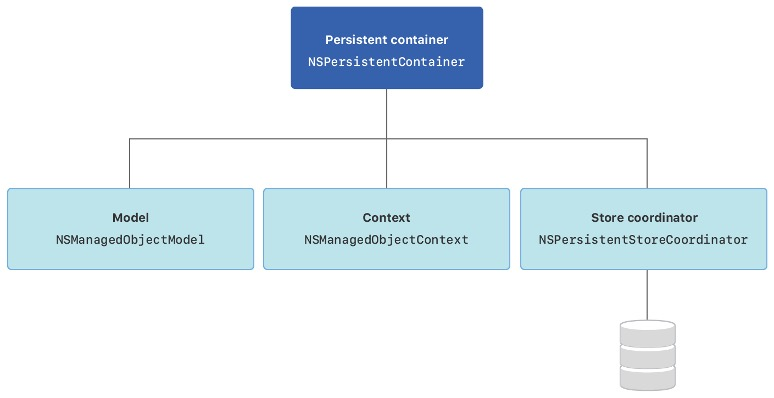
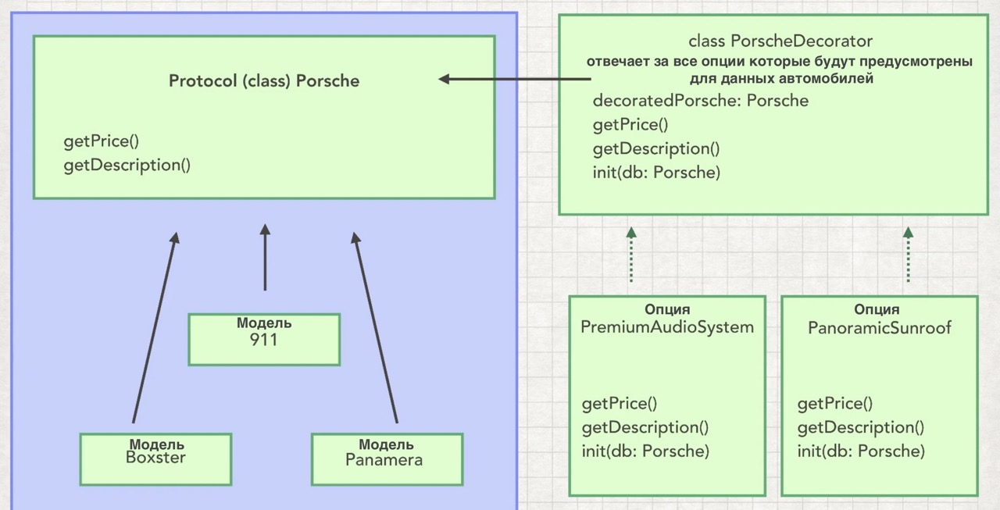

Третья  часть коспекта, из-за ограничей Github был разделен единый файл коспекта на части.

- [Вернуться к первой части коспекта](https://github.com/artemiosdev/Swift-Manual-my-notes)

- [Вернуться ко второй части коспекта](https://github.com/artemiosdev/Swift-Manual-my-notes/blob/main/READMEpart2.md)

---

<a id="contents" />Оглавление

### ЧАСТЬ V Фреймворки

- [Глава №31. Core Data](#coredata)


### ЧАСТЬ VI 

- [Глава №32. Grand Central Dispatch](#gcd)
- [Глава №33. API – Application Programming Interface](#api)
- [Глава №34. Паттерны проектирования](#patterns)

---

[К оглавлению](#contents)

###  <a id="coredata" /> Глава №31. Core Data

[#CoreData](https://developer.apple.com/documentation/coredata) – нативный фреймворк от Apple для хранения данных пользователя у него на устройстве. Это не база данных.

Необходимый код в проекте для работы с CoreData. Можно добавить при создании приложения, или уже к созданному опционально. Вставляется код ниже в файлы, создается файл с расширением [.xcdatamodeld](https://developer.apple.com/documentation/coredata/creating_a_core_data_model) для сущностей-entity.

AppDelegate.swift
```swift
import UIKit
import CoreData

@UIApplicationMain
class AppDelegate: UIResponder, UIApplicationDelegate {
    
...

// MARK: - Core Data stack
    lazy var persistentContainer: NSPersistentContainer = {
        /*
         The persistent container for the application. This implementation
         creates and returns a container, having loaded the store for the
         application to it. This property is optional since there are legitimate
         error conditions that could cause the creation of the store to fail.
         */
        let container = NSPersistentContainer(name: "ProjectName")
        container.loadPersistentStores(completionHandler: { (storeDescription, error) in
            if let error = error as NSError? {
                // Replace this implementation with code to handle the error appropriately.
                // fatalError() causes the application to generate a crash log and terminate. 
                // You should not use this function in a shipping application, 
                // although it may be useful during development.
                
                /*
                 Typical reasons for an error here include:
                 * The parent directory does not exist, cannot be created, or disallows writing.
                 * The persistent store is not accessible, due to permissions or data protection 
                when the device is locked.
                 * The device is out of space.
                 * The store could not be migrated to the current model version.
                 Check the error message to determine what the actual problem was.
                 */
                fatalError("Unresolved error \(error), \(error.userInfo)")
            }
        })
        return container
    }()
    
    // MARK: - Core Data Saving support
    
    func saveContext () {
        let context = persistentContainer.viewContext
        if context.hasChanges {
            do {
                try context.save()
            } catch {
                // Replace this implementation with code to handle the error appropriately.
                // fatalError() causes the application to generate a crash log and terminate. 
                // You should not use this function in a shipping application, 
                // although it may be useful during development.
                let nserror = error as NSError
                fatalError("Unresolved error \(nserror), \(nserror.userInfo)")
            }
        }
    }
    
}
```

SceneDelegate.swift
```swift
import UIKit

class SceneDelegate: UIResponder, UIWindowSceneDelegate {

...

    func sceneDidEnterBackground(_ scene: UIScene) {
        // Called as the scene transitions from the foreground to the background.
        // Use this method to save data, release shared resources, and store enough scene-specific state information
        // to restore the scene back to its current state.
        
        // Save changes in the application's managed object context when the application transitions to the background.
        (UIApplication.shared.delegate as? AppDelegate)?.saveContext()
    } 
}
```


Создадим новую сущность-класс Name она будет моделью. 


- [Generating Code](https://developer.apple.com/documentation/coredata/modeling_data/generating_code ) автоматически или вручную создавайте подклассы управляемых объектов из сущностей (entities).
    - **Class #Definition** – класс будет существовать в системе, к нему нет прямого доступа из Navigator, не виден в Xcode.
    - **#Manual/None** – полный ручной контроль над классом, можно добавить свою логику. Нужно вручную добавить. Class будет в проекте. Будут созданы 2 файла для сущности, сам класс и расширение к нему со свойствами
    - **#Category/Extension** – только Extension

Данные классы и файлы по сборкам лежат в папке `DerivedData`, при ошибках почистить данную папку, проваливаясь вглубь можно найти сами классы если выбрано "Class Definition"

Почистить можно вручную (Xcode -> Настройки ->Locations) или в консоле 
`rm -rf ~/Library/Developer/Xcode/DerivedData/*`

Пример файлов:

Name+CoreDataClass.swift
```swift
import Foundation
import CoreData

@objc(Name)
public class Name: NSManagedObject {

}
```

Task+CoreDataProperties.swift
```swift
import Foundation
import CoreData
extension Name {
   @nonobjc public class func fetchRequest() -> NSFetchRequest<Name> {
        return NSFetchRequest<Name>(entityName: "Name")
    }
    @NSManaged public var title: String?

}
extension Name : Identifiable {
}
```


- [#CoreDataStack](https://developer.apple.com/documentation/coredata/core_data_stack) – механизм внутри фреймворка Core Data, который позволяет хранить данные на постоянной основе. Persistent Store – постоянное хранилище информации. Весь механизм внутри Persistent Container. И состоит из 3 основных классов с которыми мы сталкиваемся: 
    - **Managed Object Context** – это наш контекст который нужно сохранить, это изменения. 
    - **Persistent Store Coordinator** – определяет на основек какой модели (Managed Object Model) мы будем хранить данные 
    - **Managed Object Model** - сама модель
    - **Persistent Store** – постоянное хранилище информации


Внутри **Persistent #Container** и есть наш **CoreDataStack**


[Здесь больше информации о типах](https://developer.apple.com/library/archive/documentation/Cocoa/Conceptual/CoreData/PersistentStoreFeatures.html)


- [Core Data Stack](https://developer.apple.com/documentation/coredata/core_data_stack) - manage and persist your app’s model layer.
    - Экземпляр **#NSManagedObjectModel** описывает типы вашего приложения, включая их свойства и взаимосвязи.
    - Экземпляр **#NSManagedObjectContext** отслеживает изменения в экземплярах типов вашего приложения.
    - Экземпляр **#NSPersistentStoreCoordinator** сохраняет и извлекает экземпляры типов вашего приложения из хранилищ.



Сохранение `context.save()` и удаление `context.delete(...)` данных CoreData

- [Class NSManagedObject](https://developer.apple.com/documentation/coredata/nsmanagedobject) - A base class that implements the behavior for a Core Data model object
- [Class NSPersistentContainer](https://developer.apple.com/documentation/coredata/nspersistentcontainer) - A container that encapsulates the Core Data stack in your app.
- [NSFetchRequest](https://developer.apple.com/documentation/coredata/nsfetchrequest) - A description of search criteria used to retrieve data from a persistent store.

Примеры использования в `Small-projects`:
- [MyCars](https://github.com/artemiosdev/Small-projects/tree/main/MyCars/MyCars)
- [MealTime](https://github.com/artemiosdev/Small-projects/tree/main/MealTime/MealTime)
- [ToDoList](https://github.com/artemiosdev/Small-projects/tree/main/ToDoList/ToDoList)

---

[К оглавлению](#contents)

###  <a id="gcd" /> Глава №32. Grand Central Dispatch 

### [Папка с примерами использования #GCD](https://github.com/artemiosdev/Small-projects/tree/main/GCD) 

Многопоточность – #multithreading

Поток – #thread

Задачи могут выполняться параллейно ТОЛЬКО если они не зависят друг от друга


### #Очереди, #Queue
#Serial #Queue – последовательная очередь. FIFO (first in, first out)


#Concurrent #Queue – согласованная очередь. Могут начинаться последовательно, а выполняться параллейно


#Main queue – главная очередь (она serial queue), последовательное выполнение, отвечает за обновление интерфейса UI.


#Qos (quality of service) – определение приоритета очереди. Используется при создании очереди и задания приоритета им.


### Синхронность #sync и асинхронность #async

#async – задачи могут начинаются вместе, независимо друг от друга

#sync – 3 задача ждет выполнения 2 задачи


### Последовательность работы с очередями


### Задержка #asyncAfter

Позволяет выполнять какие-либо участки кода через определенное время.

```swift
  fileprivate func delay(_ delay: Double, closure: @escaping () -> ()) {
        DispatchQueue.main.asyncAfter(deadline: .now() + .seconds(delay)) {
            closure()
        }
} 
```

### Новая очередь. Барьеры #barriers отправки
#Queue #creation – создание очередей


Есть много атрибутов, можно выбрать нужные нам, остальные убрать, будут работать со значениями по умолчанию


#Barriers - #Барьеры


Задача в том что бы к «х» был доступ только у одного потока, если несколько потоков одновременно имеют доступ к «х» то будет искажение данных, чтение и запись, и результат будет непредсказуемым.
В такие моменты если нужно чтобы задача была выполнена одним потоком, мы можем грубо говоря «согласованную очередь» переделать в «последовательную»


Task 2 наш барьер, перед ее выполнением все задачи должны быть выполнены, она выполняется только одна, и все другие задачи ждут ее завершения, и не начинаются пока она не закончит, это критическая секция.

### Практика с барьерами #barriers
```swift
import UIKit
import PlaygroundSupport

PlaygroundPage.current.needsIndefiniteExecution = true

class SafeArray<Element> {
    private var array = [Element]()
    private let queue = DispatchQueue(label: "DispatchBarrier", attributes: .concurrent)
    
    public func append(element: Element) {
        queue.async(flags: .barrier) {
            self.array.append(element)
        }
    }
    
    public var elements: [Element] {
        var result = [Element]()
        queue.sync {
            result = self.array
        }
        
        return result
    }
}

var safeArray = SafeArray<Int>()
DispatchQueue.concurrentPerform(iterations: 20) { (index) in
    safeArray.append(element: index)
}
print("safeArray: \(safeArray.elements)")

var array = [Int]()
DispatchQueue.concurrentPerform(iterations: 20) { (index) in
    array.append(index)
}
print("array: \(array)")
```


### Группы #groups отправки


Другой вариант


### Группы #groups отправки. Практика

[#notify(queue:work:)](https://developer.apple.com/documentation/dispatch/dispatchgroup/2016084-notify) – планирует отправку блока в очередь, когда все задачи в текущей группе завершат выполнение.

[#wait(wallTimeout:)](https://developer.apple.com/documentation/dispatch/dispatchgroup/2016092-wait) – завершаем работу в конкретное время. 
Синхронно ожидает завершения ранее отправленной работы и возвращает, если работа не завершена до истечения указанного периода ожидания.

[#wait(timeout:)](https://developer.apple.com/documentation/dispatch/dispatchgroup/1780590-wait) – завершаем работу через … время, задержка. Синхронно ожидает завершения ранее отправленной работы и возвращает, если работа не завершена до истечения указанного периода ожидания

```swift
import UIKit
import PlaygroundSupport

PlaygroundPage.current.needsIndefiniteExecution = true

let queue = DispatchQueue(label: "ru.swiftbook", attributes: .concurrent)
let group = DispatchGroup()

queue.async(group: group) {
    for i in 0...10 {
        if i == 10 {
            print(i)
        }
    }
}

queue.async(group: group) {
    for i in 0...20 {
        if i == 20 {
            print(i)
        }
    }
}

group.notify(queue: .main) {
    print("Все закончено в группе: group")
}

let secondGroup = DispatchGroup()
secondGroup.enter()
queue.async(group: group) {
    for i in 0...30 {
        if i == 30 {
            print(i)
            sleep(2)
            secondGroup.leave()
        }
    }
}

let result = secondGroup.wait(timeout: .now() + 1)
print(result)

secondGroup.notify(queue: .main) {
    print("Все закончено в группе: secondGroup")
}
// срабатывает быстрее чем .notify, т.к не требует вычислений
print("Этот принт должен быть выше чем последний")
// ждет пока все группы выполнятся, и весь код выше отработает
secondGroup.wait()
```

```bash
Консоль: 10
20
30
timedOut
Этот принт должен быть выше чем последний
Все закончено в группе: secondGroup
Все закончено в группе: group
```

### Блоки #blocks отправки


### Блоки #blocks отправки. Практика

```swift
import UIKit
import PlaygroundSupport

PlaygroundPage.current.needsIndefiniteExecution = true

let workItem = DispatchWorkItem(qos: .utility, flags: .detached) {
    print("Performing workitem")
}

//workItem.perform()

let queue = DispatchQueue(label: "ru.swiftbook", qos: .utility, attributes: .concurrent, autoreleaseFrequency: .workItem, target: DispatchQueue.global(qos: .userInitiated))

queue.asyncAfter(deadline: .now() + 1, execute: workItem)

workItem.notify(queue: .main) {
    print("workitem is completed!")
}

// проверка на отмену cancel
workItem.isCancelled

// можем отменить
workItem.cancel()
workItem.isCancelled

// ожидание/таймаут, ждет пока код выше отработает
workItem.wait()
```

### Семафоры #semaphores отправки


Семафоры ограничивают количество потоков в секцию, некий барьер


### Семафоры #semaphores отправки. Практика

```swift
import UIKit
import PlaygroundSupport

PlaygroundPage.current.needsIndefiniteExecution = true

let queue = DispatchQueue(label: "ru.swiftbook.semaphores", attributes: .concurrent)

// разрешаем кол-во потоков которые могут идти одновременно
let semaphore = DispatchSemaphore(value: 2)

semaphore.signal()

queue.async {
    // ждем пока не получим сигнал
    semaphore.wait(timeout: .distantFuture)
    // усыпляем поток
    Thread.sleep(forTimeInterval: 4)
    print("Block 1")
   // сигнал, разрешаем следующему потомку пройти через этот блок кода
    semaphore.signal()
}

queue.async {
    semaphore.wait(timeout: .distantFuture)
    Thread.sleep(forTimeInterval: 2)
    print("Block 2")
    semaphore.signal()
}

queue.async {
    semaphore.wait(timeout: .distantFuture)
    print("Block 3")
    semaphore.signal()
}

queue.async {
    semaphore.wait(timeout: .distantFuture)
    print("Block 4")
//    semaphore.signal()
}
```

```bash
Консоль:
Block 3 – не ждет, мгновенно
Block 4 – не ждет, мгновенно
Block 2 – ждет 2 сек
Block 1 – ждет 4 сек
```

Другой параметр `value`

```swift
import UIKit
import PlaygroundSupport

PlaygroundPage.current.needsIndefiniteExecution = true

let queue = DispatchQueue(label: "ru.swiftbook.semaphores", attributes: .concurrent)

// разрешаем кол-во потоков которые могут идти одновременно
let semaphore = DispatchSemaphore(value: 0) // 0-1 - 0 - 1 - 0 - 1 - 2

// разрешаем 1 поток
semaphore.signal()

queue.async {
    // ждем пока не получим сигнал
    semaphore.wait(timeout: .distantFuture)
    // усыпляем поток
    Thread.sleep(forTimeInterval: 4)
    print("Block 1")
   // сигнал, разрешаем следующему потомку пройти через этот блок кода
    semaphore.signal()
}

queue.async {
    semaphore.wait(timeout: .distantFuture)
    Thread.sleep(forTimeInterval: 2)
    print("Block 2")
    semaphore.signal()
}

queue.async {
    semaphore.wait(timeout: .distantFuture)
    print("Block 3")
    semaphore.signal()
}

queue.async {
    semaphore.wait(timeout: .distantFuture)
    print("Block 4")
//  semaphore.signal()
}
```

```bash
Консоль:
Block 1
Block 2
Block 3
Block 4
```

### Источники отправки #Dispatch #sources

Это объекты которые помогают следить за различными низкоуровневыми процессами.


### Источники #dispatch #sources отправки. Практика

```swift
import UIKit
import PlaygroundSupport

PlaygroundPage.current.needsIndefiniteExecution = true

let queue = DispatchQueue(label: "ru.swiftbook.sources", attributes: .concurrent)

let timer = DispatchSource.makeTimerSource(queue: queue)

// расписание нашего таймера
timer.schedule(deadline: .now(), repeating: .seconds(2), leeway: .milliseconds(300))
// сделаем вызов
timer.setEventHandler {
    print("Hello, World!")
}

// блок отмены
timer.setCancelHandler {
    print("Timer is cancelled")
}
// запускаем таймер
timer.resume()
```

```bash
Каждые 2 секунды в консоле будет появляться «Hello, World!»
```

---

[К оглавлению](#contents)

###  <a id="api" /> Глава №33. API – Application Programming Interface

**#API – Application Programming Interface**, програмный интерфейс приложения. По сути это документация описывающая что мы можем получить от сервиса и какие запросы нужно отправить чтобы получить ту или иную информацию (аналогия с меню блюд, когда мы сидим в ресторане).

Это программный интерфейс приложения — это набор инструментов, который позволяет одним программам работать с другими. API предусматривает, что программы могут работать в том числе и на разных компьютерах

**#CRUD** (сокр. от англ. create, read-retrieve, update, delete — «создать, прочесть-получить, обновить-редактирование, удалить») —четыре базовые функции, используемые при работе с персистентными хранилищами данных:


**#RestAPI - REpresentational State Transfer**, апишка которая предоставляет нам интерфейс взаимодействия с веб-сервисом, это фактически архитектура на которой построено веб-приложение которое предоставляет нам api. 

**Rest** – это обозначение свидетельствующее о том, что каждый раз отправляя запрос на веб-сервис мы должны отправить все необходимые данные для запроса, этот сервис не запоминает состояние пользователя отправляющего запрос.

Форматы получения данных: #JSON(JavaScriptObjectNotation), XML

Транспорт: всегда HTTP. REST полностью построен на основе HTTP.

**Representational State Transfer (#REST)** — это передача состояния представления. Технология позволяет получать и модифицировать данные и состояния удаленных приложений, передавая HTTP-вызовы через интернет или любую другую сеть.

Если проще, REST API — это когда серверное приложение дает доступ к своим данным клиентскому приложению по определенному URL. 

Пример:
Бухгалтерское приложение для выставления счетов. Счета хранятся на сервере: мобильное приложение обращается к нему через API и показывает на экране то, что нужно.

REST API позволяет использовать для общения между программами протокол #HTTP (зашифрованная версия — #HTTPS), с помощью которого мы получаем и отправляем большую часть информации в интернете.

HTTP довольно прост. Допустим, есть адрес http://website.com/something. Он состоит из двух частей: первая — это адрес сайта или сервера, то есть http://website.com. Вторая — адрес ресурса на удаленном сервере, в данном примере — /something.
Вбивая в адресную строку URL-адрес http://website.com/something, мы на самом деле идем на сервер website.com и запрашиваем ресурс под названием /something. «Пойди вот туда, принеси мне вот то» — и есть HTTP-запрос.

### Для чего используют REST API
Архитектура REST API — самое популярное решение для организации взаимодействия между различными программами. Так произошло, поскольку HTTP-протокол реализован во всех языках программирования и всех операционных системах, в отличие от проприетарных протоколов.

Чаще всего REST API применяют:
- Для связи мобильных приложений с серверными.
- Для построения микросервисных серверных приложений. Это архитектурный подход, при котором большие приложения разбиваются на много маленьких частей.
- Для предоставления доступа к программам сторонних разработчиков. Например, Stripe API позволяет программистам встраивать обработку платежей в свои приложения.

Пример погодной апишки [OpenWeather](https://openweathermap.org/current#name)
 `
### Что такое JSON
Текстовый формат обмена данными, основанный на JS. Все данные между `{…}`, где внутри могут быть отдельные свойства, а также `{…}` – отдельный тип, или `[ { … } ]` – массив объекта

#Распарсить json – это значит разложить полученные данные по созданной нами модели

Чтобы распарсить можно использовать сайт [quicktype](https://app.quicktype.io/)

Пример

```js
{
"coord": {
"lon": -0.1257,
"lat": 51.5085
},
"weather": [
{
"id": 800,
"main": "Clear",
"description": "clear sky",
"icon": "01d"
}
],
"base": "stations",
"main": {
"temp": 11.96,
"feels_like": 10.99,
"temp_min": 10.31,
"temp_max": 13.06,
"pressure": 1031,
"humidity": 68
},
"visibility": 10000,
"wind": {
"speed": 2.57,
"deg": 140
},
"clouds": {
"all": 0
},
"dt": 1676303427,
"sys": {
"type": 2,
"id": 2075535,
"country": "GB",
"sunrise": 1676272749,
"sunset": 1676308230
},
"timezone": 0,
"id": 2643743,
"name": "London",
"cod": 200
}
```
Превращается в swift модель (можно выбрать любой язык)

```swift
// This file was generated from JSON Schema using quicktype, do not modify it directly.
// To parse the JSON, add this file to your project and do:
//
//   let welcome = try? JSONDecoder().decode(Welcome.self, from: jsonData)

import Foundation

// MARK: - Welcome
struct Welcome: Codable {
    let coord: Coord
    let weather: [Weather]
    let base: String
    let main: Main
    let visibility: Int
    let wind: Wind
    let clouds: Clouds
    let dt: Int
    let sys: Sys
    let timezone, id: Int
    let name: String
    let cod: Int
}

// MARK: - Clouds
struct Clouds: Codable {
    let all: Int
}

// MARK: - Coord
struct Coord: Codable {
    let lon, lat: Double
}

// MARK: - Main
struct Main: Codable {
    let temp, feelsLike, tempMin, tempMax: Double
    let pressure, humidity: Int

    enum CodingKeys: String, CodingKey {
        case temp
        case feelsLike = "feels_like"
        case tempMin = "temp_min"
        case tempMax = "temp_max"
        case pressure, humidity
    }
}

// MARK: - Sys
struct Sys: Codable {
    let type, id: Int
    let country: String
    let sunrise, sunset: Int
}

// MARK: - Weather
struct Weather: Codable {
    let id: Int
    let main, description, icon: String
}

// MARK: - Wind
struct Wind: Codable {
    let speed: Double
    let deg: Int
}
```

---

[К оглавлению](#contents)

###  <a id="patterns" /> Глава №34. Паттерны проектирования

Существует три категории паттернов: порождающие, структурные, поведенческие

**Порождающие паттерны** – работают с инициализацией объектов. Абстрагируются от самой инициализации конкретного типа в какой-то абстрактный тип (протокол к примеру)

**Структурные паттерны** – работает с интерфейсами, и преобразует их 

**Поведенческие паттерны** – обеспечивают гибкое взаимодействие между типами/объектами


---

### Strategy
Поведенческий паттерн. Позволяет не плодить классы с подклассами, а сделать более гибкое решение.

https://refactoring.guru/ru/design-patterns/strategy

**#Стратегия** — это поведенческий паттерн проектирования, который определяет семейство схожих алгоритмов и помещает каждый из них в собственный класс, после чего алгоритмы можно взаимозаменять прямо во время исполнения программы.

Паттерн Стратегия предлагает определить семейство схожих алгоритмов, которые часто изменяются или расширяются, и вынести их в собственные классы, называемые стратегиями.

Вместо того, чтобы изначальный класс сам выполнял тот или иной алгоритм, он будет играть роль контекста, ссылаясь на одну из стратегий и делегируя ей выполнение работы. Чтобы сменить алгоритм, вам будет достаточно подставить в контекст другой объект-стратегию.

Важно, чтобы все стратегии имели общий интерфейс. Используя этот интерфейс, контекст будет независимым от конкретных классов стратегий. С другой стороны, вы сможете изменять и добавлять новые виды алгоритмов, не трогая код контекста.

Аналогия из жизни. Вам нужно добраться до аэропорта. Можно доехать на автобусе, такси или велосипеде. Здесь вид транспорта является стратегией. Вы выбираете конкретную стратегию в зависимости от контекста — наличия денег или времени до отлёта


Используем протокол как тип, для свойств class Human

```swift
protocol SwimBehavior {
    func swim()
}

class ProfessionalSwimmer: SwimBehavior {
    func swim() {
        print("professional swimming")
    }
}

class NewbieSwimmer: SwimBehavior {
    func swim() {
        print("newbie swimming")
    }
}

class NonSwimmer: SwimBehavior {
    func swim() {
        print("non-swimming")
    }
}


protocol DiveBehavior {
    func dive()
}


class ProfessionalDiver: DiveBehavior {
    func dive() {
        print("professional diving")
    }
}


class NewbieDiver: DiveBehavior {
    func dive() {
        print("newbie diving")
    }
}

class NonDiver: DiveBehavior {
    func dive() {
        print("non-diving")
    }
}


class Human {
    private var diveBehavior: DiveBehavior
    private var swimBehavior: SwimBehavior
    
    func performSwim() {
        swimBehavior.swim()
    }
    
    func performDive() {
        diveBehavior.dive()
    }
    
    func setSwimBehavior(sb: SwimBehavior) {
        self.swimBehavior = sb
    }
    
    func setDiveBehavior(db: DiveBehavior) {
        self.diveBehavior = db
    }
    
    func run() {
        print("running")
    }
    
    init(swimBehavior: SwimBehavior, diveBehavior: DiveBehavior) {
        self.swimBehavior = swimBehavior
        self.diveBehavior = diveBehavior
    }
}

let human = Human(swimBehavior: ProfessionalSwimmer(), diveBehavior: ProfessionalDiver())
human.performSwim() // professional swimming
human.performDive() // professional diving
human.setSwimBehavior(sb: NonSwimmer())
human.performSwim() // non-swimming
```


---

### Observer - наблюдатель
Поведенческий паттерн.

https://refactoring.guru/ru/design-patterns/observer

**#Наблюдатель** — это поведенческий паттерн проектирования, который создаёт механизм подписки, позволяющий одним объектам следить и реагировать на события, происходящие в других объектах.

Аналогия из жизни. После того как вы оформили подписку на газету или журнал, вам больше не нужно ездить в супермаркет и проверять, не вышел ли очередной номер. Вместо этого издательство будет присылать новые номера по почте прямо к вам домой сразу после их выхода.

Издательство ведёт список подписчиков и знает, кому какой журнал высылать. Вы можете в любой момент отказаться от подписки, и журнал перестанет вам приходить.

Один ко многим, то есть один объект за которым наблюдают  другие объекты. Аналогия с учителем, где все ученики следят за ним т.е он главный объект, а они наблюдатели, он раздаёт всем домашнее задание, а ученики его получают.


```swift
import Foundation

// протокол учителя
protocol Subject {
    // добавляем нового ученика-наблюдателя
    func add(observer: PropertyObserver)
    // убираем ученика-наблюдателя
    func remove(observer: PropertyObserver)
    // уведомляем наших наблюдателей об изменениях (дз, новости)
    func notify(withString string: String)
}

// сам учитель
class Teacher: Subject {
    
    // изменяемая коллекция наблюдателей, каждый элемент единственный
    // аналогия с "журналом учителя"
    // объекты которые "подписаны" под изменения дз
    var observerCollection = NSMutableSet()
    
    // домашняя работа
    // при появлении дз идет уведомление для всех учеников-наблюдателей
    var homeTask = "" {
        didSet {
            notify(withString: homeTask)
        }
    }
    
    func add(observer: PropertyObserver) {
        observerCollection.add(observer)
    }

    func remove(observer: PropertyObserver) {
        observerCollection.remove(observer)
    }
    
    func notify(withString string: String) {
        for observer in observerCollection {
            (observer as! PropertyObserver).didGet(newTask: string)
        }
    }
}


protocol PropertyObserver {
    // получаем дз
    func didGet(newTask task: String)
}

class Pupil: NSObject, PropertyObserver {
    
    var homeTask = ""
    
    func didGet(newTask task: String) {
        homeTask = task
        print("Получена новая домашняя работа: \(homeTask)")
    }
}

let teacher = Teacher()
let newPupil = Pupil()

teacher.add(observer: newPupil)
teacher.homeTask = "Повторить паттерны проектирования для успешного прохождения собеседования"

newPupil.homeTask
// Получена новая домашняя работа:
// Повторить паттерны проектирования для успешного прохождения собеседования
```


---

### Decorator

https://refactoring.guru/ru/design-patterns/decorator 

**#Декоратор** — это структурный паттерн проектирования, который позволяет динамически добавлять объектам новую функциональность, оборачивая их в полезные «обёртки». По сути можем наследоваться от нескольких классов, один объект "оборачиваем" в другой, и так далее.

**#Decorator** имеет альтернативное название — **#обёртка**. Оно более точно описывает суть паттерна: вы помещаете целевой объект в другой объект-обёртку, который запускает базовое поведение объекта, а затем добавляет к результату что-то своё.

Оба объекта имеют общий интерфейс, поэтому для пользователя нет никакой разницы, с каким объектом работать — чистым или обёрнутым. Вы можете использовать несколько разных обёрток одновременно — результат будет иметь объединённое поведение всех обёрток сразу.

Аналогия из жизни. Любая одежда — это аналог Декоратора. Применяя Декоратор, вы не меняете первоначальный класс и не создаёте дочерних классов. Так и с одеждой — надевая свитер, вы не перестаёте быть собой, но получаете новое свойство — защиту от холода. Вы можете пойти дальше и надеть сверху ещё один декоратор — плащ, чтобы защититься и от дождя.


```swift
// Decorator
protocol Porsche {
    func getPrice() -> Double
    func getDescription() -> String
}

class Boxster: Porsche {
    func getPrice() -> Double {
        return 120
    }
    func getDescription() -> String {
        return "Porsche Boxster"
    }
}

// отвечает за все опции которые будут предусмотрены для данных автомобилей
class PorscheDecorator: Porsche {
    // добавляем к автомобилю опцию
    private let decoratedPorsche: Porsche
    
    required init(dp: Porsche) {
        self.decoratedPorsche = dp
    }
    
    func getPrice() -> Double {
        return decoratedPorsche.getPrice()
    }
    
    func getDescription() -> String {
        return decoratedPorsche.getDescription()
    }
}

class PremiumAudioSystem: PorscheDecorator {
    required init(dp: Porsche) {
        super.init(dp: dp)
    }
    
    override func getPrice() -> Double {
        return super.getPrice() + 30
    }
    
    override func getDescription() -> String {
        return super.getDescription() + " with premium audio system"
    }
}


class PanoramicSunroof: PorscheDecorator {
    required init(dp: Porsche) {
        super.init(dp: dp)
    }
    
    override func getPrice() -> Double {
        return super.getPrice() + 20
    }
    
    override func getDescription() -> String {
        return super.getDescription() + " with panoramic sunroof"
    }
}

var porscheBoxster: Porsche = Boxster()
porscheBoxster.getDescription() // Porsche Boxster
porscheBoxster.getPrice() // 120

porscheBoxster = PremiumAudioSystem(dp: porscheBoxster)
porscheBoxster.getDescription()
// Porsche Boxster with premium audio system

porscheBoxster.getPrice() // 150

porscheBoxster = PanoramicSunroof(dp: porscheBoxster)
porscheBoxster.getDescription()

// Porsche Boxster with premium audio system with panoramic sunroof
porscheBoxster.getPrice() // 170
```



---

### Simple Factory

Категория порождающих паттернов. Помогает нам при создании объектов. Удобно изменять код в одном месте, если нужно что-то поменять

Это неполноценный паттерн, это мостик к пониманию Factory Method и Abstract Factory (будут рассмотрены далее).


```swift
// Simple Factory
enum CarType {
    case huge, fast
}

protocol Car {
    func drive()
}

class HugeCar: Car {
    func drive() {
        print("you drive huge car")
    }
}

class FastCar: Car {
    func drive() {
        print("you drive fast car")
    }
}

let hugeCar = HugeCar()
hugeCar.drive()

let fastCar = FastCar()
fastCar.drive()

// фабрика которая создает авто
// в зависимости от передаваемого типа в метод

// если в проекте что-то поменяется, то все изменения
// можно сделать именно здесь, а не бегать по всему проекту
// сюда мы переносим ответственность за создание объектов
class CarFactory {
    static func produceCar(type: CarType) -> Car {
        var car: Car
        
        switch type {
        case .fast: car = FastCar()
        case .huge: car = HugeCar()
        }
        
        return car
    }
}

let hugeCar1 = CarFactory.produceCar(type: .huge)
let fastCar1 = CarFactory.produceCar(type: .fast)
```


---

### Factory Method

https://refactoring.guru/ru/design-patterns/factory-method

Порождающий паттерн.

#Фабричный метод, #фабрика — это порождающий паттерн проектирования, который определяет общий интерфейс для создания объектов в суперклассе, позволяя подклассам изменять тип создаваемых объектов.


Для каждого транспортного средства создадим свою отдельную фабрику (для легковых, для грузовых, для автобусов).

```swift
// интерфейс для транспортных средств
protocol Vehicle {
    func drive()
}

class Car: Vehicle {
    func drive() {
        print("drive a car")
    }
}

class Truck: Vehicle {
    func drive() {
        print("drive a truck")
    }
}

class Bus: Vehicle {
    func drive() {
        print("drive a bus")
    }
}

// протокол создания фабрик для различных транспортных средств
protocol VehicleFactory {
    func produce() -> Vehicle
}

class CarFactory: VehicleFactory {
        func produce() -> Vehicle {
        print("car is created")
        return Car()
    }
}

class TruckFactory: VehicleFactory {
    func produce() -> Vehicle {
        print("truck is created")
        return Truck()
    }
}

class  BusFactory: VehicleFactory {
    func produce() -> Vehicle {
        print("bus is created")
        return Bus()
    }
}

let carFacory = CarFactory()
let car = carFacory.produce() // car is created

let truckFactory = TruckFactory()
let truck = truckFactory.produce() // truck is created

let busFactory = BusFactory()
let bus = busFactory.produce() // bus is created
```


---

### Abstract Factory
https://refactoring.guru/ru/design-patterns/abstract-factory

Пораждающий паттерн.

#Абстрактная фабрика — это порождающий паттерн проектирования, который позволяет создавать семейства связанных объектов, не привязываясь к конкретным классам создаваемых объектов.

Проблема:

Представьте, что вы пишете симулятор мебельного магазина. Ваш код содержит:

Семейство зависимых продуктов. Скажем, Кресло + Диван + Столик.

Несколько вариаций этого семейства. Например, продукты Кресло, Диван и Столик представлены в трёх разных стилях: Ар-деко, Викторианском и Модерне.

Вам нужен такой способ создавать объекты продуктов, чтобы они сочетались с другими продуктами того же семейства. Это важно, так как клиенты расстраиваются, если получают несочетающуюся мебель.


```swift
// Abstract Factory
protocol Car {
    func drive()
}

class LittleSizeCar: Car {
    func drive() {
        print("drive a little car")
    }
}

class MiddleSizeCar: Car {
    func drive() {
        print("drive a middle car")
    }
}

protocol Bus {
    func drive()
}

class LittleSizeBus: Bus {
    func drive() {
        print("drive a little bus")
    }
}

class MiddleSizeBus: Bus {
    func drive() {
        print("drive a middle size bus")
    }
}


protocol Factory {
    func produceBus() -> Bus
    func produceCar() -> Car
}

class LittleSizeFactory: Factory {
    func produceBus() -> Bus {
        print("Little bus is created")
        return LittleSizeBus()
    }
    
    func produceCar() -> Car {
        print("Little size car is creates")
        return LittleSizeCar()
    }
}

class MiddleSizeFactory: Factory {
    func produceBus() -> Bus {
        print("Middle size bus is created")
        return MiddleSizeBus()
    }
    
    func produceCar() -> Car {
        print("Middle size car is creates")
        return MiddleSizeCar()
    }
}

let littleFactory = LittleSizeFactory()
littleFactory.produceCar() // Little size car is creates

let middleFactory = MiddleSizeFactory()
middleFactory.produceBus() // Middle size bus is creates
```


---


```swift

```


---

### 


```swift

```


---

### 


```swift

```


---

### 


```swift

```


---

### 


```swift

```


---

### 


```swift

```


---

### 


```swift

```


---

### 


```swift

```


---

### 


```swift

```


---

### 


```swift

```


---


