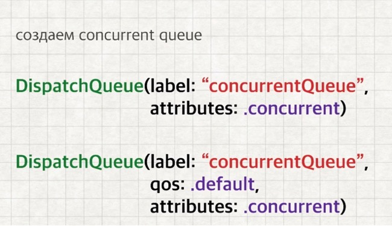
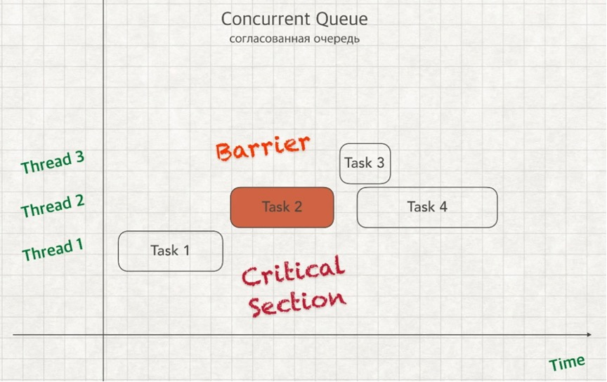

Третья  часть коспекта, из-за ограничей Github был разделен единый файл коспекта на части.

- [Вернуться к первой части коспекта](https://github.com/artemiosdev/Swift-Manual-my-notes)

- [Вернуться ко второй части коспекта](https://github.com/artemiosdev/Swift-Manual-my-notes/blob/main/READMEpart2.md)

---

<a id="contents" />Оглавление

### ЧАСТЬ V ФРЕЙМВОРКИ

- [Глава  №29. UIKit. ](https://github.com/artemiosdev/Swift-Manual-my-notes/blob/main/UIKit%20notes.md)
- [Глава №30. Core Data](#coredata)

### ЧАСТЬ VI 

- [Глава №31. Grand Central Dispatch](#gcd)
- [Глава №32. API – Application Programming Interface](#api)

### ЧАСТЬ VII АРХИТЕКТУРЫ И ПАТТЕРНЫ
- [Глава №33. Архитектурный паттерн MVC](#mvc)
- [Глава №34. Архитектурный паттерн MVVM](#mvvm)
- [Глава №35. Паттерны проектирования](#patterns)

### ЧАСТЬ VIII

- [Глава №36. Опциональные цепочки ](#chapter36)


---

[К оглавлению](#contents)

### ЧАСТЬ V ФРЕЙМВОРКИ

###  <a id="coredata" /> Глава №30. Core Data

[#CoreData](https://developer.apple.com/documentation/coredata) – нативный фреймворк от Apple для хранения данных пользователя у него на устройстве. Это не база данных.

Необходимый код в проекте для работы с CoreData. Можно добавить при создании приложения, или уже к созданному опционально. Вставляется код ниже в файлы, создается файл с расширением [.xcdatamodeld](https://developer.apple.com/documentation/coredata/creating_a_core_data_model) для сущностей-entity.

AppDelegate.swift
```swift
import UIKit
import CoreData

@UIApplicationMain
class AppDelegate: UIResponder, UIApplicationDelegate {
    
...

// MARK: - Core Data stack
    lazy var persistentContainer: NSPersistentContainer = {
        /*
         The persistent container for the application. This implementation
         creates and returns a container, having loaded the store for the
         application to it. This property is optional since there are legitimate
         error conditions that could cause the creation of the store to fail.
         */
        let container = NSPersistentContainer(name: "ProjectName")
        container.loadPersistentStores(completionHandler: { (storeDescription, error) in
            if let error = error as NSError? {
                // Replace this implementation with code to handle the error appropriately.
                // fatalError() causes the application to generate a crash log and terminate. 
                // You should not use this function in a shipping application, 
                // although it may be useful during development.
                
                /*
                 Typical reasons for an error here include:
                 * The parent directory does not exist, cannot be created, or disallows writing.
                 * The persistent store is not accessible, due to permissions or data protection 
                when the device is locked.
                 * The device is out of space.
                 * The store could not be migrated to the current model version.
                 Check the error message to determine what the actual problem was.
                 */
                fatalError("Unresolved error \(error), \(error.userInfo)")
            }
        })
        return container
    }()
    
    // MARK: - Core Data Saving support
    
    func saveContext () {
        let context = persistentContainer.viewContext
        if context.hasChanges {
            do {
                try context.save()
            } catch {
                // Replace this implementation with code to handle the error appropriately.
                // fatalError() causes the application to generate a crash log and terminate. 
                // You should not use this function in a shipping application, 
                // although it may be useful during development.
                let nserror = error as NSError
                fatalError("Unresolved error \(nserror), \(nserror.userInfo)")
            }
        }
    }
    
}
```

SceneDelegate.swift
```swift
import UIKit

class SceneDelegate: UIResponder, UIWindowSceneDelegate {

...

    func sceneDidEnterBackground(_ scene: UIScene) {
        // Called as the scene transitions from the foreground to the background.
        // Use this method to save data, release shared resources, and store enough scene-specific state information
        // to restore the scene back to its current state.
        
        // Save changes in the application's managed object context when the application transitions to the background.
        (UIApplication.shared.delegate as? AppDelegate)?.saveContext()
    } 
}
```


Создадим новую сущность-класс Name она будет моделью. 


- [Generating Code](https://developer.apple.com/documentation/coredata/modeling_data/generating_code ) автоматически или вручную создавайте подклассы управляемых объектов из сущностей (entities).
    - **Class #Definition** – класс будет существовать в системе, к нему нет прямого доступа из Navigator, не виден в Xcode.
    - **#Manual/None** – полный ручной контроль над классом, можно добавить свою логику. Нужно вручную добавить. Class будет в проекте. Будут созданы 2 файла для сущности, сам класс и расширение к нему со свойствами
    - **#Category/Extension** – только Extension

Данные классы и файлы по сборкам лежат в папке `DerivedData`, при ошибках почистить данную папку, проваливаясь вглубь можно найти сами классы если выбрано "Class Definition"

Почистить можно вручную (Xcode -> Настройки ->Locations) или в консоле 
`rm -rf ~/Library/Developer/Xcode/DerivedData/*`

Пример файлов:

Name+CoreDataClass.swift
```swift
import Foundation
import CoreData

@objc(Name)
public class Name: NSManagedObject {

}
```

Task+CoreDataProperties.swift
```swift
import Foundation
import CoreData
extension Name {
   @nonobjc public class func fetchRequest() -> NSFetchRequest<Name> {
        return NSFetchRequest<Name>(entityName: "Name")
    }
    @NSManaged public var title: String?

}
extension Name : Identifiable {
}
```


- [#CoreDataStack](https://developer.apple.com/documentation/coredata/core_data_stack) – механизм внутри фреймворка Core Data, который позволяет хранить данные на постоянной основе. Persistent Store – постоянное хранилище информации. Весь механизм внутри Persistent Container. И состоит из 3 основных классов с которыми мы сталкиваемся: 
    - **Managed Object Context** – это наш контекст который нужно сохранить, это изменения. 
    - **Persistent Store Coordinator** – определяет на основек какой модели (Managed Object Model) мы будем хранить данные 
    - **Managed Object Model** - сама модель
    - **Persistent Store** – постоянное хранилище информации


Внутри **Persistent #Container** и есть наш **CoreDataStack**


[Здесь больше информации о типах](https://developer.apple.com/library/archive/documentation/Cocoa/Conceptual/CoreData/PersistentStoreFeatures.html)


- [Core Data Stack](https://developer.apple.com/documentation/coredata/core_data_stack) - manage and persist your app’s model layer.
    - Экземпляр **#NSManagedObjectModel** описывает типы вашего приложения, включая их свойства и взаимосвязи.
    - Экземпляр **#NSManagedObjectContext** отслеживает изменения в экземплярах типов вашего приложения.
    - Экземпляр **#NSPersistentStoreCoordinator** сохраняет и извлекает экземпляры типов вашего приложения из хранилищ.


Сохранение `context.save()` и удаление `context.delete(...)` данных CoreData

- [Class NSManagedObject](https://developer.apple.com/documentation/coredata/nsmanagedobject) - A base class that implements the behavior for a Core Data model object
- [Class NSPersistentContainer](https://developer.apple.com/documentation/coredata/nspersistentcontainer) - A container that encapsulates the Core Data stack in your app.
- [NSFetchRequest](https://developer.apple.com/documentation/coredata/nsfetchrequest) - A description of search criteria used to retrieve data from a persistent store.

Примеры использования в `Small-projects`:
- [MyCars](https://github.com/artemiosdev/Small-projects/tree/main/MyCars/MyCars)
- [MealTime](https://github.com/artemiosdev/Small-projects/tree/main/MealTime/MealTime)
- [ToDoList](https://github.com/artemiosdev/Small-projects/tree/main/ToDoList/ToDoList)

---

[К оглавлению](#contents)

### ЧАСТЬ VI 

###  <a id="gcd" /> Глава №31. Grand Central Dispatch 

### [Папка с примерами использования #GCD](https://github.com/artemiosdev/Small-projects/tree/main/GCD) 

Многопоточность – #multithreading

Поток – #thread

Задачи могут выполняться параллейно ТОЛЬКО если они не зависят друг от друга


### #Очереди, #Queue
#Serial #Queue – последовательная очередь. FIFO (first in, first out)


#Concurrent #Queue – согласованная очередь. Могут начинаться последовательно, а выполняться параллейно


#Main queue – главная очередь (она serial queue), последовательное выполнение, отвечает за обновление интерфейса UI.


#Qos (quality of service) – определение приоритета очереди. Используется при создании очереди и задания приоритета им.


### Синхронность #sync и асинхронность #async

#async – задачи могут начинаются вместе, независимо друг от друга

#sync – 3 задача ждет выполнения 2 задачи


### Последовательность работы с очередями


### Задержка #asyncAfter

Позволяет выполнять какие-либо участки кода через определенное время.

```swift
  fileprivate func delay(_ delay: Double, closure: @escaping () -> ()) {
        DispatchQueue.main.asyncAfter(deadline: .now() + .seconds(delay)) {
            closure()
        }
} 
```

### Новая очередь. Барьеры #barriers отправки
#Queue #creation – создание очередей


Есть много атрибутов, можно выбрать нужные нам, остальные убрать, будут работать со значениями по умолчанию



#Barriers - #Барьеры


Задача в том что бы к «х» был доступ только у одного потока, если несколько потоков одновременно имеют доступ к «х» то будет искажение данных, чтение и запись, и результат будет непредсказуемым.
В такие моменты если нужно чтобы задача была выполнена одним потоком, мы можем грубо говоря «согласованную очередь» переделать в «последовательную»



Task 2 наш барьер, перед ее выполнением все задачи должны быть выполнены, она выполняется только одна, и все другие задачи ждут ее завершения, и не начинаются пока она не закончит, это критическая секция.

### Практика с барьерами #barriers
```swift
import UIKit
import PlaygroundSupport

PlaygroundPage.current.needsIndefiniteExecution = true

class SafeArray<Element> {
    private var array = [Element]()
    private let queue = DispatchQueue(label: "DispatchBarrier", attributes: .concurrent)
    
    public func append(element: Element) {
        queue.async(flags: .barrier) {
            self.array.append(element)
        }
    }
    
    public var elements: [Element] {
        var result = [Element]()
        queue.sync {
            result = self.array
        }
        
        return result
    }
}

var safeArray = SafeArray<Int>()
DispatchQueue.concurrentPerform(iterations: 20) { (index) in
    safeArray.append(element: index)
}
print("safeArray: \(safeArray.elements)")

var array = [Int]()
DispatchQueue.concurrentPerform(iterations: 20) { (index) in
    array.append(index)
}
print("array: \(array)")
```


### Группы #groups отправки


Другой вариант


### Группы #groups отправки. Практика

[#notify(queue:work:)](https://developer.apple.com/documentation/dispatch/dispatchgroup/2016084-notify) – планирует отправку блока в очередь, когда все задачи в текущей группе завершат выполнение.

[#wait(wallTimeout:)](https://developer.apple.com/documentation/dispatch/dispatchgroup/2016092-wait) – завершаем работу в конкретное время. 
Синхронно ожидает завершения ранее отправленной работы и возвращает, если работа не завершена до истечения указанного периода ожидания.

[#wait(timeout:)](https://developer.apple.com/documentation/dispatch/dispatchgroup/1780590-wait) – завершаем работу через … время, задержка. Синхронно ожидает завершения ранее отправленной работы и возвращает, если работа не завершена до истечения указанного периода ожидания

```swift
import UIKit
import PlaygroundSupport

PlaygroundPage.current.needsIndefiniteExecution = true

let queue = DispatchQueue(label: "ru.swiftbook", attributes: .concurrent)
let group = DispatchGroup()

queue.async(group: group) {
    for i in 0...10 {
        if i == 10 {
            print(i)
        }
    }
}

queue.async(group: group) {
    for i in 0...20 {
        if i == 20 {
            print(i)
        }
    }
}

group.notify(queue: .main) {
    print("Все закончено в группе: group")
}

let secondGroup = DispatchGroup()
secondGroup.enter()
queue.async(group: group) {
    for i in 0...30 {
        if i == 30 {
            print(i)
            sleep(2)
            secondGroup.leave()
        }
    }
}

let result = secondGroup.wait(timeout: .now() + 1)
print(result)

secondGroup.notify(queue: .main) {
    print("Все закончено в группе: secondGroup")
}
// срабатывает быстрее чем .notify, т.к не требует вычислений
print("Этот принт должен быть выше чем последний")
// ждет пока все группы выполнятся, и весь код выше отработает
secondGroup.wait()
```

```bash
Консоль: 10
20
30
timedOut
Этот принт должен быть выше чем последний
Все закончено в группе: secondGroup
Все закончено в группе: group
```

### Блоки #blocks отправки


### Блоки #blocks отправки. Практика

```swift
import UIKit
import PlaygroundSupport

PlaygroundPage.current.needsIndefiniteExecution = true

let workItem = DispatchWorkItem(qos: .utility, flags: .detached) {
    print("Performing workitem")
}

//workItem.perform()

let queue = DispatchQueue(label: "ru.swiftbook", qos: .utility, attributes: .concurrent, autoreleaseFrequency: .workItem, target: DispatchQueue.global(qos: .userInitiated))

queue.asyncAfter(deadline: .now() + 1, execute: workItem)

workItem.notify(queue: .main) {
    print("workitem is completed!")
}

// проверка на отмену cancel
workItem.isCancelled

// можем отменить
workItem.cancel()
workItem.isCancelled

// ожидание/таймаут, ждет пока код выше отработает
workItem.wait()
```

### Семафоры #semaphores отправки


Семафоры ограничивают количество потоков в секцию, некий барьер


### Семафоры #semaphores отправки. Практика

```swift
import UIKit
import PlaygroundSupport

PlaygroundPage.current.needsIndefiniteExecution = true

let queue = DispatchQueue(label: "ru.swiftbook.semaphores", attributes: .concurrent)

// разрешаем кол-во потоков которые могут идти одновременно
let semaphore = DispatchSemaphore(value: 2)

semaphore.signal()

queue.async {
    // ждем пока не получим сигнал
    semaphore.wait(timeout: .distantFuture)
    // усыпляем поток
    Thread.sleep(forTimeInterval: 4)
    print("Block 1")
   // сигнал, разрешаем следующему потомку пройти через этот блок кода
    semaphore.signal()
}

queue.async {
    semaphore.wait(timeout: .distantFuture)
    Thread.sleep(forTimeInterval: 2)
    print("Block 2")
    semaphore.signal()
}

queue.async {
    semaphore.wait(timeout: .distantFuture)
    print("Block 3")
    semaphore.signal()
}

queue.async {
    semaphore.wait(timeout: .distantFuture)
    print("Block 4")
//    semaphore.signal()
}
```

```bash
Консоль:
Block 3 – не ждет, мгновенно
Block 4 – не ждет, мгновенно
Block 2 – ждет 2 сек
Block 1 – ждет 4 сек
```

Другой параметр `value`

```swift
import UIKit
import PlaygroundSupport

PlaygroundPage.current.needsIndefiniteExecution = true

let queue = DispatchQueue(label: "ru.swiftbook.semaphores", attributes: .concurrent)

// разрешаем кол-во потоков которые могут идти одновременно
let semaphore = DispatchSemaphore(value: 0) // 0-1 - 0 - 1 - 0 - 1 - 2

// разрешаем 1 поток
semaphore.signal()

queue.async {
    // ждем пока не получим сигнал
    semaphore.wait(timeout: .distantFuture)
    // усыпляем поток
    Thread.sleep(forTimeInterval: 4)
    print("Block 1")
   // сигнал, разрешаем следующему потомку пройти через этот блок кода
    semaphore.signal()
}

queue.async {
    semaphore.wait(timeout: .distantFuture)
    Thread.sleep(forTimeInterval: 2)
    print("Block 2")
    semaphore.signal()
}

queue.async {
    semaphore.wait(timeout: .distantFuture)
    print("Block 3")
    semaphore.signal()
}

queue.async {
    semaphore.wait(timeout: .distantFuture)
    print("Block 4")
//  semaphore.signal()
}
```

```bash
Консоль:
Block 1
Block 2
Block 3
Block 4
```

### Источники отправки #Dispatch #sources

Это объекты которые помогают следить за различными низкоуровневыми процессами.


### Источники #dispatch #sources отправки. Практика

```swift
import UIKit
import PlaygroundSupport

PlaygroundPage.current.needsIndefiniteExecution = true

let queue = DispatchQueue(label: "ru.swiftbook.sources", attributes: .concurrent)

let timer = DispatchSource.makeTimerSource(queue: queue)

// расписание нашего таймера
timer.schedule(deadline: .now(), repeating: .seconds(2), leeway: .milliseconds(300))
// сделаем вызов
timer.setEventHandler {
    print("Hello, World!")
}

// блок отмены
timer.setCancelHandler {
    print("Timer is cancelled")
}
// запускаем таймер
timer.resume()
```

```bash
Каждые 2 секунды в консоле будет появляться «Hello, World!»
```

---

[К оглавлению](#contents)

###  <a id="api" /> Глава №32. API – Application Programming Interface

**#API – Application Programming Interface**, програмный интерфейс приложения. По сути это документация описывающая что мы можем получить от сервиса и какие запросы нужно отправить чтобы получить ту или иную информацию (аналогия с меню блюд, когда мы сидим в ресторане).

Это программный интерфейс приложения — это набор инструментов, который позволяет одним программам работать с другими. API предусматривает, что программы могут работать в том числе и на разных компьютерах

**#CRUD** (сокр. от англ. create, read-retrieve, update, delete — «создать, прочесть-получить, обновить-редактирование, удалить») —четыре базовые функции, используемые при работе с персистентными хранилищами данных:


**#RestAPI - REpresentational State Transfer**, апишка которая предоставляет нам интерфейс взаимодействия с веб-сервисом, это фактически архитектура на которой построено веб-приложение которое предоставляет нам api. 

**Rest** – это обозначение свидетельствующее о том, что каждый раз отправляя запрос на веб-сервис мы должны отправить все необходимые данные для запроса, этот сервис не запоминает состояние пользователя отправляющего запрос.

Форматы получения данных: #JSON(JavaScriptObjectNotation), XML

Транспорт: всегда HTTP. REST полностью построен на основе HTTP.

**Representational State Transfer (#REST)** — это передача состояния представления. Технология позволяет получать и модифицировать данные и состояния удаленных приложений, передавая HTTP-вызовы через интернет или любую другую сеть.

Если проще, REST API — это когда серверное приложение дает доступ к своим данным клиентскому приложению по определенному URL. 

Пример:
Бухгалтерское приложение для выставления счетов. Счета хранятся на сервере: мобильное приложение обращается к нему через API и показывает на экране то, что нужно.

REST API позволяет использовать для общения между программами протокол #HTTP (зашифрованная версия — #HTTPS), с помощью которого мы получаем и отправляем большую часть информации в интернете.

HTTP довольно прост. Допустим, есть адрес http://website.com/something. Он состоит из двух частей: первая — это адрес сайта или сервера, то есть http://website.com. Вторая — адрес ресурса на удаленном сервере, в данном примере — /something.
Вбивая в адресную строку URL-адрес http://website.com/something, мы на самом деле идем на сервер website.com и запрашиваем ресурс под названием /something. «Пойди вот туда, принеси мне вот то» — и есть HTTP-запрос.

### Для чего используют REST API
Архитектура REST API — самое популярное решение для организации взаимодействия между различными программами. Так произошло, поскольку HTTP-протокол реализован во всех языках программирования и всех операционных системах, в отличие от проприетарных протоколов.

Чаще всего REST API применяют:
- Для связи мобильных приложений с серверными.
- Для построения микросервисных серверных приложений. Это архитектурный подход, при котором большие приложения разбиваются на много маленьких частей.
- Для предоставления доступа к программам сторонних разработчиков. Например, Stripe API позволяет программистам встраивать обработку платежей в свои приложения.

Пример погодной апишки [OpenWeather](https://openweathermap.org/current#name)
 `
### Что такое JSON
Текстовый формат обмена данными, основанный на JS. Все данные между `{…}`, где внутри могут быть отдельные свойства, а также `{…}` – отдельный тип, или `[ { … } ]` – массив объекта

#Распарсить json – это значит разложить полученные данные по созданной нами модели

Чтобы распарсить можно использовать сайт [quicktype](https://app.quicktype.io/)

Пример

```js
{
"coord": {
"lon": -0.1257,
"lat": 51.5085
},
"weather": [
{
"id": 800,
"main": "Clear",
"description": "clear sky",
"icon": "01d"
}
],
"base": "stations",
"main": {
"temp": 11.96,
"feels_like": 10.99,
"temp_min": 10.31,
"temp_max": 13.06,
"pressure": 1031,
"humidity": 68
},
"visibility": 10000,
"wind": {
"speed": 2.57,
"deg": 140
},
"clouds": {
"all": 0
},
"dt": 1676303427,
"sys": {
"type": 2,
"id": 2075535,
"country": "GB",
"sunrise": 1676272749,
"sunset": 1676308230
},
"timezone": 0,
"id": 2643743,
"name": "London",
"cod": 200
}
```

Превращается в swift модель (можно выбрать любой язык)

```swift
// This file was generated from JSON Schema using quicktype, do not modify it directly.
// To parse the JSON, add this file to your project and do:
//
//   let welcome = try? JSONDecoder().decode(Welcome.self, from: jsonData)

import Foundation

// MARK: - Welcome
struct Welcome: Codable {
    let coord: Coord
    let weather: [Weather]
    let base: String
    let main: Main
    let visibility: Int
    let wind: Wind
    let clouds: Clouds
    let dt: Int
    let sys: Sys
    let timezone, id: Int
    let name: String
    let cod: Int
}

// MARK: - Clouds
struct Clouds: Codable {
    let all: Int
}

// MARK: - Coord
struct Coord: Codable {
    let lon, lat: Double
}

// MARK: - Main
struct Main: Codable {
    let temp, feelsLike, tempMin, tempMax: Double
    let pressure, humidity: Int

    enum CodingKeys: String, CodingKey {
        case temp
        case feelsLike = "feels_like"
        case tempMin = "temp_min"
        case tempMax = "temp_max"
        case pressure, humidity
    }
}

// MARK: - Sys
struct Sys: Codable {
    let type, id: Int
    let country: String
    let sunrise, sunset: Int
}

// MARK: - Weather
struct Weather: Codable {
    let id: Int
    let main, description, icon: String
}

// MARK: - Wind
struct Wind: Codable {
    let speed: Double
    let deg: Int
}
```

---

---

### ЧАСТЬ VII АРХИТЕКТУРЫ И ПАТТЕРНЫ

[К оглавлению](#contents)

**Архитектура приложения** — это набор решений о том, как модули приложения будут общаться друг с другом и с внешним миром.

**Паттерн проектирования** — шаблонное решение частой архитектурной проблемы.

**#Паттерны проектирования** – формализуют и описывают решение типовых задач программирования. 

Область ответственности паттернов проектирования меньше, чем у архитектуры в целом. Паттерны помогают нам решать проблемы ближе к непосредственно коду. Архитектура же решает проблемы проектирования всей системы в целом.

Если упростить, то архитектура — это инструкция «Как построить дом в общем», она охватывает целый проект. А паттерны — инструкции для конкретных задач: «Как забить сваи», «Как замешать цемент», «Как проложить проводку».

Зачем нужна архитектура

Люди плохо умеют прогнозировать будущее. Нам сложно предсказать, как будет меняться программа или требования к ней. Единственное, что мы знаем точно — требования (а значит, и программа) будут меняться.

Грамотная архитектура помогает спроектировать и развивать систему так, чтобы её было проще и удобнее расширять и изменять.

- Если общение между модулями регламентировано, их реализацию проще заменить на другую.
- Если общение с внешним миром регламентировано, меньше шансов для утечки данных.
- Если код разделён грамотно, программу проще тестировать.
- Если код организован понятно, уходит меньше времени на добавление новых фич и поиск багов в старых.
- Если архитектура широко известна, погружение в проект проходит быстрее.

###  <a id="mvc" /> Глава №33. Архитектурный паттерн MVC

**#[MVC Model-View-Controller (Модель-Отображение-Контроллер)](https://developer.apple.com/library/archive/documentation/General/Conceptual/CocoaEncyclopedia/Model-View-Controller/Model-View-Controller.html)**

[Link](https://developer.apple.com/library/archive/documentation/General/Conceptual/DevPedia-CocoaCore/MVC.html)

Предполагает полное разделение кода, данных и внешнего вида приложения друг от друга. Каждый из элементов создается и управляется отдельно. Разделение всех составляющих проекта на 3 категории: 


1. Model – объекты, обеспечивающие хранение данных ваших приложений и логику их обработки. Модель содержит данные приложения, за которыми приходит пользователь. Например, список своих заказов в интернет-магазине. 

    Model – отвечает за данные, а также определяет структуру приложения. Это каркас данных (собирает данные), то есть это объект определяющий, ***ЧТО МОЖЕТ*** отображаться. И не имеет НИЧЕГО общего с интерфейсом т.е с View. Например, если вы создаете To-Do приложение, код компонента model будет определять список задач и отдельные задачи. По сути, это мозг MVC- приложения. В нем происходит логика, обработка данных, пришедших извне благодаря Controller. Под Model можно понимать нашу предметную область, которой неважно каким образом мы с ней общаемся. Бухгалтерский учет живет независимо от того, какой у него интерфейс, консольный, веб или мобильный. Аналогично с другими вещами, поэтому Model это не просто место, где мы подключаемся к базе данных и храним информацию. Model в себе уже имеет все варианты поведения, и без Controller, Model ничего не знает о запросах пользователя.

2. Отображение View (представление) – объекты, описывающие различные графические элементы, которые видит пользователь при работе с приложением. Представление показывает эти данные в понятном для пользователя виде. Например, на странице сайта или в приложении на телефоне.

    View – отвечает за взаимодействие с пользователем. Код View определяет внешний вид приложения и способы его использования. Объекты класса UIView, которые могут быть представлены многими его подклассами. View используется Controller для отображения данных.

3. Controller – объекты, обеспечивающие совместную работу «отображения» и «модели», контролирует работу приложения. Контроллеры принимают пользовательские команды и преобразуют данные по этим командам. Например, если пользователь нажимает кнопку «Удалить заказ», то контроллер отмечает этот заказ в модели удалённым. 

Controller – отвечает за связь между Model и View, некий мост. То есть от берет Model и использует ее. Контроллер отвечает, за то ***КАК*** будут отображаться данные. Код Controller определяет, как приложение реагирует на действия пользователя. По сути, это нервный импульс, который обращается к мозгу (Model). Знает и обрабатывает запросы/входящую информацию от пользователя.

Абстрактный пример:

Вы пришли в пиццерию. В меню есть пицца с сыром, тунцом, ветчиной, морепродуктами и тд. Вы заказываете пиццу с ветчиной.

Официант принимает заказ. Он передает информацию на кухню поварам, чтобы они приготовили пиццу с ветчиной.
У поваров под рукой есть разные продукты: сыр, тунец, ветчина, морепродукты, листья салата и др ингредиенты в пиццу. Они выбирают только то, что нужно для вашего заказа. Наконец вы получаете свой заказ.

Заказ пиццы можно описать через MVC:
- Model: кухня, на которой повар делает пиццу. Повар на кухне. Он знает, какие взять ингредиенты и что с ними сделать, чтобы выполнить конкретный заказ.
- View: готовая пицца. Речь об итоговом продукте, который пользователь сначала заказывает держа меню в руках, а потом получает готовый вещественный продукт.
- Controller: официант, который принял заказ и передал его на кухню. Он знает все варианты пиццы из меню и может правильно передать ваш заказ на исполнение.

Каждый объект, который вы создаете в своей программе, может быть легко отнесен к одной из категорий, но при этом не должен реализовать какие-либо функции, присущие двум другим. Например, экземпляр класса UIButton, обеспечивающий отображение кнопки, не должен содержать код, выполняемый при нажатии на нее, а код, производящий работу с базой аккаунтов, не должен рисовать таблицу на экране смартфона. 

MVC позволяет достичь максимального разделения трех основных категорий, что впоследствии позволяет обновлять и перерабатывать программу, а также повторно использовать отдельные компоненты. Так, например, класс, который обеспечивает отображение кнопки, без труда может быть дополнен, расширен и многократно использован.

Все возможности по разработке iOS-приложений обеспечивает iOS #SDK (software development kit, комплект средств разработки), который входит в состав Xcode. Данный SDK предоставляет огромное число ресурсов, благодаря которым вы можете строить UI, организовывать мультитач-управление, хранение данных в БД, работу с мультимедиа, передачу данных по Сети, использование функций устройств (акселерометр и т. д.) и многое другое. В состав iOS SDK входит фреймворк #Cocoa Touch, который как раз построен на принципе MVC. 


Request – запрос. Model никогда не взаимодействуем с View, все взаимодействие идет через Controller. Это отличный паттерн для маштабируемого app, модульность компонентов важна. И при расширении нужно будет лишь изменить логику и данные в model


Примеры MVC:
- [MVC-Networking](https://github.com/artemiosdev/Small-projects/tree/main/MVC-Networking/MVC-Networking)
- [Destini](https://github.com/artemiosdev/Small-projects/tree/main/Destini/Destini-iOS13)
- [ByteCoin](https://github.com/artemiosdev/Small-projects/tree/main/ByteCoin/ByteCoin)
- [Quizzler](https://github.com/artemiosdev/Small-projects/tree/main/Quizzler/Quizzler-iOS13)
- [Quizzler-MultipleChoice](https://github.com/artemiosdev/Small-projects/tree/main/Quizzler-MultipleChoice/Quizzler-iOS13)
- [Sunny](https://github.com/artemiosdev/Small-projects/tree/main/Sunny/Sunny)
- [CalculatorArt](https://github.com/artemiosdev/CalculatorArt)
- [TODOArt-CoreData](https://github.com/artemiosdev/TODOArt-CoreData)

---

[К оглавлению](#contents)

###  <a id="mvvm" /> Глава №34. Архитектурный паттерн MVVM

**Model View ViewModel** появился в 2005 году, от Microsoft. В больших приложениях на MVC, Controller увеличивается и берет на себя слишком много обязанностей, его нужно разгрузить, в этом и помогает MVVM.

Вся суть архитектуры в том, что вся ответственность за подготовку данных перед их отображением лежит на ViewModel. И вся нагрузка с ViewController, вся избыточность переносится на ViewModel, и ViewController становится более тестируемым и менее загруженным.


Плюсы:


Минусы:
- Require data binding, мы должны связывать ViewModel c View для автоматического обновления, так как данные мы обновляем в ViewModel. Используются: Reactive programming, KVO, Boxing(обертка для связывания), Delegation


- Шаблонный код (boilerplate code), который должен быть написан во многих местах практически без изменений, более объемная чем MVC

Примеры MVC:
- [MVVM-1](https://github.com/artemiosdev/Small-projects/tree/main/MVVM-1/MVVM-1)


---

[К оглавлению](#contents)

###  <a id="patterns" /> Глава №35. Паттерны проектирования

Существует три категории паттернов: порождающие, структурные, поведенческие

**Порождающие паттерны** – работают с инициализацией объектов. Абстрагируются от самой инициализации конкретного типа в какой-то абстрактный тип (протокол к примеру). Отвечают за удобное и безопасное создание новых объектов или даже целых семейств объектов.

**Структурные паттерны** – работает с интерфейсами, и преобразуют их. Отвечают за построение удобных в поддержке иерархий классов.

**Поведенческие паттерны** – обеспечивают гибкое взаимодействие между типами/объектами. Решают задачи эффективного и безопасного взаимодействия между объектами программы.


---

---

## Порождающие паттерны

Отвечают за удобное и безопасное создание новых объектов или даже целых семейств объектов.

---

### Simple Factory

Категория порождающих паттернов. Помогает нам при создании объектов. Удобно изменять код в одном месте, если нужно что-то поменять

Это неполноценный паттерн, это мостик к пониманию Factory Method и Abstract Factory (будут рассмотрены далее).


```swift
// Simple Factory
enum CarType {
    case huge, fast
}

protocol Car {
    func drive()
}

class HugeCar: Car {
    func drive() {
        print("you drive huge car")
    }
}

class FastCar: Car {
    func drive() {
        print("you drive fast car")
    }
}

let hugeCar = HugeCar()
hugeCar.drive()

let fastCar = FastCar()
fastCar.drive()

// фабрика которая создает авто
// в зависимости от передаваемого типа в метод

// если в проекте что-то поменяется, то все изменения
// можно сделать именно здесь, а не бегать по всему проекту
// сюда мы переносим ответственность за создание объектов
class CarFactory {
    static func produceCar(type: CarType) -> Car {
        var car: Car
        
        switch type {
        case .fast: car = FastCar()
        case .huge: car = HugeCar()
        }
        
        return car
    }
}

let hugeCar1 = CarFactory.produceCar(type: .huge)
let fastCar1 = CarFactory.produceCar(type: .fast)
```


---

### [Factory Method](https://refactoring.guru/ru/design-patterns/factory-method)

#Фабричный метод, #фабрика — это порождающий паттерн проектирования, который определяет общий интерфейс для создания объектов в суперклассе, позволяя подклассам изменять тип создаваемых объектов.


Для каждого транспортного средства создадим свою отдельную фабрику (для легковых, для грузовых, для автобусов).

```swift
// интерфейс для транспортных средств
protocol Vehicle {
    func drive()
}

class Car: Vehicle {
    func drive() {
        print("drive a car")
    }
}

class Truck: Vehicle {
    func drive() {
        print("drive a truck")
    }
}

class Bus: Vehicle {
    func drive() {
        print("drive a bus")
    }
}

// протокол создания фабрик для различных транспортных средств
protocol VehicleFactory {
    func produce() -> Vehicle
}

class CarFactory: VehicleFactory {
        func produce() -> Vehicle {
        print("car is created")
        return Car()
    }
}

class TruckFactory: VehicleFactory {
    func produce() -> Vehicle {
        print("truck is created")
        return Truck()
    }
}

class  BusFactory: VehicleFactory {
    func produce() -> Vehicle {
        print("bus is created")
        return Bus()
    }
}

let carFacory = CarFactory()
let car = carFacory.produce() // car is created

let truckFactory = TruckFactory()
let truck = truckFactory.produce() // truck is created

let busFactory = BusFactory()
let bus = busFactory.produce() // bus is created
```


---

### [Abstract Factory](https://refactoring.guru/ru/design-patterns/abstract-factory)

#Абстрактная фабрика — это порождающий паттерн проектирования, который позволяет создавать семейства связанных объектов, не привязываясь к конкретным классам создаваемых объектов.

Проблема:

Представьте, что вы пишете симулятор мебельного магазина. Ваш код содержит:

Семейство зависимых продуктов. Скажем, Кресло + Диван + Столик.

Несколько вариаций этого семейства. Например, продукты Кресло, Диван и Столик представлены в трёх разных стилях: Ар-деко, Викторианском и Модерне.

Вам нужен такой способ создавать объекты продуктов, чтобы они сочетались с другими продуктами того же семейства. Это важно, так как клиенты расстраиваются, если получают несочетающуюся мебель.


```swift
// Abstract Factory
protocol Car {
    func drive()
}

class LittleSizeCar: Car {
    func drive() {
        print("drive a little car")
    }
}

class MiddleSizeCar: Car {
    func drive() {
        print("drive a middle car")
    }
}

protocol Bus {
    func drive()
}

class LittleSizeBus: Bus {
    func drive() {
        print("drive a little bus")
    }
}

class MiddleSizeBus: Bus {
    func drive() {
        print("drive a middle size bus")
    }
}


protocol Factory {
    func produceBus() -> Bus
    func produceCar() -> Car
}

class LittleSizeFactory: Factory {
    func produceBus() -> Bus {
        print("Little bus is created")
        return LittleSizeBus()
    }
    
    func produceCar() -> Car {
        print("Little size car is creates")
        return LittleSizeCar()
    }
}

class MiddleSizeFactory: Factory {
    func produceBus() -> Bus {
        print("Middle size bus is created")
        return MiddleSizeBus()
    }
    
    func produceCar() -> Car {
        print("Middle size car is creates")
        return MiddleSizeCar()
    }
}

let littleFactory = LittleSizeFactory()
littleFactory.produceCar() // Little size car is creates

let middleFactory = MiddleSizeFactory()
middleFactory.produceBus() // Middle size bus is creates
```


---

### [Builder](https://refactoring.guru/ru/design-patterns/builder)

**#Строитель** — это порождающий паттерн проектирования, который позволяет создавать сложные объекты пошагово. Строитель даёт возможность использовать один и тот же код строительства для получения разных представлений объектов.

Данный паттерн создан специально для того чтобы сложную инициализацию поместить в отдельный класс. Паттерн используется для создания сложных объектов которые создаются с помощью других объектов, или которые сами создают другие объекты, или которые требуют определенный алгоритм для своего создания (к примеру дом деревянный и каменный с бассейном). Для этого и используем отдельный класс Builder, чтобы соблюсти это.


**Проблема:**

Представьте сложный объект, требующий кропотливой пошаговой инициализации множества полей и вложенных объектов. Код инициализации таких объектов обычно спрятан внутри монструозного конструктора с десятком параметров. Либо ещё хуже — распылён по всему клиентскому коду.

Например, давайте подумаем о том, как создать объект Дом. Чтобы построить стандартный дом, нужно поставить 4 стены, установить двери, вставить пару окон и положить крышу. Но что, если вы хотите дом побольше да посветлее, имеющий сад, бассейн и прочее добро?

Самое простое решение — расширить класс Дом, создав подклассы для всех комбинаций параметров дома. Проблема такого подхода — это громадное количество классов, которые вам придётся создать. Каждый новый параметр, вроде цвета обоев или материала кровли, заставит вас создавать всё больше и больше классов для перечисления всех возможных вариантов.

Чтобы не плодить подклассы, вы можете подойти к решению с другой стороны. Вы можете создать гигантский конструктор Дома, принимающий уйму параметров для контроля над создаваемым продуктом. Действительно, это избавит вас от подклассов, но приведёт к другой проблеме.

Большая часть этих параметров будет простаивать, а вызовы конструктора будут выглядеть монструозно из-за длинного списка параметров. К примеру, далеко не каждый дом имеет бассейн, поэтому параметры, связанные с бассейнами, будут простаивать бесполезно в 99% случаев

**Решение:**

Паттерн Строитель предлагает вынести конструирование объекта за пределы его собственного класса, поручив это дело отдельным объектам, называемым строителями

Паттерн предлагает разбить процесс конструирования объекта на отдельные шаги (например, построитьСтены, вставитьДвери и другие). Чтобы создать объект, вам нужно поочерёдно вызывать методы строителя. Причём не нужно запускать все шаги, а только те, что нужны для производства объекта определённой конфигурации.

Зачастую один и тот же шаг строительства может отличаться для разных вариаций производимых объектов. Например, деревянный дом потребует строительства стен из дерева, а каменный — из камня.

В этом случае вы можете создать несколько классов строителей, выполняющих одни и те же шаги по-разному. Используя этих строителей в одном и том же строительном процессе, вы сможете получать на выходе различные объекты.

Например, один строитель делает стены из дерева и стекла, другой из камня и железа, третий из золота и бриллиантов. Вызвав одни и те же шаги строительства, в первом случае вы получите обычный жилой дом, во втором — маленькую крепость, а в третьем — роскошное жилище. Замечу, что код, который вызывает шаги строительства, должен работать со строителями через общий интерфейс, чтобы их можно было свободно взаимозаменять.

**Директор**

Вы можете пойти дальше и выделить вызовы методов строителя в отдельный класс, называемый директором. В этом случае директор будет задавать порядок шагов строительства, а строитель — выполнять их, т.е директор это отдельный класс который следит за строителем.

Отдельный класс директора не является строго обязательным. Вы можете вызывать методы строителя и напрямую из клиентского кода. Тем не менее, директор полезен, если у вас есть несколько способов конструирования продуктов, отличающихся порядком и наличием шагов конструирования. В этом случае вы сможете объединить всю эту логику в одном классе.

Такая структура классов полностью скроет от клиентского кода процесс конструирования объектов. Клиенту останется только привязать желаемого строителя к директору, а затем получить у строителя готовый результат.

```swift
// Builder
import UIKit

protocol ThemeProtocol {
    var backgroundColor: UIColor { get }
    var textColor: UIColor { get }
}

class Theme: ThemeProtocol {
    var backgroundColor: UIColor
    var textColor: UIColor
    
    init(backgroundColor: UIColor, textColor: UIColor) {
        self.backgroundColor = backgroundColor
        self.textColor = textColor
    }
}

protocol ThemeBuilderProtocol {
    func setBackground(color: UIColor)
    func setText(color: UIColor)
    // будем возвращать все темы,
    // всех типов подписанные на ThemeProtocol
    func createTheme() -> ThemeProtocol?
}

class ThemeBuilder: ThemeBuilderProtocol {
    private var backgroundColor: UIColor?
    private var textColor: UIColor?
    
    func setBackground(color: UIColor) {
        self.backgroundColor = color
    }
    
    func setText(color: UIColor) {
        self.textColor = color
    }
    
    func createTheme() -> ThemeProtocol? {
        guard let backgroundColor = backgroundColor, let textColor = textColor else { return nil }
        return Theme(backgroundColor: backgroundColor, textColor: textColor)
    }
}

let builder = ThemeBuilder()
builder.setText(color: .white)
builder.setBackground(color: .black)
let theme = builder.createTheme() 
```


---

### [Prototype](https://refactoring.guru/ru/design-patterns/prototype)

**#Прототип** — это порождающий паттерн проектирования, который позволяет копировать объекты, не вдаваясь в подробности их реализации. Шаблон прототипа используется для создания экземпляра нового объекта путем копирования всех свойств существующего объекта, создавая независимый клон. Эта практика особенно полезна, когда строительство нового объекта неэффективно.

**Проблема:**

У вас есть объект, который нужно скопировать. Как это сделать? Нужно создать пустой объект такого же класса, а затем поочерёдно скопировать значения всех полей из старого объекта в новый.

Прекрасно! Но есть нюанс. Не каждый объект удастся скопировать таким образом, ведь часть его состояния может быть приватной, а значит — недоступной для остального кода программы.

Но есть и другая проблема. Копирующий код станет зависим от классов копируемых объектов. Ведь, чтобы перебрать все поля объекта, нужно привязаться к его классу. Из-за этого вы не сможете копировать объекты, зная только их интерфейсы, а не конкретные классы.

**Решение:**

Паттерн Прототип поручает создание копий самим копируемым объектам. Он вводит общий интерфейс для всех объектов, поддерживающих клонирование. Это позволяет копировать объекты, не привязываясь к их конкретным классам. Обычно такой интерфейс имеет всего один метод clone.

Реализация этого метода в разных классах очень схожа. Метод создаёт новый объект текущего класса и копирует в него значения всех полей собственного объекта. Так получится скопировать даже приватные поля, так как большинство языков программирования разрешает доступ к приватным полям любого объекта текущего класса.

Объект, который копируют, называется прототипом (откуда и название паттерна). Когда объекты программы содержат сотни полей и тысячи возможных конфигураций, прототипы могут служить своеобразной альтернативой созданию подклассов.

В этом случае все возможные прототипы заготавливаются и настраиваются на этапе инициализации программы. Потом, когда программе нужен новый объект, она создаёт копию из приготовленного прототипа.

**Аналогия из жизни:**

В промышленном производстве прототипы создаются перед основной партией продуктов для проведения всевозможных испытаний. При этом прототип не участвует в последующем производстве, отыгрывая пассивную роль.

Прототип на производстве не делает копию самого себя, поэтому более близкий пример паттерна — деление клеток. После митозного деления клеток образуются две совершенно идентичные клетки. Оригинальная клетка отыгрывает роль прототипа, принимая активное участие в создании нового объекта.

```swift
class MoonWorker {
    let name: String
    var health: Int = 100

    init(name: String) {
        self.name = name
    }

    func clone() -> MoonWorker {
        return MoonWorker(name: name)
    }
}

let prototype = MoonWorker(name: "Sam Bell")

var bell1 = prototype.clone()
bell1.health = 12

var bell2 = prototype.clone()
bell2.health = 23

var bell3 = prototype.clone()
bell3.health = 0
````

---

### [Singleton](https://refactoring.guru/ru/design-patterns/singleton)

#Одиночка — это порождающий паттерн проектирования, который гарантирует, что у класса есть только один экземпляр, и предоставляет к нему глобальную точку доступа.

**Аналогия из жизни:**

Правительство государства — хороший пример одиночки. В государстве может быть только одно официальное правительство. Вне зависимости от того, кто конкретно заседает в правительстве, оно имеет глобальную точку доступа «Правительство страны N»

Одиночка решает сразу две проблемы, нарушая принцип единственной ответственности класса.

1. Гарантирует наличие единственного экземпляра класса. Чаще всего это полезно для доступа к какому-то общему ресурсу, например, базе данных.

Представьте, что вы создали объект, а через некоторое время пробуете создать ещё один. В этом случае хотелось бы получить старый объект, вместо создания нового.

Такое поведение невозможно реализовать с помощью обычного конструктора, так как конструктор класса всегда возвращает новый объект.

2. Предоставляет глобальную точку доступа. Это не просто глобальная переменная, через которую можно достучаться к определённому объекту. Глобальные переменные не защищены от записи, поэтому любой код может подменять их значения без вашего ведома.

Но есть и другой нюанс. Неплохо бы хранить в одном месте и код, который решает проблему №1, а также иметь к нему простой и доступный интерфейс.

Интересно, что в наше время паттерн стал настолько известен, что теперь люди называют «одиночками» даже те классы, которые решают лишь одну из проблем, перечисленных выше.

**Решение:**

Все реализации одиночки сводятся к тому, чтобы скрыть конструктор по умолчанию и создать публичный статический метод, который и будет контролировать жизненный цикл объекта-одиночки.

Если у вас есть доступ к классу одиночки, значит, будет доступ и к этому статическому методу. Из какой точки кода вы бы его ни вызвали, он всегда будет отдавать один и тот же объект.

**Применимость:**

Когда в программе должен быть единственный экземпляр какого-то класса, доступный всем клиентам (например, общий доступ к базе данных из разных частей программы).

 Одиночка скрывает от клиентов все способы создания нового объекта, кроме специального метода. Этот метод либо создаёт объект, либо отдаёт существующий объект, если он уже был создан.

 Когда вам хочется иметь больше контроля над глобальными переменными.

 В отличие от глобальных переменных, Одиночка гарантирует, что никакой другой код не заменит созданный экземпляр класса, поэтому вы всегда уверены в наличии лишь одного объекта-одиночки.

Тем не менее, в любой момент вы можете расширить это ограничение и позволить любое количество объектов-одиночек, поменяв код в одном месте

Порой важно обращаться к одному и тому же объекту ( не к новому, а именно к одному старому, единому), и не важно где вы находитесь

Swift позволяет создавать свойства и методы, принадлежащие типу, а не экземплярам типа. Это полезно для осмысленной организации ваших данных путем хранения общих данных.

Вы  можете определить методы, которые вызываются самим типом. Такие методы зовутся методами типа. Индикатор такого метода - ключевое слово #static

```swift
struct TaylorFan {
    static var favoriteSong = "Look What You Made Me Do"

    var name: String
    var age: Int
}

let fan = TaylorFan(name: "James", age: 25)
print(TaylorFan.favoriteSong)
```

Итак, у фаната Тейлор Свифт есть имя и возраст, которые принадлежат им, но у них у всех одна и та же любимая песня. Поскольку статические методы принадлежат самой структуре, а не экземплярам этой структуры, вы не можете использовать их для доступа к каким-либо нестатическим свойствам из структуры.


Вы используете синглтоны для предоставления глобально доступного общего экземпляра класса. Вы можете создавать свои собственные синглтоны, чтобы обеспечить единую точку доступа к ресурсу или службе, которые являются общими для всего приложения, например, аудиоканал для воспроизведения звуковых эффектов или сетевой менеджер для отправки HTTP-запросов

https://developer.apple.com/documentation/swift/managing-a-shared-resource-using-a-singleton

Встречается в URLSession, UserDefaults, FileManager,  UIApplication, UIAccelerometer, файлы настроек.

Базовый пример создания:

```swift
class Singleton {
    static let shared = Singleton()
    var username: String?

    private init() { }
}

// или с доп настройкой
class Singleton {
    static let shared: Singleton = {
        let instance = Singleton()
        // setup code
        return instance
    }()
}

// ...
let name = Singleton.shared
// ...
```

Добавление #private инициализатора важно, потому что это останавливает другие части нашего кода от попыток создать экземпляр класса Singleton. Однако класс создает свой собственный экземпляр самого себя в качестве static переменной, что означает, что единственным экземпляром класса Singleton является тот, который он создал: Singleton.shared.

Еще пример:

Создаем отдельный файл

Safe.swift

```swift
class Safe {
    var money = 0
    // когда мы обращаемся к данному свойству
    // мы всегда получаем один и тот же экземпляр класса
    static let shared = Safe()
    // прячем конструктор, чтобы не было возможности создания новых экземпляров
    private init() {}
}
```

Далее иллюстрация глобальности Singleton. AppDelegate.swift

```swift
import UIKit
@UIApplicationMain
class AppDelegate: UIResponder, UIApplicationDelegate {

    var window: UIWindow?

    func application(_ application: UIApplication, didFinishLaunchingWithOptions launchOptions: [UIApplicationLaunchOptionsKey: Any]?) -> Bool {
        
        let safe = Safe.shared
        safe.money += 10000
        
        return true
    }
    
    \\ ...
```

ViewController.swift

```swift
import UIKit
class ViewController: UIViewController {
    override func viewDidLoad() {
        super.viewDidLoad()
        // это единственный доступ к сейфу
        let safe = Safe.shared
        print(safe.money)
        // и мы не можем создать другие экземпляры,
        // т.к скрыт их конструктор private
        let safe1 = Safe() // error: Safe' initializer is inaccessible due to 'private' protection level
    }
}
```

---

---

## Структурные паттерны

Отвечают за построение удобных в поддержке иерархий классов.

### [Adapter](https://refactoring.guru/ru/design-patterns/adapter)

#Адаптер — это структурный паттерн проектирования, который позволяет объектам с несовместимыми интерфейсами работать вместе.

Это объект-переводчик, который трансформирует интерфейс или данные одного объекта в такой вид, чтобы он стал понятен другому объекту.

При этом адаптер оборачивает один из объектов, так что другой объект даже не знает о наличии первого. Например, вы можете обернуть объект, работающий в метрах, адаптером, который бы конвертировал данные в футы.

Адаптеры могут не только переводить данные из одного формата в другой, но и помогать объектам с разными интерфейсами работать сообща. Это работает так:

Адаптер имеет интерфейс, который совместим с одним из объектов.

Поэтому этот объект может свободно вызывать методы адаптера.

Адаптер получает эти вызовы и перенаправляет их второму объекту, но уже в том формате и последовательности, которые понятны второму объекту.

**Аналогия из жизни:**

Стандарты розеток в разных странах отличаются. Ваша европейская зарядка будет бесполезна в США без специального адаптера, позволяющего подключиться к розетке другого типа.

Напишем адаптер чтобы класс SimpleCar мог воспользоваться недоступным ему методом makeNoise().
 Мы хотим адаптировать SimpleCar под Supercar

```swift
// adaptee, т.е класс который мы адаптируем
class SimpleCar {

    func sound() -> String {
        return "tr-tr-tr-tr"
    }
}

// target, т.е объект под который мы ориентируемся
protocol SupercarProtocol {
    func makeNoise() -> String
}

class Supercar: SupercarProtocol {
    func makeNoise() -> String {
        return "wroom-wroom"
    }
}

// adaptor
class SupercarAdaptor: SupercarProtocol {
    // принимаем объект который хотим адаптировать
    var simpleCar: SimpleCar
    
    init(simpleCar: SimpleCar) {
        self.simpleCar = simpleCar
    }
    
    // адаптируем его под наш протокол SupercarProtocol
    func makeNoise() -> String {
        return simpleCar.sound()
    }
}

// ...

// или можно подписать SimpleCar под SupercarProtocol
// и внутри реализовать его обязательный метод
class SimpleCar1: SupercarProtocol {
    func makeNoise() -> String {
        return "new sound"
    }
    func sound() -> String {
        return "tr-tr-tr-tr"
    }
}
```


---

### [Bridge](https://refactoring.guru/ru/design-patterns/bridge)

**#Мост** — это структурный паттерн проектирования, который разделяет один или несколько классов на две отдельные иерархии — абстракцию и реализацию, позволяя изменять их независимо друг от друга.

**Проблема:**

У вас есть класс геометрических Фигур, который имеет подклассы Круг и Квадрат. Вы хотите расширить иерархию фигур по цвету, то есть иметь Красные и Синие фигуры. Но чтобы всё это объединить, вам придётся создать 4 комбинации подклассов, вроде СиниеКруги и КрасныеКвадраты.


При добавлении новых видов фигур и цветов количество комбинаций будет расти в геометрической прогрессии. Например, чтобы ввести в программу фигуры треугольников, придётся создать сразу два новых подкласса треугольников под каждый цвет. После этого новый цвет потребует создания уже трёх классов для всех видов фигур. Чем дальше, тем хуже.

**Решение:**

Корень проблемы заключается в том, что мы пытаемся расширить классы фигур сразу в двух независимых плоскостях — по виду и по цвету. Именно это приводит к разрастанию дерева классов.

Паттерн Мост предлагает заменить наследование агрегацией или композицией. Для этого нужно выделить одну из таких «плоскостей» в отдельную иерархию и ссылаться на объект этой иерархии, вместо хранения его состояния и поведения внутри одного класса.


Таким образом, мы можем сделать Цвет отдельным классом с подклассами Красный и Синий. Класс Фигур получит ссылку на объект Цвета и сможет делегировать ему работу, если потребуется. Такая связь и станет мостом между Фигурами и Цветом. При добавлении новых классов цветов не потребуется трогать классы фигур и наоборот.

Итак, **абстракция (или интерфейс)** — это образный слой управления чем-либо. Он не делает работу самостоятельно, а делегирует её слою **реализации (иногда называемому платформой)**.

**Мост (bridge)** - используется для отделения абстрактных элементов класса от деталей реализации, предоставляя средства для замены деталей реализации без изменения абстракции.

Если говорить о реальных программах, то абстракцией может выступать графический интерфейс программы (GUI), а реализацией — низкоуровневый код операционной системы (API), к которому графический интерфейс обращается по реакции на действия пользователя.

Вы можете развивать программу в двух разных направлениях:

- иметь несколько видов GUI (например, для простых пользователей и администраторов);
- поддерживать много видов API (например, работать под Windows, Linux и macOS).

Паттерн предлагает разделить код на две части:

- Абстракцию: слой графического интерфейса приложения.
- Реализацию: слой взаимодействия с операционной системой.

Абстракция будет делегировать работу одному из объектов реализаций. Причём, реализации можно будет взаимозаменять, но только при условии, что все они будут следовать общему интерфейсу.

Таким образом, вы сможете изменять графический интерфейс приложения, не трогая низкоуровневый код работы с операционной системой. И наоборот, вы сможете добавлять поддержку новых операционных систем, создавая подклассы реализации, без необходимости менять классы графического интерфейса.

```swift
protocol Switch {
    var appliance: Appliance { get set }
    func turnOn()
}

protocol Appliance {
    func run()
}

final class RemoteControl: Switch {
    var appliance: Appliance

    func turnOn() {
        self.appliance.run()
    }
    
    init(appliance: Appliance) {
        self.appliance = appliance
    }
}

final class TV: Appliance {
    func run() {
        print("tv turned on");
    }
}

final class VacuumCleaner: Appliance {
    func run() {
        print("vacuum cleaner turned on")
    }
}

let tvRemoteControl = RemoteControl(appliance: TV())
tvRemoteControl.turnOn() // tv turned on

let fancyVacuumCleanerRemoteControl = RemoteControl(appliance: VacuumCleaner())
fancyVacuumCleanerRemoteControl.turnOn() // vacuum cleaner turned on
````

---

### [Composite](https://refactoring.guru/ru/design-patterns/composite)

**#Компоновщик** — это структурный паттерн проектирования, который позволяет сгруппировать множество объектов в древовидную структуру, а затем работать с ней так, как будто это единичный объект.

**Проблема:**

Паттерн Компоновщик имеет смысл только тогда, когда основная модель вашей программы может быть структурирована в виде дерева.

Например, есть два объекта: Продукт и Коробка. Коробка может содержать несколько Продуктов и других Коробок поменьше. Те, в свою очередь, тоже содержат либо Продукты, либо Коробки и так далее.

Теперь предположим, ваши Продукты и Коробки могут быть частью заказов. Каждый заказ может содержать как простые Продукты без упаковки, так и составные Коробки. Ваша задача состоит в том, чтобы узнать цену всего заказа.

Структура сложного заказа


Заказ может состоять из различных продуктов, упакованных в собственные коробки.

Если решать задачу в лоб, то вам потребуется открыть все коробки заказа, перебрать все продукты и посчитать их суммарную стоимость. Но это слишком хлопотно, так как типы коробок и их содержимое могут быть вам неизвестны. Кроме того, наперёд неизвестно и количество уровней вложенности коробок, поэтому перебрать коробки простым циклом не выйдет.

**Решение:**

Компоновщик предлагает рассматривать Продукт и Коробку через единый интерфейс с общим методом получения стоимости.

Продукт просто вернёт свою цену. Коробка спросит цену каждого предмета внутри себя и вернёт сумму результатов. Если одним из внутренних предметов окажется коробка поменьше, она тоже будет перебирать своё содержимое, и так далее, пока не будут посчитаны все составные части.

Компоновщик рекурсивно запускает действие по всем элементам дерева — от корня к листьям.

Для вас, клиента, главное, что теперь не нужно ничего знать о структуре заказов. Вы вызываете метод получения цены, он возвращает цифру

**Аналогия из жизни:**

Пример армейской структуры.

Армии большинства государств могут быть представлены в виде перевёрнутых деревьев. На нижнем уровне у вас есть солдаты, затем взводы, затем полки, а затем целые армии. Приказы отдаются сверху и спускаются вниз по структуре командования, пока не доходят до конкретного солдата.

Древовидная структура. Ветки и листья. Ветки могут содержать себеподобных (другие ветки или листья). Листья не могут содержать себеподобных, они и есть последний элемент.

```swift
// Composite

// определяет наших менеджеров
protocol Coworker {
    // нанять другого сотрудника
    func hire(coworker: Coworker)
    // сколько сотрудников в подчинении
    func getInfo()
    var level: Int { get }
}

// branch - ветка
// менеджеры которые могут нанимать других-себеподобных
class Manager: Coworker {
    private var coworkers = [Coworker]()
    var level: Int
    init(level: Int) {
        self.level = level
    }
    func hire(coworker: Coworker) {
        self.coworkers.append(coworker)
    }
    func getInfo() {
        print(self.level.description + " level manager")
        for coworker in coworkers {
            coworker.getInfo()
        }
    }
}

// leaf-листья, последние элементы
class LowLevelManager: Coworker {    var level: Int
    init(level: Int) {
        self.level = level
    }
    func hire(coworker: Coworker) {
        print("can't hire")
    }
    func getInfo() {
        print(self.level.description + " level manager")
    }
}

let topManager = Manager(level: 1)
let managerLvl2 = Manager(level: 2)
let managerLvl3_1 = Manager(level: 3)
let managerLvl3_2 = Manager(level: 3)
let managerLvl10 = Manager(level: 10)

// нанимаем менеджеров
topManager.hire(coworker: managerLvl2)
managerLvl2.hire(coworker: managerLvl3_1)
managerLvl2.hire(coworker: managerLvl3_2)
managerLvl3_1.hire(coworker: managerLvl10)

topManager.getInfo()
```

```bash
1 level manager
2 level manager
3 level manager
10 level manager
3 level manager
```


---

### [Decorator](https://refactoring.guru/ru/design-patterns/decorator)

**#Декоратор** — это структурный паттерн проектирования, который позволяет динамически добавлять объектам новую функциональность, оборачивая их в полезные «обёртки». По сути можем наследоваться от нескольких классов, один объект "оборачиваем" в другой, и так далее.

**#Decorator** имеет альтернативное название — **#обёртка**. Оно более точно описывает суть паттерна: вы помещаете целевой объект в другой объект-обёртку, который запускает базовое поведение объекта, а затем добавляет к результату что-то своё.

Оба объекта имеют общий интерфейс, поэтому для пользователя нет никакой разницы, с каким объектом работать — чистым или обёрнутым. Вы можете использовать несколько разных обёрток одновременно — результат будет иметь объединённое поведение всех обёрток сразу.

**Аналогия из жизни:**

Любая одежда — это аналог Декоратора. Применяя Декоратор, вы не меняете первоначальный класс и не создаёте дочерних классов. Так и с одеждой — надевая свитер, вы не перестаёте быть собой, но получаете новое свойство — защиту от холода. Вы можете пойти дальше и надеть сверху ещё один декоратор — плащ, чтобы защититься и от дождя.


```swift
// Decorator
protocol Porsche {
    func getPrice() -> Double
    func getDescription() -> String
}

class Boxster: Porsche {
    func getPrice() -> Double {
        return 120
    }
    func getDescription() -> String {
        return "Porsche Boxster"
    }
}

// отвечает за все опции которые будут предусмотрены для данных автомобилей
class PorscheDecorator: Porsche {
    // добавляем к автомобилю опцию
    private let decoratedPorsche: Porsche
    
    required init(dp: Porsche) {
        self.decoratedPorsche = dp
    }
    
    func getPrice() -> Double {
        return decoratedPorsche.getPrice()
    }
    
    func getDescription() -> String {
        return decoratedPorsche.getDescription()
    }
}

class PremiumAudioSystem: PorscheDecorator {
    required init(dp: Porsche) {
        super.init(dp: dp)
    }
    
    override func getPrice() -> Double {
        return super.getPrice() + 30
    }
    
    override func getDescription() -> String {
        return super.getDescription() + " with premium audio system"
    }
}


class PanoramicSunroof: PorscheDecorator {
    required init(dp: Porsche) {
        super.init(dp: dp)
    }
    
    override func getPrice() -> Double {
        return super.getPrice() + 20
    }
    
    override func getDescription() -> String {
        return super.getDescription() + " with panoramic sunroof"
    }
}

var porscheBoxster: Porsche = Boxster()
porscheBoxster.getDescription() // Porsche Boxster
porscheBoxster.getPrice() // 120

porscheBoxster = PremiumAudioSystem(dp: porscheBoxster)
porscheBoxster.getDescription()
// Porsche Boxster with premium audio system

porscheBoxster.getPrice() // 150

porscheBoxster = PanoramicSunroof(dp: porscheBoxster)
porscheBoxster.getDescription()

// Porsche Boxster with premium audio system with panoramic sunroof
porscheBoxster.getPrice() // 170
```


---

### [Facade](https://refactoring.guru/ru/design-patterns/facade)

#Фасад — это структурный паттерн проектирования, который предоставляет простой интерфейс к сложной системе классов, библиотеке или фреймворку. Призван превратить сложное в простое.

**Проблема:**

Вашему коду приходится работать с большим количеством объектов некой сложной библиотеки или фреймворка. Вы должны самостоятельно инициализировать эти объекты, следить за правильным порядком зависимостей и так далее.

В результате бизнес-логика ваших классов тесно переплетается с деталями реализации сторонних классов. Такой код довольно сложно понимать и поддерживать.

**Аналогия из жизни:**

Когда вы звоните в магазин и делаете заказ по телефону, сотрудник службы поддержки является вашим фасадом ко всем службам и отделам магазина. Он предоставляет вам упрощённый интерфейс к системе создания заказа, платёжной системе и отделу доставки.

Другой пример. Раньше были магазины специализированного типа, хлебный, молочный, хозяйственный, кондитерская, мясной и тп, и чтобы купить все это нужно посетить множество магазинов, сейчас же есть супермаркет, где можно в одном месте приобрести разные товары.

```swift
// Facade
class FruitShop {
    func buyFruits() -> String {
        return "fruits"
    }
}

class MeatShop {
    func buyMeat() -> String {
        return "meat"
    }
}

class MilkShop {
    func buyMilk() -> String {
        return "milk"
    }
}

class SweetShop {
    func buySweets() -> String {
        return "sweets"
    }
}

class BreadShop {
    func buyBread() -> String {
        return "bread"
    }
}

// Facade
class Supermarket {
    private let fruitShop = FruitShop()
    private let meatShop = MeatShop()
    private let milkShop = MilkShop()
    private let sweetShop = SweetShop()
    private let breadShop = BreadShop()
    
    // спрячем реализацию всех методов buy... в один
    func buyProducts() -> String {
        var products = ""
        products += fruitShop.buyFruits() + ", "
        products += meatShop.buyMeat() + ", "
        products += milkShop.buyMilk() + ", "
        products += sweetShop.buySweets() + ", "
        products += breadShop.buyBread()
        return "I bought: " + products
    }
}

let supermarket = Supermarket()
supermarket.buyProducts()
```


---

### [Flyweight](https://refactoring.guru/ru/design-patterns/flyweight)

**#Легковес** — это структурный паттерн проектирования, который позволяет вместить бóльшее количество объектов в отведённую оперативную память. Легковес экономит память, разделяя общее состояние объектов между собой, вместо хранения одинаковых данных в каждом объекте.

Используется для минимизации использования памяти или вычислительных затрат за счет максимально возможного совместного использования с другими подобными объектами.

**Проблема:**

На вы решили написать небольшую игру, в которой игроки перемещаются по карте и стреляют друг в друга. Фишкой игры должна была стать реалистичная система частиц. 

Игра отлично работала на вашем мощном компьютере. Однако ваш друг сообщил, что игра начинает тормозить и вылетает через несколько минут после запуска. У вашего друга компьютер менее «прокачанный», поэтому проблема проявляется так быстро.

И действительно, каждая частица представлена собственным объектом, имеющим множество данных. В определённый момент, когда побоище на экране достигает кульминации, новые объекты частиц уже не вмещаются в оперативную память компьютера, и программа вылетает.

**Решение:**

Если внимательно посмотреть на класс частиц, то можно заметить, что цвет и спрайт занимают больше всего памяти. Более того, они хранятся в каждом объекте, хотя фактически их значения одинаковы для большинства частиц.

Остальное состояние объектов — координаты, вектор движения и скорость — отличаются для всех частиц. Таким образом, эти поля можно рассматривать как контекст, в котором частица используется. А цвет и спрайт — это данные, не изменяющиеся во времени.

Неизменяемые данные объекта принято называть «внутренним состоянием». Все остальные данные — это «внешнее состояние».

Паттерн Легковес предлагает не хранить в классе внешнее состояние, а передавать его в те или иные методы через параметры. Таким образом, одни и те же объекты можно будет повторно использовать в различных контекстах. Но главное — понадобится гораздо меньше объектов, ведь теперь они будут отличаться только внутренним состоянием, а оно имеет не так много вариаций.

В нашем примере с частицами достаточно будет оставить всего три объекта с отличающимися спрайтами и цветом — для пуль, снарядов и осколков. Несложно догадаться, что такие облегчённые объекты называют **легковéсами** (название пришло из бокса) .

Хранилище внешнего состояния
Но куда переедет внешнее состояние? Ведь кто-то должен его хранить. Чаще всего, его перемещают в контейнер, который управлял объектами до применения паттерна.

В нашем случае это был главный объект игры. Вы могли бы добавить в его класс поля-массивы для хранения координат, векторов и скоростей частиц. Кроме этого, понадобится ещё один массив для хранения ссылок на объекты-легковесы, соответствующие той или иной частице.

```swift
// Экземплярами SpecialityCoffee будут структуры Flyweights
struct SpecialityCoffee {
    let origin: String
}

protocol CoffeeSearching {
    func search(origin: String) -> SpecialityCoffee?
}

// Menu действует как фабрика и кэш для объектов SpecialityCoffee flyweight
final class Menu: CoffeeSearching {

    private var coffeeAvailable: [String: SpecialityCoffee] = [:]

    func search(origin: String) -> SpecialityCoffee? {
        if coffeeAvailable.index(forKey: origin) == nil {
            coffeeAvailable[origin] = SpecialityCoffee(origin: origin)
        }

        return coffeeAvailable[origin]
    }
}

final class CoffeeShop {
    private var orders: [Int: SpecialityCoffee] = [:]
    private let menu: CoffeeSearching

    init(menu: CoffeeSearching) {
        self.menu = menu
    }

    func takeOrder(origin: String, table: Int) {
        orders[table] = menu.search(origin: origin)
    }

    func serve() {
        for (table, origin) in orders {
            print("Serving \(origin) to table \(table)")
        }
    }
}

let coffeeShop = CoffeeShop(menu: Menu())

coffeeShop.takeOrder(origin: "Yirgacheffe, Ethiopia", table: 1) 
// Serving SpecialityCoffee(origin: "Yirgacheffe, Ethiopia") to table 1

coffeeShop.takeOrder(origin: "Buziraguhindwa, Burundi", table: 3) 
// Serving SpecialityCoffee(origin: "Buziraguhindwa, Burundi") to table 3

coffeeShop.serve()
````

---

### [Proxy](https://refactoring.guru/ru/design-patterns/proxy)

**#Заместитель** — это структурный паттерн проектирования, который позволяет подставлять вместо реальных объектов специальные объекты-заменители. Эти объекты перехватывают вызовы к оригинальному объекту, позволяя сделать что-то до или после передачи вызова оригиналу. Некая прокладка/промежуточный вариант. Сам прокси может выполнять какие-то действия, и тем самым снять некую нагрузку.

**Проблема:**

Для чего вообще контролировать доступ к объектам? Рассмотрим такой пример: у вас есть внешний ресурсоёмкий объект, который нужен не все время, а изредка.

Запросы к базе данных могут быть очень медленными.

Мы могли бы создавать этот объект не в самом начале программы, а только тогда, когда он кому-то реально понадобится. Каждый клиент объекта получил бы некий код отложенной инициализации. Но, вероятно, это привело бы к множественному дублированию кода.

В идеале, этот код хотелось бы поместить прямо в служебный класс, но это не всегда возможно. Например, код класса может находиться в закрытой сторонней библиотеке.

**Решение:**

Паттерн Заместитель предлагает создать новый класс-дублёр, имеющий тот же интерфейс, что и оригинальный служебный объект. При получении запроса от клиента объект-заместитель сам бы создавал экземпляр служебного объекта и переадресовывал бы ему всю реальную работу.


Но в чём же здесь польза? Вы могли бы поместить в класс заместителя какую-то промежуточную логику, которая выполнялась бы до (или после) вызовов этих же методов в настоящем объекте. А благодаря одинаковому интерфейсу, объект-заместитель можно передать в любой код, ожидающий сервисный объект.

**Аналогия из жизни:**

Платёжная карта — это заместитель пачки наличных
Платёжной картой можно расплачиваться, как и наличными.

Платёжная карточка — это заместитель пачки наличных. И карточка, и наличные имеют общий интерфейс — ими можно оплачивать товары. Для покупателя польза в том, что не надо таскать с собой тонны наличных, а владелец магазина рад, что ему не нужно делать дорогостоящую инкассацию наличности в банк — деньги поступают к нему на счёт напрямую.


```swift
// Виртуальный Proxy. Простой пример
class User {
    let id = "123"
}

protocol ServerProtocol {
// предоставить доступ
    func grandAccess(user: User)
// запретить доступ
    func denyAccess(user: User)
}

class ServerSide: ServerProtocol {
    func grandAccess(user: User) {
        print("access granted to user with id = \(user.id)")
    }
    func denyAccess(user: User) {
        print("access denied to user with id = \(user.id)")
    }
}
// прокси-копия сервера
class ServerProxy: ServerProtocol {
// имеем ссылку на наш сервер
    lazy private var server: ServerSide = ServerSide()
    func grandAccess(user: User) {
        server.grandAccess(user: user)
    }
    func denyAccess(user: User) {
        server.denyAccess(user: user)
    }
}

let user = User()
let proxy = ServerProxy()
proxy.grandAccess(user: user) // access granted to user with id = 123
proxy.denyAccess(user: user) // access denied to user with id = 123
```

```swift
// Защитный Proxy. Второй пример
class User {
    let name = "Artem"
    let password = "123"
}

protocol ServerProtocol {
    func grantAccess(user: User)
}

class ServerSide: ServerProtocol {
    func grantAccess(user: User) {
        print("access granted to user with name = \(user.name)")
    }
}

class ServerProxy: ServerProtocol {
    private var server: ServerSide!
    func grantAccess(user: User) {
        guard server != nil else {
            print("access can't be granted")
            return
        }
        server.grantAccess(user: user)
    }
    func authenticate(user: User) {
        guard user.password == "123" else { return }
        print("user authenticated")
        server = ServerSide()
    }
}

let user = User()
let proxy = ServerProxy()

proxy.grantAccess(user: user) // access can't be granted
proxy.authenticate(user: user) // user authenticated
proxy.grantAccess(user: user) // access granted to user with name = Artem
```


---

---

## Поведенческие паттерны
Решают задачи эффективного и безопасного взаимодействия между объектами программы.

---

### [ChainOfResponsibility](https://refactoring.guru/ru/design-patterns/chain-of-responsibility)

**#Цепочка обязанностей** — это поведенческий паттерн проектирования, который позволяет передавать запросы последовательно по цепочке обработчиков. Каждый последующий обработчик решает, может ли он обработать запрос сам и стоит ли передавать запрос дальше по цепи

**Создается цепочка объектов последовательно анализирующих поступающий в них запрос**. Есть несколько структурно схожих объектов, запрос двигается по ним и обрабатывается. Запрос передается последовательно


**Аналогия из жизни:**

Пример общения с тех. поддержкой.

Первым вы слышите голос автоответчика, предлагающий выбор из десятка стандартных решений. Ни один из вариантов не подходит, и робот соединяет вас с живым оператором.

Увы, но рядовой оператор поддержки умеет общаться только заученными фразами и давать шаблонные ответы. После очередного предложения «выключить и включить компьютер» вы просите связать вас с настоящими инженерами.

Оператор перебрасывает звонок дежурному инженеру, и он-то знает, как вам помочь. Запрос удовлетворён. Вы кладёте трубку.

**Проблема:**

Представьте, что вы делаете систему приёма онлайн-заказов. Вы хотите ограничить к ней доступ так, чтобы только авторизованные пользователи могли создавать заказы. Кроме того, определённые пользователи, владеющие правами администратора, должны иметь полный доступ к заказам.

Вы быстро сообразили, что эти проверки нужно выполнять последовательно. Ведь пользователя можно попытаться «залогинить» в систему, если его запрос содержит логин и пароль. Но если такая попытка не удалась, то проверять расширенные права доступа попросту не имеет смысла.

На протяжении следующих нескольких месяцев вам пришлось добавить ещё несколько таких последовательных проверок.

- Кто-то резонно заметил, что неплохо бы проверять данные, передаваемые в запросе перед тем, как вносить их в систему — вдруг запрос содержит данные о покупке несуществующих продуктов.

- Кто-то предложил блокировать массовые отправки формы с одним и тем же логином, чтобы предотвратить подбор паролей ботами.

- Кто-то заметил, что форму заказа неплохо бы доставать из кеша, если она уже была однажды показана.

С каждой новой «фичей» код проверок, выглядящий как большой клубок условных операторов, всё больше раздувался. При изменении одного правила приходилось трогать код всех проверок. А для того, чтобы применить проверки к другим ресурсам, пришлось продублировать их код в других классах.

**Решение:**

Как и многие другие поведенческие паттерны, Цепочка обязанностей базируется на том, чтобы превратить отдельные поведения в объекты. В нашем случае каждая проверка переедет в отдельный класс с единственным методом выполнения. Данные запроса, над которым происходит проверка, будут передаваться в метод как аргументы.

А теперь по-настоящему важный этап. Паттерн предлагает связать объекты обработчиков в одну цепь. Каждый из них будет иметь ссылку на следующий обработчик в цепи. Таким образом, при получении запроса обработчик сможет не только сам что-то с ним сделать, но и передать обработку следующему объекту в цепочке.

Передавая запросы в первый обработчик цепочки, вы можете быть уверены, что все объекты в цепи смогут его обработать. При этом длина цепочки не имеет никакого значения.

И последний штрих. Обработчик не обязательно должен передавать запрос дальше, причём эта особенность может быть использована по-разному.

В примере с фильтрацией доступа обработчики прерывают дальнейшие проверки, если текущая проверка не прошла. Ведь нет смысла тратить попусту ресурсы, если и так понятно, что с запросом что-то не так.


Но есть и другой подход, при котором обработчики прерывают цепь только когда они могут обработать запрос. В этом случае запрос движется по цепи, пока не найдётся обработчик, который может его обработать. Очень часто такой подход используется для передачи событий, создаваемых классами графического интерфейса в результате взаимодействия с пользователем.

Например, когда пользователь кликает по кнопке, программа выстраивает цепочку из объекта этой кнопки, всех её родительских элементов и общего окна приложения на конце. Событие клика передаётся по этой цепи до тех пор, пока не найдётся объект, способный его обработать. Этот пример примечателен ещё и тем, что цепочку всегда можно выделить из древовидной структуры объектов, в которую обычно и свёрнуты элементы пользовательского интерфейса.


Очень важно, чтобы все объекты цепочки имели общий интерфейс. Обычно каждому конкретному обработчику достаточно знать только то, что следующий объект в цепи имеет метод выполнить. Благодаря этому связи между объектами цепочки будут более гибкими. Кроме того, вы сможете формировать цепочки на лету из разнообразных объектов, не привязываясь к конкретным классам.

```swift
// ChainOfResponsibility
class Enemy {
    let strength = 600
}

protocol MilitaryChain {
    // сила
    var strength: Int { get }
    // следующий уровень бойца
    var nextRank: MilitaryChain? { get set }
    // пробуем текущим классом победить врага
    func shouldDefeatWithStrength(amount: Int)
}

class Soldier: MilitaryChain {
    var strength = 100
    var nextRank: MilitaryChain?
    func shouldDefeatWithStrength(amount: Int) {
        if amount < strength {
            print("Soldier got it")
        } else {
            nextRank?.shouldDefeatWithStrength(amount: amount)
        }
    }
}

class Officer: MilitaryChain {
    var strength = 500
    var nextRank: MilitaryChain?
    func shouldDefeatWithStrength(amount: Int) {
        if amount < strength {
            print("Officer got it")
        } else {
            nextRank?.shouldDefeatWithStrength(amount: amount)
        }
    }
}

class General: MilitaryChain {
    var strength = 1000
    var nextRank: MilitaryChain?
    func shouldDefeatWithStrength(amount: Int) {
        if amount < strength {
            print("General got it")
        } else {
            print("We can't defeat this enemy")
        }
    }
}

let enemy = Enemy()

let solider = Soldier()
let officer = Officer()
let general = General()

solider.nextRank = officer
officer.nextRank = general

solider.shouldDefeatWithStrength(amount: enemy.strength) // General got it
```


---

### [Command](https://refactoring.guru/ru/design-patterns/command)

#Команда — это поведенческий паттерн проектирования, который превращает запросы в объекты, позволяя передавать их как аргументы при вызове методов, ставить запросы в очередь, логировать их, а также поддерживать отмену операций.

**Аналогия из жизни:** 

Пример заказа в ресторане. К вам подходит  официант и принимает заказ, записывая все в блокнот. Он уходит на кухню, и передает лист из блокнота повару, который читает содержание заказа и готовит заказанные блюда.

В этом примере вы являетесь отправителем, официант с блокнотом — **командой**, а повар — получателем. Как и в паттерне, вы не соприкасаетесь напрямую с поваром. Вместо этого вы отправляете заказ с официантом, который самостоятельно «настраивает» повара на работу. С другой стороны, повар не знает, кто конкретно послал ему заказ. Но это ему безразлично, так как вся необходимая информация есть в листе заказа.


```swift
// Command

// для идентификации аккаунта с которым работаем
class Account {
    var accountName: String
    var balance: Int
    
    init(accountName: String, balance: Int) {
        self.accountName = accountName
        self.balance = balance
    }
}

protocol Command {
    func execute()
    var isComplete: Bool { get set }
}

// внести деньги
class Deposit: Command {
    private var _account: Account
    private var _amount: Int
    var isComplete = false
    
    init(account: Account, amount: Int) {
        self._account = account
        self._amount = amount
    }
    
    func execute() {
        _account.balance += _amount
        isComplete = true
    }
}

// снять деньги
class Withdraw: Command {
    private var _account: Account
    private var _amount: Int
    var isComplete = false
    
    init(account: Account, amount: Int) {
        self._account = account
        self._amount = amount
    }
    
    func execute() {
        if _account.balance >= _amount {
            _account.balance -= _amount
            isComplete = true
        } else {
            print("Not enough money")
        }
    }
}

// отделен от аккаунтов и ничего не знает о них
class TransactionManager {
    // Singleton
    static let shared = TransactionManager()
    private init() {}
    
    // ничего не знает об Account, главное чтобы был тип Command
    private var _transactions: [Command] = []
    
    // незаконченные транзакции
    var pendingTransactions: [Command] {
        get {
            // фильтруем каждый элемент массива транзакций
            return self._transactions.filter{ $0.isComplete == false }
        }
    }
    
    func addTransactions(command: Command) {
        self._transactions.append(command)
    }
    
    func processingTransactions() {
        // фильтруем каждый элемент массива транзакций
        // и выполняем для каждого метод execute
        _transactions.filter{ $0.isComplete == false }.forEach{ $0.execute() }
    }
}

let account = Account(accountName: "Artem", balance: 1000)
let transactionManager = TransactionManager.shared
transactionManager.addTransactions(command: Deposit(account: account, amount: 100))
transactionManager.addTransactions(command: Withdraw(account: account, amount: 500))
transactionManager.pendingTransactions
account.balance // 1000
transactionManager.processingTransactions()
account.balance // 600

// при необходимости новой транзакции в работе с деньгими,
// мы создадим лишь один новый класс для нее типа Command и все,
// остальной код будет без изменений
```


---

### [Iterator](https://refactoring.guru/ru/design-patterns/iterator)

**#Итератор** — это поведенческий паттерн проектирования, который даёт возможность последовательно обходить элементы составных объектов, не раскрывая их внутреннего представления. 

Как перебирать вашу коллекцию. Итератор предоставляет нам стандартный интерфейс для перебора коллекции элементов. Коллекция это какой-то общий объект. При переборе мы не вникаем в то как хранятся эти элементы и в общую структуру этого объекта. 

**Проблема:**

Коллекции — самая распространённая структура данных, которую вы можете встретить в программировании. Это набор объектов, собранный в одну кучу по каким-то критериям.

Большинство коллекций выглядят как обычный список элементов. Но есть и экзотические коллекции, построенные на основе деревьев, графов и других сложных структур данных.

Но как бы ни была структурирована коллекция, пользователь должен иметь возможность последовательно обходить её элементы, чтобы проделывать с ними какие-то действия.

Но каким способом следует перемещаться по сложной структуре данных? Например, сегодня может быть достаточным обход дерева в глубину, но завтра потребуется возможность перемещаться по дереву в ширину. А на следующей неделе и того хуже — понадобится обход коллекции в случайном порядке.

**Решение:**

Идея паттерна Итератор состоит в том, чтобы вынести поведение обхода коллекции из самой коллекции в отдельный класс

**Аналогия из жизни:**

Вы в городе полном достопримечательностей, и у вас есть выбор бродить самостоятельно и искать памятники, погуглить или воспользоваться онлайн картой, нанять гида и тп. Таким образом, город выступает коллекцией достопримечательностей, а ваш мозг (вы сами), навигатор или гид — итератором по коллекции (памятники). Вы, как клиентский код, можете выбрать один из итераторов (вариантов посещения\перебора достопримечательностей), отталкиваясь от решаемой задачи и доступных ресурсов.


**[IteratorProtocol](https://developer.apple.com/documentation/swift/iteratorprotocol)** - предоставляет значения последовательности sequence по одному за раз

`protocol IteratorProtocol`

Протокол Iterator Protocol тесно связан с протоколом Sequence. Последовательности предоставляют доступ к своим элементам путем создания итератора, который отслеживает свой итерационный процесс и возвращает по одному элементу за раз по мере продвижения по последовательности.

Всякий раз, когда вы используете цикл for-in с массивом, set или любой другой коллекцией или последовательностью, вы используете итератор этого типа. 

Прямое использование итератора последовательности дает вам доступ к тем же элементам в том же порядке, что и итерация по этой последовательности с использованием цикла for-in. Например, обычно вы можете использовать цикл for-in для печати каждого из элементов массива.

```swift
let array = [1, 2, 3]
for item in array {
    print(item)
} 
// 1 
// 2 
// 3
```

Behind the scenes, Swift uses the array’s iterator to loop over the contents of the array.

```swift
// однако можно достать сам итератор и метод next
// результат будет тот же
var iterator = array.makeIterator()
// сам итератор не знает что перебирает,
// он просто возвращает следующий элемент какой-то коллекции
while let item = iterator.next() {
    print(item)
} 
// 1 
// 2 
// 3
```

Вызов `array.makeIterator()` возвращает экземпляр итератора массива. Затем цикл while повторно вызывает метод `next()` итератора, привязывая каждый возвращаемый элемент к array и завершая работу, когда метод `next()` возвращает nil.

Сам метод `makeIterator()` реализован в протоколе [Sequence](https://developer.apple.com/documentation/swift/sequence)

#Итератор - это такой элемент который может предоставить следующий элемент коллекции

```swift
// Iterator
class Driver {
    let isGoodDriver: Bool
    let name: String
    
    init(isGood: Bool, name: String) {
        self.isGoodDriver = isGood
        self.name = name
    }
}

class Car {
    var goodDriverIterator: GoodDriverIterator {
        return GoodDriverIterator(drivers: drivers)
    }
    var badDriverIterator: BadDriverIterator {
        return BadDriverIterator(drivers: drivers)
    }
    
    private let drivers = [Driver(isGood: true, name: "Mark"),
                           Driver(isGood: false, name: "Ivan"),
                           Driver(isGood: true, name: "Maria"),
                           Driver(isGood: false, name: "Morgan")]
}

extension Car: Sequence {
    // обязательный метод для протокола Sequence
    func makeIterator() -> GoodDriverIterator {
        return GoodDriverIterator(drivers: drivers)
    }
    // введем дополнительный метод
    func makeBadIterator() -> BadDriverIterator {
        return BadDriverIterator(drivers: drivers)
    }
}

protocol BasicIterator: IteratorProtocol {
    init(drivers: [Driver])
    func allDrivers() -> [Driver]
}

class GoodDriverIterator: BasicIterator {
    private let drivers: [Driver]
    private var current = 0
    
    required init(drivers: [Driver]) {
        // фильтруем, нам нужны только хорошие водители
        self.drivers = drivers.filter{ $0.isGoodDriver }
    }
    
    func next() -> Driver? {
        // defer - это оператор, который выпoлняет свое действие в самом конце
        // чтобы элемент стал текущий, тот который вернули
        // выполняется в конце перед выходом из этой области видимости
        defer { current += 1 }
        // возвращаем следующий элемент как и задумано, т.е next
        return drivers.count > current ? drivers[current] : nil
    }
    
    func allDrivers() -> [Driver] {
        return drivers
    }
}

class BadDriverIterator: BasicIterator {
    private let drivers: [Driver]
    private var current = 0
    
    required init(drivers: [Driver]) {
        // фильтруем, нам нужны только хорошие водители
        self.drivers = drivers.filter{ !$0.isGoodDriver }
    }
    
    func next() -> Driver? {
        // чтобы элемент стал текущий, тот который вернули
        // выполняется в конце перед выходом из этой области видимости
        defer { current += 1 }
        // возвращаем следующий элемент как и задумано, т.е next
        return drivers.count > current ? drivers[current] : nil
    }
    
    func allDrivers() -> [Driver] {
        return drivers
    }
}

let car = Car()
let goodDriverIterator = car.goodDriverIterator.next() // Mark
let goodDriverIteratorViaSequance = car.makeIterator().next() // Mark
let allgoodDriverIteratorViaSequance = car.makeIterator().allDrivers() // Mark, Maria

let badDriverIterator = car.badDriverIterator.next() // Ivan
let badDriverIteratorViaSequance = car.makeBadIterator().next() // Ivan
let allbadDriverIteratorViaSequance = car.makeBadIterator().allDrivers() // Ivan, Morgan
```


---

### [Mediator](https://refactoring.guru/ru/design-patterns/mediator)

**#Посредник** — это поведенческий паттерн проектирования, который позволяет уменьшить связанность множества классов между собой, благодаря перемещению этих связей в один класс-посредник. 

Используется для уменьшения связи между классами, которые взаимодействуют друг с другом. Вместо того, чтобы классы взаимодействовали напрямую и, следовательно, требовали знаний об их реализации, классы отправляют сообщения через объект-посредник.

**Аналогия из жизни:**

Регулировщик движения. Пример с диспетчерской башней.
Пилоты самолётов общаются не напрямую, а через диспетчера.

Пилоты садящихся или улетающих самолётов не общаются напрямую с другими пилотами. Вместо этого они связываются с диспетчером, который координирует действия нескольких самолётов одновременно. Без диспетчера пилотам приходилось бы все время быть начеку и следить за всеми окружающими самолётами самостоятельно, а это приводило бы к частым катастрофам в небе.

Важно понимать, что диспетчер не нужен во время всего полёта. Он задействован только в зоне аэропорта, когда нужно координировать взаимодействие многих самолётов.

**Проблема:**

Предположим, что у вас есть диалог создания профиля пользователя. Он состоит из всевозможных элементов управления — текстовых полей, чекбоксов, кнопок.

Отдельные элементы диалога должны взаимодействовать друг с другом. Так, например, чекбокс «у меня есть собака» открывает скрытое поле для ввода имени домашнего любимца, а клик по кнопке отправки запускает проверку значений всех полей формы.

Прописав эту логику прямо в коде элементов управления, вы поставите крест на их повторном использовании в других местах приложения. Они станут слишком тесно связанными с элементами диалога редактирования профиля, которые не нужны в других контекстах. Поэтому вы сможете использовать либо все элементы сразу, либо ни одного.

**Решение:**

Паттерн Посредник заставляет объекты общаться не напрямую друг с другом, а через отдельный объект-посредник, который знает, кому нужно перенаправить тот или иной запрос. Благодаря этому, **компоненты системы будут зависеть только от посредника, а не от десятков других компонентов**.

В нашем примере посредником мог бы стать диалог. Скорее всего, класс диалога и так знает, из каких элементов состоит, поэтому никаких новых связей добавлять в него не придётся.

Основные изменения произойдут внутри отдельных элементов диалога. Если раньше при получении клика от пользователя объект кнопки сам проверял значения полей диалога, то теперь его единственной обязанностью будет сообщить диалогу о том, что произошёл клик. Получив извещение, диалог выполнит все необходимые проверки полей. Таким образом, вместо нескольких зависимостей от остальных элементов кнопка получит только одну — от самого диалога.

Чтобы сделать код ещё более гибким, можно выделить общий интерфейс для всех посредников, то есть диалогов программы. Наша кнопка станет зависимой не от конкретного диалога создания пользователя, а от абстрактного, что позволит использовать её и в других диалогах.

Таким образом, посредник скрывает в себе все сложные связи и зависимости между классами отдельных компонентов программы. А чем меньше связей имеют классы, тем проще их изменять, расширять и повторно использовать.

An #associated type gives a placeholder name to a type that is used as part of the protocol. The actual type to use for that associated type isn’t specified until the protocol is adopted. Associated types are specified with the associatedtype keyword

https://docs.swift.org/swift-book/documentation/the-swift-programming-language/generics/#Associated-Types

```swift
protocol Receiver {
    associatedtype MessageType
    func receive(message: MessageType)
}

protocol Sender {
    associatedtype MessageType
    associatedtype ReceiverType: Receiver
    
    var recipients: [ReceiverType] { get }
    
    func send(message: MessageType)
}

struct Programmer: Receiver {
    let name: String
    
    init(name: String) {
        self.name = name
    }
    
    func receive(message: String) {
        print("\(name) received: \(message)")
    }
}

final class MessageMediator: Sender {
    internal var recipients: [Programmer] = []
    
    func add(recipient: Programmer) {
        recipients.append(recipient)
    }
    
    func send(message: String) {
        for recipient in recipients {
            recipient.receive(message: message)
        }
    }
}

func spamMonster(message: String, worker: MessageMediator) {
    worker.send(message: message)
}

let messagesMediator = MessageMediator()

let user0 = Programmer(name: "Linus Torvalds")
let user1 = Programmer(name: "Avadis 'Avie' Tevanian")
messagesMediator.add(recipient: user0)
messagesMediator.add(recipient: user1)

spamMonster(message: "I'd Like to Add you to My Professional Network", worker: messagesMediator)
```

```bash
Linus Torvalds received: I'd Like to Add you to My Professional Network
Avadis 'Avie' Tevanian received: I'd Like to Add you to My Professional Network
```

---

### [Memento](https://refactoring.guru/ru/design-patterns/memento)

**#Снимок** — это поведенческий паттерн проектирования, который позволяет сохранять и восстанавливать прошлые состояния объектов, не раскрывая подробностей их реализации. Используется для захвата текущего состояния объекта и его сохранения таким образом, чтобы его можно было восстановить позднее, не нарушая правил инкапсуляции.

**Проблема:**

Предположим, что вы пишете программу текстового редактора. Помимо обычного редактирования, ваш редактор позволяет менять форматирование текста, вставлять картинки и прочее.

В какой-то момент вы решили сделать все эти действия отменяемыми. Для этого вам нужно сохранять текущее состояние редактора перед тем, как выполнить любое действие. Если потом пользователь решит отменить своё действие, вы достанете копию состояния из истории и восстановите старое состояние редактора.


Чтобы сделать копию состояния объекта, достаточно скопировать значение его полей. Таким образом, если вы сделали класс редактора достаточно открытым, то любой другой класс сможет заглянуть внутрь, чтобы скопировать его состояние.

Казалось бы, что ещё нужно? Ведь теперь любая операция сможет сделать резервную копию редактора перед своим действием. Но такой наивный подход обеспечит вам уйму проблем в будущем. Ведь если вы решите провести рефакторинг — убрать или добавить парочку полей в класс редактора — то придётся менять код всех классов, которые могли копировать состояние редактора.

Но это ещё не все. Давайте теперь рассмотрим сами копии состояния редактора. Из чего состоит состояние редактора? Даже самый примитивный редактор должен иметь несколько полей для хранения текущего текста, позиции курсора и прокрутки экрана. Чтобы сделать копию состояния, вам нужно записать значения всех этих полей в некий «контейнер».

Скорее всего, вам понадобится хранить массу таких контейнеров в качестве истории операций, поэтому удобнее всего сделать их объектами одного класса. Этот класс должен иметь много полей, но практически никаких методов. Чтобы другие объекты могли записывать и читать из него данные, вам придётся сделать его поля публичными. Но это приведёт к той же проблеме, что и с открытым классом редактора. Другие классы станут зависимыми от любых изменений в классе контейнера, который подвержен тем же изменениям, что и класс редактора.

Получается, нам придётся либо открыть (public) классы для всех желающих, испытывая массу хлопот с поддержкой кода, либо оставить классы закрытыми (private), отказавшись от идеи отмены операций.

**Решение:**
Все проблемы, описанные выше, возникают из-за нарушения инкапсуляции. Это когда одни объекты пытаются сделать работу за других, влезая в их приватную зону, чтобы собрать необходимые для операции данные.

- - - - - -

**#Инкапсуляция** - это некая степень защиты от внешних воздействий, как в "капсулу помещается" для сохранности.

**#Инкапсуля́ция** (лат. in capsula; от capsula «коробочка») — размещение в оболочке, изоляция, закрытие чего-либо инородного с целью исключения влияния на окружающее. Например, поместить радиоактивные отходы в капсулу, закрыть кожухом механизм, убрать мешающее в ящик или шкаф.

**#Инкапсуля́ция** в информатике, программировании — обеспечение доступности главного, выделение основного содержания путём помещения всего мешающего, второстепенного в некую условную капсулу (чёрный ящик).

**#Инкапсуляция** (англ. encapsulation, от лат. in capsula) — в информатике, процесс разделения элементов абстракций, определяющих ее структуру (данные) и поведение (методы); инкапсуляция предназначена для изоляции контрактных обязательств абстракции (протокол/интерфейс) от их реализации. На практике это означает, что класс должен состоять из двух частей: интерфейса и реализации. В реализации большинства языков программирования обеспечивается механизм сокрытия, позволяющий разграничивать доступ к различным частям компонента.

- - - - - -

Паттерн Снимок поручает создание копии состояния объекта самому объекту, который этим состоянием владеет. Вместо того, чтобы делать снимок «извне», наш редактор сам сделает копию своих полей, ведь ему доступны все поля, даже приватные.

Паттерн предлагает держать копию состояния в специальном объекте-снимке с ограниченным интерфейсом, позволяющим, например, узнать дату изготовления или название снимка. Но, с другой стороны, снимок должен быть открыт для своего создателя, позволяя прочесть и восстановить его внутреннее состояние


Такая схема позволяет создателям производить снимки и отдавать их для хранения другим объектам, называемым опекунами. Опекунам будет доступен только ограниченный интерфейс снимка, поэтому они никак не смогут повлиять на «внутренности» самого снимка. В нужный момент опекун может попросить создателя восстановить своё состояние, передав ему соответствующий снимок.

В примере с редактором вы можете сделать опекуном отдельный класс, который будет хранить список выполненных операций. Ограниченный интерфейс снимков позволит демонстрировать пользователю красивый список с названиями и датами выполненных операций. А когда пользователь решит откатить операцию, класс истории возьмёт последний снимок из стека и отправит его объекту редактор для восстановления.

```swift
typealias Memento = [String: String]

// Автор
protocol MementoConvertible {
    var memento: Memento { get }
    init?(memento: Memento)
}

struct GameState: MementoConvertible {
    private enum Keys {
        static let chapter = "com.valve.halflife.chapter"
        static let weapon = "com.valve.halflife.weapon"
    }

    var chapter: String
    var weapon: String

    init(chapter: String, weapon: String) {
        self.chapter = chapter
        self.weapon = weapon
    }

    init?(memento: Memento) {
        guard let mementoChapter = memento[Keys.chapter],
              let mementoWeapon = memento[Keys.weapon] else {
            return nil
        }

        chapter = mementoChapter
        weapon = mementoWeapon
    }

    var memento: Memento {
        return [ Keys.chapter: chapter, Keys.weapon: weapon ]
    }
}

// Смотритель
enum CheckPoint {
    private static let defaults = UserDefaults.standard

    static func save(_ state: MementoConvertible, saveName: String) {
        defaults.set(state.memento, forKey: saveName)
        defaults.synchronize()
    }

    static func restore(saveName: String) -> Any? {
        return defaults.object(forKey: saveName)
    }
}

//Usage
var gameState = GameState(chapter: "Black Mesa Inbound", weapon: "Crowbar")

gameState.chapter = "Anomalous Materials"
gameState.weapon = "Glock 17"
CheckPoint.save(gameState, saveName: "gameState1")

gameState.chapter = "Unforeseen Consequences"
gameState.weapon = "MP5"
CheckPoint.save(gameState, saveName: "gameState2")

gameState.chapter = "Office Complex"
gameState.weapon = "Crossbow"
CheckPoint.save(gameState, saveName: "gameState3")

if let memento = CheckPoint.restore(saveName: "gameState1") as? Memento {
    let finalState = GameState(memento: memento)
    // Выводит содержимое данного объекта, используя его зеркало, на стандартный вывод
    dump(finalState)
}
```

---

### [Observer - наблюдатель](https://refactoring.guru/ru/design-patterns/observer)

**#Наблюдатель** — это поведенческий паттерн проектирования, который создаёт механизм подписки, позволяющий одним объектам следить и реагировать на события, происходящие в других объектах.

**Аналогия из жизни:**

После того как вы оформили подписку на газету или журнал, вам больше не нужно ездить в супермаркет и проверять, не вышел ли очередной номер. Вместо этого издательство будет присылать новые номера по почте прямо к вам домой сразу после их выхода.

Издательство ведёт список подписчиков и знает, кому какой журнал высылать. Вы можете в любой момент отказаться от подписки, и журнал перестанет вам приходить.

Один ко многим, то есть один объект за которым наблюдают  другие объекты. Аналогия с учителем, где все ученики следят за ним т.е он главный объект, а они наблюдатели, он раздаёт всем домашнее задание, а ученики его получают.


```swift
import Foundation

// протокол учителя
protocol Subject {
    // добавляем нового ученика-наблюдателя
    func add(observer: PropertyObserver)
    // убираем ученика-наблюдателя
    func remove(observer: PropertyObserver)
    // уведомляем наших наблюдателей об изменениях (дз, новости)
    func notify(withString string: String)
}

// сам учитель
class Teacher: Subject {
    
    // изменяемая коллекция наблюдателей, каждый элемент единственный
    // аналогия с "журналом учителя"
    // объекты которые "подписаны" под изменения дз
    var observerCollection = NSMutableSet()
    
    // домашняя работа
    // при появлении дз идет уведомление для всех учеников-наблюдателей
    var homeTask = "" {
        didSet {
            notify(withString: homeTask)
        }
    }
    
    func add(observer: PropertyObserver) {
        observerCollection.add(observer)
    }

    func remove(observer: PropertyObserver) {
        observerCollection.remove(observer)
    }
    
    func notify(withString string: String) {
        for observer in observerCollection {
            (observer as! PropertyObserver).didGet(newTask: string)
        }
    }
}


protocol PropertyObserver {
    // получаем дз
    func didGet(newTask task: String)
}

class Pupil: NSObject, PropertyObserver {
    
    var homeTask = ""
    
    func didGet(newTask task: String) {
        homeTask = task
        print("Получена новая домашняя работа: \(homeTask)")
    }
}

let teacher = Teacher()
let newPupil = Pupil()

teacher.add(observer: newPupil)
teacher.homeTask = "Повторить паттерны проектирования для успешного прохождения собеседования"

newPupil.homeTask
// Получена новая домашняя работа:
// Повторить паттерны проектирования для успешного прохождения собеседования
```


---

### [State](https://refactoring.guru/ru/design-patterns/state)

**#Состояние** — это поведенческий паттерн проектирования, который позволяет объектам менять поведение в зависимости от своего состояния. Извне создаётся впечатление, что изменился класс объекта. Схож с Стратегия, но здесь основной класс в данном случае Printer(т.е некий контекст) ничего не знает о других состояниях, он освобождается от этих конкретных знаний, они ему не нужны. При добавлении новых состояний, мы их реализуем, к примеру дописываем еще с десяток классов-состояний, но сам Printer(контекст) мы менять не будем 

**Аналогия из жизни:**

Ваш смартфон ведёт себя по-разному, в зависимости от текущего состояния:

Когда телефон разблокирован, нажатие кнопок телефона приводит к каким-то действиям.
Когда телефон заблокирован, нажатие кнопок приводит к экрану разблокировки.
Когда телефон разряжен, нажатие кнопок приводит к экрану зарядки.

**Проблема:**

Паттерн Состояние невозможно рассматривать в отрыве от концепции машины состояний, также известной как стейт-машина или конечный автомат.

Основная идея в том, что программа может находиться в одном из нескольких состояний, которые всё время сменяют друг друга. Набор этих состояний, а также переходов между ними, предопределён и конечен. Находясь в разных состояниях, программа может по-разному реагировать на одни и те же события, которые происходят с ней.

Такой подход можно применить и к отдельным объектам. Например, объект Документ может принимать три состояния: Черновик, Модерация или Опубликован. В каждом из этих состоянии метод опубликовать будет работать по-разному:

- Из черновика он отправит документ на модерацию.
- Из модерации — в публикацию, но при условии, что это сделал администратор.
- В опубликованном состоянии метод не будет делать ничего.

Машину состояний чаще всего реализуют с помощью множества условных операторов, if либо switch, которые проверяют текущее состояние объекта и выполняют соответствующее поведение.

Основная проблема такой машины состояний проявится в том случае, если в Документ добавить ещё десяток состояний. Каждый метод будет состоять из увесистого условного оператора, перебирающего доступные состояния. Такой код крайне сложно поддерживать. Малейшее изменение логики переходов заставит вас перепроверять работу всех методов, которые содержат условные операторы машины состояний.

Путаница и нагромождение условий особенно сильно проявляется в старых проектах. Набор возможных состояний бывает трудно предопределить заранее, поэтому они всё время добавляются в процессе эволюции программы. Из-за этого решение, которое выглядело простым и эффективным в самом начале разработки, может впоследствии стать проекцией большого макаронного монстра.


```swift
// State
protocol State {
    func on(printer: Printer)
    func off(printer: Printer)
    func printDocument(printer: Printer)
}

class On: State {
    func on(printer: Printer) {
        print("it is on already")
    }
    func off(printer: Printer) {
        print("turning printer off")
        printer.set(state: Off())
    }
    func printDocument(printer: Printer) {
        print("printing")
        printer.set(state: Print())
    }
}

class Off: State {
    func on(printer: Printer) {
        print("turning on")
        printer.set(state: On())
    }
    func off(printer: Printer) {
        print("it is already off")
    }
    func printDocument(printer: Printer) {
        print("it is off, we can't print")
    }
}

class Print: State {
    func on(printer: Printer) {
        print("it is on already")
    }
    func off(printer: Printer) {
        print("turning printer off")
        printer.set(state: Off())
    }
    func printDocument(printer: Printer) {
        print("it is already printing")
    }
}

class Printer {
    var state: State
    init() {
        self.state = On()
    }
    func set(state: State) {
        self.state = state
    }
    func turnOn() {
        state.on(printer: self)
    }
    func turnOff() {
        state.off(printer: self)
    }
    func printDocument() {
        state.printDocument(printer: self)
    }
}

let printer = Printer()
printer.printDocument()
printer.turnOff()
printer.turnOn()
printer.turnOn()
printer.turnOff()
printer.turnOff()
```

```bash
printing
turning printer off
turning on
it is on already
turning printer off
it is already off
```


---

### [Strategy](https://refactoring.guru/ru/design-patterns/strategy)

**#Стратегия** — это поведенческий паттерн проектирования, который определяет семейство схожих алгоритмов и помещает каждый из них в собственный класс, после чего алгоритмы можно взаимозаменять прямо во время исполнения программы.

Позволяет не плодить классы с подклассами, а сделать более гибкое решение.

Паттерн Стратегия предлагает определить семейство схожих алгоритмов, которые часто изменяются или расширяются, и вынести их в собственные классы, называемые стратегиями.

Вместо того, чтобы изначальный класс сам выполнял тот или иной алгоритм, он будет играть роль контекста, ссылаясь на одну из стратегий и делегируя ей выполнение работы. Чтобы сменить алгоритм, вам будет достаточно подставить в контекст другой объект-стратегию.

Важно, чтобы все стратегии имели общий интерфейс. Используя этот интерфейс, контекст будет независимым от конкретных классов стратегий. С другой стороны, вы сможете изменять и добавлять новые виды алгоритмов, не трогая код контекста.

**Аналогия из жизни:**

Вам нужно добраться до аэропорта. Можно доехать на автобусе, такси или велосипеде. Здесь вид транспорта является стратегией. Вы выбираете конкретную стратегию в зависимости от контекста — наличия денег или времени до отлёта


Используем протокол как тип, для свойств class Human

```swift
protocol SwimBehavior {
    func swim()
}

class ProfessionalSwimmer: SwimBehavior {
    func swim() {
        print("professional swimming")
    }
}

class NewbieSwimmer: SwimBehavior {
    func swim() {
        print("newbie swimming")
    }
}

class NonSwimmer: SwimBehavior {
    func swim() {
        print("non-swimming")
    }
}

protocol DiveBehavior {
    func dive()
}

class ProfessionalDiver: DiveBehavior {
    func dive() {
        print("professional diving")
    }
}

class NewbieDiver: DiveBehavior {
    func dive() {
        print("newbie diving")
    }
}

class NonDiver: DiveBehavior {
    func dive() {
        print("non-diving")
    }
}

class Human {
    private var diveBehavior: DiveBehavior
    private var swimBehavior: SwimBehavior
    func performSwim() {
        swimBehavior.swim()
    }
    func performDive() {
        diveBehavior.dive()
    }
    func setSwimBehavior(sb: SwimBehavior) {
        self.swimBehavior = sb
    }
    func setDiveBehavior(db: DiveBehavior) {
        self.diveBehavior = db
    }
    func run() {
        print("running")
    }
    
    init(swimBehavior: SwimBehavior, diveBehavior: DiveBehavior) {
        self.swimBehavior = swimBehavior
        self.diveBehavior = diveBehavior
    }
}

let human = Human(swimBehavior: ProfessionalSwimmer(), diveBehavior: ProfessionalDiver())
human.performSwim() // professional swimming
human.performDive() // professional diving
human.setSwimBehavior(sb: NonSwimmer())
human.performSwim() // non-swimming
```


---

### [Template Method](https://refactoring.guru/ru/design-patterns/template-method)

**#Шаблонный метод** — это поведенческий паттерн проектирования, который определяет скелет алгоритма, перекладывая ответственность за некоторые его шаги на подклассы. Паттерн позволяет подклассам переопределять шаги алгоритма, не меняя его общей структуры.

**Решение:**

Паттерн Шаблонный метод предлагает разбить алгоритм на последовательность шагов, описать эти шаги в отдельных методах и вызывать их в одном шаблонном методе друг за другом.

Это позволит подклассам переопределять некоторые шаги алгоритма, оставляя без изменений его структуру и остальные шаги, которые для этого подкласса не так важны.

**Аналогия из жизни:**

Строительство типовых домов. Проекты могут немного изменить по желанию клиента.

Строители используют подход, похожий на шаблонный метод при строительстве типовых домов. У них есть основной архитектурный проект, в котором расписаны шаги строительства: заливка фундамента, постройка стен, перекрытие крыши, установка окон и так далее.

Но, несмотря на стандартизацию каждого этапа, строители могут вносить небольшие изменения на любом из этапов, чтобы сделать дом непохожим на другие.


```swift
// Template Method
protocol DriveVehicle {
    func haveASeat()
    func closeTheDoor()
    func useProtection()
    func lookAtTheMirror()
    func turnSignal()
    func driveForward()
    func startVehicle()
}

extension DriveVehicle {
    func startVehicle() {
        haveASeat()
        useProtection()
        lookAtTheMirror()
        turnSignal()
        driveForward()
    }
    func haveASeat() {
        // специально остановим выполнение и получим ошибку
        preconditionFailure("this method should be overriden")
    }
    func closeTheDoor() { }
    func useProtection() {
        preconditionFailure("this method should be overriden")
    }
    func lookAtTheMirror() {
        preconditionFailure("this method should be overriden")
    }
    func turnSignal() {
        preconditionFailure("this method should be overriden")
    }
    func driveForward() {
        preconditionFailure("this method should be overriden")
    }
}

class Bicycle: DriveVehicle {
    func haveASeat() {
        print("sit down on a bicycle seat")
    }
    func useProtection() {
        print("wear a helmet")
    }
    func lookAtTheMirror() {
        print("look at the little mirror")
    }
    func turnSignal() {
        print("show left hand")
    }
    func driveForward() {
        print("pedal")
    }
}

class Car: DriveVehicle {
    func haveASeat() {
        print("sit down on a car seat")
        closeTheDoor()
    }
    func closeTheDoor() {
        print("close the door")
    }
    func useProtection() {
        print("fasten seat belt")
    }
    func lookAtTheMirror() {
        print("look at the rearview mirror")
    }
    func turnSignal() {
        print("turn on left turn light")
    }
    func driveForward() {
        print("push pedal")
    }
}

let car = Car()
let bicycle = Bicycle()

car.startVehicle()
print("###########")
bicycle.startVehicle()
```

 

---

### [Visitor](https://refactoring.guru/ru/design-patterns/visitor)

**#Посетитель** — это поведенческий паттерн проектирования, который позволяет добавлять в программу новые операции, не изменяя классы объектов, над которыми эти операции могут выполняться. 

**Аналогия из жизни:**

У страхового агента приготовлены полисы для разных видов организаций.

Представьте начинающего страхового агента, жаждущего получить новых клиентов. Он беспорядочно посещает все дома в округе, предлагая свои услуги. Но для каждого из посещаемых типов домов у него имеется особое предложение.

Придя в дом к обычной семье, он предлагает оформить медицинскую страховку.
Придя в банк, он предлагает страховку от грабежа.
Придя на фабрику, он предлагает страховку предприятия от пожара и наводнения.

**Проблема:**

Ваша команда разрабатывает приложение, работающее с геоданными в виде графа. Узлами графа являются городские локации: памятники, театры, рестораны, важные предприятия и прочее. Каждый узел имеет ссылки на другие, ближайшие к нему узлы. Каждому типу узлов соответствует свой класс, а каждый узел представлен отдельным объектом.

Ваша задача — сделать экспорт этого графа в XML. Это просто, если бы вы могли редактировать классы узлов. Достаточно было бы добавить метод экспорта в каждый тип узла, а затем, перебирая узлы графа, вызывать этот метод для каждого узла. Благодаря полиморфизму, решение получилось бы изящным, так как вам не пришлось бы привязываться к конкретным классам узлов.

Но, к сожалению, классы узлов вам изменить не удалось. Системный архитектор сослался на то, что код классов узлов  очень стабилен, от него многое зависит, он не хочет рисковать и его трогать.

К тому же он сомневался в том, что экспорт в XML вообще уместен в рамках этих классов. Их основная задача была связана с геоданными, а экспорт выглядит в рамках этих классов чужеродно.

Была и ещё одна причина запрета. Если на следующей неделе вам бы понадобился экспорт в какой-то другой формат данных, то эти классы снова пришлось бы менять.

**Решение:**

Паттерн Посетитель предлагает разместить новое поведение в отдельном классе, вместо того чтобы множить его сразу в нескольких классах. Объекты, с которыми должно было быть связано поведение, не будут выполнять его самостоятельно. Вместо этого вы будете передавать эти объекты в методы посетителя.

Используется механизм двойной диспетчеризации. Вместо того, чтобы самим искать нужный метод, мы можем поручить это объектам, которые передаём в параметрах посетителю. А они уже вызовут правильный метод посетителя.

```swift
// Client code
foreach (Node node in graph)
    node.accept(exportVisitor)

// City
class City is
    method accept(Visitor v) is
        v.doForCity(this)
    // ...

// Industry
class Industry is
    method accept(Visitor v) is
        v.doForIndustry(this)
    // ...
```

Как видите, изменить классы узлов всё-таки придётся. Но это простое изменение позволит применять к объектам узлов и другие поведения, ведь классы узлов будут привязаны не к конкретному классу посетителей, а к их общему интерфейсу. Поэтому если придётся добавить в программу новое поведение, вы создадите новый класс посетителей и будете передавать его в методы узлов.

```swift
protocol PlanetVisitor {
    func visit(planet: PlanetAlderaan)
    func visit(planet: PlanetCoruscant)
    func visit(planet: PlanetTatooine)
    func visit(planet: MoonJedha)
}

protocol Planet {
    func accept(visitor: PlanetVisitor)
}

final class PlanetAlderaan: Planet {
    func accept(visitor: PlanetVisitor) { visitor.visit(planet: self) }
}

final class PlanetCoruscant: Planet {
    func accept(visitor: PlanetVisitor) { visitor.visit(planet: self) }
}

final class PlanetTatooine: Planet {
    func accept(visitor: PlanetVisitor) { visitor.visit(planet: self) }
}

final class MoonJedha: Planet {
    func accept(visitor: PlanetVisitor) { visitor.visit(planet: self) }
}

final class NameVisitor: PlanetVisitor {
    var name = ""

    func visit(planet: PlanetAlderaan)  { name = "Alderaan" }
    func visit(planet: PlanetCoruscant) { name = "Coruscant" }
    func visit(planet: PlanetTatooine)  { name = "Tatooine" }
    func visit(planet: MoonJedha)         { name = "Jedha" }
}

// Usage
let planets: [Planet] = [PlanetAlderaan(), PlanetCoruscant(), PlanetTatooine(), MoonJedha()]

let names = planets.map { (planet: Planet) -> String in
    let visitor = NameVisitor()
    planet.accept(visitor: visitor)
    return visitor.name
}
print(names)

// ["Alderaan", "Coruscant", "Tatooine", "Jedha"]
````

---

[К оглавлению](#contents)

### ЧАСТЬ VIII 

###  <a id="chapter36" /> Глава №36. Опциональные цепочки

### Доступ к свойствам через опциональные цепочки 

Перед вами два класса: Residence, описывающий сущность «Место жительства», и Person, описывающий «Персону».

```swift
class Person {
    // резиденция данной персоны
    var residence: Residence?
}
class Residence {
    // количество комнат в резиденции
    var rooms = 1
 } 
```

Свойство residence в классе Person может содержать значение типа Residence (а может не содержать его, так как это опционал), но по умолчанию при создании нового экземпляра оно является nil 

```swift
var man = Person()
man.residence // nil
```

В дальнейшем этому свойству может быть проинициализировано определенное значение, а позже оно может быть вновь удалено, и так многократно 

```swift
man.residence = Residence() 
man.residence = nil
```

Проблема в том, что в любой момент времени вы не можете точно знать, содержит ли свойство residence конкретное значение или находится ли в нем nil. Чтобы избежать ошибок доступа, необходимо проверить значение и только в случае его наличия проводить с ним операции. Например, это можно сделать с помощью **опционального связывания** 

```swift
if let manResidence = man.residence {
    // действия с manResidence
}
```

Но что, если вложенность опциональных свойств окажется многоуровневой? В этом случае потребуется извлекать значение на каждом этапе, создавая вложенные друг в друга конструкции, что, в свою очередь, значительно усложнит навигацию по вашему коду. В качестве примера реализуем тип Room, описывающий сущность “Комната”. При этом укажем его в качестве типа данных свойства rooms в классе Residence. 

```swift
class Person {
    var residence: Residence?
}
class Residence {
    // перечень комнат в резиденции
    var rooms:[Room]?
}
struct Room {
    // площадь комнаты
    let square: Int
}
var man = Person()
// для доступа к значению типа Room
// необходимо выполнить два опциональных связывания
if let residence = man.residence {
    if let rooms = residence.rooms {
        // действия с коллекцией типа [Room]
    }
} 
```

Обратите внимание, что свойство rooms класса Residence теперь является опциональной коллекцией. Ранее оно имело целочисленный тип данных и определяло количество комнат в резиденции. 

Как видите, для доступа к свойству rooms и хранящейся в нем коллекции требуется строить вложенные конструкции опционального связывания. И чем сложнее будут ваши программы, тем более нагроможденным будет код. 

Для решения данной проблемы предназначены **опциональные #цепочки**. Они позволяют в одном выражении написать полный путь к требуемому элементу, при этом после каждого опционала необходимо ставить знак вопроса (?)

```swift
// создаем объект комната
let room = Room(square: 10)
// создаем объект место проживания
var residence = Residence()
// добавляем в него комнату
residence.rooms = [room]
// создаем объект Персона
var man = Person()
// добавляем в него резиденцию
man.residence = residence
// получаем доступ к комнатам с помощью опциональной цепочки
if let rooms = man.residence?.rooms {
    // действия с коллекцией типа [Room]
}
```

С помощью опциональной цепочки происходит последовательный доступ к каждому элементу, и в случае, если какое-то из значений отсутствует, возвращается nil. Таким образом, если в свойстве residence не будет значения (nil), то операция опционального связывания не будет выполнена, не вызвав при этом каких-либо ошибок. 
Вы можете использовать опциональные цепочки для вызова свойств, методов и сабскриптов любого уровня вложенности. Это позволяет «пробираться» через свойства внутри сложных моделей вложенных типов и проверять возможность доступа к их элементам.

Например, вы могли бы осуществить доступ следующим образом: 
```man.residence?.kitchen?.table?.move()```
И если значение отсутствует хотя бы в одном элементе, то результатом выражения будет nil. 

### Установка значений через опциональные цепочки 
Использование опциональных цепочек не ограничивается получением доступа к свойствам и методам. Они также могут использоваться для инициализации значений. 
Пример, как с помощью опциональной цепочки можно передать значение. 

```swift
let room1 = Room(square: 15)
let room2 = Room(square: 25)
man.residence?.rooms = [room1, room2]
```

Если при доступе к rooms значение свойства residence будет nil, программа не вызовет ошибку, а только не выполнит операцию инициализации. 

### Доступ к методам через опциональные цепочки 
Опциональные цепочки могут быть использованы не только для доступа к свойствам, но и для вызова методов. В класс Residence добавим новый метод, который должен обеспечивать вывод информации о количестве комнат 

```swift
class Residence {
    var rooms:[Room]?
    func roomsCount() -> Int {
        if let rooms = self.rooms {
            return rooms.count
        } else { 
             return 1 
          } 
       } 
} 
```

Для вызова данного метода также можно воспользоваться опциональной последовательностью 

```swift
man.residence?.roomsCount()  // 2
```

### Доступ к сабскриптам через опциональные цепочки 
Опциональные цепочки также могут быть использованы и для доступа к сабскриптам. Пример доступа к первому элементу коллекции типа [Room]?. При этом если в коллекции отсутствует значение, выражение вернет nil. 

```swift
let firstRoom = man.residence?.rooms?[0]
type(of:firstRoom) // Room?
```

Такой способ доступа можно использовать и для инициализации значений 

```swift
man.residence?.rooms?[0] = Room(square: 35)
man.residence?.rooms?[0].square // 35
```

```swift
// Пример использования:
class Person {
  let job: Job? = Job()
  let workers: [Worker]? = [Worker()]
}

class Worker {
  let name = "Petya"
  func work(){
    print("I do some job")
  }
}

class Job {
  let salary: Salary? = Salary()
}

class Salary {
  let salary = 100000

  func showSalary() -> String {
    return "\(salary)"
  }
}

let person = Person()
if let job = person.job {
  if let salary = job.salary {
    salary.salary
  }
}

//
if let job = person.job, let salary = job.salary {
  salary.salary
}

//
let salary = person.job?.salary?.showSalary() // 100000

var workersArray = person.workers
workersArray?.append(Worker())
workersArray //  [{name "Petya"}, {name "Petya"}] 
````

---

[К оглавлению](#contents)

### ЧАСТЬ VIII 

###  <a id="chapter37" /> Глава №37. Protocols

**#Протокол #protocol** – формализует идею общности типов, по сути, это инструкция, включающая требования, и тип подчиненный определенному протоколу обязан выполнять его требования и инструкции. Изучая протокол, вы сразу понимаете, как работает все семейство типов, использующих этот протокол. В случае int функциональность изображена:


Протокол – это набор требований который предъявляется классу, структуре или перечислениям.

Ты можешь опеределить свои собственные типы in Swift by creating a type definition. Consider a simple Person type:

```swift
struct Person {
  let firstName: String
  let lastName: String

  func sayHello() {
print("Hello there! My name is \(firstName) \(lastName).")
  }
}
let aPerson = Person(firstName: "Jacob", lastName: "Edwards")
let anotherPerson = Person(firstName: "Can", lastName: "Salina")
aPerson.sayHello() //Hello there! My name is Jacob Edwards.
anotherPerson.sayHello()//Hello there! My name is Can Salina
```

Вы можете подумать о определении типа как в образце. Чертеж обозначает, как построить здание, но не само здание. Однако вы можете создать много зданий из одного чертежа.
Определение типа объявляет информацию о его хранителях (свойствах) и их возможностей или действий (методы). В этом случае Person хранит строку информацию в двух свойствах, firstName and lastName и имеет одно действие, метод sayHello(). 

Протокол – это перечень требований, которым должен удовлетворять тип данных, соответствующий ему. В более сложных случаях протокол также может содержать не просто требования наличия свойств и методов, но и их конкретную реализацию (об этом подробно в "расширения и протокол-ориентированное программирование"). Понятие интерфейса, или контракта – являются синонимами протокола. 

Если к типу данных применяется протокол, это означает: 
- тип данных подписан на протокол, или 
- тип данных реализует требования протокола, или 
- тип данных принимает протокол к реализации, или 
- тип данных соответствует протоколу. 

В протоколе может содержаться перечень свойств, методов и сабскриптов, которые должны быть реализованы в объектном типе, принимающем его к реализации. Другими словами, **протоколы содержат требования к наличию определенных элементов внутри типа данных**. 

```swift
   protocol ИмяПротокола {
       // тело протокола
   }
```

Любой объектный тип данных может быть подписан на протокол, неважно, используете вы перечисления (enum), структуры (struct) или класс (class). Чтобы принять протокол к исполнению, необходимо написать его имя через двоеточие сразу после имени объектного типа данных: 

```swift
  struct ИмяПринимающегоТипа: ИмяПротокола {
      // тело структуры
  }
```

После подписки на протокол тип данных обязан выполнить все его требования, то есть реализовать свойства, методы и сабскрипты, описанные в протоколе. При этом тип может быть подписан на произвольное количество протоколов. 

```swift
enum ИмяПринимающегоТипа: ИмяПротокола, ИмяДругогоПротокола {
      // тело перечисления
  }
```

Если класс не просто принимает протоколы, но и наследует другой класс, то имя родительского класса необходимо указать первым, а за ним через запятую — список протоколов: 

```swift
 class ИмяПринимающегоКласса: ИмяСуперКласса, 
ИмяПротокола, ИмяДругогоПротокола {
      // тело класса
  }
```

### Требуемые свойства 

В протоколе может содержаться требование реализации одного или нескольких свойств (в том числе свойств типа, указываемых с помощью ключевого слова `#static`). При этом для каждого свойства в протоколе указывается: 

- название;
- тип данных;
- требования доступности и изменяемости. 

```swift
protocol SomeProtocol {
    var mustBeSettable: Int { get set }
    var doesNotNeedToBeSettable: Int { get }
}
```

Протокол SomeProtocol имеет требования реализации двух свойств. Таким образом, если тип данных подпишется на протокол SomeProtocol, то в нем потребуется реализовать данные свойства, при этом: 

Первое свойство должно иметь название mustBeSettable, а второе doesNotNeedToBeSettable. 
- Тип данных обоих свойств - Int.
- Свойство mustBeSettable должно быть доступно как для чтения так и для изменения, то есть в нем должны быть геттер и сеттер. 
- Свойство doesNotNeedToBeSettable, в свою очередь, должно иметь как минимум геттер. 

Требования доступности и изменяемости определяются с помощью конструкций `{ get }` и `{ get set }`. В первом случае у свойства должен быть как минимум геттер, а во втором — и геттер и сеттер. В случае, если свойству определено требование `{ get set }`, то оно не может быть вычисляемым «только для чтения» или константой. 

Протокол определяет минимальные требования к типу, то есть тип данных обязан реализовать все, что описано в протоколе, но он может не ограничиваться этим набором. Так, для свойства doesNotNeedToBeSettable из предыдущего листинга может быть реализован не только геттер, но и сеттер (в протоколе содержится требование реализации геттера). 

Пример реализации типом данных SomeStruct требований протокола SomeProtocol. 

```swift
struct SomeStruct: SomeProtocol {
    var mustBeSettable: Int
    let doesNotNeedToBeSettable: Int
    // дополнительный метод, не описанный в протоколе
    func getSum() -> Int {
        return self.mustBeSettable + self.doesNotNeedToBeSettable
    }
} 
```

Тип данных SomeStruct полностью соответствует описанному ранее протоколу SomeProtocol, но при этом содержит дополнительный метод getSum(), который возвращает сумму свойств. 

Для указания в протоколе требования к реализации свойства типа необходимо использовать модификатор `#static` 

```swift
protocol AnotherProtocol {
    static var someTypeProperty: Int { get }
}
```

Если тип данных подписывается на протокол AnotherProtocol, то в нем обязательно должно быть реализовано свойство типа someTypeProperty 

```swift
struct AnotherStruct: SomeProtocol, AnotherProtocol {
    var mustBeSettable: Int
    let doesNotNeedToBeSettable: Int
    static var someTypeProperty: Int = 3
    func getSum() -> Int {
       return self.mustBeSettable
                    + self.doesNotNeedToBeSettable
                    + AnotherStruct.someTypeProperty
    }
}
```

Структура AnotherStruct принимает к реализации два протокола: SomeProtocol и AnotherProtocol. Это значит, что в ней должны быть реализованы все элементы обоих протоколов. 

### Требуемые методы 

Помимо свойств, протокол может содержать требования к реализации одного или нескольких методов. 
Для требования реализации метода типа – модификатор `#static`

Для изменяющего метода — `#mutating`

Если вы указали ключевое слово mutating перед требованием метода, то указывать его при реализации метода в классе уже не нужно. Данное ключевое слово требуется только при реализации структуры. 

```swift
protocol RandomNumberGenerator {
    var randomCollection: [Int] { get set }
    func getRandomNumber() -> Int
    mutating func setNewRandomCollection(newValue: [Int])
} 
```

Протокол `RandomNumberGenerator` содержит требования реализации свойства randomCollection и двух методов: `getRandomNumber()` и `setNewRandomCollection (newValue: )`. 

При реализации методов в объектном типе необходимо в точности соблюдать все требования протокола: имя метода, наличие или отсутствие входных аргументов, тип возвращаемого значения и модификаторы. 

```swift
struct RandomGenerator: RandomNumberGenerator {
    var randomCollection: [Int] = [1,2,3,4,5]
    func getRandomNumber() -> Int {
        return randomCollection.randomElement()
    }

    mutating func setNewRandomCollection(newValue: [Int]) {
        self.randomCollection = newValue
    }
} 

class RandomGeneratorClass: RandomNumberGenerator {
    var randomCollection: [Int] = [1,2,3,4,5]
    func getRandomNumber() -> Int {
        if let randomElement = randomCollection.randomElement() {
            return randomElement
        }
        return 0 
    } 
    // не используется модификатор mutating
    func setNewRandomCollection(newValue: [Int]) {
        self.randomCollection = newValue
    }
} 
```

Оба объектных типа идентичны в плане функциональности, но имеют некоторые описанные выше различия в реализации требований протокола. 

### Требуемые инициализаторы 

Протокол может предъявлять требования к реализации инициализаторов. При этом в классах можно реализовать назначенные `designated` или вспомогательные `convenience` инициализаторы. В любом случае перед объявлением инициализатора в классе необходимо указывать модификатор `#required`. Это гарантирует, что вы реализуете указанный инициализатор во всех подклассах данного класса. 

`#Обязательный #required` инициализатор – это инициализатор, который обязательно должен быть определен во всех подклассах данного класса, `required` необходимо указывать перед каждой реализацией данного инициализатора в подклассах, чтобы последующие подклассы также реализовывали этот инициализатор. 

```swift
   required init(параметры) {
       // тело инициализатора
   }
)  
```

Нет нужды обозначать реализацию инициализаторов протокола модификатором `required` в классах, которые имеют модификатор `final`. 
Реализуем протокол, содержащий требования к реализации инициализатора, и класс, выполняющий требования данного протокола 

```swift
protocol Named {
    init(name: String)
}
class Person: Named {
    var name: String
    required init(name: String) {
        self.name = name
    }
} 
```

### Протокол в качестве типа данных

Протокол может выступать в качестве типа данных, то есть в определенных случаях вы можете писать не имя конкретного типа, а имя протокола, которому должно соответствовать значение. 

### Протокол, указывающий на множество типов 

Протокол может выступать в качестве указателя на множество типов данных. С его помощью определяется требование к значению: оно должно иметь тип данных, соответствующий указанному протоколу. С этим подходом мы уже встречались, когда название протокола (например, Hashable) указывало на целую категорию типов. 

```swift
func getHash<T: Hashable>(of value: T) -> Int {
    return value.hashValue
}
```

Приведенный код, называется универсальным шаблоном (generic). 
Функция `getHash` может принять любое значение типа `T`, где тип `T` должен соответствовать протоколу `Hashable`. Данный протокол указывает на целое множество типов данных. Вы можете передать в нее значение любого хешируемого типа и получить значение свойства `hashValue`

```swift
getHash(of: 5)
getHash(of: "Swift")
```


### Протокол и операторы as? и as! 
Операторы `as?` и `as!` – эти операторы производят попытку приведения указанного до оператора значения к указанному после оператора типу данных. 

У нас есть коллекция, которая может хранить элементы произвольных типов данных. При этом вы помещаете в нее значения как фундаментальных, так и собственных типов 

```swift
protocol HasValue {
    var value: Int { get set }
}

class ClassWithValue: HasValue {
    var value: Int
    init(value: Int) {
        self.value = value
    }
} 

struct StructWithValue: HasValue {
    var value: Int
}

// коллекция элементов
let objects: [Any] = [
    2,
    StructWithValue(value: 3),
    true,
    ClassWithValue(value: 6),
    "Word"
] 
```

Типы данных StructWithValue и ClassWithValue подписаны на протокол `HasValue`. Значения этих типов вперемешку со значениями других типов помещены в коллекцию objects. 
Теперь вам необходимо перебрать все элементы коллекции, выбрать из них те, что соответствуют протоколу HasValue, и вывести для них на консоль значение свойства value. Эту задачу позволит нам выполнить оператор `as?` 

```swift
for object in objects {
    if let elementWithValue = object as? HasValue {
        print("Значение \(elementWithValue.value)")
    }
} 
```

```bash
Консоль 
Значение 3
Значение 6
```

Оператор `as?` пытается преобразовать значение к типу данных `HasValue` (протокол выступает в качестве типа). В случае успеха он выводит значение соответствующего свойства на консоль, а в случае неудачи возвращает nil. 

### Протокол и оператор is

Вы можете использовать протоколы совместно с оператором `is` для проверки соответствия типа данных значения этому протоколу 

```swift
for object in objects {
    print(object is HasValue)
}
```

```bash
Консоль 
false
true
false
true
false
```

Если проверяемый элемент соответствует протоколу, то при проверке соответствия возвращается значение `true`, если нет, то `false`. 

### Наследование протоколов 

Протокол может наследовать один или более других протоколов. При этом в него могут быть добавлены новые требования поверх наследуемых - тогда тип, принявший протокол к реализации, будет вынужден выполнить требования всех протоколов в иерархии. При наследовании протоколов используется тот же синтаксис, что и при наследовании классов. 

```swift
import Foundation

protocol GeometricFigureWithXAxis {
    var x: Int { get set }
}

protocol GeometricFigureWithYAxis {
    var y: Int { get set }
}
protocol GeometricFigureTwoAxis: GeometricFigureWithXAxis,
GeometricFigureWithYAxis {
    let distanceFromCenter: Float { get }
}
struct Figure2D: GeometricFigureTwoAxis {
    var x: Int = 0
    var y: Int = 0
    var distanceFromCenter: Float {
        let xPow = pow(Double(self.x), 2)
        let yPow = pow(Double(self.y), 2)
        let length = sqrt(xPow + yPow)
        return Float(length)
    }
} 
```

Протоколы GeometricFigureWithXAxis и GeometricFigureWithYAxis определяют требование на наличие свойства, указывающего на координату объекта на определенной оси. В свою очередь, протокол GeometricFigureTwoAxis объединяет требования двух вышеназванных протоколов, а также вводит дополнительное свойство. В результате структура Figure2D, принимающая к реализации протокол GeometricFigureTwoAxis, должна иметь все свойства, описанные во всех трех протоколах. 

### Классовые протоколы 
Вы можете **ограничить применение протокола исключительно на классы**, запретив его использование для структур и перечислений. Для этого после имени протокола через двоеточие необходимо указать ключевое слово `class`, после которого могут быть определены родительские протоколы. 

```swift
protocol SuperProtocol {}

protocol SubProtocol: class, SuperProtocol {}

class  ClassWithProtocol: SubProtocol {} // корректно

struct StructWithProtocol: SubProtocol {} // ошибка
```

### Композиция протоколов 
В случаях, когда протокол выступает в качестве указателя на множество типов данных, бывает удобнее требовать, чтобы тип данных используемого значения соответствовал не одному, а нескольким протоколам. В этом случае можно пойти двумя путями: 

1. Создать протокол, который подписывается на два родительских протокола, и использовать его в качестве указателя на тип данных. 
2. Использовать композицию протоколов, то есть комбинацию нескольких протоколов. 
   `Протокол1 & Протокол2 ...`

Для композиции необходимо указать имена входящих в нее протоколов, разделив их оператором `#&` #амперсанд

```swift
protocol Named {
    var name: String { get }
}
protocol Aged {
    var age: Int { get }
}
struct Person: Named, Aged {
    var name: String
    var age: Int 
} 

func wishHappyBirthday(celebrator: Named & Aged) {
    print("С Днем рождения, \(celebrator.name)! Тебе уже \(celebrator.age)!")
}
let birthdayPerson = Person(name: "Артём", age: 28)
wishHappyBirthday(celebrator: birthdayPerson)
```

```bash
Консоль 
С Днем рождения, Артём! Тебе уже 28!
```

В данном примере объявляются два протокола: Named и Aged. Созданная структура принимает оба протокола и в полной мере выполняет их требования. Входным аргументом функции wishHappyBirthday(celebrator: ) должно быть значение, которое удовлетворяет обоим протоколам. 

---

[К оглавлению](#contents)

###  <a id="chapter38" /> Глава №38. Расширения 

**#Расширения #extension** – добавить новую функциональность к уже существующему объектному типу (классу, структуре, перечислению) или протоколу. Вы можете расширять возможности любых типов, даже тех, что входят в состав Swift, доступ к исходным кодам которых у вас отсутствует. С помощью расширений можно:

- добавить вычисляемые свойства экземпляра и вычисляемые свойства типа (static) к объектному типу;
- добавить методы экземпляра и методы типа к объектному типу;
- добавить новые инициализаторы, сабскрипты и вложенные типы;
- подписать тип данных на протокол и обеспечить выполнение его требований. 

Расширения **могут добавлять новую функциональность к типу, но не могут изменять существующую**. Не могут иметь свойства хранения, и ленивые lazy свойства. Используют вычислимые свойства и методы. **Суть расширения состоит исключительно в наращивании возможностей, но не в их изменении.**

```swift
   extension ИмяРасширяемогоТипа {
       // описание новой функциональности для расширяемого типа
   }
```

Для объявления расширения используется ключевое слово `extension`, после которого указывается имя расширяемого типа данных. Именно к указанному типу применяются все описанные в теле расширения возможности. 

Расширения часто используют, чтобы разделить функциональность в коде, и не сваливать все в кучу в один тип данных. 

Новая функциональность, добавляемая расширением, становится доступной всем экземплярам расширяемого объектного типа вне зависимости от того, где эти экземпляры объявлены. 

### Вычисляемые свойства в расширениях 

Расширения могут добавлять вычисляемые свойства экземпляра и вычисляемые свойства типа в уже существующий объектный тип. 

Расширения могут добавлять только новые вычисляемые свойства. При попытке добавить хранимые свойства или наблюдателей свойств происходит ошибка. 

Ваша программа оперирует расстояниями и использует для этого значения типа Double. По умолчанию такое значение определяет расстояние в метрах, но вам требуется организовать оперативный перевод метров в другие единицы измерения расстояний. Для этого расширим тип данных Double и добавим в него несколько специальных вычисляемых свойств 

```swift
extension Double {
    var asKM: Double { return self / 1000.0 }
    var asM: Double { return self }
    var asCM: Double { return self * 100.0 }
    var asMM: Double { return self * 1000.0 }
} 
```

Теперь при необходимости перевести расстояние из метров в другие единицы мы просто воспользуемся одним из свойств 

```swift
let length: Double = 25       // 25 метров
length.asKM    // расстояние 25 метров в километрах – 0.025
length.asMM   // расстояние 25 метров в миллиметрах – 25000
```

Применение геттеров и сеттеров для вычисляемых свойств позволит использовать их возможности по максимуму 

```swift
extension Double {
    var asFT: Double {
        get { 
            return self / 0.3048
        }
        set(newValue) {
            self = newValue * 0.3048
        }
    } 
} 
var distance: Double = 100      // расстояние 100 метров
distance.asFT                        // расстояние 100 метров в футах - 328.08 фута
// установим расстояние в футах, но оно будет сохранено в метрах
distance.asFT = 150 // 45.72 метра
```

### Методы в расширениях 
Расширения могут добавлять в объектные типы не только свойства, но и методы. Пример в котором расширяется тип Int. В нем появился новый метод repetitions, принимающий на входе замыкание типа `() -> ()`. Данный метод предназначен для того, чтобы выполнять переданное замыкание столько раз, сколько указывает собственное значение целого числа. 

```swift
extension Int {
    func repetitions(task: () -> ()) {
        for _ in 0..<self {
        task() 
        } 
    }
} 

3.repetitions {
    print("Swift")
}
```

```bash
Консоль 
Swift
Swift
Swift
```

Для изменения свойств перечислений (enum) и структур (struct) не забывайте использовать модификатор `#mutating`. Ниже в расширении объявляется метод square(), который возводит в квадрат собственное значение экземпляра. Так как тип Int является структурой, то для изменения собственного значения экземпляра необходимо использовать ключевое слово `mutating`. 

```swift
extension Int {
    mutating func squared() {
        self = self * self
    }
}
var someInt = 3
someInt.squared() // 9
```

### Инициализаторы в расширениях 
Благодаря расширениям появляется возможность добавлять новые инициализаторы к существующему объектному типу. Так, вы можете расширить типы, например, для обработки экземпляров ваших собственных типов в качестве входных аргументов. 

Для классов расширения могут добавлять только новые вспомогательные инициализаторы. Попытка добавить назначенный инициализатор или деинициализатор приведет к ошибке. 

В качестве примера создадим структуру Line, описывающую линию на плоскости. С помощью расширения реализуем инициализатор типа Double, принимающий на вход экземпляр данной структуры и устанавливающий значение, соответствующее длине линии 

```swift
import Foundation

struct Line {
    var pointOne: (Double, Double)
    var pointTwo: (Double, Double)
}

extension Double {
      init(line: Line) {
        self = sqrt(
            pow((line.pointTwo.0 - line.pointOne.0), 2) +
            pow((line.pointTwo.1 - line.pointOne.1), 2)
        )
     } 
} 

var myLine = Line(pointOne: (10,10), pointTwo: (14,10))
var lineLength = Double(line: myLine) // 4
```

Импортированная в первой строке листинга библиотека Foundation обеспечивает доступ к математическим функциям `sqrt(_: )` и `pow(_: _: )` (вычисление квадратного корня и возведение в степень), которые требуются для вычисления длины линии на плоскости. 

Структура Line описывает сущность «линия», в свойствах которой указываются координаты точек ее начала и конца. Созданный в расширении инициализатор принимает на входе экземпляр класса Line и на основе значений его свойств вычисляет требуемое значение. 

При разработке нового инициализатора в расширении будьте крайне внимательны, чтобы к завершению инициализации каждое из свойств расширяемого типа имело определенное значение. Например, если вы напишете расширение уже для типа Line, но в нем проинициализуете значение только для одного из свойств этого типа, это приведет к ошибке. 

### Сабскрипты в расширениях 
Помимо свойств, методов и инициализаторов, расширения позволяют создавать новые сабскрипты. 
Создаваемое расширение типа Int реализует новый сабскрипт, который позволяет получить определенную цифру собственного значения экземпляра. В сабскрипте указывается номер позиции цифры, которую необходимо вернуть. 

```swift
extension Int {
    subscript( digitIndex: Int ) -> Int {
        var base = 1
        var index = digitIndex
        while index > 0 {
           base *= 10 
           index -= 1 
        } 
        return (self / base) % 10
    }
} 
746381295[0]    // 5
746381295[1]    // 9
````

Если у числа отсутствует цифра с запрошенным индексом, возвращается 0, что не нарушает логику работы. 

### Расширения протоколов 
Рассмотрим возможности совместного использования расширений и протоколов. 

### Подпись объектного типа на протокол 
С помощью расширений у вас есть возможность подписать существующий тип на определенный протокол. Для этого в расширении после имени типа данных через двоеточие необходимо указать список новых протоколов. Ниже тип данных Int подписывается на протокол TextRepresentable, который требует наличия метода asText(). 

```swift
protocol TextRepresentable {
    func asText() -> String
}
extension Int: TextRepresentable {
    func asText() -> String {
        return String(self)
    }
}
5.asText() // "5"
```

С помощью расширения мы добавляем требование о соответствии типа протоколу, при этом обязательно указывается реализация метода. 

### Расширение протоколов и реализации по умолчанию 
Расширения могут расширять не только конкретные типы данных, но и протоколы. При этом они позволяют указать реализацию по умолчанию для любого метода этого протокола 

```swift
protocol Descriptional {
    func getDescription() -> String
}
// расширение протокола и указание реализации метода по умолчанию
extension Descriptional {
    func getDescription() -> String {
        return "Описание объектного типа"
    }
} 

// подпишем класс на протокол
class myClass: Descriptional { }
// вызовем метод
print(myClass().getDescription())
```

```bash
Консоль 
Описание объектного типа
```

Несмотря на то что в классе myClass отсутствует реализация метода `getDescription()`, при его вызове не появляются сообщения об ошибках. Это связано с тем, что протокол имеет реализацию метода по умолчанию, описанную в его расширении. 

Реализация методов по умолчанию для протоколов доступна только при использовании расширений. Вы не можете наполнить метод непосредственно при объявлении протокола. 

При этом вы всегда можете переопределить реализацию по умолчанию непосредственно в самом объектном типе 

```swift
class myStruct: Descriptional {
    func getDescription() -> String {
        return "Описание структуры"
    }
}
myStruct().getDescription() // "Описание структуры"
```

Реализация методов по умолчанию, а также множественное наследование протоколов являются основой методологии протокол-ориентированного программирования. 
С помощью расширений вы можете расширять и сами протоколы. 

При объявлении расширения необходимо использовать имя протокола, а в его теле указывать набор требований с их реализациями. После расширения протокола описанные в нем реализации становятся доступны в экземплярах всех классов, которые приняли данный протокол к реализации. 
Напишем расширение для реализованного ранее протокола TextRepresentable 

```swift
protocol TextRepresentable {
    func asText() -> String
}
extension Int: TextRepresentable {
    func asText() -> String {
        return String(self)
    }
}
5.asText() // "5"

extension TextRepresentable {
    func about() -> String {
        return "Данный тип поддерживает протокол TextRepresentable"
    }
} 
// Тип Int уже подписан на протокол TextRepresentable
5.about()
```

Расширение добавляет новый метод в протокол TextRepresentable. При этом ранее мы указали, что тип Int соответствует данному протоколу. В связи с этим появляется возможность обратиться к указанному методу для любого значения типа Int. 
Swift является первым протокол-ориентированным языком программирования. 


---

[К оглавлению](#contents)

###  <a id="chapter39" /> Глава №39. Протокол-ориентированное программирование 

### Важность использования протоколов 

Вы могли встречать протоколы (интерфейсы) повсюду, начиная от работы в Сети (сетевые протоколы — HTTP, FTP, SSL) до повседневной жизни. **Электрическая розетка — это определенный интерфейс, с которым у вас есть возможность взаимодействовать только определенным образом**. И если в вилке расстояние между контактами будет больше или количество контактов будет другое, то взаимодействия не произойдет. Пульт от телевизора, духовка, кухонный нож — каждый имеет свой интерфейс, или стандарт, через который вы взаимодействуете с данным объектом. И стоит отойти от правил, требуемый результат не будет достигнут. Другой пример: вы нажимаете на кнопку включения PS5, и вам неважно, как именно эта команда будет отработана, важен лишь результат — консоль перешла в активный режим. 

**Интерфейс – это стандарт, описывающий порядок взаимодействия с объектом. Это набор требований, которым должен удовлетворять объект, чтобы с ним можно было производить взаимодействие установленным образом.**

Протокол (protocol) в Swift подобен интерфейсу в реальной жизни: с его помощью вы можете определить, какие элементы доступны вам при взаимодействии с тем или иным объектом, не вдаваясь в конкретную реализацию. К примеру, вы работаете с объектом типа Car, подписанным на протокол Drive, в котором есть требования реализации метода driveForward(withSpeed: ), а значит, данный метод доступен и в самом объекте. 

3 важные причины использования протоколов:
1. Целостность типов данных; 
2. Инкапсуляция;
3. Полиморфизм. 

### Целостность типов данных 
Использование протоколов обеспечивает #целостность типов данных. Если некоторый объектный тип подписан на протокол, то можно утверждать, что в нем реализованы требования данного протокола. 

Сам по себе тип не обязан иметь какую-либо функциональность, но протокол, в свою очередь, обязывает его. И если в протоколе есть требование реализовать конкретное свойство или метод, то оно однозначно будет доступно при работе с типом. Например, если тип реализует требования протокола Hashable, то вы сможете получить конкретное уникальное целочисленное значение при доступе к свойству hashValue, так как в протоколе есть соответствующее требование. 

### Инкапсуляция
#Инкапсуляция – это подход, при котором данные и методы для работы с этими данными объединяются в единую сущность, при этом **скрывая свою внутреннюю реализацию**. 

Сущность «Телевизор» в реальном мире объединяет данные (телевизионных программ) и методы (переключение программ, изменение громкости и т. д.). При этом вы совсем ничего не знаете, как все это функционирует, вы лишь используете интерфейс телевизора (нажимаете кнопки на пульте) и получаете результат. Можно сказать, что в данном объекте инкапсулируются данные и методы. 

```swift
// сущность ТВ-шоу
class TVShow {
  // ... 
} 

// протокол, описывающий функциональность работы с ТВ-шоу
protocol DisplayShow {
    func getShowsList() -> [TVShow]
    func changeShowTo(show: TVShow) -> Void
    var currentShow: TVShow { get }
    // дополнительные требования ...
} 
// протокол, описывающий функциональность управления звуком
protocol ChangeVolume {
    var currentVolume: UInt8 { get set }
    func increase(by: UInt8) -> Void
    func decrease(by: UInt8) -> Void
    // дополнительные требования...
} 
// сущность Телевизор принимает протоколы к исполнению
struct TV: DisplayShow, ChangeVolume {
    // реализация методов и свойств протоколов ...
}
```

Если бы структура TV не принимала протокол ChangeVolume, то у нас не было бы гарантии, что она реализует управление громкостью. Если бы структура TV не принимала протокол DisplayShow, то у нас не было бы гарантии, что она реализует показ телевизионных передач. 

Таким образом, если всегда начинать разработку класса или структуры с протоколов, то сначала вы определяетесь с тем, что должны делать ваши программные сущности, а уже потом создаете их реализацию. 

### Полиморфизм - Polymorphism
#Полиморфизм #polymorphism подход предусматривающий **возможность взаимодействия с различными типами данных единым образом в отсутствие информации о конкретном типе данных объекта**. 

Например, мы могли бы разработать структуру, описывающую DVD-плеер, и так как данное устройство может управлять звуком, то используем при этом объявленный ранее протокол ChangeVolume 

```swift
struct DVDPlayer: ChangeVolume {
    // реализация методов и свойств протоколов ...
}
```

Теперь предположим, что мы разработали универсальный пульт, который может менять громкость любого устройства, имеющего интерфейс управления звуком (соответствует протоколу ChangeVolume) 

```swift
struct UniversalManager {
    var currentDevice: ChangeVolume
    func increaseVolume(by: UInt8) -> Void {
        self.currentDevice.increase(by: by)
    }
    // ... 
} 
// начнем работу с DVD-плеером
let manager = UniversalManager(currentDevice: DVDPlayer())
manager.increaseVolume(by: 1)
// переключимся на работу с телевизором
manager.currentDevice = TV()
manager.increaseVolume(by: 5)
```

Таким образом, вы можете настроить значение типа UniversalManager хоть на работу с TV, хоть на работу с DVDPlayer. В этом и есть суть полиморфизма. Наш универсальный пульт может взаимодействовать с любым объектом, не имея информации о его конкретном типе. 

Конечно, можно добиться подобного результата и без протоколов, с помощью наследования классов. Но Swift не поддерживает множественное наследование классов, зато приветствует его для протоколов. 

Множественное наследование – это от двух и более родителей

### Протокол-ориентированное программирование 
Основные принципы #ООП: 
- наследование;
- инкапсуляция;
- полиморфизм. 

При этом ПОП основан на ООП, но на данный момент не имеет четкого и конкретного описания)). Впервые об этой методологии упомянули на конференции WWDC 15, где Swift был назван первым протокол-ориентированным языком в истории программирования. Но зачем? Почему Swift не может в полной мере использовать старый добрый объектно-ориентированный подход? На то есть две основные причины. 

### Причина No 1. В Swift отсутствует множественное наследование. 
Классы могут наследоваться только от одного родителя, а структуры вообще не могут иметь родительские объектные типы. Но при этом у вас есть возможность подписывать классы и структуры на множество протоколов. 

На схеме приведены протоколы, которым соответствует тип данных Int. Данный тип одновременно выполняет требования множества протоколов: и Hashable, и Equatable, и Comparable и т. д. 

Если провести глубокий анализ, то станет понятно, что соответствия фундаментальных типов и протоколов – это гигантская паутина. Каждый тип данных соответствует множеству протоколов, которые, в свою очередь, также наследуют другие протоколы и т. д. **Swift позволяет использовать множественное наследование, но только при работе с протоколами.** 


### Причина No 2. Протоколы позволяют содержать реализацию по умолчанию. 

Протокол может быть не просто набором требований, но также содержать их реализацию. Таким образом, мы можем создать множество протоколов, при необходимости указать реализацию по умолчанию и при создании объектного типа подписать его на данные протоколы, с ходу обеспечив тип функциональной составляющей. Не написав ни строчки кода в теле объектного типа, вы наделяете его возможностями! 

С помощью протоколов принцип «наследование» из ООП в Swift реализуется иначе: 

В ООП классы наследуют друг друга, и один дочерний класс может иметь множество родительских классов. 

В ПОП (в Swift) класс (или структура) наследует множество протоколов, которые, возможно, помимо самих требований, содержат еще и их собственную реализацию. 

**Суть протокол-ориентированного программирования состоит в том, что в первую очередь описываются протоколы, а уже потом объектные типы, принимающие их к реализации.** 

Предположим, что вам необходимо описать сущность «Утка» в своей программе. В первую очередь выделим категории, в которые данная сущность потенциально может входить вместе с другими сущностями. Утка умеет летать – значит, входит в категорию «Летающие», умеет плавать — значит, входит в категорию «Плавающие», и умеет ходить, значит, входит в категорию «Ходячие». Основываясь на этом, создадим три протокола и структуру, описывающую сущность «Утка» 

```swift
protocol Walking {}
protocol Flying {}
protocol Swimming {}
struct Duck: Walking, Flying, Swimming {}
```

Прелесть такого подхода в том, что если вам потребуется создать другую сущность, к примеру «Пингвин», то вы подпишете ее только на те протоколы (то есть включите только в те группы), которым данная сущность должна соответствовать

```swift
struct Penguin: Walking, Swimming {}
```

### Где использовать class и struct 
Первый элемент любой сущности – это протокол. 
Именно с него необходимо начинать разработку. На основе протоколов создаются объектные типы данных, и для этого вам доступны перечисления (enum), классы (class) и структуры (struct). 

### Правила выбора между классом и структурой. Отличия class and struct
2 главных отличия: у **структуры value type**, у **класса наследование и reference type**. При создании очередной сущности в вашем приложении придерживайтесь следующих правил: 

**Правило No 1** - Отдавайте предпочтение структурам, нежели классам. 

**Правило No 2** - Используйте классы только тогда, когда вам действительно нужны их особенности (наследование и ссылочный тип). 

Ответ на вопрос class или struct? Кроется в отличиях между ними?

**Структуры — это value type (значимые типы) «дубликат».*

**Классы — это reference type (ссылочные типы), «визитка».** 

```swift
class UserClass {
    var name: String
    init(name: String) {
        self.name = name
    }
} 
struct UserStruct {
    var name: String
}
```

При создании параметров типа UserClass и UserStruct мы получим одинаковые по своей сути экземпляры, содержащие одноименные свойства

```swift
var userByClass = UserClass(name: "Artem")
var userByStruct = UserStruct(name: "Artem")
```

Но мы почувствуем разницу, когда проиницилизируем значения userByClass и userByStruct новым параметрам 

```swift
var newUserByClass = userByClass
var newUserByStruct = userByStruct
```

Чем именно отличаются ссылочные типы от значимых? В первом случае мы получим два параметра (userByClass и newUserByClass), которые указывают на **один и тот же объект в памяти**. Во втором случае мы получим **два независимых значения** (userByStruct и newUserByStruct) 

Данная особенность является основой выбора между структурой и классом. Тем не менее правило No 1 говорит о том, что мы должны предпочесть структуры классам. Но почему? 

У утверждения «структуры – это value type» есть **одно исключение. При захвате значения структуры внутри замыкания значение по факту передается по ссылке, а не копируется, если иное не указано явно.** 


### Причина выбрать структуру No 1. Безопасность 
**Структуры безопаснее классов**. Множественные копии объекта, в отличие от множественных ссылок, не способны привести к случайному, неконтролируемому изменению данных. 

Представьте, что вы используете классы для некоторой сущности в своей программе, а значит, передаете ее значение по ссылке. Существует вероятность, что в один из моментов значение данной сущности будет изменено, а это, в свою очередь, может привести к ошибкам в другой части программы, где работа должна вестись со старой, неизмененной версией экземпляра. Особенно это важно при работе в среде мультипоточности (multithearding). 
Swift поддерживает мультипоточность, благодаря которой у вас есть возможность исполнять программный код в несколько потоков, то есть выполнять несколько задач одновременно. К примеру, в одном потоке вы можете отправить запрос к удаленному серверу, и чтобы не замораживать графический интерфейс приложения в ожидании ответа, в другом потоке продолжить обработку действий пользователя (нажатие кнопок, свайпы и т. д.). 

### Причина выбрать структуру No 2. Утечки памяти
При использовании структур такая проблема исчезает, опять же по причине того, что значения передаются копией, а не в виде ссылки. 

### Причина выбрать структуру No 3. Раздутые объектные типы 
Структуры Swift не поддерживает множественное наследование. У вас отсутствует возможность создать класс – наследник нескольких родительских классов. И как уже отмечалось, для структур наследование вообще недоступно. Это побуждает создавать огромные раздутые типы-комбайны, которые одновременно способны решать большое количество задач. С точки зрения Best Practice это плохой подход к разработке. Каждая отдельная сущность должна решать строго определенную задачу. Создание «комбайнов» является плохим приемом программирования. 
При использовании приемов протокол-ориентированного программирования и создании протоколов, наполненных не просто требованиями к реализации свойств и методов, а непосредственно их реализацией, у вас появляется первоклассный аналог множественного наследования. Это может оказаться очень удобным способом наращивания функциональности ваших сущностей. 

### Причина выбрать структуру No 4. Структуры быстрее классов 
Создадим аналогичные сущности с помощью класса и структуры и протестируем время выполнения 100 миллионов операций над ними 

```swift
import Foundation
class ValueClass {
    var value: Int = 0
}
struct ValueStruct {
    var value: Int = 0
}

var operationArray = Array(1...100_000_000)
// опыт с классом
var startTime = Date().timeIntervalSince1970
var a = ValueClass()

for _ in operationArray {
   a.value += 1 
} 
var finishTime = Date().timeIntervalSince1970
print("Время выполнения операций с классом - \(finishTime-startTime)")

// опыт со структурой
startTime = Date().timeIntervalSince1970
var b = ValueStruct()

for _ in operationArray {
   b.value += 1 
} 

finishTime = Date().timeIntervalSince1970
print("Время выполнения операций со структурой - \(finishTime-startTime)")
```

```bash
Консоль 
Время выполнения операций с классом - 4.297344923019409
Время выполнения операций со структурой - 0.07223701477050781
```

Тип `Date` предназначен для работы с датой и временем. В данном случае с его помощью получается число, описывающее количество секунд, прошедших с 1 января 1970 года, так называемое Unix-время. Для его работы требуется импортировать библиотеку `Foundation`. 
**Выполнение операций со структурой происходит в 60 раз быстрее, чем с классом**. Причина этого кроется в организации хранения и доступа к классам и структурам в памяти компьютера. 

### Причина выбрать класс No 1. Логичная передача объекта по ссылке 
Стоит использовать класс в тех случаях, когда однозначно понятно, что лучше передавать объект по ссылке, нежели копировать его. Примерами могут служить файловые дескрипторы и сетевые подключения, открытые в ваших приложениях. 

Также с помощью классов могут быть реализованы различные контроллеры, производящие контроль/управление объектами, когда объект – это просто менеджер, для которого нет необходимости создавать копии. Представьте, что в вашем приложении есть тип User, описывающий пользователя, а также тип UserController, производящий контроль над пользователями (значениями типа User). 
Подумайте, что лучше использовать для каждого объектного типа: 
- Для реализации типа `User` имеет смысл использовать структуру, так как нам не нужны особенности классов. 
- Тип `UserController` – это контроллер, менеджер пользователей, производящий управление учетными записями, для которого бессмысленно использовать преимущества структуры. Вполне логично, если значение данного типа всегда будет передаваться по ссылке. 

```swift
struct User { 
    var id: Int 
} 

class UserController {
    var users: [User]
    func add(user: User) {
      // ... 
    } 
    func removeBy(userID: Int) {
     // ... 
    } 
    func loadFromStorageBy(userID: Int) -> User {
      // ... 
    } 
    init(user: User) {
      // ... 
    } 
} 
```

### Причина выбрать класс No 2. Совместимость c Objective-C 
Необходимость поддержки старых проектов, написанных на Objective-C, или использования старых библиотек, то классы нужны.

---

[К оглавлению](#contents)

###  <a id="chapter" /> Глава . UIKit и SwiftUI 

#UIKit – это фреймворк, обеспечивающий ключевую инфраструктуру, необходимую для создания и функционирования iOS-приложений. UIKit содержит большое количество объектных типов данных, благодаря которым функционируют приложения, строится их графический интерфейс, обрабатывается анимация и события (например, прикосновение к экрану устройства или получение push-уведомления), рассчитывается физическое взаимодействие предметов. 

Обратите внимание, что UIKit используется только при разработке приложений под iOS. В рамках операционной системы macOS работает фреймворк #AppKit 

#SwiftUI – это новая библиотека от Apple, которая пришла на замену UIKit в части, касающейся создания графического интерфейса. iOS-приложения все еще функционируют на основе UIKit, но графическая составляющая может быть разработана как средствами UIKit, так и средствами SwiftUI либо при их совместном использовании. 

Библиотека SwiftUI предлагает совершенно новый способ создания интерфейса приложений. Основным отличием SwiftUI от UIKit (в части построения графического интерфейса) является [декларативный подход вместо императивного](https://tproger.ru/translations/imperative-declarative-programming-concepts/)

```
#Императивный подход (как): Я вижу, что тот угловой столик свободен. Мы пойдём туда и сядем там.

#Декларативный подход (что): Столик для двоих, пожалуйста.

Императивный подход означает то, как вы займёте место. Вы должны перечислить все шаги этого процесса. Декларативный же подход заявляет, что вам нужен столик на двоих.

«Я у магазина. Как мне пройти до твоего дома?»
Императивный ответ:

«Пройди через северный выход парковки и поверни налево. Сядь на автобус 678 и выйди на остановке «Улица Победы». Поверни направо, как если бы ты шёл в университет. Иди прямо и поверни направо у первого светофора. На следующем светофоре поверни налево. Номер моего дома — 134.»

Декларативный ответ:
Мой адрес: Энск, улица Победы, дом 134.
```

Прежде чем мы обратимся к коду, важно понять, что **многие декларативные подходы имеют определённый слой императивных абстракций**. Вернёмся к нашим примерам. Декларативное обращение к сотруднику ресторана подразумевает, что он знает все императивные шаги по предоставлению вам столика. Знание адреса подразумевает, что у вас есть GPS-навигатор, который знает императивные шаги по составлению маршрута. У автомобиля с автоматической КПП есть определённый слой абстракций над передключением передач.
Итак, я повторюсь: многие (если не все) декларативные подходы имеют слой неких императивных абстракций.

---

[К оглавлению](#contents)

###  <a id="chapter" /> Глава Универсальные шаблоны (Generic) 

Универсальные шаблоны представлены: 
- универсальные функции;
- универсальные протоколы;
- универсальные объектные типы. 

### Зачем нужны дженерики (generic) 
**С помощью #универсальных #шаблонов #generic вы сможете реализовывать гибкие конструкции без привязки к конкретным типам данных**. К ним, относятся массивы, множества и словари, элементами которых могут выступать значения различных типов. 
У вас есть два параметра типа Int. Перед вами стоит задача написать код, меняющий значения данных параметров между собой. Каким образом лучше решить эту задачу? 

```swift
var first = 3
var second = 5
func change(a: inout Int, b: inout Int) {
    let tmp = first
    first = second
    second = tmp 
} 
change(a: &first, b: &second)
first       // 5
second  // 3
```

Для обмена значений переменных функция `change(a: b: )` использует сквозные параметры, в результате чего значения `first` и `second` меняются местами. 
Теперь перед вами встала задача реализовать обмен значениями типа String. Как поступить в этом случае? Ответ очевиден: написать новую функцию, которая будет принимать значения данного типа

```swift
func change(a: inout String, b: inout String) {
    let tmp = first
    first = second
    second = tmp 
} 
```

Со временем вам потребовалось бы менять местами значения и других типов: Double, UInt и даже некоторых собственных структур. Для каждого из них потребуется создать собственную функцию. Несмотря на то что мы применяем механизм, позволяющий избежать дублирования кода, в итоге мы занимаемся этим самым дублированием: функции отличаются лишь типом аргументов, тело всех функций идентично друг другу. 
Дженерики позволят устранить эту проблему, **создав единый для всех типов данных механизм**. 

### Универсальные функции 
Наиболее удобным способом решения задачи с функцией обмена значениями может стать реализация #универсальной функции, которая будет принимать на вход значения любых типов данных, после чего выполнять с ними требуемые операции. 

Для того чтобы объявить универсальную функцию, после имени функции в угловых скобках необходимо указать заполнитель типа, например 
`change<T>` 
который будет использован в сигнатуре или в теле функции как указатель на пока еще не определенный тип данных. То есть с помощью заполнителя типа `<T>` вы определяете параметр типа `T`, который будет использоваться в качестве указателя на тип данных. Таким образом, в сигнатуре (и при необходимости в теле) функции вместо Int, String, Double и иных типов потребуется указывать `T`. 

Запомните:
`<T>` — заполнитель типа; `T` — параметр типа. 
В качестве заполнителя принято указывать символ `T` (первая буква в слове Type, но можно использовать и другое слово). При нескольких заполнителях в пределах одного дженерика используйте T1, T2 и т. д. Но эта рекомендация не обязывает вас использовать именно T, вы можете заменить его произвольным символом или символами. Ниже используем `inout` и `&` - сквозные параметры.

```swift
func change<T>(a: inout T, b: inout T) { 
  let temporaryA = a
  a = b
  b = temporaryA 
} 
```

В универсальной функции `change<T>(a: b: )` параметр типа `T` в списке аргументов заменяет указание на конкретный тип. Но при этом указано, что и `a` и `b` должны иметь один и тот же тип данных `T`. 

С помощью данной функции мы заменили все реализованные ранее функции обмена значениями. Теперь можно использовать именно ее 

```swift
// используем универсальную функцию для строковых значений
var firstString = "one"
var secondString = "two"
change(a: &firstString, b: &secondString)
firstString // "two"
secondString // "one"
// используем универсальную функцию для целочисленных значений
var firstInt = 3
var secondInt = 5
change(a: &firstInt, b: & secondInt)
firstString // 5
secondInt // 3
```

Заполнитель типа может состоять не из одного, а из нескольких параметров. Ниже пример универсальной функции `printValues<T1,T2>(a: b: )` с параметрами типа `T1` и `T2`, которые используются для указания типа данных аргументов. Таким образом, вы можете передать в функцию как значения различных типов (например, String и Double, Int и UInt), так и одного и того же типа. 

```swift
func printValues<T1,T2>(a: T1, b: T2) {
    print("Значение 1 - \(a), значение 2 - \(b)")
}
printValues(a: "book", b: 15)
printValues(a: 4, b: 5)
```

```bash
Консоль 
Значение 1 - book, значение 2 - 15
Значение 1 - 4, значение 2 - 5
```

Параметры типа могут быть использованы не только для аргументов, но и для возвращаемого значения. Ниже показан пример простейшей универсальной функции, которая принимает значение произвольного типа данных и возвращает его. При этом параметр типа `T` используется в том числе и для указания на тип возвращаемого значения. 

```swift
func getSelf<T>(_ a: T) -> T {
  return a 
} 
getSelf(15) // 15
```
Универсальные функции позволяют создавать универсальные конструкции. 

### Ограничения типа 
К параметрам типа могут быть применены различные ограничения, уточняющие, какие именно типы данных можно использовать в том или ином случае. 

```swift
func sum<T>(_ a: T, _ b: T) -> T {
     return a + b
} 
```
На первый взгляд такая функция выглядит вполне рабочей, но при компиляции вы получите сообщение об ошибке. Дело в том, что оператор `+` может быть использован только при сложении значений конкретных типов данных (они перечислены в тексте ошибки). Так, например, вы вполне можете сложить два значения типа Int, но для типа String эта возможность недоступна. При этом функция `sum<T>` объявлена таким образом, что входные параметры могут иметь произвольный тип, в том числе и String (а также любой другой). 

Получается, что необходимо ввести ограничения, или, другими словами, указать, какие именно типы данных могут быть использованы вместо параметра `T`, таким образом исключив `String` (и другие неподходящие типы). 
Вполне логично будет предположить, что функция `sum<T>` будет использоваться для числовых значений, а значит, в качестве ограничения можно использовать протокол `Numeric` (на него подписаны все соответствующие типы данных). Если в качестве ограничения указать данный протокол, то функция сможет быть использована только для числовых значений.

Ограничения типа могут быть указаны двумя способами: 
1. Непосредственно в заполнителе типа, через двоеточие после параметра 
```swift
func sum<T: Numeric>(_ a: T, _ b: T) -> T {
    return a + b 
}
sum(1, 6)          // 7
sum(1.1, 7.8)    // 8.9
sum("one", "two") // вызовет ошибку
```
2. Ключевое слово `where`, указываемого после сигнатуры функции 
```swift
func sum<T>(_ a: T, _ b: T) -> T where T: Numeric {
    return a + b 
} 
sum(1, 6) // 7
sum(1.1, 7.8) // 8.9
sum("one", "two") // вызовет ошибку
```

Любой из указанных вариантов позволит использовать функцию `sum<T>(_ a: T, _ b: T)` для сложения любых числовых значений. 

Рассмотрим еще один пример использования ограничения типа. Ниже реализована функция, производящая поиск переданного значения в переданном массиве. При этом в качестве ограничения указано, что значение должно быть `Comparable`, то есть сопоставимым (при поиске элемента массива происходит сопоставление переданного значения очередному элементу). 

Как вы уже знаете, соответствие типа данных протоколу `Comparable` гарантирует, что значения этого типа могут быть сопоставлены друг с другом с помощью оператора `==`. 

```swift
func search<T: Comparable>(value: T, in collection: [T]) -> Bool {
    for item in collection {
        if item == value {
            return true
        } 
    } 
    return false
}
var array = [1,7,9,11]
search(value: 1, in: array)    // true
search(value: 5, in: array)    // false
```

С помощью ограничений типа можете уточнять область применения дженерика.

```swift
// Another example:
func paramValue<T>(param: T) -> String {
  return "\(param)"
}

paramValue(param: 5)
paramValue(param: "string")
paramValue(param: true)
```

```swift
struct HelpfulFunctions<T: Comparable, U: Equatable> {
  func paramValue(param: T, param2: U) -> String {
    return "\(param), \(param2)"
  }
}

let example = HelpfulFunctions<String, Int>()
example.paramValue(param: "String1", param2: 5)
```

```swift
var a = "b"
var b = "a"

func swappy<T>(a: inout T, b: inout T) {
  let temp = a
  a = b
  b = temp
}
swap(&a, &b)
```

### Универсальные объектные типы 

Рассмотрим следующий пример: перед вами стоит задача реализовать механизм хранения целочисленных значений в виде стека. Такая структура данных характеризуется тем, что вам всегда доступен только верхний (первый) элемент стека. Все новые элементы добавляются в начало стека, а для доступа к нижележащим верхний элемент должен быть убран из стека. 

Для реализации стека воспользуемся структурой, реализовав в ней свойство `items`, которое будет хранить элементы стека, а также два метода:

метод `#push(_: )` — добавляет новый элемент в начало стека; 

метод `#pop( )` — возвращает первый элемента стека, удаляя его оттуда.

Ниже реализация структуры `StackInt`, способной хранить значения типа `Int`. 

```swift
struct StackInt {
    var items = [Int]()
    mutating func push(_ item: Int) {
        items.insert(contentsOf: [item], at: 0)
    }
    mutating func pop() -> Int {
        return items.removeFirst()
    }
} 
var intStorage = StackInt(items: [1,2,3,4,5])
intStorage.items // [1, 2, 3, 4, 5]
intStorage.pop() // 1
intStorage.push(9)
intStorage.items // [9, 2, 3, 4, 5]
```

Эта структура имеет один большой недостаток: область ее применения ограничена типом Int. В случае необходимости работы с другими типами потребуется реализовывать новые структуры. Но и в этом случае на помощь приходят дженерики, а точнее, универсальные типы 

```swift
struct Stack<T> {
    var items = [T]()
    mutating func push(_ item: T) {
        items.insert(contentsOf: [item], at: 0)
  }
    mutating func pop() -> T {
        return items.removeFirst()
    }
} 
var genericIntStorage = Stack(items: [1,2,3,4,5])
var genericStringStorage = Stack(items: ["Bob", "John", "Alex"])
```

Для создания универсального типа вновь используется заполнитель `<T>`, который указывается после имени объектного типа. Параметр типа `T` обеспечивает использование любого типа данных для значений стека. 

### Ограничения доступны и при работе с универсальными типами. 
Показан пример стека, который может хранить только числовые значения.

```swift
struct Stack<T: Numeric> {
    var items = [T]()
    mutating func push(_ item: T) {
        items.insert(contentsOf: [item], at: 0)
    }
    mutating func pop() -> T {
        return items.removeFirst()
    }
} 
```

### Расширения универсального типа 
Универсальные типы могут быть расширены точно так же, как и обычные объектные типы данных. В этом случае в расширении (extension) вы можете использовать параметры типа, которые были определены в самой реализации объектного типа. Например, если бы потребовалось расширить универсальный тип Stack, реализовав в нем метод, заменяющий верхний элемент на переданный, то для указания типа данных значения нового элемента необходимо было использовать `T`

```swift
extension Stack {
    mutating func replaceFirst(_ newValue: T) {
        items[0] = newValue
    }
} 
var genericIntStorage = Stack(items: [1,2,3,4,5])
genericIntStorage.replaceFirst(10)
genericIntStorage.items // [10, 2, 3, 4, 5]
```
Метод replaceFirst принимает на вход значение пока еще неизвестного типа T и заменяет им первый элемент стека. 

### Универсальные протоколы 
Вернемся к примеру, с универсальной функцией, производящей поиск элемента в переданном массиве. В качестве ограничения типа указано, что тип данных должен быть **Comparable** (сопоставимым), а конструкция `[T]` говорит о том, что вторым аргументом (значение, в котором производится поиск) может быть только массив `(Array)` или множество `(Set)` (литерал [T] соответствует только им). Но как быть, если возникла необходимость, чтобы в качестве второго параметра можно было передать диапазон? 

Для решения этой задачи потребуются два параметра типа вместо одного `T:` `T1` и `T2`, где `T1` будет определять тип искомого элемента, а `T2` — тип коллекции

```swift
func search<T1, T2>(value: T1, in collection: T2) -> Bool
    where T1: Comparable, T2: Collection {
        for item in collection {
            if item == value {
               return true
            } 
        } 
    return false
}
```

Теперь дженерик использует два параметра типа (T1 и T2), для каждого из которых определены соответствующие ограничения:  `T1` должен быть Comparable, а `T2` должен быть Collection. 

При попытке выполнить этот код вы получите сообщение об ошибке! Дело в том, что, введя отдельный параметр типа T2 для коллекции, мы потеряли связь между типом данных искомого элемента и типом данных элементов этой коллекции. **Swift не позволяет сравнивать между собой значения различных типов:** например, вы не можете искать `String` в `Array<Int>`. Но использованный синтаксис функции search не запрещает передать конфликтующие значения. 

По этой причине необходимо указать новое ограничение, которое будет говорить о том, что тип искомого элемента должен соответствовать типу элементов коллекции. Как это сделать? 
- Откройте справку к протоколу Collection и найдите раздел **#Associated Types** (#ассоциированные, или связанные, типы) – это средство, с помощью которого протоколы могут стать универсальными. Ассоциированные типы содержат указания на типы данных, которые используются внутри типа, реализующего протокол. Так, например, протокол Collection описывает коллекцию элементов, причем заранее неизвестно, какой тип данных будут иметь эти элементы. С помощью ассоциированных типов мы можем указать некий заполнитель (аналогично заполнителю в универсальных функциях и универсальных типах), который будем использовать при описании свойств и методов внутри протокола. 

Как видно в протоколе `Collection` присутствует ассоциированный тип `Element`, который содержит информацию о типе данных элемента коллекции. Такой ассоциированный тип может быть использован и в случае с реализованной нами функцией `search` для указания связи между `T1` и `T2`. Для этого ограничения типа необходимо дополнить выражением `T1 == T2.Element`, то есть тип `T1` должен быть равен типу элементов `T2` 

```swift
func search2<T1, T2>(value: T1, in collection: T2) -> Bool
    where T1: Comparable, T2: Collection, T1 == T2.Element {
        for item in collection {
            if item == value {
               return true 
            } 
        } 
    return false
}
```

### Использование ассоциированных параметров 
Протокол `Collection`, к которому мы только что обращались, является универсальным. И делают его таким ассоциированные типы данных. Далее мы рассмотрим, как можно использовать ассоциированные типы при разработке собственных протоколов. 

Вернемся к разработанному универсальному типу, описывающему стек 

```swift
struct Stack<T> {
    var items = [T]()
    mutating func push(_ item: T) {
        items.insert(contentsOf: [item], at: 0)
    }
    mutating func pop() -> T {
        return items.removeFirst()
    }
} 
```

Реализуя данную структуру, мы отошли от принципов протокол-ориентированного программирования и пропустили этап создания протокола, а ведь именно с него необходимо начинать реализацию любой сущности. Но как это сделать в случае со структурой `Stack`, которая является универсальной? Свойство этой структуры использует `T`, оба метода данной структуры также используют `T`. Как написать протокол, который сможет стать основной для универсального типа? Для этого и нужны универсальные протоколы с ассоциированными типами. 

Создавая протокол с помощью ключевых слов #associatedtype, можно указать необходимые ассоциированные типы, после чего использовать их при описании требований внутри протокола. 
Tак  будет выглядеть протокол StackProtocol, который станет основой для универсального типа Stack. 

```swift
protocol StackProtocol {
    associatedtype ItemType
    var items: [ItemType] { get set }
    mutating func push(_: ItemType)
    mutating func pop() -> ItemType
} 
```

В этом протоколе с помощью ключевого слова `associatedtype` указывается, что в принимающем данный протокол объектном типе будет использован некий пока неизвестный тип данных, обозначенный в протоколе как `ItemType`.

Таким образом, ItemType (аналогично Element в протоколе Collection) — это некий заполнитель, который используется, чтобы описать требования в теле протокола. 
Теперь мы можем подписать структуру Stack на данный протокол, но при этом в ней потребуется создать #псевдоним #typealias, указывающий, что `ItemType` — это `T` (пока неизвестный тип) 

```swift
struct Stack<T>: StackProtocol {
    // псевдоним для ассоциативного типа
    typealias ItemType = T
    var items = [T]()
    mutating func push(_ item: T) {
        items.insert(contentsOf: [item], at: 0)
    }
    mutating func pop() -> T {
        return items.removeFirst()
    }
} 
```

Но на этом мы не остановимся и в полной мере применим возможности ПОП, перенеся функциональность методов push и pop типа Stack в протокол StackProtocol (с помощью #extension). Ниже показан полный код, реализующий сущность «Стек». 

```swift
Protocol StackProtocol {
    associatedtype ItemType
    var items: [ItemType] { get set }
    mutating func push(_ item: ItemType)
    mutating func pop() -> ItemType
} 

extension StackProtocol {
    mutating func push(_ item: ItemType) {
       items.insert(contentsOf: [item], at: 0)
    }
    mutating func pop() -> ItemType {
       return items.removeFirst()
    }
}

struct Stack<T>: StackProtocol {
    typealias ItemType = T
    var items: [T]
}
// Проверка работы
var myStack = Stack(items: [2,4,6,8])
myStack.pop()      // 2
myStack.push(9)
myStack.items      // [9, 4, 6, 8]
```

Теперь любой объектный  тип, принимающий к реализации протокол StackProtocol, автоматически будет обладать двумя методами, обеспечивающими функционирование этой структуры данных. 

### Непрозрачные типы (Opaque types) и ключевое слово some 
#Непрозрачные типы #Opaque types и ключевое слово #some. Представим, что перед нами стоит задача описать несколько типов транспортных средств. Решение этой задачи начнем с реализации протокола 

```swift
protocol Vehicle {
    var uid: Int { get set }
}
```

Протокол `Vehicle` максимально упрощен и содержит всего одно свойство `uid`, содержащее уникальный идентификатор транспортного средства. 
Основываясь на протоколе, мы реализуем необходимые структуры 

```swift
// Машина
struct Car: Vehicle {
   var uid: Int 
} 
// Грузовик
struct Truck: Vehicle {
   var uid: Int 
}
```

Теперь напишем функцию, которая возвращает экземпляр одной из структур, при этом тип возвращаемого значения определим, используя протокол Vehicle 

```swift
func getCar() -> Vehicle {
    return Car(uid: 93)
}
getCar() // Car
```

Предположим, что каждый тип транспортного средства имеет свою систему идентификации по уникальным номерам и для свойства `uid` требуется использовать значения различных типов в различных реализациях протокола Vehicle. 

```swift
protocol Vehicle {
    // связанный тип
    associatedtype Identifier
    var uid: Identifier { get set }
} 
struct Car: Vehicle {
   var uid: Int 
} 
struct Truck: Vehicle {
    var uid: String
}
```

Теперь структуры Car и Truck используют различные типы данных для свойства `uid`. Но внезапно Xcode сообщает нам об ошибке в функции `getCar()` 

В ошибке говорится о том, что раз протокол использует ассоциированный тип (или ключевое слово Self), значит, он может быть использован только в качестве ограничения в дженерике (generic). То есть мы не можем просто взять и использовать протокол в качестве указателя на возвращаемое значения. Разберем это по шагам: 
1. Протокол Vehicle имеет связанный тип, а реализующие его структуры используют различные типы данных для свойства `uid` (String и Int). 
2. Для того чтобы определить возвращаемое функцией `getCar()` значение, компилятор не анализирует код в ее теле. В обычных условиях тип значения должен явно определяться из сигнатуры функции. 
3. В текущей реализации функция `getCar()` потенциально может вернуть значение любого типа данных, подписанного на протокол Vehicle. При этом заранее неизвестно, значение какого именно типа должно быть возвращено. 
4. Потенциально может произойти ситуация, при которой `getCar()` возвращает значение типа Car, когда вы ожидаете получить значение типа Truck (или наоборот). Но при этом вы будете продолжать работать со свойством uid как со строкой (uid в типе Truck имеет тип String), а не с целым числом (uid в типе Car имеет тип Int). И будет ошибка Runtime. 

Ошибка **#Runtime** – это критическая ошибка во время выполнения программы, которая приводит к немедленной экстренной остановке работы приложения и вылету из него. Один из вариантов получить такую ошибку – принудительное извлечение опционального значения (с помощью символа !), когда в нем не содержится никакого значения (nil). 
Компилятор, основываясь на данных, которыми он обладает, не может принять решение о том, значение какого конкретно типа данных будет возвращено функцией `getCar()`. 

### Решение проблемы Ошибка Runtime
Как же решить эту проблему? Как использовать протокол в качестве возвращаемого значения и при этом не получить сообщение об ошибке? 

#### Вариант 1. Использовать дженерики. 
В тексте ошибки сказано, что протокол Vehicle может быть использован в дженерике в качестве ограничения. А значит, мы можем реализовать универсальную функцию, которая возвращает значение требуемого типа 

```swift
func getCar<T: Vehicle>() -> T {
    return Car(uid: 22) as! T
}
let someVehicle: Car = getCar()
```

Обратите внимание, что тип возвращаемого значения определяется явно при вызове функции (Car после имени константы). Такой подход будет вполне рабочим ровно до тех пор, пока вы не решите проинициализировать результат вызова функции getCar параметру типа Truck (изначально вы не знаете тип данных возвращаемого функцией getCar значения, а знаете лишь то, что оно соответствует протоколу Vehicle). Это приведет к ошибке Runtime, однако компиляция программы пройдет корректно 

Использование дженерика в данном случае было бы оправданно, если бы протокол Vehicle не имел ассоциированных типов, а функция `getCar` могла бы вернуть значения любого подходящего типа 

```swift
protocol Vehicle {
    var uid: Int { get set }
    // инициализатор
    init()
} 
struct Car: Vehicle {
    var uid: Int = 0
}
struct Truck: Vehicle {
    var uid: String = ""
}
func getObject<T: Vehicle>() -> T {
    return T()
} 
let car: Car = getObject() // Car
let truck: Truck = getObject() // Truck
```

В зависимости от того, какой тип данных имеет принимающий параметр, функция вернет корректное значение требуемого типа. При использовании дженериков тип данных итогового значения определяется при вызове функции. 

#### Вариант 2. Использовать непрозрачные типы (Opaque types). 
При реализации функции getCar тип возвращаемого значения может быть указан как протокол Vehicle с ключевым словом `some` 

```swift
func getCar() -> some Vehicle {
    return Car(uid: 54)
}
let myCar = getCar() // Car
```

Ключевое слово `some` говорит о том, что Vehicle является непрозрачным типом (Opaque type), с помощью чего компилятор заранее анализирует тело функции и определяет конкретный тип возвращаемого значения. 

Но в чем суть `Opaque types`, неужели это действительно так необходимо? Почему мы должны использовать ключевое слово `some`, если вариант с дженериком вполне работает? 

Универсальные шаблоны (дженерики) и непрозрачные типы связаны между собой. Можно сказать, что непрозрачные типы — это обратные универсальные шаблоны. **При использовании дженериков конкретный тип возвращаемого значения определяет тот, кто вызывает функцию, а при использовании Opaque types конкретный тип определяется реализацией функции (в ее теле)**

```swift
// Generic
func getCar<T: Vehicle>() -> T{
    return Car(uid: 22) as! T
}
// Тип возвращаемого значения определяется тут
let a: Car = getCar()

// Opaque type
func getCar() -> some Vehicle {
    // Тип возвращаемого значения определяется тут
    return Car(uid: 54)
}
let b = getCar()       // Car
```

**В Generic заполнитель типа `(T)` заменяется на конкретный тип данных при вызове функции. В Opaque type тип данных возвращаемого значения определяется в ходе анализа функции еще до ее вызова.** 

Другими словами, с помощью `some` мы скрываем от пользователя (того, кто вызывает функцию) информацию о конкретном типе возвращаемых данных. При этом этот тип данных определяется в теле функции. B окне автодополнения при вызове функции указывается Vehicle вместо конкретного типа, однако после вызова функции в константе b находится значение конкретного типа Car. 

Функция, использующая непрозрачный тип, всегда будет возвращать значение **одного конкретного типа данных**. 

```swift
func getCar(by number: Int) -> some Vehicle {
    switch number {
    case 1:
        return Car(uid: 55)
    default: 
        return Truck(uid: "0X882S1")
    }
} 
// ОШИБКА! Такой код недопустим, так как функция должна возвращать значение конкретного типа данных, а не одного из ...
```

Обратите особое внимание на пример выше. Непрозрачные типы обеспечивают идентичность типов, то есть функция, использующая Opaque type, возвращает значение одного конкретного (повторю: конкретного) типа данных, просто до ее вызова вы не знаете, какого именно. 

Появление непрозрачных типов в Swift позволяет скрывать от пользователя библиотек (или фреймворков) их внутреннюю реализацию. 

Как уже говорилось ранее, при использовании дженериков пользователь библиотеки (программист, использующий реализованную в библиотеке функцию) должен самостоятельно указать тип данных возвращаемого дженериком значения 

```swift
func getCar<T: Vehicle>() -> T{
    return Car(uid: 22) as! T
}
let a: Car = getCar()
let b = getCar()          // ОШИБКА, Тип не указан
```

Таким образом, определение типа отдается на откуп пользователю. При использовании Opaque types компилятор самостоятельно определяет тип возвращаемого значения, а пользователь просто использует функцию, ничего не зная о типе данных, который она возвращает.

### Резюмируем все вышесказанное: 
**#Opaque types** позволяют указывать тип возвращаемого функцией значения с помощью протокола, использующего связанные типы (или ключевое слово Self) в своей реализации. 

Opaque types позволяют определять тип возвращаемого значения внутри самой функции. 

---

[К оглавлению](#contents)

###  <a id="chapter" /> Глава . Обработка ошибок 
Здесь слово «ошибки» стоит понимать не как синтаксические ошибки кода, а как экземпляр объектного типа (обычно перечисления), реализующего протокол `Error`, который описывает конкретный тип ошибки. 
Например, ваш код производит попытку доступа к файлу, варианты: 
- файл будет успешно прочитан;
- доступ к файлу будет запрещен по причине отсутствия прав; 
- файл вовсе будет отсутствовать. 

При этом реагировать на каждую из ситуаций нужно определенным образом: при отсутствии прав необходимо запросить их, а при отсутствии файла – скачать его с сервера на устройство. 

Встретившись с исключительной ситуацией, вы сможете создать специальный объектный тип и вынести его обработку в отдельное место в коде. Таким образом, программный код, который должен заниматься именно чтением файла, будет делать только это и не сможет выполнять задачи по обработке возникающих ошибок. Но как только возникнет ошибка, управление будет передано в специальный блок, где ошибка будет соответствующим образом обработана.

Для описания ошибок обычно используются перечисления **(enum)**, соответствующие протоколу `Error`. Каждый член перечисления указывает на один конкретный тип ошибки. При обработке возникшей исключительной ситуации вы можете проанализировать экземпляр объектного типа, определить, какой именно член перечисления передан, и понять, какая ошибка возникла. 

```swift
enum FileError: Error {
    // файл не существует
    case notExists
    // нет прав доступа
    case notRights
} 
```

### Error Handling – обработка ошибок
Вы используете обработку ошибок #error handling, чтобы реагировать на ошибки, с которыми ваша программа может столкнуться во время выполнения. В отличие от optionals, которые могут использовать наличие или отсутствие значения для сообщения об успехе или отказе функции, обработка ошибок позволяет определить основную причину сбоя и, при необходимости, распространить ошибку на другую часть вашей программы. 

Когда функция обнаруживает состояние ошибки, она `#throws` (выдает) ошибку. После этого вызывающая функция может перехватить ошибку и отреагировать соответствующим образом

```swift
func canThrowAnError() throws { 
// эта функция может выдавать или не выдавать ошибку
} 
```

Функция указывает, что может выдать ошибку, включив ключевое слово `throws` в свое объявление. Когда вы вызываете функцию, которая может вызвать ошибку, вы добавляете ключевое слово `#try` к выражению. Swift автоматически распространяет ошибки за пределы их текущей области видимости, пока они не будут обработаны с помощью предложения `#catch`.

```swift
do { 
     try canThrowAnError() 
     // ошибки не было
} catch { 
     // возникла ошибка
}
```

Оператор `#do` создает новую содержащую область, которая позволяет распространять ошибки на одно или несколько предложений `catch`. Вот пример того, как обработка ошибок может использоваться для реагирования на различные ошибки

```swift
func makeASandwich() throws { 
// ... 
} 

do { 
        try makeASandwich() 
        eatASandwich() 
} catch SandwichError.outOfCleanDishes { 
        washDishes() 
} catch SandwichError.missingIngredients(let ingredients) { 
        buyGroceries(ingredients) 
} 
```

В этом примере функция `makeASandwich()` выдает ошибку, если нет чистой посуды или отсутствуют какие-либо ингредиенты. Поскольку `makeASandwich()` может вызвать ошибку, вызов функции заключен в выражение `try`. Если заключить вызов функции в оператор `do`, любые возникающие ошибки будут распространяться на предоставленные предложения `catch`. Если ошибки не возникает, вызывается функция `eatASandwich()`. Если возникает ошибка и она соответствует регистру `SandwichError.outOfCleanDishes`, то будет вызвана функция `washDishes()`. Если возникает ошибка и она соответствует случаю `SandwichError.missingIngredients`, то вызывается функция `buyGroceries(_ :)` со связанным значением `[String]`, захваченным шаблоном `catch`.

### Выбрасывание ошибок 
Программа обеспечивает работу торгового аппарата по продаже еды. В работе могут возникнуть ошибки, не позволят совершить покупку: 
- неправильный выбор; 
- нехватка средств;
- отсутствие выбранного товара. 

```swift
enum VendingMachineError: Error {
    case invalidSelection
    case insufficientFunds(coinsNeeded: Int)
    case outOfStock
} 
```

Каждый элемент перечисления соответствует конкретной ошибке и по нему можно определить, что именно произошло: не хватило денег на счете, кончился товар или произошло что-то иное. 

Сама по себе ошибка позволяет показать, что произошла какая-то нестандартная ситуация и программа не может выполняться в обычном режиме. Процесс появления ошибки называется #выбрасыванием ошибки. Для того чтобы выбросить ошибку, необходимо воспользоваться оператором `throw`. Ниже показан код проверки баланса счета, и в случае недостатка монет выбрасывается ошибка. 

```swift
// если монет не хватает
guard productPrice <= accountBalans else {
    // определяем, сколько монет не хватает
       let diff = productPrice - accountBalans
    // выбрасываем ошибку о нехватке монет
    // при этом передаем количество монет
       throw VendingMachineError.insufficientFunds(coinsNeeded: diff)
} 
```

### Обработка ошибок 
Ошибку недостаточно выбросить, ее необходимо перехватить и корректно обработать. 4 способа обработки ошибок: 
- передача выброшенной ошибки в вышестоящий код; 
- обработка ошибки оператором `do-catch`; 
- преобразование ошибки в опционал;
- подавление выброса ошибки. 

Если при вызове какой-либо функции или метода он может выбросить ошибку, то перед именем данной функции необходимо указывать ключевое слово `try`. 

### Передача ошибки 
Функция (или метод), выбросившая ошибку, может не самостоятельно обрабатывать ее, а передать выше в код, который вызвал данную функцию. Для этого в сигнатуре функции после списка параметров указывается ключевое слово `throws`. Ниже пример объявления двух функций, которые передают возникающие в них ошибки выше. 

```swift
// перечисление, содержащее ошибки
enum CustomError: Error {
    case wrongName
}
// функция, которая выбрасывает ошибку и передает ее "наверх"
func funcThrowsError() throws {
    //...
    throw CustomError.wrongName
    //...
} 

// функция, которая НЕ выбрасывает ошибку,
// но получает ошибку, выброшенную функцией funcThrowsError
// после чего передает ее "наверх"
func funcGetsError() throws -> String {
    //...
    try funcThrowsError()
    //...
    return "TextResult"
}
// в данной области кода
// ошибка может быть получена и обработана
try funcGetsError()
```

То есть внутри функции `funcThrowsError()` происходит выброс ошибки, но благодаря тому, что в ее сигнатуре указано ключевое слово `throws`, данная ошибка передается выше, в код функции `funcGetsError()`, которая и произвела вызов функции `funcThrowsError()`. Так как и сама функция `funcGetsError()` помечена с помощью ключевого слова `throws`, происходит дальнейшая передача ошибки «наверх», где ошибка и может быть обработана  . 

Если функция не помечена ключевым словом `throws`, то все возникающие внутри нее ошибки она должна обрабатывать самостоятельно. 

```swift
struct Item {
    var price: Int
    var count: Int
}
class VendingMachine {
    var inventory = [
        "Candy Bar": Item(price: 12, count: 7),
        "Chips": Item(price: 10, count: 4),
        "Pretzels": Item(price: 7, count: 11)
    ]
    var coinsDeposited = 0
    func dispenseSnack(snack: String) {
        print("Dispensing \(snack)")
    }
    func vend(itemNamed name: String) throws {
        guard var item = inventory[name] else {
            throw VendingMachineError.InvalidSelection
        }
        guard item.count > 0 else {
            throw VendingMachineError.OutOfStock
        }
        guard item.price <= coinsDeposited else {
            throw VendingMachineError.InsufficientFunds(coinsNeeded:
                  item.price - coinsDeposited)
        }
        coinsDeposited -= item.price
        item.count -= 1
        inventory[name] = item
        dispenseSnack(snack: name)
    } 
} 
```

Структура Item описывает одно наименование продукта из автомата по продаже еды. Класс VendingMachine описывает непосредственно сам аппарат. Его свойство inventory является словарем, содержащим информацию о наличии определенных товаров. Свойство coinsDeposited указывает на количество внесенных в аппарат монет. Метод dispenseSnack(snack: ) сообщает о том, что аппарат выдает некий товар. Метод vend(itemNamed: ) непосредственно обслуживает покупку товара через аппарат. 

При определенных условиях (выбран неверный товар, товара нет в наличии или внесенных монет недостаточно для покупки) метод vend(itemNamed: ) может выбросить ошибку, соответствующую одному из членов перечисления VendingMachineError. Сама реализация метода использует оператор guard (выполняет код в теле оператора только в том случае, если условие вернуло значение false) для осуществления преждевременного выхода с помощью оператора throw. Оператор throw мгновенно изменяет ход работы программы, в результате выбранный продукт может быть куплен только в том случае, если выполняются все условия покупки. 

Так как метод vend(itemNamed: ) передает все возникающие в нем ошибки вызывающему его коду, то данный метод должен быть вызван с помощью оператора try, а сама ошибка обработана в родительском коде. 

Реализуем функцию, которая в автоматическом режиме пытается приобрести какой-либо товар. В данном примере словарь favoriteSnacks содержит указатель на любимое блюдо каждого из трех человек. 

```swift
let favoriteSnacks = [
    "Alice": "Chips",
    "Bob": "Licorice",
    "Eve": "Pretzels",
]
func buyFavoriteSnack(person: String, vendingMachine: VendingMachine) throws {
    let snackName = favoriteSnacks[person] ?? "Candy Bar"
    try vendingMachine.vend(itemNamed: snackName)
}
```

Сама функция `buyFavoriteSnack(person: vendingMachine: )` не выбрасывает ошибку, она вызывает метод `vend(itemNamed: )`, который может выбросить ошибку. И в этом случае используются операторы `throws` и `try`. 

### Оператор do-catch 
Выброс и передача ошибок вверх в конце концов должны вести к их обработке таким образом, чтобы это принесло определенную пользу пользователю и разработчику. Для этого задействовуем оператор #do-catch

```swift
   do {
       try имяВызываемогоБлока
   } catch шаблон1 {
      // код...
   } catch шаблон2, шаблон3 {
       // код...
   } catch {
      // код... 
   } 
```

Оператор содержит блок `do` и произвольное количество блоков `catch`. В блоке `do` должен содержаться вызов функции или метода, которые могут выбросить ошибку. Вызов осуществляется с помощью оператора `try`. 
Если в результате вызова была выброшена ошибка, то она сравнивается с шаблонами в блоках `catch`. Если в одном из них найдено совпадение, то выполняется код из данного блока. 

Вы можете использовать ключевое слово `where` в шаблонах условий.
Блок catch можно задействовать без указания шаблона. В этом случае этот блок соответствует любой ошибке, а сама ошибка будет находиться в локальной переменной `error`. 
Используем оператор do-catch, чтобы перехватить и обработать ошибки 

```swift
var vendingMachine = VendingMachine()
vendingMachine.coinsDeposited = 8
do {
    try buyFavoriteSnack(person: "Alice", vendingMachine: vendingMachine)
} catch VendingMachineError.InvalidSelection {
    print("Неверный выбор")
} catch VendingMachineError.OutOfStock {
    print("Товара нет в наличии")
} catch VendingMachineError.InsufficientFunds(let coinsNeeded) {
    print("Недостаточно средств, пожалуйста, внесите еще \(coinsNeeded) монет(ы)")
}
```

```bash
Консоль 
Недостаточно средств. Пожалуйста, внесите еще 2 монет(ы)
```

В приведенном примере функция `buyFavoriteSnack(person: vendingMachine: )` вызывается в блоке `do`. Поскольку внесенной суммы монет не хватает для покупки любимой сладости Alice, возвращается ошибка и выводится соответствующее этой ошибке сообщение. 

### Преобразование ошибки в опционал 
Для преобразования выброшенной ошибки в опциональное значение используется оператор `#try?`. Если в этом случае выбрасывается ошибка, то значение выражения вычисляется как `nil`.

```swift
func someThrowingFunction() throws -> Int {
   // ... 
} 
let x = try? someThrowingFunction()
```

Если функция `someThrowingFunction()` выбросит ошибку, то в константе `x` окажется значение `nil`.

### Подавление выброса ошибки 
В некоторых ситуациях можно быть уверенными, что блок кода во время исполнения не выбросит ошибку. Необходимо использовать оператор `#try!`, сообщает о том, что данный блок гарантированно не выбросит ошибку, – это подавляет выброшенную ошибку, или, запрещает передачу ошибки. 

`let photo = try! loadImage("./Resources/John Appleseed.jpg")`

Функция `loadImage(_: )` производит загрузку локального изображения, а в случае его отсутствия выбрасывает ошибку. Так как указанное в ней изображение является частью разрабатываемой вами программы и гарантированно находится по указанному адресу, с помощью оператора try! целесообразно отключить режим передачи ошибки. 
Будьте внимательны: если при запрете передачи ошибки блок кода все же выбросит ее, то программа экстренно завершится. 

### Структуры и классы для обработки ошибок 
Не только перечисления, но и другие объектные типы могут быть использованы для описания возникающих исключительных ситуаций. 

В качестве примера реализуем структуру NetworkError, соответствующую протоколу Error 

```swift
struct NetworkError: Error {}
```

В этом случае для того, чтобы поймать ошибку с помощью конструкции `do-catch`, необходимо использовать ключевое слово #is, чтобы сопоставить тип ошибки с объектным типом NetworkError 

Ниже `throw` в «throw NetworkError()» возможно ошибка и нужен `try`

```swift
do {
    // принудительно вызываем исключительную ситуацию
    throw NetworkError()
} catch is NetworkError  {
    print("it is network error")
} catch { 
    // ... 
} 
```

Но объектный тип, описывающий ошибку, может содержать произвольные свойства и методы 

```swift
struct NetworkError: Error {
    var code: Int
    func description() -> String {
        return "it is network error with code \(code)"
    }
} 
do {
    // принудительно вызываем исключительную ситуацию
    throw NetworkError(code: 404)
} catch let error as NetworkError  {
    print(error.description())
} catch { 
   // ... 
} 
```

В этом случае в блоке `catch` используется оператор `as` вместо `is`. 

```swift
// Another Examples:
enum PossibleErrors: Error {
  case notInStock
  case notEnoughMoney
}

struct Book {
  let price: Int
  var count: Int
}

class Library {
  var deposit = 11
  var libraryBooks = ["Book1": Book(price: 10, count: 1), "Book2": Book(price: 11, count: 0), "Book3": Book(price: 12, count: 3)]

  func getTheBook(withName: String) throws {
    guard var book = libraryBooks[withName] else {
      throw PossibleErrors.notInStock
    }
    
    guard book.count > 0 else {
      throw PossibleErrors.notInStock
    }
    
    guard book.price <= deposit else {
      throw PossibleErrors.notEnoughMoney
    }
    
    deposit -= book.price
    book.count -= 1
    libraryBooks[withName] = book
    print("You got the Book: \(withName)")
  }
}

let library = Library()
try? library.getTheBook(withName: "Book1")
library.deposit       // 1
library.libraryBooks  // ["Book1": {price 10, count 0}, "Book3": {price 12, count 3}, "Book2": {price 11, count 0}]

do {
  try library.getTheBook(withName: "Book1")
} catch PossibleErrors.notInStock {
  print("Book is not in stock")
} catch PossibleErrors.notEnoughMoney {
  print("Not enough money")
}

func doConnection() throws -> Int {
  return 10
}

// Варианты записи с try
let x = try? doConnection()

// or
let y: Int?
do {
  y = try doConnection()
} catch {
  y = nil
}

// использование defer 
var attempt = 0
func whateverFunc(param: Int) -> Int {
  defer {
    attempt += 2
  }
  defer {
    attempt *= 10
  }
  switch param {
  case 0:  return 100
  case 1:  return 200
  default: return 400
  }
}

whateverFunc(param: 1)   // 200
attempt                  // 2
```

### Assertions and Preconditions. Утверждения и предварительные условия
Это проверки, которые происходят во время выполнения. Вы используете их, чтобы убедиться, что основное условие выполнено, прежде чем выполнять какой-либо дальнейший код. Если логическое условие в утверждении или предусловии принимает значение «истина», выполнение кода продолжается в обычном режиме. Если условие оценивается как ложное, текущее состояние программы недопустимо; выполнение кода завершается, и ваше приложение закрывается. Вы используете утверждения и предварительные условия, чтобы выразить предположения, которые вы делаете, и ожидания, которые у вас возникают при кодировании.

Утверждения помогают находить ошибки и неверные предположения во время разработки, а предварительные условия помогают обнаруживать проблемы в производственной среде.

Помимо проверки ваших ожиданий во время выполнения, утверждения и предварительные условия также становятся полезной формой документации внутри кода. В отличие от условий ошибки, «Error Handing - Обработка ошибок», утверждения и предварительные условия не используются для исправимых или ожидаемых ошибок. Поскольку неудавшееся утверждение или предусловие указывает на недопустимое состояние программы, нет способа перехватить неудачное утверждение. 

Использование утверждений и предварительных условий не заменяет разработку кода таким образом, чтобы возникновение недопустимых условий маловероятно. Однако их использование для принудительного применения допустимых данных и состояния приводит к более предсказуемому завершению работы вашего приложения в случае возникновения недопустимого состояния и помогает упростить отладку проблемы. Остановка выполнения при обнаружении недопустимого состояния также помогает ограничить ущерб, причиненный этим недопустимым состоянием. Разница между утверждениями и предварительными условиями заключается в том, когда они проверяются: утверждения проверяются только в отладочных сборках, но предварительные условия проверяются как в отладочной, так и в производственной сборках. В производственных сборках условие внутри утверждения не оценивается. Это означает, что вы можете использовать сколько угодно утверждений в процессе разработки, не влияя на производительность в производственной среде.

### Debugging with Assertions
Вы пишете утверждение, вызывая функцию the #`assert(_:_:file:line:)` из стандартной библиотеки Swift. Вы передаете этой функции выражение, которое оценивается как истинное или ложное, и сообщение, отображаемое, если результат условия ложен

```swift
let age = -3 
assert(age >= 0, "A person's age can't be less than zero.") 
// This assertion fails because -3 isn't >= 0. 
```

В этом примере выполнение кода продолжается, если `age >= 0` принимает значение true, то есть если значение age неотрицательно. Если значение age отрицательное, как в приведенном выше коде, тогда `age >= 0` оценивается как ложное, и утверждение не выполняется, завершая работу приложения. Вы можете опустить сообщение с утверждением – например, если оно просто повторяет условие 

```swift
assert(age >= 0) 
```

Если код уже проверяет условие, вы используете функцию the `#assertionFailure(_:file:line:)` чтобы указать, что утверждение не удалось. Например:

```swift
if age > 10 { 
print("You can ride the roller-coaster or the ferris wheel.") 
} else if age >= 0 { 
print("You can ride the ferris wheel.") 
} else { 
assertionFailure("A person's age can't be less than zero.") 
}
```

### Enforcing Preconditions – Предварительные условия
Используйте предварительное условие всякий раз, когда условие потенциально может быть ложным, но обязательно должно быть истинным, чтобы ваш код продолжал выполнение. Например, используйте предварительное условие, чтобы проверить, что нижний индекс не выходит за границы, или чтобы проверить, что функции было передано допустимое значение. Вы пишете предусловие, вызывая функцию the `#precondition(_:_:file:line:)`. Вы передаете этой функции выражение, которое оценивается как истинное или ложное, и сообщение, отображаемое, если результат условия ложен. Например:

```swift
// In the implementation of a subscript... 
precondition(index > 0, "Index must be greater than zero.") 
```

Вы также можете вызвать функцию the `#preconditionFailure(_:file:line:)`, чтобы указать, что произошел сбой – например, если был выбран вариант switch по умолчанию, но все допустимые входные данные должны были обрабатываться switch’s other cases.

ПРИМЕЧАНИЕ. Если вы компилируете в непроверенном режиме `#unchecked mode (-Ounchecked)`, предварительные условия не проверяются. Компилятор предполагает, что предварительные условия всегда верны, и соответствующим образом оптимизирует ваш код. Однако функция `#fatalError(_: file: line :)` всегда останавливает выполнение, независимо от настроек оптимизации. Вы можете использовать функцию `#fatalError(_: file: line :)` во время прототипирования и ранней разработки для создания заглушек для функций, которые еще не были реализованы, написав `#fatalError("Unimplemented")` в качестве реализации заглушки. Поскольку фатальные ошибки никогда не оптимизируются, в отличие от утверждений или предварительных условий, вы можете быть уверены, что выполнение всегда останавливается, если встречается реализация-заглушка


---

[К оглавлению](#contents)

###  <a id="chapter" /> Глава . Нетривиальное использование операторов 

### Операторные функции 
С помощью операторных функций вы можете обеспечить взаимодействие собственных объектных типов посредством стандартных операторов Swift. 
Вы разработали структуру, описывающую вектор на плоскости 

```swift
struct Vector2D {
    var x = 0.0, y = 0.0
}
```

Свойства `x` и `y` показывают координаты конечной точки вектора. Начальная точка находится либо в точке с координатами (0, 0), либо в конечной точке предыдущего вектора. 

Если перед вами возникнет задача сложить два вектора, то проще всего воспользоваться операторной функцией и создать собственную реализацию оператора сложения `(+)`, как показано ниже

```swift
func + (left: Vector2D, right: Vector2D) -> Vector2D {
    return Vector2D(x: left.x + right.x, y: left.y + right.y)
}
let vector = Vector2D(x: 3.0, y: 1.0)
let anotherVector = Vector2D(x: 2.0, y: 4.0)
let combinedVector = vector + anotherVector
```

Здесь операторная функция определена с именем, соответствующим оператору сложения. Так как оператор сложения является бинарным, он должен принимать два заданных значения и возвращать результат сложения. 
Ситуация, когда несколько объектов имеют одно и то же имя, в Swift называется `перегрузкой #overloading`. 

### Префиксные и постфиксные операторы 
Оператор сложения является бинарным инфиксным – он ставится между двумя операндами. Помимо инфиксных операторов, в Swift существуют префиксные (предшествуют операнду) и постфиксные (следуют за операндом) операторы. 

Для перегрузки префиксного или постфиксного оператора перед объявлением операторной функции необходимо указать модификатор #prefix или #postfix соответственно. 
Реализуем префиксный оператор унарного минуса для структуры Vector2D

```swift
prefix func - (vector: Vector2D) -> Vector2D {
    return Vector2D(x: -vector.x, y: -vector.y)
}
let positive = Vector2D(x: 3.0, y: 4.0)
let negative = -positive   
// negative – экземпляр Vector2D со значениями
// (-3.0, -4.0)
```

Благодаря созданию операторной функции мы можем использовать унарный минус для того, чтобы развернуть вектор относительно начала координат. 

### Составной оператор присваивания 
В составных операторах присваивания оператор присваивания `(=)` комбинируется с другим оператором. Для перегрузки составных операторов в операторной функции первый передаваемый аргумент необходимо сделать `#сквозным #inout`, так как именно его значение будет меняться в ходе выполнения функции. 
Пример реализации составного оператора присваивания сложения для экземпляров типа Vector2D. 

```swift
func += ( left: inout Vector2D, right: Vector2D) {
    left = left + right
}
var original = Vector2D(x: 1.0, y: 2.0)
let vectorToAdd = Vector2D(x: 3.0, y: 4.0)
original += vectorToAdd              // original теперь имеет значения (4.0, 6.0) 
```

Так как оператор сложения был объявлен ранее, нет нужды реализовывать его в теле данной функции. Можно просто сложить два значения типа Vector2D. Первый входной аргумент функции является сквозным. 

### Оператор эквивалентности 
Пользовательские объектные типы не содержат встроенной реализации оператора эквивалентности, поэтому для сравнения двух экземпляров необходимо перегрузить данный оператор с помощью операторной функции. 
Ниже реализация оператора эквивалентности и неэквивалентности 

```swift
func == (left: Vector2D, right: Vector2D) -> Bool {
    return (left.x == right.x) && (left.y == right.y)
}

func != (left: Vector2D, right: Vector2D) -> Bool {
    return !(left == right)
}
let twoThree = Vector2D(x: 2.0, y: 3.0)
let anotherTwoThree = Vector2D(x: 2.0, y: 3.0)
if twoThree == anotherTwoThree {
    print("Эти два вектора эквивалентны")
}
// выводит "Эти два вектора эквивалентны"
```

В операторной функции `==` мы реализуем всю логику сравнения двух экземпляров типа Vector2D. Так как данная функция возвращает false в случае неэквивалентности операторов, мы можем использовать ее внутри собственной реализации оператора неэквивалентности. 

### Пользовательские операторы 
В дополнение к стандартным операторам языка Swift вы можете определять собственные. Собственные операторы объявляются с помощью ключевого слова #operator и модификаторов prefix, #infix и postfix, причем вначале необходимо объявить новый оператор, а уже потом задавать его новую реализацию в виде операторной функции. 
В следующем примере реализуется новый оператор +++, который складывает экземпляр типа Vector2D сам с собой
`prefix operator +++`

```swift
prefix func +++ (vector: inout Vector2D) -> Vector2D
{
    vector += vector
    return vector
}
var toBeDoubled = Vector2D(x: 1.0, y: 4.0)
let afterDoubling = +++toBeDoubled
// toBeDoubled теперь имеет значения (2.0, 8.0)
// afterDoubling также имеет значения (2.0, 8.0)
```

---

[К оглавлению](#contents)

###  <a id="chapter" /> Глава . Разработка приложения с использованием UIKit 

Структура проекта приложения.

Проект состоит из следующих элементов: 
- `.swift` (AppDelegate. swift, SceneDelegate.swift и ViewController.swift) содержат исходный код приложения. 
- `.storyboard` (Main. storyboard и LaunchScreen.storyboard) предназначены для создания графического интерфейса приложения. 
- `.xcassets` предназначена для хранения различных ресурсов вроде иконки приложения, картинок и т. д. 
- `.plist` (property list) предназначен для хранения настроек приложения. Info.plist содержит основные настройки, которые используются для запуска и функционирования приложения. 

**#Storyboard (раскадровка)** – это совокупность сцен и связей между ними, представленная в виде файла с расширением .storyboard. Со временем в ваших раскадровках будут появляться все новые и новые сцены, описывающие новые рабочие экраны приложения. 

Помимо Main.storyboard, в состав проекта входит файл **LaunchScreen.storyboard**. Он отвечает за экран загрузки приложения, то есть за графический интерфейс, который отображается после того, как пользователь запустил приложение, но до того, как приложение будет полностью загружено. Как только приложение загрузится, на экране устройства отобразится стартовая сцена ( у нас это единственная сцена из файла Main.storyboard). Пока мы будем работать только с Main.storyboard, а при загрузке приложения будет отображаться белый экран. 

Файлы с расширением `.storyboard` описывают интерфейс сцен приложения, а хранится эта информация в виде данных в формате XML. Чтобы убедиться в этом, щелкните правой кнопкой мышки по Main.storyboard в Project Navigator, выберите пункт Show in Finder и откройте этот файл в любом редакторе кода.

**View Controller** – это своего рода менеджер сцены. Он управляет всем, что происходит со сценой и на ней: отвечает за ее загрузку на экран устройства, следит за всеми событиями и элементами. С помощью этого элемента вы будете проводить предварительную настройку сцены перед ее показом на экране устройства, а также наполнять элементы данными (заполнять таблицы, изменять изображения, редактировать надписи и т. д.). 

- **View** – это экземпляр класса UIView, который является старшим графическим элементом на данной сцене. В состав данного View могут входить другие графические элементы (например, кнопки, надписи), которые будут последовательно выводиться на экране устройства. Так, при отображении сцены View Controller сперва выводит данный View, а потом и все отображения, которые входят в него. 

- **Safe Area** – это специальный элемент, описывающий сцену без верхнего бара с данными о сотовой сети, заряде батареи и другой системной информацией (а также небольшую область в нижней части экрана для версий iPhone без кнопок). Safe Area используется для удобства позиционирования других графических элементов на сцене. С его помощью вам не придется задумываться о том, что кнопки и надписи заползают на поля с системной информацией. 

View Controller сцены и класс **UIViewController** 
В состав фреймворка UIKit входит класс #UIViewController. На его основе разрабатываются дочерние классы, которые связываются со сценами в storyboard, таким образом создавая связь между кодом и графическим представлением. Когда вы создаете новую сцену, то должны самостоятельно создать новый класс-потомок UIViewController и связать его с элементом View Controller на сцене (отображается в составе сцены в Document Outline). Так как при создании проекта мы выбрали шаблон App, то он уже содержит одну сцену и связанный с ней класс ViewController, который можно найти в файле ViewController.swift.

В коде файла есть класс ViewController, потомок UIViewController 

```swift
class ViewController: UIViewController {
    override func viewDidLoad() {
        super.viewDidLoad()
        // Do any additional setup after loading the view.
    }
} 
```

Для того чтобы появилась возможность создать связь между методом класса и элементом сцены, используется определитель типа **#@IBAction** (разработчики называют его экшеном, или экшн-методом), который указывается перед определением метода. Добавим `@IBAction` к методу showMessage() 

```swift
@IBAction func showMessage(){
     print("you press Hello World button")
}
```

### Класс UIAlertController: UIViewController
Предназначен для создания всплывающего окна. Является потомком класса UIViewController. 
Инициализаторы: 
init(
    title: String?,
    message: String?,
    preferedStyle: UIAlertController.Style)
Основные свойства и методы: 
var title: String? – заголовок окна.
Var message: String? – текст, выводимый ниже заголовка.
Var preferedStyle: UIAlertController.Style – стиль всплывающего окна.
Func addAction( UIAlertAction ) – создание кнопки во всплывающем окне. 
Let alert = UIAlertController(
    title: “Пример Alert”,
    message: “Пример Alert”,
    preferredStyle: .alert)
Аргумент preferedStyle инициализатора класса, имеющий тип UIAlertController.Style, определяет стиль всплывающего окна. Именно значение данного параметра указывает на то, оповещение какого типа будет создано: Alert или Action Sheet. 
СИНТАКСИС 
Перечисление UIAlertController.Style
Определяет тип всплывающего окна. Входит в состав типаUIAlertController. 
Доступные свойства:
alert — всплывающее окно типа Alert.
actionSheet — всплывающее окно типа Action Sheet. 
Пример 
UIAlertController.Style.actionSheet
UIAlertController.Style.alert
Реализуем всплывающее окно в коде нашего приложения. 
-На новой сцене (с оранжевым фоном) в центре разместите кнопку. При этом измените ее текст на Show Alert и не забудьте создать ограничения (constraints), обеспечивающие размещение кнопки в центре экрана любого устройства. 
-В классе SecondViewController объявите новый action-метод showAlert().
@IBAction func showAlert(){}
-Свяжите нажатие кнопки с вызовом метода showAlert(). 
Теперь при нажатии кнопки на сцене с оранжевым фоном будет вызываться метод showAlert() класса SecondViewController. 
-В методе showAlert() создайте экземпляр класса UIAlertController и про- инициализируйте его константе alertController 
@IBAction func showAlert(){
     let alertController = UIAlertController(
title: “Welcome”,
message: “This is myName App”,
preferredStyle: .alert)
} 
Данные, хранящиеся в alertController, являются не чем иным, как экземпляром класса UIAlertController. При выполнении метода showAlert() всплывающее окно при этом не отобразится. Для того чтобы графический элемент был показан поверх сцены, используется метод #present(_: animated: completion: ), входящий в состав класса UIViewController. Он должен быть применен не к всплывающему окну, а к самой сцене. При этом экземпляр класса UIAlertController передается ему в качестве аргумента. 
СИНТАКСИС 
Метод UIViewController.present(_: animated: completion: )
Предназначен для показа элемента в виде модального окна. Данный метод должен быть вызван после внесения всех изменений в выводимый элемент. 
    Аргументы: 
_: UIViewController – элемент, который будет показан на экране устройства. 
animated: Bool – флаг, указывающий на необходимость использования анимации при отображении элемента. 
completion: (() -> Void)? = nil – замыкание, исполняемое после завершения показа элемента. 
Пример 
self.present(alertController, animated: true, completion: nil)
-Дополните showAlert() выводом всплывающего окна с помощью метода 
present(_:ani-mated:completion) 
@IBAction func showAlert(){
    let alertController = UIAlertController(
        title: "Welcome to MyName App",
        message: "Vasiliy Usov",
        preferredStyle: UIAlertController.Style.alert)
    // вывод всплывающего окна
    self.present(alertController, animated: true, completion: nil)
}
-Осуществите запуск приложения на симуляторе, перейдите к оранжевой сцене и нажмите на кнопку Show Alert. После выполнения указанных действий будет произведен вывод оповещения 

Проблема в том, что данное оповещение невозможно закрыть, так как у него отсутствуют функциональные кнопки. Добавим к всплывающему окну пару кнопок. Для этого используется метод #addAction(_:) класса UIAlertController. 
СИНТАКСИС 
Метод UIAlertController.addAction(_:) 
Предназначен для добавления во всплывающее окно функциональных элементов (кнопок). 
Аргументы: 
_: UIAlertAction – экземпляр, описывающий функциональный элемент.
Пример 
alertController.addAction(buttonOK)
Аргумент типа UIAlertAction в методе addAction(_:) описывает функциональную кнопку. 
СИНТАКСИС 
Класс UIAlertAction 
Создает функциональную кнопку и определяет ее текст, стиль и реакцию на нажатие. 
Инициализаторы: 
init(
    title: String?,
    style: UIAlertActionStyle,
    handler: ((UIAlertAction) -> Void)? = nil)
Доступные свойства и методы: 
var title: String? – текст, расположенный на кнопке.
var style: UIAlertActionStyle – стиль кнопки.
var handler: ((UIAlertAction) -> Void)? = nil – обработчик нажатия кнопки
Пример 
let buttonOK = UIAlertAction(
  title: "OK",
  style: UIAlertAction.Style.default,
  handler: nil)
Параметр style инициализатора класса имеет тип данных UIAlertAction.Style и определяет внешний вид (стиль) кнопки. 
СИНТАКСИС 
Перечисление UIAlertAction.Style 
Определяет внешний вид функционального элемента (кнопки) во всплывающем окне. Входит в состав типа UIAlertAction 
Доступные свойства: 
default — текст кнопки без выделения. 
cancel — текст кнопки выделен жирным. 
destructive — текст кнопки выделен красным. 
Пример 
UIAlertAction.Style.cancel
Мы рассмотрели все типы данных, методы и свойства, участвующие в процессе создания и отображения всплывающего окна. 
Добавим с помощью метода addAction(_:)две кнопки в оповещение. 
Не забывайте, что все изменения с элементом, в том числе и создание кнопок, должны быть произведены до его вывода с помощью метода present. 
@IBAction func showAlert(){
    let alertController = UIAlertController(
        title: "Welcome",
        message: "This is myName App",
        preferredStyle:.alert)
    // создаем кнопку OK
    let actionOK = UIAlertAction(title: "OK", style: .default, handler: nil)
    // создаем кнопку Cancel
    let actionCancel = UIAlertAction(title: "Cancel", style: .cancel,
        handler: nil)
    // Добавляем обе кнопки в Alert Controller
    alertController.addAction(actionOK)
    alertController.addAction(actionCancel)
    self.present(alertController, animated: true, completion: nil)
} 
Теперь вы можете запустить приложение в эмуляторе и насладиться его работой. Модальное окно будет отображаться при нажатии кнопки Show Alert и закрываться после нажатия любой из ее кнопок 

Обратите внимание, что в редакторе кода все action-методы, имеющие связь с каким-либо графическим элементом, отмечаются серым кружком. Нажав на него, вы сможете осуществить переход в IB к элементу сцены. 


Изменение атрибутов кнопки
Каждый графический элемент, который может быть расположен на сцене, имеет набор атрибутов, доступных для редактирования в Interface Builder. Можно изменять размер, шрифт, цвет текста, цвет фона кнопки др. Для редактирования служит панель Attribute Inspector которую можно отобразить с помощью кнопки Show the Attribute Inspector   расположенной в верхней части Utilities Area. 

Доступ кода к UI. Определитель типа @IBOutlet 
Вы уже знаете, как обеспечить доступ элементов сцены к методам класса, для этого используется ключевое слово @IBAction. Для создания обратной связи (организовать доступ к графическому элементу из кода) служит ключевое слово #@IBOutlet под названием аутлет. 
Запрограммируем изменение текста метки, размещенной на сцене, по нажатии кнопок Left и Right. 
Добавим на оранжевую сцену новые графические элементы. Найдите в библиотеке объектов и разместите на сцене в любом месте: -кнопку (Button) с текстом Left;  -метку (Label);  -кнопку (Button) с текстом Right. 

Xcode позволяет делить Project Editor на несколько отдельных областей, в каждой из которых отображается свой элемент проекта. Например, вы можете отобразить две области: в одной показать storyboard, а в другой файл SecondViewController.swift
Этот режим обеспечивает еще один способ создания #аутлетов (@IBOutlet) и экшенов (@IBAction). Разделим Project Editor на две области:
-В правом верхнем углу Project Editor нажмите Add Editor on Right  
-С помощью панели Jump Bar, расположенной выше Project Editor, организуйте отображение Main.storyboard в левой области, а SecondViewController.swift 
Теперь создадим аутлет для элемента Label: 
-Удерживая нажатой клавишу Control, в IB выделите элемент Label, по- сле чего перетащите его в соседнюю область, в которой открыт файл SecondViewController.swift. Расположите появившуюся синюю линию в верхней части класса SecondViewController. При этом должна отображаться надпись Insert Outlet or Outlet Collection. 

Как отпустите кнопку мыши, отобразится окно создания Outlet.
-Убедитесь, что поле Connection имеет значение Outlet.
-В поле Name введите значение myLabel.
-Не изменяя значения остальных полей, нажмите кнопку Connect. 
После этого у класса SecondViewController появится новое свойство myLabel
class SecondViewController: UIViewController {
    @IBOutlet var myLabel: UILabel!
     //... 
} 
Поле Connection позволяет указать тип создаваемой связи. Таким же образом могут быть созданы не только аутлеты, но и action-методы. В данном случае поле Connection не содержит значение Action. Это связано с тем, что Action в принципе не может быть создан для элемента Label. Если вы проделаете ту же операцию с кнопкой, то увидите Action в качестве доступного для выбора значения. 
В зависимости от версии Xcode и ваших предыдущих действий, поле Storage по умолчанию может иметь значение Weak. В этом случае автоматически будет создана слабая ссылка.
     @IBOutlet weak var myLabel: UILabel!
    override func viewDidLoad() {
        super.viewDidLoad()

    }
Свойство myLabel содержит определитель типа @IBOutlet. Слева от него отображена пиктограмма в виде серого круга, указывающая на то, что свойство имеет настроенную связь с элементом в Interface Builder. Если навести на свойство указатель мыши, то связанный с ним элемент будет подсвечен прямо на сцене в соседней рабочей зоне. 

Следующим шагом в реализации функции смены текста метки станет создание action-метода changeLabelText() (метода с определителем @IBAction). Внутри своей реализации он будет использовать аутлет myLabel для доступа к элементу Label на сцене и изменения свойства, отвечающего за его текст. Изменять текст метки будут две кнопки: Left и Right. При этом не требуется создавать отдельный action-метод для каждой из них – Xcode позволяет создать связь одного action-метода сразу с несколькими элементами на сцене. 
Возможно, у вас возник вопрос: как внутри метода будет определяться то, какая из кнопок нажата? Дело в том, что метод, помеченный определителем @IBAction, позволяет указать входной параметр #sender, содержащий ссылку на тот элемент, который вызвал данный метод. 
Как уже говорилось, режим, при котором Project Editor отображает несколько областей, может использоваться не только для создания outlet-свойств, но и для создания action-методов. 
-Удерживая клавишу Control, перетащите кнопку Right ниже метода showAlert, после чего отобразится окно создания связи. 
-В появившемся окне в поле Connection выберите значение Action.
-В качестве имени укажите changeLabelText, а в поле Type – UIButton (так как использовать данный метод будут исключительно кнопки). 

Поле Event позволяет указать тип события, по которому будет вызван данный Action, его оставьте без изменений. Обратите внимание на поле Arguments: если выбрать None, то создаваемый метод не будет иметь каких-либо параметров, и мы не сможем определить, какая кнопка нажата. Для того чтобы action-метод мог обратиться к вызвавшему его элементу, в этом поле необходимо указать Sender. 
После нажатия кнопки Connect в редакторе кода появится новый метод changeLabelText(_:) с определителем типа @IBAction
class SecondViewController: UIViewController {
   //...
   @IBAction func changeLabelText(_ sender: UIButton) {
   }
   //...
} 
Внутри созданного метода вы можете обратиться к свойству myLabel для доступа к элементу Label на сцене с целью изменения его параметров. Реализуем в методе изменение текста метки, используя при этом текст самой кнопки 
@IBAction func changeLabelText(_ sender: UIButton) {
    if let buttonText = sender.titleLabel!.text {
        self.myLabel.text = "\(buttonText) button was pressed"
    }
} 
Аутлет-свойство myLabel хранит в себе экземпляр класса UILabel, соответствующий элементу Label, расположенному на сцене. Поэтому мы используем его для изменения текста метки (свойство text). Как только изменяется значение какого-либо свойства аутлета myLabel, эти изменения тут же отображаются на экране устройства. 
Параметр sender позволяет обратиться к экземпляру класса UIButton, который соответствует кнопке на сцене, использующейся для вызова метода changeLabelText(_:). Свойство titleLabel возвращает опциональный экземпляр класса UILabel, который как раз и содержит описание текста кнопки. Для доступа к самому тексту используется свойство text. 
Самое интересное в том, что созданный метод может быть использован в том числе и для кнопки Left, при этом свойство sender будет корректно отрабатывать и ее. Для создания связи между action-методом changeLabelText(_:) и кнопкой Left достаточно зажать кнопку мыши на сером круге левее метода changeLabelText(_:) и перетащить его на кнопку Left на сцене 

Возможно, что при нажатии кнопок текст в метке будет выводиться не полностью. В этом случае потребуется переместить Label и растянуть его на всю ширину сцены, после чего изменить свойство Alignment в инспекторе атрибутов на «выравнивание по центру». 
       
---

[К оглавлению](#contents)

###  <a id="chapter" /> Глава .  Разработка приложения с использованием SwiftUI 
Перед нами стоит задача опробовать SwiftUI в действии. 

Отличия UIKit и SwiftUI 
SwiftUI позволяет создавать интерфейсы приложений, декларативным способом. Если при использовании UIKit вы полностью контролируете каждый элемент интерфейса и полностью программируете его функциональность (императивный способ), то SwiftUI позволяет упростить этот процесс. Все, что требуется – кратко написать, что вы хотите видеть на экране, а дальше всю работу SwiftUI берет на себя.
https://tproger.ru/translations/imperative-declarative-programming-concepts/
#Императивный подход (как): Я вижу, что тот угловой столик свободен. Мы пойдём туда и сядем там.
#Декларативный подход (что): Столик для двоих, пожалуйста.
Императивный подход означает то, как вы займёте место. Вы должны перечислить все шаги этого процесса. Декларативный же подход заявляет, что вам нужен столик на двоих.
«Я у Ашана. Как мне пройти до твоего дома?»
Императивный ответ:
«Пройди через северный выход парковки и поверни налево. Сядь на автобус 678 и выйди на остановке «Улица Победы». Поверни направо, как если бы ты шёл в Икею. Иди прямо и поверни направо у первого светофора. На следующем светофоре поверни налево. Номер моего дома — 134.»
Декларативный ответ:
Мой адрес: Энск, улица Победы, дом 134.
Прежде чем мы обратимся к коду, важно понять, что многие декларативные подходы имеют определённый слой императивных абстракций. Вернёмся к нашим примерам. Декларативное обращение к сотруднику ресторана подразумевает, что он знает все императивные шаги по предоставлению вам столика. Знание адреса подразумевает, что у вас есть GPS-навигатор, который знает императивные шаги по составлению маршрута. У автомобиля с автоматической КПП есть определённый слой абстракций над передключением передач.
Итак, я повторюсь: многие (если не все) декларативные подходы имеют слой неких императивных абстракций.

Самое важное, что делает этот фреймворк, – позволяет нам не углубляться в реализацию интерфейса, а заниматься в основном функциями, доступными пользователю. 
Пример, где по шагам распишем создание табличного представления
На UIKit: 
1.Разместить на сцене элемент UITableView. 
2.Указать ViewController в качестве делегата для UITableView на сцене. 
3.Подписать ViewController на протокол UITableViewDataSource. 
4.Реализовать методы numberOfSections(in:) и tableView(_: numberOfRowsIn Section: ), определяющие количество секций и строк в таблице. 
На SwiftUI:
1.Создать экземпляр структуры List.
SwiftUI радикально отличается от UIKit. А теперь приступим к разработке приложения. 

Создание нового проекта RGBApp
-Создайте новый Xcode-проект. 
-В качестве платформы выберите iOS, а в качестве шаблона – App. В окне создания проекта укажите следующие значения: 
-В поле Product Name введите RGBApp.
-В качестве способа создания графического интерфейса укажите SwiftUI.
-В поле Life Cycle (жизненный цикл приложения) выберите SwiftUI App. 
-Сохраните проект в произвольном месте. 

Структура проекта на SwiftUI 
Если сравнивать этот проект с тем, что был реализован в предыдущей главе, то первым бросается в глаза изменившийся состав ресурсов в Project Navigator. Теперь в нем не найти файлы ViewController.swift и Main.storyboard. При использовании SwiftUI необходимости в них нет. Также отсутствует и файл AppDelegate.swift, который позволял управлять жизненным циклом приложения. 
Файл LaunchScreen.storyboard, описывающий интерфейс экрана запуска (лаунч-скрина) приложения, все еще находится в списке ресурсов проекта. 

-В Project Navigator щелкните на файле ContentView.swift. 
Файл ContentView.swift содержит пример реализации графического интерфейса с текстовой меткой в центре. Для его реализации написано всего несколько строчек кода. 
Помимо Project Navigator, также изменился и Project Editor – теперь он разделен на две области (рис. 38.4): в левой части располагается редактор кода, а в правой – Canvas. 
#Canvas – это спец панель предварительного просмотра, появившаяся в Xcode вместе со SwiftUI. Она в некотором роде заменяет уже знакомый вам storyboard, позволяя, без необходимости запускать приложение на симуляторе, видеть созданный с помощью программного кода графический интерфейс. Пока Canvas не отображает ничего, но в его верхней части расположена кнопка запуска Resume 

-Нажмите кнопку Resume. 
После компиляции на Canvas отобразится графический интерфейс с текстовой меткой в центре. Для быстрого обновления Canvas используйте сочетание клавиш Command + Option + P. 

Minimap программного кода, которая позволит вам с легкостью производить навигацию в файлах, содержащих большое количество исходного кода. Если на клавиатуре удерживать клавишу Command и навести курсор на Minimap, вы увидите активные ярлыки, соответствующие всем сущностям (структурам, классам, методам, свойствам и т. д.) файла ContentView.swift, что упростит перемещение между ними 

struct ContentView: View {
    var body: some View {
        Text("Hello, World!")
    }
} 
struct ContentView_Previews: PreviewProvider {
    static var previews: some View {
        ContentView()
    }
} 
Структура ContentView определяет интерфейс приложения, а с помощью структуры ContentView_Previews он выводится в Canvas. 
Протокол View – это основа любого графического элемента в SwiftUI. То, что возвращает свойство body структуры, которая принимает данный протокол, и будет выводиться на экран устройства. 
Так, в данном случае ContentView – это базовое родительское представление, в состав которого входит другое представление (Text также соответствует протоколу View). В качестве аналогии вспомните проект с шариками, когда подложка выполняла роль родительского View, а шарики входили в его состав, или проект из предыдущей главы, когда родительское View соответствовало фону сцены, а в его состав входили все остальные View (кнопки, текстовые метки). ContentView в данном случае выполняет ту же самую роль – возвращает дочернее представление, которое также выводится на экран устройства. 
В данном примере свойство body возвращает текстовую метку. В UIKit метка была представлена классом UILabel, а в SwiftUI – структурой Text 
Text("Hello, World!").padding()
-Уберите вызов метода padding(). 
-Измените текст метки на Hello, Swift.
Вносимые в код изменения сразу же отображаются на Canvas. 

Структура ContentView_Previews соответствует протоколу PreviewProvider, вследствие чего обеспечивает отображение графического интерфейса на Canvas. Все, что находится в свойстве previews данной структуры, будет отображено. В данном случае в ней создается экземпляр структуры ContentView, в которой описана текстовая метка. 
struct ContentView_Previews: PreviewProvider {
    static var previews: some View {
        ContentView()
    }
} 

При необходимости вы можете создать дополнительн Preview на Canvas. 
-По аналогии со структурой ContentView_Previews реализуйте в файле ContentView.swift новую структуру SecondContentView_Previews, но вместо ContentView в свойстве previews создайте метку с помощью уже известной вам структуры Text 
struct SecondContentView_Previews: PreviewProvider {
    static var previews: some View {
        Text("Second Screen")
    }
} 
После обновления на Canvas будет отображено два устройства, каждое из которых соответствует своей структуре, подписанной на протокол PreviewProvider. При обновлении Canvas среда разработки Xcode автоматически распознает все структуры, соответствующие протоколу PreviewProvider, и создает для них отдельный Preview (предпросмотр). 

Чтобы осуществить предпросмотр интерфейса на другой модели iPhone, достаточно сменить ее в списке рядом с кнопкой запуска проекта, после чего Canvas автоматически обновится. 
-Удалите структуры ContentView_Previews и SecondContentView_Previews из файла ContentView.swift. 
-Запустите приложение на симуляторе. 
Несмотря на то что из файла ContentView.swift были удалены все структуры, обеспечивающие предварительной просмотр интерфейса, в симуляторе все также отображается метка с текстом Hello, Swift!. Причина кроется в том, что протокол PreviewProvider, а также структуры, подписанные на него, определяют только то, что будет отображено в качестве предпросмотра на Canvas (для удобства разработчика при создании приложения). Они никак не влияют на интерфейс приложения на устройстве (или симуляторе). Первый рабочий экран устройства определяется в файле RGBAppApp.swift в одноименной структуре. 
@main
struct RGBAppApp: App {
    var body: some Scene {
        WindowGroup {
            ContentView()
        }
    } 
   } 

Редактирование элементов интерфейса 
-В Project Navigator выберите файл ContentView.swift. 
-Вновь реализуйте структуру ContentView_Previews, обеспечивающую отображение интерфейса на Canvas
struct ContentView_Previews: PreviewProvider {
    static var previews: some View {
        ContentView()
    }
} 
Изменим некоторые характеристики метки с текстом.
-Щелкните на строчке, в которой объявляется экземпляр структуры Text
На панели Attributes Inspector отобразились параметры метки 

Для выбора элемента и доступа к его настройкам можно просто щелкнуть на нем на Canvas. Измените следующие параметры метки: 
-Font на Title. 
-Weight на Bold. 
-Color на Red. 
При изменении каждого параметра Canvas обновляет содержимое, а в Code Editor появляются соответствующие изменения. 
struct ContentView: View {
    var body: some View {
        Text("Hello, Swift!")
            .font(.title) 
            .fontWeight(.bold)
            .foregroundColor(Color.red)
    } 
} 
Все доступные для настройки параметры – это методы структуры Text. Вы можете редактировать их код вручную или изменять с помощью Attributes Inspector. Все изменения всегда будут синхронизированы между кодом, панелью атрибутов и Canvas. 

Создание приложения 
Теперь приступим непосредственно к разработке приложения. С его помощью, управляя тремя ползунками, мы сможем изменять цвет прямоугольника (рис. 38.15). Каждый из ползунков будет соответствовать своему компоненту в составе цвета (при использовании цветовой модели RGB). 
-Удалите из свойства body структуры ContentView текстовую метку, она не потребуется 
struct ContentView: View {
    var body: some View {
    } 
} 
После удаления текстовой метки Xcode сообщит об ошибке, так как свойство body должно возвращать значение типа View, но сейчас оно пустое. Эта ошибка будет исправлена после добавления первого графического элемента. 
В цветовой модели RGB любой цвет кодируется тремя параметрами: red (красный), green (зеленый) и blue (синий). Соотношение значений параметров определяет конечный цвет. Именно по этой причине в приложении будет три ползунка, каждый из которых отвечает за значение своего компонента в итоговом цвете. Для хранения значений ползунков нам потребуются три свойства. 
-Добавьте свойства в структуру ContentView 
struct ContentView: View {
    // свойства для хранения компонентов цвета
    @State var redComponent: Double = 0.5
    @State var greenComponent: Double = 0.5
    @State var blueComponent: Double = 0.5
    var body: some View {

    } 
} 
В коде появился новый для вас элемент #@State. С его помощью помечаются свойства, при изменении которых графический интерфейс должен перерисовываться. Как только значение одного из State-свойств будет изменено (в данном случае с помощью ползунка), интерфейс приложения сразу же автоматически обновится, вследствие чего соответствующим образом изменится и цвет прямоугольника. 
Все элементы будут сгруппированы с помощью структуры VStack (вертикальный стек), позволяющей размещать вложенные в него элементы столбиком. Как видно из окна автодополнения, VStack имеет два инициализатора. 

В данном случае нас интересует второй инициализатор, принимающий только замыкание в качестве значения аргумента content. Если бы вы выбрали его, то получили бы следующий код: 
VStack(content: {

})
который может быть упрощен до: 
VStack { 

} 
-В свойстве body структуры ContentView создайте экземпляр VStack 
struct ContentView: View {
    @State var redComponent: Double = 0.5
    @State var greenComponent: Double = 0.5
    @State var blueComponent: Double = 0.5
    var body: some View {
        VStack {
        } 
   } 
} 
SwiftUI содержит несколько компонентов, которые могут группировать множество других компонентов. К ним относятся объявленный выше VStack, а также HStack (горизонтальный стек), ZStack (стек в глубину) и List (таблица). Аргумент #content в инициализаторе каждого из этих компонентов может принять до 10 графических элементов (подписанных на протокол View) и вывести их в интерфейсе приложения, сгруппировав соответствующим образом. К примеру, VStack позволяет отображать элементы столбиком, один над другим (в виде вертикального стека). 
Добавим в стек первый ползунок, который будет отвечать за красный цвет: 
1.Откройте библиотеку объектов. 
2.Откройте библиотеку отображений (Views library). 
3.В списке элементов найдите Slider. 
4.Перетяните его внутрь замыкания в инициализаторе VStack. 

В качестве аргумента для Slider необходимо указать свойство redComponent, но так как оно помечено с помощью @State и слайдер должен изменять его, необходимо использовать символ $ 
VStack { 
    Slider(value: $redComponent)
}
Таким образом, при перемещении слайдера на сцене будет автоматически изменяться значение State-свойства redComponent, что приведет к обновлению всего интерфейса, а значит, и к изменению цвета прямоугольника, который мы скоро разместим. 
После обновления Canvas вы увидите на нем новый элемент – ползунок 
Чтобы разместить несколько элементов внутри стека, в коде потребуется написать их каждый с новой строки. Они будут восприниматься как последовательность, автоматически обрабатываться и выводиться на экран. 
-Создайте еще два слайдера, разместив их друг под другом в структуре VStack, и свяжите с соответствующими свойствами 
VStack {
    Slider(value: $redComponent)
    Slider(value: $greenComponent)
    Slider(value: $blueComponent)
} 
Теперь добавим в стек цветной прямоугольник: 
-В библиотеке объектов найдите элемент Color и разместите его в самом низу стека. В качестве аргументов передайте свойства, описывающие компоненты цвета. Нет необходимости использовать $, тк прямоугольник должен не менять значения этих свойств, а лишь получать их
VStack {
    Slider(value: $redComponent)
    Slider(value: $greenComponent)
    Slider(value: $blueComponent)
    Color(red: redComponent, green: greenComponent, blue: blueComponent)
} 
Интерфейс приложения на Canvas меняется вслед за кодом, который вы пишете. Для того, чтобы протестировать работу интерфейса, вам не нужно запускать приложение на симуляторе. Для этого достаточно нажать кнопку Live Preview, расположенную над Preview на Canvas, после чего все элементы интерфейса станут интерактивными прямо на Canvas. 
Добавим отступы от краев экрана: 
-Сделайте активным элемент VStack (щелкните по нему в редакторе кода). 
-На панели Attributes Inspector в разделе Padding отметьте все четыре галочки, а в центральном поле впишите 10 


Глава 39. Паттерны проектирования 
В своей практике разработчикам часто приходится решать типовые задачи, для реализации которых уже найдены оптимальные пути и шаблоны. #Паттерны проектирования – формализуют и описывают решение типовых задач программирования. 

Паттерн MVC. Фреймворк Cocoa Touch 
#MVC #Model-View-Controller (Модель-Отображение-Контроллер) и является основой построения программных продуктов в среде Xcode. Этот паттерн предполагает полное разделение кода, данных и внешнего вида приложения друг от друга. Каждый из элементов создается и управляется отдельно. Разделение всех составляющих проекта на 3 категории: 
1.#Модель – объекты, обеспечивающие хранение данных ваших приложений и логику их обработки 
2.Отображение (Представление) – объекты, описывающие различные графические элементы, которые видит пользователь при работе с приложением. 
3.Контроллер – объекты, обеспечивающие совместную работу «отображения» и «модели». 
Каждый объект, который вы создаете в своей программе, может быть легко отнесен к одной из категорий, но при этом не должен реализовать какие-либо функции, присущие двум другим. Например, экземпляр класса UIButton, обеспечивающий отображение кнопки, не должен содержать код, выполняемый при нажатии на нее, а код, производящий работу с базой аккаунтов, не должен рисовать таблицу на экране смартфона. 
MVC позволяет достичь максимального разделения трех основных категорий, что впоследствии позволяет обновлять и перерабатывать программу, а также повторно использовать отдельные компоненты. Так, например, класс, который обеспечивает отображение кнопки, без труда может быть дополнен, расширен и многократно использован.
Все возможности по разработке iOS-приложений обеспечивает iOS #SDK (software development kit, комплект средств разработки), который входит в состав Xcode. Данный SDK предоставляет огромное число ресурсов, благодаря которым вы можете строить UI, организовывать мультитач-управление, хранение данных в БД, работу с мультимедиа, передачу данных по Сети, использование функций устройств (акселерометр и т. д.) и многое другое. В состав iOS SDK входит фреймворк #Cocoa Touch, который как раз построен на принципе MVC. 
Во время разработки приложений в Xcode вы работали с категорией «Отображения» с помощью Interface Builder, но при этом не обеспечивали решения каких-либо бизнес-процессов с помощью графических элементов. 
Категория «Контроллер» включает в себя специфические классы, обеспечивающие функциональность ваших приложений, например UIViewController, а точнее, его потомок ViewController, с которым вы работали ранее. 
Элементы категории «Модель» не были рассмотрены в книге, тем не менее в будущем вы будете создавать механизмы, обеспечивающие хранение и обработку данных ваших приложений. 

Паттерн Singleton. Класс UIApplication 
Паттерн #Singleton. Класс #UIApplication
Глобальные переменные могут стать значительной проблемой при разработке программ с использованием ООП. Они привязывают классы к их контексту, и повторное использование этих классов в других проектах становится просто невозможным. Если в классе используется глобальная переменная, то его невозможно извлечь из одного приложения и применить в другом, не убедившись, что в новом проекте используется в точности такой же набор глобальных переменных. 
Несмотря на то что глобальные переменные – очень удобный способ хранения информации, доступной всем классам, их использование приносит больше проблем, чем пользы. 
В хорошо спроектированных системах внешние относительно классов параметры обычно передаются в виде входных аргументов для методов этого класса. При этом каждый класс сохраняет свою независимость от других. Тем не менее время от времени возникает необходимость использовать общие для некоторых классов ресурсы. 
Предположим, в вашей программе требуется хранить некоторый набор параметров в константе prefences, который должен быть доступен любому классу в рамках приложения. Одним из выходов является объявление этого параметра в виде глобального и его использование внутри классов, но такой способ не является правильным. Другим способом решения этой задачи может служить использование паттерна Singleton. 
Шаблон проектирования Singleton подразумевает существование только одного экземпляра класса, который может быть использован в любом другом контексте. Для того чтобы обеспечить это требование, в классе создается единая точка доступа к экземпляру этого класса. Так, например, мог бы существовать класс Prefences, для доступа к экземпляру которого мы могли бы использовать свойство Prefences.shared. При попытке доступа к данному свойству из любого другого класса будет возвращен один и тот же экземпляр 
class Prefences {
    // свойство для доступа к объекту
    static let shared = Prefences()
    // произвольные настройки проекта
    var backgroundColor: UIColor = .white
    var defaultUserLogin = "Guest"
} 

// получаем класс с настройками с помощью Singleton-свойства
Prefences.shared.defaultUserLogin // Guest
Prefences.shared.backgroundColor  // UIColor.white
// или получаем ссылку на класс и записываем в произвольный параметр
var pref = Prefences.shared
pref.backgroundColor = .red
Prefences.shared.backgroundColor // UIColor.red
Примером использования паттерна Singleton при разработке под iOS может служить класс #UIApplication, экземпляр которого является стартовой точкой каждого приложения. Любое создаваемое вами приложение содержит в себе и использует только один экземпляр класса UIApplication, доступ к которому обеспечивается с помощью шаблона Singleton. Класс UIApplication выполняет большое количество задач, в том числе обеспечивает вывод на экран устройства окна вашего приложения (экземпляр класса UIWindow) и отображение в нем стартовой сцены. Вам, как разработчику, никогда не придется самостоятельно создавать экземпляр класса UIApplication, система делает это автоматически, независимо от кода приложения, и постоянно работает фоном. 
Мы еще не сталкивались с классом #UIWindow. Он создается автоматически и обеспечивает отображение UI ваших приложений. Мобильные программы обычно имеют только один экземпляр класса UIWindow, так как одновременно отображают только одно окно (исключением является подключение внешнего дисплея), в отличие от программ настольных компьютеров, которые могут отображать несколько окон одной программы в один момент времени. 

Паттерн Delegation. Класс UIApplicationDelegate 
Паттерн #Delegation #делегирование #UIApplicationDelegate понадобится при создании приложений в Xcode. Его суть состоит в том, чтобы один класс делегировал (передавал) ответственность за выполнение некоторых функций другому классу. Со стороны это выглядит так, словно главный класс самостоятельно выполняет все возложенные на него функции (даже делегированные другому классу). Фреймворк Cocoa Touch очень активно использует делегаты в своей работе, чтобы одни объекты выполняли часть своих функций от лица других. 
Ярким примером использования паттерна делегирования является уже знакомый нам класс UIApplication. Напомню, что каждое приложение имеет один единственный экземпляр этого класса-синглтона. Во время работы приложения UIApplication вызывает некоторые специфические методы своих делегатов, если, конечно, делегаты существуют и реализуют в себе эти методы. 

Часть VII Проекты и приложения
Фонарик. Guided Project—Light
Create a variable called lightOn and set the initial value to true, since the screen starts off with a white background.
var lightOn = true
Each time the button is tapped, the value should change from true to false, or from false to true. Swift booleans have a method, #toggle(), that does precisely this. Since the buttonPressed(_:) method is called whenever the tap is executed, make the change there.
@IBAction func buttonPressed(_ sender: Any) {
    lightOn.toggle()
}
After the value has been changed, you can use the new value to determine how to change the background color. If the light is supposed to be off, change it to black. 
@IBAction func buttonPressed(_ sender: Any) {
    lightOn.toggle()
    if lightOn {
      view.backgroundColor = .white
    } else {
      view.backgroundColor = .black
    }
}

Editor menu choose Refactor > Extract to Method.
 
 

 
Обратите внимание на ключевое слово #fileprivate, которое Xcode использовал перед именем метода. Swift использует этот специальный модификатор доступа access modifier, чтобы указать, откуда может быть вызван метод. Если вы используете функцию рефакторинга Xcode и вам нужно вызвать свой метод вне файла, в котором он определен, удалите перед ним ключевое слово fileprivate.
Вам будет намного проще устранять проблемы интерфейса, если код, обновляющий представление, содержится в одном методе.

@IBOutlet var lightButton: UIButton!
#UIButton! – Тип свойства – UIButton!. Восклицательный знак предупреждает вас, что программа выйдет из строя, если вы попытаетесь получить доступ к этому свойству, а outlet не будет подключена. Создав розетку, теперь вы можете программно вносить изменения в кнопку. Начните с поиска подходящего места для обновления заголовка кнопки и правильного действия, которое она должна выполнить
To learn how to set the title of lightButton, start by reading the documentation on its type, UIButton. Window > Developer Documentation. 
UIButton – Scroll down to the Symbols section to find a list called “Configuring the Button.” There you’ll find a function to set the title: func setTitle(String?, for: UIControl.State). 
 
Используйте этот метод для установки заголовка для кнопки. Заголовок, который вы указываете, получает его форматирование от связанного объекта кнопки. Если вы устанавливаете как заголовок, так и приписанный заголовок для кнопки, кнопка предпочитает использование приписанного заголовка над этим.
#Переименование/#смена названия у переменной и тп
Выделите свое свойство/функцию и выберите меню Редактора -> Рефакторинг -> Переименование

Как минимум, вы должны установить значение для нормального состояния. Если вы не укажете заголовок для других состояний, кнопка использует заголовок, связанный с обычным состоянием. 
Click UIControl.State in the Declaration section.
In this new list of symbols, the Constants section contains a normal constant , which corresponds to the state of the button when it’s enabled and sitting idle on the screen. This is the correct state for setting the button’s title.
 
Добавляем функционал
func updateUI() {
  if lightOn {
    view.backgroundColor = .white
    lightButton.setTitle("Off", for: .normal)
  } else {
    view.backgroundColor = .black
    lightButton.setTitle("On", for: .normal)
  }
}
В вашем проекте уже есть код, который будет следить за тем, чтобы текст кнопки соответствовал состоянию включения или выключения света: updateUI(). Вам нужно вызвать его при первой загрузке view, чтобы кнопка обновлялась при появлении view, а не при первом нажатии кнопки пользователем. Вы можете запустить установочный код в функции viewDidLoad(), которая уже определена и вызывается, когда view controller готов появиться на экране.
override func viewDidLoad() {
    super.viewDidLoad()
    updateUI()
}
  
Лучше удалить текст с кнопки и сделать кнопку во весь экран. Так пользователь может нажать где угодно на экране, чтобы включить и выключить свет. Преобразуем код, и увеличим кнопку во весь экран
func updateUI() {
    if lightOn {
        view.backgroundColor = .white
    } else {
        view.backgroundColor = .black
    }
}
В этом обновленном дизайне свойства кнопки не нужно менять, пока кто-то использует приложение. Это означает, что outlet– который вы создали в начале проекта, больше не требуется. Поэтому очистите IBOutlet.
Сначала удалите связь между кнопкой и его outlet. Чтобы сделать это, выберите кнопку в Interface Builder, then show the Connections inspector. Здесь вы можете увидеть все events and outlets, подключенные к определенному объекту. В этом случае вы можете увидеть, что кнопка привязана buttonPressed: action and to the lightButton outlet. Нажмите на X рядом с outlet, чтобы удалить его.
 
Поскольку к lightButton больше нет объектов, маленький кружок рядом с @IBOutlet больше не закрашен. И ее можно удалить. И еще сократим код и уберем if-else statement
func updateUI() {
  view.backgroundColor = lightOn ? .white : .black
}
ViewController.swift
import UIKit
class ViewController: UIViewController {
    var lightOn = true
    
    override func viewDidLoad() {
        super.viewDidLoad()
        updateUI()
    }
    
    func updateUI() {
        view.backgroundColor = lightOn ? .white : .black
    }
    
    @IBAction func buttonPressed(_ sender: Any) {
        lightOn.toggle()
        updateUI()
    }
}


