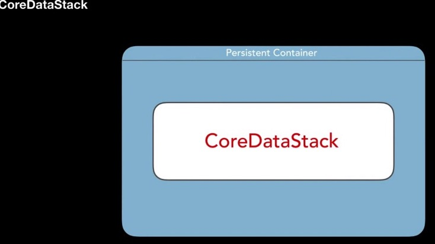
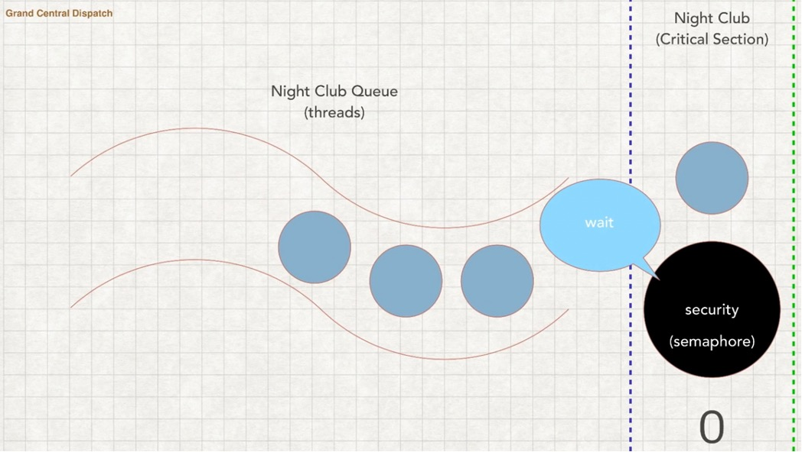

Третья  часть коспекта, из-за ограничей Github был разделен единый файл коспекта на части.

- [Вернуться к первой части коспекта](https://github.com/artemiosdev/Swift-Manual-my-notes)

- [Вернуться ко второй части коспекта](https://github.com/artemiosdev/Swift-Manual-my-notes/blob/main/READMEpart2.md)

---

<a id="contents" />Оглавление

### ЧАСТЬ V Фреймворки

- [Глава  №29. UIKit. ](https://github.com/artemiosdev/Swift-Manual-my-notes/blob/main/UIKit%20notes.md)
- [Глава №30. Core Data](#coredata)

### ЧАСТЬ VI 

- [Глава №31. Grand Central Dispatch](#gcd)
- [Глава №32. API – Application Programming Interface](#api)
- [Глава №33. Паттерны проектирования](#patterns)

---

[К оглавлению](#contents)

###  <a id="coredata" /> Глава №30. Core Data

[#CoreData](https://developer.apple.com/documentation/coredata) – нативный фреймворк от Apple для хранения данных пользователя у него на устройстве. Это не база данных.

Необходимый код в проекте для работы с CoreData. Можно добавить при создании приложения, или уже к созданному опционально. Вставляется код ниже в файлы, создается файл с расширением [.xcdatamodeld](https://developer.apple.com/documentation/coredata/creating_a_core_data_model) для сущностей-entity.

AppDelegate.swift
```swift
import UIKit
import CoreData

@UIApplicationMain
class AppDelegate: UIResponder, UIApplicationDelegate {
    
...

// MARK: - Core Data stack
    lazy var persistentContainer: NSPersistentContainer = {
        /*
         The persistent container for the application. This implementation
         creates and returns a container, having loaded the store for the
         application to it. This property is optional since there are legitimate
         error conditions that could cause the creation of the store to fail.
         */
        let container = NSPersistentContainer(name: "ProjectName")
        container.loadPersistentStores(completionHandler: { (storeDescription, error) in
            if let error = error as NSError? {
                // Replace this implementation with code to handle the error appropriately.
                // fatalError() causes the application to generate a crash log and terminate. 
                // You should not use this function in a shipping application, 
                // although it may be useful during development.
                
                /*
                 Typical reasons for an error here include:
                 * The parent directory does not exist, cannot be created, or disallows writing.
                 * The persistent store is not accessible, due to permissions or data protection 
                when the device is locked.
                 * The device is out of space.
                 * The store could not be migrated to the current model version.
                 Check the error message to determine what the actual problem was.
                 */
                fatalError("Unresolved error \(error), \(error.userInfo)")
            }
        })
        return container
    }()
    
    // MARK: - Core Data Saving support
    
    func saveContext () {
        let context = persistentContainer.viewContext
        if context.hasChanges {
            do {
                try context.save()
            } catch {
                // Replace this implementation with code to handle the error appropriately.
                // fatalError() causes the application to generate a crash log and terminate. 
                // You should not use this function in a shipping application, 
                // although it may be useful during development.
                let nserror = error as NSError
                fatalError("Unresolved error \(nserror), \(nserror.userInfo)")
            }
        }
    }
    
}
```

SceneDelegate.swift
```swift
import UIKit

class SceneDelegate: UIResponder, UIWindowSceneDelegate {

...

    func sceneDidEnterBackground(_ scene: UIScene) {
        // Called as the scene transitions from the foreground to the background.
        // Use this method to save data, release shared resources, and store enough scene-specific state information
        // to restore the scene back to its current state.
        
        // Save changes in the application's managed object context when the application transitions to the background.
        (UIApplication.shared.delegate as? AppDelegate)?.saveContext()
    } 
}
```


Создадим новую сущность-класс Name она будет моделью. 


- [Generating Code](https://developer.apple.com/documentation/coredata/modeling_data/generating_code ) автоматически или вручную создавайте подклассы управляемых объектов из сущностей (entities).
    - **Class #Definition** – класс будет существовать в системе, к нему нет прямого доступа из Navigator, не виден в Xcode.
    - **#Manual/None** – полный ручной контроль над классом, можно добавить свою логику. Нужно вручную добавить. Class будет в проекте. Будут созданы 2 файла для сущности, сам класс и расширение к нему со свойствами
    - **#Category/Extension** – только Extension

Данные классы и файлы по сборкам лежат в папке `DerivedData`, при ошибках почистить данную папку, проваливаясь вглубь можно найти сами классы если выбрано "Class Definition"

Почистить можно вручную (Xcode -> Настройки ->Locations) или в консоле 
`rm -rf ~/Library/Developer/Xcode/DerivedData/*`

Пример файлов:

Name+CoreDataClass.swift
```swift
import Foundation
import CoreData

@objc(Name)
public class Name: NSManagedObject {

}
```

Task+CoreDataProperties.swift
```swift
import Foundation
import CoreData
extension Name {
   @nonobjc public class func fetchRequest() -> NSFetchRequest<Name> {
        return NSFetchRequest<Name>(entityName: "Name")
    }
    @NSManaged public var title: String?

}
extension Name : Identifiable {
}
```


- [#CoreDataStack](https://developer.apple.com/documentation/coredata/core_data_stack) – механизм внутри фреймворка Core Data, который позволяет хранить данные на постоянной основе. Persistent Store – постоянное хранилище информации. Весь механизм внутри Persistent Container. И состоит из 3 основных классов с которыми мы сталкиваемся: 
    - **Managed Object Context** – это наш контекст который нужно сохранить, это изменения. 
    - **Persistent Store Coordinator** – определяет на основек какой модели (Managed Object Model) мы будем хранить данные 
    - **Managed Object Model** - сама модель
    - **Persistent Store** – постоянное хранилище информации


Внутри **Persistent #Container** и есть наш **CoreDataStack**




[Здесь больше информации о типах](https://developer.apple.com/library/archive/documentation/Cocoa/Conceptual/CoreData/PersistentStoreFeatures.html)


- [Core Data Stack](https://developer.apple.com/documentation/coredata/core_data_stack) - manage and persist your app’s model layer.
    - Экземпляр **#NSManagedObjectModel** описывает типы вашего приложения, включая их свойства и взаимосвязи.
    - Экземпляр **#NSManagedObjectContext** отслеживает изменения в экземплярах типов вашего приложения.
    - Экземпляр **#NSPersistentStoreCoordinator** сохраняет и извлекает экземпляры типов вашего приложения из хранилищ.


Сохранение `context.save()` и удаление `context.delete(...)` данных CoreData

- [Class NSManagedObject](https://developer.apple.com/documentation/coredata/nsmanagedobject) - A base class that implements the behavior for a Core Data model object
- [Class NSPersistentContainer](https://developer.apple.com/documentation/coredata/nspersistentcontainer) - A container that encapsulates the Core Data stack in your app.
- [NSFetchRequest](https://developer.apple.com/documentation/coredata/nsfetchrequest) - A description of search criteria used to retrieve data from a persistent store.

Примеры использования в `Small-projects`:
- [MyCars](https://github.com/artemiosdev/Small-projects/tree/main/MyCars/MyCars)
- [MealTime](https://github.com/artemiosdev/Small-projects/tree/main/MealTime/MealTime)
- [ToDoList](https://github.com/artemiosdev/Small-projects/tree/main/ToDoList/ToDoList)

---

[К оглавлению](#contents)

###  <a id="gcd" /> Глава №31. Grand Central Dispatch 

### [Папка с примерами использования #GCD](https://github.com/artemiosdev/Small-projects/tree/main/GCD) 

Многопоточность – #multithreading

Поток – #thread

Задачи могут выполняться параллейно ТОЛЬКО если они не зависят друг от друга


### #Очереди, #Queue
#Serial #Queue – последовательная очередь. FIFO (first in, first out)


#Concurrent #Queue – согласованная очередь. Могут начинаться последовательно, а выполняться параллейно


#Main queue – главная очередь (она serial queue), последовательное выполнение, отвечает за обновление интерфейса UI.


#Qos (quality of service) – определение приоритета очереди. Используется при создании очереди и задания приоритета им.


### Синхронность #sync и асинхронность #async

#async – задачи могут начинаются вместе, независимо друг от друга

#sync – 3 задача ждет выполнения 2 задачи


### Последовательность работы с очередями


### Задержка #asyncAfter

Позволяет выполнять какие-либо участки кода через определенное время.

```swift
  fileprivate func delay(_ delay: Double, closure: @escaping () -> ()) {
        DispatchQueue.main.asyncAfter(deadline: .now() + .seconds(delay)) {
            closure()
        }
} 
```

### Новая очередь. Барьеры #barriers отправки
#Queue #creation – создание очередей


Есть много атрибутов, можно выбрать нужные нам, остальные убрать, будут работать со значениями по умолчанию


#Barriers - #Барьеры


Задача в том что бы к «х» был доступ только у одного потока, если несколько потоков одновременно имеют доступ к «х» то будет искажение данных, чтение и запись, и результат будет непредсказуемым.
В такие моменты если нужно чтобы задача была выполнена одним потоком, мы можем грубо говоря «согласованную очередь» переделать в «последовательную»


Task 2 наш барьер, перед ее выполнением все задачи должны быть выполнены, она выполняется только одна, и все другие задачи ждут ее завершения, и не начинаются пока она не закончит, это критическая секция.

### Практика с барьерами #barriers
```swift
import UIKit
import PlaygroundSupport

PlaygroundPage.current.needsIndefiniteExecution = true

class SafeArray<Element> {
    private var array = [Element]()
    private let queue = DispatchQueue(label: "DispatchBarrier", attributes: .concurrent)
    
    public func append(element: Element) {
        queue.async(flags: .barrier) {
            self.array.append(element)
        }
    }
    
    public var elements: [Element] {
        var result = [Element]()
        queue.sync {
            result = self.array
        }
        
        return result
    }
}

var safeArray = SafeArray<Int>()
DispatchQueue.concurrentPerform(iterations: 20) { (index) in
    safeArray.append(element: index)
}
print("safeArray: \(safeArray.elements)")

var array = [Int]()
DispatchQueue.concurrentPerform(iterations: 20) { (index) in
    array.append(index)
}
print("array: \(array)")
```


### Группы #groups отправки


Другой вариант


### Группы #groups отправки. Практика

[#notify(queue:work:)](https://developer.apple.com/documentation/dispatch/dispatchgroup/2016084-notify) – планирует отправку блока в очередь, когда все задачи в текущей группе завершат выполнение.

[#wait(wallTimeout:)](https://developer.apple.com/documentation/dispatch/dispatchgroup/2016092-wait) – завершаем работу в конкретное время. 
Синхронно ожидает завершения ранее отправленной работы и возвращает, если работа не завершена до истечения указанного периода ожидания.

[#wait(timeout:)](https://developer.apple.com/documentation/dispatch/dispatchgroup/1780590-wait) – завершаем работу через … время, задержка. Синхронно ожидает завершения ранее отправленной работы и возвращает, если работа не завершена до истечения указанного периода ожидания

```swift
import UIKit
import PlaygroundSupport

PlaygroundPage.current.needsIndefiniteExecution = true

let queue = DispatchQueue(label: "ru.swiftbook", attributes: .concurrent)
let group = DispatchGroup()

queue.async(group: group) {
    for i in 0...10 {
        if i == 10 {
            print(i)
        }
    }
}

queue.async(group: group) {
    for i in 0...20 {
        if i == 20 {
            print(i)
        }
    }
}

group.notify(queue: .main) {
    print("Все закончено в группе: group")
}

let secondGroup = DispatchGroup()
secondGroup.enter()
queue.async(group: group) {
    for i in 0...30 {
        if i == 30 {
            print(i)
            sleep(2)
            secondGroup.leave()
        }
    }
}

let result = secondGroup.wait(timeout: .now() + 1)
print(result)

secondGroup.notify(queue: .main) {
    print("Все закончено в группе: secondGroup")
}
// срабатывает быстрее чем .notify, т.к не требует вычислений
print("Этот принт должен быть выше чем последний")
// ждет пока все группы выполнятся, и весь код выше отработает
secondGroup.wait()
```

```bash
Консоль: 10
20
30
timedOut
Этот принт должен быть выше чем последний
Все закончено в группе: secondGroup
Все закончено в группе: group
```

### Блоки #blocks отправки


### Блоки #blocks отправки. Практика

```swift
import UIKit
import PlaygroundSupport

PlaygroundPage.current.needsIndefiniteExecution = true

let workItem = DispatchWorkItem(qos: .utility, flags: .detached) {
    print("Performing workitem")
}

//workItem.perform()

let queue = DispatchQueue(label: "ru.swiftbook", qos: .utility, attributes: .concurrent, autoreleaseFrequency: .workItem, target: DispatchQueue.global(qos: .userInitiated))

queue.asyncAfter(deadline: .now() + 1, execute: workItem)

workItem.notify(queue: .main) {
    print("workitem is completed!")
}

// проверка на отмену cancel
workItem.isCancelled

// можем отменить
workItem.cancel()
workItem.isCancelled

// ожидание/таймаут, ждет пока код выше отработает
workItem.wait()
```

### Семафоры #semaphores отправки


Семафоры ограничивают количество потоков в секцию, некий барьер





### Семафоры #semaphores отправки. Практика

```swift
import UIKit
import PlaygroundSupport

PlaygroundPage.current.needsIndefiniteExecution = true

let queue = DispatchQueue(label: "ru.swiftbook.semaphores", attributes: .concurrent)

// разрешаем кол-во потоков которые могут идти одновременно
let semaphore = DispatchSemaphore(value: 2)

semaphore.signal()

queue.async {
    // ждем пока не получим сигнал
    semaphore.wait(timeout: .distantFuture)
    // усыпляем поток
    Thread.sleep(forTimeInterval: 4)
    print("Block 1")
   // сигнал, разрешаем следующему потомку пройти через этот блок кода
    semaphore.signal()
}

queue.async {
    semaphore.wait(timeout: .distantFuture)
    Thread.sleep(forTimeInterval: 2)
    print("Block 2")
    semaphore.signal()
}

queue.async {
    semaphore.wait(timeout: .distantFuture)
    print("Block 3")
    semaphore.signal()
}

queue.async {
    semaphore.wait(timeout: .distantFuture)
    print("Block 4")
//    semaphore.signal()
}
```

```bash
Консоль:
Block 3 – не ждет, мгновенно
Block 4 – не ждет, мгновенно
Block 2 – ждет 2 сек
Block 1 – ждет 4 сек
```

Другой параметр `value`

```swift
import UIKit
import PlaygroundSupport

PlaygroundPage.current.needsIndefiniteExecution = true

let queue = DispatchQueue(label: "ru.swiftbook.semaphores", attributes: .concurrent)

// разрешаем кол-во потоков которые могут идти одновременно
let semaphore = DispatchSemaphore(value: 0) // 0-1 - 0 - 1 - 0 - 1 - 2

// разрешаем 1 поток
semaphore.signal()

queue.async {
    // ждем пока не получим сигнал
    semaphore.wait(timeout: .distantFuture)
    // усыпляем поток
    Thread.sleep(forTimeInterval: 4)
    print("Block 1")
   // сигнал, разрешаем следующему потомку пройти через этот блок кода
    semaphore.signal()
}

queue.async {
    semaphore.wait(timeout: .distantFuture)
    Thread.sleep(forTimeInterval: 2)
    print("Block 2")
    semaphore.signal()
}

queue.async {
    semaphore.wait(timeout: .distantFuture)
    print("Block 3")
    semaphore.signal()
}

queue.async {
    semaphore.wait(timeout: .distantFuture)
    print("Block 4")
//  semaphore.signal()
}
```

```bash
Консоль:
Block 1
Block 2
Block 3
Block 4
```

### Источники отправки #Dispatch #sources

Это объекты которые помогают следить за различными низкоуровневыми процессами.


### Источники #dispatch #sources отправки. Практика

```swift
import UIKit
import PlaygroundSupport

PlaygroundPage.current.needsIndefiniteExecution = true

let queue = DispatchQueue(label: "ru.swiftbook.sources", attributes: .concurrent)

let timer = DispatchSource.makeTimerSource(queue: queue)

// расписание нашего таймера
timer.schedule(deadline: .now(), repeating: .seconds(2), leeway: .milliseconds(300))
// сделаем вызов
timer.setEventHandler {
    print("Hello, World!")
}

// блок отмены
timer.setCancelHandler {
    print("Timer is cancelled")
}
// запускаем таймер
timer.resume()
```

```bash
Каждые 2 секунды в консоле будет появляться «Hello, World!»
```

---

[К оглавлению](#contents)

###  <a id="api" /> Глава №32. API – Application Programming Interface

**#API – Application Programming Interface**, програмный интерфейс приложения. По сути это документация описывающая что мы можем получить от сервиса и какие запросы нужно отправить чтобы получить ту или иную информацию (аналогия с меню блюд, когда мы сидим в ресторане).

Это программный интерфейс приложения — это набор инструментов, который позволяет одним программам работать с другими. API предусматривает, что программы могут работать в том числе и на разных компьютерах

**#CRUD** (сокр. от англ. create, read-retrieve, update, delete — «создать, прочесть-получить, обновить-редактирование, удалить») —четыре базовые функции, используемые при работе с персистентными хранилищами данных:


**#RestAPI - REpresentational State Transfer**, апишка которая предоставляет нам интерфейс взаимодействия с веб-сервисом, это фактически архитектура на которой построено веб-приложение которое предоставляет нам api. 

**Rest** – это обозначение свидетельствующее о том, что каждый раз отправляя запрос на веб-сервис мы должны отправить все необходимые данные для запроса, этот сервис не запоминает состояние пользователя отправляющего запрос.

Форматы получения данных: #JSON(JavaScriptObjectNotation), XML

Транспорт: всегда HTTP. REST полностью построен на основе HTTP.

**Representational State Transfer (#REST)** — это передача состояния представления. Технология позволяет получать и модифицировать данные и состояния удаленных приложений, передавая HTTP-вызовы через интернет или любую другую сеть.

Если проще, REST API — это когда серверное приложение дает доступ к своим данным клиентскому приложению по определенному URL. 

Пример:
Бухгалтерское приложение для выставления счетов. Счета хранятся на сервере: мобильное приложение обращается к нему через API и показывает на экране то, что нужно.

REST API позволяет использовать для общения между программами протокол #HTTP (зашифрованная версия — #HTTPS), с помощью которого мы получаем и отправляем большую часть информации в интернете.

HTTP довольно прост. Допустим, есть адрес http://website.com/something. Он состоит из двух частей: первая — это адрес сайта или сервера, то есть http://website.com. Вторая — адрес ресурса на удаленном сервере, в данном примере — /something.
Вбивая в адресную строку URL-адрес http://website.com/something, мы на самом деле идем на сервер website.com и запрашиваем ресурс под названием /something. «Пойди вот туда, принеси мне вот то» — и есть HTTP-запрос.

### Для чего используют REST API
Архитектура REST API — самое популярное решение для организации взаимодействия между различными программами. Так произошло, поскольку HTTP-протокол реализован во всех языках программирования и всех операционных системах, в отличие от проприетарных протоколов.

Чаще всего REST API применяют:
- Для связи мобильных приложений с серверными.
- Для построения микросервисных серверных приложений. Это архитектурный подход, при котором большие приложения разбиваются на много маленьких частей.
- Для предоставления доступа к программам сторонних разработчиков. Например, Stripe API позволяет программистам встраивать обработку платежей в свои приложения.

Пример погодной апишки [OpenWeather](https://openweathermap.org/current#name)
 `
### Что такое JSON
Текстовый формат обмена данными, основанный на JS. Все данные между `{…}`, где внутри могут быть отдельные свойства, а также `{…}` – отдельный тип, или `[ { … } ]` – массив объекта

#Распарсить json – это значит разложить полученные данные по созданной нами модели

Чтобы распарсить можно использовать сайт [quicktype](https://app.quicktype.io/)

Пример

```js
{
"coord": {
"lon": -0.1257,
"lat": 51.5085
},
"weather": [
{
"id": 800,
"main": "Clear",
"description": "clear sky",
"icon": "01d"
}
],
"base": "stations",
"main": {
"temp": 11.96,
"feels_like": 10.99,
"temp_min": 10.31,
"temp_max": 13.06,
"pressure": 1031,
"humidity": 68
},
"visibility": 10000,
"wind": {
"speed": 2.57,
"deg": 140
},
"clouds": {
"all": 0
},
"dt": 1676303427,
"sys": {
"type": 2,
"id": 2075535,
"country": "GB",
"sunrise": 1676272749,
"sunset": 1676308230
},
"timezone": 0,
"id": 2643743,
"name": "London",
"cod": 200
}
```
Превращается в swift модель (можно выбрать любой язык)

```swift
// This file was generated from JSON Schema using quicktype, do not modify it directly.
// To parse the JSON, add this file to your project and do:
//
//   let welcome = try? JSONDecoder().decode(Welcome.self, from: jsonData)

import Foundation

// MARK: - Welcome
struct Welcome: Codable {
    let coord: Coord
    let weather: [Weather]
    let base: String
    let main: Main
    let visibility: Int
    let wind: Wind
    let clouds: Clouds
    let dt: Int
    let sys: Sys
    let timezone, id: Int
    let name: String
    let cod: Int
}

// MARK: - Clouds
struct Clouds: Codable {
    let all: Int
}

// MARK: - Coord
struct Coord: Codable {
    let lon, lat: Double
}

// MARK: - Main
struct Main: Codable {
    let temp, feelsLike, tempMin, tempMax: Double
    let pressure, humidity: Int

    enum CodingKeys: String, CodingKey {
        case temp
        case feelsLike = "feels_like"
        case tempMin = "temp_min"
        case tempMax = "temp_max"
        case pressure, humidity
    }
}

// MARK: - Sys
struct Sys: Codable {
    let type, id: Int
    let country: String
    let sunrise, sunset: Int
}

// MARK: - Weather
struct Weather: Codable {
    let id: Int
    let main, description, icon: String
}

// MARK: - Wind
struct Wind: Codable {
    let speed: Double
    let deg: Int
}
```

---

[К оглавлению](#contents)

###  <a id="patterns" /> Глава №33. Паттерны проектирования

Существует три категории паттернов: порождающие, структурные, поведенческие

**Порождающие паттерны** – работают с инициализацией объектов. Абстрагируются от самой инициализации конкретного типа в какой-то абстрактный тип (протокол к примеру)

**Структурные паттерны** – работает с интерфейсами, и преобразует их 

**Поведенческие паттерны** – обеспечивают гибкое взаимодействие между типами/объектами


---

### [Strategy](https://refactoring.guru/ru/design-patterns/strategy)

**#Стратегия** — это поведенческий паттерн проектирования, который определяет семейство схожих алгоритмов и помещает каждый из них в собственный класс, после чего алгоритмы можно взаимозаменять прямо во время исполнения программы.

Позволяет не плодить классы с подклассами, а сделать более гибкое решение.

Паттерн Стратегия предлагает определить семейство схожих алгоритмов, которые часто изменяются или расширяются, и вынести их в собственные классы, называемые стратегиями.

Вместо того, чтобы изначальный класс сам выполнял тот или иной алгоритм, он будет играть роль контекста, ссылаясь на одну из стратегий и делегируя ей выполнение работы. Чтобы сменить алгоритм, вам будет достаточно подставить в контекст другой объект-стратегию.

Важно, чтобы все стратегии имели общий интерфейс. Используя этот интерфейс, контекст будет независимым от конкретных классов стратегий. С другой стороны, вы сможете изменять и добавлять новые виды алгоритмов, не трогая код контекста.

Аналогия из жизни. Вам нужно добраться до аэропорта. Можно доехать на автобусе, такси или велосипеде. Здесь вид транспорта является стратегией. Вы выбираете конкретную стратегию в зависимости от контекста — наличия денег или времени до отлёта


Используем протокол как тип, для свойств class Human

```swift
protocol SwimBehavior {
    func swim()
}

class ProfessionalSwimmer: SwimBehavior {
    func swim() {
        print("professional swimming")
    }
}

class NewbieSwimmer: SwimBehavior {
    func swim() {
        print("newbie swimming")
    }
}

class NonSwimmer: SwimBehavior {
    func swim() {
        print("non-swimming")
    }
}


protocol DiveBehavior {
    func dive()
}


class ProfessionalDiver: DiveBehavior {
    func dive() {
        print("professional diving")
    }
}


class NewbieDiver: DiveBehavior {
    func dive() {
        print("newbie diving")
    }
}

class NonDiver: DiveBehavior {
    func dive() {
        print("non-diving")
    }
}


class Human {
    private var diveBehavior: DiveBehavior
    private var swimBehavior: SwimBehavior
    
    func performSwim() {
        swimBehavior.swim()
    }
    
    func performDive() {
        diveBehavior.dive()
    }
    
    func setSwimBehavior(sb: SwimBehavior) {
        self.swimBehavior = sb
    }
    
    func setDiveBehavior(db: DiveBehavior) {
        self.diveBehavior = db
    }
    
    func run() {
        print("running")
    }
    
    init(swimBehavior: SwimBehavior, diveBehavior: DiveBehavior) {
        self.swimBehavior = swimBehavior
        self.diveBehavior = diveBehavior
    }
}

let human = Human(swimBehavior: ProfessionalSwimmer(), diveBehavior: ProfessionalDiver())
human.performSwim() // professional swimming
human.performDive() // professional diving
human.setSwimBehavior(sb: NonSwimmer())
human.performSwim() // non-swimming
```


---

### [Observer - наблюдатель](https://refactoring.guru/ru/design-patterns/observer)

**#Наблюдатель** — это поведенческий паттерн проектирования, который создаёт механизм подписки, позволяющий одним объектам следить и реагировать на события, происходящие в других объектах.

Аналогия из жизни. После того как вы оформили подписку на газету или журнал, вам больше не нужно ездить в супермаркет и проверять, не вышел ли очередной номер. Вместо этого издательство будет присылать новые номера по почте прямо к вам домой сразу после их выхода.

Издательство ведёт список подписчиков и знает, кому какой журнал высылать. Вы можете в любой момент отказаться от подписки, и журнал перестанет вам приходить.

Один ко многим, то есть один объект за которым наблюдают  другие объекты. Аналогия с учителем, где все ученики следят за ним т.е он главный объект, а они наблюдатели, он раздаёт всем домашнее задание, а ученики его получают.


```swift
import Foundation

// протокол учителя
protocol Subject {
    // добавляем нового ученика-наблюдателя
    func add(observer: PropertyObserver)
    // убираем ученика-наблюдателя
    func remove(observer: PropertyObserver)
    // уведомляем наших наблюдателей об изменениях (дз, новости)
    func notify(withString string: String)
}

// сам учитель
class Teacher: Subject {
    
    // изменяемая коллекция наблюдателей, каждый элемент единственный
    // аналогия с "журналом учителя"
    // объекты которые "подписаны" под изменения дз
    var observerCollection = NSMutableSet()
    
    // домашняя работа
    // при появлении дз идет уведомление для всех учеников-наблюдателей
    var homeTask = "" {
        didSet {
            notify(withString: homeTask)
        }
    }
    
    func add(observer: PropertyObserver) {
        observerCollection.add(observer)
    }

    func remove(observer: PropertyObserver) {
        observerCollection.remove(observer)
    }
    
    func notify(withString string: String) {
        for observer in observerCollection {
            (observer as! PropertyObserver).didGet(newTask: string)
        }
    }
}


protocol PropertyObserver {
    // получаем дз
    func didGet(newTask task: String)
}

class Pupil: NSObject, PropertyObserver {
    
    var homeTask = ""
    
    func didGet(newTask task: String) {
        homeTask = task
        print("Получена новая домашняя работа: \(homeTask)")
    }
}

let teacher = Teacher()
let newPupil = Pupil()

teacher.add(observer: newPupil)
teacher.homeTask = "Повторить паттерны проектирования для успешного прохождения собеседования"

newPupil.homeTask
// Получена новая домашняя работа:
// Повторить паттерны проектирования для успешного прохождения собеседования
```


---

### [Decorator](https://refactoring.guru/ru/design-patterns/decorator)

**#Декоратор** — это структурный паттерн проектирования, который позволяет динамически добавлять объектам новую функциональность, оборачивая их в полезные «обёртки». По сути можем наследоваться от нескольких классов, один объект "оборачиваем" в другой, и так далее.

**#Decorator** имеет альтернативное название — **#обёртка**. Оно более точно описывает суть паттерна: вы помещаете целевой объект в другой объект-обёртку, который запускает базовое поведение объекта, а затем добавляет к результату что-то своё.

Оба объекта имеют общий интерфейс, поэтому для пользователя нет никакой разницы, с каким объектом работать — чистым или обёрнутым. Вы можете использовать несколько разных обёрток одновременно — результат будет иметь объединённое поведение всех обёрток сразу.

Аналогия из жизни. Любая одежда — это аналог Декоратора. Применяя Декоратор, вы не меняете первоначальный класс и не создаёте дочерних классов. Так и с одеждой — надевая свитер, вы не перестаёте быть собой, но получаете новое свойство — защиту от холода. Вы можете пойти дальше и надеть сверху ещё один декоратор — плащ, чтобы защититься и от дождя.


```swift
// Decorator
protocol Porsche {
    func getPrice() -> Double
    func getDescription() -> String
}

class Boxster: Porsche {
    func getPrice() -> Double {
        return 120
    }
    func getDescription() -> String {
        return "Porsche Boxster"
    }
}

// отвечает за все опции которые будут предусмотрены для данных автомобилей
class PorscheDecorator: Porsche {
    // добавляем к автомобилю опцию
    private let decoratedPorsche: Porsche
    
    required init(dp: Porsche) {
        self.decoratedPorsche = dp
    }
    
    func getPrice() -> Double {
        return decoratedPorsche.getPrice()
    }
    
    func getDescription() -> String {
        return decoratedPorsche.getDescription()
    }
}

class PremiumAudioSystem: PorscheDecorator {
    required init(dp: Porsche) {
        super.init(dp: dp)
    }
    
    override func getPrice() -> Double {
        return super.getPrice() + 30
    }
    
    override func getDescription() -> String {
        return super.getDescription() + " with premium audio system"
    }
}


class PanoramicSunroof: PorscheDecorator {
    required init(dp: Porsche) {
        super.init(dp: dp)
    }
    
    override func getPrice() -> Double {
        return super.getPrice() + 20
    }
    
    override func getDescription() -> String {
        return super.getDescription() + " with panoramic sunroof"
    }
}

var porscheBoxster: Porsche = Boxster()
porscheBoxster.getDescription() // Porsche Boxster
porscheBoxster.getPrice() // 120

porscheBoxster = PremiumAudioSystem(dp: porscheBoxster)
porscheBoxster.getDescription()
// Porsche Boxster with premium audio system

porscheBoxster.getPrice() // 150

porscheBoxster = PanoramicSunroof(dp: porscheBoxster)
porscheBoxster.getDescription()

// Porsche Boxster with premium audio system with panoramic sunroof
porscheBoxster.getPrice() // 170
```


---

### Simple Factory

Категория порождающих паттернов. Помогает нам при создании объектов. Удобно изменять код в одном месте, если нужно что-то поменять

Это неполноценный паттерн, это мостик к пониманию Factory Method и Abstract Factory (будут рассмотрены далее).


```swift
// Simple Factory
enum CarType {
    case huge, fast
}

protocol Car {
    func drive()
}

class HugeCar: Car {
    func drive() {
        print("you drive huge car")
    }
}

class FastCar: Car {
    func drive() {
        print("you drive fast car")
    }
}

let hugeCar = HugeCar()
hugeCar.drive()

let fastCar = FastCar()
fastCar.drive()

// фабрика которая создает авто
// в зависимости от передаваемого типа в метод

// если в проекте что-то поменяется, то все изменения
// можно сделать именно здесь, а не бегать по всему проекту
// сюда мы переносим ответственность за создание объектов
class CarFactory {
    static func produceCar(type: CarType) -> Car {
        var car: Car
        
        switch type {
        case .fast: car = FastCar()
        case .huge: car = HugeCar()
        }
        
        return car
    }
}

let hugeCar1 = CarFactory.produceCar(type: .huge)
let fastCar1 = CarFactory.produceCar(type: .fast)
```


---

### [Factory Method](https://refactoring.guru/ru/design-patterns/factory-method)

#Фабричный метод, #фабрика — это порождающий паттерн проектирования, который определяет общий интерфейс для создания объектов в суперклассе, позволяя подклассам изменять тип создаваемых объектов.


Для каждого транспортного средства создадим свою отдельную фабрику (для легковых, для грузовых, для автобусов).

```swift
// интерфейс для транспортных средств
protocol Vehicle {
    func drive()
}

class Car: Vehicle {
    func drive() {
        print("drive a car")
    }
}

class Truck: Vehicle {
    func drive() {
        print("drive a truck")
    }
}

class Bus: Vehicle {
    func drive() {
        print("drive a bus")
    }
}

// протокол создания фабрик для различных транспортных средств
protocol VehicleFactory {
    func produce() -> Vehicle
}

class CarFactory: VehicleFactory {
        func produce() -> Vehicle {
        print("car is created")
        return Car()
    }
}

class TruckFactory: VehicleFactory {
    func produce() -> Vehicle {
        print("truck is created")
        return Truck()
    }
}

class  BusFactory: VehicleFactory {
    func produce() -> Vehicle {
        print("bus is created")
        return Bus()
    }
}

let carFacory = CarFactory()
let car = carFacory.produce() // car is created

let truckFactory = TruckFactory()
let truck = truckFactory.produce() // truck is created

let busFactory = BusFactory()
let bus = busFactory.produce() // bus is created
```


---

### [Abstract Factory](https://refactoring.guru/ru/design-patterns/abstract-factory)

#Абстрактная фабрика — это порождающий паттерн проектирования, который позволяет создавать семейства связанных объектов, не привязываясь к конкретным классам создаваемых объектов.

Проблема:

Представьте, что вы пишете симулятор мебельного магазина. Ваш код содержит:

Семейство зависимых продуктов. Скажем, Кресло + Диван + Столик.

Несколько вариаций этого семейства. Например, продукты Кресло, Диван и Столик представлены в трёх разных стилях: Ар-деко, Викторианском и Модерне.

Вам нужен такой способ создавать объекты продуктов, чтобы они сочетались с другими продуктами того же семейства. Это важно, так как клиенты расстраиваются, если получают несочетающуюся мебель.


```swift
// Abstract Factory
protocol Car {
    func drive()
}

class LittleSizeCar: Car {
    func drive() {
        print("drive a little car")
    }
}

class MiddleSizeCar: Car {
    func drive() {
        print("drive a middle car")
    }
}

protocol Bus {
    func drive()
}

class LittleSizeBus: Bus {
    func drive() {
        print("drive a little bus")
    }
}

class MiddleSizeBus: Bus {
    func drive() {
        print("drive a middle size bus")
    }
}


protocol Factory {
    func produceBus() -> Bus
    func produceCar() -> Car
}

class LittleSizeFactory: Factory {
    func produceBus() -> Bus {
        print("Little bus is created")
        return LittleSizeBus()
    }
    
    func produceCar() -> Car {
        print("Little size car is creates")
        return LittleSizeCar()
    }
}

class MiddleSizeFactory: Factory {
    func produceBus() -> Bus {
        print("Middle size bus is created")
        return MiddleSizeBus()
    }
    
    func produceCar() -> Car {
        print("Middle size car is creates")
        return MiddleSizeCar()
    }
}

let littleFactory = LittleSizeFactory()
littleFactory.produceCar() // Little size car is creates

let middleFactory = MiddleSizeFactory()
middleFactory.produceBus() // Middle size bus is creates
```


---

### [Singleton](https://refactoring.guru/ru/design-patterns/singleton)

#Одиночка — это порождающий паттерн проектирования, который гарантирует, что у класса есть только один экземпляр, и предоставляет к нему глобальную точку доступа.

**Аналогия из жизни:**

Правительство государства — хороший пример одиночки. В государстве может быть только одно официальное правительство. Вне зависимости от того, кто конкретно заседает в правительстве, оно имеет глобальную точку доступа «Правительство страны N»

Одиночка решает сразу две проблемы, нарушая принцип единственной ответственности класса.

1. Гарантирует наличие единственного экземпляра класса. Чаще всего это полезно для доступа к какому-то общему ресурсу, например, базе данных.

Представьте, что вы создали объект, а через некоторое время пробуете создать ещё один. В этом случае хотелось бы получить старый объект, вместо создания нового.

Такое поведение невозможно реализовать с помощью обычного конструктора, так как конструктор класса всегда возвращает новый объект.

2. Предоставляет глобальную точку доступа. Это не просто глобальная переменная, через которую можно достучаться к определённому объекту. Глобальные переменные не защищены от записи, поэтому любой код может подменять их значения без вашего ведома.

Но есть и другой нюанс. Неплохо бы хранить в одном месте и код, который решает проблему №1, а также иметь к нему простой и доступный интерфейс.

Интересно, что в наше время паттерн стал настолько известен, что теперь люди называют «одиночками» даже те классы, которые решают лишь одну из проблем, перечисленных выше.

**Решение:**

Все реализации одиночки сводятся к тому, чтобы скрыть конструктор по умолчанию и создать публичный статический метод, который и будет контролировать жизненный цикл объекта-одиночки.

Если у вас есть доступ к классу одиночки, значит, будет доступ и к этому статическому методу. Из какой точки кода вы бы его ни вызвали, он всегда будет отдавать один и тот же объект.

**Применимость:**

Когда в программе должен быть единственный экземпляр какого-то класса, доступный всем клиентам (например, общий доступ к базе данных из разных частей программы).

 Одиночка скрывает от клиентов все способы создания нового объекта, кроме специального метода. Этот метод либо создаёт объект, либо отдаёт существующий объект, если он уже был создан.

 Когда вам хочется иметь больше контроля над глобальными переменными.

 В отличие от глобальных переменных, Одиночка гарантирует, что никакой другой код не заменит созданный экземпляр класса, поэтому вы всегда уверены в наличии лишь одного объекта-одиночки.

Тем не менее, в любой момент вы можете расширить это ограничение и позволить любое количество объектов-одиночек, поменяв код в одном месте

Порой важно обращаться к одному и тому же объекту ( не к новому, а именно к одному старому, единому), и не важно где вы находитесь

Swift позволяет создавать свойства и методы, принадлежащие типу, а не экземплярам типа. Это полезно для осмысленной организации ваших данных путем хранения общих данных.

Вы  можете определить методы, которые вызываются самим типом. Такие методы зовутся методами типа. Индикатор такого метода - ключевое слово #static

```swift
struct TaylorFan {
    static var favoriteSong = "Look What You Made Me Do"

    var name: String
    var age: Int
}

let fan = TaylorFan(name: "James", age: 25)
print(TaylorFan.favoriteSong)
```

Итак, у фаната Тейлор Свифт есть имя и возраст, которые принадлежат им, но у них у всех одна и та же любимая песня. Поскольку статические методы принадлежат самой структуре, а не экземплярам этой структуры, вы не можете использовать их для доступа к каким-либо нестатическим свойствам из структуры.


Вы используете синглтоны для предоставления глобально доступного общего экземпляра класса. Вы можете создавать свои собственные синглтоны, чтобы обеспечить единую точку доступа к ресурсу или службе, которые являются общими для всего приложения, например, аудиоканал для воспроизведения звуковых эффектов или сетевой менеджер для отправки HTTP-запросов

https://developer.apple.com/documentation/swift/managing-a-shared-resource-using-a-singleton

Встречается в URLSession, UserDefaults, FileManager,  UIApplication, UIAccelerometer, файлы настроек.

Базовый пример создания:

```swift
class Singleton {
    static let shared = Singleton()
    var username: String?

    private init() { }
}

// или с доп настройкой
class Singleton {
    static let shared: Singleton = {
        let instance = Singleton()
        // setup code
        return instance
    }()
}

// ...
let name = Singleton.shared
// ...
```

Добавление #private инициализатора важно, потому что это останавливает другие части нашего кода от попыток создать экземпляр класса Singleton. Однако класс создает свой собственный экземпляр самого себя в качестве static переменной, что означает, что единственным экземпляром класса Singleton является тот, который он создал: Singleton.shared.

Еще пример:

Создаем отдельный файл

Safe.swift

```swift
class Safe {
    var money = 0
    // когда мы обращаемся к данному свойству
    // мы всегда получаем один и тот же экземпляр класса
    static let shared = Safe()
    // прячем конструктор, чтобы не было возможности создания новых экземпляров
    private init() {}
}
```

Далее иллюстрация глобальности Singleton. AppDelegate.swift

```swift
import UIKit
@UIApplicationMain
class AppDelegate: UIResponder, UIApplicationDelegate {

    var window: UIWindow?

    func application(_ application: UIApplication, didFinishLaunchingWithOptions launchOptions: [UIApplicationLaunchOptionsKey: Any]?) -> Bool {
        
        let safe = Safe.shared
        safe.money += 10000
        
        return true
    }
    
    \\ ...
```

ViewController.swift

```swift
import UIKit
class ViewController: UIViewController {
    override func viewDidLoad() {
        super.viewDidLoad()
        // это единственный доступ к сейфу
        let safe = Safe.shared
        print(safe.money)
        // и мы не можем создать другие экземпляры,
        // т.к скрыт их конструктор private
        let safe1 = Safe() // error: Safe' initializer is inaccessible due to 'private' protection level
    }
}
```

---

### [Command](https://refactoring.guru/ru/design-patterns/command)

#Команда — это поведенческий паттерн проектирования, который превращает запросы в объекты, позволяя передавать их как аргументы при вызове методов, ставить запросы в очередь, логировать их, а также поддерживать отмену операций.

**Аналогия из жизни**. Пример заказа в ресторане.

Вы заходите в ресторан. К вам подходит  официант и принимает заказ, записывая все в блокнот. Он уходит на кухню, и передает лист из блокнота повару, который читает содержание заказа и готовит заказанные блюда.

В этом примере вы являетесь отправителем, официант с блокнотом — **командой**, а повар — получателем. Как и в паттерне, вы не соприкасаетесь напрямую с поваром. Вместо этого вы отправляете заказ с официантом, который самостоятельно «настраивает» повара на работу. С другой стороны, повар не знает, кто конкретно послал ему заказ. Но это ему безразлично, так как вся необходимая информация есть в листе заказа.


```swift
// Command

// для идентификации аккаунта с которым работаем
class Account {
    var accountName: String
    var balance: Int
    
    init(accountName: String, balance: Int) {
        self.accountName = accountName
        self.balance = balance
    }
}

protocol Command {
    func execute()
    var isComplete: Bool { get set }
}

// внести деньги
class Deposit: Command {
    private var _account: Account
    private var _amount: Int
    var isComplete = false
    
    init(account: Account, amount: Int) {
        self._account = account
        self._amount = amount
    }
    
    func execute() {
        _account.balance += _amount
        isComplete = true
    }
}

// снять деньги
class Withdraw: Command {
    private var _account: Account
    private var _amount: Int
    var isComplete = false
    
    init(account: Account, amount: Int) {
        self._account = account
        self._amount = amount
    }
    
    func execute() {
        if _account.balance >= _amount {
            _account.balance -= _amount
            isComplete = true
        } else {
            print("Not enough money")
        }
    }
}

// отделен от аккаунтов и ничего не знает о них
class TransactionManager {
    // Singleton
    static let shared = TransactionManager()
    private init() {}
    
    // ничего не знает об Account, главное чтобы был тип Command
    private var _transactions: [Command] = []
    
    // незаконченные транзакции
    var pendingTransactions: [Command] {
        get {
            // фильтруем каждый элемент массива транзакций
            return self._transactions.filter{ $0.isComplete == false }
        }
    }
    
    func addTransactions(command: Command) {
        self._transactions.append(command)
    }
    
    func processingTransactions() {
        // фильтруем каждый элемент массива транзакций
        // и выполняем для каждого метод execute
        _transactions.filter{ $0.isComplete == false }.forEach{ $0.execute() }
    }
}

let account = Account(accountName: "Artem", balance: 1000)
let transactionManager = TransactionManager.shared
transactionManager.addTransactions(command: Deposit(account: account, amount: 100))
transactionManager.addTransactions(command: Withdraw(account: account, amount: 500))
transactionManager.pendingTransactions
account.balance // 1000
transactionManager.processingTransactions()
account.balance // 600

// при необходимости новой транзакции в работе с деньгими,
// мы создадим лишь один новый класс для нее типа Command и все,
// остальной код будет без изменений
```


---

### [Adapter](https://refactoring.guru/ru/design-patterns/adapter)

#Адаптер — это структурный паттерн проектирования, который позволяет объектам с несовместимыми интерфейсами работать вместе.

Это объект-переводчик, который трансформирует интерфейс или данные одного объекта в такой вид, чтобы он стал понятен другому объекту.

При этом адаптер оборачивает один из объектов, так что другой объект даже не знает о наличии первого. Например, вы можете обернуть объект, работающий в метрах, адаптером, который бы конвертировал данные в футы.

Адаптеры могут не только переводить данные из одного формата в другой, но и помогать объектам с разными интерфейсами работать сообща. Это работает так:

Адаптер имеет интерфейс, который совместим с одним из объектов.

Поэтому этот объект может свободно вызывать методы адаптера.

Адаптер получает эти вызовы и перенаправляет их второму объекту, но уже в том формате и последовательности, которые понятны второму объекту.

Аналогия из жизни:

Стандарты розеток в разных странах отличаются. Ваша европейская зарядка будет бесполезна в США без специального адаптера, позволяющего подключиться к розетке другого типа.

Напишем адаптер чтобы класс SimpleCar мог воспользоваться недоступным ему методом makeNoise().
 Мы хотим адаптировать SimpleCar под Supercar

```swift
// adaptee, т.е класс который мы адаптируем
class SimpleCar {

    func sound() -> String {
        return "tr-tr-tr-tr"
    }
}

// target, т.е объект под который мы ориентируемся
protocol SupercarProtocol {
    func makeNoise() -> String
}

class Supercar: SupercarProtocol {
    func makeNoise() -> String {
        return "wroom-wroom"
    }
}

// adaptor
class SupercarAdaptor: SupercarProtocol {
    // принимаем объект который хотим адаптировать
    var simpleCar: SimpleCar
    
    init(simpleCar: SimpleCar) {
        self.simpleCar = simpleCar
    }
    
    // адаптируем его под наш протокол SupercarProtocol
    func makeNoise() -> String {
        return simpleCar.sound()
    }
}

// ...

// или можно подписать SimpleCar под SupercarProtocol
// и внутри реализовать его обязательный метод
class SimpleCar1: SupercarProtocol {
    func makeNoise() -> String {
        return "new sound"
    }
    func sound() -> String {
        return "tr-tr-tr-tr"
    }
}
```


---

### [Facade](https://refactoring.guru/ru/design-patterns/facade)

#Фасад — это структурный паттерн проектирования, который предоставляет простой интерфейс к сложной системе классов, библиотеке или фреймворку. Призван превратить сложное в простое.

Проблема:

Вашему коду приходится работать с большим количеством объектов некой сложной библиотеки или фреймворка. Вы должны самостоятельно инициализировать эти объекты, следить за правильным порядком зависимостей и так далее.

В результате бизнес-логика ваших классов тесно переплетается с деталями реализации сторонних классов. Такой код довольно сложно понимать и поддерживать.

Аналогия из жизни:

Когда вы звоните в магазин и делаете заказ по телефону, сотрудник службы поддержки является вашим фасадом ко всем службам и отделам магазина. Он предоставляет вам упрощённый интерфейс к системе создания заказа, платёжной системе и отделу доставки.

Другой пример. Раньше были магазины специализированного типа, хлебный, молочный, хозяйственный, кондитерская, мясной и тп, и чтобы купить все это нужно посетить множество магазинов, сейчас же есть супермаркет, где можно в одном месте приобрести разные товары.

```swift
// Facade
class FruitShop {
    func buyFruits() -> String {
        return "fruits"
    }
}

class MeatShop {
    func buyMeat() -> String {
        return "meat"
    }
}

class MilkShop {
    func buyMilk() -> String {
        return "milk"
    }
}

class SweetShop {
    func buySweets() -> String {
        return "sweets"
    }
}

class BreadShop {
    func buyBread() -> String {
        return "bread"
    }
}

// Facade
class Supermarket {
    private let fruitShop = FruitShop()
    private let meatShop = MeatShop()
    private let milkShop = MilkShop()
    private let sweetShop = SweetShop()
    private let breadShop = BreadShop()
    
    // спрячем реализацию всех методов buy... в один
    func buyProducts() -> String {
        var products = ""
        products += fruitShop.buyFruits() + ", "
        products += meatShop.buyMeat() + ", "
        products += milkShop.buyMilk() + ", "
        products += sweetShop.buySweets() + ", "
        products += breadShop.buyBread()
        return "I bought: " + products
    }
}

let supermarket = Supermarket()
supermarket.buyProducts()
```


---

### [Template Method](https://refactoring.guru/ru/design-patterns/template-method)

**#Шаблонный метод** — это поведенческий паттерн проектирования, который определяет скелет алгоритма, перекладывая ответственность за некоторые его шаги на подклассы. Паттерн позволяет подклассам переопределять шаги алгоритма, не меняя его общей структуры.

Решение:

Паттерн Шаблонный метод предлагает разбить алгоритм на последовательность шагов, описать эти шаги в отдельных методах и вызывать их в одном шаблонном методе друг за другом.

Это позволит подклассам переопределять некоторые шаги алгоритма, оставляя без изменений его структуру и остальные шаги, которые для этого подкласса не так важны.

Аналогия из жизни:

Строительство типовых домов. Проекты могут немного изменить по желанию клиента.

Строители используют подход, похожий на шаблонный метод при строительстве типовых домов. У них есть основной архитектурный проект, в котором расписаны шаги строительства: заливка фундамента, постройка стен, перекрытие крыши, установка окон и так далее.

Но, несмотря на стандартизацию каждого этапа, строители могут вносить небольшие изменения на любом из этапов, чтобы сделать дом непохожим на другие.


```swift
// Template Method
protocol DriveVehicle {
    func haveASeat()
    func closeTheDoor()
    func useProtection()
    func lookAtTheMirror()
    func turnSignal()
    func driveForward()
    func startVehicle()
}

extension DriveVehicle {
    func startVehicle() {
        haveASeat()
        useProtection()
        lookAtTheMirror()
        turnSignal()
        driveForward()
    }
    func haveASeat() {
        // специально остановим выполнение и получим ошибку
        preconditionFailure("this method should be overriden")
    }
    func closeTheDoor() { }
    func useProtection() {
        preconditionFailure("this method should be overriden")
    }
    func lookAtTheMirror() {
        preconditionFailure("this method should be overriden")
    }
    func turnSignal() {
        preconditionFailure("this method should be overriden")
    }
    func driveForward() {
        preconditionFailure("this method should be overriden")
    }
}

class Bicycle: DriveVehicle {
    func haveASeat() {
        print("sit down on a bicycle seat")
    }
    
    func useProtection() {
        print("wear a helmet")
    }
    
    func lookAtTheMirror() {
        print("look at the little mirror")
    }
    
    func turnSignal() {
        print("show left hand")
    }
    
    func driveForward() {
        print("pedal")
    }
}

class Car: DriveVehicle {
    func haveASeat() {
        print("sit down on a car seat")
        closeTheDoor()
    }
    
    func closeTheDoor() {
        print("close the door")
    }

    func useProtection() {
        print("fasten seat belt")
    }
    
    func lookAtTheMirror() {
        print("look at the rearview mirror")
    }
    
    func turnSignal() {
        print("turn on left turn light")
    }
    
    func driveForward() {
        print("push pedal")
    }
}

let car = Car()
let bicycle = Bicycle()

car.startVehicle()
print("###########")
bicycle.startVehicle()
```

 

---

### [Iterator](https://refactoring.guru/ru/design-patterns/iterator)

**#Итератор** — это поведенческий паттерн проектирования, который даёт возможность последовательно обходить элементы составных объектов, не раскрывая их внутреннего представления. 

Как перебирать вашу коллекцию. Итератор предоставляет нам стандартный интерфейс для перебора коллекции элементов. Коллекция это какой-то общий объект. При переборе мы не вникаем в то как хранятся эти элементы и в общую структуру этого объекта. 

**Проблема:**

Коллекции — самая распространённая структура данных, которую вы можете встретить в программировании. Это набор объектов, собранный в одну кучу по каким-то критериям.

Большинство коллекций выглядят как обычный список элементов. Но есть и экзотические коллекции, построенные на основе деревьев, графов и других сложных структур данных.

Но как бы ни была структурирована коллекция, пользователь должен иметь возможность последовательно обходить её элементы, чтобы проделывать с ними какие-то действия.

Но каким способом следует перемещаться по сложной структуре данных? Например, сегодня может быть достаточным обход дерева в глубину, но завтра потребуется возможность перемещаться по дереву в ширину. А на следующей неделе и того хуже — понадобится обход коллекции в случайном порядке.

Решение:

Идея паттерна Итератор состоит в том, чтобы вынести поведение обхода коллекции из самой коллекции в отдельный класс

**Аналогия из жизни:**

Вы в городе полном достопримечательностей, и у вас есть выбор бродить самостоятельно и искать памятники, погуглить или воспользоваться онлайн картой, нанять гида и тп. Таким образом, город выступает коллекцией достопримечательностей, а ваш мозг (вы сами), навигатор или гид — итератором по коллекции (памятники). Вы, как клиентский код, можете выбрать один из итераторов (вариантов посещения\перебора достопримечательностей), отталкиваясь от решаемой задачи и доступных ресурсов.


**[IteratorProtocol](https://developer.apple.com/documentation/swift/iteratorprotocol)** - предоставляет значения последовательности sequence по одному за раз

`protocol IteratorProtocol`

Протокол Iterator Protocol тесно связан с протоколом Sequence. Последовательности предоставляют доступ к своим элементам путем создания итератора, который отслеживает свой итерационный процесс и возвращает по одному элементу за раз по мере продвижения по последовательности.

Всякий раз, когда вы используете цикл for-in с массивом, set или любой другой коллекцией или последовательностью, вы используете итератор этого типа. 

Прямое использование итератора последовательности дает вам доступ к тем же элементам в том же порядке, что и итерация по этой последовательности с использованием цикла for-in. Например, обычно вы можете использовать цикл for-in для печати каждого из элементов массива.

```swift
let array = [1, 2, 3]
for item in array {
    print(item)
} 
// 1 
// 2 
// 3
```

Behind the scenes, Swift uses the array’s iterator to loop over the contents of the array.

```swift
// однако можно достать сам итератор и метод next
// результат будет тот же
var iterator = array.makeIterator()
// сам итератор не знает что перебирает,
// он просто возвращает следующий элемент какой-то коллекции
while let item = iterator.next() {
    print(item)
} 
// 1 
// 2 
// 3
```

Вызов `array.makeIterator()` возвращает экземпляр итератора массива. Затем цикл while повторно вызывает метод `next()` итератора, привязывая каждый возвращаемый элемент к array и завершая работу, когда метод `next()` возвращает nil.

Сам метод `makeIterator()` реализован в протоколе [Sequence](https://developer.apple.com/documentation/swift/sequence)

#Итератор - это такой элемент который может предоставить следующий элемент коллекции

```swift
// Iterator
class Driver {
    let isGoodDriver: Bool
    let name: String
    
    init(isGood: Bool, name: String) {
        self.isGoodDriver = isGood
        self.name = name
    }
}

class Car {
    var goodDriverIterator: GoodDriverIterator {
        return GoodDriverIterator(drivers: drivers)
    }
    var badDriverIterator: BadDriverIterator {
        return BadDriverIterator(drivers: drivers)
    }
    
    private let drivers = [Driver(isGood: true, name: "Mark"),
                           Driver(isGood: false, name: "Ivan"),
                           Driver(isGood: true, name: "Maria"),
                           Driver(isGood: false, name: "Morgan")]
}

extension Car: Sequence {
    // обязательный метод для протокола Sequence
    func makeIterator() -> GoodDriverIterator {
        return GoodDriverIterator(drivers: drivers)
    }
    // введем дополнительный метод
    func makeBadIterator() -> BadDriverIterator {
        return BadDriverIterator(drivers: drivers)
    }
}

protocol BasicIterator: IteratorProtocol {
    init(drivers: [Driver])
    func allDrivers() -> [Driver]
}

class GoodDriverIterator: BasicIterator {
    private let drivers: [Driver]
    private var current = 0
    
    required init(drivers: [Driver]) {
        // фильтруем, нам нужны только хорошие водители
        self.drivers = drivers.filter{ $0.isGoodDriver }
    }
    
    func next() -> Driver? {
        // defer - это оператор, который выпoлняет свое действие в самом конце
        // чтобы элемент стал текущий, тот который вернули
        // выполняется в конце перед выходом из этой области видимости
        defer { current += 1 }
        // возвращаем следующий элемент как и задумано, т.е next
        return drivers.count > current ? drivers[current] : nil
    }
    
    func allDrivers() -> [Driver] {
        return drivers
    }
}

class BadDriverIterator: BasicIterator {
    private let drivers: [Driver]
    private var current = 0
    
    required init(drivers: [Driver]) {
        // фильтруем, нам нужны только хорошие водители
        self.drivers = drivers.filter{ !$0.isGoodDriver }
    }
    
    func next() -> Driver? {
        // чтобы элемент стал текущий, тот который вернули
        // выполняется в конце перед выходом из этой области видимости
        defer { current += 1 }
        // возвращаем следующий элемент как и задумано, т.е next
        return drivers.count > current ? drivers[current] : nil
    }
    
    func allDrivers() -> [Driver] {
        return drivers
    }
}

let car = Car()
let goodDriverIterator = car.goodDriverIterator.next() // Mark
let goodDriverIteratorViaSequance = car.makeIterator().next() // Mark
let allgoodDriverIteratorViaSequance = car.makeIterator().allDrivers() // Mark, Maria

let badDriverIterator = car.badDriverIterator.next() // Ivan
let badDriverIteratorViaSequance = car.makeBadIterator().next() // Ivan
let allbadDriverIteratorViaSequance = car.makeBadIterator().allDrivers() // Ivan, Morgan
```


---

### [Composite](https://refactoring.guru/ru/design-patterns/composite)

**#Компоновщик** — это структурный паттерн проектирования, который позволяет сгруппировать множество объектов в древовидную структуру, а затем работать с ней так, как будто это единичный объект.

**Проблема:**

Паттерн Компоновщик имеет смысл только тогда, когда основная модель вашей программы может быть структурирована в виде дерева.

Например, есть два объекта: Продукт и Коробка. Коробка может содержать несколько Продуктов и других Коробок поменьше. Те, в свою очередь, тоже содержат либо Продукты, либо Коробки и так далее.

Теперь предположим, ваши Продукты и Коробки могут быть частью заказов. Каждый заказ может содержать как простые Продукты без упаковки, так и составные Коробки. Ваша задача состоит в том, чтобы узнать цену всего заказа.

Структура сложного заказа


Заказ может состоять из различных продуктов, упакованных в собственные коробки.

Если решать задачу в лоб, то вам потребуется открыть все коробки заказа, перебрать все продукты и посчитать их суммарную стоимость. Но это слишком хлопотно, так как типы коробок и их содержимое могут быть вам неизвестны. Кроме того, наперёд неизвестно и количество уровней вложенности коробок, поэтому перебрать коробки простым циклом не выйдет.

**Решение:**

Компоновщик предлагает рассматривать Продукт и Коробку через единый интерфейс с общим методом получения стоимости.

Продукт просто вернёт свою цену. Коробка спросит цену каждого предмета внутри себя и вернёт сумму результатов. Если одним из внутренних предметов окажется коробка поменьше, она тоже будет перебирать своё содержимое, и так далее, пока не будут посчитаны все составные части.

Компоновщик рекурсивно запускает действие по всем элементам дерева — от корня к листьям.

Для вас, клиента, главное, что теперь не нужно ничего знать о структуре заказов. Вы вызываете метод получения цены, он возвращает цифру

**Аналогия из жизни**

Пример армейской структуры.

Армии большинства государств могут быть представлены в виде перевёрнутых деревьев. На нижнем уровне у вас есть солдаты, затем взводы, затем полки, а затем целые армии. Приказы отдаются сверху и спускаются вниз по структуре командования, пока не доходят до конкретного солдата.

Древовидная структура. Ветки и листья. Ветки могут содержать себеподобных (другие ветки или листья). Листья не могут содержать себеподобных, они и есть последний элемент.


```swift
// Composite

// определяет наших менеджеров
protocol Coworker {
    // нанять другого сотрудника
    func hire(coworker: Coworker)
    // сколько сотрудников в подчинении
    func getInfo()
    var level: Int { get }
}

// branch - ветка
// менеджеры которые могут нанимать других-себеподобных
class Manager: Coworker {
    private var coworkers = [Coworker]()
    var level: Int
    init(level: Int) {
        self.level = level
    }
    func hire(coworker: Coworker) {
        self.coworkers.append(coworker)
    }
    func getInfo() {
        print(self.level.description + " level manager")
        for coworker in coworkers {
            coworker.getInfo()
        }
    }
}

// leaf-листья, последние элементы
class LowLevelManager: Coworker {    var level: Int
    init(level: Int) {
        self.level = level
    }
    func hire(coworker: Coworker) {
        print("can't hire")
    }
    func getInfo() {
        print(self.level.description + " level manager")
    }
}

let topManager = Manager(level: 1)
let managerLvl2 = Manager(level: 2)
let managerLvl3_1 = Manager(level: 3)
let managerLvl3_2 = Manager(level: 3)
let managerLvl10 = Manager(level: 10)

// нанимаем менеджеров
topManager.hire(coworker: managerLvl2)
managerLvl2.hire(coworker: managerLvl3_1)
managerLvl2.hire(coworker: managerLvl3_2)
managerLvl3_1.hire(coworker: managerLvl10)

topManager.getInfo()
```

```bash
1 level manager
2 level manager
3 level manager
10 level manager
3 level manager
```


### [State](https://refactoring.guru/ru/design-patterns/state)

**#Состояние** — это поведенческий паттерн проектирования, который позволяет объектам менять поведение в зависимости от своего состояния. Извне создаётся впечатление, что изменился класс объекта. Схож с Стратегия, но здесь основной класс в данном случае Printer(т.е некий контекст) ничего не знает о других состояниях, он освобождается от этих конкретных знаний, они ему не нужны. При добавлении новых состояний, мы их реализуем, к примеру дописываем еще с десяток классов-состояний, но сам Printer(контекст) мы менять не будем 

**Аналогия из жизни:**

Ваш смартфон ведёт себя по-разному, в зависимости от текущего состояния:

Когда телефон разблокирован, нажатие кнопок телефона приводит к каким-то действиям.
Когда телефон заблокирован, нажатие кнопок приводит к экрану разблокировки.
Когда телефон разряжен, нажатие кнопок приводит к экрану зарядки.

**Проблема:**

Паттерн Состояние невозможно рассматривать в отрыве от концепции машины состояний, также известной как стейт-машина или конечный автомат.

Основная идея в том, что программа может находиться в одном из нескольких состояний, которые всё время сменяют друг друга. Набор этих состояний, а также переходов между ними, предопределён и конечен. Находясь в разных состояниях, программа может по-разному реагировать на одни и те же события, которые происходят с ней.

Такой подход можно применить и к отдельным объектам. Например, объект Документ может принимать три состояния: Черновик, Модерация или Опубликован. В каждом из этих состоянии метод опубликовать будет работать по-разному:

- Из черновика он отправит документ на модерацию.
- Из модерации — в публикацию, но при условии, что это сделал администратор.
- В опубликованном состоянии метод не будет делать ничего.

Машину состояний чаще всего реализуют с помощью множества условных операторов, if либо switch, которые проверяют текущее состояние объекта и выполняют соответствующее поведение.

Основная проблема такой машины состояний проявится в том случае, если в Документ добавить ещё десяток состояний. Каждый метод будет состоять из увесистого условного оператора, перебирающего доступные состояния. Такой код крайне сложно поддерживать. Малейшее изменение логики переходов заставит вас перепроверять работу всех методов, которые содержат условные операторы машины состояний.

Путаница и нагромождение условий особенно сильно проявляется в старых проектах. Набор возможных состояний бывает трудно предопределить заранее, поэтому они всё время добавляются в процессе эволюции программы. Из-за этого решение, которое выглядело простым и эффективным в самом начале разработки, может впоследствии стать проекцией большого макаронного монстра.


```swift
// State
protocol State {
    func on(printer: Printer)
    func off(printer: Printer)
    func printDocument(printer: Printer)
}

class On: State {
    func on(printer: Printer) {
        print("it is on already")
    }
    func off(printer: Printer) {
        print("turning printer off")
        printer.set(state: Off())
    }
    func printDocument(printer: Printer) {
        print("printing")
        printer.set(state: Print())
    }
}

class Off: State {
    func on(printer: Printer) {
        print("turning on")
        printer.set(state: On())
    }
    func off(printer: Printer) {
        print("it is already off")
    }
    func printDocument(printer: Printer) {
        print("it is off, we can't print")
    }
}

class Print: State {
    func on(printer: Printer) {
        print("it is on already")
    }
    func off(printer: Printer) {
        print("turning printer off")
        printer.set(state: Off())
    }
    func printDocument(printer: Printer) {
        print("it is already printing")
    }
}

class Printer {
    var state: State
    init() {
        self.state = On()
    }
    func set(state: State) {
        self.state = state
    }
    func turnOn() {
        state.on(printer: self)
    }
    func turnOff() {
        state.off(printer: self)
    }
    func printDocument() {
        state.printDocument(printer: self)
    }
}

let printer = Printer()
printer.printDocument()
printer.turnOff()
printer.turnOn()
printer.turnOn()
printer.turnOff()
printer.turnOff()
```

```bash
printing
turning printer off
turning on
it is on already
turning printer off
it is already off
```


---

### [Proxy](https://refactoring.guru/ru/design-patterns/proxy)

**#Заместитель** — это структурный паттерн проектирования, который позволяет подставлять вместо реальных объектов специальные объекты-заменители. Эти объекты перехватывают вызовы к оригинальному объекту, позволяя сделать что-то до или после передачи вызова оригиналу. Некая прокладка/промежуточный вариант. Сам прокси может выполнять какие-то действия, и тем самым снять некую нагрузку.

**Проблема:**

Для чего вообще контролировать доступ к объектам? Рассмотрим такой пример: у вас есть внешний ресурсоёмкий объект, который нужен не все время, а изредка.

Запросы к базе данных могут быть очень медленными.

Мы могли бы создавать этот объект не в самом начале программы, а только тогда, когда он кому-то реально понадобится. Каждый клиент объекта получил бы некий код отложенной инициализации. Но, вероятно, это привело бы к множественному дублированию кода.

В идеале, этот код хотелось бы поместить прямо в служебный класс, но это не всегда возможно. Например, код класса может находиться в закрытой сторонней библиотеке.

**Решение:**

Паттерн Заместитель предлагает создать новый класс-дублёр, имеющий тот же интерфейс, что и оригинальный служебный объект. При получении запроса от клиента объект-заместитель сам бы создавал экземпляр служебного объекта и переадресовывал бы ему всю реальную работу.


Но в чём же здесь польза? Вы могли бы поместить в класс заместителя какую-то промежуточную логику, которая выполнялась бы до (или после) вызовов этих же методов в настоящем объекте. А благодаря одинаковому интерфейсу, объект-заместитель можно передать в любой код, ожидающий сервисный объект.

**Аналогия из жизни:**

Платёжная карта — это заместитель пачки наличных
Платёжной картой можно расплачиваться, как и наличными.

Платёжная карточка — это заместитель пачки наличных. И карточка, и наличные имеют общий интерфейс — ими можно оплачивать товары. Для покупателя польза в том, что не надо таскать с собой тонны наличных, а владелец магазина рад, что ему не нужно делать дорогостоящую инкассацию наличности в банк — деньги поступают к нему на счёт напрямую.


```swift
// Виртуальный Proxy. Простой пример
class User {
    let id = "123"
}

protocol ServerProtocol {
// предоставить доступ
    func grandAccess(user: User)
// запретить доступ
    func denyAccess(user: User)
}

class ServerSide: ServerProtocol {
    func grandAccess(user: User) {
        print("access granted to user with id = \(user.id)")
    }
    func denyAccess(user: User) {
        print("access denied to user with id = \(user.id)")
    }
}
// прокси-копия сервера
class ServerProxy: ServerProtocol {
// имеем ссылку на наш сервер
    lazy private var server: ServerSide = ServerSide()
    func grandAccess(user: User) {
        server.grandAccess(user: user)
    }
    func denyAccess(user: User) {
        server.denyAccess(user: user)
    }
}

let user = User()
let proxy = ServerProxy()
proxy.grandAccess(user: user) // access granted to user with id = 123
proxy.denyAccess(user: user) // access denied to user with id = 123
```

```swift
// Защитный Proxy. Второй пример
class User {
    let name = "Artem"
    let password = "123"
}

protocol ServerProtocol {
    func grantAccess(user: User)
}

class ServerSide: ServerProtocol {
    func grantAccess(user: User) {
        print("access granted to user with name = \(user.name)")
    }
}

class ServerProxy: ServerProtocol {
    private var server: ServerSide!
    func grantAccess(user: User) {
        guard server != nil else {
            print("access can't be granted")
            return
        }
        server.grantAccess(user: user)
    }
    func authenticate(user: User) {
        guard user.password == "123" else { return }
        print("user authenticated")
        server = ServerSide()
    }
}

let user = User()
let proxy = ServerProxy()

proxy.grantAccess(user: user) // access can't be granted
proxy.authenticate(user: user) // user authenticated
proxy.grantAccess(user: user) // access granted to user with name = Artem
```


---

### [Builder](https://refactoring.guru/ru/design-patterns/builder)

**#Строитель** — это порождающий паттерн проектирования, который позволяет создавать сложные объекты пошагово. Строитель даёт возможность использовать один и тот же код строительства для получения разных представлений объектов.

Данный паттерн создан специально для того чтобы сложную инициализацию поместить в отдельный класс. Паттерн используется для создания сложных объектов которые создаются с помощью других объектов, или которые сами создают другие объекты, или которые требуют определенный алгоритм для своего создания (к примеру дом деревянный и каменный с бассейном). Для этого и используем отдельный класс Builder, чтобы соблюсти это.


**Проблема:**

Представьте сложный объект, требующий кропотливой пошаговой инициализации множества полей и вложенных объектов. Код инициализации таких объектов обычно спрятан внутри монструозного конструктора с десятком параметров. Либо ещё хуже — распылён по всему клиентскому коду.

Например, давайте подумаем о том, как создать объект Дом. Чтобы построить стандартный дом, нужно поставить 4 стены, установить двери, вставить пару окон и положить крышу. Но что, если вы хотите дом побольше да посветлее, имеющий сад, бассейн и прочее добро?

Самое простое решение — расширить класс Дом, создав подклассы для всех комбинаций параметров дома. Проблема такого подхода — это громадное количество классов, которые вам придётся создать. Каждый новый параметр, вроде цвета обоев или материала кровли, заставит вас создавать всё больше и больше классов для перечисления всех возможных вариантов.

Чтобы не плодить подклассы, вы можете подойти к решению с другой стороны. Вы можете создать гигантский конструктор Дома, принимающий уйму параметров для контроля над создаваемым продуктом. Действительно, это избавит вас от подклассов, но приведёт к другой проблеме.

Большая часть этих параметров будет простаивать, а вызовы конструктора будут выглядеть монструозно из-за длинного списка параметров. К примеру, далеко не каждый дом имеет бассейн, поэтому параметры, связанные с бассейнами, будут простаивать бесполезно в 99% случаев

**Решение:**

Паттерн Строитель предлагает вынести конструирование объекта за пределы его собственного класса, поручив это дело отдельным объектам, называемым строителями

Паттерн предлагает разбить процесс конструирования объекта на отдельные шаги (например, построитьСтены, вставитьДвери и другие). Чтобы создать объект, вам нужно поочерёдно вызывать методы строителя. Причём не нужно запускать все шаги, а только те, что нужны для производства объекта определённой конфигурации.

Зачастую один и тот же шаг строительства может отличаться для разных вариаций производимых объектов. Например, деревянный дом потребует строительства стен из дерева, а каменный — из камня.

В этом случае вы можете создать несколько классов строителей, выполняющих одни и те же шаги по-разному. Используя этих строителей в одном и том же строительном процессе, вы сможете получать на выходе различные объекты.

Например, один строитель делает стены из дерева и стекла, другой из камня и железа, третий из золота и бриллиантов. Вызвав одни и те же шаги строительства, в первом случае вы получите обычный жилой дом, во втором — маленькую крепость, а в третьем — роскошное жилище. Замечу, что код, который вызывает шаги строительства, должен работать со строителями через общий интерфейс, чтобы их можно было свободно взаимозаменять.

**Директор**

Вы можете пойти дальше и выделить вызовы методов строителя в отдельный класс, называемый директором. В этом случае директор будет задавать порядок шагов строительства, а строитель — выполнять их, т.е директор это отдельный класс который следит за строителем.

Отдельный класс директора не является строго обязательным. Вы можете вызывать методы строителя и напрямую из клиентского кода. Тем не менее, директор полезен, если у вас есть несколько способов конструирования продуктов, отличающихся порядком и наличием шагов конструирования. В этом случае вы сможете объединить всю эту логику в одном классе.

Такая структура классов полностью скроет от клиентского кода процесс конструирования объектов. Клиенту останется только привязать желаемого строителя к директору, а затем получить у строителя готовый результат.

```swift
// Builder
import UIKit

protocol ThemeProtocol {
    var backgroundColor: UIColor { get }
    var textColor: UIColor { get }
}

class Theme: ThemeProtocol {
    var backgroundColor: UIColor
    var textColor: UIColor
    
    init(backgroundColor: UIColor, textColor: UIColor) {
        self.backgroundColor = backgroundColor
        self.textColor = textColor
    }
}

protocol ThemeBuilderProtocol {
    func setBackground(color: UIColor)
    func setText(color: UIColor)
    // будем возвращать все темы,
    // всех типов подписанные на ThemeProtocol
    func createTheme() -> ThemeProtocol?
}

class ThemeBuilder: ThemeBuilderProtocol {
    private var backgroundColor: UIColor?
    private var textColor: UIColor?
    
    func setBackground(color: UIColor) {
        self.backgroundColor = color
    }
    
    func setText(color: UIColor) {
        self.textColor = color
    }
    
    func createTheme() -> ThemeProtocol? {
        guard let backgroundColor = backgroundColor, let textColor = textColor else { return nil }
        return Theme(backgroundColor: backgroundColor, textColor: textColor)
    }
}

let builder = ThemeBuilder()
builder.setText(color: .white)
builder.setBackground(color: .black)
let theme = builder.createTheme() 
```


---

### 


```swift

```


---


