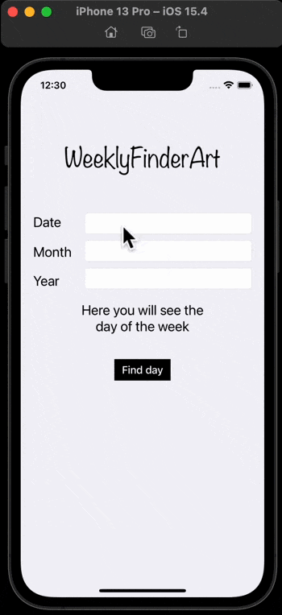
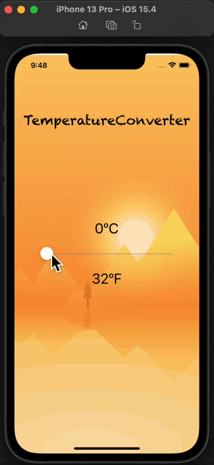
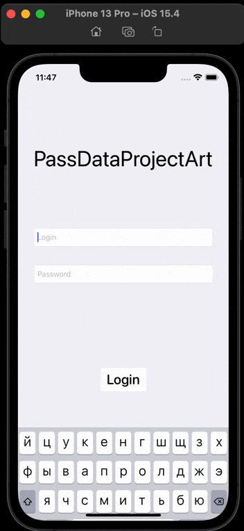
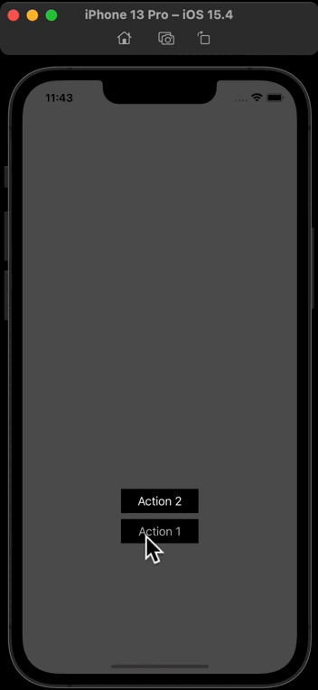
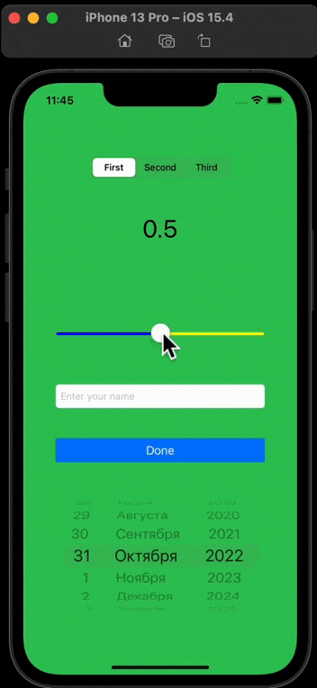

Здесь содержатся примеры маленьких приложений, с целью знакомства и изучения различной функциональности. В каждом из приложений есть готовые шаблоны/примеры использования. Ниже описание:

- **[WeeklyFinderArt](https://github.com/artemiosdev/Swift-Manual-my-notes/tree/main/small%20apps%2C%20examples/WeeklyFinderArt/WeeklyFinderArt)** - работа с [Calendar()](https://developer.apple.com/documentation/foundation/calendar) day, month, year, [DateComponents()](https://developer.apple.com/documentation/foundation/datecomponents), [DateFormatter()](https://developer.apple.com/documentation/foundation/dateformatter), вывод даты [dateFormat](https://developer.apple.com/documentation/foundation/dateformatter/1413514-dateformat), взаимодействие с клавиатурой [touchesBegan()](https://developer.apple.com/documentation/uikit/uiresponder/1621142-touchesbegan/) - сообщает этому объекту, что в представлении или окне произошло одно или несколько новых касаний.

- **[TemperatureConverter](https://github.com/artemiosdev/Swift-Manual-my-notes/tree/main/small%20apps%2C%20examples/TemperatureConverter/TemperatureConverter/TemperatureConverter)** - используется [UISlider](https://developer.apple.com/documentation/uikit/uislider), округление [round()](https://www.advancedswift.com/rounding-floats-and-doubles-in-swift/) 

- **[PassDataProjectArt](https://github.com/artemiosdev/Swift-Manual-my-notes/tree/main/small%20apps%2C%20examples/PassDataProjectArt/PassDataProjectArt)** - UITextField c login и password, выбор segue  учитывая идентификатор [performSegue(withIdentifier: , sender: )](https://developer.apple.com/documentation/uikit/uiviewcontroller/1621413-performsegue), возврат segue на другой экран с помощью  unwind Segue реализуется как к элементом, так и с View (предпочтительнее). Взаимодействие с [UIStoryboardSegue](https://developer.apple.com/documentation/uikit/uistoryboardsegue/) (destination, source, identifier). Передача данных с одного View на другой, [prepare(for segue: UIStoryboardSegue, sender: )](https://developer.apple.com/documentation/uikit/uiviewcontroller/1621490-prepare) этот метод уведомляет view controller о том, что переход вот-вот будет выполнен. . Взаимодействие с клавиатурой [touchesBegan()](https://developer.apple.com/documentation/uikit/uiresponder/1621142-touchesbegan/) - сообщает этому объекту, что в представлении или окне произошло одно или несколько новых касаний.

- **[UILabelAndUIButton](https://github.com/artemiosdev/Swift-Manual-my-notes/tree/main/small%20apps%2C%20examples/UILabel/UILabel)**, пример использования [UIButton](https://developer.apple.com/documentation/uikit/uibutton) и [UILabel](https://developer.apple.com/documentation/uikit/uilabel), свойства элементов, верстка кодом `(isHidden, font, text, setTitle, titleLabel?.text, textColor, setTitleColor, backgroundColor)`

- **[UISegmentedControl, UISlider, UITextField, UIScrollView, UIDatePicker, UISwitch, UIPickerView]()**, 

